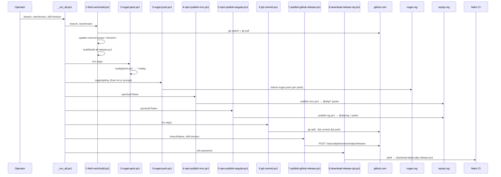

The `deploy/` folder is the ABP team's release pipeline. `deploy/_run_all.ps1` orchestrates eight numbered scripts that bump the version, build, pack, push to nuget.org, publish to npmjs.org, commit the version bump, create the GitHub release and trigger an SSH-driven download to a Natro CI box.

This page walks every script and the `new-github-release-function.psm1` module.

## Prerequisites

`deploy/readme.md` lists three secret files that have to live next to the scripts (all `.gitignore`d):

* `npm-auth-token.txt` — npmjs.org auth GUID.
* `nuget-api-key.txt` — nuget.org API key.
* `ssh-password.txt` — `jenkins` SSH user password for the Natro download box.

A fourth file appears in `deploy/7-publish-github-release.ps1`:

* `github-api-key.txt` — GitHub personal access token with `repo` / `public_repo` scope.

Plus `plink.exe` (PuTTY's SSH client) is checked into the folder for `8-download-release-zip.ps1`.

## Sequence overview



## `deploy/_run_all.ps1`

```powershell
param(
  [string]$branch,
  [string]$newVersion,
  [string]$isRcVersion
)

. ..\nupkg\common.ps1

Start-Transcript -Append _run_all_log.txt

if (!$branch)
{
    $branch = Read-Host "Enter the branch name"
}

if (!$newVersion)
{
    $currentVersion = Get-Current-Version
    $newVersion = Read-Host "Current version is '$currentVersion'. Enter the new version (empty for no change) "
    if($newVersion -eq "")
    {
        $newVersion = $currentVersion
    }
}

if ($isRcVersion -eq "")
{
    $isRcVersion = Read-Host "Is this a RC/Preview version? (y/n)"
}

$publishGithubReleaseParams = @{
    branchName=$branch
    isRcVersion=$isRcVersion
}


./1-fetch-and-build.ps1 $branch $newVersion
./2-nuget-pack.ps1
./3-nuget-push.ps1
./4-npm-publish-mvc.ps1
./5-npm-publish-angular.ps1
./6-git-commit.ps1
./7-publish-github-release.ps1 @publishGithubReleaseParams
./8-download-release-zip.ps1

Stop-Transcript
```

Key behaviours:

* **Three inputs** — `branch`, `newVersion`, `isRcVersion`. Anything omitted is read interactively via `Read-Host`. The current version is fetched through `Get-Current-Version` from `nupkg/common.ps1` so operators see what `common.props` currently holds.
* **Transcript** — `Start-Transcript -Append _run_all_log.txt` captures stdout/stderr of the whole run into a local log; `Stop-Transcript` finalises it at the end. Crucially, `-Append` means re-runs accumulate.
* **Splatting** — `@publishGithubReleaseParams` is PowerShell splatting; `branchName` and `isRcVersion` are forwarded to script 7 as named parameters.
* The scripts are intentionally idempotent at the package layer (`--skip-duplicate` on NuGet, `lerna version --skip-git` on npm) so a partial-failure re-run won't corrupt the registries.

## `deploy/1-fetch-and-build.ps1`

```powershell
param(
  [string]$branch,
  [string]$newVersion
)

. ..\nupkg\common.ps1

if (!$branch)
{
    $branch = Read-Host "Enter the branch name"
}

#----------- Read the current version from common.props -----------
$commonPropsFilePath = resolve-path "../common.props"
$commonPropsXmlCurrent = [xml](Get-Content $commonPropsFilePath )
$currentVersion = $commonPropsXmlCurrent.Project.PropertyGroup.Version.Trim()

if (!$newVersion)
{
    $newVersion = Read-Host "Current version is '$currentVersion'. Enter the new version (empty for no change) "
    if($newVersion -eq "")
    {
        $newVersion = $currentVersion
    }
}

if ($newVersion -ne $currentVersion){
    # Update common.props for version attribute
    $commonPropsXmlCurrent.Project.PropertyGroup.Version = $newVersion
    $commonPropsXmlCurrent.Save( $commonPropsFilePath )
    #check if it's updated...
    $commonPropsXmlNew = [xml](Get-Content $commonPropsFilePath )
    $newVersionAfterUpdate = $commonPropsXmlNew.Project.PropertyGroup.Version
    echo "`n`nNew version updated as '$newVersionAfterUpdate' in $commonPropsFilePath`n"
}


################################################################
Write-Info "Pulling ABP $branch branch from GitHub"
cd ..
git switch $branch
git pull origin

################################################################
Write-Info "Building ABP repository"
cd build
.\build-all-release.ps1

Write-Info "Completed: Building ABP repository"
cd ..\deploy #always return to the deploy directory
```

| Step | Cmdlet | Side effect |
|------|--------|-------------|
| Read version | `[xml](Get-Content $commonPropsFilePath)` | Loads `common.props` as an XML DOM |
| Bump version | `.Project.PropertyGroup.Version = $newVersion` + `.Save(...)` | Mutates `common.props` in place — this is the source-of-truth update that every other script reads |
| Switch branch | `git switch $branch` | Branch must exist locally |
| Pull | `git pull origin` | Updates working tree |
| Build | `cd build; .\build-all-release.ps1` | Runs the full Release build of every solution (see [Build Scripts](/build/build-scripts)) |
| Restore CWD | `cd ..\deploy` | Every script ends back in `deploy/` |

The XML save is intentionally a *string-preserving* update — only the `<Version>` element's inner text changes. Comments and formatting elsewhere in `common.props` are preserved by PowerShell's XML DOM.

## `deploy/2-nuget-pack.ps1`

```powershell
. ..\nupkg\common.ps1
Write-Info "Creating NuGet packages"

echo "`n-----=====[ CREATING NUGET PACKAGES ]=====-----`n"
cd ..\nupkg
powershell -File pack.ps1
echo "`n-----=====[ CREATING NUGET PACKAGES COMPLETED ]=====-----`n"

Write-Info "Completed: Creating NuGet packages"
cd ..\deploy #always return to the deploy directory
```

A thin shim: `cd ..\nupkg`, run `powershell -File pack.ps1`, `cd` back. The actual packing — `dotnet restore` per solution then `dotnet pack -c Release --no-build` per project — happens in `nupkg/pack.ps1`. See [NuGet Packaging](/build/nuget-packaging) for the contents of that script. Spawning a fresh `powershell -File` is deliberate: it ensures `pack.ps1`'s own dot-sourced `common.ps1` does not pollute the outer transcript's variable scope.

## `deploy/3-nuget-push.ps1`

```powershell
param(
  [string]$nugetApiKey
)

. ..\nupkg\common.ps1

if (!$nugetApiKey)
{
    #reading password from file content
    $passwordFileName = "nuget-api-key.txt"
    $pathExists = Test-Path -Path $passwordFileName -PathType Leaf
    if ($pathExists)
    {
        $nugetApiKey = Get-Content $passwordFileName
        echo "Using NuGet API Key from $passwordFileName ..."
    }
}

if (!$nugetApiKey)
{
    $nugetApiKey = Read-Host "Enter the NuGet API KEY"
}

Write-Info "Pushing packages to NuGet"
echo "`n-----=====[ PUSHING PACKAGES TO NUGET ]=====-----`n"
cd ..\nupkg
powershell -File push_packages.ps1 $nugetApiKey
echo "`n-----=====[ PUSHING PACKAGES TO NUGET COMPLETED ]=====-----`n"
Write-Info "Completed: Pushing packages to NuGet"

cd ..\deploy #always return to the deploy directory
```

The credential lookup pattern (parameter → file → prompt) is shared by every script that needs a secret. `nupkg/push_packages.ps1` is what actually iterates the project list and runs `dotnet nuget push <name>.<version>.nupkg --skip-duplicate -s https://api.nuget.org/v3/index.json --api-key "$apiKey"` per pack.

## `deploy/4-npm-publish-mvc.ps1`

```powershell
param(
  [string]$npmAuthToken
)

. ..\nupkg\common.ps1

if (!$npmAuthToken)
{
    $passwordFileName = "npm-auth-token.txt"
    $pathExists = Test-Path -Path $passwordFileName -PathType Leaf
    if ($pathExists)
    {
        $npmAuthToken = Get-Content $passwordFileName
        echo "Using NPM Auth Token from $passwordFileName ..."
    }
}

if (!$npmAuthToken)
{
    $npmAuthToken = Read-Host "Enter the NPM Auth Token"
}

cd ..\npm

#----------------------------------------------------------------------------

echo "`nSetting npmjs.org auth-token token`n"
npm set //registry.npmjs.org/:_authToken $npmAuthToken

#----------------------------------------------------------------------------

Write-Info "Pushing MVC packages to NPM"
echo "`n-----=====[ PUSHING MVC PACKS TO NPM ]=====-----`n"
powershell -File publish-mvc.ps1
echo "`n-----=====[ PUSHING MVC PACKS TO NPM COMPLETED ]=====-----`n"
Write-Info "Completed: Pushing MVC packages to NPM"

cd ..\deploy #always return to the deploy directory
```

Key calls:

* `npm set //registry.npmjs.org/:_authToken $npmAuthToken` writes the token into `~/.npmrc` so the subsequent `npm publish`es authenticate.
* `powershell -File publish-mvc.ps1` runs the MVC publish flow from `npm/publish-mvc.ps1` (Lerna bump → `replace-with-tilde` → `validate-versions` → `lerna exec npm publish`). See [NPM Publish](/build/npm-publish) for the script body.

## `deploy/5-npm-publish-angular.ps1`

```powershell
param(
  [string]$npmAuthToken
)

. ..\nupkg\common.ps1

if (!$npmAuthToken)
{
    $passwordFileName = "npm-auth-token.txt"
    $pathExists = Test-Path -Path $passwordFileName -PathType Leaf
    if ($pathExists)
    {
        $npmAuthToken = Get-Content $passwordFileName
        echo "Using NPM Auth Token from $passwordFileName ..."
    }
}

if (!$npmAuthToken)
{
    $npmAuthToken = Read-Host "Enter the NPM Auth Token"
}

cd ..\npm

#----------------------------------------------------------------------------

echo "`nSetting npmjs.org auth-token token`n"
npm set //registry.npmjs.org/:_authToken $npmAuthToken

#----------------------------------------------------------------------------

Write-Info "Pushing MVC packages to NPM"
echo "`n-----=====[ PUSHING MVC PACKS TO NPM ]=====-----`n"
powershell -File publish-ng.ps1
echo "`n-----=====[ PUSHING MVC PACKS TO NPM COMPLETED ]=====-----`n"
Write-Info "Completed: Pushing MVC packages to NPM"

cd ..\deploy #always return to the deploy directory
```

Almost identical to script 4 — only the inner invocation changes (`publish-ng.ps1` instead of `publish-mvc.ps1`). The banner text still says "MVC" in v7.4.0; this is a known cosmetic bug, not a functional one. The Angular publish flow does:

1. `cd ng-packs && yarn install`
2. `yarn update-version <version>` (Nx generator)
3. `cd scripts && yarn install`
4. `npm run publish-packages -- --nextVersion <version> --skipGit --registry https://registry.npmjs.org --skipVersionValidation`
5. `cd ../../ && cd scripts && yarn remove-lock-files`
6. `cd .. && yarn update-gulp --registry https://registry.npmjs.org`

See [NPM Publish](/build/npm-publish) for the source.

## `deploy/6-git-commit.ps1`

```powershell
. ..\nupkg\common.ps1

cd ..

Write-Info "Committing changes to GitHub"
echo "`n-----=====[ COMMITTING CHANGES ]=====-----`n"
git add .
git commit -m Update_NPM_Package_Versions
git push

echo "`n-----=====[ COMMITTING CHANGES COMPLETED ]=====-----`n"
Write-Info "Completed: Committing changes to GitHub"

cd deploy #always return to the deploy directory
```

What gets committed:

* The `<Version>` bump from script 1 (in `common.props`).
* Every `packs/*/package.json` bump from script 4 (Lerna stamped them).
* Every `ng-packs/packages/*/package.json` bump from script 5.
* The `wwwroot/libs/abp/*` refreshes produced by `update-gulp.js` in script 5.

The commit message is the literal `Update_NPM_Package_Versions` (underscores, not a quoted string with spaces — `git commit -m` is positional here). The push goes to whatever branch was checked out in script 1.

## `deploy/7-publish-github-release.ps1`

```powershell
param(
  [string]$branchName,
  [string]$version,
  [string]$isRcVersion,
  [string]$isDraft,
  [string]$gitHubApiKey
)

. ..\nupkg\common.ps1

Write-Info "Publishing GitHub Release..." ##  Further info see https://docs.github.com/en/rest/reference/releases

if ($isRcVersion -eq "")
{
    $isRcVersion = Read-Host "Is this a RC/Preview version? (y/n)"
}

if ($gitHubApiKey -eq "")
{
    $gitHubApiKey = Read-File "github-api-key.txt"
    echo "GitHub API Key assigned from github-api-key.txt"
}

if(!$gitHubApiKey)
{
    $gitHubApiKey = Read-Host "Enter the GitHub API Key"
}

if ($version -eq "")
{
    $version = Get-Current-Version
}

if ($branchName -eq "")
{
    $branchName = Get-Current-Branch
}

if ($isDraft -eq "")
{
    $draft = $FALSE
}
else
{
    $draft =  [boolean]::Parse($isDraft)
}

##############################################################################
$preRelease = ( ($isRcVersion -eq "true") -or ($isRcVersion -eq "y") -or ($isRcVersion -eq "rc") )
$gitHubUsername = 'abpframework'
$gitHubRepository = 'abp'
$releaseNotes = ''
##############################################################################

echo "Current version: $version"
echo "Current branch: $branchName"
echo "Preview version: $preRelease"
echo "Draft: $draft"

##############################################################################

$releaseData = @{
   tag_name = $version;
   target_commitish = $branchName;
   name = $version;
   body = $releaseNotes;
   draft = $draft;
   prerelease = $preRelease;
 }

$releaseParams = @{
   Uri = "https://api.github.com/repos/$gitHubUsername/$gitHubRepository/releases";
   Method = 'POST';
   Headers = @{
     Authorization = 'Basic ' + [Convert]::ToBase64String(
     [Text.Encoding]::ASCII.GetBytes($gitHubApiKey + ":x-oauth-basic"));
   }
   ContentType = 'application/json';
   Body = (ConvertTo-Json $releaseData -Compress)
 }

$response = Invoke-RestMethod @releaseParams

echo  "---------------------------------------------"
echo "$version has been successfully released."
```

Behaviour:

* `Get-Current-Version` and `Get-Current-Branch` (from `nupkg/common.ps1`) supply defaults when the parameters are blank — so even an interactive operator only ever has to confirm the RC flag.
* `$preRelease` accepts `true`, `y` or `rc` as truthy values for `isRcVersion`. Anything else is treated as a stable release.
* The request is a plain `POST` to `https://api.github.com/repos/abpframework/abp/releases` with the basic-auth header `Basic base64(<token>:x-oauth-basic)`. This is the legacy "personal access token over basic auth" flow, which GitHub still accepts for `repo`-scoped tokens.
* `target_commitish = $branchName` means GitHub creates the tag pointing at the tip of `$branchName` at request time — which is exactly where script 6 just pushed.
* `body = ''` — release notes are empty. The deploy `readme.md` notes that for a long stretch this step was *not active* and operators manually clicked "Auto-generate release notes" in the GitHub UI; the script is the automated equivalent and just leaves the body empty.

### `deploy/new-github-release-function.psm1`

A more powerful, optional module bundled in the folder. It exports a single function:

```powershell
Export-ModuleMember -Function New-GitHubRelease
```

`New-GitHubRelease` accepts everything script 7 does plus asset uploads:

```powershell
function New-GitHubRelease
{
    [CmdletBinding()]
    param
    (
        [Parameter(Mandatory=$true)] [string]   $GitHubUsername,
        [Parameter(Mandatory=$true)] [string]   $GitHubRepositoryName,
        [Parameter(Mandatory=$true)] [string]   $GitHubAccessToken,
        [Parameter(Mandatory=$true)] [string]   $TagName,
        [Parameter(Mandatory=$false)] [string]  $ReleaseName,
        [Parameter(Mandatory=$false)] [string]  $ReleaseNotes,
        [Parameter(Mandatory=$false)] [string[]] $AssetFilePaths,
        [Parameter(Mandatory=$false)] [string]  $Commitish,
        [Parameter(Mandatory=$false)] [bool]    $IsDraft = $false,
        [Parameter(Mandatory=$false)] [bool]    $IsPreRelease = $false
    )
    ...
}
```

The `PROCESS` block performs two steps:

1. **Create the release** — `Invoke-RestMethod` against `https://api.github.com/repos/$GitHubUsername/$GitHubRepositoryName/releases` with the basic-auth header.
2. **Upload assets** — for every file in `$AssetFilePaths`, `POST <upload_url>?name=<filename>` with `Content-Type: application/zip` and `InFile = $filePath`.

It also wraps `Invoke-RestMethod` with `Invoke-RestMethodAndThrowDescriptiveErrorOnFailure` which surfaces request/response details on a 4xx/5xx, and enables TLS 1.2 via `Set-SecurityProtocolForThread`:

```powershell
function Set-SecurityProtocolForThread
{
    [System.Net.ServicePointManager]::SecurityProtocol = [System.Net.SecurityProtocolType]::Tls12 -bor [System.Net.SecurityProtocolType]::Tls11 -bor [System.Net.SecurityProtocolType]::Tls
}
```

The result hashtable returned by `New-GitHubRelease`:

| Field | Meaning |
|-------|---------|
| `Succeeded` | `$true` only when both creation and all asset uploads succeeded |
| `ReleaseCreationSucceeded` | Release row was created |
| `AllAssetUploadsSucceeded` | All file uploads succeeded (or `$null` when there were none) |
| `ReleaseUrl` | `html_url` of the new release |
| `ErrorMessage` | First failure description |

The module is not wired into `_run_all.ps1` — operators who want asset uploads have to `Import-Module .\new-github-release-function.psm1` and call `New-GitHubRelease` explicitly. Script 7 is the always-on, body-less version.

## `deploy/8-download-release-zip.ps1`

```powershell
param(
  [string]$password
)

. ..\nupkg\common.ps1

if (!$password)
{
    #reading password from file content
    $sshPasswordFileName = "ssh-password.txt"
    $password = Get-Content $sshPasswordFileName
    echo "Using SSH password from $sshPasswordFileName ..."
}

if (!$password)
{
    $password = Read-Host "Enter the Natro jenkins user password"
}

# Get the current version
[xml]$commonPropsXml = Get-Content "../common.props"
$version = $commonPropsXml.Project.PropertyGroup.Version
echo "`n---===[ Current version: $version ]===---"

#---------------------------------------------------------------------
Write-Info "Downloading release zip into Natro"
echo "`n---===[ Running SSH commands on NATRO ]===---"
echo "`nDownloading release file into Natro..."

plink.exe -ssh jenkins@94.73.164.234 -pw $password -P 22 -batch "powershell -File c:\ci\scripts\download-latest-abp-release.ps1 ${version}"

Write-Info "Completed: Downloading release zip into Natro completed"
```

Two things to notice:

* **`plink.exe -batch`** — PuTTY's link in batch mode (no interactive prompts). The host is the hard-coded Natro CI IP `94.73.164.234`, the user is `jenkins`, port 22.
* **Remote command** — `powershell -File c:\ci\scripts\download-latest-abp-release.ps1 ${version}` triggers a server-side script on the Natro box that downloads the freshly tagged GitHub release zip. That script is not in the OSS repo — it lives on the CI server itself.

This is the only step that interacts with non-public infrastructure; the others all hit nuget.org, npmjs.org and api.github.com.

## Putting the numbers together

| # | Script | Side effect | Talks to |
|---|--------|-------------|----------|
| 0 | `_run_all.ps1` | Orchestration + transcript | — |
| 1 | `1-fetch-and-build.ps1` | Bump `common.props` version, git pull, full Release build | GitHub (git), local disk |
| 2 | `2-nuget-pack.ps1` | `nupkg/pack.ps1` produces `*.nupkg` files | Local disk |
| 3 | `3-nuget-push.ps1` | `dotnet nuget push --skip-duplicate` per pack | api.nuget.org |
| 4 | `4-npm-publish-mvc.ps1` | Lerna bump + npm publish for `packs/*` | registry.npmjs.org |
| 5 | `5-npm-publish-angular.ps1` | Nx update-version + publish for `ng-packs/dist/packages/*` + `update-gulp` | registry.npmjs.org |
| 6 | `6-git-commit.ps1` | `git add . && git commit -m Update_NPM_Package_Versions && git push` | GitHub (git) |
| 7 | `7-publish-github-release.ps1` | `POST /releases` | api.github.com |
| 8 | `8-download-release-zip.ps1` | `plink` SSH into Natro CI to mirror the zip | Natro CI server |

The whole pipeline is single-machine, single-operator and synchronous: each step blocks the next, every failure aborts the chain, and the only retry strategy is "fix the secret/network and re-run from the failing step".

## Local reproduction checklist

If you are doing a release locally, this is the minimum setup:

1. Drop the four secret files into `deploy/`:
   * `nuget-api-key.txt`
   * `npm-auth-token.txt`
   * `github-api-key.txt`
   * `ssh-password.txt` (only if you want step 8 to work)
2. Make sure `plink.exe` is on `PATH` or kept in `deploy/`.
3. From `deploy/`, run:

   ```powershell
   ./_run_all.ps1 -branch dev -newVersion 7.4.0 -isRcVersion n
   ```

4. Watch `_run_all_log.txt` accumulate.

## Related pages

* [Build Scripts](/build/build-scripts) — the `build-all-release.ps1` invoked from script 1.
* [NuGet Packaging](/build/nuget-packaging) — the `nupkg/pack.ps1` and `nupkg/push_packages.ps1` invoked from scripts 2 and 3.
* [NPM Publish](/build/npm-publish) — `publish-mvc.ps1` / `publish-ng.ps1` invoked from scripts 4 and 5.
* [Test Infrastructure](/build/test-infrastructure) — what `test-all.ps1` runs before a release rehearsal.
