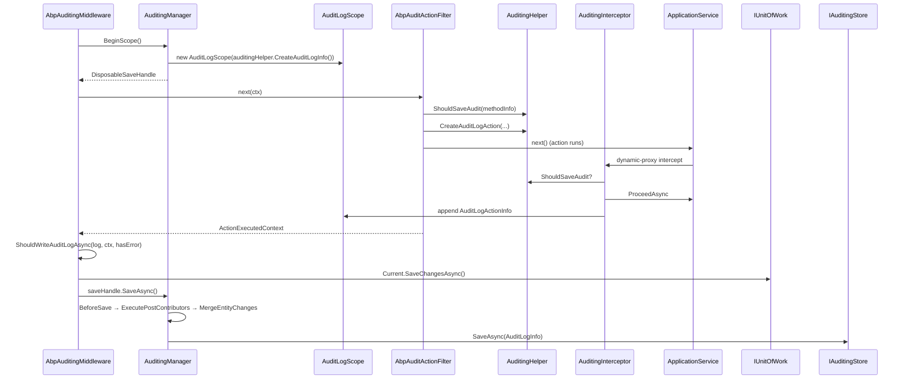

ABP records who called what, when, with which arguments — even when the call originated from a background job or a non-HTTP host. The flow is split into three layers: ambient scope (`AuditingManager`), per-method capture (`AuditingInterceptor` and `AbpAuditActionFilter`), and persistence (`IAuditingStore` defaulting to log-only `SimpleLogAuditingStore` and replaced by `AuditingStore` from the `Volo.Abp.AuditLogging` module).

## Sequence



## Step-by-step walk-through

1. **Scope opens at the edge.** `AbpAuditingMiddleware.InvokeAsync` (`framework/src/Volo.Abp.AspNetCore/Volo/Abp/AspNetCore/Auditing/AbpAuditingMiddleware.cs`) short-circuits when `AbpAuditingOptions.IsEnabled` is false or the URL is in `AbpAspNetCoreAuditingOptions.IgnoredUrls`. Otherwise:
   ```csharp
   using (var saveHandle = _auditingManager.BeginScope())
   {
       try { await next(context); ... }
       catch (Exception ex) { hasError = true; _auditingManager.Current.Log.Exceptions.Add(ex); throw; }
       finally
       {
           if (await ShouldWriteAuditLogAsync(...))
           {
               if (UnitOfWorkManager.Current != null) await UnitOfWorkManager.Current.SaveChangesAsync();
               await saveHandle.SaveAsync();
           }
       }
   }
   ```

2. **Ambient scope.** `AuditingManager.BeginScope` (`framework/src/Volo.Abp.Auditing/Volo/Abp/Auditing/AuditingManager.cs`) pushes a new `AuditLogScope` (which wraps an `AuditLogInfo`) onto `IAmbientScopeProvider<IAuditLogScope>` under the key `Volo.Abp.Auditing.IAuditLogScope`:
   ```csharp
   var ambientScope = _ambientScopeProvider.BeginScope(
       AmbientContextKey,
       new AuditLogScope(_auditingHelper.CreateAuditLogInfo()));
   return new DisposableSaveHandle(this, ambientScope, Current!.Log, Stopwatch.StartNew());
   ```

3. **`CreateAuditLogInfo`.** `AuditingHelper.CreateAuditLogInfo` (`framework/src/Volo.Abp.Auditing/Volo/Abp/Auditing/AuditingHelper.cs`) snapshots the ambient context — `ApplicationName`, `TenantId`, `TenantName`, `UserId`, `UserName`, `ClientId`, `CorrelationId`, `ExecutionTime` from `IClock`, plus impersonator metadata via `CurrentUser.FindImpersonator*`. It then calls `ExecutePreContributors(auditInfo)` so options-registered `AuditLogContributor`s can decorate the log.

4. **MVC capture.** When a controller action runs, `AbpAuditActionFilter` (`framework/src/Volo.Abp.AspNetCore.Mvc/Volo/Abp/AspNetCore/Mvc/Auditing/AbpAuditActionFilter.cs`) calls `ShouldSaveAudit`:
   - Auditing must be enabled.
   - The descriptor must be a controller action.
   - `IAuditingManager.Current` must be non-null (i.e. the middleware scope is active).
   - `IAuditingHelper.ShouldSaveAudit(methodInfo, defaultValue)` must return true.
   `GetDefaultAuditBehavior` returns false for `IntegrationServiceAttribute`-marked classes unless `AbpAuditingOptions.IsEnabledForIntegrationServices` is on.

5. **Action record.** If audit is on, the filter calls `IAuditingHelper.CreateAuditLogAction(auditLog, controllerType, methodInfo, ActionArguments)` and starts a `Stopwatch`. After `next()`, it records `ExecutionDuration` and appends the `AuditLogActionInfo` to `auditLog.Actions`. The filter also wraps the controller in `AbpCrossCuttingConcerns.Applying(context.Controller, AbpCrossCuttingConcerns.Auditing)` so the interceptor on the same instance skips its own logging.

6. **Interceptor path.** For non-controller call paths (background jobs, console hosts, nested application services on the *server* side without `AvoidDuplicate`), `AuditingInterceptor` (`framework/src/Volo.Abp.Auditing/Volo/Abp/Auditing/AuditingInterceptor.cs`) runs. Selection by `AuditingInterceptorRegistrar.ShouldIntercept`:
   - The type is not in `DynamicProxyIgnoreTypes`.
   - `IAuditingEnabled` is implemented, or `AuditedAttribute` is on the class/method, and `DisableAuditingAttribute` is not present.

7. **Existing scope vs new.** Inside the interceptor:
   ```csharp
   if (auditingManager.Current != null)
       await ProceedByLoggingAsync(...);
   else
       await ProcessWithNewAuditingScopeAsync(...);
   ```
   `ProcessWithNewAuditingScopeAsync` opens a scope just like the middleware does, persists on success via `saveHandle.SaveAsync()`, and rolls back via the `IUnitOfWork` if one is active.

8. **Exception capture.** Both the filter and the interceptor wrap the call in `try/catch/finally` and add the raised exception to `auditLog.Exceptions` so it is searchable later.

9. **`ShouldWriteAuditLogAsync` gate.** The middleware's gating logic mirrors `AuditingInterceptor.ShouldWriteAuditLogAsync`:
   - If any `AbpAuditingOptions.AlwaysLogSelectors` returns true, save.
   - If `AlwaysLogOnException && hasError`, save.
   - If anonymous and `IsEnabledForAnonymousUsers` is false, skip.
   - If `GET` request and `IsEnabledForGetRequests` is false, skip.
   - Otherwise save.

10. **Persistence.** `DisposableSaveHandle.SaveAsync` calls `AuditingManager.SaveAsync`, which runs `BeforeSave` → `ExecutePostContributors` → `MergeEntityChanges` (combines entity change records flushed by EF Core change-tracker) → `IAuditingStore.SaveAsync(auditInfo)`:
    - `SimpleLogAuditingStore` (`framework/src/Volo.Abp.Auditing/Volo/Abp/Auditing/SimpleLogAuditingStore.cs`) logs to `ILogger`.
    - When the `Volo.Abp.AuditLogging.Domain` module is loaded, `AuditingStore` (`modules/audit-logging/src/Volo.Abp.AuditLogging.Domain/Volo/Abp/AuditLogging/AuditingStore.cs`) converts via `IAuditLogInfoToAuditLogConverter` and persists with `IAuditLogRepository.InsertAsync`. EF Core implementation lives at `modules/audit-logging/src/Volo.Abp.AuditLogging.EntityFrameworkCore/...`.

11. **Persistence error handling.** When `AbpAuditingOptions.HideErrors` is true (default), `AuditingStore.SaveAsync` catches and logs persistence errors instead of propagating them — losing audit data is preferable to failing user requests in this default.

## Entity change tracking

`IAuditingHelper.IsEntityHistoryEnabled(entityType)` (same file) decides whether EF Core should record `EntityChangeInfo`/`EntityPropertyChangeInfo` lists onto the current `AuditLogInfo`. Selectors in `AbpAuditingOptions.EntityHistorySelectors` (`framework/src/Volo.Abp.Auditing/Volo/Abp/Auditing/EntityHistorySelectorList.cs`) determine inclusion by type. The actual change collection is built by `EfCoreEntityChangeTracker` in the EF Core layer (out of scope for this page).

## Hooks and extension points

| Hook | File | Purpose |
| --- | --- | --- |
| `[Audited]` | `framework/src/Volo.Abp.Auditing.Contracts/Volo/Abp/Auditing/AuditedAttribute.cs` | Force audit on a class or method. |
| `[DisableAuditing]` | `framework/src/Volo.Abp.Auditing.Contracts/Volo/Abp/Auditing/DisableAuditingAttribute.cs` | Opt out. |
| `IAuditingEnabled` | `framework/src/Volo.Abp.Auditing.Contracts/Volo/Abp/Auditing/IAuditingEnabled.cs` | Convention marker. |
| `AuditLogContributor` | `framework/src/Volo.Abp.Auditing/Volo/Abp/Auditing/AuditLogContributor.cs` | Pre/post-contribute to `AuditLogInfo` (e.g. `AspNetCoreAuditLogContributor`). |
| `IAuditingStore` | `framework/src/Volo.Abp.Auditing/Volo/Abp/Auditing/IAuditingStore.cs` | Replace persistence. |
| `IAuditSerializer` | `framework/src/Volo.Abp.Auditing/Volo/Abp/Auditing/IAuditSerializer.cs` | Customize argument serialization. |
| `IAuditPropertySetter` | `framework/src/Volo.Abp.Auditing/Volo/Abp/Auditing/IAuditPropertySetter.cs` | Stamp `CreatorId`, `LastModificationTime`, etc. on entities. |
| `AbpAuditingOptions.AlwaysLogSelectors` | `framework/src/Volo.Abp.Auditing/Volo/Abp/Auditing/AbpAuditingOptions.cs` | Force-log specific operations. |
| `IEntityHistorySelectorList` | `framework/src/Volo.Abp.Auditing/Volo/Abp/Auditing/IEntityHistorySelectorList.cs` | Pick entity types whose changes are tracked. |

## Related options classes

| Options | File |
| --- | --- |
| `AbpAuditingOptions` | `framework/src/Volo.Abp.Auditing/Volo/Abp/Auditing/AbpAuditingOptions.cs` |
| `AbpAspNetCoreAuditingOptions` | `framework/src/Volo.Abp.AspNetCore/Volo/Abp/AspNetCore/Auditing/AbpAspNetCoreAuditingOptions.cs` |
| `EntityHistorySelectorList` | `framework/src/Volo.Abp.Auditing/Volo/Abp/Auditing/EntityHistorySelectorList.cs` |

## Gotchas

- **Default store is just the logger.** If you don't reference `Volo.Abp.AuditLogging.Domain`, every audit log goes through `SimpleLogAuditingStore` — useful for local development but worthless for compliance.
- **`HideErrors` swallows storage failures.** With the default `HideErrors = true`, a broken database connection silently drops audit logs (logged at warning level). Flip it to false in regulated environments.
- **GET requests are silent by default.** `IsEnabledForGetRequests = false`. Force-log them via `AbpAuditingOptions.AlwaysLogSelectors` if you need read auditing.
- **Anonymous users are logged by default.** `IsEnabledForAnonymousUsers = true`. Disable to comply with privacy rules.
- **Cross-cutting de-dup.** `AbpCrossCuttingConcerns.Applying(controller, Auditing)` in the filter stops the interceptor from double-recording when the same call passes through both the MVC pipeline and `AbpController` derivations. Custom non-controller wrappers must apply the same guard.
- **Action arguments are serialized via `JsonAuditSerializer`.** Heavy payloads bloat the log table. Use `[DisableAuditing]` per-parameter (not supported) or override `IAuditSerializer` to redact.
- **Distributed events.** When you log inside a UoW, the middleware calls `UnitOfWorkManager.Current.SaveChangesAsync()` *before* `saveHandle.SaveAsync()`, so any DB writes triggered by the audit store are persisted in the same transaction.

## Related pages

<CardGroup cols={2}>
  <Card title="HTTP request lifecycle" icon="route" href="/flows/http-request-lifecycle" />
  <Card title="Unit of work" icon="database" href="/flows/unit-of-work" />
  <Card title="Audit logging module" icon="file-shield" href="/modules/audit-logging" />
  <Card title="Authorization flow" icon="shield" href="/flows/authorization-flow" />
</CardGroup>
