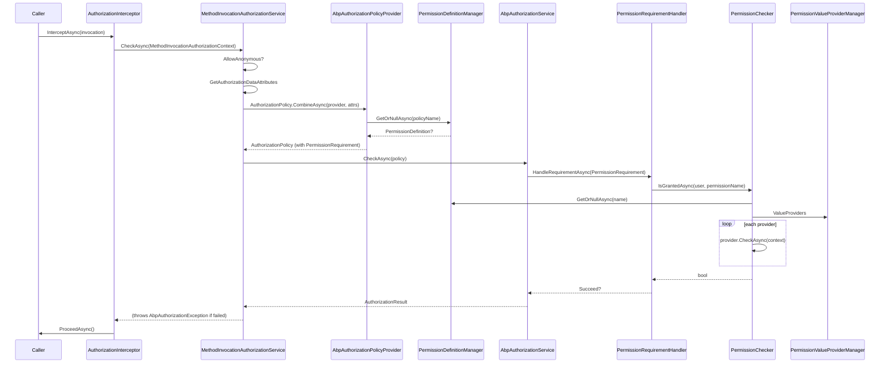

ABP routes both ASP.NET Core `[Authorize]` and ABP-specific permission checks through a single `IAbpAuthorizationService`. Every method on a class decorated with `[Authorize]` is intercepted, mapped to a `AuthorizationPolicy`, and evaluated against the current principal. Permission-named policies fall through to `PermissionChecker`, which fans out to a chain of `IPermissionValueProvider` implementations (`UserPermissionValueProvider`, `RolePermissionValueProvider`, `ClientPermissionValueProvider`).

## Sequence



## Step-by-step walk-through

1. **Interceptor selection.** `AuthorizationInterceptorRegistrar.RegisterIfNeeded` (`framework/src/Volo.Abp.Authorization/Volo/Abp/Authorization/AuthorizationInterceptorRegistrar.cs`) attaches `AuthorizationInterceptor` to any type either decorated with `[AuthorizeAttribute]` or containing a method that is, provided the type is not in `DynamicProxyIgnoreTypes`.

2. **Intercept call.** `AuthorizationInterceptor.InterceptAsync` (`framework/src/Volo.Abp.Authorization/Volo/Abp/Authorization/AuthorizationInterceptor.cs`):
   ```csharp
   await AuthorizeAsync(invocation);
   await invocation.ProceedAsync();
   ```
   `AuthorizeAsync` builds a `MethodInvocationAuthorizationContext(invocation.Method)` and delegates to `IMethodInvocationAuthorizationService.CheckAsync`.

3. **Service layer.** `MethodInvocationAuthorizationService.CheckAsync` (`framework/src/Volo.Abp.Authorization/Volo/Abp/Authorization/MethodInvocationAuthorizationService.cs`) short-circuits when `[AllowAnonymous]` is present:
   ```csharp
   if (AllowAnonymous(context)) return;
   var authorizationPolicy = await AuthorizationPolicy.CombineAsync(
       _abpAuthorizationPolicyProvider,
       GetAuthorizationDataAttributes(context.Method));
   if (authorizationPolicy == null) return;
   await _abpAuthorizationService.CheckAsync(authorizationPolicy);
   ```
   `GetAuthorizationDataAttributes` collects `IAuthorizeData` from the method and, if the method is public, from its declaring type — exactly mirroring ASP.NET Core's MVC behavior.

4. **Policy combination.** `AuthorizationPolicy.CombineAsync` (ASP.NET Core core API) calls `IAuthorizationPolicyProvider.GetPolicyAsync(policyName)` for each `Policy` named on `[Authorize(Policy = ...)]`.

5. **`AbpAuthorizationPolicyProvider`.** (`framework/src/Volo.Abp.Authorization/Volo/Abp/Authorization/AbpAuthorizationPolicyProvider.cs`) first defers to `DefaultAuthorizationPolicyProvider.GetPolicyAsync` (so explicitly registered policies win), then falls back to `IPermissionDefinitionManager.GetOrNullAsync(policyName)`. When a permission with that name exists, it synthesises:
   ```csharp
   var policyBuilder = new AuthorizationPolicyBuilder(Array.Empty<string>());
   policyBuilder.Requirements.Add(new PermissionRequirement(policyName));
   return policyBuilder.Build();
   ```
   `PermissionRequirement` (`framework/src/Volo.Abp.Authorization.Abstractions/Volo/Abp/Authorization/PermissionRequirement.cs`) carries the permission name through evaluation.

6. **`AbpAuthorizationService.CheckAsync`.** `AbpAuthorizationService` (`framework/src/Volo.Abp.Authorization/Volo/Abp/Authorization/AbpAuthorizationService.cs`) extends `DefaultAuthorizationService` and injects `ICurrentPrincipalAccessor.Principal` so that policy evaluation uses the ambient principal even when ASP.NET Core hasn't been spun up (e.g. background jobs). The `CheckAsync` extension on `IAbpAuthorizationService` (`framework/src/Volo.Abp.Authorization.Abstractions/Volo/Abp/Authorization/IAbpAuthorizationService.cs`) throws `AbpAuthorizationException` when the result is `Failed`.

7. **`PermissionRequirementHandler`.** Registered via `AbpAuthorizationModule` against `AuthorizationOptions.AddPolicy`, this handler (`framework/src/Volo.Abp.Authorization.Abstractions/Volo/Abp/Authorization/PermissionRequirementHandler.cs`) calls:
   ```csharp
   if (await _permissionChecker.IsGrantedAsync(context.User, requirement.PermissionName))
       context.Succeed(requirement);
   ```

8. **`PermissionChecker`.** `PermissionChecker.IsGrantedAsync` (`framework/src/Volo.Abp.Authorization/Volo/Abp/Authorization/Permissions/PermissionChecker.cs`):
   - Looks up the `PermissionDefinition` via `IPermissionDefinitionManager.GetOrNullAsync(name)`. Returns false if the permission is missing or disabled.
   - Runs simple-state checks (`ISimpleStateCheckerManager<PermissionDefinition>.IsEnabledAsync`).
   - Validates the permission's `MultiTenancySide` against the user/principal's multi-tenancy side (`ICurrentTenant.GetMultiTenancySide`).
   - Iterates `PermissionValueProviderManager.ValueProviders` (`framework/src/Volo.Abp.Authorization/Volo/Abp/Authorization/Permissions/PermissionValueProviderManager.cs`). Each provider matched by `permission.Providers` (or all providers if none specified) is asked to `CheckAsync(context)`. Built-in providers:
     - `UserPermissionValueProvider` — `framework/src/Volo.Abp.Authorization/Volo/Abp/Authorization/Permissions/UserPermissionValueProvider.cs`.
     - `RolePermissionValueProvider` — same folder.
     - `ClientPermissionValueProvider` — same folder.
   - The first `Granted` result wins; `Prohibited` short-circuits to false.

9. **Permission definitions.** Definitions live in two stores resolved by `PermissionDefinitionManager`:
   - `StaticPermissionDefinitionStore` (`framework/src/Volo.Abp.Authorization/Volo/Abp/Authorization/Permissions/StaticPermissionDefinitionStore.cs`) reads from `AbpPermissionOptions.DefinitionProviders` declared by `PermissionDefinitionProvider` subclasses in each module.
   - `IDynamicPermissionDefinitionStore` (default `NullDynamicPermissionDefinitionStore`) is overridden by the `Volo.Abp.PermissionManagement` module to add tenant/role-scoped permissions.

10. **`AbpAuthorizationException`.** Failures bubble up out of `IAbpAuthorizationService.CheckAsync` as `AbpAuthorizationException` (`framework/src/Volo.Abp.Authorization.Abstractions/Volo/Abp/Authorization/AbpAuthorizationException.cs`). At the HTTP edge, `AbpExceptionHandlingMiddleware` and `AbpExceptionFilter` delegate to `IAbpAuthorizationExceptionHandler` which writes either a 401 (unauthenticated) or 403 (forbidden) response — see [exception handling](/flows/exception-handling).

11. **ASP.NET Core MVC path.** The standard `AuthorizationMiddleware` still runs before MVC routes, evaluating `[Authorize]` at the endpoint level. The interceptor catches *application service* calls invoked from elsewhere (background jobs, hosted services, Razor Pages handlers, gRPC). Both pipelines use the same `AbpAuthorizationPolicyProvider`, so behavior stays consistent.

## Hooks and extension points

| Hook | File | Purpose |
| --- | --- | --- |
| `[Authorize]` / `[AllowAnonymous]` | `Microsoft.AspNetCore.Authorization` | Standard ASP.NET Core attributes — picked up by the interceptor and the policy provider. |
| `IPermissionDefinitionProvider` | `framework/src/Volo.Abp.Authorization/Volo/Abp/Authorization/Permissions/PermissionDefinitionProvider.cs` | Declare permissions for a module. |
| `IPermissionValueProvider` | `framework/src/Volo.Abp.Authorization.Abstractions/Volo/Abp/Authorization/Permissions/IPermissionValueProvider.cs` | Plug a custom source (e.g. feature-flag, organization unit). |
| `IDynamicPermissionDefinitionStore` | `framework/src/Volo.Abp.Authorization/Volo/Abp/Authorization/Permissions/IDynamicPermissionDefinitionStore.cs` | Provide tenant-scoped or DB-driven permissions. |
| `IMethodInvocationAuthorizationService` | `framework/src/Volo.Abp.Authorization.Abstractions/Volo/Abp/Authorization/IMethodInvocationAuthorizationService.cs` | Swap the method-level check (`AlwaysAllowMethodInvocationAuthorizationService` exists for tests). |
| `ISimpleStateChecker<PermissionDefinition>` | `framework/src/Volo.Abp.Authorization/Volo/Abp/Authorization/Permissions/RequirePermissionsSimpleStateChecker.cs` | Gate permission availability by feature/state. |
| `ICurrentPrincipalAccessor` | `framework/src/Volo.Abp.Security/Volo/Abp/Security/Claims/ICurrentPrincipalAccessor.cs` | Provide the principal outside HTTP context (jobs, tests). |

## Related options classes

| Options | File |
| --- | --- |
| `AbpPermissionOptions` | `framework/src/Volo.Abp.Authorization/Volo/Abp/Authorization/Permissions/AbpPermissionOptions.cs` |
| `Microsoft.AspNetCore.Authorization.AuthorizationOptions` | Standard .NET — registered by `AbpAuthorizationModule`. |
| `PermissionDefinition.MultiTenancySide` flags | `framework/src/Volo.Abp.Authorization/Volo/Abp/Authorization/Permissions/PermissionDefinition.cs` |

## Gotchas

- **`AllowAnonymous` wins over class `[Authorize]`.** `MethodInvocationAuthorizationService.AllowAnonymous` checks `IAllowAnonymous` first, so adding `[AllowAnonymous]` on a method inside an `[Authorize]`-decorated class bypasses the interceptor entirely.
- **Policy lookup is case-sensitive.** `IAuthorizationPolicyProvider.GetPolicyAsync` does an exact string match. A permission named `MyApp.Books.Update` won't resolve `MyApp.books.update`.
- **Permission providers aren't OR'd, they're chained.** Each `IPermissionValueProvider.CheckAsync` returns `Granted`, `Prohibited`, or `Undefined`. A single `Prohibited` short-circuits to false; otherwise the first `Granted` wins. Custom providers should return `Undefined` to defer.
- **`AlwaysAllow*` services exist.** `AlwaysAllowAuthorizationService` and `AlwaysAllowMethodInvocationAuthorizationService` (`framework/src/Volo.Abp.Authorization.Abstractions/Volo/Abp/Authorization/`) are useful in tests but disastrous if accidentally registered in production.
- **MultiTenancy filter.** Permissions can be flagged Host-only or Tenant-only. Setting the wrong flag silently denies access without a clear log.
- **Background-job principal.** `BackgroundJobExecuter` does not set `ICurrentPrincipalAccessor.Principal`. Authorization checks inside jobs see an unauthenticated principal unless you wrap the work with `ICurrentPrincipalAccessor.Change(...)` first.
- **`AbpAuthorizationService` extends `DefaultAuthorizationService`.** It replaces the service via `[Dependency(ReplaceServices = true)]`. Calling `IAuthorizationService.AuthorizeAsync` with an explicit user uses ASP.NET Core's logic — only `IAbpAuthorizationService.CheckAsync` swaps in the ambient principal.

## Related pages

<CardGroup cols={2}>
  <Card title="Permission management module" icon="user-lock" href="/modules/permission-management" />
  <Card title="HTTP request lifecycle" icon="route" href="/flows/http-request-lifecycle" />
  <Card title="Exception handling" icon="triangle-exclamation" href="/flows/exception-handling" />
  <Card title="Multi-tenancy resolution" icon="building" href="/flows/multi-tenancy-resolution" />
</CardGroup>
