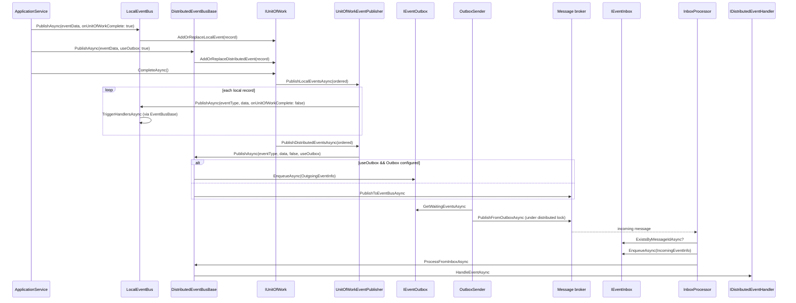

ABP exposes two publishers — `ILocalEventBus` for in-process domain events and `IDistributedEventBus` for cross-service notifications. Both default to buffering through the current `IUnitOfWork`, so events fire only after a successful commit. The distributed bus adds outbox/inbox machinery so events survive crashes between commit and delivery.

## Sequence



## Step-by-step walk-through

1. **`EventBusBase.PublishAsync` (the buffering point).** `EventBusBase` (`framework/src/Volo.Abp.EventBus/Volo/Abp/EventBus/EventBusBase.cs`) defers to the current UoW when `onUnitOfWorkComplete` is true:
   ```csharp
   if (onUnitOfWorkComplete && UnitOfWorkManager.Current != null)
   {
       AddToUnitOfWork(
           UnitOfWorkManager.Current,
           new UnitOfWorkEventRecord(eventType, eventData, EventOrderGenerator.GetNext()));
       return;
   }
   await PublishToEventBusAsync(eventType, eventData);
   ```
   `LocalEventBus.AddToUnitOfWork` calls `unitOfWork.AddOrReplaceLocalEvent(record)`; `DistributedEventBusBase` calls `AddOrReplaceDistributedEvent`. `EventOrderGenerator.GetNext()` issues a monotonically increasing `long` so ordering is preserved per UoW.

2. **Local publish, no UoW.** When there is no ambient UoW (or `onUnitOfWorkComplete: false` is passed explicitly), `LocalEventBus.PublishToEventBusAsync` (`framework/src/Volo.Abp.EventBus/Volo/Abp/EventBus/Local/LocalEventBus.cs`) sends a `LocalEventMessage(Guid.NewGuid(), eventData, eventType)` to `PublishAsync(LocalEventMessage)`, which then `TriggerHandlersAsync(eventType, eventData)`.

3. **Handler factory selection.** `LocalEventBus.GetHandlerFactories(eventType)` matches both exact handlers and base-type handlers via `ShouldTriggerEventForHandler` (assignable check). Handlers are ordered by `LocalEventHandlerOrderAttribute` (default order 0). `EventHandlerInvoker` resolves the handler from the scope and invokes the method through cached `EventHandlerInvokerCacheItem` reflection.

4. **Distributed publish.** `DistributedEventBusBase.PublishAsync` (`framework/src/Volo.Abp.EventBus/Volo/Abp/EventBus/Distributed/DistributedEventBusBase.cs`):
   ```csharp
   if (onUnitOfWorkComplete && UnitOfWorkManager.Current != null) { AddToUnitOfWork(...); return; }
   if (useOutbox && await AddToOutboxAsync(eventType, eventData)) return;
   await TriggerDistributedEventSentAsync(new DistributedEventSent { ... });
   await PublishToEventBusAsync(eventType, eventData);
   ```

5. **UoW commit drains events.** `UnitOfWork.CompleteAsync` (see [unit of work](/flows/unit-of-work)) loops:
   ```csharp
   while (LocalEvents.Any() || DistributedEvents.Any())
   {
       if (LocalEvents.Any()) { var ordered = LocalEvents.OrderBy(e => e.EventOrder).ToArray();
           LocalEvents.Clear();
           await UnitOfWorkEventPublisher.PublishLocalEventsAsync(ordered); }
       if (DistributedEvents.Any()) { ...
           await UnitOfWorkEventPublisher.PublishDistributedEventsAsync(ordered); }
       await SaveChangesAsync(cancellationToken);
   }
   ```

6. **`UnitOfWorkEventPublisher`.** (`framework/src/Volo.Abp.EventBus/Volo/Abp/EventBus/UnitOfWorkEventPublisher.cs`) republishes each record with `onUnitOfWorkComplete: false` so the buses fall through to the actual transport:
   ```csharp
   await _localEventBus.PublishAsync(localEvent.EventType, localEvent.EventData, onUnitOfWorkComplete: false);
   await _distributedEventBus.PublishAsync(distributedEvent.EventType, distributedEvent.EventData,
       onUnitOfWorkComplete: false, useOutbox: distributedEvent.UseOutbox);
   ```

7. **Outbox enqueue.** `DistributedEventBusBase.AddToOutboxAsync` walks `AbpDistributedEventBusOptions.Outboxes`:
   ```csharp
   foreach (var outboxConfig in AbpDistributedEventBusOptions.Outboxes.Values.OrderBy(x => x.Selector is null))
   {
       if (outboxConfig.Selector == null || outboxConfig.Selector(eventType))
       {
           var eventOutbox = (IEventOutbox)unitOfWork.ServiceProvider.GetRequiredService(outboxConfig.ImplementationType);
           var outgoingEventInfo = new OutgoingEventInfo(GuidGenerator.Create(), eventName, Serialize(eventData), Clock.Now);
           outgoingEventInfo.SetCorrelationId(CorrelationIdProvider.Get());
           await eventOutbox.EnqueueAsync(outgoingEventInfo);
           return true;
       }
   }
   ```
   The outbox row commits in the same DB transaction as the business data, so visibility is atomic.

8. **`OutboxSender`.** (`framework/src/Volo.Abp.EventBus/Volo/Abp/EventBus/Distributed/OutboxSender.cs`) is a periodic worker. `RunAsync` acquires a distributed lock (`AbpOutbox_{DatabaseName}`) and pumps:
   ```csharp
   while (true)
   {
       var waitingEvents = await Outbox.GetWaitingEventsAsync(EventBusBoxesOptions.OutboxWaitingEventMaxCount, StoppingToken);
       if (!waitingEvents.Any()) break;
       // PublishManyFromOutboxAsync or PublishFromOutboxAsync
       // DeleteOldEventsAsync
   }
   ```
   The `OutboxSenderManager` (`framework/src/Volo.Abp.EventBus/Volo/Abp/EventBus/Distributed/OutboxSenderManager.cs`) spawns one sender per configured outbox at app startup.

9. **Broker hand-off.** Concrete distributed buses (`RabbitMqDistributedEventBus`, `AzureServiceBusDistributedEventBus`, `KafkaDistributedEventBus`, etc.) implement `PublishToEventBusAsync` and `PublishManyFromOutboxAsync`. They translate the serialized payload into broker messages and tag them with the `EventName` from `[EventName]` attribute.

10. **Inbox receipt.** `InboxProcessor` (`framework/src/Volo.Abp.EventBus/Volo/Abp/EventBus/Distributed/InboxProcessor.cs`) is the worker for incoming messages. When the broker subscriber decides a message belongs in the inbox, it calls `DistributedEventBusBase.AddToInboxAsync`:
    ```csharp
    using (var scope = ServiceScopeFactory.CreateScope())
    {
        foreach (var inboxConfig in AbpDistributedEventBusOptions.Inboxes.Values.OrderBy(x => x.EventSelector is null))
        {
            ...
            if (await eventInbox.ExistsByMessageIdAsync(messageId)) continue;
            await eventInbox.EnqueueAsync(incomingEventInfo);
        }
    }
    ```
    De-dup on `MessageId` guarantees at-least-once becomes effectively exactly-once at the handler.

11. **Inbox processing.** `InboxProcessor.RunAsync` pulls waiting events under a distributed lock (`AbpInbox_{DatabaseName}`), reconstructs the event payload via `Deserialize`, then calls `DistributedEventBusBase.ProcessFromInboxAsync(IncomingEventInfo, inboxConfig)` which triggers local handlers under a fresh UoW.

12. **`UnitOfWorkManager` injection.** Both processors use `IUnitOfWorkManager.Begin(new AbpUnitOfWorkOptions { ... })` around the handler call so that DB changes performed by the handler commit together with marking the inbox row as processed.

## Handler subscription

`EventBusBase.Subscribe` accepts:
- a delegate (`Func<TEvent, Task>`) wrapped in `ActionEventHandler<TEvent>`,
- a handler type (`THandler : IEventHandler, new()`) wrapped in `TransientEventHandlerFactory<THandler>`,
- a singleton instance via `SingleInstanceHandlerFactory`,
- or any `IEventHandlerFactory`.

`AbpLocalEventBusOptions.Handlers` (`framework/src/Volo.Abp.EventBus/Volo/Abp/EventBus/Local/AbpLocalEventBusOptions.cs`) and `IocEventHandlerFactory` register module assemblies. A handler implementing `ILocalEventHandler<TEvent>` is auto-discovered.

## Hooks and extension points

| Hook | File | Purpose |
| --- | --- | --- |
| `ILocalEventHandler<TEvent>` | `framework/src/Volo.Abp.EventBus.Abstractions/Volo/Abp/EventBus/Local/ILocalEventHandler.cs` | In-process handler. |
| `IDistributedEventHandler<TEvent>` | `framework/src/Volo.Abp.EventBus.Abstractions/Volo/Abp/EventBus/Distributed/IDistributedEventHandler.cs` | Cross-service handler. |
| `[EventName("ns.event")]` | `framework/src/Volo.Abp.EventBus.Abstractions/Volo/Abp/EventBus/EventNameAttribute.cs` | Stable wire name for distributed payloads. |
| `IUnitOfWorkEventPublisher` | `framework/src/Volo.Abp.Uow/Volo/Abp/Uow/IUnitOfWorkEventPublisher.cs` | Swap how UoW drains events. |
| `IEventHandlerInvoker` | `framework/src/Volo.Abp.EventBus.Abstractions/Volo/Abp/EventBus/IEventHandlerInvoker.cs` | Customize handler dispatch (e.g. timeouts, retries). |
| `IEventOutbox` / `IEventInbox` | `framework/src/Volo.Abp.EventBus.Abstractions/Volo/Abp/EventBus/Boxes/` | Plug a custom store for the boxes. |
| `OutboxConfig.Selector` / `InboxConfig.EventSelector` | `framework/src/Volo.Abp.EventBus.Abstractions/Volo/Abp/EventBus/Distributed/` | Route specific events to specific boxes. |
| `LocalEventHandlerOrderAttribute` | `framework/src/Volo.Abp.EventBus.Abstractions/Volo/Abp/EventBus/Local/LocalEventHandlerOrderAttribute.cs` | Sort local handlers. |

## Related options classes

| Options | File |
| --- | --- |
| `AbpLocalEventBusOptions` | `framework/src/Volo.Abp.EventBus/Volo/Abp/EventBus/Local/AbpLocalEventBusOptions.cs` |
| `AbpDistributedEventBusOptions` | `framework/src/Volo.Abp.EventBus/Volo/Abp/EventBus/Distributed/AbpDistributedEventBusOptions.cs` |
| `AbpEventBusBoxesOptions` | `framework/src/Volo.Abp.EventBus/Volo/Abp/EventBus/Distributed/AbpEventBusBoxesOptions.cs` |

## Gotchas

- **Default is buffered.** `PublishAsync` without `onUnitOfWorkComplete: false` defers to the UoW. If no UoW exists, the event fires immediately — but if a UoW exists and rolls back, the event silently disappears. Catch that with `IUnitOfWork.OnCompleted` for follow-up actions, not on the rollback path.
- **Outbox needs a UoW.** `DistributedEventBusBase.AddToOutboxAsync` returns false when `UnitOfWorkManager.Current == null` — the event then publishes directly, defeating the durability guarantee. Always wrap publishers in a UoW.
- **Selector matching is first-non-null wins.** `Outboxes.Values.OrderBy(x => x.Selector is null)` puts selector-bearing configs first; the first match wins and other selectors don't see the event.
- **`LocalDistributedEventBus` is the dev default.** `LocalDistributedEventBus` (`framework/src/Volo.Abp.EventBus/Volo/Abp/EventBus/Distributed/LocalDistributedEventBus.cs`) delivers distributed events in-process. Production setups must register a real broker.
- **Inbox de-dup keys off `MessageId`.** If the broker doesn't surface a stable message id, the inbox cannot reject duplicates. Use `[EventName]` plus a deterministic id in your producer.
- **Lock contention on busy outboxes.** `OutboxSender` holds `AbpOutbox_{DatabaseName}` until the queue drains. Running multiple sender pods is safe, but only one drains at a time per database.
- **`EventOrderGenerator` is static.** The `Interlocked.Increment` counter resets per process. Cross-process ordering only holds via the broker's partition guarantees.

## Related pages

<CardGroup cols={2}>
  <Card title="Unit of work" icon="database" href="/flows/unit-of-work" />
  <Card title="Background job execution" icon="gears" href="/flows/background-job-execution" />
  <Card title="EventBus subsystem" icon="paper-plane" href="/framework/cross/event-bus" />
  <Card title="Distributed eventing" icon="network-wired" href="/framework/cross/distributed-event-bus" />
</CardGroup>
