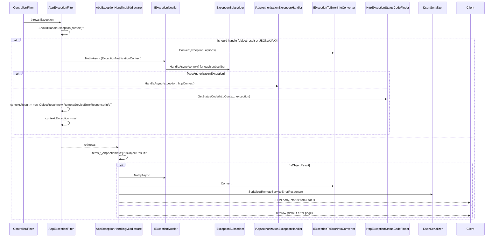

ABP funnels every exception thrown inside MVC actions, application services, and middleware through a single conversion pipeline that ends in a structured `RemoteServiceErrorResponse` JSON body. Authorization failures get special-cased to honor the authentication scheme, while business exceptions get localized via `ErrorCodeNamespaceMappings`.

## Sequence



## Step-by-step walk-through

1. **MVC catch.** `AbpExceptionFilter` (`framework/src/Volo.Abp.AspNetCore.Mvc/Volo/Abp/AspNetCore/Mvc/ExceptionHandling/AbpExceptionFilter.cs`) is registered through `AbpMvcOptionsExtensions`. Its `OnExceptionAsync` runs after action filters:
   ```csharp
   if (!ShouldHandleException(context)) { LogException(context, out _); return; }
   await HandleAndWrapException(context);
   ```
   `ShouldHandleException` returns true when the action returns an object result, the request accepts JSON, or `IsAjax()`.

2. **Logging and converter.** `LogException` constructs the `RemoteServiceErrorInfo` upfront so the log entry matches the wire payload:
   ```csharp
   var exceptionHandlingOptions = context.GetRequiredService<IOptions<AbpExceptionHandlingOptions>>().Value;
   var exceptionToErrorInfoConverter = context.GetRequiredService<IExceptionToErrorInfoConverter>();
   remoteServiceErrorInfo = exceptionToErrorInfoConverter.Convert(context.Exception, options =>
   {
       options.SendExceptionsDetailsToClients = exceptionHandlingOptions.SendExceptionsDetailsToClients;
       options.SendStackTraceToClients = exceptionHandlingOptions.SendStackTraceToClients;
   });
   ```

3. **Notifier fan-out.** `HandleAndWrapException` calls `IExceptionNotifier.NotifyAsync(new ExceptionNotificationContext(context.Exception))`. `ExceptionNotifier` (`framework/src/Volo.Abp.Core/Volo/Abp/ExceptionHandling/ExceptionNotifier.cs`) creates a scope and iterates every `IExceptionSubscriber` resolved from `GetServices`:
   ```csharp
   foreach (var exceptionSubscriber in exceptionSubscribers)
   {
       try { await exceptionSubscriber.HandleAsync(context); }
       catch (Exception e) { Logger.LogWarning(...); }
   }
   ```
   Subscribers extend `ExceptionSubscriber` (`framework/src/Volo.Abp.Core/Volo/Abp/ExceptionHandling/ExceptionSubscriber.cs`) — typical implementations forward to Sentry, ApplicationInsights, or the security log.

4. **Authorization shortcut.** When the exception is `AbpAuthorizationException`, the filter delegates to `IAbpAuthorizationExceptionHandler.HandleAsync`. The default implementation `DefaultAbpAuthorizationExceptionHandler` (`framework/src/Volo.Abp.AspNetCore/Volo/Abp/AspNetCore/ExceptionHandling/DefaultAbpAuthorizationExceptionHandler.cs`):
   - If `AbpAuthorizationExceptionHandlerOptions.AuthenticationScheme` is set, uses it.
   - Otherwise picks `GetDefaultForbidSchemeAsync` (authenticated user) or `GetDefaultChallengeSchemeAsync` (anonymous).
   - Issues `IAuthenticationHandler.ForbidAsync` or `ChallengeAsync` so OAuth/OIDC flows redirect correctly.

5. **Status code.** Non-auth exceptions route through `DefaultHttpExceptionStatusCodeFinder` (`framework/src/Volo.Abp.AspNetCore/Volo/Abp/AspNetCore/ExceptionHandling/DefaultHttpExceptionStatusCodeFinder.cs`):
   ```csharp
   if (exception is IHasHttpStatusCode hs && hs.HttpStatusCode > 0) return (HttpStatusCode)hs.HttpStatusCode;
   if (exception is IHasErrorCode hc && !hc.Code.IsNullOrWhiteSpace() &&
       Options.ErrorCodeToHttpStatusCodeMappings.TryGetValue(hc.Code!, out var status)) return status;
   // Built-in mapping: BusinessException → 403; AbpDbConcurrencyException → 409; EntityNotFoundException → 404;
   // AbpValidationException → 400; AbpAuthorizationException → 401/403; others → 500.
   ```

6. **Response shape.** The filter sets:
   ```csharp
   context.HttpContext.Response.Headers.Add(AbpHttpConsts.AbpErrorFormat, "true");
   context.HttpContext.Response.StatusCode = (int)statusCode;
   context.Result = new ObjectResult(new RemoteServiceErrorResponse(remoteServiceErrorInfo));
   context.Exception = null!;
   ```
   The `AbpHttpConsts.AbpErrorFormat` header tells `AbpRemoteCallException` on the client side to deserialize via `RemoteServiceErrorResponse`.

7. **Middleware fallback.** If the request never reached MVC (or `ShouldHandleException` returned false), `AbpExceptionHandlingMiddleware` (`framework/src/Volo.Abp.AspNetCore/Volo/Abp/AspNetCore/ExceptionHandling/AbpExceptionHandlingMiddleware.cs`) catches and wraps:
   ```csharp
   if (context.Response.HasStarted) { _logger.LogWarning("..."); throw; }
   if (context.Items["_AbpActionInfo"] is AbpActionInfoInHttpContext info && info.IsObjectResult)
   {
       await HandleAndWrapException(context, ex);
       return;
   }
   throw;
   ```
   `HandleAndWrapException` mirrors the filter: notifier → converter → JSON write, plus `OnStarting(_clearCacheHeadersDelegate)` so cached error bodies aren't reused.

8. **`DefaultExceptionToErrorInfoConverter`.** (`framework/src/Volo.Abp.ExceptionHandling/Volo/Abp/AspNetCore/ExceptionHandling/DefaultExceptionToErrorInfoConverter.cs`):
   - For `AbpRemoteCallException`, propagates the server-side `RemoteServiceErrorInfo` untouched (cross-service consistency).
   - For `EntityNotFoundException`, formats with `L["EntityNotFoundErrorMessage"]`.
   - For `IUserFriendlyException`, returns `exception.Message` and `Details`.
   - For `IHasValidationErrors`, fills `ValidationErrors`.
   - `TryToLocalizeExceptionMessage` consults `IHasErrorCode.Code` → looks up the namespace in `AbpExceptionLocalizationOptions.ErrorCodeNamespaceMappings` → resolves the localizer → formats with `exception.Data`.
   - Sensitive details (`SendExceptionsDetailsToClients`, `SendStackTraceToClients`) are opt-in.

9. **`RemoteServiceErrorInfo`.** (`framework/src/Volo.Abp.ExceptionHandling/Volo/Abp/Http/RemoteServiceErrorInfo.cs`) carries:
   ```csharp
   public string? Code { get; set; }
   public string? Message { get; set; }
   public string? Details { get; set; }
   public IDictionary? Data { get; set; }
   public RemoteServiceValidationErrorInfo[]? ValidationErrors { get; set; }
   ```

10. **Remote propagation.** When a downstream service throws, its `AbpExceptionFilter` writes the structured JSON. The calling service's `ClientProxyBase.ThrowExceptionForResponseAsync` reads it and rethrows `AbpRemoteCallException` carrying the original `RemoteServiceErrorInfo`. The next converter call up the stack preserves the inner error rather than re-localizing it — important so the original error code reaches the end user.

11. **Background-job path.** `BackgroundJobExecuter` (`framework/src/Volo.Abp.BackgroundJobs.Abstractions/Volo/Abp/BackgroundJobs/BackgroundJobExecuter.cs`) calls `IExceptionNotifier.NotifyAsync` on every failed job, then wraps in `BackgroundJobExecutionException` so the worker can compute the retry. The notifier hits the same `IExceptionSubscriber`s used by HTTP.

12. **Cache header reset.** `AbpExceptionHandlingMiddleware._clearCacheHeadersDelegate` clears `Cache-Control`, `Pragma`, `Expires`, and `ETag` so a previously-cached 200 response doesn't get re-sent for the same URL.

## Built-in exceptions

| Exception | File | Notes |
| --- | --- | --- |
| `AbpException` | `framework/src/Volo.Abp.Core/Volo/Abp/AbpException.cs` | Generic 500. |
| `BusinessException` | `framework/src/Volo.Abp.Core/Volo/Abp/BusinessException.cs` | Implements `IHasErrorCode`, `IUserFriendlyException`; default 403. |
| `UserFriendlyException` | `framework/src/Volo.Abp.Core/Volo/Abp/UserFriendlyException.cs` | Message is sent to clients. |
| `EntityNotFoundException` | `framework/src/Volo.Abp.ExceptionHandling/Volo/Abp/Domain/Entities/EntityNotFoundException.cs` | Default 404. |
| `AbpValidationException` | `framework/src/Volo.Abp.Validation.Abstractions/Volo/Abp/Validation/AbpValidationException.cs` | Default 400 with `ValidationErrors`. |
| `AbpAuthorizationException` | `framework/src/Volo.Abp.Authorization.Abstractions/Volo/Abp/Authorization/AbpAuthorizationException.cs` | Routed to `IAbpAuthorizationExceptionHandler`. |
| `AbpDbConcurrencyException` | `framework/src/Volo.Abp.Data/Volo/Abp/Data/AbpDbConcurrencyException.cs` | Default 409. |
| `AbpRemoteCallException` | `framework/src/Volo.Abp.ExceptionHandling/Volo/Abp/Http/Client/AbpRemoteCallException.cs` | Wrap of a downstream-service error. |

## Hooks and extension points

| Hook | File | Purpose |
| --- | --- | --- |
| `IExceptionSubscriber` | `framework/src/Volo.Abp.Core/Volo/Abp/ExceptionHandling/IExceptionSubscriber.cs` | Side-channel exception reporting. |
| `IExceptionToErrorInfoConverter` | `framework/src/Volo.Abp.ExceptionHandling/Volo/Abp/AspNetCore/ExceptionHandling/IExceptionToErrorInfoConverter.cs` | Customize wire payload. |
| `IHttpExceptionStatusCodeFinder` | `framework/src/Volo.Abp.AspNetCore/Volo/Abp/AspNetCore/ExceptionHandling/IHttpExceptionStatusCodeFinder.cs` | Override status code mapping. |
| `IAbpAuthorizationExceptionHandler` | `framework/src/Volo.Abp.AspNetCore/Volo/Abp/AspNetCore/ExceptionHandling/IAbpAuthorizationExceptionHandler.cs` | Custom forbid/challenge flow. |
| `IHasErrorCode` / `IHasErrorDetails` / `IHasHttpStatusCode` / `IHasValidationErrors` | `framework/src/Volo.Abp.Core/Volo/Abp/ExceptionHandling/` and `framework/src/Volo.Abp.Validation.Abstractions/Volo/Abp/Validation/` | Make a custom exception participate. |
| `ILocalizeErrorMessage` | `framework/src/Volo.Abp.Core/Volo/Abp/ExceptionHandling/ILocalizeErrorMessage.cs` | Provide a per-instance localized message. |
| `IUserFriendlyException` | `framework/src/Volo.Abp.Core/Volo/Abp/IUserFriendlyException.cs` | Marker — message is exposed even when `SendExceptionsDetailsToClients` is off. |

## Related options classes

| Options | File |
| --- | --- |
| `AbpExceptionHandlingOptions` | `framework/src/Volo.Abp.ExceptionHandling/Volo/Abp/AspNetCore/ExceptionHandling/AbpExceptionHandlingOptions.cs` |
| `AbpExceptionHttpStatusCodeOptions` | `framework/src/Volo.Abp.AspNetCore/Volo/Abp/AspNetCore/ExceptionHandling/AbpExceptionHttpStatusCodeOptions.cs` |
| `AbpAuthorizationExceptionHandlerOptions` | `framework/src/Volo.Abp.AspNetCore/Volo/Abp/AspNetCore/ExceptionHandling/AbpAuthorizationExceptionHandlerOptions.cs` |
| `AbpExceptionLocalizationOptions` | `framework/src/Volo.Abp.ExceptionHandling/Volo/Abp/ExceptionHandling/Localization/AbpExceptionLocalizationOptions.cs` |

## Gotchas

- **`ShouldHandleException` is heuristic.** It checks for an object-result action, `Accept: application/json`, or `X-Requested-With: XMLHttpRequest`. Razor Pages and HTML form posts fall through to `AbpExceptionPageFilter` instead. If you set `Accept: */*` and target an MVC view, you'll get a JSON error body — set the right `Accept` header.
- **`HasStarted` short-circuits the middleware.** Once any byte ships, the wrapper rethrows. Long streamed responses can't be retroactively turned into JSON errors.
- **`SendExceptionsDetailsToClients` leaks stack traces.** It defaults to false; production deployments must not flip it to true for non-`IUserFriendlyException`s.
- **Subscribers swallow their own errors.** `ExceptionNotifier` logs and continues, so a broken subscriber doesn't crash the request — but the alert you expected might not fire. Monitor `Logger.LogWarning("Exception subscriber of type … has thrown")`.
- **Error code localization is namespace-scoped.** `AbpExceptionLocalizationOptions.ErrorCodeNamespaceMappings.Add("MyApp", typeof(MyAppResource))` ties the code prefix to a localization resource. Forgetting it returns the raw code instead of a translated message.
- **Authorization handler depends on schemes.** `DefaultForbidScheme` / `DefaultChallengeScheme` must be configured. Without them `DefaultAbpAuthorizationExceptionHandler` throws `AbpException("There was no DefaultForbidScheme found.")`.
- **Cache-header reset hits clients hard.** The middleware unconditionally rewrites `Cache-Control: no-cache` etc. on the failed response — including CDN-fronted scenarios. Add a custom `IMiddleware` higher up if you need a different cache policy for errors.
- **`AbpDbConcurrencyException` returns a localized fallback message.** The converter swaps the original message with `L["AbpDbConcurrencyErrorMessage"]`. Logging keeps the original.

## Related pages

<CardGroup cols={2}>
  <Card title="HTTP request lifecycle" icon="route" href="/flows/http-request-lifecycle" />
  <Card title="Authorization flow" icon="shield" href="/flows/authorization-flow" />
  <Card title="Dynamic HTTP proxy" icon="bolt" href="/flows/dynamic-http-proxy" />
  <Card title="Validation" icon="circle-check" href="/framework/cross/validation" />
</CardGroup>
