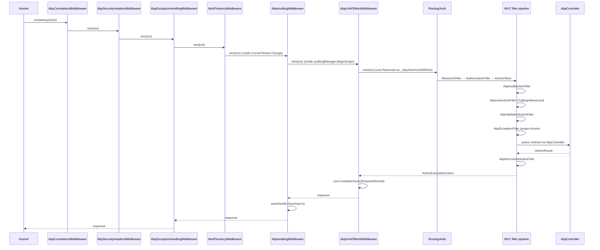

ABP layers cross-cutting middlewares and MVC filters on top of Kestrel's request pipeline. A single request can flow through correlation tracking, security headers, exception wrapping, multi-tenancy resolution, the reserved unit-of-work, the auditing scope, MVC's filter pipeline (auditing → uow → validation → exception → action) and finally the action method on a controller derived from `AbpController`. This page maps every hop to the exact source file.

## Sequence

## Step-by-step walk-through

1. **Kestrel hands off.** ASP.NET Core dispatches to the first middleware registered by `AbpModule.OnApplicationInitialization`. The recommended order — `app.UseAbpRequestLocalization`, `UseCorrelationId`, `UseAbpSecurityHeaders`, `UseAuthentication`, `UseAbpClaimsMap`, `UseMultiTenancy`, `UseAuthorization` — comes from `framework/src/Volo.Abp.AspNetCore/Volo/Abp/AspNetCore/AbpAspNetCoreModule.cs` and the MVC convention modules.

2. **Correlation id.** `AbpCorrelationIdMiddleware` (`framework/src/Volo.Abp.AspNetCore/Volo/Abp/AspNetCore/Tracing/AbpCorrelationIdMiddleware.cs`) reads `AbpCorrelationIdOptions.HttpHeaderName` from the request, generates a new GUID-N when missing, and wraps the rest of the pipeline with `using (_correlationIdProvider.Change(correlationId))`. `CheckAndSetCorrelationIdOnResponse` attaches the id to the response via `httpContext.Response.OnStarting`.

3. **Security headers.** `AbpSecurityHeadersMiddleware` (`framework/src/Volo.Abp.AspNetCore/Volo/Abp/AspNetCore/Security/AbpSecurityHeadersMiddleware.cs`) unconditionally adds `X-Content-Type-Options`, `X-XSS-Protection`, `X-Frame-Options`, and, when `AbpSecurityHeadersOptions.UseContentSecurityPolicyHeader` is on and the endpoint isn't decorated with `IgnoreAbpSecurityHeaderAttribute`, a CSP header. The script-src nonce is generated by `AbpSecurityHeaderNonceHelper`.

4. **Exception wrapping.** `AbpExceptionHandlingMiddleware` (`framework/src/Volo.Abp.AspNetCore/Volo/Abp/AspNetCore/ExceptionHandling/AbpExceptionHandlingMiddleware.cs`) awaits `next(context)` inside a `try`. When an exception escapes downstream middleware and `HttpContext.Items["_AbpActionInfo"]` contains an `AbpActionInfoInHttpContext` with `IsObjectResult == true`, it calls `HandleAndWrapException`, which:
   - notifies `IExceptionNotifier.NotifyAsync`,
   - delegates `AbpAuthorizationException` to `IAbpAuthorizationExceptionHandler`,
   - otherwise serializes a `RemoteServiceErrorResponse` via `IJsonSerializer` using the status code from `IHttpExceptionStatusCodeFinder`.

5. **Multi-tenancy resolution.** `MultiTenancyMiddleware` (`framework/src/Volo.Abp.AspNetCore.MultiTenancy/Volo/Abp/AspNetCore/MultiTenancy/MultiTenancyMiddleware.cs`) calls `ITenantConfigurationProvider.GetAsync(saveResolveResult: true)`. When the resolved id differs from `ICurrentTenant.Id`, it wraps `next(context)` with `_currentTenant.Change(tenant?.Id, tenant?.Name)`, optionally pinning the culture via `AbpRequestCultureCookieHelper`. See [multi-tenancy resolution](/flows/multi-tenancy-resolution) for the contributor chain.

6. **Auditing scope.** `AbpAuditingMiddleware` (`framework/src/Volo.Abp.AspNetCore/Volo/Abp/AspNetCore/Auditing/AbpAuditingMiddleware.cs`) calls `IAuditingManager.BeginScope()` when auditing is enabled and the URL is not in `AbpAspNetCoreAuditingOptions.IgnoredUrls`. The `using` of `saveHandle` ensures `SaveAsync` runs in `finally` so the audit log is persisted even when later middleware throws.

7. **Reserved unit of work.** `AbpUnitOfWorkMiddleware` (`framework/src/Volo.Abp.AspNetCore/Volo/Abp/AspNetCore/Uow/AbpUnitOfWorkMiddleware.cs`) creates a **reserved** UoW via `_unitOfWorkManager.Reserve(UnitOfWork.UnitOfWorkReservationName)`. The reservation defers `Initialize` until the MVC action filter knows whether the request is transactional. `uow.CompleteAsync(context.RequestAborted)` runs after `next`.

8. **Routing and authentication.** Standard ASP.NET Core `UseRouting`, `UseAuthentication`, `UseAuthorization` fire here. ABP plugs `ICurrentPrincipalAccessor`, claim-mappers from `AbpClaimsMapMiddleware`, and `AspNetCoreSecurityLogManager` from `framework/src/Volo.Abp.AspNetCore/Volo/Abp/AspNetCore/SecurityLog/AspNetCoreSecurityLogManager.cs` into the standard pipeline.

9. **MVC filter pipeline.** When the endpoint is an MVC action, ASP.NET Core invokes filters in this order — registered through `AbpAspNetCoreMvcOptions` in `framework/src/Volo.Abp.AspNetCore.Mvc/Volo/Abp/AspNetCore/Mvc/AbpAspNetCoreMvcOptions.cs`:
   1. `AbpAutoValidateAntiforgeryTokenAuthorizationFilter` (`framework/src/Volo.Abp.AspNetCore.Mvc/Volo/Abp/AspNetCore/Mvc/AntiForgery/AbpAutoValidateAntiforgeryTokenAuthorizationFilter.cs`).
   2. `AbpAuditActionFilter` (`framework/src/Volo.Abp.AspNetCore.Mvc/Volo/Abp/AspNetCore/Mvc/Auditing/AbpAuditActionFilter.cs`) — calls `IAuditingHelper.CreateAuditLogAction` and adds a `AuditLogActionInfo` with `ExecutionDuration` to the ambient scope.
   3. `AbpFeatureActionFilter` / `GlobalFeatureActionFilter` (`framework/src/Volo.Abp.AspNetCore.Mvc/Volo/Abp/AspNetCore/Mvc/Features/AbpFeatureActionFilter.cs`, `…/GlobalFeatures/GlobalFeatureActionFilter.cs`).
   4. `AbpUowActionFilter` (`framework/src/Volo.Abp.AspNetCore.Mvc/Volo/Abp/AspNetCore/Mvc/Uow/AbpUowActionFilter.cs`). This filter:
      - stashes `new AbpActionInfoInHttpContext { IsObjectResult = ... }` in `HttpContext.Items["_AbpActionInfo"]`.
      - reads `UnitOfWorkHelper.GetUnitOfWorkAttributeOrNull(methodInfo)` and computes `IsTransactional` (false for `GET`, true otherwise unless overridden).
      - calls `unitOfWorkManager.TryBeginReserved(UnitOfWork.UnitOfWorkReservationName, options)` to wake up the reserved UoW from the middleware. On `Succeed`, it calls `SaveChangesAsync`; otherwise `RollbackAsync`.
   5. `AbpValidationActionFilter` (`framework/src/Volo.Abp.AspNetCore.Mvc/Volo/Abp/AspNetCore/Mvc/Validation/AbpValidationActionFilter.cs`) — skipped when the action lacks an object result, when `AbpAspNetCoreMvcOptions.AutoModelValidation` is off, or when `[DisableValidation]` is present.
   6. `AbpExceptionFilter` (`framework/src/Volo.Abp.AspNetCore.Mvc/Volo/Abp/AspNetCore/Mvc/ExceptionHandling/AbpExceptionFilter.cs`) — see [exception handling](/flows/exception-handling).
   7. `AbpNoContentActionFilter` (`framework/src/Volo.Abp.AspNetCore.Mvc/Volo/Abp/AspNetCore/Mvc/Response/AbpNoContentActionFilter.cs`) — converts `null` object results to `204 No Content`.

10. **Controller activation.** `AbpController` (`framework/src/Volo.Abp.AspNetCore.Mvc/Volo/Abp/AspNetCore/Mvc/AbpController.cs`) wires `IAbpLazyServiceProvider`, `IUnitOfWorkManager`, `IObjectMapper`, `IGuidGenerator`, `IStringLocalizer<...>` and similar dependencies through property injection. It implements `IAvoidDuplicateCrossCuttingConcerns`, so cross-cutting interceptors detect that auditing/auth already ran in the filter pipeline and do not run again on the same call.

11. **Action method runs.** Model binding and the action method execute. Any returned `Task<ActionResult>` or `Task<T>` flows back up through the filter pipeline.

12. **Save-and-complete on the way out.**
    - `AbpUowActionFilter.SaveChangesAsync` is invoked when the result succeeded — it calls `currentUow.SaveChangesAsync(context.HttpContext.RequestAborted)` and rolls back on error.
    - Control returns to `AbpUnitOfWorkMiddleware`, which calls `uow.CompleteAsync` — this triggers `SaveChangesAsync` on every active `IDatabaseApi` and publishes the queued local/distributed events through `IUnitOfWorkEventPublisher` (see [event publication](/flows/event-publication)).
    - `AbpAuditingMiddleware` then runs `ShouldWriteAuditLogAsync` and calls `saveHandle.SaveAsync()` if it returns true.
    - `AbpExceptionHandlingMiddleware` re-throws to ASP.NET Core if the response has already started; otherwise wraps the error.

## Controllers vs Razor Pages

Razor Pages use `AbpAuditPageFilter`, `AbpUowPageFilter`, `AbpFeaturePageFilter`, `GlobalFeaturePageFilter` and `AbpExceptionPageFilter` instead of the corresponding action filters. They live in `framework/src/Volo.Abp.AspNetCore.Mvc/Volo/Abp/AspNetCore/Mvc/{Auditing,Uow,Features,GlobalFeatures,ExceptionHandling}/` and follow the same logic but operate on `PageHandlerExecutingContext`.

## Hooks and extension points

| Hook | File | Purpose |
| --- | --- | --- |
| `IMiddleware` derivations | `framework/src/Volo.Abp.AspNetCore/Volo/Abp/AspNetCore/` | Inject custom logic into the middleware chain. |
| `IAsyncActionFilter` / `IAsyncPageFilter` | `Microsoft.AspNetCore.Mvc.Filters` | Add behavior at the filter layer. |
| `IAvoidDuplicateCrossCuttingConcerns` | `framework/src/Volo.Abp.Core/Volo/Abp/Aspects/IAvoidDuplicateCrossCuttingConcerns.cs` | Suppress redundant interceptor invocations on classes already inside the MVC pipeline. |
| `IAbpAuthorizationExceptionHandler` | `framework/src/Volo.Abp.AspNetCore/Volo/Abp/AspNetCore/ExceptionHandling/IAbpAuthorizationExceptionHandler.cs` | Customize the 401/403 response. |
| `IHttpExceptionStatusCodeFinder` | `framework/src/Volo.Abp.AspNetCore/Volo/Abp/AspNetCore/ExceptionHandling/IHttpExceptionStatusCodeFinder.cs` | Map exception types to status codes. |
| `[DisableValidation]` | `framework/src/Volo.Abp.Validation/Volo/Abp/Validation/DisableValidationAttribute.cs` | Bypass `AbpValidationActionFilter`. |
| `[DisableAuditing]` | `framework/src/Volo.Abp.Auditing/Volo/Abp/Auditing/DisableAuditingAttribute.cs` | Skip the audit filter for an action. |
| `[UnitOfWork]` | `framework/src/Volo.Abp.Uow/Volo/Abp/Uow/UnitOfWorkAttribute.cs` | Force or disable the per-action UoW. |
| `IgnoreAbpSecurityHeaderAttribute` | `framework/src/Volo.Abp.AspNetCore/Volo/Abp/AspNetCore/Security/IgnoreAbpSecurityHeader.cs` | Strip CSP/security headers for select endpoints. |

## Related options classes

| Options | File |
| --- | --- |
| `AbpAspNetCoreMvcOptions` | `framework/src/Volo.Abp.AspNetCore.Mvc/Volo/Abp/AspNetCore/Mvc/AbpAspNetCoreMvcOptions.cs` |
| `AbpAspNetCoreAuditingOptions` | `framework/src/Volo.Abp.AspNetCore/Volo/Abp/AspNetCore/Auditing/AbpAspNetCoreAuditingOptions.cs` |
| `AbpAspNetCoreUnitOfWorkOptions` | `framework/src/Volo.Abp.AspNetCore/Volo/Abp/AspNetCore/Uow/AbpAspNetCoreUnitOfWorkOptions.cs` |
| `AbpSecurityHeadersOptions` | `framework/src/Volo.Abp.AspNetCore/Volo/Abp/AspNetCore/Security/AbpSecurityHeadersOptions.cs` |
| `AbpCorrelationIdOptions` | `framework/src/Volo.Abp/Volo/Abp/Tracing/AbpCorrelationIdOptions.cs` |
| `AbpExceptionHandlingOptions` | `framework/src/Volo.Abp.ExceptionHandling/Volo/Abp/AspNetCore/ExceptionHandling/AbpExceptionHandlingOptions.cs` |
| `AbpExceptionHttpStatusCodeOptions` | `framework/src/Volo.Abp.AspNetCore/Volo/Abp/AspNetCore/ExceptionHandling/AbpExceptionHttpStatusCodeOptions.cs` |

## Gotchas

- **Order matters.** The reserved UoW only works because `AbpUnitOfWorkMiddleware` runs *before* MVC. If you forget `UseUnitOfWork`, `AbpUowActionFilter.TryBeginReserved` returns false and a fresh UoW is created per action; nested calls still work but you lose the option to span multiple endpoints.
- **`_AbpActionInfo`.** `AbpExceptionHandlingMiddleware` only wraps when `HttpContext.Items["_AbpActionInfo"]` says `IsObjectResult` is true. Razor Pages don't set it, so middleware-level exceptions surface untransformed — `AbpExceptionPageFilter` handles them inside the filter pipeline.
- **`AvoidDuplicate`.** Because `AbpController` declares `IAvoidDuplicateCrossCuttingConcerns`, manually invoking application services from a controller will not double-audit or double-authorize — but invoking them from a non-controller (background job, middleware) will run the interceptors.
- **Anti-forgery filter is an authorization filter.** It runs before action filters, so an invalid token short-circuits before any UoW or audit scope is opened.
- **Response started == game over.** `AbpExceptionHandlingMiddleware` only wraps when `context.Response.HasStarted` is false. Streaming or chunked responses that throw mid-flush cannot be reformatted.

## Related pages

<CardGroup cols={2}>
  <Card title="Unit of work" icon="database" href="/flows/unit-of-work" />
  <Card title="Auditing flow" icon="clipboard-list" href="/flows/auditing-flow" />
  <Card title="Authorization flow" icon="shield" href="/flows/authorization-flow" />
  <Card title="Exception handling" icon="triangle-exclamation" href="/flows/exception-handling" />
</CardGroup>
