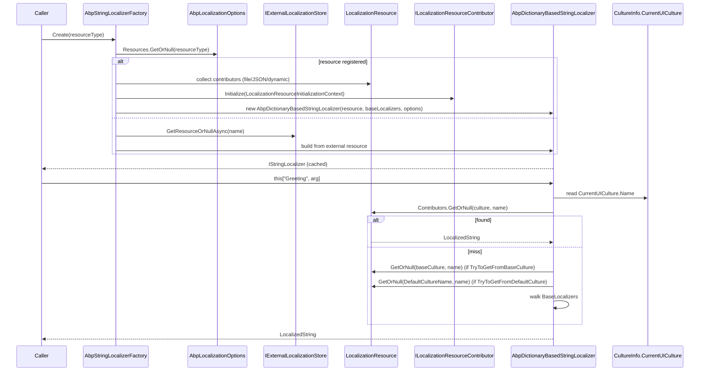

ABP localization resolves keys through a chain of resources — JSON/virtual files, base resources, external/dynamic stores, and the .NET resource manager — with culture fallback going country → language → default. The same factory powers `IStringLocalizer<T>` everywhere: controllers, application services, exception converters, and Razor views.

## Sequence



## Step-by-step walk-through

1. **Resource registration.** Modules declare resources in `ConfigureServices`:
   ```csharp
   Configure<AbpLocalizationOptions>(options =>
   {
       options.Resources
           .Add<MyAppResource>("en")
           .AddVirtualJson("/Localization/MyApp");
   });
   ```
   The fluent API maps to `LocalizationResourceDictionary.Add<TResource>(defaultCultureName)` (`framework/src/Volo.Abp.Localization/Volo/Abp/Localization/LocalizationResourceDictionary.cs`) which constructs a `LocalizationResource` and seeds it with a `VirtualFileLocalizationResourceContributor`.

2. **Resource type and inheritance.** `LocalizationResource` (`framework/src/Volo.Abp.Localization/Volo/Abp/Localization/LocalizationResource.cs`) records the CLR resource type and walks `IInheritedResourceTypesProvider` (default: `InheritResourceAttribute`) to populate `BaseResourceNames`. The factory chains base resources so values inherit unless overridden.

3. **Factory selection.** `AbpStringLocalizerFactory` (`framework/src/Volo.Abp.Localization/Volo/Abp/Localization/AbpStringLocalizerFactory.cs`) is registered as both `IStringLocalizerFactory` and `IAbpStringLocalizerFactory`. `Create(Type resourceType)` looks up the resource:
   ```csharp
   var resource = AbpLocalizationOptions.Resources.GetOrNull(resourceType);
   if (resource == null) return InnerFactory.Create(resourceType);  // .NET resx fallback
   return CreateInternal(resource.ResourceName, resource, lockCache);
   ```

4. **External fallback.** `CreateByResourceNameOrNullAsync` queries `IExternalLocalizationStore` when the resource isn't in options. This is how the language management module surfaces DB-stored resources.

5. **Cache.** `LocalizerCache` is a `ConcurrentDictionary<string, StringLocalizerCacheItem>` keyed by resource name. The semaphore guards first-time builds to avoid duplicate contributor initialization.

6. **Contributor wiring.** `CreateStringLocalizerCacheItem`:
   ```csharp
   foreach (var globalContributorType in AbpLocalizationOptions.GlobalContributors)
       resource.Contributors.Add(Activator.CreateInstance(globalContributorType)!.As<ILocalizationResourceContributor>());
   var context = new LocalizationResourceInitializationContext(resource, ServiceProvider);
   foreach (var contributor in resource.Contributors)
       contributor.Initialize(context);
   return new StringLocalizerCacheItem(
       new AbpDictionaryBasedStringLocalizer(
           resource,
           resource.BaseResourceNames
               .Select(x => CreateByResourceNameOrNullInternal(x, lockCache: false))
               .Where(x => x != null).ToList()!,
           AbpLocalizationOptions));
   ```

7. **Built-in contributors.**
   - `VirtualFileLocalizationResourceContributorBase` (`framework/src/Volo.Abp.Localization/Volo/Abp/Localization/VirtualFiles/VirtualFileLocalizationResourceContributorBase.cs`) reads JSON files embedded in module assemblies through `IVirtualFileProvider`.
   - `JsonLocalizationDictionaryBuilder` (`framework/src/Volo.Abp.Localization/Volo/Abp/Localization/Json/JsonLocalizationDictionaryBuilder.cs`) parses the `{ "culture": "en", "texts": { ... } }` shape.
   - `LocalizationResourceContributor` base class lives at `framework/src/Volo.Abp.Localization/Volo/Abp/Localization/External/...` for dynamic stores.

8. **Per-call lookup.** `AbpDictionaryBasedStringLocalizer.GetLocalizedString` (`framework/src/Volo.Abp.Localization/Volo/Abp/Localization/AbpDictionaryBasedStringLocalizer.cs`) reads the current culture:
   ```csharp
   protected virtual LocalizedString GetLocalizedString(string name)
       => GetLocalizedString(name, CultureInfo.CurrentUICulture.Name);
   ```
   `GetLocalizedStringFormatted(name, args)` then composes the format string.

9. **Fallback chain.** `GetLocalizedStringOrNull`:
   1. Try the requested culture (e.g. `tr-TR`) via `Resource.Contributors.GetOrNull(cultureName, name)`.
   2. If `AbpLocalizationOptions.TryToGetFromBaseCulture` is on and the culture has a region, try the base culture (`tr`).
   3. If `TryToGetFromDefaultCulture` is on, try `Resource.DefaultCultureName`.
   4. Walk `BaseLocalizers` (resources inherited via `[InheritResource]`).
   5. Return a `LocalizedString(name, name, resourceNotFound: true)` when nothing matches.

10. **Request culture pipeline.** ASP.NET Core's `RequestLocalizationMiddleware` runs the standard culture providers — `AbpRequestLocalizationOptionsManager` (`framework/src/Volo.Abp.AspNetCore/...`) injects ABP's `AbpUserRequestCultureProvider`, `AbpLocalizationHeaderRequestCultureProvider`, and cookie-based provider. The `MultiTenancyMiddleware` (see [multi-tenancy resolution](/flows/multi-tenancy-resolution)) supplies a default culture from `LocalizationSettingNames.DefaultLanguage` when no provider claimed the request.

11. **`MultiLingualObjects` integration.** Entities implementing `IMultiLingualObject<TTranslation>` use `MultiLingualObjectManager` (`framework/src/Volo.Abp.Localization/Volo/Abp/Localization/MultiLingualObjects/...`) to pick the translation row matching `CultureInfo.CurrentUICulture`, falling back via `AbpLocalizationOptions.TryToGetFromBaseCulture` and `TryToGetFromDefaultCulture`.

12. **Language listing.** `DefaultLanguageProvider` (`framework/src/Volo.Abp.Localization/Volo/Abp/Localization/DefaultLanguageProvider.cs`) returns `AbpLocalizationOptions.Languages`. The language management module replaces it with a DB-backed `LanguageProvider`. `LanguageInfoExtensions.GetTwoLetterISOLanguageName` is used by the UI to pick flags/labels.

## Hooks and extension points

| Hook | File | Purpose |
| --- | --- | --- |
| `ILocalizationResourceContributor` | `framework/src/Volo.Abp.Localization/Volo/Abp/Localization/ILocalizationResourceContributor.cs` | Add a custom source (e.g. CMS, Spreadsheet). |
| `[InheritResource(typeof(BaseResource))]` | `framework/src/Volo.Abp.Localization/Volo/Abp/Localization/InheritResourceAttribute.cs` | Compose resources. |
| `[LocalizationResourceName("MyApp")]` | `framework/src/Volo.Abp.Localization.Abstractions/Volo/Abp/Localization/LocalizationResourceNameAttribute.cs` | Override the on-wire resource name. |
| `IExternalLocalizationStore` | `framework/src/Volo.Abp.Localization/Volo/Abp/Localization/External/IExternalLocalizationStore.cs` | Dynamic/DB-stored resources. |
| `ILanguageProvider` | `framework/src/Volo.Abp.Localization/Volo/Abp/Localization/ILanguageProvider.cs` | Replace the supported-language list. |
| `ITemplateLocalizer` | `framework/src/Volo.Abp.Localization/Volo/Abp/Localization/ITemplateLocalizer.cs` | Localize template files (e.g. emails). |
| `ILocalizableStringSerializer` | `framework/src/Volo.Abp.Localization/Volo/Abp/Localization/ILocalizableStringSerializer.cs` | Persist `LocalizableString` payloads in JSON. |
| `IAbpStringLocalizer` | `framework/src/Volo.Abp.Localization/Volo/Abp/Localization/IAbpStringLocalizer.cs` | ABP-specific extensions over `IStringLocalizer`. |

## Related options classes

| Options | File |
| --- | --- |
| `AbpLocalizationOptions` | `framework/src/Volo.Abp.Localization/Volo/Abp/Localization/AbpLocalizationOptions.cs` |
| `LocalizationResourceDictionary` | `framework/src/Volo.Abp.Localization/Volo/Abp/Localization/LocalizationResourceDictionary.cs` |
| `LocalizationSettingNames` | `framework/src/Volo.Abp.Localization/Volo/Abp/Localization/LocalizationSettingNames.cs` |
| `AbpRequestLocalizationOptions` (via `AbpRequestLocalizationOptionsManager`) | `framework/src/Volo.Abp.AspNetCore/Microsoft/AspNetCore/RequestLocalization/AbpRequestLocalizationOptionsManager.cs` |

## Gotchas

- **`CurrentUICulture` is `AsyncLocal`.** Pure async code propagates the culture by default, but `Task.Run`/`new Thread` does not. Wrap with `CultureHelper.Use(culture)` to switch deterministically.
- **Resource cache is process-wide.** `AbpStringLocalizerFactory.LocalizerCache` is a singleton field. Hot-reload of resource JSON requires invalidating the cache (the language management module clears the entry on save).
- **`InnerFactory` fallback uses .NET resx.** Asking for an unregistered `IStringLocalizer<MyResource>` doesn't throw — it falls through to `ResourceManagerStringLocalizerFactory`, which silently returns the key. Misconfigured DI looks like missing translations.
- **`InheritResource` is depth-first.** The base resource's keys override only when the current resource has no entry for them. Cross-language overrides require explicit values per culture.
- **Default culture comes from the resource, not the request.** `Resource.DefaultCultureName` (set when registering) is the final fallback, regardless of the host's invariant culture. Forgetting it makes missing translations crash UI components that don't tolerate `ResourceNotFound = true`.
- **`TryToGetFromBaseCulture` is on by default.** `en-GB` requests resolve to `en` first; if you ship region-specific files only, leave it on. To force exact match, set the option to false at the module level.
- **External stores load asynchronously.** `CreateByResourceNameOrNullAsync` exists because `IExternalLocalizationStore` might hit the DB. Calling the sync `CreateByResourceNameOrNull` on a dynamic-only resource blocks the thread.

## Related pages

<CardGroup cols={2}>
  <Card title="Multi-tenancy resolution" icon="building" href="/flows/multi-tenancy-resolution" />
  <Card title="HTTP request lifecycle" icon="route" href="/flows/http-request-lifecycle" />
  <Card title="Settings management" icon="sliders" href="/framework/cross/settings" />
  <Card title="Language management module" icon="globe" href="/modules/language-management" />
</CardGroup>
