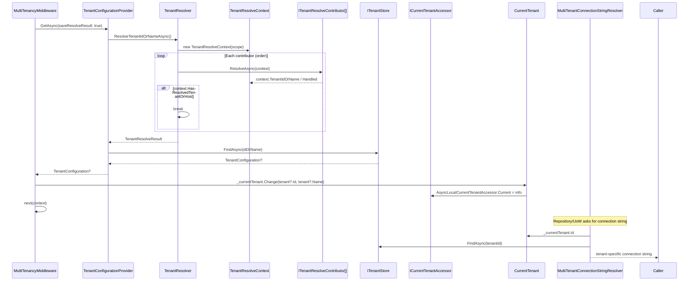

ABP picks the active tenant on every request through an ordered chain of `ITenantResolveContributor`s. The first contributor that handles the context wins; the resolved id/name is loaded into `ITenantStore`, attached to `ITenantResolveResultAccessor`, and surfaced as `ICurrentTenant` for the rest of the request. Downstream services — `MultiTenantConnectionStringResolver`, `TenantSettingValueProvider`, `PermissionChecker` — gate their behavior on this single value.

## Sequence



## Step-by-step walk-through

1. **Default contributor chain.** `AbpMultiTenancyModule.ConfigureServices` (`framework/src/Volo.Abp.MultiTenancy/Volo/Abp/MultiTenancy/AbpMultiTenancyModule.cs`) seeds the list with `CurrentUserTenantResolveContributor` at index 0. The ASP.NET Core extension `AbpAspNetCoreMultiTenancyModule.ConfigureServices` (`framework/src/Volo.Abp.AspNetCore.MultiTenancy/Volo/Abp/AspNetCore/MultiTenancy/AbpAspNetCoreMultiTenancyModule.cs`) appends the HTTP contributors in this order:
   ```csharp
   options.TenantResolvers.Add(new QueryStringTenantResolveContributor());
   options.TenantResolvers.Add(new RouteTenantResolveContributor());
   options.TenantResolvers.Add(new HeaderTenantResolveContributor());
   options.TenantResolvers.Add(new CookieTenantResolveContributor());
   ```
   Applications can register `DomainTenantResolveContributor` (`framework/src/Volo.Abp.AspNetCore.MultiTenancy/Volo/Abp/AspNetCore/MultiTenancy/DomainTenantResolveContributor.cs`) by calling `options.TenantResolvers.Add(new DomainTenantResolveContributor("{0}.mysite.com"))`.

2. **`MultiTenancyMiddleware`.** (`framework/src/Volo.Abp.AspNetCore.MultiTenancy/Volo/Abp/AspNetCore/MultiTenancy/MultiTenancyMiddleware.cs`) is registered by `app.UseMultiTenancy()`. It calls:
   ```csharp
   tenant = await _tenantConfigurationProvider.GetAsync(saveResolveResult: true);
   ```
   On exception it invokes the configurable `AbpAspNetCoreMultiTenancyOptions.MultiTenancyMiddlewareErrorPageBuilder` and short-circuits if it returns true.

3. **`TenantConfigurationProvider.GetAsync`.** (`framework/src/Volo.Abp.MultiTenancy/Volo/Abp/MultiTenancy/TenantConfigurationProvider.cs`) calls `TenantResolver.ResolveTenantIdOrNameAsync()`, stores the `TenantResolveResult` in `ITenantResolveResultAccessor.Result` when requested, then loads the configuration:
   ```csharp
   tenant = await FindTenantAsync(resolveResult.TenantIdOrName);
   if (tenant == null) throw new BusinessException("Volo.AbpIo.MultiTenancy:010001", ...);
   if (!tenant.IsActive) throw new BusinessException("Volo.AbpIo.MultiTenancy:010002", ...);
   ```
   Both error codes are localized via `IStringLocalizer<AbpMultiTenancyResource>`.

4. **`TenantResolver.ResolveTenantIdOrNameAsync`.** (`framework/src/Volo.Abp.MultiTenancy/Volo/Abp/MultiTenancy/TenantResolver.cs`) opens a scope, builds a `TenantResolveContext`, then walks `_options.TenantResolvers` in order:
   ```csharp
   foreach (var tenantResolver in _options.TenantResolvers)
   {
       await tenantResolver.ResolveAsync(context);
       result.AppliedResolvers.Add(tenantResolver.Name);
       if (context.HasResolvedTenantOrHost()) {
           result.TenantIdOrName = context.TenantIdOrName;
           break;
       }
   }
   ```
   `HasResolvedTenantOrHost()` returns true when `context.TenantIdOrName != null` *or* `context.Handled == true` — the latter means "treat the request as host scope".

5. **Built-in contributors.**

   | Contributor | File | Behavior |
   | --- | --- | --- |
   | `CurrentUserTenantResolveContributor` | `framework/src/Volo.Abp.MultiTenancy/Volo/Abp/MultiTenancy/CurrentUserTenantResolveContributor.cs` | If `ICurrentUser.IsAuthenticated`, sets `context.Handled = true` and `context.TenantIdOrName = currentUser.TenantId?.ToString()`. Authenticated users override URL-based hints. |
   | `QueryStringTenantResolveContributor` | `framework/src/Volo.Abp.AspNetCore.MultiTenancy/.../QueryStringTenantResolveContributor.cs` | Reads `?__tenant=` (key from `AbpAspNetCoreMultiTenancyOptions.TenantKey`). Empty value marks the request as host. |
   | `RouteTenantResolveContributor` | `…/RouteTenantResolveContributor.cs` | Reads `{__tenant}` route parameter. |
   | `HeaderTenantResolveContributor` | `…/HeaderTenantResolveContributor.cs` | Reads `__tenant` HTTP header. Warns when multiple values are provided. |
   | `CookieTenantResolveContributor` | `…/CookieTenantResolveContributor.cs` | Reads the `__tenant` cookie. |
   | `DomainTenantResolveContributor` | `…/DomainTenantResolveContributor.cs` | Extracts the tenant segment from the request host using `FormattedStringValueExtracter.Extract`. |
   | `ActionTenantResolveContributor` | `framework/src/Volo.Abp.MultiTenancy/Volo/Abp/MultiTenancy/ActionTenantResolveContributor.cs` | Wraps a user-provided `Func<ITenantResolveContext, Task>`. |
   | `ConfigurationTenantResolveContributor` | `framework/src/Volo.Abp.MultiTenancy/Volo/Abp/MultiTenancy/ConfigurationStore/...` | Reads from `appsettings.json`. |

6. **`HasResolvedTenantOrHost` semantics.** The `Handled` flag is critical. `CurrentUserTenantResolveContributor` always sets it true to claim the chain — even when the user has no tenant (host user), so query-string spoofing can't downgrade an authenticated host user back into a tenant.

7. **Tenant load.** `TenantConfigurationProvider.FindTenantAsync` parses the id as `Guid` first and falls back to name lookup via `ITenantStore.FindAsync(string)`. The default in-memory implementation is `ConfigurationTenantStore` (`framework/src/Volo.Abp.MultiTenancy/Volo/Abp/MultiTenancy/ConfigurationStore/ConfigurationTenantStore.cs`). The `Volo.Abp.TenantManagement.Domain` module replaces it with a database-backed store.

8. **`CurrentTenant.Change`.** Once a tenant is found, the middleware calls:
   ```csharp
   using (_currentTenant.Change(tenant?.Id, tenant?.Name))
   {
       ...
       await next(context);
   }
   ```
   `CurrentTenant.Change` (`framework/src/Volo.Abp.MultiTenancy/Volo/Abp/MultiTenancy/CurrentTenant.cs`) writes a new `BasicTenantInfo` into `AsyncLocalCurrentTenantAccessor.Instance.Current` and returns a `DisposeAction` that restores the previous value. The accessor is registered as a singleton in `AbpMultiTenancyModule`.

9. **Cookie/culture side effects.** When the query-string contributor was the resolver, the middleware writes a `__tenant` cookie via `AbpMultiTenancyCookieHelper.SetTenantCookie` so subsequent requests don't need the query parameter. It also reads `LocalizationSettingNames.DefaultLanguage` from `ISettingProvider` and pins `CultureInfo.CurrentCulture` if the request hasn't already chosen one — see [localization resolution](/flows/localization-resolution).

10. **Connection string routing.** `MultiTenantConnectionStringResolver` (`framework/src/Volo.Abp.MultiTenancy/Volo/Abp/MultiTenancy/MultiTenantConnectionStringResolver.cs`) replaces the default resolver. When `ICurrentTenant.Id` is non-null:
    ```csharp
    var tenant = await FindTenantConfigurationAsync(_currentTenant.Id.Value);
    if (tenant?.ConnectionStrings == null) return await base.ResolveAsync(connectionStringName);
    var tenantDefault = tenant.ConnectionStrings?.Default;
    if (connectionStringName == null || connectionStringName == ConnectionStrings.DefaultConnectionStringName)
        return !tenantDefault.IsNullOrWhiteSpace() ? tenantDefault : Options.ConnectionStrings.Default!;
    var connString = tenant.ConnectionStrings?.GetOrDefault(connectionStringName);
    if (!connString.IsNullOrWhiteSpace()) return connString;
    var database = Options.Databases.GetMappedDatabaseOrNull(connectionStringName);
    if (database != null && database.IsUsedByTenants) ...
    ```
    The fallback chain — named tenant string → tenant default → mapped database → global named → global default — is what enables per-tenant databases.

11. **Setting fallback.** `TenantSettingValueProvider` (`framework/src/Volo.Abp.MultiTenancy/Volo/Abp/MultiTenancy/TenantSettingValueProvider.cs`) is inserted after `GlobalSettingValueProvider`. It returns tenant-scoped setting values when `ICurrentTenant.Id` is set, otherwise defers.

## Hooks and extension points

| Hook | File | Purpose |
| --- | --- | --- |
| `ITenantResolveContributor` | `framework/src/Volo.Abp.MultiTenancy/Volo/Abp/MultiTenancy/ITenantResolveContributor.cs` | Add a new resolution source. |
| `TenantResolveContributorBase` | `framework/src/Volo.Abp.MultiTenancy/Volo/Abp/MultiTenancy/TenantResolveContributorBase.cs` | Base class with `Name` discriminator. |
| `HttpTenantResolveContributorBase` | `framework/src/Volo.Abp.AspNetCore.MultiTenancy/Volo/Abp/AspNetCore/MultiTenancy/HttpTenantResolveContributorBase.cs` | Base for HTTP-context-bound contributors. |
| `ITenantStore` | `framework/src/Volo.Abp.MultiTenancy.Abstractions/Volo/Abp/MultiTenancy/ITenantStore.cs` | Tenant lookup backend. |
| `ITenantResolveResultAccessor` | `framework/src/Volo.Abp.MultiTenancy/Volo/Abp/MultiTenancy/ITenantResolveResultAccessor.cs` | Inspect which contributor handled the request. |
| `ICurrentTenant.Change(Guid?, string?)` | `framework/src/Volo.Abp.MultiTenancy.Abstractions/Volo/Abp/MultiTenancy/ICurrentTenant.cs` | Programmatically switch tenant in a scope. |
| `AbpAspNetCoreMultiTenancyOptions.MultiTenancyMiddlewareErrorPageBuilder` | `framework/src/Volo.Abp.AspNetCore.MultiTenancy/Volo/Abp/AspNetCore/MultiTenancy/AbpAspNetCoreMultiTenancyOptions.cs` | Custom error page on resolution failure. |

## Related options classes

| Options | File |
| --- | --- |
| `AbpTenantResolveOptions` | `framework/src/Volo.Abp.MultiTenancy/Volo/Abp/MultiTenancy/AbpTenantResolveOptions.cs` |
| `AbpAspNetCoreMultiTenancyOptions` | `framework/src/Volo.Abp.AspNetCore.MultiTenancy/Volo/Abp/AspNetCore/MultiTenancy/AbpAspNetCoreMultiTenancyOptions.cs` |
| `AbpDefaultTenantStoreOptions` | `framework/src/Volo.Abp.MultiTenancy/Volo/Abp/MultiTenancy/ConfigurationStore/AbpDefaultTenantStoreOptions.cs` |
| `AbpDbConnectionOptions` | `framework/src/Volo.Abp.Data/Volo/Abp/Data/AbpDbConnectionOptions.cs` |

## Gotchas

- **Order is meaningful.** `CurrentUserTenantResolveContributor` sits at index 0 — an authenticated user *always* overrides URL hints. Reordering it after the URL contributors is a common foot-gun.
- **`Handled = true` with null `TenantIdOrName` means HOST.** A contributor can declare host scope by setting `Handled` without setting an id. Subsequent contributors are skipped.
- **`BusinessException` from inactive tenants.** The middleware-level error handler converts `Volo.AbpIo.MultiTenancy:010001/010002` into a 4xx error. If you skip `UseMultiTenancy` but call `ITenantConfigurationProvider.GetAsync(...)` manually, your code must catch it.
- **`AsyncLocal` is process-wide and shared.** `AsyncLocalCurrentTenantAccessor.Instance` is a singleton. Background hosts and tests that mutate `Current` must use `ICurrentTenant.Change` (which returns a disposable) instead of writing to `.Current` directly.
- **Connection string fallback is silent.** If the tenant's named connection string is missing, `MultiTenantConnectionStringResolver` quietly falls back to global. Misconfigured tenants therefore hit the host DB — a high-impact data-leak bug.
- **`UseMultiTenancy` order.** Place `app.UseMultiTenancy()` *after* `app.UseAuthentication()` so `ICurrentUser` reflects the authenticated user when `CurrentUserTenantResolveContributor` runs, but *before* `app.UseAbpRequestLocalization()` so culture switches by tenant work.

## Related pages

<CardGroup cols={2}>
  <Card title="HTTP request lifecycle" icon="route" href="/flows/http-request-lifecycle" />
  <Card title="Tenant management module" icon="building" href="/modules/tenant-management" />
  <Card title="Authorization flow" icon="shield" href="/flows/authorization-flow" />
  <Card title="Localization resolution" icon="globe" href="/flows/localization-resolution" />
</CardGroup>
