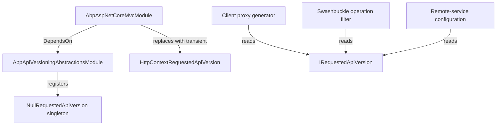

ABP does not implement HTTP API versioning itself — it integrates with
[`Asp.Versioning`](https://github.com/dotnet/aspnet-api-versioning) on
the host side. To keep framework packages (`Volo.Abp.AspNetCore.Mvc`,
the dynamic clients, the application-configuration service) free of a
direct dependency on that library, ABP ships
`Volo.Abp.ApiVersioning.Abstractions`: one interface, one null
implementation, one marker module. That's enough to let any code that
needs to know "what version is the caller requesting" do so via DI,
while leaving the actual version-resolution to the host.

<CardGroup cols={2}>
  <Card title="AspNetCore Mvc" icon="route" href="/framework/aspnetcore/aspnetcore-mvc">
    The module that depends on these abstractions and overrides them per request.
  </Card>
  <Card title="Remote Services" icon="cloud" href="/framework/aspnetcore/remote-services">
    `RemoteServiceConfiguration.Version` consumed by the C# client side.
  </Card>
</CardGroup>

## File inventory

```text framework/src/Volo.Abp.ApiVersioning.Abstractions
Volo/Abp/ApiVersioning/
├── AbpApiVersioningAbstractionsModule.cs
├── IRequestedApiVersion.cs
└── NullRequestedApiVersion.cs
```

Three files. That's the entire package.

## The module

```csharp framework/src/Volo.Abp.ApiVersioning.Abstractions/Volo/Abp/ApiVersioning/AbpApiVersioningAbstractionsModule.cs
public class AbpApiVersioningAbstractionsModule : AbpModule
{
    public override void ConfigureServices(ServiceConfigurationContext context)
    {
        context.Services.AddSingleton<IRequestedApiVersion>(NullRequestedApiVersion.Instance);
    }
}
```

A single registration: `IRequestedApiVersion ⇒ NullRequestedApiVersion`
as a singleton. Any package that depends on this module can resolve
`IRequestedApiVersion` and get a non-null instance back. The MVC module
later **replaces** the registration with one that reads from
`HttpContext` (see "Per-request override" below).

## Abstractions table

| Type | Kind | Purpose |
| ---- | ---- | ------- |
| `AbpApiVersioningAbstractionsModule` | `AbpModule` | Registers `IRequestedApiVersion ⇒ NullRequestedApiVersion`. |
| `IRequestedApiVersion` | interface | One read-only `Current` property: the requested version, or `null`. |
| `NullRequestedApiVersion` | sentinel | Returns `null`. Safe singleton: `NullRequestedApiVersion.Instance`. |

## The interface

```csharp framework/src/Volo.Abp.ApiVersioning.Abstractions/Volo/Abp/ApiVersioning/IRequestedApiVersion.cs
namespace Volo.Abp.ApiVersioning;

public interface IRequestedApiVersion
{
    string? Current { get; }
}
```

Two design choices to call out:

1. **String-typed.** Versions on the wire are strings (`"1.0"`,
   `"2024-04-12-preview"`, `"v2"`). The abstraction does not impose a
   `Version` struct because the underlying library accepts both
   `Version` and `string` and ABP applications use both in the wild.
2. **Nullable.** A `null` value means "the caller did not specify a
   version" — distinct from "the caller asked for version 0". The
   downstream consumer (e.g. `AbpRemoteServiceApiDescriptionProvider`)
   decides whether to fall back to a default.

## The null implementation

```csharp framework/src/Volo.Abp.ApiVersioning.Abstractions/Volo/Abp/ApiVersioning/NullRequestedApiVersion.cs
public class NullRequestedApiVersion : IRequestedApiVersion
{
    public static NullRequestedApiVersion Instance = new NullRequestedApiVersion();

    public string? Current => null;

    private NullRequestedApiVersion()
    {
    }
}
```

The private constructor + static `Instance` field gives you a free,
allocation-cheap singleton that doubles as a sentinel: code that wants
to know "is this the null impl" can compare references against
`NullRequestedApiVersion.Instance`.

## Per-request override

The base registration is a singleton — fine for processes that don't
care about API versions. ASP.NET Core MVC overrides it with a scoped
implementation that reads from `HttpContext`. The actual override
lives in `Volo.Abp.AspNetCore.Mvc/Volo/Abp/AspNetCore/Mvc/Versioning/HttpContextRequestedApiVersion.cs`:

```csharp framework/src/Volo.Abp.AspNetCore.Mvc/Volo/Abp/AspNetCore/Mvc/Versioning/HttpContextRequestedApiVersion.cs
namespace Volo.Abp.AspNetCore.Mvc.Versioning;

public class HttpContextRequestedApiVersion : IRequestedApiVersion, ITransientDependency
{
    private readonly IHttpContextAccessor _httpContextAccessor;

    public HttpContextRequestedApiVersion(IHttpContextAccessor httpContextAccessor)
    {
        _httpContextAccessor = httpContextAccessor;
    }

    public string? Current => _httpContextAccessor.HttpContext?.GetRequestedApiVersion()?.ToString();
}
```

`HttpContext.GetRequestedApiVersion()` is the `Asp.Versioning` extension
method that returns the negotiated `ApiVersion`. With this registration
in place:

- Inside an HTTP request, `IRequestedApiVersion.Current` reflects
  whatever Asp.Versioning chose (`?api-version=2.0`, the URL segment,
  the `X-Api-Version` header, etc).
- Outside any HTTP request (background workers, tests, hosted services),
  `_httpContextAccessor.HttpContext` is null and the property returns
  `null`, which is exactly the same behaviour as the sentinel impl.

## Why this layout?



Three downstream consumers benefit from the indirection:

- **Dynamic C# clients** read `IRequestedApiVersion.Current` and use it
  as part of the cache key for proxy creation, so two callers
  targeting different API versions don't share a single proxy.
- **`AbpRemoteServiceApiDescriptionProvider`** filters the controller
  set Swashbuckle sees based on the version the OpenAPI document is
  being generated for.
- **Per-version remote service configuration.**
  `RemoteServiceConfiguration.Version` (see
  [remote-services](/framework/aspnetcore/remote-services)) can be
  filled from `IRequestedApiVersion.Current` when you want a single
  client process to target multiple back-end versions.

## Options surface

There are no options classes in this package — the abstractions are
intentionally too small to need any. Configuration for the real
versioning behaviour lives on the
`Microsoft.Extensions.DependencyInjection.AbpApiVersioningExtensions`
extension method (in `Volo.Abp.AspNetCore.Mvc`) that wraps
`AddApiVersioning()` from `Asp.Versioning.Mvc`.

## When to depend on this package directly

You almost never reference `Volo.Abp.ApiVersioning.Abstractions`
explicitly — it ships transitively through `Volo.Abp.AspNetCore.Mvc`.
The places it does come up:

1. **Authoring a non-MVC package** that needs to know the requested
   API version (for example, a custom gRPC-to-HTTP bridge) — depend on
   the abstractions and resolve `IRequestedApiVersion` without
   committing to ASP.NET Core MVC.
2. **Writing a unit-test fake.** Substitute the registration with a
   manual implementation that returns a fixed string for assertions.

```csharp
context.Services.Replace(ServiceDescriptor.Singleton<IRequestedApiVersion>(
    new FixedRequestedApiVersion("2.0")
));
```

## See also

- [`AspNetCore.Mvc`](/framework/aspnetcore/aspnetcore-mvc) — the
  package that supplies the `HttpContext`-aware implementation.
- [Asp.Versioning project](https://github.com/dotnet/aspnet-api-versioning)
  — the upstream library ABP integrates with rather than re-implements.
- [`Remote Services`](/framework/aspnetcore/remote-services) for
  per-version `RemoteServiceConfiguration` entries.
