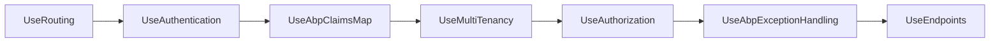

The base `Volo.Abp.MultiTenancy` package gives you `ICurrentTenant`,
`ITenantResolveContributor` and the resolver chain. The ASP.NET Core
package adds the things that only make sense when there's an
`HttpContext`: a middleware that resolves the tenant and pushes it
onto the ambient `ICurrentTenant`, five HTTP-aware resolve
contributors, and a configurable error page builder for when nothing
matches.

<CardGroup cols={2}>
  <Card title="MultiTenancy core" icon="building" href="/framework/multitenancy/multi-tenancy">
    `ICurrentTenant`, `ITenantConfigurationProvider`, the resolver chain.
  </Card>
  <Card title="AspNetCore" icon="server" href="/framework/aspnetcore/aspnetcore">
    The middleware pipeline this module slots into.
  </Card>
</CardGroup>

## File map

```text framework/src/Volo.Abp.AspNetCore.MultiTenancy
Microsoft/AspNetCore/Builder/
└── AbpAspNetCoreMultiTenancyApplicationBuilderExtensions.cs
Volo/Abp/AspNetCore/MultiTenancy/
├── AbpAspNetCoreMultiTenancyModule.cs
├── AbpAspNetCoreMultiTenancyOptions.cs
├── AbpMultiTenancyCookieHelper.cs
├── CookieTenantResolveContributor.cs
├── DomainTenantResolveContributor.cs
├── FormTenantResolveContributor.cs
├── HeaderTenantResolveContributor.cs
├── HttpContextTenantResolveResultAccessor.cs
├── HttpTenantResolveContributorBase.cs
├── MultiTenancyMiddleware.cs
├── QueryStringTenantResolveContributor.cs
├── RouteTenantResolveContributor.cs
└── TenantResolveContextExtensions.cs
Volo/Abp/MultiTenancy/
└── AbpMultiTenancyOptionsExtensions.cs
```

## Abstractions table

| Type | Kind | Purpose |
| ---- | ---- | ------- |
| `MultiTenancyMiddleware` | middleware | Resolves the tenant once per request, opens `ICurrentTenant.Change` scope. |
| `HttpTenantResolveContributorBase` | abstract | Common skeleton that pulls `HttpContext` out of `ITenantResolveContext.ServiceProvider`. |
| `QueryStringTenantResolveContributor` | `ITenantResolveContributor` | Reads `?__tenant=…`. |
| `RouteTenantResolveContributor` | `ITenantResolveContributor` | Reads `{__tenant}` from the route. |
| `HeaderTenantResolveContributor` | `ITenantResolveContributor` | Reads `__tenant` request header. |
| `CookieTenantResolveContributor` | `ITenantResolveContributor` | Reads the tenant cookie. |
| `FormTenantResolveContributor` | `ITenantResolveContributor` | Reads `__tenant` from a posted form. |
| `DomainTenantResolveContributor` | `ITenantResolveContributor` | Pattern-matches the request host against a domain template. |
| `AbpAspNetCoreMultiTenancyOptions` | options | `TenantKey`, `MultiTenancyMiddlewareErrorPageBuilder`. |
| `AbpMultiTenancyCookieHelper` | helper | Sets / clears the `__tenant` cookie consistently. |
| `HttpContextTenantResolveResultAccessor` | implementation | Stores the resolve result in `HttpContext.Items`. |

## The module

```csharp framework/src/Volo.Abp.AspNetCore.MultiTenancy/Volo/Abp/AspNetCore/MultiTenancy/AbpAspNetCoreMultiTenancyModule.cs
[DependsOn(
    typeof(AbpMultiTenancyModule),
    typeof(AbpAspNetCoreModule)
)]
public class AbpAspNetCoreMultiTenancyModule : AbpModule
{
    public override void ConfigureServices(ServiceConfigurationContext context)
    {
        Configure<AbpTenantResolveOptions>(options =>
        {
            options.TenantResolvers.Add(new QueryStringTenantResolveContributor());
            options.TenantResolvers.Add(new RouteTenantResolveContributor());
            options.TenantResolvers.Add(new HeaderTenantResolveContributor());
            options.TenantResolvers.Add(new CookieTenantResolveContributor());
        });
    }
}
```

The four contributors above are registered **after** the contributors
the core `AbpMultiTenancyModule` already added (today that includes
the `CurrentUserTenantResolveContributor` only). The default precedence
order is therefore:

1. `CurrentUserTenantResolveContributor` *(from the host's principal)*
2. `QueryStringTenantResolveContributor` *(`?__tenant=`)*
3. `RouteTenantResolveContributor` *(`{__tenant}`)*
4. `HeaderTenantResolveContributor` *(`__tenant` header)*
5. `CookieTenantResolveContributor` *(`__tenant` cookie)*

The first resolver that returns a non-null id wins; later resolvers do
not run.

The `DomainTenantResolveContributor` is **not** registered by default
because it needs to be parameterised with a domain template. To add
it (almost always as the first contributor), do:

```csharp
Configure<AbpTenantResolveOptions>(options =>
{
    options.TenantResolvers.Insert(0, new DomainTenantResolveContributor("{0}.example.com"));
});
```

## The middleware

```csharp framework/src/Volo.Abp.AspNetCore.MultiTenancy/Volo/Abp/AspNetCore/MultiTenancy/MultiTenancyMiddleware.cs
public async Task InvokeAsync(HttpContext context, RequestDelegate next)
{
    TenantConfiguration? tenant = null;
    try
    {
        tenant = await _tenantConfigurationProvider.GetAsync(saveResolveResult: true);
    }
    catch (Exception e)
    {
        Logger.LogException(e);

        if (await _options.MultiTenancyMiddlewareErrorPageBuilder(context, e))
        {
            return;
        }
    }

    if (tenant?.Id != _currentTenant.Id)
    {
        using (_currentTenant.Change(tenant?.Id, tenant?.Name))
        {
            if (_tenantResolveResultAccessor.Result != null &&
                _tenantResolveResultAccessor.Result.AppliedResolvers.Contains(QueryStringTenantResolveContributor.ContributorName))
            {
                AbpMultiTenancyCookieHelper.SetTenantCookie(context, _currentTenant.Id, _options.TenantKey);
            }

            var requestCulture = await TryGetRequestCultureAsync(context);
            if (requestCulture != null)
            {
                CultureInfo.CurrentCulture = requestCulture.Culture;
                CultureInfo.CurrentUICulture = requestCulture.UICulture;
                AbpRequestCultureCookieHelper.SetCultureCookie(
                    context,
                    requestCulture
                );
                context.Items[AbpRequestLocalizationMiddleware.HttpContextItemName] = true;
            }

            await next(context);
        }
    }
    else
    {
        await next(context);
    }
}
```

What the middleware guarantees:

1. **Single resolve per request.** The result is also stashed on
   `HttpContext.Items` via `HttpContextTenantResolveResultAccessor`,
   so contributors and downstream code share the same conclusion.
2. **`ICurrentTenant` scope.** Wraps the rest of the pipeline in
   `currentTenant.Change(...)`, which is the same primitive used by
   ABP background workers — repository filters, data filters,
   distributed events all read it transparently.
3. **Cookie persistence for query-string resolves.** When a request
   arrives with `?__tenant=acme`, the middleware writes the tenant
   cookie so the next page-refresh keeps the same tenant even without
   the query string.
4. **Tenant-default culture handling.** If the tenant has a default
   language set and no other localisation provider has chosen one yet,
   it sets the culture, writes the culture cookie, and stamps
   `AbpRequestLocalizationMiddleware.HttpContextItemName` so the
   localisation middleware further up doesn't write it again.

### Middleware ordering



`UseMultiTenancy` must run **after** `UseAuthentication` (so
`CurrentUserTenantResolveContributor` can read the principal) and
**before** `UseAuthorization` (so policies see the resolved tenant).
`AbpAspNetCoreMultiTenancyApplicationBuilderExtensions.UseMultiTenancy`
is the dedicated extension method applications call.

## The HTTP-aware resolve contributors

### Base class

`HttpTenantResolveContributorBase` factors out the boilerplate of
pulling the `HttpContext` from the resolver context and handling
absent contexts gracefully. Subclasses only implement
`GetTenantIdOrNameFromHttpContextOrNullAsync`.

### `QueryStringTenantResolveContributor`

```csharp framework/src/Volo.Abp.AspNetCore.MultiTenancy/Volo/Abp/AspNetCore/MultiTenancy/QueryStringTenantResolveContributor.cs
protected override Task<string?> GetTenantIdOrNameFromHttpContextOrNullAsync(ITenantResolveContext context, HttpContext httpContext)
{
    if (httpContext.Request.QueryString.HasValue)
    {
        var tenantKey = context.GetAbpAspNetCoreMultiTenancyOptions().TenantKey;
        if (httpContext.Request.Query.ContainsKey(tenantKey))
        {
            var tenantValue = httpContext.Request.Query[tenantKey].ToString();
            if (tenantValue.IsNullOrWhiteSpace())
            {
                context.Handled = true;
                return Task.FromResult<string?>(null);
            }

            return Task.FromResult(tenantValue)!;
        }
    }

    return Task.FromResult<string?>(null);
}
```

Notice the `context.Handled = true` line in the empty-value branch: it
short-circuits the resolver chain when the user explicitly wants the
host (`?__tenant=`). Without it, a later contributor (e.g. cookie)
would silently re-introduce the previous tenant.

### `RouteTenantResolveContributor`

```csharp framework/src/Volo.Abp.AspNetCore.MultiTenancy/Volo/Abp/AspNetCore/MultiTenancy/RouteTenantResolveContributor.cs
protected override Task<string?> GetTenantIdOrNameFromHttpContextOrNullAsync(ITenantResolveContext context, HttpContext httpContext)
{
    var tenantId = httpContext.GetRouteValue(context.GetAbpAspNetCoreMultiTenancyOptions().TenantKey);
    return Task.FromResult(tenantId != null ? Convert.ToString(tenantId) : null);
}
```

For this to fire you need a route template that includes the tenant
key, e.g.:

```csharp
endpoints.MapControllerRoute("multiTenant", "{__tenant}/{controller}/{action=Index}");
```

### `DomainTenantResolveContributor`

```csharp framework/src/Volo.Abp.AspNetCore.MultiTenancy/Volo/Abp/AspNetCore/MultiTenancy/DomainTenantResolveContributor.cs
public class DomainTenantResolveContributor : HttpTenantResolveContributorBase
{
    public const string ContributorName = "Domain";
    public override string Name => ContributorName;

    private static readonly string[] ProtocolPrefixes = { "http://", "https://" };

    private readonly string _domainFormat;

    public DomainTenantResolveContributor(string domainFormat)
    {
        _domainFormat = domainFormat.RemovePreFix(ProtocolPrefixes);
    }

    protected override Task<string?> GetTenantIdOrNameFromHttpContextOrNullAsync(ITenantResolveContext context, HttpContext httpContext)
    {
        if (!httpContext.Request.Host.HasValue)
        {
            return Task.FromResult<string?>(null);
        }

        var hostName = httpContext.Request.Host.Value.RemovePreFix(ProtocolPrefixes);
        var extractResult = FormattedStringValueExtracter.Extract(hostName, _domainFormat, ignoreCase: true);

        context.Handled = true;

        return Task.FromResult(extractResult.IsMatch ? extractResult.Matches[0].Value : null);
    }
}
```

`FormattedStringValueExtracter` is a pattern-extracter (not a regex)
that reads `{name}` slots out of a template — so
`"{0}.example.com"` matches `acme.example.com` and returns
`"acme"`. Note that `context.Handled = true` is set unconditionally:
once you've opted into domain-based tenancy, you do not want a
cookie/header to override the host name.

### Cookie / Header / Form

Each is a single dictionary lookup; their `ContributorName` constant
is what shows up in `ITenantResolveResult.AppliedResolvers`.

## `AbpAspNetCoreMultiTenancyOptions`

| Knob | Default | Effect |
| ---- | ------- | ------ |
| `TenantKey` | `TenantResolverConsts.DefaultTenantKey` (`"__tenant"`) | The key used by all five resolvers and the cookie helper. |
| `MultiTenancyMiddlewareErrorPageBuilder` | A built-in delegate (see below) | Renders the response when the tenant resolver throws. |

The default error-page builder is non-trivial. When tenant resolution
throws, it:

1. Detects whether the current user is authenticated **only** by the
   `CurrentUserTenantResolveContributor` — if so, the tenant the user
   was signed into has likely been deleted or deactivated. It then
   signs the cookie-auth session out.
2. Always clears the `__tenant` cookie (the value would otherwise
   keep failing).
3. Adds the `Abp-Tenant-Resolve-Error` response header carrying the
   exception message.
4. If the request is AJAX, writes a `RemoteServiceErrorResponse` JSON
   body with status `404 Not Found`.
5. Otherwise — for a `GET` from a cookie-auth user — issues a
   `302` redirect back to the same URL so the (now signed-out) user
   sees the login page.
6. Falls back to a minimal HTML page with the exception details.

You override this builder when you want to redirect to a tenant-error
page in your own theme:

```csharp
Configure<AbpAspNetCoreMultiTenancyOptions>(options =>
{
    options.MultiTenancyMiddlewareErrorPageBuilder = async (context, exception) =>
    {
        context.Response.Redirect("/tenant-error?message=" + Uri.EscapeDataString(exception.Message));
        return true;
    };
});
```

Return `true` to stop the pipeline; return `false` and `next(context)`
will still be invoked.

## Cookie helper

```csharp framework/src/Volo.Abp.AspNetCore.MultiTenancy/Volo/Abp/AspNetCore/MultiTenancy/AbpMultiTenancyCookieHelper.cs (signature)
public static class AbpMultiTenancyCookieHelper
{
    public static void SetTenantCookie(HttpContext httpContext, Guid? tenantId, string tenantKey);
}
```

`SetTenantCookie(null, …)` deletes the cookie. The middleware calls
this when query-string resolve succeeds (persist) and the default
error-page builder calls it on resolve failure (clear).

## Options table

| Options class | Knob | Default | Set by |
| ------------- | ---- | ------- | ------ |
| `AbpTenantResolveOptions.TenantResolvers` | `List<ITenantResolveContributor>` | base + query/route/header/cookie | `AbpMultiTenancyModule` + `AbpAspNetCoreMultiTenancyModule` |
| `AbpAspNetCoreMultiTenancyOptions.TenantKey` | string | `"__tenant"` | this module |
| `AbpAspNetCoreMultiTenancyOptions.MultiTenancyMiddlewareErrorPageBuilder` | delegate | built-in | this module |

## See also

- [MultiTenancy core](/framework/cross/multi-tenancy) — the
  `ICurrentTenant` scope and resolver chain.
- [`AspNetCore`](/framework/aspnetcore/aspnetcore) — middleware
  ordering and the request-localisation cookie that this module
  cooperates with.
- [`AspNetCore.Mvc.Contracts`](/framework/aspnetcore/aspnetcore-mvc-contracts)
  — `IAbpTenantAppService` for the SPA login screen tenant lookup.
