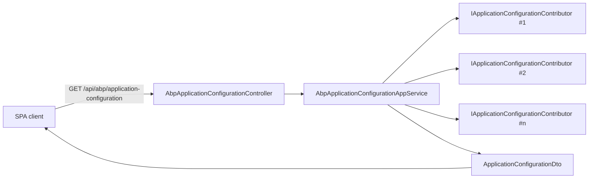

`Volo.Abp.AspNetCore.Mvc.Contracts` is the **client surface** for the
MVC integration. It contains no controllers, no services and no
ASP.NET Core references — only the DTOs and the application-service
interfaces that the runtime hosts and that generated SDKs (TypeScript,
C#, Angular) consume.

Every modern ABP client (Blazor, Angular, MAUI, JS) calls two endpoints
right after authentication:

1. `GET /api/abp/application-configuration` ⇒ `ApplicationConfigurationDto`
2. `GET /api/abp/application-localization` ⇒ `ApplicationLocalizationDto`

The DTOs returned live in this package, which is why client libraries
can take a dependency on it without pulling in the entire MVC stack.

<CardGroup cols={2}>
  <Card title="AspNetCore Mvc" icon="route" href="/framework/aspnetcore/aspnetcore-mvc">
    The runtime implementation of these contracts.
  </Card>
  <Card title="Object Extending" icon="puzzle-piece" href="/framework/ddd/object-extending">
    What populates the extension-property DTOs documented below.
  </Card>
</CardGroup>

## File map

```text framework/src/Volo.Abp.AspNetCore.Mvc.Contracts
Volo/Abp/AspNetCore/Mvc/
├── AbpAspNetCoreMvcContractsModule.cs
├── ApplicationConfigurations/
│   ├── ApplicationConfigurationDto.cs
│   ├── ApplicationAuthConfigurationDto.cs
│   ├── ApplicationSettingConfigurationDto.cs
│   ├── ApplicationFeatureConfigurationDto.cs
│   ├── ApplicationGlobalFeatureConfigurationDto.cs
│   ├── ApplicationLocalizationConfigurationDto.cs
│   ├── ApplicationLocalizationDto.cs
│   ├── ApplicationLocalizationRequestDto.cs
│   ├── ApplicationLocalizationResourceDto.cs
│   ├── ApplicationConfigurationRequestOptions.cs
│   ├── ApplicationConfigurationContributorContext.cs
│   ├── ClockDto.cs
│   ├── CurrentCultureDto.cs
│   ├── CurrentUserDto.cs
│   ├── CurrentApplicationConfigurationCacheResetEventData.cs
│   ├── DateTimeFormatDto.cs
│   ├── IAbpApplicationConfigurationAppService.cs
│   ├── IAbpApplicationLocalizationAppService.cs
│   ├── IApplicationConfigurationContributor.cs
│   ├── TimingDto.cs
│   └── ObjectExtending/
│       ├── EntityExtensionDto.cs
│       ├── ExtensionEnumDto.cs
│       ├── ExtensionEnumFieldDto.cs
│       ├── ExtensionPropertyApiCreateDto.cs
│       ├── ExtensionPropertyApiDto.cs
│       ├── ExtensionPropertyApiGetDto.cs
│       ├── ExtensionPropertyApiUpdateDto.cs
│       ├── ExtensionPropertyAttributeDto.cs
│       ├── ExtensionPropertyDto.cs
│       ├── ExtensionPropertyUiDto.cs
│       ├── ExtensionPropertyUiFormDto.cs
│       ├── ExtensionPropertyUiLookupDto.cs
│       ├── ExtensionPropertyUiTableDto.cs
│       ├── LocalizableStringDto.cs
│       ├── ModuleExtensionDto.cs
│       └── ObjectExtensionsDto.cs
└── MultiTenancy/
    ├── CurrentTenantDto.cs
    ├── FindTenantResultDto.cs
    ├── IAbpTenantAppService.cs
    └── MultiTenancyInfoDto.cs
```

## The module

```csharp framework/src/Volo.Abp.AspNetCore.Mvc.Contracts/Volo/Abp/AspNetCore/Mvc/AbpAspNetCoreMvcContractsModule.cs
[DependsOn(
    typeof(AbpDddApplicationContractsModule)
)]
public class AbpAspNetCoreMvcContractsModule : AbpModule
{

}
```

A pure marker module. The single dependency on
`AbpDddApplicationContractsModule` is what lets the DTOs use the
shared `ExtraPropertyDictionary` and `IHasExtraProperties` from the DDD
contracts layer.

## Abstractions table

| Type | Kind | Role |
| ---- | ---- | ---- |
| `IAbpApplicationConfigurationAppService` | service interface | `GetAsync(options) ⇒ ApplicationConfigurationDto` |
| `IAbpApplicationLocalizationAppService` | service interface | `GetAsync(request) ⇒ ApplicationLocalizationDto` |
| `IAbpTenantAppService` | service interface | `FindTenantByName` / `FindTenantById` for the SPA login screen |
| `IApplicationConfigurationContributor` | SPI | Mutates a shared `ApplicationConfigurationContributorContext.Configuration` |
| `ApplicationConfigurationDto` | DTO | Root bootstrap DTO |
| `ApplicationLocalizationDto` | DTO | All localised strings the client should cache |
| `CurrentUserDto` | DTO | Identity, roles, impersonation info |
| `CurrentTenantDto` | DTO | Active tenant id/name (or null) |
| `MultiTenancyInfoDto` | DTO | Whether tenancy is enabled |
| `ExtensionPropertyDto` and friends | DTOs | Reify the [object-extension](/framework/ddd/object-extending) model |
| `CurrentApplicationConfigurationCacheResetEventData` | distributed-event payload | Tells caches to drop their entries |

## `ApplicationConfigurationDto`

Every client-side bootstrap funnels through this single root DTO:

```csharp framework/src/Volo.Abp.AspNetCore.Mvc.Contracts/Volo/Abp/AspNetCore/Mvc/ApplicationConfigurations/ApplicationConfigurationDto.cs
[Serializable]
public class ApplicationConfigurationDto : IHasExtraProperties
{
    public ApplicationLocalizationConfigurationDto Localization { get; set; }
    public ApplicationAuthConfigurationDto Auth { get; set; }
    public ApplicationSettingConfigurationDto Setting { get; set; }
    public CurrentUserDto CurrentUser { get; set; }
    public ApplicationFeatureConfigurationDto Features { get; set; }
    public ApplicationGlobalFeatureConfigurationDto GlobalFeatures { get; set; }
    public MultiTenancyInfoDto MultiTenancy { get; set; }
    public CurrentTenantDto CurrentTenant { get; set; }
    public TimingDto Timing { get; set; }
    public ClockDto Clock { get; set; }
    public ObjectExtensionsDto ObjectExtensions { get; set; }
    public ExtraPropertyDictionary ExtraProperties { get; set; }
}
```

| Section | What it carries |
| ------- | --------------- |
| `Localization` | Default resource name, current culture, list of languages, optional `Values` (the actual strings) |
| `Auth` | Defined policies and the ones the current user passes |
| `Setting` | All settings whose `IsVisibleToClients = true` |
| `CurrentUser` | The DTO shown below |
| `Features` | Feature names + values for the current tenant/user |
| `GlobalFeatures` | Module + feature ids enabled globally |
| `MultiTenancy.IsEnabled` | Whether to show the tenant switcher UI |
| `CurrentTenant` | The active tenant (or null in host) |
| `Timing` | Time zone string |
| `Clock` | `Kind` of `DateTime` the server uses |
| `ObjectExtensions` | The shape of all extended entities/inputs |

### `CurrentUserDto`

```csharp framework/src/Volo.Abp.AspNetCore.Mvc.Contracts/Volo/Abp/AspNetCore/Mvc/ApplicationConfigurations/CurrentUserDto.cs
[Serializable]
public class CurrentUserDto
{
    public bool IsAuthenticated { get; set; }
    public Guid? Id { get; set; }
    public Guid? TenantId { get; set; }
    public Guid? ImpersonatorUserId { get; set; }
    public Guid? ImpersonatorTenantId { get; set; }
    public string? ImpersonatorUserName { get; set; }
    public string? ImpersonatorTenantName { get; set; }
    public string? UserName { get; set; }
    public string? Name { get; set; }
    public string? SurName { get; set; }
    public string? Email { get; set; }
    public bool EmailVerified { get; set; }
    public string? PhoneNumber { get; set; }
    public bool PhoneNumberVerified { get; set; }
    public string[] Roles { get; set; } = default!;
}
```

The "impersonator" fields encode that a host admin is currently
impersonating a tenant user — clients use these to render a "stop
impersonating" badge in the UI shell.

### `ApplicationConfigurationRequestOptions`

```csharp framework/src/Volo.Abp.AspNetCore.Mvc.Contracts/Volo/Abp/AspNetCore/Mvc/ApplicationConfigurations/ApplicationConfigurationRequestOptions.cs
public class ApplicationConfigurationRequestOptions
{
    /// <summary>
    /// Set to true to fill the Values property in <see cref="ApplicationConfigurationDto.Localization"/>.
    /// </summary>
    public bool IncludeLocalizationResources { get; set; } = true;
}
```

Older SPA shells fetched both configuration and localised strings in
the same call; newer ones split them so the strings can be cached
separately. Setting this to `false` skips populating
`Localization.Values` and reduces the response size.

### Contributor SPI

```csharp framework/src/Volo.Abp.AspNetCore.Mvc.Contracts/Volo/Abp/AspNetCore/Mvc/ApplicationConfigurations/IApplicationConfigurationContributor.cs
public interface IApplicationConfigurationContributor
{
    Task ContributeAsync(ApplicationConfigurationContributorContext context);
}
```

Every module that wants to push extra data into the bootstrap DTO
implements this and registers it through DI. The runtime calls all
contributors in registration order; each mutates
`context.Configuration` (the same `ApplicationConfigurationDto` shared
across the call). Examples shipped by the framework:

- `ApplicationLocalizationConfigurationContributor` — fills the
  `Localization` section.
- `ApplicationAuthConfigurationContributor` — checks every defined
  policy against `IAuthorizationService`.
- `ApplicationFeatureConfigurationContributor` — reads
  `IFeatureChecker`.
- `ApplicationGlobalFeatureConfigurationContributor` — reads
  `GlobalFeatureManager`.

## Multi-tenancy contracts

```csharp framework/src/Volo.Abp.AspNetCore.Mvc.Contracts/Volo/Abp/AspNetCore/Mvc/MultiTenancy/IAbpTenantAppService.cs
public interface IAbpTenantAppService : IApplicationService
{
    Task<FindTenantResultDto> FindTenantByNameAsync(string name);
    Task<FindTenantResultDto> FindTenantByIdAsync(Guid id);
}
```

The SPA login screen calls `FindTenantByNameAsync("acme")` and uses
the result to switch to that tenant (via the
`__tenant` cookie / header) before submitting the credentials.

| DTO | Members |
| --- | ------- |
| `CurrentTenantDto` | `Id`, `Name`, `IsAvailable` |
| `FindTenantResultDto` | `Success`, `TenantId`, `Name`, `IsActive` |
| `MultiTenancyInfoDto` | `IsEnabled` |

## Object-extension DTOs

`ObjectExtensionsDto` mirrors the structure of `ObjectExtensionManager`
on the wire:

```text
ObjectExtensionsDto
└── Modules : { moduleName -> ModuleExtensionDto }
    ├── Entities : { entityName -> EntityExtensionDto }
    └── Configuration : Dictionary<string, object>
```

Each `EntityExtensionDto` carries a `Properties` map of
`ExtensionPropertyDto`:

```csharp framework/src/Volo.Abp.AspNetCore.Mvc.Contracts/Volo/Abp/AspNetCore/Mvc/ApplicationConfigurations/ObjectExtending/ExtensionPropertyDto.cs
[Serializable]
public class ExtensionPropertyDto
{
    public string Type { get; set; } = default!;
    public string TypeSimple { get; set; } = default!;
    public LocalizableStringDto? DisplayName { get; set; }
    public ExtensionPropertyApiDto Api { get; set; }
    public ExtensionPropertyUiDto Ui { get; set; }
    public List<ExtensionPropertyAttributeDto> Attributes { get; set; }
    public Dictionary<string, object> Configuration { get; set; }
    public object? DefaultValue { get; set; }
}
```

| Sub-DTO | Carries |
| ------- | ------- |
| `ExtensionPropertyApiDto` | `OnGet`, `OnCreate`, `OnUpdate` toggles |
| `ExtensionPropertyUiDto` | `OnTable`, `OnCreateForm`, `OnEditForm`, `Lookup` |
| `ExtensionPropertyAttributeDto` | `TypeAsString` + `Config` for each `ValidationAttribute` |
| `LocalizableStringDto` | `ResourceName` + key |

Generated TypeScript clients use this graph to drive runtime form
generation — e.g. an extension property declared with
`[Required]` on the server lights up `required` in the Angular reactive
form.

## Cache reset event

```csharp framework/src/Volo.Abp.AspNetCore.Mvc.Contracts/Volo/Abp/AspNetCore/Mvc/ApplicationConfigurations/CurrentApplicationConfigurationCacheResetEventData.cs
public class CurrentApplicationConfigurationCacheResetEventData
{
}
```

`CachedObjectExtensionsDtoService` subscribes to this distributed
event; publishing it from a Saturn/admin endpoint forces every node to
drop its cached configuration DTOs (per-culture, per-tenant).

## Wire shape control-flow



## See also

- [`Mvc`](/framework/aspnetcore/aspnetcore-mvc) — the controllers that
  publish these interfaces.
- [Object extending](/framework/ddd/object-extending) — the source
  model the extension DTOs reify.
- [Settings](/framework/settings/setting-provider) — only settings with
  `IsVisibleToClients = true` are serialised here.
