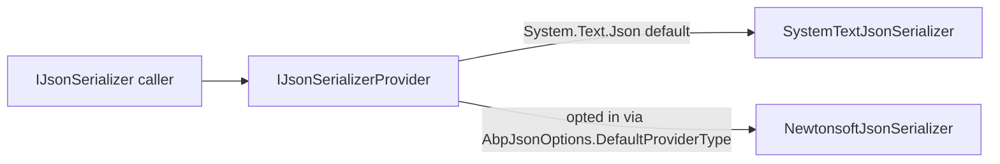

By default ABP uses `System.Text.Json` everywhere
(`AbpJsonSystemTextJsonModule`). Some scenarios — interop with legacy
clients that send custom `$type` markers, OData filters, or modules
ported from earlier ABP versions — still need Newtonsoft.Json's
flexibility. `Volo.Abp.AspNetCore.Mvc.NewtonsoftJson` is the opt-in
module that enables it for both inbound model binding and outbound
formatting.

<CardGroup cols={2}>
  <Card title="AspNetCore Mvc" icon="route" href="/framework/aspnetcore/aspnetcore-mvc">
    The base MVC integration this module decorates.
  </Card>
  <Card title="Json (core)" icon="brackets-curly" href="/framework/json/json">
    Where `AbpDateTimeConverter` and `AbpCamelCasePropertyNamesContractResolver` come from.
  </Card>
</CardGroup>

## File inventory

```text framework/src/Volo.Abp.AspNetCore.Mvc.NewtonsoftJson
Volo/Abp/AspNetCore/Mvc/NewtonsoftJson/
└── AbpAspNetCoreMvcNewtonsoftModule.cs
```

That's literally the entire package. The serializer plumbing it depends
on lives in `Volo.Abp.Json.Newtonsoft`:

```text framework/src/Volo.Abp.Json.Newtonsoft
Volo/Abp/Json/Newtonsoft/
├── AbpCamelCasePropertyNamesContractResolver.cs
├── AbpDateTimeConverter.cs
├── AbpJsonNewtonsoftModule.cs
├── AbpNewtonsoftJsonOptions.cs
├── AbpNewtonsoftJsonSerializerSettingsContributor.cs
├── DefaultExtraPropertiesDictionaryJsonConverter.cs
├── ExtensibleObjectConverter.cs
├── ExtraPropertyDictionaryJsonConverter.cs
└── NewtonsoftJsonSerializerProvider.cs
```

## The module

```csharp framework/src/Volo.Abp.AspNetCore.Mvc.NewtonsoftJson/Volo/Abp/AspNetCore/Mvc/NewtonsoftJson/AbpAspNetCoreMvcNewtonsoftModule.cs
[DependsOn(typeof(AbpJsonNewtonsoftModule), typeof(AbpAspNetCoreMvcModule))]
public class AbpAspNetCoreMvcNewtonsoftModule : AbpModule
{
    public override void ConfigureServices(ServiceConfigurationContext context)
    {
        context.Services.AddMvcCore().AddNewtonsoftJson();

        context.Services.AddOptions<MvcNewtonsoftJsonOptions>()
            .Configure<IServiceProvider>((options, rootServiceProvider) =>
            {
                options.SerializerSettings.ContractResolver = new AbpCamelCasePropertyNamesContractResolver(rootServiceProvider.GetRequiredService<AbpDateTimeConverter>());
            });
    }
}
```

Two things happen here:

1. `AddMvcCore().AddNewtonsoftJson()` — the standard Microsoft hook
   that swaps in the Newtonsoft input/output formatters in `MvcOptions`.
2. The `MvcNewtonsoftJsonOptions.SerializerSettings.ContractResolver`
   is set to ABP's own
   `AbpCamelCasePropertyNamesContractResolver`, parameterised with the
   framework-wide `AbpDateTimeConverter`.

That single substitution is the reason this module exists: the default
Newtonsoft camelCase resolver does not honour ABP's `DateTime`
normalisation (the framework converts every `DateTime` to the kind
configured by `IClock`) and does not understand `ExtraPropertyDictionary`.
The ABP resolver wires both.

## Abstractions table

| Type | Kind | Purpose |
| ---- | ---- | ------- |
| `AbpAspNetCoreMvcNewtonsoftModule` | `AbpModule` | Activates Newtonsoft and the ABP contract resolver. |
| `AbpCamelCasePropertyNamesContractResolver` | `CamelCasePropertyNamesContractResolver` | Camel-case names + auto-injected `AbpDateTimeConverter` on every `DateTime`/`DateTime?` property. |
| `AbpDateTimeConverter` | `JsonConverter<DateTime>` | Normalises `DateTime.Kind` via `IClock.Normalize`. |
| `ExtraPropertyDictionaryJsonConverter` | `JsonConverter` | Round-trips `ExtraPropertyDictionary` while preserving the `IsExtensibleObject` annotation. |
| `ExtensibleObjectConverter` | `JsonConverter` | Reads/writes objects that implement `IHasExtraProperties` so unknown JSON ends up under `ExtraProperties`. |
| `AbpNewtonsoftJsonOptions` | options | List of `JsonSerializerSettings` contributors. |
| `AbpNewtonsoftJsonSerializerSettingsContributor` | abstraction | Per-module hook to mutate the shared settings. |
| `NewtonsoftJsonSerializerProvider` | `IJsonSerializerProvider` | Routes serialisation calls to Newtonsoft when this module is loaded. |

## What `AbpCamelCasePropertyNamesContractResolver` actually does

The resolver inherits from Microsoft's
`CamelCasePropertyNamesContractResolver` so all properties get the
expected camelCase names. The override is to apply
`AbpDateTimeConverter` to every `DateTime` / `DateTime?` property and
to add `ExtraPropertyDictionaryJsonConverter` to every property of that
type. The end result is that a DTO like:

```csharp
public class UserDto : IHasExtraProperties
{
    public Guid Id { get; set; }
    public DateTime CreationTime { get; set; }
    public ExtraPropertyDictionary ExtraProperties { get; set; } = new();
}
```

…is serialised as:

```json
{
  "id": "00000000-0000-0000-0000-000000000000",
  "creationTime": "2024-04-12T13:55:01Z",   // normalized via IClock
  "extraProperties": { "department": "ENG" } // round-trips opaquely
}
```

without anyone having to attribute the properties manually.

## Where it fits in the JSON serialisation hierarchy

The framework uses a `IJsonSerializerProvider` indirection so any
module can opt into a different serializer. When this module is loaded,
two `IJsonSerializer` implementations are visible to DI:



To make Newtonsoft the application-wide default, point
`AbpJsonOptions.DefaultProviderType` at it:

```csharp
Configure<AbpJsonOptions>(options =>
{
    options.DefaultProviderType = typeof(NewtonsoftJsonSerializerProvider);
});
```

## Options table

| Options class | Knob | Why you set it |
| ------------- | ---- | -------------- |
| `MvcNewtonsoftJsonOptions.SerializerSettings` | Any standard Json.NET setting | Customise enum handling, reference handling, null defaults. |
| `AbpNewtonsoftJsonOptions.JsonSerializerSettingsActions` | `List<Action<JsonSerializerSettings>>` | Append converters or change behaviour from any module. |
| `AbpJsonOptions.DefaultProviderType` | Type | Pick Newtonsoft as the application-wide `IJsonSerializer`. |

## Interop with the exception middleware

`AbpExceptionHandlingMiddleware` writes its body using
`IJsonSerializer` (resolved through the provider), so adding this
module automatically makes error responses go through Newtonsoft too —
which is the rare situation where this matters: legacy desktop clients
that parse the response with their bundled Json.NET expect the
Newtonsoft conventions (e.g. `Date` strings rather than ISO instants
with `Z`).

## Caveats

- `AddMvcCore().AddNewtonsoftJson()` *adds* the Newtonsoft formatters
  to the head of `MvcOptions.OutputFormatters`. The
  `System.Text.Json` formatters that the base
  `AbpAspNetCoreMvcModule` installs are still present. ASP.NET Core
  picks the first formatter that satisfies the request's `Accept`
  header — Newtonsoft wins for `application/json` simply because it is
  inserted first.
- The Newtonsoft resolver is constructed at DI build time and captures
  a singleton reference to `AbpDateTimeConverter`. Replacing the
  converter at runtime is therefore not supported — register a
  decorated subtype instead.

## See also

- [`AspNetCore.Mvc`](/framework/aspnetcore/aspnetcore-mvc) — the host
  module this one decorates.
- [Json core](/framework/cross/exception-handling) — `IJsonSerializer`, contributor
  pipeline, `AbpJsonOptions`.
- [Object extending](/framework/ddd/entities-and-aggregates) — what
  `ExtraPropertyDictionary` carries.
