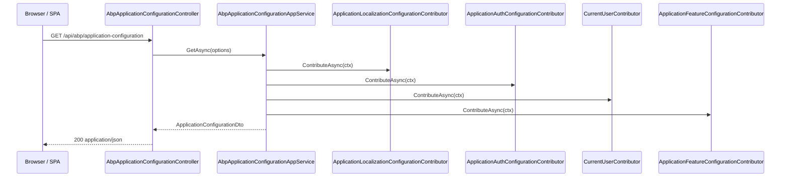

`Volo.Abp.AspNetCore.Mvc` is the package that makes ASP.NET Core MVC
feel like ABP: every application service becomes a controller, every
controller gets free DI sugar (lazy services, localizer, current-user,
clock), and every action passes through the same auditing, validation,
unit-of-work, feature-check and exception-wrapping filters.

<CardGroup cols={2}>
  <Card title="AspNetCore (core)" icon="server" href="/framework/aspnetcore/aspnetcore">
    The module this one depends on — middleware and shared options.
  </Card>
  <Card title="Mvc Contracts" icon="file-lines" href="/framework/aspnetcore/aspnetcore-mvc-contracts">
    The DTOs the application-configuration endpoint returns.
  </Card>
</CardGroup>

## File map (selected)

```text framework/src/Volo.Abp.AspNetCore.Mvc
Volo/Abp/AspNetCore/Mvc/
├── AbpAspNetCoreMvcModule.cs
├── AbpAspNetCoreMvcOptions.cs
├── AbpController.cs
├── AbpControllerBase.cs
├── AbpMvcOptionsExtensions.cs           (internal — assembles MvcOptions)
├── ApplicationConfigurations/
│   ├── AbpApplicationConfigurationAppService.cs
│   ├── AbpApplicationConfigurationController.cs
│   ├── AbpApplicationConfigurationScriptController.cs
│   ├── AbpApplicationLocalizationAppService.cs
│   └── ObjectExtending/
│       ├── CachedObjectExtensionsDtoService.cs
│       └── ExtensionPropertyAttributeDtoFactory.cs
├── Auditing/AbpAuditActionFilter.cs
├── Conventions/
│   ├── AbpServiceConvention.cs
│   ├── AbpServiceConventionWrapper.cs
│   ├── AbpConventionalControllerFeatureProvider.cs
│   ├── AbpConventionalControllerOptions.cs
│   └── ConventionalRouteBuilder.cs
├── ExceptionHandling/AbpExceptionFilter.cs
├── ModelBinding/
│   ├── AbpDateTimeModelBinder.cs
│   ├── AbpDateTimeModelBinderProvider.cs
│   ├── AbpExtraPropertiesDictionaryModelBinderProvider.cs
│   └── AbpExtraPropertyModelBinder.cs
├── Response/AbpNoContentActionFilter.cs
├── Uow/AbpUowActionFilter.cs
└── Validation/
    ├── AbpValidationActionFilter.cs
    └── ModelStateValidator.cs
```

## Abstractions table

| Type | Kind | Purpose |
| ---- | ---- | ------- |
| `AbpController` | abstract `Controller` | MVC-controller base with lazy services and L localiser. |
| `AbpControllerBase` | abstract `ControllerBase` | Same surface for API controllers (no view-related members). |
| `AbpServiceConvention` | `IAbpServiceConvention` | Turns conventional app services into controllers. |
| `ConventionalRouteBuilder` | helper | Builds `api/{module}/{controller}/{action}` routes from `RemoteServiceAttribute`. |
| `AbpAspNetCoreMvcOptions` | options | `ConventionalControllers`, `ControllersToRemove`, `ExposeIntegrationServices`. |
| `AbpAuditActionFilter` | filter | Builds `AuditLogAction` per request action. |
| `AbpUowActionFilter` | filter | Begins/commits/rolls back the reserved request unit-of-work. |
| `AbpExceptionFilter` | filter | Catches what middleware can't — view actions, returns wrapped `RemoteServiceErrorResponse`. |
| `AbpNoContentActionFilter` | filter | Rewrites `200 OK + null` from `Task`/`void` actions to `204 No Content`. |
| `AbpValidationActionFilter` | filter | Calls `IModelStateValidator` before the action runs. |
| `AbpDateTimeModelBinder(Provider)` | model binder | Normalises `DateTime`/`DateTime?` to the framework `IClock`. |
| `AbpExtraPropertyModelBinder` | model binder | Binds `ExtraProperties` dictionary values into typed DTOs. |
| `AbpApplicationConfigurationAppService` | application service | Returns the giant config DTO clients use to bootstrap. |

## The module

```csharp framework/src/Volo.Abp.AspNetCore.Mvc/Volo/Abp/AspNetCore/Mvc/AbpAspNetCoreMvcModule.cs
[DependsOn(
    typeof(AbpAspNetCoreModule),
    typeof(AbpLocalizationModule),
    typeof(AbpApiVersioningAbstractionsModule),
    typeof(AbpAspNetCoreMvcContractsModule),
    typeof(AbpUiNavigationModule),
    typeof(AbpGlobalFeaturesModule),
    typeof(AbpDddApplicationModule),
    typeof(AbpJsonSystemTextJsonModule)
)]
public class AbpAspNetCoreMvcModule : AbpModule
{
    public override void PreConfigureServices(ServiceConfigurationContext context)
    {
        DynamicProxyIgnoreTypes.Add<ControllerBase>();
        DynamicProxyIgnoreTypes.Add<PageModel>();
        DynamicProxyIgnoreTypes.Add<ViewComponent>();

        context.Services.AddConventionalRegistrar(new AbpAspNetCoreMvcConventionalRegistrar());
    }
```

The pre-configure step suppresses dynamic-proxy interception for the
three MVC base types — interception happens through application-service
interfaces, not controllers themselves. The custom conventional
registrar then makes sure every controller class is registered as a
transient service with both its concrete type and its interfaces.

The `ConfigureServices` body is long; the highlights are:

```csharp framework/src/Volo.Abp.AspNetCore.Mvc/Volo/Abp/AspNetCore/Mvc/AbpAspNetCoreMvcModule.cs
var mvcCoreBuilder = context.Services.AddMvcCore(options =>
{
    options.Filters.Add(new AbpAutoValidateAntiforgeryTokenAttribute());
});
context.Services.ExecutePreConfiguredActions(mvcCoreBuilder);
// ...
var mvcBuilder = context.Services.AddMvc()
    .AddDataAnnotationsLocalization(options =>
    {
        options.DataAnnotationLocalizerProvider = (type, factory) => /* …picks resource per assembly… */;
    })
    .AddViewLocalization();

mvcCoreBuilder.AddAbpJson();          // System.Text.Json + AbpDateTimeConverter
mvcBuilder.AddControllersAsServices();
mvcBuilder.AddViewComponentsAsServices();
context.Services.Replace(ServiceDescriptor.Singleton<IPageModelActivatorProvider, ServiceBasedPageModelActivatorProvider>());

context.Services.AddOptions<MvcOptions>()
    .Configure<IServiceProvider>((mvcOptions, serviceProvider) =>
    {
        mvcOptions.AddAbp(context.Services);
        // override model-binding messages from AbpValidationResource
    });

Configure<AbpEndpointRouterOptions>(options =>
{
    options.EndpointConfigureActions.Add(endpointContext =>
    {
        endpointContext.Endpoints.MapControllerRoute("defaultWithArea", "{area}/{controller=Home}/{action=Index}/{id?}");
        endpointContext.Endpoints.MapControllerRoute("default", "{controller=Home}/{action=Index}/{id?}");
        endpointContext.Endpoints.MapRazorPages();
    });
});
```

`MvcOptions.AddAbp(...)` is where the framework filters, model binders
and metadata providers are added.

## The MVC base classes

`AbpController` (full MVC) and `AbpControllerBase` (API only) share the
same lazy-service exposures. The bit application authors actually feel
is:

```csharp framework/src/Volo.Abp.AspNetCore.Mvc/Volo/Abp/AspNetCore/Mvc/AbpController.cs
public abstract class AbpController : Controller, IAvoidDuplicateCrossCuttingConcerns
{
    public IAbpLazyServiceProvider LazyServiceProvider { get; set; } = default!;

    protected IUnitOfWorkManager UnitOfWorkManager => LazyServiceProvider.LazyGetRequiredService<IUnitOfWorkManager>();
    protected IObjectMapper      ObjectMapper      => /* per-context resolution */;
    protected IGuidGenerator     GuidGenerator     => LazyServiceProvider.LazyGetService<IGuidGenerator>(SimpleGuidGenerator.Instance);
    protected ILogger            Logger            => LazyServiceProvider.LazyGetService<ILogger>(p => LoggerFactory?.CreateLogger(GetType().FullName!) ?? NullLogger.Instance);
    protected ICurrentUser       CurrentUser       => LazyServiceProvider.LazyGetRequiredService<ICurrentUser>();
    protected ICurrentTenant     CurrentTenant     => LazyServiceProvider.LazyGetRequiredService<ICurrentTenant>();
    protected IAuthorizationService AuthorizationService => LazyServiceProvider.LazyGetRequiredService<IAuthorizationService>();
    protected IClock             Clock             => LazyServiceProvider.LazyGetRequiredService<IClock>();
    protected IFeatureChecker    FeatureChecker    => LazyServiceProvider.LazyGetRequiredService<IFeatureChecker>();
    protected IAppUrlProvider    AppUrlProvider    => LazyServiceProvider.LazyGetRequiredService<IAppUrlProvider>();
    protected IStringLocalizer   L                 { get { /* lazy creates from LocalizationResource or default */ } }
}
```

`L` is the one knob you'll touch in almost every controller you write —
set `LocalizationResource` in the constructor and the framework
resolves `IStringLocalizer<TResource>` for you. The same lazy pattern
is what keeps controllers cheap to construct even though they expose a
dozen optional services.

`AbpController` also adds `RedirectSafely`, which delegates to
`AppUrlProvider.IsRedirectAllowedUrl` before redirecting — this is the
canonical defence the framework uses against open-redirect attacks on
sign-out / sign-in flows.

## `AbpServiceConvention`: controllers from app services

The biggest piece of magic in the package is
`AbpServiceConvention`. MVC drives it through an `IApplicationModelConvention`
that's wrapped to defer service-provider access. The entry point is:

```csharp framework/src/Volo.Abp.AspNetCore.Mvc/Volo/Abp/AspNetCore/Mvc/Conventions/AbpServiceConvention.cs
public void Apply(ApplicationModel application)
{
    ApplyForControllers(application);
}

protected virtual void ApplyForControllers(ApplicationModel application)
{
    RemoveDuplicateControllers(application);
    RemoveIntegrationControllersIfNotExposed(application);

    foreach (var controller in GetControllers(application))
    {
        var controllerType = controller.ControllerType.AsType();

        var configuration = GetControllerSettingOrNull(controllerType);

        if (ImplementsRemoteServiceInterface(controllerType))
        {
            controller.ControllerName = controller.ControllerName.RemovePostFix(ApplicationService.CommonPostfixes);
            configuration?.ControllerModelConfigurer?.Invoke(controller);
            ConfigureRemoteService(controller, configuration);
        }
        else
        {
            var remoteServiceAttr = ReflectionHelper.GetSingleAttributeOrDefault<RemoteServiceAttribute>(controllerType.GetTypeInfo());
            if (remoteServiceAttr != null && remoteServiceAttr.IsEnabledFor(controllerType))
            {
                ConfigureRemoteService(controller, configuration);
            }
        }
    }
}
```

What `ConfigureRemoteService` does internally:

1. Trims `AppService`, `ApplicationService`, `IntegrationService` from
   the controller name.
2. For every action: applies the conventional verb from
   `HttpMethodHelper.GetConventionalVerbForMethodName`.
3. Builds an `AttributeRouteModel` via `ConventionalRouteBuilder` using
   the `RemoteServiceAttribute.Name` as the URL module segment.
4. Promotes complex parameters to `[FromBody]` and primitive ones to
   `[FromQuery]` / `[FromRoute]`.
5. Marks the API explorer group from
   `AbpAspNetCoreMvcOptions.ChangeControllerModelApiExplorerGroupName`.

The net effect is that an `IUserAppService { Task<UserDto> GetAsync(Guid id); }`
turns into `GET /api/identity/users/{id}` automatically, with full
filter, validation, audit and UoW wrapping — without ever writing a
controller.

`AbpConventionalControllerOptions.Create<TAssembly>(opts => ...)` is
the entry point applications call to register an assembly's app
services as conventional controllers.

## Filters wired into `MvcOptions`

The single canonical place where filters and model binders are
added is `AbpMvcOptionsExtensions.AddAbp`:

```csharp framework/src/Volo.Abp.AspNetCore.Mvc/Volo/Abp/AspNetCore/Mvc/AbpMvcOptionsExtensions.cs
internal static class AbpMvcOptionsExtensions
{
    public static void AddAbp(this MvcOptions options, IServiceCollection services)
    {
        AddConventions(options, services);
        AddActionFilters(options);
        AddPageFilters(options);
        AddModelBinders(options);
        AddMetadataProviders(options, services);
        AddFormatters(options);
    }

    private static void AddActionFilters(MvcOptions options)
    {
        options.Filters.AddService(typeof(GlobalFeatureActionFilter));
        options.Filters.AddService(typeof(AbpAuditActionFilter));
        options.Filters.AddService(typeof(AbpNoContentActionFilter));
        options.Filters.AddService(typeof(AbpFeatureActionFilter));
        options.Filters.AddService(typeof(AbpValidationActionFilter));
        options.Filters.AddService(typeof(AbpUowActionFilter));
        options.Filters.AddService(typeof(AbpExceptionFilter));
    }

    private static void AddPageFilters(MvcOptions options)
    {
        options.Filters.AddService(typeof(GlobalFeaturePageFilter));
        options.Filters.AddService(typeof(AbpExceptionPageFilter));
        options.Filters.AddService(typeof(AbpAuditPageFilter));
        options.Filters.AddService(typeof(AbpFeaturePageFilter));
        options.Filters.AddService(typeof(AbpUowPageFilter));
    }

    private static void AddModelBinders(MvcOptions options)
    {
        options.ModelBinderProviders.Insert(0, new AbpDateTimeModelBinderProvider());
        options.ModelBinderProviders.Insert(1, new AbpExtraPropertiesDictionaryModelBinderProvider());
        options.ModelBinderProviders.Insert(2, new AbpRemoteStreamContentModelBinderProvider());
    }
}
```

### Filter ordering & responsibilities

| Order | Filter | Lifecycle | What it does |
| ----- | ------ | --------- | ------------ |
| 1 | `GlobalFeatureActionFilter` | before | Short-circuits with `404` when the action is gated by a disabled global feature. |
| 2 | `AbpAuditActionFilter` | wrap | Builds an `AuditLogAction` with `ExecutionDuration`; collects exceptions. |
| 3 | `AbpNoContentActionFilter` | after | Rewrites `200 + null` from `Task`/`void` actions to `204 NoContent`. |
| 4 | `AbpFeatureActionFilter` | before | Reads `RequiresFeature` attribute, throws `AbpAuthorizationException` if missing. |
| 5 | `AbpValidationActionFilter` | before | Calls `IModelStateValidator.Validate(ModelState)`. |
| 6 | `AbpUowActionFilter` | wrap | Begins reserved unit-of-work, commits on success, rolls back on failure. |
| 7 | `AbpExceptionFilter` | wrap | Catches any exception, wraps as `RemoteServiceErrorResponse` if the request accepts JSON. |

`AbpNoContentActionFilter` is short enough to read in full:

```csharp framework/src/Volo.Abp.AspNetCore.Mvc/Volo/Abp/AspNetCore/Mvc/Response/AbpNoContentActionFilter.cs
public async Task OnActionExecutionAsync(ActionExecutingContext context, ActionExecutionDelegate next)
{
    if (!context.ActionDescriptor.IsControllerAction())
    {
        await next();
        return;
    }

    await next();

    if (!context.HttpContext.Response.HasStarted &&
        context.HttpContext.Response.StatusCode == (int)HttpStatusCode.OK &&
        context.Result == null)
    {
        var returnType = context.ActionDescriptor.GetReturnType();
        if (returnType == typeof(Task) || returnType == typeof(void))
        {
            context.HttpContext.Response.StatusCode = (int)HttpStatusCode.NoContent;
        }
    }
}
```

`AbpUowActionFilter` is the bridge between
`AbpUnitOfWorkMiddleware` (which *reserves* a UoW) and the controller
action (which gets it *begun*). The reserved name is
`UnitOfWork.UnitOfWorkReservationName`:

```csharp framework/src/Volo.Abp.AspNetCore.Mvc/Volo/Abp/AspNetCore/Mvc/Uow/AbpUowActionFilter.cs
context.HttpContext.Items["_AbpActionInfo"] = new AbpActionInfoInHttpContext
{
    IsObjectResult = context.ActionDescriptor.HasObjectResult()
};

if (unitOfWorkAttr?.IsDisabled == true)
{
    await next();
    return;
}

var options = CreateOptions(context, unitOfWorkAttr);
var unitOfWorkManager = context.GetRequiredService<IUnitOfWorkManager>();

if (unitOfWorkManager.TryBeginReserved(UnitOfWork.UnitOfWorkReservationName, options))
{
    var result = await next();
    if (Succeed(result))
    {
        await SaveChangesAsync(context, unitOfWorkManager);
    }
    else
    {
        await RollbackAsync(context, unitOfWorkManager);
    }
}
```

The same filter stamps `_AbpActionInfo`, which
`AbpExceptionHandlingMiddleware` reads to decide whether to wrap an
exception as JSON.

## Model binders & formatters

| Binder | Position | Purpose |
| ------ | -------- | ------- |
| `AbpDateTimeModelBinderProvider` | 0 | Normalises `DateTime` to the `IClock`'s `Kind`. |
| `AbpExtraPropertiesDictionaryModelBinderProvider` | 1 | Binds typed properties into `ExtraProperties`. |
| `AbpRemoteStreamContentModelBinderProvider` | 2 | Binds `IRemoteStreamContent` from `multipart/form-data`. |
| `RemoteStreamContentOutputFormatter` | first in `OutputFormatters` | Emits an `IRemoteStreamContent` return value as a streamed response. |

`IRemoteStreamContent` is also wired into metadata providers
(`BindingSourceMetadataProvider(typeof(IRemoteStreamContent), BindingSource.FormFile)`)
so Swashbuckle and conventional routes treat it as a file upload.

## Application configuration endpoint

`AbpApplicationConfigurationAppService` is the single endpoint that
every SPA / Blazor client calls to bootstrap. Its return shape is
`ApplicationConfigurationDto` (documented in
[mvc-contracts](/framework/aspnetcore/aspnetcore-mvc-contracts)), and
it works by walking every `IApplicationConfigurationContributor`
registered in DI:



Each contributor mutates a shared `ApplicationConfigurationContributorContext.Configuration`,
so modules contribute pieces of the same DTO. The cache for the
extension-property part of the DTO is implemented by
`CachedObjectExtensionsDtoService` — it's keyed by culture and tenant.

## `AbpAspNetCoreMvcOptions`

```csharp framework/src/Volo.Abp.AspNetCore.Mvc/Volo/Abp/AspNetCore/Mvc/AbpAspNetCoreMvcOptions.cs
public class AbpAspNetCoreMvcOptions
{
    public bool? MinifyGeneratedScript { get; set; }
    public AbpConventionalControllerOptions ConventionalControllers { get; }
    public HashSet<Type> IgnoredControllersOnModelExclusion { get; }
    public HashSet<Type> ControllersToRemove { get; }
    public bool ExposeIntegrationServices { get; set; } = false;
    public bool AutoModelValidation { get; set; }
    public bool EnableRazorRuntimeCompilationOnDevelopment { get; set; }
    public bool ChangeControllerModelApiExplorerGroupName { get; set; }
}
```

| Knob | Default | Effect |
| ---- | ------- | ------ |
| `MinifyGeneratedScript` | `null` ⇒ `true` in production | Minifies the JS produced by the proxy generator. |
| `ConventionalControllers.Create<TAssembly>()` | empty | Registers an assembly's app services as conventional controllers. |
| `ControllersToRemove` | empty | Hard-removes a controller type from `ApplicationModel`. |
| `ExposeIntegrationServices` | `false` | Whether `IIntegrationService` interfaces become controllers. |
| `AutoModelValidation` | `true` | Whether `AbpValidationActionFilter` calls `IModelStateValidator`. |
| `EnableRazorRuntimeCompilationOnDevelopment` | `true` | Adds `AddAbpRazorRuntimeCompilation` automatically. |
| `ChangeControllerModelApiExplorerGroupName` | `true` | Uses `RemoteServiceAttribute.Name` as the Swagger group name. |

## `ExtensionPropertyDtoExtensions` and object extending

`ObjectExtensionPropertyInfoAspNetCoreMvcExtensions` (under
`Volo/Abp/ObjectExtending/`) builds
`ExtensionPropertyApiDto` / `ExtensionPropertyUiDto` records from
`ObjectExtensionPropertyInfo` so the application-configuration DTO can
ship them to the client. The contracts for the wire shape (`ExtensionPropertyDto`,
`ExtensionPropertyUiDto`, …) live in
[`aspnetcore-mvc-contracts.mdx`](/framework/aspnetcore/aspnetcore-mvc-contracts).

## See also

- [`AspNetCore`](/framework/aspnetcore/aspnetcore) — the underlying
  middleware pipeline.
- [`Mvc Contracts`](/framework/aspnetcore/aspnetcore-mvc-contracts) for
  the DTO shapes returned by the application-configuration service.
- [`Mvc NewtonsoftJson`](/framework/aspnetcore/aspnetcore-mvc-newtonsoft)
  for the optional Newtonsoft serializer integration.
- [Validation core](/framework/validation/validation) — what
  `AbpValidationActionFilter` delegates to.
