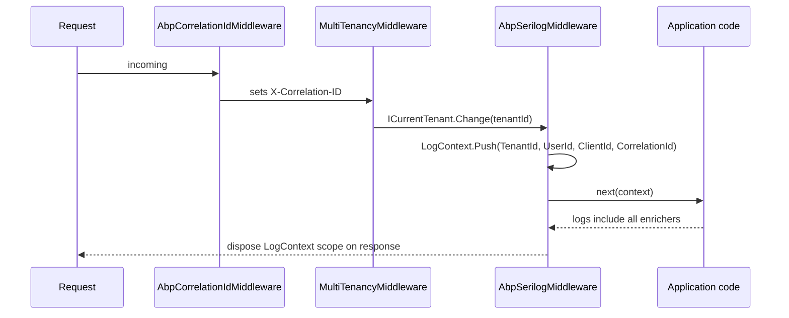

`Volo.Abp.AspNetCore.Serilog` is a tiny middleware module that lights
up structured-log context properties for ABP's per-request
identities. It depends on Serilog being the chosen logger (you wire it
up in `Program.cs` the standard way), but everything else is
auto-wired the moment you call `app.UseAbpSerilogEnrichers()`.

<CardGroup cols={2}>
  <Card title="AspNetCore" icon="server" href="/framework/aspnetcore/aspnetcore">
    Where `ICorrelationIdProvider`, `ICurrentUser` and `ICurrentTenant` come from.
  </Card>
  <Card title="MultiTenancy" icon="building" href="/framework/aspnetcore/aspnetcore-multitenancy">
    The middleware ordering — tenancy must run before serilog enrichment.
  </Card>
</CardGroup>

## File map

```text framework/src/Volo.Abp.AspNetCore.Serilog
Microsoft/AspNetCore/Builder/
└── AbpAspNetCoreSerilogApplicationBuilderExtensions.cs
Volo/Abp/AspNetCore/Serilog/
├── AbpAspNetCoreSerilogModule.cs
├── AbpAspNetCoreSerilogOptions.cs
└── AbpSerilogMiddleware.cs
```

## The module

```csharp framework/src/Volo.Abp.AspNetCore.Serilog/Volo/Abp/AspNetCore/Serilog/AbpAspNetCoreSerilogModule.cs
[DependsOn(
    typeof(AbpMultiTenancyModule),
    typeof(AbpAspNetCoreModule)
)]
public class AbpAspNetCoreSerilogModule : AbpModule
{
}
```

The module body is empty — registration of
`AbpSerilogMiddleware : IMiddleware, ITransientDependency` happens
through the convention-based DI registrar. The dependency on
`AbpMultiTenancyModule` ensures `ICurrentTenant` is available at the
point the middleware runs.

## Abstractions table

| Type | Kind | Purpose |
| ---- | ---- | ------- |
| `AbpAspNetCoreSerilogModule` | `AbpModule` | Depends-on glue. |
| `AbpSerilogMiddleware` | `IMiddleware` | Pushes per-request `LogContext` properties. |
| `AbpAspNetCoreSerilogOptions` | options | Customise the property names. |
| `AbpAspNetCoreSerilogOptions.AllEnricherPropertyNames` | nested options | Holds `TenantId`/`UserId`/`ClientId`/`CorrelationId`. |
| `UseAbpSerilogEnrichers` | extension | One-liner to register the middleware. |

## The middleware

```csharp framework/src/Volo.Abp.AspNetCore.Serilog/Volo/Abp/AspNetCore/Serilog/AbpSerilogMiddleware.cs
public class AbpSerilogMiddleware : IMiddleware, ITransientDependency
{
    private readonly ICurrentClient _currentClient;
    private readonly ICurrentTenant _currentTenant;
    private readonly ICurrentUser _currentUser;
    private readonly ICorrelationIdProvider _correlationIdProvider;
    private readonly AbpAspNetCoreSerilogOptions _options;

    public AbpSerilogMiddleware(
        ICurrentTenant currentTenant,
        ICurrentUser currentUser,
        ICurrentClient currentClient,
        ICorrelationIdProvider correlationIdProvider,
        IOptions<AbpAspNetCoreSerilogOptions> options)
    {
        _currentTenant = currentTenant;
        _currentUser = currentUser;
        _currentClient = currentClient;
        _correlationIdProvider = correlationIdProvider;
        _options = options.Value;
    }

    public async Task InvokeAsync(HttpContext context, RequestDelegate next)
    {
        var enrichers = new List<ILogEventEnricher>();

        if (_currentTenant?.Id != null)
        {
            enrichers.Add(new PropertyEnricher(_options.EnricherPropertyNames.TenantId, _currentTenant.Id));
        }

        if (_currentUser?.Id != null)
        {
            enrichers.Add(new PropertyEnricher(_options.EnricherPropertyNames.UserId, _currentUser.Id));
        }

        if (_currentClient?.Id != null)
        {
            enrichers.Add(new PropertyEnricher(_options.EnricherPropertyNames.ClientId, _currentClient.Id));
        }

        var correlationId = _correlationIdProvider.Get();
        if (!string.IsNullOrEmpty(correlationId))
        {
            enrichers.Add(new PropertyEnricher(_options.EnricherPropertyNames.CorrelationId, correlationId));
        }

        using (LogContext.Push(enrichers.ToArray()))
        {
            await next(context);
        }
    }
}
```

A few subtle points:

1. **Conditional addition.** A null tenant id (host) doesn't add a
   property — Serilog's emitted log lines will *not* contain a
   `TenantId` field rather than `TenantId=null`. Use this to
   distinguish host calls from tenant calls in your log aggregator.
2. **`PropertyEnricher` not `LogContext.PushProperty`.** Adding all
   four enrichers in a single `LogContext.Push(enrichers.ToArray())`
   means they pop together at the end of the request — there is no
   risk of a leaked tenant id between requests, even if the middleware
   throws.
3. **`ICorrelationIdProvider`.** This is the framework-wide accessor
   filled by `AbpCorrelationIdMiddleware` (from `Volo.Abp.AspNetCore`).
   For propagation across HTTP-client calls, see
   `AbpCorrelationIdHttpMessageHandler`.

## Builder extension

```csharp framework/src/Volo.Abp.AspNetCore.Serilog/Microsoft/AspNetCore/Builder/AbpAspNetCoreSerilogApplicationBuilderExtensions.cs
public static class AbpAspNetCoreSerilogApplicationBuilderExtensions
{
    public static IApplicationBuilder UseAbpSerilogEnrichers(this IApplicationBuilder app)
    {
        return app
            .UseMiddleware<AbpSerilogMiddleware>();
    }
}
```

This is the single line you add to `Program.cs`:

```csharp
app.UseAbpCorrelationId();
app.UseMultiTenancy();
app.UseAbpSerilogEnrichers();   // ← here
app.UseAuthorization();
```

Order matters: correlation-id and tenancy must already be resolved
before the enricher snapshots them.

## Options

```csharp framework/src/Volo.Abp.AspNetCore.Serilog/Volo/Abp/AspNetCore/Serilog/AbpAspNetCoreSerilogOptions.cs
public class AbpAspNetCoreSerilogOptions
{
    public AllEnricherPropertyNames EnricherPropertyNames { get; } = new AllEnricherPropertyNames();

    public class AllEnricherPropertyNames
    {
        public string TenantId      { get; set; } = "TenantId";
        public string UserId        { get; set; } = "UserId";
        public string ClientId      { get; set; } = "ClientId";
        public string CorrelationId { get; set; } = "CorrelationId";
    }
}
```

To rename the properties (for example to match a corporate logging
schema):

```csharp
Configure<AbpAspNetCoreSerilogOptions>(options =>
{
    options.EnricherPropertyNames.TenantId = "tenant_id";
    options.EnricherPropertyNames.UserId = "user_id";
    options.EnricherPropertyNames.CorrelationId = "trace_id";
});
```

## Pipeline diagram



## Inspecting output

A standard Serilog console sink configured with
`outputTemplate: "[{Timestamp:HH:mm:ss} {Level:u3}] {Message:lj} {Properties:j}{NewLine}"`
will then emit lines like:

```text
[13:42:01 INF] User Created {"TenantId":"d2a…", "UserId":"7c9…", "CorrelationId":"7b3a…"}
```

A file/Seq/Elastic sink will keep the property values structured so you
can filter `TenantId = '…'` cleanly.

## See also

- [Tracing & correlation IDs](/framework/aspnetcore/aspnetcore) —
  `AbpCorrelationIdMiddleware` populates the value Serilog enriches.
- [MultiTenancy](/framework/aspnetcore/aspnetcore-multitenancy) — the
  ordering invariant.
- [Auditing core](/framework/cross/auditing) — a different
  way to attribute log events to users/tenants for compliance.
