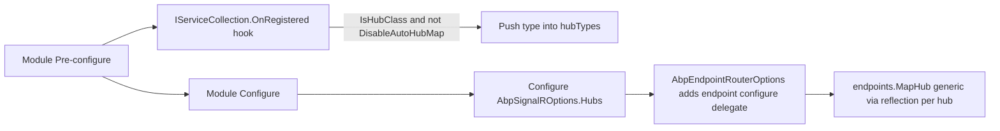

The SignalR module brings ABP's per-request crosscutting concerns to
hub invocations: the same `ICurrentUser` / `ICurrentTenant` /
auditing pipeline that wraps controllers also wraps hub methods. It
adds a base class with lazy services (`AbpHub`), an
`IUserIdProvider` that reads ABP's `ICurrentUser.Id`, and three
`IHubFilter`s — for authentication context, auditing, and hub-context
accessor scoping.

<CardGroup cols={2}>
  <Card title="AspNetCore" icon="server" href="/framework/aspnetcore/aspnetcore">
    `ICurrentUser`, `ICurrentTenant`, `ICurrentPrincipalAccessor`.
  </Card>
  <Card title="Auditing" icon="clipboard-list" href="/framework/auditing/audit-log-manager">
    The `IAuditingManager` scope `AbpAuditHubFilter` opens for every hub call.
  </Card>
</CardGroup>

## File map

```text framework/src/Volo.Abp.AspNetCore.SignalR
Volo/Abp/AspNetCore/SignalR/
├── AbpAspNetCoreSignalRModule.cs
├── AbpHub.cs
├── AbpHubContext.cs
├── AbpHubContextAccessorHubFilter.cs
├── AbpSignalRConventionalRegistrar.cs
├── AbpSignalROptions.cs
├── AbpSignalRUserIdProvider.cs
├── Auditing/
│   ├── AbpAuditHubFilter.cs
│   └── AspNetCoreSignalRAuditLogContributor.cs
├── Authentication/
│   └── AbpAuthenticationHubFilter.cs
├── DefaultAbpHubContextAccessor.cs
├── DisableAutoHubMapAttribute.cs
├── HubConfig.cs
├── HubConfigList.cs
├── HubRouteAttribute.cs
└── IAbpHubContextAccessor.cs
```

## Abstractions table

| Type | Kind | Purpose |
| ---- | ---- | ------- |
| `AbpHub`, `AbpHub<T>` | abstract `Hub`/`Hub<T>` | Adds `LazyServiceProvider`, `Logger`, `CurrentUser`, `CurrentTenant`, `Clock`, `L`. |
| `AbpSignalRUserIdProvider` | `IUserIdProvider` | Returns `ICurrentUser.Id?.ToString()` for outbound user-targeted messages. |
| `AbpAuthenticationHubFilter` | `IHubFilter` | Wraps every invocation in a `currentPrincipalAccessor.Change(connection.User)`. |
| `AbpAuditHubFilter` | `IHubFilter` | Opens an `IAuditingManager.BeginScope` per invocation. |
| `AbpHubContextAccessorHubFilter` | `IHubFilter` | Stashes a per-call `AbpHubContext` so non-hub code can read connection info. |
| `IAbpHubContextAccessor` | abstraction | `Change(AbpHubContext)` to write, `Context` to read. |
| `AbpHubContext` | DTO | Captures `HubInvocationContext` / `HubLifetimeContext`. |
| `HubConfig` | options entry | Hub type + route + per-hub configure actions. |
| `HubRouteAttribute` | attribute | Override the conventional route pattern of a hub. |
| `DisableAutoHubMapAttribute` | attribute | Opt a hub class out of auto-mapping. |
| `AbpSignalROptions.Hubs` | options | The list `MapHub` walks at startup. |

## The module

```csharp framework/src/Volo.Abp.AspNetCore.SignalR/Volo/Abp/AspNetCore/SignalR/AbpAspNetCoreSignalRModule.cs
[DependsOn(typeof(AbpAspNetCoreModule))]
public class AbpAspNetCoreSignalRModule : AbpModule
{
    private static readonly MethodInfo MapHubGenericMethodInfo =
        typeof(AbpAspNetCoreSignalRModule)
            .GetMethod("MapHub", BindingFlags.Static | BindingFlags.NonPublic)!;

    public override void PreConfigureServices(ServiceConfigurationContext context)
    {
        context.Services.AddConventionalRegistrar(new AbpSignalRConventionalRegistrar());

        AutoAddHubTypes(context.Services);
    }

    public override void ConfigureServices(ServiceConfigurationContext context)
    {
        var routePatterns = new List<string> { "/signalr-hubs" };
        var signalRServerBuilder = context.Services.AddSignalR(options =>
        {
            options.AddFilter<AbpHubContextAccessorHubFilter>();
            options.AddFilter<AbpAuthenticationHubFilter>();
            options.AddFilter<AbpAuditHubFilter>();
        });

        context.Services.ExecutePreConfiguredActions(signalRServerBuilder);

        Configure<AbpEndpointRouterOptions>(options =>
        {
            options.EndpointConfigureActions.Add(endpointContext =>
            {
                var signalROptions = endpointContext
                    .ScopeServiceProvider
                    .GetRequiredService<IOptions<AbpSignalROptions>>()
                    .Value;

                foreach (var hubConfig in signalROptions.Hubs)
                {
                    routePatterns.AddIfNotContains(hubConfig.RoutePattern);

                    MapHubType(
                        hubConfig.HubType,
                        endpointContext.Endpoints,
                        hubConfig.RoutePattern,
                        opts =>
                        {
                            foreach (var configureAction in hubConfig.ConfigureActions)
                            {
                                configureAction(opts);
                            }
                        }
                    );
                }
            });
        });
```

Key behaviours:

- **Auto-mapping.** `AutoAddHubTypes` hooks `IServiceCollection.OnRegistered`
  so every concrete class assignable to `Hub` (and not decorated with
  `DisableAutoHubMapAttribute`) is added to `AbpSignalROptions.Hubs`.
  The runtime then calls `MapHub<THub>(...)` for each entry.
- **Filter ordering.** The filters are added in
  *outer-to-inner* order — `AbpHubContextAccessorHubFilter` runs first
  on the way in, last on the way out, so context is alive for every
  inner filter. Auth then runs next, then audit, then your hub method.
- **Auditing skip list.** Every mapped hub route is added to
  `AbpAspNetCoreAuditingOptions.IgnoredUrls` so the standard
  `AbpAuditingMiddleware` doesn't double-count hub invocations — the
  hub filter takes over.

### Route conventions

`HubRouteAttribute` controls the URL. The fallback is "kebab-case the
hub name and prefix with `/signalr-hubs/`":

```csharp framework/src/Volo.Abp.AspNetCore.SignalR/Volo/Abp/AspNetCore/SignalR/HubRouteAttribute.cs
public static string GetRoutePattern(Type hubType)
{
    var routeAttribute = hubType.GetSingleAttributeOrNull<HubRouteAttribute>();
    if (routeAttribute != null)
    {
        return routeAttribute.GetRoutePatternForType(hubType);
    }

    return "/signalr-hubs/" + hubType.Name.RemovePostFix("Hub").ToKebabCase();
}
```

So a class `class ChatNotificationsHub : AbpHub` becomes
`/signalr-hubs/chat-notifications` automatically. Override with
`[HubRoute("/realtime/chat")]`.

## `AbpHub` base class

```csharp framework/src/Volo.Abp.AspNetCore.SignalR/Volo/Abp/AspNetCore/SignalR/AbpHub.cs
public abstract class AbpHub : Hub
{
    public IAbpLazyServiceProvider LazyServiceProvider { get; set; } = default!;

    protected ILoggerFactory? LoggerFactory => LazyServiceProvider.LazyGetService<ILoggerFactory>();
    protected ILogger Logger => LazyServiceProvider.LazyGetService<ILogger>(provider => LoggerFactory?.CreateLogger(GetType().FullName!) ?? NullLogger.Instance);
    protected ICurrentUser CurrentUser => LazyServiceProvider.LazyGetService<ICurrentUser>()!;
    protected ICurrentTenant CurrentTenant => LazyServiceProvider.LazyGetService<ICurrentTenant>()!;
    protected IAuthorizationService AuthorizationService => LazyServiceProvider.LazyGetService<IAuthorizationService>()!;
    protected IClock Clock => LazyServiceProvider.LazyGetService<IClock>()!;
    protected IStringLocalizerFactory StringLocalizerFactory => LazyServiceProvider.LazyGetService<IStringLocalizerFactory>()!;

    protected IStringLocalizer L
    {
        get { /* lazy from LocalizationResource (default = DefaultResource) */ }
    }
}
```

`AbpHub<T>` (strongly-typed clients) has the same surface. Constructing
either requires nothing — the convention-based registrar (and the
shared `IPageModelActivatorProvider`-equivalent for hubs from SignalR
itself) wires `LazyServiceProvider` via property injection.

Inheriting from `AbpHub` instead of `Hub` is **not** mandatory for
filters to fire — `IHubFilter`s are global. The base class is purely
about ergonomics.

## `AbpSignalRUserIdProvider`

```csharp framework/src/Volo.Abp.AspNetCore.SignalR/Volo/Abp/AspNetCore/SignalR/AbpSignalRUserIdProvider.cs
public class AbpSignalRUserIdProvider : IUserIdProvider, ITransientDependency
{
    private readonly ICurrentPrincipalAccessor _currentPrincipalAccessor;
    private readonly ICurrentUser _currentUser;

    public AbpSignalRUserIdProvider(ICurrentPrincipalAccessor currentPrincipalAccessor, ICurrentUser currentUser)
    {
        _currentPrincipalAccessor = currentPrincipalAccessor;
        _currentUser = currentUser;
    }

    public virtual string? GetUserId(HubConnectionContext connection)
    {
        using (_currentPrincipalAccessor.Change(connection.User))
        {
            return _currentUser.Id?.ToString();
        }
    }
}
```

`SignalR` uses `IUserIdProvider` to associate connections with a logical
user id. The default implementation reads `ClaimTypes.NameIdentifier`.
ABP overrides it so that `Clients.User("…")` targets the same id that
`ICurrentUser.Id` reports — important because ABP's claims-mapping
middleware re-keys the claim names.

## The three hub filters

### `AbpAuthenticationHubFilter`

```csharp framework/src/Volo.Abp.AspNetCore.SignalR/Volo/Abp/AspNetCore/SignalR/Authentication/AbpAuthenticationHubFilter.cs
public virtual async ValueTask<object?> InvokeMethodAsync(
    HubInvocationContext invocationContext,
    Func<HubInvocationContext, ValueTask<object?>> next)
{
    var currentPrincipalAccessor = invocationContext.ServiceProvider.GetRequiredService<ICurrentPrincipalAccessor>();
    using (currentPrincipalAccessor.Change(invocationContext.Context.User!))
    {
        return await next(invocationContext);
    }
}
```

Hub invocations are not driven through ASP.NET Core's normal
authentication middleware (the connection is authenticated once at
connect-time). This filter republishes the connection's principal as
the ambient `ICurrentPrincipalAccessor.Principal` for the duration of
the hub method, so `ICurrentUser` and all permission checks "just work"
inside the hub call. `OnConnectedAsync` / `OnDisconnectedAsync` are
also wrapped.

### `AbpAuditHubFilter`

```csharp framework/src/Volo.Abp.AspNetCore.SignalR/Volo/Abp/AspNetCore/SignalR/Auditing/AbpAuditHubFilter.cs
public virtual async ValueTask<object?> InvokeMethodAsync(
    HubInvocationContext invocationContext,
    Func<HubInvocationContext, ValueTask<object?>> next)
{
    var options = invocationContext.ServiceProvider.GetRequiredService<IOptions<AbpAuditingOptions>>().Value;
    if (!options.IsEnabled) return await next(invocationContext);

    var hasError = false;
    var auditingManager = invocationContext.ServiceProvider.GetRequiredService<IAuditingManager>();
    using (var saveHandle = auditingManager.BeginScope())
    {
        try
        {
            var result = await next(invocationContext);
            if (auditingManager.Current.Log.Exceptions.Any()) hasError = true;
            return result;
        }
        // …finally: write log via saveHandle.SaveAsync()
```

The filter opens an `IAuditingManager` scope around the invocation —
same primitive used by `AbpAuditActionFilter` for MVC. The
`AspNetCoreSignalRAuditLogContributor` (registered into
`AbpAuditingOptions.Contributors`) fills in the connection/transport
metadata in the audit log entry.

### `AbpHubContextAccessorHubFilter`

Stashes the current `HubInvocationContext` / `HubLifetimeContext` into
`IAbpHubContextAccessor` so non-hub code paths (services, repositories
called from inside the hub method) can introspect the connection id,
transport, or which method is currently executing.

```csharp
public class MyAppService : ApplicationService
{
    private readonly IAbpHubContextAccessor _hubAccessor;

    public MyAppService(IAbpHubContextAccessor hubAccessor) => _hubAccessor = hubAccessor;

    public Task DoSomethingAsync()
    {
        var connectionId = _hubAccessor.Context?.HubCallerContext?.ConnectionId;
        // …
    }
}
```

## Auto-mapping flow



If you want to register a hub manually (e.g. to attach
`HttpConnectionDispatcherOptions`), decorate it with
`[DisableAutoHubMap]` and call `Hubs.AddOrUpdate<MyHub>(c => ...)`:

```csharp
Configure<AbpSignalROptions>(options =>
{
    options.Hubs.AddOrUpdate<MyHub>(c =>
    {
        c.RoutePattern = "/realtime/my";
        c.ConfigureActions.Add(o => o.TransportMaxBufferSize = 4 * 1024);
    });
});
```

## Options table

| Options | Knob | Default |
| ------- | ---- | ------- |
| `AbpSignalROptions.Hubs` | `HubConfigList` | All auto-discovered hubs |
| `AbpAspNetCoreAuditingOptions.IgnoredUrls` | strings | All hub routes added automatically |
| `AbpAuditingOptions.Contributors` | list | `AspNetCoreSignalRAuditLogContributor` appended |

## See also

- [`AspNetCore`](/framework/aspnetcore/aspnetcore) — the host module
  with `ICurrentPrincipalAccessor` and friends.
- [Auditing](/framework/cross/auditing) — the
  `IAuditingManager` scope the audit filter opens.
- [Security claims](/framework/cross/security) — what `ICurrentUser`
  reads from the connection's principal.
