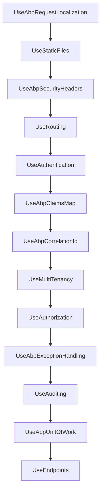

`Volo.Abp.AspNetCore` is the host‑integration module: it teaches the
framework how to drive ASP.NET Core's pipeline, swap in ABP's request
localisation, map OAuth/OIDC short claim names back to the long ones
ABP expects, and turn thrown exceptions into the
`RemoteServiceErrorResponse` JSON contract.

It is the module every ASP.NET Core ABP application has (transitively)
in its module graph — `AbpAspNetCoreMvcModule`,
`AbpAspNetCoreSignalRModule`, `AbpAspNetCoreSerilogModule` and
`AbpAspNetCoreMultiTenancyModule` all `DependsOn` it.

<CardGroup cols={2}>
  <Card title="AspNetCore Mvc" icon="route" href="/framework/aspnetcore/aspnetcore-mvc">
    The MVC integration that sits on top of the module documented here.
  </Card>
  <Card title="Exception Handling" icon="bug" href="/framework/exception-handling/middleware">
    The cross‑module exception‑handling pipeline this module plugs into.
  </Card>
</CardGroup>

## File map

```text framework/src/Volo.Abp.AspNetCore
Microsoft/AspNetCore/
├── Builder/
│   ├── AbpApplicationBuilderExtensions.cs
│   ├── AbpAspNetCoreApplicationBuilderExtensions.cs
│   └── VirtualFileSystemApplicationBuilderExtensions.cs
├── Cors/AbpCorsPolicyBuilderExtensions.cs
├── Http/AbpHttpRequestExtensions.cs
├── Internal/ResponseContentTypeHelper.cs
├── RequestLocalization/
│   ├── AbpRequestCultureCookieHelper.cs
│   ├── AbpRequestLocalizationMiddleware.cs
│   ├── AbpRequestLocalizationOptions.cs
│   ├── AbpRequestLocalizationOptionsManager.cs
│   ├── DefaultAbpRequestLocalizationOptionsProvider.cs
│   └── IAbpRequestLocalizationOptionsProvider.cs
└── Routing/
    ├── AbpEndpointRouterOptions.cs
    └── EndpointRouteBuilderContext.cs

Volo/Abp/AspNetCore/
├── AbpActionInfoInHttpContext.cs
├── AbpAspNetCoreConsts.cs
├── AbpAspNetCoreModule.cs
├── Auditing/
│   ├── AbpAspNetCoreAuditingOptions.cs
│   ├── AbpAuditingMiddleware.cs
│   └── AspNetCoreAuditLogContributor.cs
├── ExceptionHandling/
│   ├── AbpAuthorizationExceptionHandlerOptions.cs
│   ├── AbpExceptionHandlingMiddleware.cs
│   ├── AbpExceptionHttpStatusCodeOptions.cs
│   ├── DefaultAbpAuthorizationExceptionHandler.cs
│   ├── DefaultHttpExceptionStatusCodeFinder.cs
│   ├── IAbpAuthorizationExceptionHandler.cs
│   └── IHttpExceptionStatusCodeFinder.cs
├── Security/
│   ├── AbpSecurityHeaderNonceHelper.cs
│   ├── AbpSecurityHeadersMiddleware.cs
│   ├── AbpSecurityHeadersOptions.cs
│   └── Claims/
│       ├── AbpClaimsMapMiddleware.cs
│       ├── AbpClaimsMapOptions.cs
│       └── HttpContextCurrentPrincipalAccessor.cs
├── Tracing/AbpCorrelationIdMiddleware.cs
├── Uow/
│   ├── AbpAspNetCoreUnitOfWorkOptions.cs
│   ├── AbpUnitOfWorkMiddleware.cs
│   └── AspNetCoreUnitOfWorkTransactionBehaviourProvider.cs
└── VirtualFileSystem/
    ├── AbpAspNetCoreContentOptions.cs
    ├── AbpFileExtensionContentTypeProvider.cs
    ├── IWebContentFileProvider.cs
    └── WebContentFileProvider.cs
```

## Abstractions table

| Type | Kind | Purpose |
| ---- | ---- | ------- |
| `AbpAspNetCoreModule` | `AbpModule` | Wires up auth, file providers, request localisation, static files. |
| `AbpExceptionHandlingMiddleware` | middleware | Converts thrown exceptions into JSON `RemoteServiceErrorResponse`. |
| `IHttpExceptionStatusCodeFinder` | abstraction | Picks the HTTP status code for a given exception. |
| `DefaultHttpExceptionStatusCodeFinder` | default impl | Built-in mapping (validation/not-found/business). |
| `AbpExceptionHttpStatusCodeOptions` | options | Error-code ⇒ HTTP status overrides. |
| `IAbpAuthorizationExceptionHandler` | abstraction | Pluggable handler for `AbpAuthorizationException`. |
| `AbpClaimsMapMiddleware` | middleware | Translates OAuth short claim names (`sub`, `role`, …) to ABP names. |
| `AbpClaimsMapOptions.Maps` | options | The translation table the middleware reads. |
| `AbpRequestCultureCookieHelper` | helper | Writes the `RequestCulture` cookie consistently. |
| `AbpRequestLocalizationMiddleware` | middleware | Wraps `RequestLocalizationMiddleware` with dynamic options. |
| `AbpRequestLocalizationOptions` | options | List of async configurators run by the options provider. |
| `IAbpRequestLocalizationOptionsProvider` | abstraction | Builds the `RequestLocalizationOptions` per request scope. |
| `AbpEndpointRouterOptions` | options | List of `EndpointRouteBuilder` actions executed at startup. |
| `AbpCorrelationIdMiddleware` | middleware | Stamps a correlation id onto the response and the ambient context. |
| `AbpUnitOfWorkMiddleware` | middleware | Reserves a "request" unit-of-work for `AbpUowActionFilter` to commit. |
| `IWebContentFileProvider` | abstraction | Composite file provider serving virtual files from `/wwwroot`. |

## The module itself

```csharp framework/src/Volo.Abp.AspNetCore/Volo/Abp/AspNetCore/AbpAspNetCoreModule.cs
[DependsOn(
    typeof(AbpAuditingModule),
    typeof(AbpSecurityModule),
    typeof(AbpVirtualFileSystemModule),
    typeof(AbpUnitOfWorkModule),
    typeof(AbpHttpModule),
    typeof(AbpAuthorizationModule),
    typeof(AbpValidationModule),
    typeof(AbpExceptionHandlingModule)
)]
public class AbpAspNetCoreModule : AbpModule
{
    public override void PreConfigureServices(ServiceConfigurationContext context)
    {
        var abpHostEnvironment = context.Services.GetSingletonInstance<IAbpHostEnvironment>();
        if (abpHostEnvironment.EnvironmentName.IsNullOrWhiteSpace())
        {
            abpHostEnvironment.EnvironmentName = context.Services.GetHostingEnvironment().EnvironmentName;
        }
    }

    public override void ConfigureServices(ServiceConfigurationContext context)
    {
        context.Services.AddAuthorization();

        Configure<AbpAuditingOptions>(options =>
        {
            options.Contributors.Add(new AspNetCoreAuditLogContributor());
        });

        Configure<StaticFileOptions>(options =>
        {
            options.ContentTypeProvider = context.Services.GetRequiredService<AbpFileExtensionContentTypeProvider>();
        });

        AddAspNetServices(context.Services);
        context.Services.AddObjectAccessor<IApplicationBuilder>();
        context.Services.AddAbpDynamicOptions<RequestLocalizationOptions, AbpRequestLocalizationOptionsManager>();
    }

    private static void AddAspNetServices(IServiceCollection services)
    {
        services.AddHttpContextAccessor();
    }
```

Three things to call out:

1. **Environment unification** — ABP's own `IAbpHostEnvironment` is a
   thin abstraction over the ASP.NET Core `IHostEnvironment`. The
   pre-configure pass copies the framework's `EnvironmentName` across
   so that code paths shared with non‑web hosts behave consistently.
2. **`AddAbpDynamicOptions<RequestLocalizationOptions, …>`** — this is
   the key call that makes request localisation honour the database
   languages list at runtime. The dynamic options pattern reads from
   `IAbpRequestLocalizationOptionsProvider` each time the options are
   requested.
3. **`AddObjectAccessor<IApplicationBuilder>()`** — lets later
   modules grab a reference to the `IApplicationBuilder` even from the
   service-configuration phase via
   `context.Services.GetSingletonInstance<IObjectAccessor<IApplicationBuilder>>()`.

## Exception handling

The middleware is registered by
`app.UseAbpExceptionHandling()` (extension method on
`IApplicationBuilder`) and lives at the very top of the pipeline. Its
inner loop is:

```csharp framework/src/Volo.Abp.AspNetCore/Volo/Abp/AspNetCore/ExceptionHandling/AbpExceptionHandlingMiddleware.cs
public async Task InvokeAsync(HttpContext context, RequestDelegate next)
{
    try
    {
        await next(context);
    }
    catch (Exception ex)
    {
        if (context.Response.HasStarted)
        {
            _logger.LogWarning("An exception occurred, but response has already started!");
            throw;
        }

        if (context.Items["_AbpActionInfo"] is AbpActionInfoInHttpContext actionInfo)
        {
            if (actionInfo.IsObjectResult)
            {
                await HandleAndWrapException(context, ex);
                return;
            }
        }

        throw;
    }
}
```

The flag `IsObjectResult` is stamped by `AbpUowActionFilter` before the
controller runs, so the middleware only wraps exceptions for actions
that already returned JSON-shaped results — view-based actions are
re-thrown to allow ASP.NET Core's developer/exception-page middleware
to handle them.

### Status code resolution

`DefaultHttpExceptionStatusCodeFinder` is the priority list used to
choose the response code:

```csharp framework/src/Volo.Abp.AspNetCore/Volo/Abp/AspNetCore/ExceptionHandling/DefaultHttpExceptionStatusCodeFinder.cs
public virtual HttpStatusCode GetStatusCode(HttpContext httpContext, Exception exception)
{
    if (exception is IHasHttpStatusCode exceptionWithHttpStatusCode &&
        exceptionWithHttpStatusCode.HttpStatusCode > 0)
    {
        return (HttpStatusCode)exceptionWithHttpStatusCode.HttpStatusCode;
    }

    if (exception is IHasErrorCode exceptionWithErrorCode &&
        !exceptionWithErrorCode.Code.IsNullOrWhiteSpace())
    {
        if (Options.ErrorCodeToHttpStatusCodeMappings.TryGetValue(exceptionWithErrorCode.Code!, out var status))
        {
            return status;
        }
    }

    if (exception is AbpAuthorizationException)
    {
        return httpContext.User.Identity!.IsAuthenticated
            ? HttpStatusCode.Forbidden
            : HttpStatusCode.Unauthorized;
    }

    if (exception is AbpValidationException)  return HttpStatusCode.BadRequest;
    if (exception is EntityNotFoundException) return HttpStatusCode.NotFound;
    if (exception is AbpDbConcurrencyException) return HttpStatusCode.Conflict;
    if (exception is NotImplementedException) return HttpStatusCode.NotImplemented;
    if (exception is IBusinessException)      return HttpStatusCode.Forbidden;

    return HttpStatusCode.InternalServerError;
}
```

Concrete mapping rules:

| Exception type | HTTP status |
| -------------- | ----------- |
| Implements `IHasHttpStatusCode` with `> 0` | the value it reports |
| Implements `IHasErrorCode` and the code is mapped in `AbpExceptionHttpStatusCodeOptions` | the configured value |
| `AbpAuthorizationException` (authenticated user) | `403 Forbidden` |
| `AbpAuthorizationException` (anonymous) | `401 Unauthorized` |
| `AbpValidationException` | `400 BadRequest` |
| `EntityNotFoundException` | `404 NotFound` |
| `AbpDbConcurrencyException` | `409 Conflict` |
| `NotImplementedException` | `501 NotImplemented` |
| Any other `IBusinessException` | `403 Forbidden` |
| Everything else | `500 InternalServerError` |

You can map your own error codes:

```csharp
Configure<AbpExceptionHttpStatusCodeOptions>(options =>
{
    options.Map("MyModule:010001", HttpStatusCode.PaymentRequired);
});
```

### Claims mapping

OAuth/OIDC issuers ship short claim names (`sub`, `email`, `role`).
ABP internally uses `AbpClaimTypes` such as `UserId`, `UserName`,
`Email`. `AbpClaimsMapMiddleware` translates the short names into a
second identity that ABP code can rely on:

```csharp framework/src/Volo.Abp.AspNetCore/Volo/Abp/AspNetCore/Security/Claims/AbpClaimsMapMiddleware.cs
public async Task InvokeAsync(HttpContext context, RequestDelegate next)
{
    var currentPrincipalAccessor = context.RequestServices
        .GetRequiredService<ICurrentPrincipalAccessor>();

    var mapOptions = context.RequestServices
        .GetRequiredService<IOptions<AbpClaimsMapOptions>>().Value;

    var mapClaims = currentPrincipalAccessor
        .Principal
        .Claims
        .Where(claim => mapOptions.Maps.Keys.Contains(claim.Type));

    currentPrincipalAccessor
        .Principal
        .AddIdentity(
            new ClaimsIdentity(
                mapClaims
                    .Select(
                        claim => new Claim(
                            mapOptions.Maps[claim.Type](),
                            claim.Value,
                            claim.ValueType,
                            claim.Issuer
                        )
                    )
            )
        );

    await next(context);
}
```

The defaults are open for extension; the values are produced from
`Func<string>` delegates so the destination claim names can themselves
be configured at runtime:

```csharp framework/src/Volo.Abp.AspNetCore/Volo/Abp/AspNetCore/Security/Claims/AbpClaimsMapOptions.cs
public AbpClaimsMapOptions()
{
    Maps = new Dictionary<string, Func<string>>()
    {
        { "sub",         () => AbpClaimTypes.UserId   },
        { "role",        () => AbpClaimTypes.Role     },
        { "email",       () => AbpClaimTypes.Email    },
        { "name",        () => AbpClaimTypes.UserName },
        { "family_name", () => AbpClaimTypes.SurName  },
        { "given_name",  () => AbpClaimTypes.Name     }
    };
}
```

### Request culture cookie

Whether the culture was changed by a query string, a tenant resolver, or
a fall-back from a default-language setting, all three code paths write
the same cookie through a single helper so SPAs / Razor pages all see
the same value on the next round-trip:

```csharp framework/src/Volo.Abp.AspNetCore/Microsoft/AspNetCore/RequestLocalization/AbpRequestCultureCookieHelper.cs
public static void SetCultureCookie(
    HttpContext httpContext,
    RequestCulture requestCulture)
{
    httpContext.Response.Cookies.Append(
        CookieRequestCultureProvider.DefaultCookieName,
        CookieRequestCultureProvider.MakeCookieValue(requestCulture),
        new CookieOptions
        {
            IsEssential = true,
            Expires = DateTime.Now.AddYears(2)
        }
    );
}
```

`AbpRequestLocalizationMiddleware` calls it only when the request
culture was selected by a `QueryStringRequestCultureProvider`, and only
if no other module has already written the cookie (it checks
`HttpContext.Items[HttpContextItemName]`):

```csharp framework/src/Volo.Abp.AspNetCore/Microsoft/AspNetCore/RequestLocalization/AbpRequestLocalizationMiddleware.cs
context.Response.OnStarting(() =>
{
    if (context.Items[HttpContextItemName] == null)
    {
        var requestCultureFeature = context.Features.Get<IRequestCultureFeature>();
        if (requestCultureFeature?.Provider is QueryStringRequestCultureProvider)
        {
            AbpRequestCultureCookieHelper.SetCultureCookie(
                context,
                requestCultureFeature.RequestCulture
            );
        }
    }

    return Task.CompletedTask;
});
```

`MultiTenancyMiddleware` sets the same flag when it forces a culture
from the tenant default; the cookie is therefore set exactly once per
request.

## Pipeline ordering

The recommended pipeline composition (taken from
`AbpAspNetCoreApplicationBuilderExtensions`) wires the middleware in
this order:



Each step preserves an invariant the next step depends on: tenancy must
be resolved before authorisation (so policies see the right tenant),
exception handling must wrap auditing/UoW so a thrown exception still
gets a `RemoteServiceErrorResponse`, and the UoW middleware reserves a
named unit-of-work that `AbpUowActionFilter` later begins inside the
controller's DI scope.

## Endpoint configuration

`AbpEndpointRouterOptions` lets every module contribute endpoint
registrations from `ConfigureServices` instead of `Configure(app)`. The
endpoint runner consumes the list at start‑up:

```csharp
Configure<AbpEndpointRouterOptions>(options =>
{
    options.EndpointConfigureActions.Add(ctx =>
    {
        ctx.Endpoints.MapControllerRoute("default", "{controller=Home}/{action=Index}/{id?}");
    });
});
```

That collection is exactly what `AbpAspNetCoreMvcModule` and
`AbpAspNetCoreSignalRModule` push into; you can append your own
delegates from any module and they will fire in registration order.

## Options table

| Options class | Key knobs |
| ------------- | --------- |
| `AbpExceptionHttpStatusCodeOptions` | `ErrorCodeToHttpStatusCodeMappings`, `Map(code, status)` |
| `AbpAuthorizationExceptionHandlerOptions` | `AuthenticationScheme` |
| `AbpClaimsMapOptions` | `Maps : Dictionary<string, Func<string>>` |
| `AbpRequestLocalizationOptions` | `RequestLocalizationOptionConfigurators` |
| `AbpEndpointRouterOptions` | `EndpointConfigureActions` |
| `AbpAspNetCoreContentOptions` | `AllowedExtraWebContentFolders` |
| `AbpSecurityHeadersOptions` | `UseXContentTypeOptions`, CSP nonce config, `IgnoredUrls` |
| `AbpAspNetCoreUnitOfWorkOptions` | `IgnoredUrls` |

## See also

- [`AspNetCore.Mvc`](/framework/aspnetcore/aspnetcore-mvc) — the MVC
  layer that consumes `AbpEndpointRouterOptions`.
- [`MultiTenancy`](/framework/aspnetcore/aspnetcore-multitenancy) — the
  middleware ordered just before authorisation.
- [Exception Handling core](/framework/exception-handling/converter) —
  `IExceptionToErrorInfoConverter` used by the middleware.
