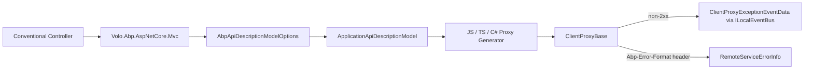

`Volo.Abp.Http.Abstractions` is deliberately small. It is the
zero-dependency package that both server-side packages (the MVC and
SignalR modules) and client-side packages (the dynamic HTTP client
proxies) can reference without pulling in
`Microsoft.AspNetCore.*`. Everything you build on top of HTTP — the
remote-service infrastructure in `Volo.Abp.RemoteServices`, the dynamic
proxies in `Volo.Abp.Http.Client`, the API metadata controller in
`Volo.Abp.AspNetCore.Mvc` — agrees on the contracts shipped here.

<CardGroup cols={2}>
  <Card title="Http (server helpers)" icon="server" href="/framework/aspnetcore/http">
    The companion package that adds `HttpMethodHelper` and the JS proxy generator.
  </Card>
  <Card title="Remote Services" icon="cloud" href="/framework/aspnetcore/remote-services">
    Where `RemoteServiceConfiguration` and the configuration dictionary live.
  </Card>
</CardGroup>

## File inventory

The package contents are tiny — three real files plus the module class.

```text framework/src/Volo.Abp.Http.Abstractions
Volo/Abp/Http/
├── AbpHttpAbstractionsModule.cs
├── ClientProxyExceptionEventData.cs
└── Modeling/
    └── AbpApiDescriptionModelOptions.cs
```

Everything else conceptually "lives in HTTP abstractions" — the
`RemoteServiceErrorInfo`, `RemoteServiceErrorResponse`, the
`IHasHttpStatusCode` interface, the JS-proxy parameter binding sources
— actually ships through sibling packages
(`Volo.Abp.ExceptionHandling`, `Volo.Abp.Http`) for layering reasons.
This page documents what is in `Volo.Abp.Http.Abstractions` and points
you at the friends it talks to.

## The module

```csharp framework/src/Volo.Abp.Http.Abstractions/Volo/Abp/Http/AbpHttpAbstractionsModule.cs
using Volo.Abp.Modularity;

namespace Volo.Abp.Http;

public class AbpHttpAbstractionsModule : AbpModule
{

}
```

It is a pure marker module: no `DependsOn`, no `ConfigureServices`. Its
job is to give every higher‑level package a single dependency edge to
declare — for example `AbpHttpModule`, the dynamic client modules and
`AbpAspNetCoreMvcContractsModule` all sit downstream of it.

## Abstractions in this package

| Type | Kind | Purpose |
| ---- | ---- | ------- |
| `AbpHttpAbstractionsModule` | `AbpModule` | Marker module; no service registrations. |
| `ClientProxyExceptionEventData` | event‑data DTO | Payload published when a dynamic client proxy receives a non‑success status. |
| `AbpApiDescriptionModelOptions` | options class | Filter list used while building the API description metadata that drives generated proxies. |

### `ClientProxyExceptionEventData`

This is the payload that
[`Volo.Abp.Http.Client.ClientProxyBase`](https://github.com/abpframework/abp/blob/rel-7.4/framework/src/Volo.Abp.Http.Client/Volo/Abp/Http/Client/ClientProxying/ClientProxyBase.cs)
publishes through the
[`ILocalEventBus`](/framework/eventbus/local-event-bus) when a
server‑side call returns a non‑2xx status. The shape is intentionally
HTTP‑native:

```csharp framework/src/Volo.Abp.Http.Abstractions/Volo/Abp/Http/ClientProxyExceptionEventData.cs
namespace Volo.Abp.Http;

public class ClientProxyExceptionEventData
{
    public int? StatusCode { get; set; }

    public string ReasonPhrase { get; set; }
}
```

Both fields are nullable because the proxy may publish the event even
when the underlying transport never produced a response (for example a
DNS failure resurfaced as `HttpRequestException`). Subscribe to it in a
local‑event handler if you want application‑level telemetry without
hooking into the lower-level `IRemoteServiceHttpClientAuthenticator`.

### `AbpApiDescriptionModelOptions`

Building the application‑description model (consumed by the JS proxy
generator, by the Angular schematics and by Swagger via
`AbpRemoteServiceApiDescriptionProvider`) walks every public interface
of every conventional controller. Some interfaces are pure DI markers
(`ITransientDependency`, `ISingletonDependency`), some are infrastructure
contracts (`IDisposable`,
`IAvoidDuplicateCrossCuttingConcerns`) — those should never appear as
"remote API surface". `AbpApiDescriptionModelOptions` is the
configurable allowlist of interfaces to skip:

```csharp framework/src/Volo.Abp.Http.Abstractions/Volo/Abp/Http/Modeling/AbpApiDescriptionModelOptions.cs
public class AbpApiDescriptionModelOptions
{
    public HashSet<Type> IgnoredInterfaces { get; }

    public AbpApiDescriptionModelOptions()
    {
        IgnoredInterfaces = new HashSet<Type>
            {
                typeof(ITransientDependency),
                typeof(ISingletonDependency),
                typeof(IDisposable),
                typeof(IAvoidDuplicateCrossCuttingConcerns)
            };
    }
}
```

`Volo.Abp.AspNetCore.Mvc` augments the list at start‑up by appending
MVC filter interfaces, so application‑service interfaces never expose
filter members through generated clients:

```csharp framework/src/Volo.Abp.AspNetCore.Mvc/Volo/Abp/AspNetCore/Mvc/AbpAspNetCoreMvcModule.cs
Configure<AbpApiDescriptionModelOptions>(options =>
{
    options.IgnoredInterfaces.AddIfNotContains(typeof(IAsyncActionFilter));
    options.IgnoredInterfaces.AddIfNotContains(typeof(IFilterMetadata));
    options.IgnoredInterfaces.AddIfNotContains(typeof(IActionFilter));
});
```

Add more entries from your own module if you ship a custom DI marker
interface that should never be considered part of a service contract.

## Where the rest of the "HTTP abstractions" actually live

Several types you will see referenced from this package are physically
hosted by neighbouring packages so that
`Volo.Abp.Http.Abstractions` itself stays dependency‑free.

| Type | Hosting package | Source |
| ---- | --------------- | ------ |
| `RemoteServiceErrorInfo` | `Volo.Abp.ExceptionHandling` | `Volo/Abp/Http/RemoteServiceErrorInfo.cs` |
| `RemoteServiceErrorResponse` | `Volo.Abp.ExceptionHandling` | `Volo/Abp/Http/RemoteServiceErrorResponse.cs` |
| `RemoteServiceValidationErrorInfo` | `Volo.Abp.ExceptionHandling` | `Volo/Abp/Http/RemoteServiceValidationErrorInfo.cs` |
| `IHasHttpStatusCode` | `Volo.Abp.ExceptionHandling` | `Volo/Abp/Http/IHasHttpStatusCode.cs` |
| `AbpRemoteCallException` | `Volo.Abp.ExceptionHandling` | `Volo/Abp/Http/Client/AbpRemoteCallException.cs` |
| `HttpMethodHelper` | `Volo.Abp.Http` | See [http.mdx](/framework/aspnetcore/http) |
| `AbpHttpConsts` | `Volo.Abp.Http` | header names used by exception middleware |

`RemoteServiceErrorInfo` is the wire shape every error response uses
when the server responds with `Abp-Error-Format: true`. Its public
surface is reproduced here for orientation:

```csharp framework/src/Volo.Abp.ExceptionHandling/Volo/Abp/Http/RemoteServiceErrorInfo.cs
public class RemoteServiceErrorInfo
{
    public string Code { get; set; }
    public string Message { get; set; }
    public string Details { get; set; }
    public object Data { get; set; }
    public RemoteServiceValidationErrorInfo[] ValidationErrors { get; set; }
}
```

The server-side `AbpExceptionHandlingMiddleware` builds it from a thrown
exception using
[`IExceptionToErrorInfoConverter`](/framework/exception-handling/converter)
and writes it as JSON. The dynamic client reads it back, recognises the
`Abp-Error-Format` header set by the middleware, and rehydrates the
exception via `AbpRemoteCallException`.

## Control flow: how the abstractions tie together



`AbpApiDescriptionModelOptions` controls what the API description model
contains, and the API description model is what every proxy generator
consumes; if you want a contract excluded from generated clients across
the board, this is the central place to do it.

## Versioning and target framework

The package targets `net7.0` (ABP 7.4.0) and references only
`Volo.Abp.Core` plus the modularity module. Because it is so small and
allocates no infrastructure, it is safe to take a dependency on from
any layer of an application without worrying about transitive ASP.NET
Core dependencies leaking into class libraries.

## See also

- [`Volo.Abp.Http`](/framework/aspnetcore/http) for `HttpMethodHelper`,
  the conventional verb table, and the JQuery proxy generator.
- [`Volo.Abp.AspNetCore.Mvc`](/framework/aspnetcore/aspnetcore-mvc) for
  how the description model is built from `ApplicationModel`.
- [`Volo.Abp.RemoteServices`](/framework/aspnetcore/remote-services) for
  the remote‑service configuration that the client proxies consume.
