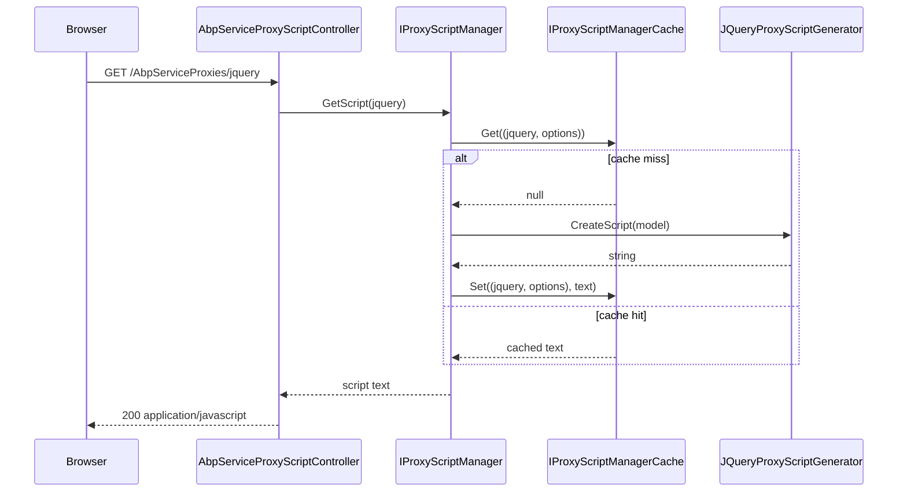

`Volo.Abp.Http` is the host-agnostic HTTP layer. It does not depend on
ASP.NET Core — it depends only on `Volo.Abp.Json` and
`Volo.Abp.Minify`. Everything in this package is consumed by both the
server-side MVC stack (to apply conventional routes and verbs) and the
client-side dynamic proxies (to map method names back to HTTP verbs and
to materialise JS proxies at runtime).

<CardGroup cols={2}>
  <Card title="Http Abstractions" icon="cube" href="/framework/aspnetcore/http-abstractions">
    The marker module this one depends on, plus shared event-data types.
  </Card>
  <Card title="AspNetCore Mvc" icon="route" href="/framework/aspnetcore/aspnetcore-mvc">
    Where `HttpMethodHelper` and `ConventionalRouteBuilder` are wired up.
  </Card>
</CardGroup>

## File inventory

```text framework/src/Volo.Abp.Http
Volo/Abp/Http/
├── AbpHttpConsts.cs
├── AbpHttpModule.cs
├── HttpMethodHelper.cs
├── Modeling/
│   ├── ActionApiDescriptionModel.cs
│   ├── ApiTypeNameHelper.cs
│   ├── ApplicationApiDescriptionModel.cs
│   ├── ApplicationApiDescriptionModelRequestDto.cs
│   ├── ControllerApiDescriptionModel.cs
│   ├── ControllerInterfaceApiDescriptionModel.cs
│   ├── IApiDescriptionModelProvider.cs
│   ├── InterfaceMethodApiDescriptionModel.cs
│   ├── MethodParameterApiDescriptionModel.cs
│   ├── ModuleApiDescriptionModel.cs
│   ├── ParameterApiDescriptionModel.cs
│   ├── PropertyApiDescriptionModel.cs
│   ├── ReturnValueApiDescriptionModel.cs
│   └── TypeApiDescriptionModel.cs
└── ProxyScripting/
    ├── Configuration/
    │   ├── AbpApiProxyScriptingConfiguration.cs
    │   └── AbpApiProxyScriptingOptions.cs
    ├── Generators/
    │   ├── IProxyScriptGenerator.cs
    │   ├── JQuery/
    │   │   ├── DynamicJavaScriptProxyOptions.cs
    │   │   └── JQueryProxyScriptGenerator.cs
    │   ├── ParameterBindingSources.cs
    │   ├── ProxyScriptingHelper.cs
    │   └── ProxyScriptingJsFuncHelper.cs
    ├── IProxyScriptManager.cs
    ├── IProxyScriptManagerCache.cs
    ├── ProxyScriptManager.cs
    ├── ProxyScriptManagerCache.cs
    └── ProxyScriptingModel.cs
```

## Abstractions table

| Type | Kind | Purpose |
| ---- | ---- | ------- |
| `AbpHttpModule` | `AbpModule` | Registers the JQuery proxy generator into `AbpApiProxyScriptingOptions`. |
| `AbpHttpConsts` | `static class` | `AbpErrorFormat` and `AbpTenantResolveError` header names. |
| `HttpMethodHelper` | `static class` | Convention table mapping method-name prefixes ⇒ HTTP verb. |
| `ApplicationApiDescriptionModel` | model | Root of the metadata graph that drives proxy generation. |
| `IApiDescriptionModelProvider` | abstraction | Hook to add or rewrite description model entries. |
| `IProxyScriptManager` | abstraction | Renders proxy scripts on demand (used by `/AbpServiceProxies/jquery`). |
| `IProxyScriptManagerCache` | abstraction | In-memory caching layer for the rendered scripts. |
| `JQueryProxyScriptGenerator` | proxy generator | Emits jQuery-AJAX-based proxies from the description model. |
| `DynamicJavaScriptProxyOptions` | options | Allow modules to declare themselves invisible to the JS proxy. |
| `ParameterBindingSources` | constants | "FromBody", "FromForm", "FromQuery", "FromRoute" string keys. |

## The module

`AbpHttpModule` is small. Its only registration is the default JQuery
proxy generator:

```csharp framework/src/Volo.Abp.Http/Volo/Abp/Http/AbpHttpModule.cs
[DependsOn(typeof(AbpHttpAbstractionsModule))]
[DependsOn(typeof(AbpJsonModule))]
[DependsOn(typeof(AbpMinifyModule))]
public class AbpHttpModule : AbpModule
{
    public override void ConfigureServices(ServiceConfigurationContext context)
    {
        Configure<AbpApiProxyScriptingOptions>(options =>
        {
            options.Generators[JQueryProxyScriptGenerator.Name] = typeof(JQueryProxyScriptGenerator);
        });
    }
}
```

It depends on `Volo.Abp.Json` (for serialisation of the description
model) and `Volo.Abp.Minify` (so the generated JS can be optionally
minified for production). The MVC module disables the `abp` module from
the JS proxy in turn because the ABP JS SDK already provides those
helpers:

```csharp framework/src/Volo.Abp.AspNetCore.Mvc/Volo/Abp/AspNetCore/Mvc/AbpAspNetCoreMvcModule.cs
Configure<DynamicJavaScriptProxyOptions>(options =>
{
    options.DisableModule("abp");
});
```

## `HttpMethodHelper`: name-to-verb conventions

The single most important file in the package is
`HttpMethodHelper`. It is the canonical answer to "given a method named
`GetActiveUsersAsync`, what HTTP verb should the route get?" — used
both by the server side (`ConventionalRouteBuilder` inside
`Volo.Abp.AspNetCore.Mvc`) and by the dynamic C# proxies in
`Volo.Abp.Http.Client`.

```csharp framework/src/Volo.Abp.Http/Volo/Abp/Http/HttpMethodHelper.cs
public static class HttpMethodHelper
{
    public const string DefaultHttpVerb = "POST";

    public static Dictionary<string, string[]> ConventionalPrefixes { get; set; } = new Dictionary<string, string[]>
    {
        {"GET",    new[] {"GetList", "GetAll", "Get"}},
        {"PUT",    new[] {"Put", "Update"}},
        {"DELETE", new[] {"Delete", "Remove"}},
        {"POST",   new[] {"Create", "Add", "Insert", "Post"}},
        {"PATCH",  new[] {"Patch"}}
    };

    public static string GetConventionalVerbForMethodName(string methodName)
    {
        foreach (var conventionalPrefix in ConventionalPrefixes)
        {
            if (conventionalPrefix.Value.Any(prefix => methodName.StartsWith(prefix, StringComparison.OrdinalIgnoreCase)))
            {
                return conventionalPrefix.Key;
            }
        }

        return DefaultHttpVerb;
    }
```

Two callable helpers are exposed besides the lookup:

- `RemoveHttpMethodPrefix(methodName, httpMethod)` — strips the matched
  prefix when building the route segment, so `GetActiveUsers` becomes
  `active-users` after the case-converter runs.
- `ConvertToHttpMethod(string)` — string ⇒ `System.Net.Http.HttpMethod`
  (used by the typed client when calling `HttpClient.SendAsync`).

```csharp framework/src/Volo.Abp.Http/Volo/Abp/Http/HttpMethodHelper.cs
public static HttpMethod ConvertToHttpMethod(string httpMethod)
{
    switch (httpMethod.ToUpperInvariant())
    {
        case "GET":     return HttpMethod.Get;
        case "POST":    return HttpMethod.Post;
        case "PUT":     return HttpMethod.Put;
        case "DELETE":  return HttpMethod.Delete;
        case "OPTIONS": return HttpMethod.Options;
        case "TRACE":   return HttpMethod.Trace;
        case "HEAD":    return HttpMethod.Head;
        case "PATCH":   return new HttpMethod("PATCH");
        default:
            throw new AbpException("Unknown HTTP METHOD: " + httpMethod);
    }
}
```

Because `ConventionalPrefixes` is `public static set`, you can mutate
it from `PreConfigureServices` if your domain has a vocabulary the
defaults do not cover — for example mapping `Approve*` to `POST` is a
no-op (it already falls through to the default verb) but you might want
to add `Cancel*` as `DELETE`.

## Carrier headers

`AbpHttpConsts` is two constants — they are the keys the server and
the client agree on:

```csharp framework/src/Volo.Abp.Http/Volo/Abp/Http/AbpHttpConsts.cs
public static class AbpHttpConsts
{
    public const string AbpErrorFormat = "_AbpErrorFormat";
    public const string AbpTenantResolveError = "Abp-Tenant-Resolve-Error";
}
```

`AbpErrorFormat` is the response header
`AbpExceptionHandlingMiddleware` sets to tell the client "this body is
a `RemoteServiceErrorResponse`, please deserialise":

```csharp framework/src/Volo.Abp.AspNetCore/Volo/Abp/AspNetCore/ExceptionHandling/AbpExceptionHandlingMiddleware.cs
httpContext.Response.Headers.Add(AbpHttpConsts.AbpErrorFormat, "true");
httpContext.Response.Headers.Add("Content-Type", "application/json");
```

The dynamic client checks the same header and reconstructs an
`AbpRemoteCallException` only when it sees `"true"`.

`AbpTenantResolveError` is the header that
`MultiTenancyMiddleware` sets when the tenant resolver fails — see
[multi-tenancy](/framework/aspnetcore/aspnetcore-multitenancy).

## The description model

`ApplicationApiDescriptionModel` is the root of the metadata tree:

```text
ApplicationApiDescriptionModel
└── Modules : { name → ModuleApiDescriptionModel }
    └── Controllers : { name → ControllerApiDescriptionModel }
        └── Actions : { name → ActionApiDescriptionModel }
            └── Parameters : List<ParameterApiDescriptionModel>
```

It is JSON‑serialisable, stable across versions, and is the contract
read by:

- the JS proxy generator inside this package
  (`JQueryProxyScriptGenerator`),
- the static C# / TS / Angular proxy generators in
  `Volo.Abp.Cli.Core`,
- the static API metadata endpoint exposed by
  `AbpApiDefinitionController` in `Volo.Abp.AspNetCore.Mvc`.

`IApiDescriptionModelProvider` is the SPI for contributing extra
controllers/actions to that tree — most modules do not implement it
because `AspNetCoreApiDescriptionModelProvider` (in
`Volo.Abp.AspNetCore.Mvc`) reflects over MVC's own
`ApiDescriptionGroupCollectionProvider`.

## Proxy script manager

`ProxyScriptManager` caches one rendered script per `(generator,
options)` pair so repeated requests to `/AbpServiceProxies/jquery`
don't recompile. The cache is invalidated only by application restart;
the `IProxyScriptManagerCache` interface lets you swap it out for a
distributed implementation.



## `DynamicJavaScriptProxyOptions`

```csharp framework/src/Volo.Abp.Http/Volo/Abp/Http/ProxyScripting/Generators/JQuery/DynamicJavaScriptProxyOptions.cs
public class DynamicJavaScriptProxyOptions
{
    public HashSet<string> DisabledModules { get; }

    public DynamicJavaScriptProxyOptions()
    {
        DisabledModules = new HashSet<string>();
    }

    public void DisableModule(string moduleName) => DisabledModules.AddIfNotContains(moduleName);
}
```

A "module" here is the value of `RemoteServiceAttribute.Name` — calling
`DisableModule("abp")` from MVC excludes every controller whose remote
service group is `"abp"`. This is how the framework keeps its own
infrastructure controllers (`/api/abp/api-definition`,
`/api/abp/application-configuration`) out of generated client SDKs by
default.

## Options table

| Options class | Default | Configured by |
| ------------- | ------- | ------------- |
| `AbpApiProxyScriptingOptions.Generators` | `{ "jquery" ⇒ JQueryProxyScriptGenerator }` | `AbpHttpModule.ConfigureServices` |
| `AbpApiProxyScriptingConfiguration.IsMinifyEnabled` | `true` in production via `AbpAspNetCoreMvcOptions.MinifyGeneratedScript` | `AbpAspNetCoreMvcModule.PostConfigureServices` |
| `DynamicJavaScriptProxyOptions.DisabledModules` | `{ "abp" }` | `AbpAspNetCoreMvcModule.ConfigureServices` |
| `AbpApiDescriptionModelOptions.IgnoredInterfaces` | Lifetime markers + `IDisposable` + MVC filter interfaces | base class + `AbpAspNetCoreMvcModule` |

## When to dig in vs. ignore

If you are building application services and consuming the dynamic C#
client, you can ignore this package entirely — every public surface
here is wired up for you by the framework. The places you do typically
touch it are:

1. Adding a custom verb convention (`HttpMethodHelper.ConventionalPrefixes`).
2. Hiding a controller from generated SDKs
   (`DynamicJavaScriptProxyOptions.DisableModule`).
3. Authoring a new proxy generator (`IProxyScriptGenerator`) — for
   example to emit native Swift or Kotlin clients from the same
   description model.

## See also

- [`AspNetCore.Mvc`](/framework/aspnetcore/aspnetcore-mvc) for how
  conventional routes consume `HttpMethodHelper`.
- [`Remote Services`](/framework/aspnetcore/remote-services) for how
  the JS proxy looks up `RemoteServiceConfiguration.BaseUrl`.
- [Exception Handling](/framework/exception-handling/middleware) for the
  middleware that sets `Abp-Error-Format` on error responses.
