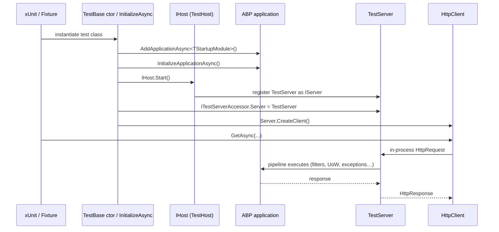

`Volo.Abp.AspNetCore.TestBase` lets you drive an entire ABP module
graph in-process from xUnit/NUnit tests and hit it with a real
`HttpClient`. It wraps `Microsoft.AspNetCore.TestHost` with the
specifics ABP needs: it has to start the framework, swap out the
production hosting lifetime, expose the `TestServer` through
`ITestServerAccessor`, and make Autofac the container so dynamic
proxying still works.

<CardGroup cols={2}>
  <Card title="TestBase (core)" icon="vial" href="/framework/testing/test-base">
    The non-ASP.NET test base this one ultimately extends.
  </Card>
  <Card title="AspNetCore" icon="server" href="/framework/aspnetcore/aspnetcore">
    The module under test.
  </Card>
</CardGroup>

## File map

```text framework/src/Volo.Abp.AspNetCore.TestBase
Volo/Abp/AspNetCore/TestBase/
├── AbpAspNetCoreAsyncIntegratedTestBase.cs
├── AbpAspNetCoreIntegratedTestBase.cs
├── AbpAspNetCoreTestBaseModule.cs
├── AbpNoopHostLifetime.cs
├── DynamicProxying/
│   └── AspNetCoreTestProxyHttpClientFactory.cs
├── ITestServerAccessor.cs
├── TestNoopHostLifetime.cs
├── TestServerAccessor.cs
├── TestStartup.cs
└── WebHostBuilderExtensions.cs
```

## Abstractions table

| Type | Kind | Purpose |
| ---- | ---- | ------- |
| `AbpAspNetCoreTestBaseModule` | `AbpModule` | Brings in HttpClient + AspNetCore + base TestBase + Autofac. |
| `AbpAspNetCoreIntegratedTestBase<TStartupModule>` | abstract test base | Synchronous setup in the test class constructor. |
| `AbpAspNetCoreAsyncIntegratedTestBase<TModule>` | abstract test base | `IAsyncLifetime`-friendly variant for the minimal-hosting model. |
| `TestStartup<TStartupModule>` | internal | The classic `Startup` class adapted to drive `AddApplicationAsync<TStartupModule>`. |
| `AbpWebHostBuilderExtensions.UseAbpTestServer` | extension | Replaces `IHostLifetime` and `IServer` with TestHost equivalents. |
| `AbpNoopHostLifetime` / `TestNoopHostLifetime` | `IHostLifetime` | No-op lifetime, so the test host doesn't try to wait for SIGINT. |
| `ITestServerAccessor` / `TestServerAccessor` | accessor | Lets app code read the active `TestServer` instance. |
| `AspNetCoreTestProxyHttpClientFactory` | `IHttpClientFactory` | Routes `HttpClient` calls produced by dynamic proxies back into the in-process `TestServer`. |

## The module

```csharp framework/src/Volo.Abp.AspNetCore.TestBase/Volo/Abp/AspNetCore/TestBase/AbpAspNetCoreTestBaseModule.cs
[DependsOn(typeof(AbpHttpClientModule))]
[DependsOn(typeof(AbpAspNetCoreModule))]
[DependsOn(typeof(AbpTestBaseModule))]
[DependsOn(typeof(AbpAutofacModule))]
public class AbpAspNetCoreTestBaseModule : AbpModule
{

}
```

The four dependencies are the canonical "what does an end-to-end test
need" list:

| Module | Why |
| ------ | --- |
| `AbpHttpClientModule` | Lets test code use the dynamic client proxies against the in-proc server. |
| `AbpAspNetCoreModule` | The host integration we're exercising. |
| `AbpTestBaseModule` | `AbpTestBaseWithServiceProvider`, the framework's xUnit-friendly base. |
| `AbpAutofacModule` | Test hosts must use Autofac because production hosts do — dynamic proxying relies on it. |

The convention-based registrar also picks up `TestServerAccessor` and
the `AspNetCoreTestProxyHttpClientFactory` as singletons.

## The sync base class

```csharp framework/src/Volo.Abp.AspNetCore.TestBase/Volo/Abp/AspNetCore/TestBase/AbpAspNetCoreIntegratedTestBase.cs
/// <typeparam name="TStartupModule">
/// Can be a module type or old-style ASP.NET Core Startup class.
/// </typeparam>
public abstract class AbpAspNetCoreIntegratedTestBase<TStartupModule> : AbpTestBaseWithServiceProvider, IDisposable
    where TStartupModule : class
{
    protected TestServer Server { get; }
    protected HttpClient Client { get; }
    private readonly IHost _host;

    protected AbpAspNetCoreIntegratedTestBase()
    {
        var builder = CreateHostBuilder();

        _host = builder.Build();
        _host.Start();

        Server = _host.GetTestServer();
        Client = _host.GetTestClient();

        ServiceProvider = Server.Services;

        ServiceProvider.GetRequiredService<ITestServerAccessor>().Server = Server;
    }

    protected virtual IHostBuilder CreateHostBuilder()
    {
        return Host.CreateDefaultBuilder()
            .ConfigureWebHostDefaults(webBuilder =>
            {
                if (typeof(TStartupModule).IsAssignableTo<IAbpModule>())
                {
                    webBuilder.UseStartup<TestStartup<TStartupModule>>();
                }
                else
                {
                    webBuilder.UseStartup<TStartupModule>();
                }

                webBuilder.UseAbpTestServer();
            })
            .UseAutofac()
            .ConfigureServices(ConfigureServices);
    }
    // …
    public void Dispose() => _host?.Dispose();
}
```

The constructor wires the full host synchronously, so a test class
deriving from this is ready to make calls in every `[Fact]`. The
generic parameter accepts either:

- **An ABP module** — `TestStartup<TStartupModule>` adapts it via
  `services.AddApplicationAsync(typeof(TStartupModule))`.
- **A classic ASP.NET Core `Startup`** — it's passed through to
  `UseStartup<>` directly. This is rare in modern apps but handy for
  testing legacy migrations.

`UseAutofac()` is *required*. Without it, dynamic proxying breaks
because the .NET DI container does not support intercepting open
generics and some of ABP's lazy-service patterns.

`ConfigureServices` is virtual so subclasses can override DI registrations
test-by-test (e.g. swapping `IClock` for a fake).

### URL helpers

```csharp
protected virtual string GetUrl<TController>()
{
    return "/" + typeof(TController).Name.RemovePostFix(
        "Controller", "AppService", "ApplicationService",
        "IntService", "IntegrationService", "Service");
}

protected virtual string GetUrl<TController>(string actionName) => GetUrl<TController>() + "/" + actionName;

protected virtual string GetUrl<TController>(string actionName, object queryStringParamsAsAnonymousObject)
{
    var url = GetUrl<TController>(actionName);
    var dictionary = new RouteValueDictionary(queryStringParamsAsAnonymousObject);
    if (dictionary.Any())
    {
        url += "?" + dictionary.Select(d => $"{d.Key}={d.Value}").JoinAsString("&");
    }
    return url;
}
```

These three helpers approximate the conventional routing rules so test
code stays compact:

```csharp
var response = await Client.GetAsync(GetUrl<UserAppService>("GetList", new { Filter = "alice" }));
```

resolves to `GET /User/GetList?Filter=alice` — useful when the test
isn't going through a dynamic proxy.

## The async variant

```csharp framework/src/Volo.Abp.AspNetCore.TestBase/Volo/Abp/AspNetCore/TestBase/AbpAspNetCoreAsyncIntegratedTestBase.cs
public class AbpAspNetCoreAsyncIntegratedTestBase<TModule> where TModule : IAbpModule
{
    protected WebApplication WebApplication { get; set; } = default!;
    protected TestServer Server { get; set; } = default!;
    protected HttpClient Client { get; set; } = default!;
    protected IServiceProvider ServiceProvider { get; set; } = default!;

    public virtual async Task InitializeAsync()
    {
        var builder = WebApplication.CreateBuilder();
        builder.Host.ConfigureServices(services =>
            {
                services.AddSingleton<IHostLifetime, TestNoopHostLifetime>();
                services.AddSingleton<IServer, TestServer>();
            })
            .UseAutofac();

        await builder.Services.AddApplicationAsync<TModule>(options =>
        {
            options.Services.ReplaceConfiguration(builder.Configuration);
        });

        await ConfigureServicesAsync(builder.Services);
        WebApplication = builder.Build();
        await WebApplication.InitializeApplicationAsync();
        await WebApplication.StartAsync();

        Server = WebApplication.Services.GetRequiredService<IHost>().GetTestServer();
        Client = Server.CreateClient();

        ServiceProvider = Server.Services;
        ServiceProvider.GetRequiredService<ITestServerAccessor>().Server = Server;
    }

    public virtual async Task DisposeAsync() => await WebApplication.DisposeAsync();
}
```

Differences from the sync variant:

- Uses the **minimal hosting model** (`WebApplication.CreateBuilder()`)
  instead of the classic `IHostBuilder`. This matches the templates
  generated by `abp new` in 7.x.
- Initialisation is async — pair the class with xUnit's
  `IAsyncLifetime` so `InitializeAsync` runs before the first
  `[Fact]`.
- The `IHostLifetime` swap is done inline; there is no
  `UseAbpTestServer` step because the minimal-hosting builder does it
  by registering `TestServer` directly as the `IServer`.

## `TestStartup<TStartupModule>`

```csharp framework/src/Volo.Abp.AspNetCore.TestBase/Volo/Abp/AspNetCore/TestBase/TestStartup.cs
internal class TestStartup<TStartupModule>
{
    public void ConfigureServices(IServiceCollection services)
    {
        AsyncHelper.RunSync(() => services.AddApplicationAsync(typeof(TStartupModule)));
    }

    public void Configure(IApplicationBuilder app)
    {
        AsyncHelper.RunSync(app.InitializeApplicationAsync);
    }
}
```

A two-method classic Startup, retrofitted onto the async ABP host APIs.
The `AsyncHelper.RunSync` calls are safe here because both
`AddApplicationAsync` and `InitializeApplicationAsync` complete
synchronously when there are no async module hooks declared. This is the
class the sync test base uses when `TStartupModule : IAbpModule`.

## `UseAbpTestServer`

```csharp framework/src/Volo.Abp.AspNetCore.TestBase/Volo/Abp/AspNetCore/TestBase/WebHostBuilderExtensions.cs
public static class AbpWebHostBuilderExtensions
{
    public static IWebHostBuilder UseAbpTestServer(this IWebHostBuilder builder)
    {
        return builder.ConfigureServices(services =>
        {
            services.AddScoped<IHostLifetime, AbpNoopHostLifetime>();
            services.AddScoped<IServer, TestServer>();
        });
    }
}
```

Two swaps:

1. `IHostLifetime` ⇒ `AbpNoopHostLifetime` — the production lifetime
   would block on `Console.CancelKeyPress`; the no-op version returns
   `Task.CompletedTask` everywhere so tests can start/stop the host
   freely.
2. `IServer` ⇒ `TestServer` — the kestrel server is replaced with the
   in-memory test server, which exposes `CreateClient()` /
   `GetTestClient()` for `HttpClient`-based assertions.

## `ITestServerAccessor`

```csharp framework/src/Volo.Abp.AspNetCore.TestBase/Volo/Abp/AspNetCore/TestBase/ITestServerAccessor.cs
public interface ITestServerAccessor
{
    TestServer Server { get; set; }
}
```

Both test bases set this after construction so application code (such as
the `AspNetCoreTestProxyHttpClientFactory`) can reach the test server
without going through the test class. This is how the dynamic HTTP
client proxies route their `HttpClient.CreateClient(...)` requests back
into the in-process pipeline.

## End-to-end test lifecycle



## Patterns

### Overriding a service

```csharp
public class UserAppService_Tests : AbpAspNetCoreIntegratedTestBase<MyModule>
{
    protected override void ConfigureServices(HostBuilderContext ctx, IServiceCollection services)
    {
        services.Replace(ServiceDescriptor.Singleton<IClock>(new FakeClock(new DateTime(2024, 1, 1, 12, 0, 0))));
    }

    [Fact]
    public async Task Get_should_return_users()
    {
        var response = await Client.GetAsync(GetUrl<UserController>("GetList"));
        response.EnsureSuccessStatusCode();
    }
}
```

### Driving the dynamic proxy

When you resolve an `IUserAppService` from `Server.Services`, the
dynamic proxy is constructed and goes through
`AspNetCoreTestProxyHttpClientFactory`. The factory short-circuits
named `HttpClient` resolution to `TestServer.CreateClient()`, so calls
land in the same in-process pipeline as if they came from `Client`.

```csharp
var users = ServiceProvider
    .GetRequiredService<IUserAppService>()
    .GetListAsync(new GetUserListInput()).Result;
```

This is the highest-fidelity test you can write short of running a real
Kestrel — it exercises serialisation, the filter pipeline, exception
wrapping, model binding and unit-of-work boundaries.

## See also

- [TestBase core](/framework/testing/test-base) — the non-web base
  this one ultimately inherits from.
- [`AspNetCore`](/framework/aspnetcore/aspnetcore) — the module under
  test in most cases.
- [`AspNetCore.Mvc`](/framework/aspnetcore/aspnetcore-mvc) — the
  filters and conventions whose behaviour these tests typically
  assert.
