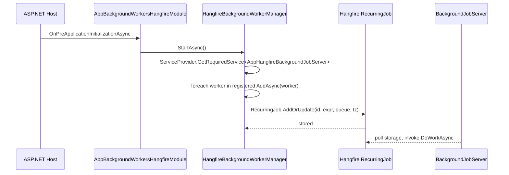

`Volo.Abp.BackgroundWorkers.Hangfire` bridges ABP's `IBackgroundWorker` abstraction with Hangfire's recurring-job infrastructure. The default `BackgroundWorkerManager` (from `Volo.Abp.BackgroundWorkers`) runs every worker inside a `System.Threading.Timer` on the host process — fine for a single instance, but lost on restart and not coordinated between replicas. This package replaces it with `HangfireBackgroundWorkerManager`, which calls `RecurringJob.AddOrUpdate(...)` so workers run on Hangfire's `BackgroundJobServer` with persistent state, retries and a dashboard.

The package depends on `Volo.Abp.BackgroundWorkers` (for the worker contracts) and `Volo.Abp.HangFire` (for the Hangfire module).

## File inventory

| File | Purpose |
| --- | --- |
| `Volo/Abp/BackgroundWorkers/Hangfire/AbpBackgroundWorkersHangfireModule.cs` | Module class. Registers the periodic adapter and disables the job server when workers are globally disabled. |
| `Volo/Abp/BackgroundWorkers/Hangfire/HangfireBackgroundWorkerManager.cs` | Replacement `IBackgroundWorkerManager` implementation. |
| `Volo/Abp/BackgroundWorkers/Hangfire/IHangfireBackgroundWorker.cs` | Worker interface carrying Hangfire-specific metadata (`CronExpression`, `Queue`, `TimeZone`, `RecurringJobId`). |
| `Volo/Abp/BackgroundWorkers/Hangfire/HangfireBackgroundWorkerBase.cs` | Convenience base class implementing the interface. |
| `Volo/Abp/BackgroundWorkers/Hangfire/HangfirePeriodicBackgroundWorkerAdapter.cs` | Adapts an existing `PeriodicBackgroundWorkerBase` / `AsyncPeriodicBackgroundWorkerBase` to Hangfire's recurring-job model. |

## Key abstractions

| Symbol | Role |
| --- | --- |
| `HangfireBackgroundWorkerManager` | `[Dependency(ReplaceServices = true)] ISingletonDependency`. Knows how to register Hangfire workers and how to convert classic periodic workers into a cron expression. |
| `IHangfireBackgroundWorker : IBackgroundWorker` | Adds `RecurringJobId`, `CronExpression`, `TimeZone`, `Queue` and `DoWorkAsync(CancellationToken)`. |
| `HangfireBackgroundWorkerBase` | Abstract base that supplies sensible defaults (`Queue = "default"`, `TimeZone = null`). |
| `HangfirePeriodicBackgroundWorkerAdapter<TWorker>` | A `HangfireBackgroundWorkerBase` whose `DoWorkAsync` resolves the original worker from DI and invokes its private `DoWork(Async)` reflectively. |

## The module

```csharp
[DependsOn(
    typeof(AbpBackgroundWorkersModule),
    typeof(AbpHangfireModule))]
public class AbpBackgroundWorkersHangfireModule : AbpModule
{
    public override void ConfigureServices(ServiceConfigurationContext context)
    {
        context.Services.AddSingleton(typeof(HangfirePeriodicBackgroundWorkerAdapter<>));
    }

    public async override Task OnPreApplicationInitializationAsync(ApplicationInitializationContext context)
    {
        var options = context.ServiceProvider.GetRequiredService<IOptions<AbpBackgroundWorkerOptions>>().Value;
        if (!options.IsEnabled)
        {
            var hangfireOptions = context.ServiceProvider
                .GetRequiredService<IOptions<AbpHangfireOptions>>().Value;
            hangfireOptions.BackgroundJobServerFactory = CreateOnlyEnqueueJobServer;
        }

        await context.ServiceProvider
            .GetRequiredService<IBackgroundWorkerManager>()
            .StartAsync();
    }

    private BackgroundJobServer? CreateOnlyEnqueueJobServer(IServiceProvider serviceProvider)
    {
        serviceProvider.GetRequiredService<JobStorage>();
        return null;
    }
}
```

Two behaviours stand out:

- **Pre-init worker startup.** The manager is started at `OnPreApplicationInitializationAsync`, before user modules' `OnApplicationInitialization` runs. That ordering means by the time a user module's startup logic queues a one-off job, the recurring schedule is already registered.
- **"Enqueue-only" mode.** When `AbpBackgroundWorkerOptions.IsEnabled` is `false`, the module swaps `AbpHangfireOptions.BackgroundJobServerFactory` for one that returns `null`. The application can still enqueue and schedule jobs (the `JobStorage` service is resolved), but no `BackgroundJobServer` is created so this instance never picks work up. That is the supported way to run a web replica that enqueues only, with separate worker hosts doing the executing.

## How the manager picks the right strategy

```mermaid
flowchart TD
  Add[manager.AddAsync(worker)] --> Branch{worker type}
  Branch -- IHangfireBackgroundWorker --> H[RecurringJob.AddOrUpdate]
  Branch -- AsyncPeriodicBackgroundWorkerBase<br/>PeriodicBackgroundWorkerBase --> A[Reflect AbpTimer.Period<br/>build adapter]
  A --> Cron[GetCron(period)]
  Cron --> H
  Branch -- other IBackgroundWorker --> Base[base.AddAsync — timer thread]
```

Implementation:

```csharp
public async override Task AddAsync(IBackgroundWorker worker, CancellationToken cancellationToken = default)
{
    switch (worker)
    {
        case IHangfireBackgroundWorker hangfireBackgroundWorker:
        {
            var unProxyWorker = ProxyHelper.UnProxy(hangfireBackgroundWorker);
            if (hangfireBackgroundWorker.RecurringJobId.IsNullOrWhiteSpace())
            {
                RecurringJob.AddOrUpdate(
                    () => ((IHangfireBackgroundWorker)unProxyWorker).DoWorkAsync(cancellationToken),
                    hangfireBackgroundWorker.CronExpression, hangfireBackgroundWorker.TimeZone,
                    hangfireBackgroundWorker.Queue);
            }
            else
            {
                RecurringJob.AddOrUpdate(hangfireBackgroundWorker.RecurringJobId,
                    () => ((IHangfireBackgroundWorker)unProxyWorker).DoWorkAsync(cancellationToken),
                    hangfireBackgroundWorker.CronExpression, hangfireBackgroundWorker.TimeZone,
                    hangfireBackgroundWorker.Queue);
            }
            break;
        }
        case AsyncPeriodicBackgroundWorkerBase or PeriodicBackgroundWorkerBase:
        {
            var timer = worker.GetType()
                .GetProperty("Timer", BindingFlags.Instance | BindingFlags.NonPublic)?.GetValue(worker);

            var period = worker is AsyncPeriodicBackgroundWorkerBase
                ? ((AbpAsyncTimer?)timer)?.Period
                : ((AbpTimer?)timer)?.Period;

            if (period == null) return;

            var adapterType = typeof(HangfirePeriodicBackgroundWorkerAdapter<>)
                .MakeGenericType(ProxyHelper.GetUnProxiedType(worker));
            var workerAdapter = (Activator.CreateInstance(adapterType) as IHangfireBackgroundWorker)!;

            RecurringJob.AddOrUpdate(
                () => workerAdapter.DoWorkAsync(cancellationToken),
                GetCron(period.Value), workerAdapter.TimeZone, workerAdapter.Queue);
            break;
        }
        default:
            await base.AddAsync(worker, cancellationToken);
            break;
    }
}
```

### Period → cron expression

```csharp
protected virtual string GetCron(int period)
{
    var time = TimeSpan.FromMilliseconds(period);
    string cron;

    if (time.TotalSeconds <= 59)        cron = $"*/{time.TotalSeconds} * * * * *";
    else if (time.TotalMinutes <= 59)   cron = $"*/{time.TotalMinutes} * * * *";
    else if (time.TotalHours <= 23)     cron = $"0 */{time.TotalHours} * * *";
    else throw new AbpException(
        $"Cannot convert period: {period} to cron expression, use HangfireBackgroundWorkerBase to define worker");

    return cron;
}
```

The conversion is intentionally narrow: it covers seconds-up-to-a-day cadences but bails out for "every two days" or "every 90 minutes" type schedules. The thrown exception is the standard prompt to switch to `HangfireBackgroundWorkerBase` and supply a real cron expression.

<Warning>
Five-field cron expressions (the `* * * * *` form used by `RecurringJob.AddOrUpdate`) have **minute resolution**. Sub-minute cadences are emitted as six-field expressions (`*/10 * * * * *`). Hangfire 1.8 accepts both — check that your storage backend (e.g. SQL Server schema) is at the matching version.
</Warning>

## The Hangfire worker base

```csharp
public abstract class HangfireBackgroundWorkerBase : BackgroundWorkerBase, IHangfireBackgroundWorker
{
    public string? RecurringJobId { get; set; }
    public string CronExpression { get; set; } = default!;
    public TimeZoneInfo? TimeZone { get; set; }
    public string Queue { get; set; }

    public abstract Task DoWorkAsync(CancellationToken cancellationToken = default);

    protected HangfireBackgroundWorkerBase()
    {
        TimeZone = null;
        Queue = "default";
    }
}
```

Typical user worker:

```csharp
public class SendDigestEmailsWorker : HangfireBackgroundWorkerBase
{
    public SendDigestEmailsWorker()
    {
        RecurringJobId = "send-digest-emails";
        CronExpression = Cron.Daily(8, 0); // 08:00 every day
        Queue = "emails";
    }

    public override async Task DoWorkAsync(CancellationToken cancellationToken = default)
    {
        Logger.LogInformation("Building daily digest...");
        // resolve services here
    }
}
```

The worker is auto-registered as an `IHangfireBackgroundWorker` via conventional registration (it implements `IBackgroundWorker` ⇒ `ISingletonDependency`-style discovery driven by `Volo.Abp.BackgroundWorkers`). At startup the manager calls `AddAsync` and Hangfire stores the recurring job in your configured `JobStorage`.

## Periodic-worker adapter

`HangfirePeriodicBackgroundWorkerAdapter<TWorker>` is the magic that lets a non-Hangfire-aware `AsyncPeriodicBackgroundWorkerBase` run on Hangfire without modification:

```csharp
public class HangfirePeriodicBackgroundWorkerAdapter<TWorker> : HangfireBackgroundWorkerBase
    where TWorker : IBackgroundWorker
{
    private readonly MethodInfo _doWorkAsyncMethod;
    private readonly MethodInfo _doWorkMethod;

    public HangfirePeriodicBackgroundWorkerAdapter()
    {
        _doWorkAsyncMethod = typeof(TWorker).GetMethod("DoWorkAsync",
            BindingFlags.Instance | BindingFlags.NonPublic)!;
        _doWorkMethod = typeof(TWorker).GetMethod("DoWork",
            BindingFlags.Instance | BindingFlags.NonPublic)!;
    }

    public async override Task DoWorkAsync(CancellationToken cancellationToken = default)
    {
        var workerContext = new PeriodicBackgroundWorkerContext(ServiceProvider, cancellationToken);
        var worker = ServiceProvider.GetRequiredService<TWorker>();

        switch (worker)
        {
            case AsyncPeriodicBackgroundWorkerBase asyncPeriodicBackgroundWorker:
                await (Task)(_doWorkAsyncMethod.Invoke(asyncPeriodicBackgroundWorker,
                    new object[] { workerContext })!);
                break;
            case PeriodicBackgroundWorkerBase periodicBackgroundWorker:
                _doWorkMethod.Invoke(periodicBackgroundWorker, new object[] { workerContext });
                break;
        }
    }
}
```

Why reflection? Because `DoWork`/`DoWorkAsync` on the periodic base classes are `protected` — they were designed for the in-process timer to call. The adapter reaches in via `BindingFlags.NonPublic` to invoke them from a Hangfire job context instead.

## End-to-end startup sequence



## Options reference

| Option | Where | Default | Effect |
| --- | --- | --- | --- |
| `AbpBackgroundWorkerOptions.IsEnabled` | `Volo.Abp.BackgroundWorkers` | `true` | When `false`, the module swaps in `CreateOnlyEnqueueJobServer` so this instance becomes enqueue-only. |
| `IHangfireBackgroundWorker.CronExpression` | per worker | (none) | Hangfire cron expression. Use `Cron.*` helpers or six-field strings. |
| `IHangfireBackgroundWorker.RecurringJobId` | per worker | derived from method | Stable id used by `RecurringJob.AddOrUpdate(id, ...)`. Mandatory when you need stability across deployments. |
| `IHangfireBackgroundWorker.Queue` | per worker | `"default"` | The Hangfire queue name. Must match a queue served by some `BackgroundJobServer`. |
| `IHangfireBackgroundWorker.TimeZone` | per worker | `null` (UTC) | Time zone for cron evaluation. |

## Gotchas

- **Closures are serialised.** `RecurringJob.AddOrUpdate(() => unProxyWorker.DoWorkAsync(ct))` captures the unproxied worker reference; Hangfire serialises the method call. Avoid holding mutable state on worker fields between cron invocations — Hangfire creates a new instance via `JobActivator` for each run.
- **`cancellationToken` captured at registration.** The token passed to `AddAsync` is the host shutdown token; jobs invoked later receive the original token, not a per-invocation one. If you want a fresh per-run token, accept a `Hangfire.IJobCancellationToken` parameter and inject `JobCancellationToken.Null` as needed.
- **`PeriodicBackgroundWorkerBase.Timer.Period` is read once.** Mutating `Timer.Period` after startup does not re-register the recurring job. To change cadence at runtime, call `RecurringJob.AddOrUpdate` yourself with the new expression.
- **No memory storage warning.** If `Volo.Abp.HangFire` has not been configured with a real `JobStorage`, jobs are queued in memory and lost on restart (see the [Hangfire module page](/framework/background/hangfire)).
- **Multi-instance scheduling.** Hangfire dedupes recurring-job ids cluster-wide. Two replicas registering the same worker simply update the same record — but if you forget to set `RecurringJobId` on a worker derived from `HangfireBackgroundWorkerBase`, Hangfire generates an id from the expression which differs per replica.

<CardGroup cols={2}>
  <Card title="Hangfire module" icon="screwdriver-wrench" href="/framework/background/hangfire">
    The `Volo.Abp.HangFire` package that owns the `BackgroundJobServer`.
  </Card>
  <Card title="Background workers" icon="conveyor-belt" href="/framework/background/background-workers">
    The core `IBackgroundWorker` abstraction this package replaces.
  </Card>
  <Card title="Workers · Quartz" icon="repeat" href="/framework/background/background-workers-quartz">
    The Quartz-based alternative with the same surface.
  </Card>
  <Card title="Background jobs · Hangfire" icon="briefcase" href="/framework/background/background-jobs-hangfire">
    One-off enqueue API that lives alongside recurring workers.
  </Card>
</CardGroup>
