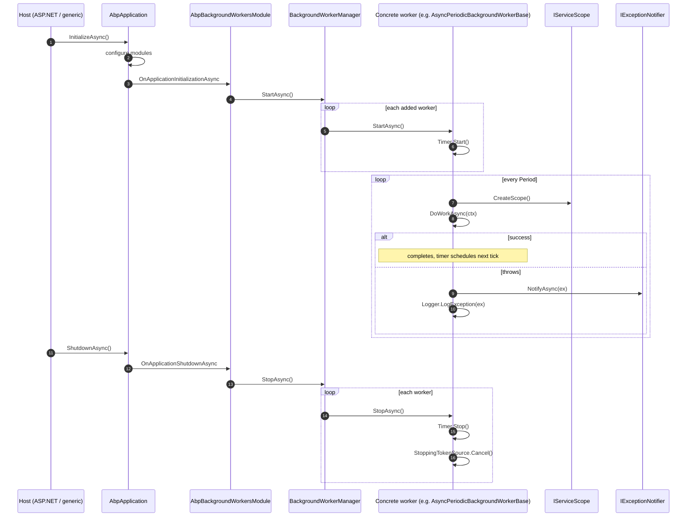

A *background worker* in ABP is a singleton that starts when the
application starts and stops when the application stops. The
abstractions are intentionally tiny: `IBackgroundWorker` is just an
`IRunnable` + `ISingletonDependency` marker, and
`BackgroundWorkerManager` is a list of workers with a `StartAsync` /
`StopAsync` pair that fans out. The interesting pieces are the two
periodic bases — `PeriodicBackgroundWorkerBase` uses an `AbpTimer`,
`AsyncPeriodicBackgroundWorkerBase` uses `AbpAsyncTimer` — which both
open a fresh DI scope per tick and route exceptions through
`IExceptionNotifier`.

This page walks every type in `Volo.Abp.BackgroundWorkers`, the
discoverability rules, and the Hangfire / Quartz manager replacements
that ship in sibling packages.

<CardGroup cols={2}>
  <Card title="Workers · Hangfire" icon="fire" href="/framework/background/background-workers-hangfire">
    HangfireBackgroundWorkerManager — routes IHangfireBackgroundWorker through RecurringJob.AddOrUpdate.
  </Card>
  <Card title="Workers · Quartz" icon="clock" href="/framework/background/background-workers-quartz">
    QuartzBackgroundWorkerManager — schedules IQuartzBackgroundWorker on an IScheduler.
  </Card>
  <Card title="Jobs · Default Engine" icon="gears" href="/framework/background/background-jobs">
    BackgroundJobWorker — the only first-party AsyncPeriodicBackgroundWorkerBase.
  </Card>
  <Card title="Hangfire base module" icon="cube" href="/framework/background/hangfire">
    What AbpHangfireModule sets up under the periodic worker adapter.
  </Card>
</CardGroup>

## File inventory

Source path: `framework/src/Volo.Abp.BackgroundWorkers/Volo/Abp/BackgroundWorkers/`.

| File | Purpose |
| --- | --- |
| `AbpBackgroundWorkersModule.cs` | Module — calls `StartAsync` / `StopAsync` on the manager during the host lifecycle |
| `AbpBackgroundWorkerOptions.cs` | Single `IsEnabled` flag |
| `IBackgroundWorker.cs` | Marker interface — `IRunnable + ISingletonDependency` |
| `IBackgroundWorkerManager.cs` | `IRunnable` + `AddAsync(IBackgroundWorker)` |
| `BackgroundWorkerManager.cs` | Default implementation — list + fan‑out |
| `BackgroundWorkersApplicationInitializationContextExtensions.cs` | `AddBackgroundWorkerAsync<TWorker>()` |
| `BackgroundWorkerBase.cs` | Common state: stopping token source, lazy `Logger` |
| `PeriodicBackgroundWorkerContext.cs` | DTO carrying the scoped `IServiceProvider` + `CancellationToken` |
| `PeriodicBackgroundWorkerBase.cs` | Synchronous periodic worker over `AbpTimer` |
| `AsyncPeriodicBackgroundWorkerBase.cs` | Asynchronous periodic worker over `AbpAsyncTimer` |

## Module lifecycle

```csharp framework/src/Volo.Abp.BackgroundWorkers/Volo/Abp/BackgroundWorkers/AbpBackgroundWorkersModule.cs
[DependsOn(typeof(AbpThreadingModule))]
public class AbpBackgroundWorkersModule : AbpModule
{
    public async override Task OnApplicationInitializationAsync(ApplicationInitializationContext context)
    {
        var options = context.ServiceProvider.GetRequiredService<IOptions<AbpBackgroundWorkerOptions>>().Value;
        if (options.IsEnabled)
        {
            await context.ServiceProvider
                .GetRequiredService<IBackgroundWorkerManager>()
                .StartAsync();
        }
    }

    public async override Task OnApplicationShutdownAsync(ApplicationShutdownContext context)
    {
        var options = context.ServiceProvider.GetRequiredService<IOptions<AbpBackgroundWorkerOptions>>().Value;
        if (options.IsEnabled)
        {
            await context.ServiceProvider
                .GetRequiredService<IBackgroundWorkerManager>()
                .StopAsync();
        }
    }
}
```

Two takeaways:

- The **start** call happens during
  `OnApplicationInitializationAsync` — every worker `AddAsync`ed
  *during* `ConfigureServices` or earlier in initialization is already
  in the list.
- The **stop** call happens during `OnApplicationShutdownAsync`,
  ahead of disposal. The base worker raises its own
  `StoppingTokenSource.Cancel()` inside `StopAsync` to signal any
  pending `await`.

`AbpBackgroundWorkerOptions.IsEnabled` (default `true`) is the global
kill switch. Tests, design‑time tooling, or read‑only deployments often
turn it off:

```csharp framework/src/Volo.Abp.BackgroundWorkers/Volo/Abp/BackgroundWorkers/AbpBackgroundWorkerOptions.cs
public class AbpBackgroundWorkerOptions
{
    public bool IsEnabled { get; set; } = true;
}
```

## `IBackgroundWorker`

```csharp framework/src/Volo.Abp.BackgroundWorkers/Volo/Abp/BackgroundWorkers/IBackgroundWorker.cs
public interface IBackgroundWorker : IRunnable, ISingletonDependency { }
```

`IRunnable` (from `Volo.Abp.Threading`) defines:

```csharp
public interface IRunnable
{
    Task StartAsync(CancellationToken cancellationToken = default);
    Task StopAsync(CancellationToken cancellationToken = default);
}
```

`ISingletonDependency` makes implementations resolvable as singletons —
every worker is *exactly one instance* per application.

Concrete workers either implement `IBackgroundWorker` directly (rare)
or derive from one of the base classes below.

## `BackgroundWorkerBase`

```csharp framework/src/Volo.Abp.BackgroundWorkers/Volo/Abp/BackgroundWorkers/BackgroundWorkerBase.cs
public abstract class BackgroundWorkerBase : IBackgroundWorker
{
    public IAbpLazyServiceProvider LazyServiceProvider { get; set; } = default!;
    public IServiceProvider ServiceProvider { get; set; } = default!;

    protected ILoggerFactory LoggerFactory => LazyServiceProvider.LazyGetRequiredService<ILoggerFactory>();
    protected ILogger Logger => LazyServiceProvider.LazyGetService<ILogger>(provider => LoggerFactory?.CreateLogger(GetType().FullName!) ?? NullLogger.Instance);

    protected CancellationTokenSource StoppingTokenSource { get; }
    protected CancellationToken StoppingToken { get; }

    public BackgroundWorkerBase()
    {
        StoppingTokenSource = new CancellationTokenSource();
        StoppingToken = StoppingTokenSource.Token;
    }

    public virtual Task StartAsync(CancellationToken cancellationToken = default)
    {
        Logger.LogDebug("Started background worker: " + ToString());
        return Task.CompletedTask;
    }

    public virtual Task StopAsync(CancellationToken cancellationToken = default)
    {
        Logger.LogDebug("Stopped background worker: " + ToString());
        StoppingTokenSource.Cancel();
        StoppingTokenSource.Dispose();
        return Task.CompletedTask;
    }
}
```

Provides three things:

| Service | Why |
| --- | --- |
| `LazyServiceProvider`/`ServiceProvider` | Setter‑injected from the conventional registrar (the registrar fills both before the constructor returns) |
| `Logger` (lazy) | Categorised by `GetType().FullName` |
| `StoppingTokenSource` | Cancelled on `StopAsync`. Implementations should `await … with StoppingToken` so shutdown is prompt |

Derive from this if your worker spawns its own `Task.Run` loops. The
two periodic bases below derive from it.

## `PeriodicBackgroundWorkerContext`

```csharp framework/src/Volo.Abp.BackgroundWorkers/Volo/Abp/BackgroundWorkers/PeriodicBackgroundWorkerContext.cs
public class PeriodicBackgroundWorkerContext
{
    public IServiceProvider ServiceProvider { get; }
    public CancellationToken CancellationToken { get; }
}
```

The DTO each periodic tick receives. The `ServiceProvider` is a fresh
scope created by the base class, so resolving an `IRepository<T>`,
`IUnitOfWorkManager`, or `ICurrentTenant` here yields the per‑tick
instance you'd expect inside an HTTP request.

## `PeriodicBackgroundWorkerBase`

```csharp framework/src/Volo.Abp.BackgroundWorkers/Volo/Abp/BackgroundWorkers/PeriodicBackgroundWorkerBase.cs
public abstract class PeriodicBackgroundWorkerBase : BackgroundWorkerBase
{
    protected IServiceScopeFactory ServiceScopeFactory { get; }
    protected AbpTimer Timer { get; }

    protected PeriodicBackgroundWorkerBase(AbpTimer timer, IServiceScopeFactory serviceScopeFactory)
    {
        ServiceScopeFactory = serviceScopeFactory;
        Timer = timer;
        Timer.Elapsed += Timer_Elapsed;
    }

    public override async Task StartAsync(CancellationToken cancellationToken = default)
    {
        await base.StartAsync(cancellationToken);
        Timer.Start(cancellationToken);
    }

    public override async Task StopAsync(CancellationToken cancellationToken = default)
    {
        Timer.Stop(cancellationToken);
        await base.StopAsync(cancellationToken);
    }

    private void Timer_Elapsed(object? sender, System.EventArgs e)
    {
        using (var scope = ServiceScopeFactory.CreateScope())
        {
            try
            {
                DoWork(new PeriodicBackgroundWorkerContext(scope.ServiceProvider));
            }
            catch (Exception ex)
            {
                var exceptionNotifier = scope.ServiceProvider.GetRequiredService<IExceptionNotifier>();
                AsyncHelper.RunSync(() => exceptionNotifier.NotifyAsync(new ExceptionNotificationContext(ex)));
                Logger.LogException(ex);
            }
        }
    }

    protected abstract void DoWork(PeriodicBackgroundWorkerContext workerContext);
}
```

| Property | Default | Set by |
| --- | --- | --- |
| `Timer.Period` | uninitialised — *must* be set in the deriving constructor or `StartAsync` | derived worker |
| `Timer.RunOnStart` | `false` (from `AbpTimer`) | derived worker |

The timer is *not* a thread‑safe re‑entrant timer — it skips ticks if
the previous `DoWork` hasn't returned. Use `AsyncPeriodicBackgroundWorkerBase`
for any `async Task` work.

```csharp Example — sync periodic
public class StaleSessionsWorker : PeriodicBackgroundWorkerBase
{
    public StaleSessionsWorker(AbpTimer timer, IServiceScopeFactory scope)
        : base(timer, scope)
    {
        Timer.Period = 60_000; // 1 minute
    }

    protected override void DoWork(PeriodicBackgroundWorkerContext ctx)
    {
        var repo = ctx.ServiceProvider.GetRequiredService<IRepository<UserSession, Guid>>();
        // synchronous work…
    }
}
```

## `AsyncPeriodicBackgroundWorkerBase`

```csharp framework/src/Volo.Abp.BackgroundWorkers/Volo/Abp/BackgroundWorkers/AsyncPeriodicBackgroundWorkerBase.cs
public abstract class AsyncPeriodicBackgroundWorkerBase : BackgroundWorkerBase
{
    protected IServiceScopeFactory ServiceScopeFactory { get; }
    protected AbpAsyncTimer Timer { get; }
    protected CancellationToken StartCancellationToken { get; set; }

    protected AsyncPeriodicBackgroundWorkerBase(AbpAsyncTimer timer, IServiceScopeFactory serviceScopeFactory)
    {
        ServiceScopeFactory = serviceScopeFactory;
        Timer = timer;
        Timer.Elapsed = Timer_Elapsed;
    }

    public async override Task StartAsync(CancellationToken cancellationToken = default)
    {
        StartCancellationToken = cancellationToken;
        await base.StartAsync(cancellationToken);
        Timer.Start(cancellationToken);
    }

    public async override Task StopAsync(CancellationToken cancellationToken = default)
    {
        Timer.Stop(cancellationToken);
        await base.StopAsync(cancellationToken);
    }

    private async Task Timer_Elapsed(AbpAsyncTimer timer) => await DoWorkAsync(StartCancellationToken);

    private async Task DoWorkAsync(CancellationToken cancellationToken = default)
    {
        using (var scope = ServiceScopeFactory.CreateScope())
        {
            try
            {
                await DoWorkAsync(new PeriodicBackgroundWorkerContext(scope.ServiceProvider, cancellationToken));
            }
            catch (Exception ex)
            {
                await scope.ServiceProvider
                    .GetRequiredService<IExceptionNotifier>()
                    .NotifyAsync(new ExceptionNotificationContext(ex));
                Logger.LogException(ex);
            }
        }
    }

    protected abstract Task DoWorkAsync(PeriodicBackgroundWorkerContext workerContext);
}
```

Differences from the synchronous variant:

| Aspect | Sync (`PeriodicBackgroundWorkerBase`) | Async (`AsyncPeriodicBackgroundWorkerBase`) |
| --- | --- | --- |
| Timer | `AbpTimer` | `AbpAsyncTimer` |
| `Elapsed` handler | `event` `+=` | property assignment (`AbpAsyncTimer.Elapsed = …`) |
| Tick signature | `void DoWork(…)` | `Task DoWorkAsync(…)` |
| Cancellation propagated to user code | no | yes (via `PeriodicBackgroundWorkerContext.CancellationToken`) |
| Notifier called via | `AsyncHelper.RunSync` | `await` |

`AbpAsyncTimer` (in `Volo.Abp.Threading`) drives the next tick only
after the previous `Elapsed` task completes, so ticks never overlap —
even if your `DoWorkAsync` runs longer than `Period`.

```csharp framework/src/Volo.Abp.BackgroundJobs/Volo/Abp/BackgroundJobs/BackgroundJobWorker.cs
public class BackgroundJobWorker : AsyncPeriodicBackgroundWorkerBase, IBackgroundJobWorker
```

— the only first‑party worker that derives from
`AsyncPeriodicBackgroundWorkerBase` in the framework is the default
[background‑job polling worker](/framework/background/background-jobs).

## `BackgroundWorkerManager`

```csharp framework/src/Volo.Abp.BackgroundWorkers/Volo/Abp/BackgroundWorkers/BackgroundWorkerManager.cs
public class BackgroundWorkerManager : IBackgroundWorkerManager, ISingletonDependency, IDisposable
{
    protected bool IsRunning { get; private set; }
    private readonly List<IBackgroundWorker> _backgroundWorkers;

    public virtual async Task AddAsync(IBackgroundWorker worker, CancellationToken cancellationToken = default)
    {
        _backgroundWorkers.Add(worker);

        if (IsRunning)
        {
            await worker.StartAsync(cancellationToken);
        }
    }

    public virtual async Task StartAsync(CancellationToken cancellationToken = default)
    {
        IsRunning = true;
        foreach (var worker in _backgroundWorkers)
        {
            await worker.StartAsync(cancellationToken);
        }
    }

    public virtual async Task StopAsync(CancellationToken cancellationToken = default)
    {
        IsRunning = false;
        foreach (var worker in _backgroundWorkers)
        {
            await worker.StopAsync(cancellationToken);
        }
    }
}
```

Behaviours:

- `AddAsync` after `StartAsync` immediately starts the worker. Adding
  *before* defers start until `StartAsync` is called by the module.
- The manager is a `List`, not a `Set` — adding the same singleton
  twice will start it twice. The conventional path through
  `AddBackgroundWorkerAsync<TWorker>` always resolves the same
  singleton, but a `for` loop registering "manually" can produce
  duplicates.
- `Dispose` is currently empty (`//TODO: ???` in source). Workers
  themselves dispose their `StoppingTokenSource` inside `StopAsync`.

The two engine adapters — `HangfireBackgroundWorkerManager` and
`QuartzBackgroundWorkerManager` — both derive from this class with
`[Dependency(ReplaceServices = true)]`, overriding `AddAsync` to route
workers through their respective scheduler.

## `AddBackgroundWorkerAsync<TWorker>`

```csharp framework/src/Volo.Abp.BackgroundWorkers/Volo/Abp/BackgroundWorkers/BackgroundWorkersApplicationInitializationContextExtensions.cs
public async static Task<ApplicationInitializationContext> AddBackgroundWorkerAsync<TWorker>(this ApplicationInitializationContext context, CancellationToken cancellationToken = default)
    where TWorker : IBackgroundWorker
{
    Check.NotNull(context, nameof(context));
    await context.AddBackgroundWorkerAsync(typeof(TWorker), cancellationToken: cancellationToken);
    return context;
}

public async static Task<ApplicationInitializationContext> AddBackgroundWorkerAsync(this ApplicationInitializationContext context, Type workerType, CancellationToken cancellationToken = default)
{
    if (!workerType.IsAssignableTo<IBackgroundWorker>())
    {
        throw new AbpException($"Given type ({workerType.AssemblyQualifiedName}) must implement the {typeof(IBackgroundWorker).AssemblyQualifiedName} interface, but it doesn't!");
    }

    await context.ServiceProvider
        .GetRequiredService<IBackgroundWorkerManager>()
        .AddAsync((IBackgroundWorker)context.ServiceProvider.GetRequiredService(workerType), cancellationToken);

    return context;
}
```

Usage in a module's `OnApplicationInitializationAsync`:

```csharp
public async override Task OnApplicationInitializationAsync(ApplicationInitializationContext context)
{
    await context.AddBackgroundWorkerAsync<StaleSessionsWorker>();
    await context.AddBackgroundWorkerAsync<HeartbeatWorker>();
}
```

Both calls resolve the worker as a singleton via DI (so all constructor
parameters and property injection happen normally) and add it to the
manager. The default engine relies on this pattern:

```csharp framework/src/Volo.Abp.BackgroundJobs/Volo/Abp/BackgroundJobs/AbpBackgroundJobsModule.cs
public override async Task OnApplicationInitializationAsync(ApplicationInitializationContext context)
{
    if (context.ServiceProvider.GetRequiredService<IOptions<AbpBackgroundJobOptions>>().Value.IsJobExecutionEnabled)
    {
        await context.AddBackgroundWorkerAsync<IBackgroundJobWorker>();
    }
}
```

Note the **interface** argument — the manager works against the concrete
DI registration of `IBackgroundJobWorker`, which a downstream module can
replace.

## Lifecycle sequence



## Picking the right base

| If your worker… | Use |
| --- | --- |
| Fires periodically, async work inside a per‑tick DI scope | `AsyncPeriodicBackgroundWorkerBase` |
| Fires periodically, synchronous work (legacy code) | `PeriodicBackgroundWorkerBase` |
| Subscribes to events, holds an open connection, or runs a custom loop | Derive from `BackgroundWorkerBase` and manage your own `Task` |
| Has nothing in common with the others | Implement `IBackgroundWorker` directly |
| Wants Hangfire to drive the schedule via Cron | `HangfireBackgroundWorkerBase` (see [Workers · Hangfire](/framework/background/background-workers-hangfire)) |
| Wants Quartz to drive the schedule | `QuartzBackgroundWorkerBase` (see [Workers · Quartz](/framework/background/background-workers-quartz)) |

When the Hangfire or Quartz **manager** is registered (via the workers‑
Hangfire / workers‑Quartz module), even your plain `PeriodicBackgroundWorkerBase`
derivations are intercepted: the manager reads `Timer.Period` and
schedules a Hangfire `RecurringJob` / Quartz `IJobDetail` instead of
running the local timer. That's the adapter behaviour described on the
two sibling pages.

## Replacing the manager

`[Dependency(ReplaceServices = true)]` is the supported extension
point. Both engine adapters use it; you can subclass too:

```csharp
[Dependency(ReplaceServices = true)]
public class MeteredBackgroundWorkerManager : BackgroundWorkerManager
{
    public override async Task AddAsync(IBackgroundWorker worker, CancellationToken ct = default)
    {
        // increment counter…
        await base.AddAsync(worker, ct);
    }
}
```

The manager is a singleton, so the override applies process‑wide.

## Gotchas

- **`Timer.Period` must be set before `StartAsync`.** Both periodic
  bases default `Period` to `0`, which triggers an `ArgumentException`
  from `System.Timers.Timer` (the back‑end of `AbpTimer`). Set it in
  the constructor.
- **Workers are singletons.** Inject `IServiceScopeFactory` and create
  scopes per tick — never inject `IRepository<>`, `DbContext`, or
  anything scoped directly into the worker's constructor. The base
  classes do this for you.
- **`PeriodicBackgroundWorkerBase` ticks can overlap if `Timer.Period`
  is shorter than the work.** `AbpTimer` is `System.Timers.Timer` with
  `AutoReset = true` and a guard, but the guard only protects re‑entry
  on the same thread. Prefer `AsyncPeriodicBackgroundWorkerBase` for
  any IO‑heavy job.
- **`AsyncPeriodicBackgroundWorkerBase.Timer_Elapsed` does NOT use the
  `StoppingToken`.** It uses the `StartCancellationToken` captured at
  `StartAsync`. If the host passes a long‑lived token to `StartAsync`,
  cancellation arrives only when the host signals it (e.g. SIGTERM).
- **`AbpBackgroundWorkerOptions.IsEnabled = false` disables the
  manager call but does not unregister workers.** Adding a worker by
  hand after that flag is set still adds to the list, but the list is
  never started.
- **Engine‑swapped managers ignore the local timer.** If you ship a
  module that always assumes `AbpAsyncTimer` fires, your worker will
  silently never tick when the Hangfire or Quartz manager is plugged
  in. Both adapters read `Timer.Period` only to derive a recurrence;
  the periodic *event* is never raised because the timer is never
  started.
