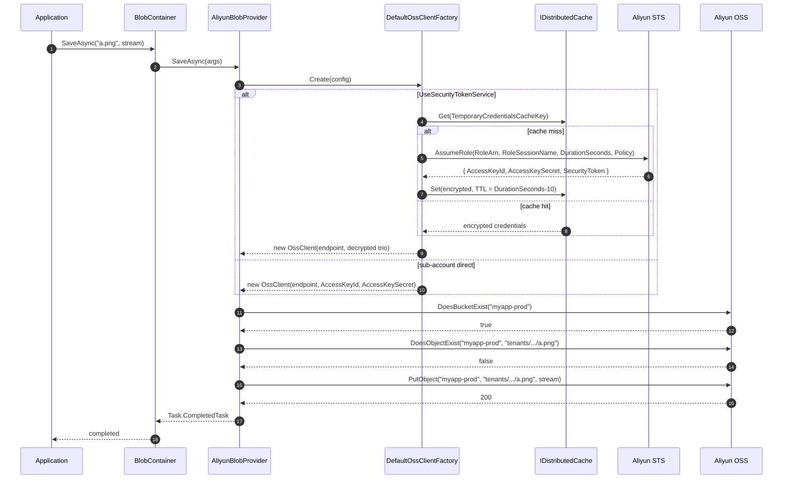

`Volo.Abp.BlobStoring.Aliyun` wraps the official Alibaba Cloud OSS SDK (`Aliyun.OSS.SDK` NuGet) behind ABP's `IBlobProvider`. It supports two credential modes — sub-account access keys, or short-lived **STS AssumeRole** credentials — and caches the AssumeRole result encrypted in `IDistributedCache`. The naming normalizer enforces OSS's stricter bucket rules: like Azure but unlike S3, OSS does not allow dots in bucket names.

The SDK itself is mostly synchronous; the provider wraps its calls in `Task.FromResult` / `Task.CompletedTask` rather than threading them. That's a deliberate trade-off — keeping the consumer surface `async` while accepting that the SDK's HTTP calls block the calling thread.

## File inventory

| File | Purpose |
| --- | --- |
| `Volo/Abp/BlobStoring/Aliyun/AbpBlobStoringAliyunModule.cs` | `[DependsOn(typeof(AbpBlobStoringModule), typeof(AbpCachingModule))]`. Empty body. |
| `Volo/Abp/BlobStoring/Aliyun/AliyunBlobProvider.cs` | `IBlobProvider` over `IOss`. |
| `Volo/Abp/BlobStoring/Aliyun/AliyunBlobProviderConfiguration.cs` | Typed config (12 properties). |
| `Volo/Abp/BlobStoring/Aliyun/AliyunBlobProviderConfigurationNames.cs` | The 12 string keys. |
| `Volo/Abp/BlobStoring/Aliyun/AliyunBlobContainerConfigurationExtensions.cs` | `UseAliyun(...)`. |
| `Volo/Abp/BlobStoring/Aliyun/AliyunBlobNamingNormalizer.cs` | OSS rules: lowercase, 3–63 chars, letters/digits/hyphens (**no dots**). |
| `Volo/Abp/BlobStoring/Aliyun/IOssClientFactory.cs` / `DefaultOssClientFactory.cs` | Routes between sub-account and STS clients. |
| `Volo/Abp/BlobStoring/Aliyun/AliyunTemporaryCredentialsCacheItem.cs` | Encrypted STS credentials. |
| `Volo/Abp/BlobStoring/Aliyun/IAliyunBlobNameCalculator.cs` / `DefaultAliyunBlobNameCalculator.cs` | `host/` vs `tenants/{id}/` prefix. |

## Module wiring

```csharp title="AbpBlobStoringAliyunModule.cs"
[DependsOn(typeof(AbpBlobStoringModule), typeof(AbpCachingModule))]
public class AbpBlobStoringAliyunModule : AbpModule
{
}
```

The caching dependency is for `IDistributedCache<AliyunTemporaryCredentialsCacheItem>` — the STS credentials are cached the same way as in [AWS](/framework/blob/blob-storing-aws#sts-caching-with-encryption-at-rest).

## Registration

```csharp title="AliyunBlobContainerConfigurationExtensions.cs"
public static BlobContainerConfiguration UseAliyun(
    this BlobContainerConfiguration containerConfiguration,
    Action<AliyunBlobProviderConfiguration> aliyunConfigureAction)
{
    containerConfiguration.ProviderType = typeof(AliyunBlobProvider);
    containerConfiguration.NamingNormalizers.TryAdd<AliyunBlobNamingNormalizer>();
    aliyunConfigureAction(new AliyunBlobProviderConfiguration(containerConfiguration));
    return containerConfiguration;
}
```

## Options

```csharp title="AliyunBlobProviderConfiguration.cs (excerpt)"
public class AliyunBlobProviderConfiguration
{
    public string AccessKeyId { get; set; }                   // required
    public string AccessKeySecret { get; set; }               // required
    public string Endpoint { get; set; }                      // required, e.g. https://oss-cn-hangzhou.aliyuncs.com
    public bool UseSecurityTokenService { get; set; }
    public string RegionId { get; set; }                      // for STS, e.g. "cn-hangzhou"
    public string RoleArn { get; set; }                       // acs:ram::$accountID:role/$roleName
    public string RoleSessionName { get; set; }               // operator-supplied session label
    public int DurationSeconds { get; set; }                  // 900..3600
    public string Policy { get; set; }                        // inline RAM policy or null
    public string? ContainerName { get; set; }                // bucket override
    public bool CreateContainerIfNotExists { get; set; }
    public string? TemporaryCredentialsCacheKey { get; set; } // default: per-config GUID
}
```

The keys live under the prefix `Aliyun.…`:

```csharp title="AliyunBlobProviderConfigurationNames.cs"
public class AliyunBlobProviderConfigurationNames
{
    public const string AccessKeyId = "Aliyun.AccessKeyId";
    public const string AccessKeySecret = "Aliyun.AccessKeySecret";
    public const string Endpoint = "Aliyun.Endpoint";
    public const string UseSecurityTokenService = "Aliyun.UseSecurityTokenService";
    public const string RegionId = "Aliyun.RegionId";
    public const string RoleArn = "Aliyun.RoleArn";
    public const string RoleSessionName = "Aliyun.RoleSessionName";
    public const string DurationSeconds = "Aliyun.DurationSeconds";
    public const string Policy = "Aliyun.Policy";
    public const string ContainerName = "Aliyun.ContainerName";
    public const string CreateContainerIfNotExists = "Aliyun.CreateContainerIfNotExists";
    public const string TemporaryCredentialsCacheKey = "Aliyun.TemporaryCredentialsCacheKey";
}
```

Required (getter throws if missing) vs optional fields:

| Property | Required? | Notes |
| --- | --- | --- |
| `AccessKeyId` | **Yes** | The sub-account or STS-base access key. |
| `AccessKeySecret` | **Yes** | Companion secret. |
| `Endpoint` | **Yes** | Full URL including scheme (`https://oss-cn-hangzhou.aliyuncs.com`). Unlike MinIO, you include the scheme here. |
| `RegionId` | Yes if `UseSecurityTokenService` | STS endpoint region (e.g. `cn-hangzhou`). |
| `RoleArn` | Yes if `UseSecurityTokenService` | `acs:ram::$accountID:role/$roleName`. |
| `RoleSessionName` | Yes if `UseSecurityTokenService` | Free-form identifier, surfaces in CloudTrail-equivalent logs. |
| `DurationSeconds` | No | 900–3600 (STS limit). Cached for `DurationSeconds - 10`. |
| `Policy` | No | Inline RAM policy further restricting the AssumeRole result. |
| `ContainerName` | No | Bucket override; if null, `args.ContainerName` is used. |
| `CreateContainerIfNotExists` | No | Default `false`. |
| `TemporaryCredentialsCacheKey` | No | Per-config GUID by default. |
| `UseSecurityTokenService` | No | `false` → sub-account direct; `true` → AssumeRole. |

## `AliyunBlobNamingNormalizer`

```csharp title="AliyunBlobNamingNormalizer.cs"
public virtual string NormalizeContainerName(string containerName)
{
    using (CultureHelper.Use(CultureInfo.InvariantCulture))
    {
        containerName = containerName.ToLower();
        if (containerName.Length > 63) containerName = containerName.Substring(0, 63);

        // Container names can contain only letters, numbers, and the dash (-) character.
        containerName = Regex.Replace(containerName, "[^a-z0-9-]", string.Empty);

        // Collapse consecutive dashes; strip leading/trailing dash.
        containerName = Regex.Replace(containerName, "-{2,}", "-");
        containerName = Regex.Replace(containerName, "^-", string.Empty);
        containerName = Regex.Replace(containerName, "-$", string.Empty);

        if (containerName.Length < 3)
        {
            var length = containerName.Length;
            for (var i = 0; i < 3 - length; i++) containerName += "0";
        }
        return containerName;
    }
}

public virtual string NormalizeBlobName(string blobName) => blobName;
```

The notable difference from [AWS](/framework/blob/blob-storing-aws#awsblobnamingnormalizer) is **dots are stripped**, not preserved. OSS bucket names must match `[a-z0-9-]{3,63}` and start/end with an alphanumeric. So `my.app-prod` becomes `myapp-prod`.

OSS object keys can contain any UTF-8 byte sequence up to 1023 chars, so the blob-name normalizer is a no-op.

## Name calculation

```csharp title="DefaultAliyunBlobNameCalculator.cs"
public virtual string Calculate(BlobProviderArgs args)
{
    return CurrentTenant.Id == null
        ? $"host/{args.BlobName}"
        : $"tenants/{CurrentTenant.Id.Value:D}/{args.BlobName}";
}
```

`{CurrentTenant.Id.Value:D}` — the interpolation-format version of `.ToString("D")`. Same `xxxxxxxx-xxxx-xxxx-xxxx-xxxxxxxxxxxx` layout as Azure / AWS / MinIO.

## Credential factory

```csharp title="DefaultOssClientFactory.cs"
public virtual IOss Create(AliyunBlobProviderConfiguration configuration)
{
    Check.NotNullOrWhiteSpace(configuration.AccessKeyId, nameof(configuration.AccessKeyId));
    Check.NotNullOrWhiteSpace(configuration.AccessKeySecret, nameof(configuration.AccessKeySecret));
    Check.NotNullOrWhiteSpace(configuration.Endpoint, nameof(configuration.Endpoint));

    if (configuration.UseSecurityTokenService)
    {
        return GetSecurityTokenClient(configuration);
    }
    return new OssClient(configuration.Endpoint, configuration.AccessKeyId, configuration.AccessKeySecret);
}
```

Two modes:

- **Sub-account direct** (`UseSecurityTokenService = false`, the default): an `OssClient` constructed with the configured access key. Permissions come from whatever RAM policies the sub-account holds.
- **STS AssumeRole** (`UseSecurityTokenService = true`): the factory calls `AssumeRoleAsync`, caches the resulting credentials, and returns an `OssClient` constructed with the temporary trio (AccessKeyId, AccessKeySecret, SecurityToken).

### AssumeRole + cache

```csharp title="DefaultOssClientFactory.cs (excerpt)"
protected virtual IOss GetSecurityTokenClient(AliyunBlobProviderConfiguration configuration)
{
    Check.NotNullOrWhiteSpace(configuration.RoleArn, nameof(configuration.RoleArn));
    Check.NotNullOrWhiteSpace(configuration.RoleSessionName, nameof(configuration.RoleSessionName));

    var cacheItem = Cache.Get(configuration.TemporaryCredentialsCacheKey!);
    if (cacheItem == null)
    {
        IClientProfile profile = DefaultProfile.GetProfile(
            configuration.RegionId, configuration.AccessKeyId, configuration.AccessKeySecret);
        var client = new DefaultAcsClient(profile);
        var request = new AssumeRoleRequest
        {
            AcceptFormat = FormatType.JSON,
            RoleArn = configuration.RoleArn,
            RoleSessionName = configuration.RoleSessionName,
            DurationSeconds = configuration.DurationSeconds,
            Policy = configuration.Policy.IsNullOrEmpty() ? null : configuration.Policy,
        };
        var response = client.GetAcsResponse(request);
        cacheItem = SetTemporaryCredentialsCache(configuration, response.Credentials);
    }
    return new OssClient(
        configuration.Endpoint,
        StringEncryptionService.Decrypt(cacheItem.AccessKeyId),
        StringEncryptionService.Decrypt(cacheItem.AccessKeySecret),
        StringEncryptionService.Decrypt(cacheItem.SecurityToken));
}
```

Notice the `Cache.Get` / `Cache.Set` calls are **synchronous** — they call `IDistributedCache`'s sync API. That's because the AssumeRole SDK call (`client.GetAcsResponse`) is itself synchronous, so making the cache async wouldn't unblock anything.

```csharp title="DefaultOssClientFactory.cs"
private AliyunTemporaryCredentialsCacheItem SetTemporaryCredentialsCache(
    AliyunBlobProviderConfiguration configuration,
    AssumeRole_Credentials credentials)
{
    var temporaryCredentialsCache = new AliyunTemporaryCredentialsCacheItem(
        StringEncryptionService.Encrypt(credentials.AccessKeyId)!,
        StringEncryptionService.Encrypt(credentials.AccessKeySecret)!,
        StringEncryptionService.Encrypt(credentials.SecurityToken)!);

    Cache.Set(configuration.TemporaryCredentialsCacheKey!, temporaryCredentialsCache,
        new DistributedCacheEntryOptions
        {
            AbsoluteExpirationRelativeToNow = TimeSpan.FromSeconds(configuration.DurationSeconds - 10)
        });

    return temporaryCredentialsCache;
}
```

Same shape as AWS: encrypt at rest with `IStringEncryptionService`, TTL = `DurationSeconds - 10`, returns the cache item (re-cast through decrypt on next use).

```csharp title="AliyunTemporaryCredentialsCacheItem.cs"
[Serializable]
public class AliyunTemporaryCredentialsCacheItem
{
    public string AccessKeyId { get; set; } = default!;
    public string AccessKeySecret { get; set; } = default!;
    public string SecurityToken { get; set; } = default!;

    public AliyunTemporaryCredentialsCacheItem() { }
    public AliyunTemporaryCredentialsCacheItem(string accessKeyId, string accessKeySecret, string securityToken)
    {
        AccessKeyId = accessKeyId;
        AccessKeySecret = accessKeySecret;
        SecurityToken = securityToken;
    }
}
```

## The provider

```csharp title="AliyunBlobProvider.cs"
public class AliyunBlobProvider : BlobProviderBase, ITransientDependency
{
    protected IOssClientFactory OssClientFactory { get; }
    protected IAliyunBlobNameCalculator AliyunBlobNameCalculator { get; }
    protected IBlobNormalizeNamingService BlobNormalizeNamingService { get; }

    public override Task SaveAsync(BlobProviderSaveArgs args)
    {
        var containerName = GetContainerName(args);
        var blobName = AliyunBlobNameCalculator.Calculate(args);
        var aliyunConfig = args.Configuration.GetAliyunConfiguration();
        var ossClient = GetOssClient(aliyunConfig);

        if (!args.OverrideExisting && BlobExists(ossClient, containerName, blobName))
        {
            throw new BlobAlreadyExistsException(
                $"Saving BLOB '{args.BlobName}' does already exists in the container '{containerName}'! " +
                $"Set {nameof(args.OverrideExisting)} if it should be overwritten.");
        }
        if (aliyunConfig.CreateContainerIfNotExists)
        {
            if (!ossClient.DoesBucketExist(containerName))
            {
                ossClient.CreateBucket(containerName);
            }
        }
        ossClient.PutObject(containerName, blobName, args.BlobStream);
        return Task.CompletedTask;
    }

    public override Task<bool> ExistsAsync(BlobProviderExistsArgs args)
    {
        var containerName = GetContainerName(args);
        var blobName = AliyunBlobNameCalculator.Calculate(args);
        var ossClient = GetOssClient(args.Configuration);
        return Task.FromResult(BlobExists(ossClient, containerName, blobName));
    }

    public override async Task<Stream?> GetOrNullAsync(BlobProviderGetArgs args)
    {
        var containerName = GetContainerName(args);
        var blobName = AliyunBlobNameCalculator.Calculate(args);
        var ossClient = GetOssClient(args.Configuration);
        if (!BlobExists(ossClient, containerName, blobName)) return null;

        var result = ossClient.GetObject(containerName, blobName);
        return await TryCopyToMemoryStreamAsync(result.Content, args.CancellationToken);
    }

    protected virtual bool BlobExists(IOss ossClient, string containerName, string blobName)
    {
        return ossClient.DoesBucketExist(containerName) &&
               ossClient.DoesObjectExist(containerName, blobName);
    }
}
```

Three behaviours to call out:

- **`PutObject`, `GetObject`, `DoesBucketExist`, `DoesObjectExist` are all synchronous.** They block the calling thread on the network. Wrapping with `Task.CompletedTask` / `Task.FromResult` keeps the abstraction shape but does *not* free the thread. For high-throughput services on Aliyun OSS, plan capacity assuming a thread per concurrent BLOB op.
- **`PutObject` always overwrites on the wire** — same OSS behaviour as Azure's `UploadAsync(stream, overwrite: true)`. The provider's `OverrideExisting` check is a TOCTOU race.
- **`GetObject(...).Content` is a network-backed stream** that the SDK holds open through the request lifetime. `TryCopyToMemoryStreamAsync` (inherited from `BlobProviderBase`) buffers it into a `MemoryStream` so the caller can outlive the request.

## Multi-tenant and bucket strategy

```csharp title="AliyunBlobProvider.cs"
protected virtual string GetContainerName(BlobProviderArgs args)
{
    var configuration = args.Configuration.GetAliyunConfiguration();
    return configuration.ContainerName.IsNullOrWhiteSpace()
        ? args.ContainerName
        : BlobNormalizeNamingService.NormalizeContainerName(args.Configuration, configuration.ContainerName!);
}
```

Same pattern as every other cloud provider — set `ContainerName` for a shared bucket with per-tenant prefixes, leave it null for per-ABP-container buckets.

OSS billing is **per bucket** plus per-request; a small number of large buckets is operationally cheaper than thousands of small ones. The recommendation is one OSS bucket per environment with `ContainerName` set, and rely on the `host/` / `tenants/{id}/` prefix for isolation.

## Sequence: save with STS



## Full example

```csharp title="MyModule.cs (sub-account)"
[DependsOn(typeof(AbpBlobStoringAliyunModule))]
public class MyModule : AbpModule
{
    public override void ConfigureServices(ServiceConfigurationContext context)
    {
        var cfg = context.Services.GetConfiguration();

        Configure<AbpBlobStoringOptions>(options =>
        {
            options.Containers.ConfigureDefault(container =>
            {
                container.UseAliyun(aliyun =>
                {
                    aliyun.AccessKeyId = cfg["Aliyun:AccessKeyId"]!;
                    aliyun.AccessKeySecret = cfg["Aliyun:AccessKeySecret"]!;
                    aliyun.Endpoint = "https://oss-cn-hangzhou.aliyuncs.com";
                    aliyun.ContainerName = "myapp-prod";
                    aliyun.CreateContainerIfNotExists = false;
                });
            });
        });
    }
}
```

```csharp title="MyModule.cs (STS AssumeRole)"
options.Containers.Configure<TenantUploadsContainer>(container =>
{
    container.UseAliyun(aliyun =>
    {
        aliyun.AccessKeyId = cfg["Aliyun:Base:KeyId"]!;
        aliyun.AccessKeySecret = cfg["Aliyun:Base:KeySecret"]!;
        aliyun.Endpoint = "https://oss-cn-hangzhou.aliyuncs.com";

        aliyun.UseSecurityTokenService = true;
        aliyun.RegionId = "cn-hangzhou";
        aliyun.RoleArn = "acs:ram::1234567890:role/myapp-blob-writer";
        aliyun.RoleSessionName = $"myapp-{Environment.MachineName}";
        aliyun.DurationSeconds = 3600;
        aliyun.Policy = """
            {
              "Version": "1",
              "Statement": [{
                "Effect": "Allow",
                "Action": ["oss:PutObject","oss:GetObject"],
                "Resource": ["acs:oss:*:*:myapp-prod/tenants/*"]
              }]
            }
            """;

        aliyun.ContainerName = "myapp-prod";
        aliyun.CreateContainerIfNotExists = false;
    });
});
```

## Gotchas

- **The SDK is synchronous.** `PutObject`/`GetObject`/`DoesBucketExist`/`DoesObjectExist` block the calling thread. ABP wraps the return with `Task.FromResult` / `Task.CompletedTask` but does not put the call on a background thread. Under load, configure your `ThreadPool` accordingly or override the provider to wrap calls in `Task.Run`.
- **`Endpoint` includes the scheme.** Unlike [MinIO](/framework/blob/blob-storing-minio), which expects `host:port` without a scheme, the OSS SDK expects a full URL (`https://oss-cn-hangzhou.aliyuncs.com`). The string is passed verbatim into `new OssClient(endpoint, …)`.
- **`DurationSeconds` capped at 3600 by Aliyun.** Pass anything larger and AssumeRole returns an error code; the cache is not populated, and every subsequent save makes another (failing) STS call. Validate `DurationSeconds <= 3600` at startup.
- **`Policy` is OSS-flavoured RAM JSON**, not AWS IAM JSON. The schema differs (e.g. `"Action": "oss:PutObject"` rather than `"s3:PutObject"`). Don't reuse AWS policies verbatim.
- **`IStringEncryptionService` must be configured for STS.** A missing pass phrase causes encrypt/decrypt to fail; in the worst case you'll silently store unencryptable cache rows and call STS on every request.
- **Per-instance cache key.** Each `AliyunBlobProviderConfiguration` instance has a GUID `_temporaryCredentialsCacheKey` in its constructor; restart the process and you lose the cached AssumeRole result. Pin `TemporaryCredentialsCacheKey` to a stable value if you need cross-instance sharing.
- **`AliyunBlobNamingNormalizer` strips dots.** Unlike S3/MinIO, dots are removed entirely — so `my.app.prod` becomes `myappprod`. Pre-validate your bucket names.
- **`DoesBucketExist` and `DoesObjectExist` make two HTTP calls per save's existence check.** The pre-save existence test costs at least two round-trips even when the object doesn't exist. For high-volume upload paths consider overriding `BlobExists` to skip the bucket check after the first save in the process.
- **No cancellation token forwarding to the SDK.** The blocking calls don't honour `args.CancellationToken`. Wrap with `Task.Run` and pass the token to the wrapping `Task` if you need cooperative cancellation.

## See also

- [Volo.Abp.BlobStoring](/framework/blob/blob-storing) — the consumer pipeline.
- [Volo.Abp.BlobStoring.Aws](/framework/blob/blob-storing-aws) — same STS-cache pattern, async SDK.
- [Volo.Abp.BlobStoring.Minio](/framework/blob/blob-storing-minio) — S3-compatible alternative when you don't need Aliyun OSS specifically.
