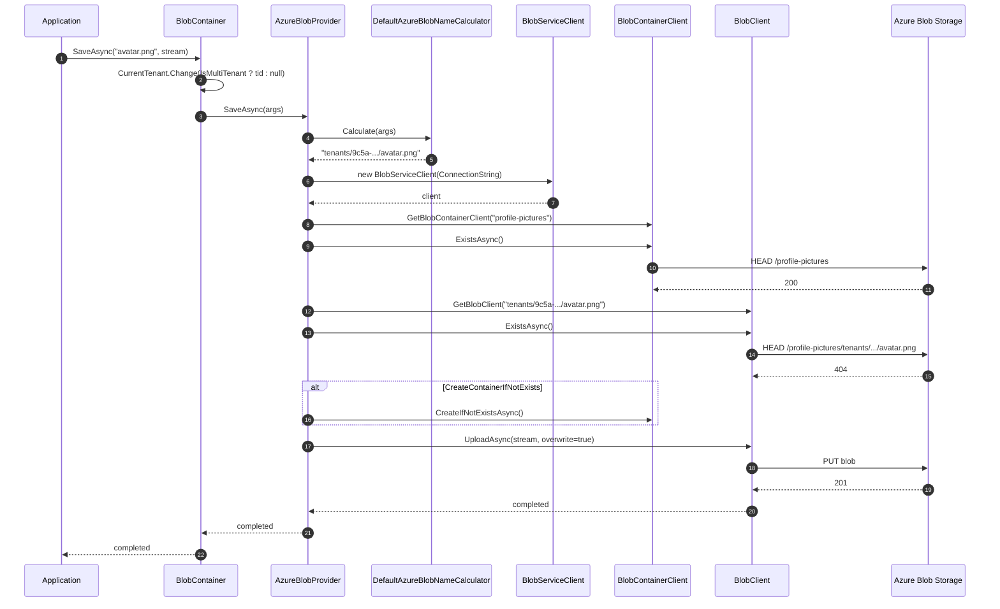

`Volo.Abp.BlobStoring.Azure` wraps the official `Azure.Storage.Blobs` SDK behind ABP's `IBlobProvider` contract. It supports a single connection string per container, an optional override of the Azure container name, an opt-in "create if not exists" flag, and automatic per-tenant key prefixing.

It is the right choice for Azure-hosted apps; the SDK handles retries, transient-fault back-off, and TLS for you, and ABP layers on top a multi-tenant key calculator and a strict naming normalizer that keeps you on Azure's narrow 3–63-character lowercase rules.

## File inventory

| File | Purpose |
| --- | --- |
| `Volo/Abp/BlobStoring/Azure/AbpBlobStoringAzureModule.cs` | `[DependsOn(typeof(AbpBlobStoringModule))]`. Empty body. |
| `Volo/Abp/BlobStoring/Azure/AzureBlobProvider.cs` | `IBlobProvider` over `BlobServiceClient` / `BlobContainerClient` / `BlobClient`. |
| `Volo/Abp/BlobStoring/Azure/AzureBlobProviderConfiguration.cs` | Typed config: `ConnectionString`, `ContainerName?`, `CreateContainerIfNotExists`. |
| `Volo/Abp/BlobStoring/Azure/AzureBlobProviderConfigurationNames.cs` | `"Azure.ConnectionString"`, `"Azure.ContainerName"`, `"Azure.CreateContainerIfNotExists"`. |
| `Volo/Abp/BlobStoring/Azure/AzureBlobContainerConfigurationExtensions.cs` | `UseAzure(...)`, `GetAzureConfiguration()`. |
| `Volo/Abp/BlobStoring/Azure/AzureBlobNamingNormalizer.cs` | Enforces Azure container naming rules (lowercase, 3–63 chars, no consecutive dashes). |
| `Volo/Abp/BlobStoring/Azure/IAzureBlobNameCalculator.cs` / `DefaultAzureBlobNameCalculator.cs` | Adds `host/` or `tenants/{tid}/` prefix to the blob name. |

## Module wiring

```csharp title="AbpBlobStoringAzureModule.cs"
[DependsOn(typeof(AbpBlobStoringModule))]
public class AbpBlobStoringAzureModule : AbpModule
{
}
```

Empty body — `AzureBlobProvider`, `DefaultAzureBlobNameCalculator`, and `AzureBlobNamingNormalizer` are all `ITransientDependency` and pick up by convention.

## Registration

```csharp title="AzureBlobContainerConfigurationExtensions.cs"
public static BlobContainerConfiguration UseAzure(
    this BlobContainerConfiguration containerConfiguration,
    Action<AzureBlobProviderConfiguration> azureConfigureAction)
{
    containerConfiguration.ProviderType = typeof(AzureBlobProvider);
    containerConfiguration.NamingNormalizers.TryAdd<AzureBlobNamingNormalizer>();
    azureConfigureAction(new AzureBlobProviderConfiguration(containerConfiguration));
    return containerConfiguration;
}

public static AzureBlobProviderConfiguration GetAzureConfiguration(
    this BlobContainerConfiguration containerConfiguration)
{
    return new AzureBlobProviderConfiguration(containerConfiguration);
}
```

`UseAzure(...)`:

1. Sets `ProviderType = typeof(AzureBlobProvider)` so the selector picks Azure for this container.
2. Adds `AzureBlobNamingNormalizer` to the configuration's normalizer chain.
3. Lets you set `ConnectionString`, `ContainerName`, `CreateContainerIfNotExists` through the typed wrapper.

## Options

```csharp title="AzureBlobProviderConfiguration.cs"
public class AzureBlobProviderConfiguration
{
    public string ConnectionString
    {
        get => _containerConfiguration.GetConfiguration<string>(AzureBlobProviderConfigurationNames.ConnectionString);
        set => _containerConfiguration.SetConfiguration(
            AzureBlobProviderConfigurationNames.ConnectionString,
            Check.NotNullOrWhiteSpace(value, nameof(value)));
    }

    public string? ContainerName
    {
        get => _containerConfiguration.GetConfigurationOrDefault<string>(AzureBlobProviderConfigurationNames.ContainerName);
        set => _containerConfiguration.SetConfiguration(AzureBlobProviderConfigurationNames.ContainerName, value);
    }

    public bool CreateContainerIfNotExists
    {
        get => _containerConfiguration.GetConfigurationOrDefault(
            AzureBlobProviderConfigurationNames.CreateContainerIfNotExists, false);
        set => _containerConfiguration.SetConfiguration(
            AzureBlobProviderConfigurationNames.CreateContainerIfNotExists, value);
    }
}
```

| Property | Key | Required? | Default | Notes |
| --- | --- | --- | --- | --- |
| `ConnectionString` | `Azure.ConnectionString` | **Yes** | (getter throws) | Standard Azure Storage connection string (`DefaultEndpointsProtocol=https;AccountName=...;AccountKey=...;EndpointSuffix=core.windows.net`). Also accepts SAS or `BlobEndpoint=` strings. |
| `ContainerName` | `Azure.ContainerName` | No | `null` → uses `args.ContainerName` (the ABP container name, normalized) | When set, the provider uses *this* Azure container for every blob in this ABP container. Lowercased and clamped by `AzureBlobNamingNormalizer`. |
| `CreateContainerIfNotExists` | `Azure.CreateContainerIfNotExists` | No | `false` | If `true`, every `SaveAsync` runs `BlobContainerClient.CreateIfNotExistsAsync` first. Default `false` to avoid the extra round-trip in steady state. |

## `AzureBlobNamingNormalizer`

```csharp title="AzureBlobNamingNormalizer.cs"
public virtual string NormalizeContainerName(string containerName)
{
    using (CultureHelper.Use(CultureInfo.InvariantCulture))
    {
        // All letters in a container name must be lowercase.
        containerName = containerName.ToLower();

        // Container names must be from 3 through 63 characters long.
        if (containerName.Length > 63) containerName = containerName.Substring(0, 63);

        // Container names can contain only letters, numbers, and the dash (-) character.
        containerName = Regex.Replace(containerName, "[^a-z0-9-]", string.Empty);

        // Every dash (-) character must be immediately preceded and followed by a letter or number;
        // consecutive dashes are not permitted in container names.
        // Container names must start or end with a letter or number
        containerName = Regex.Replace(containerName, "-{2,}", "-");
        containerName = Regex.Replace(containerName, "^-", string.Empty);
        containerName = Regex.Replace(containerName, "-$", string.Empty);

        // Container names must be from 3 through 63 characters long.
        if (containerName.Length < 3)
        {
            var length = containerName.Length;
            for (var i = 0; i < 3 - length; i++)
                containerName += "0";
        }
        return containerName;
    }
}

public virtual string NormalizeBlobName(string blobName) => blobName;
```

The container-name pipeline:

1. Lowercase under `InvariantCulture` (so `İ` doesn't turn into `i̇` on Turkish locales).
2. Truncate to 63 chars.
3. Strip everything but `a-z`, `0-9`, `-`.
4. Collapse `--+` to `-`; strip leading/trailing `-`.
5. Right-pad with `'0'` to a minimum length of 3.

So an ABP container name like `MyCompany.Profile.Pictures!` becomes `mycompanyprofilepictures`. Tracing the normalized name in production logs is how you confirm the Azure container is actually called what you think it's called.

`NormalizeBlobName` is a no-op — Azure allows almost any byte sequence in blob names (1024 chars, any UTF-8). The provider trusts the caller.

## Name calculation: tenant prefix

```csharp title="DefaultAzureBlobNameCalculator.cs"
public virtual string Calculate(BlobProviderArgs args)
{
    return CurrentTenant.Id == null
        ? $"host/{args.BlobName}"
        : $"tenants/{CurrentTenant.Id.Value.ToString("D")}/{args.BlobName}";
}
```

The calculator does not look at `BlobContainerConfiguration.IsMultiTenant`. The `BlobContainer` pipeline already clears `CurrentTenant.Id` for single-tenant containers (see [blob-storing](blob-storing#multi-tenant-tenant-scoping)), so a single-tenant container always lands under `host/`.

`Guid.ToString("D")` produces `xxxxxxxx-xxxx-xxxx-xxxx-xxxxxxxxxxxx`. Dashes are valid in Azure blob names.

## The provider

```csharp title="AzureBlobProvider.cs"
public class AzureBlobProvider : BlobProviderBase, ITransientDependency
{
    protected IAzureBlobNameCalculator AzureBlobNameCalculator { get; }
    protected IBlobNormalizeNamingService BlobNormalizeNamingService { get; }

    public override async Task SaveAsync(BlobProviderSaveArgs args)
    {
        var blobName = AzureBlobNameCalculator.Calculate(args);
        var configuration = args.Configuration.GetAzureConfiguration();

        if (!args.OverrideExisting && await BlobExistsAsync(args, blobName))
        {
            throw new BlobAlreadyExistsException(
                $"Saving BLOB '{args.BlobName}' does already exists in the container '{GetContainerName(args)}'! " +
                $"Set {nameof(args.OverrideExisting)} if it should be overwritten.");
        }

        if (configuration.CreateContainerIfNotExists)
        {
            await CreateContainerIfNotExists(args);
        }

        await GetBlobClient(args, blobName).UploadAsync(args.BlobStream, true);
    }

    public override async Task<bool> DeleteAsync(BlobProviderDeleteArgs args)
    {
        var blobName = AzureBlobNameCalculator.Calculate(args);
        if (await BlobExistsAsync(args, blobName))
            return await GetBlobClient(args, blobName).DeleteIfExistsAsync();
        return false;
    }

    public override async Task<bool> ExistsAsync(BlobProviderExistsArgs args)
    {
        var blobName = AzureBlobNameCalculator.Calculate(args);
        return await BlobExistsAsync(args, blobName);
    }

    public override async Task<Stream?> GetOrNullAsync(BlobProviderGetArgs args)
    {
        var blobName = AzureBlobNameCalculator.Calculate(args);
        if (!await BlobExistsAsync(args, blobName)) return null;

        var blobClient = GetBlobClient(args, blobName);
        var download = await blobClient.DownloadAsync();
        return await TryCopyToMemoryStreamAsync(download.Value.Content, args.CancellationToken);
    }
}
```

Five things worth flagging:

- **`UploadAsync(stream, overwrite: true)` always overwrites.** The check for `OverrideExisting` is done before via `BlobExistsAsync`. If two threads upload the same blob simultaneously with `OverrideExisting = false`, both pass the existence check, both succeed at `UploadAsync`, and one silently wins — there's no `If-None-Match` header.
- **`BlobExistsAsync` makes two HTTP calls.** It first checks the *container* exists, then the *blob*. The container check is necessary because Azure's SDK returns 404 from `BlobClient.ExistsAsync` if either is missing; explicitly checking the container lets the provider return clean `false` from `Get/Delete/Exists` when the container is missing.
- **`DownloadAsync` returns a streaming response.** `download.Value.Content` is a network-backed stream that closes when the request completes. `TryCopyToMemoryStreamAsync` (inherited from `BlobProviderBase`) copies it into an in-memory buffer before returning, because the caller may hold the stream past the original request's lifetime.
- **New `BlobServiceClient` per call.** `GetBlobContainerClient` constructs a fresh `BlobServiceClient(configuration.ConnectionString)` on every call. The Azure SDK pools `HttpClient` internals across instances, so this isn't as expensive as it looks, but it does mean a custom `BlobClientOptions` (retry policies, network timeout) cannot be plugged in without subclassing.
- **`DeleteIfExistsAsync` after a positive `BlobExistsAsync`.** If a race deletes the blob between the two calls, `DeleteIfExistsAsync` returns `false` and the provider's `DeleteAsync` propagates `false` — semantically the same outcome.

## Multi-tenant and container-name strategy

The shared `BlobContainerConfiguration.IsMultiTenant` is set in your application module:

- `IsMultiTenant = true` (default): the `BlobContainer` pipeline preserves the current tenant, so `DefaultAzureBlobNameCalculator` emits `tenants/{id}/blob`.
- `IsMultiTenant = false`: the pipeline clears `CurrentTenant.Id`, so blobs land under `host/blob` regardless of the calling tenant.

The actual **Azure container** can be:

- **Per-ABP-container** (`ContainerName == null`): each ABP container resolves to a separate Azure container named after itself (after normalization). Clean isolation but you pay 1 Azure container per logical container.
- **Single shared Azure container** (`ContainerName == "my-shared-bucket"`): every ABP container maps to the same Azure container, distinguished only by the blob-key prefix. Useful when you want to manage permissions and lifecycle policies once.

```csharp title="GetContainerName"
protected virtual string GetContainerName(BlobProviderArgs args)
{
    var configuration = args.Configuration.GetAzureConfiguration();
    return configuration.ContainerName.IsNullOrWhiteSpace()
        ? args.ContainerName
        : BlobNormalizeNamingService.NormalizeContainerName(args.Configuration, configuration.ContainerName!);
}
```

When `ContainerName` is set, the provider runs it through the full `BlobNormalizeNamingService` chain — so `MyCompany.Shared` becomes `mycompanyshared`. The fallback to `args.ContainerName` works the same way; the ABP pipeline normalized that value already in `BlobContainer.SaveAsync`.

If two of your ABP containers point to the same Azure container with the same `ContainerName`, blobs collide unless their keys differ. Typed containers normally avoid that because their default name comes from the marker class's `FullName`.

## Sequence: save



## Full example

```csharp title="MyModule.cs"
[DependsOn(typeof(AbpBlobStoringAzureModule))]
public class MyModule : AbpModule
{
    public override void ConfigureServices(ServiceConfigurationContext context)
    {
        var configuration = context.Services.GetConfiguration();

        Configure<AbpBlobStoringOptions>(options =>
        {
            options.Containers.ConfigureDefault(container =>
            {
                container.UseAzure(azure =>
                {
                    azure.ConnectionString = configuration["Azure:Blobs:ConnectionString"]!;
                    azure.ContainerName = "shared";
                    azure.CreateContainerIfNotExists = true;
                });
            });

            options.Containers.Configure<ProfilePictureContainer>(container =>
            {
                container.IsMultiTenant = true;
                container.UseAzure(azure =>
                {
                    azure.ConnectionString = configuration["Azure:Blobs:ConnectionString"]!;
                    // Leave ContainerName null → per-ABP container becomes its own Azure container.
                    azure.CreateContainerIfNotExists = true;
                });
            });
        });
    }
}

[BlobContainerName("profile-pictures")]
public class ProfilePictureContainer { }
```

## Gotchas

- **No `BlobClientOptions` injection.** Custom retry policies, geo-redundant secondary URIs, and HTTP pipeline policies need a subclass that overrides `GetBlobContainerClient`. The defaults are the Azure SDK's defaults (3 retries, exponential back-off).
- **`UploadAsync(stream, overwrite: true)` always overwrites in the steady-state path.** The `OverrideExisting` check is a TOCTOU race; for strict no-clobber semantics, sync writers on a distributed lock (e.g. via `Volo.Abp.DistributedLocking`).
- **`BlobServiceClient` is created on every call.** The Azure SDK is designed for client reuse; in high-throughput scenarios you'll want a singleton. Override `GetBlobContainerClient` to cache on `IMemoryCache` keyed by the connection-string SHA.
- **`download.Value.Content` is fully copied into `MemoryStream`.** A 2 GB blob doubles your memory. For large downloads bypass the abstraction or override `GetOrNullAsync` to return the raw network stream.
- **`AzureBlobNamingNormalizer` is destructive.** A container named `My-Container!` becomes `my-container`; `Müller` becomes `mller`. Always log the normalized name when troubleshooting "blob not found" reports.
- **The "right-pad with '0'" rule.** Container names shorter than three characters after stripping get `'0'` appended until they're three characters. So `MyApp/V2` → `myappv2` (8 chars, fine), but `X!Y` → `xy0`. Pick container names that survive normalization to avoid surprises.
- **`CreateContainerIfNotExists` costs one extra round-trip per save.** Once your containers exist, switch it to `false` to remove the call (the implicit `BlobExistsAsync` round-trip still runs the container existence check).
- **`UseAzure` requires a connection string at registration time**, not at first use. If your connection string comes from Key Vault or another async-only source, fetch it before `Configure<AbpBlobStoringOptions>` runs (e.g. in `OnApplicationInitialization`-time `Reconfigure`, or seed it into `IConfiguration` first).
- **No SAS-token-only API.** The provider hard-codes connection-string-style construction. SAS works because Azure connection strings accept `BlobEndpoint=https://...;SharedAccessSignature=...` syntax, but if you only have a raw SAS URL you'll need to build the connection string manually.

## See also

- [Volo.Abp.BlobStoring](blob-storing) — the consumer pipeline that calls into this provider.
- [Volo.Abp.BlobStoring.Aws](blob-storing-aws) — closest analogue for S3.
- [Volo.Abp.BlobStoring.FileSystem](blob-storing-filesystem) — for local development; you typically configure both and switch by environment.
