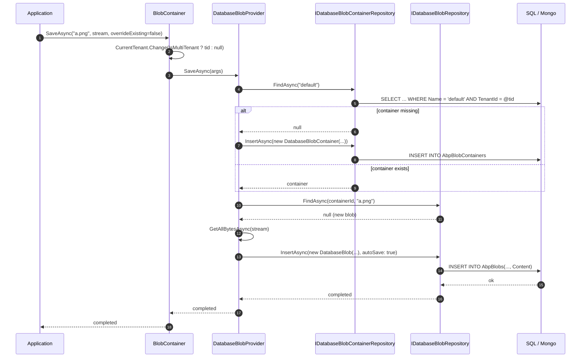

There is **no framework-level** `Volo.Abp.BlobStoring.Database` package. The database-backed `IBlobProvider` ships in the application module `Volo.Abp.BlobStoring.Database.Domain`, registered through the [Blob Storing Database module](/modules/blob-storing-database/overview).

That separation is deliberate: the cloud providers ([Azure](/framework/blob/blob-storing-azure), [AWS](/framework/blob/blob-storing-aws), [MinIO](/framework/blob/blob-storing-minio), [Aliyun](/framework/blob/blob-storing-aliyun), [FileSystem](/framework/blob/blob-storing-filesystem)) are pure infrastructure adapters with no EF / MongoDB / repository surface. The database provider, by contrast, owns two aggregate roots, repositories per ORM, and migration scripts. It belongs alongside the other DDD modules, not in the framework core.

From the **consumer** point of view — your application calling `IBlobContainer.SaveAsync` — the experience is identical to the other providers. This page documents the consumer surface: how to plug `DatabaseBlobProvider` into your container configuration, what tables hold the data, and which gotchas are unique to row-backed BLOBs.

## Source files

The implementation lives under `modules/blob-storing-database/src/`:

| File | Purpose |
| --- | --- |
| `Volo.Abp.BlobStoring.Database.Domain/Volo/Abp/BlobStoring/Database/DatabaseBlobProvider.cs` | The `IBlobProvider`. Reads/writes through two repositories. |
| `Volo.Abp.BlobStoring.Database.Domain/Volo/Abp/BlobStoring/Database/DatabaseBlobContainerConfigurationExtensions.cs` | The `UseDatabase()` extension on `BlobContainerConfiguration`. |
| `Volo.Abp.BlobStoring.Database.Domain/Volo/Abp/BlobStoring/Database/DatabaseBlob.cs` | Aggregate root with `Guid Id`, `Guid ContainerId`, `Guid? TenantId`, `string Name`, `byte[] Content`. |
| `Volo.Abp.BlobStoring.Database.Domain/Volo/Abp/BlobStoring/Database/DatabaseBlobContainer.cs` | Aggregate root with `Guid Id`, `Guid? TenantId`, `string Name`. |
| `Volo.Abp.BlobStoring.Database.Domain/Volo/Abp/BlobStoring/Database/IDatabaseBlobRepository.cs` / `IDatabaseBlobContainerRepository.cs` | Read/write APIs over the aggregates. |
| `Volo.Abp.BlobStoring.Database.Domain.Shared/Volo/Abp/BlobStoring/Database/DatabaseBlobConsts.cs` / `DatabaseContainerConsts.cs` | `MaxNameLength`, `MaxContentLength`. |
| `Volo.Abp.BlobStoring.Database.EntityFrameworkCore/...` | EF Core repository + DbContext extensions. |
| `Volo.Abp.BlobStoring.Database.MongoDB/...` | MongoDB equivalents. |

## Registration

Adding `Volo.Abp.BlobStoring.Database.Domain` plus the ORM-specific module (`Volo.Abp.BlobStoring.Database.EntityFrameworkCore` or `Volo.Abp.BlobStoring.Database.MongoDB`) is enough to register the provider. After that, opt in per container:

```csharp title="DatabaseBlobContainerConfigurationExtensions.cs"
public static class DatabaseBlobContainerConfigurationExtensions
{
    public static BlobContainerConfiguration UseDatabase(
        this BlobContainerConfiguration containerConfiguration)
    {
        containerConfiguration.ProviderType = typeof(DatabaseBlobProvider);
        return containerConfiguration;
    }
}
```

Two things to notice:

- **No options at all.** The registration takes no lambda. Connection strings, table names, and indexes are owned by your EF Core or MongoDB module configuration, not by the container.
- **No `NamingNormalizer`.** Unlike the cloud providers, this one does not add an `IBlobNamingNormalizer`. The container and blob names go into the database as-is, only clamped to `MaxNameLength`.

```csharp title="MyModule.cs"
[DependsOn(
    typeof(AbpBlobStoringDatabaseDomainModule),
    typeof(BlobStoringDatabaseEntityFrameworkCoreModule)
)]
public class MyModule : AbpModule
{
    public override void ConfigureServices(ServiceConfigurationContext context)
    {
        Configure<AbpBlobStoringOptions>(options =>
        {
            options.Containers.ConfigureDefault(container =>
            {
                container.UseDatabase();
            });
        });

        // Register the DbContext / repositories in your EF Core setup
        context.Services.AddAbpDbContext<MyDbContext>(opts =>
        {
            opts.AddDefaultRepositories();
            opts.AddBlobStoring(); // wires the BlobStoringDbContext mixin
        });
    }
}
```

## Default container

The provider has no opinion about the container name; it simply uses `args.ContainerName` verbatim and stores it in the `Name` column of `AbpBlobContainers`. There is no "default container" the way Azure and S3 sometimes have a fixed bucket. Every named container you pass through `IBlobContainer` or `IBlobContainer<TContainer>` becomes a row in the containers table the first time it's used.

The standard `DefaultContainer` sentinel from the [core](/framework/blob/blob-storing#the-two-iblobcontainer-shapes) module still applies: injecting raw `IBlobContainer` resolves the configuration named `"default"`. With the database provider, that name is just a string in the database.

## The two aggregates

```csharp title="DatabaseBlob.cs"
public class DatabaseBlob : AggregateRoot<Guid>, IMultiTenant
{
    public virtual Guid ContainerId { get; protected set; }
    public virtual Guid? TenantId { get; protected set; }
    public virtual string Name { get; protected set; }
    [DisableAuditing]
    public virtual byte[] Content { get; protected set; }

    public DatabaseBlob(Guid id, Guid containerId, string name, byte[] content, Guid? tenantId = null)
        : base(id)
    {
        Name = Check.NotNullOrWhiteSpace(name, nameof(name), DatabaseBlobConsts.MaxNameLength);
        ContainerId = containerId;
        Content = CheckContentLength(content);
        TenantId = tenantId;
    }

    public virtual void SetContent(byte[] content) => Content = CheckContentLength(content);

    protected virtual byte[] CheckContentLength(byte[] content)
    {
        Check.NotNull(content, nameof(content));
        if (content.Length >= DatabaseBlobConsts.MaxContentLength)
        {
            throw new AbpException(
                $"Blob content size cannot be more than {DatabaseBlobConsts.MaxContentLength} Bytes.");
        }
        return content;
    }
}
```

```csharp title="DatabaseBlobContainer.cs"
public class DatabaseBlobContainer : AggregateRoot<Guid>, IMultiTenant
{
    public virtual Guid? TenantId { get; protected set; }
    public virtual string Name { get; protected set; }

    public DatabaseBlobContainer(Guid id, string name, Guid? tenantId = null) : base(id)
    {
        Name = Check.NotNullOrWhiteSpace(name, nameof(name), DatabaseContainerConsts.MaxNameLength);
        TenantId = tenantId;
    }
}
```

So the database layout is just two tables (EF Core names them `AbpBlobContainers` and `AbpBlobs`):

| Table | Columns |
| --- | --- |
| `AbpBlobContainers` | `Id (Guid PK)`, `TenantId (Guid?)`, `Name (nvarchar)` plus the audit columns. |
| `AbpBlobs` | `Id (Guid PK)`, `ContainerId (Guid FK)`, `TenantId (Guid?)`, `Name (nvarchar)`, `Content (varbinary(MAX))` plus audit columns. |

`[DisableAuditing]` on `Content` keeps the byte payload out of audit log entries — without it every save would copy the entire BLOB into the audit JSON.

## The provider

```csharp title="DatabaseBlobProvider.cs"
public class DatabaseBlobProvider : BlobProviderBase, ITransientDependency
{
    protected IDatabaseBlobRepository DatabaseBlobRepository { get; }
    protected IDatabaseBlobContainerRepository DatabaseBlobContainerRepository { get; }
    protected IGuidGenerator GuidGenerator { get; }
    protected ICurrentTenant CurrentTenant { get; }

    public override async Task SaveAsync(BlobProviderSaveArgs args)
    {
        var container = await GetOrCreateContainerAsync(args.ContainerName, args.CancellationToken);

        var blob = await DatabaseBlobRepository.FindAsync(
            container.Id, args.BlobName, args.CancellationToken);

        var content = await args.BlobStream.GetAllBytesAsync(args.CancellationToken);

        if (blob != null)
        {
            if (!args.OverrideExisting)
            {
                throw new BlobAlreadyExistsException(
                    $"Saving BLOB '{args.BlobName}' does already exists in the container '{args.ContainerName}'! " +
                    $"Set {nameof(args.OverrideExisting)} if it should be overwritten.");
            }

            blob.SetContent(content);
            await DatabaseBlobRepository.UpdateAsync(blob, autoSave: true);
        }
        else
        {
            blob = new DatabaseBlob(GuidGenerator.Create(), container.Id, args.BlobName, content, CurrentTenant.Id);
            await DatabaseBlobRepository.InsertAsync(blob, autoSave: true);
        }
    }

    public override async Task<bool> DeleteAsync(BlobProviderDeleteArgs args)
    {
        var container = await DatabaseBlobContainerRepository.FindAsync(
            args.ContainerName, args.CancellationToken);
        if (container == null) return false;

        return await DatabaseBlobRepository.DeleteAsync(
            container.Id, args.BlobName, autoSave: true, cancellationToken: args.CancellationToken);
    }

    public override async Task<Stream> GetOrNullAsync(BlobProviderGetArgs args)
    {
        var container = await DatabaseBlobContainerRepository.FindAsync(
            args.ContainerName, args.CancellationToken);
        if (container == null) return null;

        var blob = await DatabaseBlobRepository.FindAsync(
            container.Id, args.BlobName, args.CancellationToken);
        if (blob == null) return null;

        return new MemoryStream(blob.Content);
    }

    protected virtual async Task<DatabaseBlobContainer> GetOrCreateContainerAsync(
        string name, CancellationToken cancellationToken = default)
    {
        var container = await DatabaseBlobContainerRepository.FindAsync(name, cancellationToken);
        if (container != null) return container;

        container = new DatabaseBlobContainer(GuidGenerator.Create(), name, CurrentTenant.Id);
        await DatabaseBlobContainerRepository.InsertAsync(container, cancellationToken: cancellationToken);
        return container;
    }
}
```

Five behaviours worth flagging:

- **Container is auto-created on first save.** No `CreateContainerIfNotExists` flag exists; the provider always upserts. There's a race window between `FindAsync` and `InsertAsync` — concurrent first-time saves to the same container can produce a unique-constraint violation. The seeder modules avoid this by pre-creating the container row.
- **`GetAllBytesAsync` on save.** The provider materializes the entire stream into a `byte[]` before inserting. Saving a 2 GiB upload pulls 2 GiB into managed memory and then into a parameterized SQL insert. The `CheckContentLength` guard (`< MaxContentLength`) is enforced **after** allocation.
- **`MemoryStream(blob.Content)` on get.** Loads the entire row content into the heap. There is no chunked / lazy stream; downloading a 100 MiB blob always allocates 100 MiB at the application level *and* sends the entire `varbinary(MAX)` over the wire from SQL.
- **`autoSave: true` on every write.** The provider does not enroll in your ambient unit of work; saving a blob and saving an entity in the same operation execute as separate commits unless you wrap them in an explicit UoW.
- **`SetContent` validates length again on update.** Good; an overwrite that's larger than `MaxContentLength` throws cleanly.

## Multi-tenancy

The provider has two layers of tenant filtering:

1. The aggregates implement `IMultiTenant`, so the standard ABP data filter scopes every `FindAsync` to `CurrentTenant.Id` automatically. The `BlobContainer` pipeline has already coerced the tenant (clearing it for `IsMultiTenant = false` containers) by the time the provider runs.
2. Both `DatabaseBlob.TenantId` and `DatabaseBlobContainer.TenantId` are written from `CurrentTenant.Id` at insert time. So a tenant's containers and blobs never collide with another tenant's, even with the same `Name`.

There is no `tenants/<id>/<blob>` naming trick like in the cloud providers — the tenant id lives in a separate column, and uniqueness is over `(TenantId, ContainerId, Name)`. Containers, similarly, are unique over `(TenantId, Name)`.

## Sequence: save



## Constants

```csharp title="DatabaseBlobConsts.cs (excerpt)"
public class DatabaseBlobConsts
{
    public const int MaxNameLength = 1024;
    public const long MaxContentLength = long.MaxValue; // overridable via DomainShared
}

public class DatabaseContainerConsts
{
    public const int MaxNameLength = 64;
}
```

`MaxContentLength` is intentionally permissive at the model level; back-end constraints (SQL Server's 2 GB `varbinary(MAX)`, PostgreSQL's 1 GB `bytea`, MongoDB's 16 MB document limit) take over from there. For SQL Server you can use FILESTREAM or FILETABLE to back the `Content` column, but the module ships the conventional `varbinary(MAX)` mapping.

## Gotchas

- **Every save loads the whole blob into managed memory.** This provider is great for small attachments (kilobytes to single-digit megabytes) and a poor choice for video or large datasets. Use [Azure](/framework/blob/blob-storing-azure), [AWS](/framework/blob/blob-storing-aws), [MinIO](/framework/blob/blob-storing-minio), or [Aliyun](/framework/blob/blob-storing-aliyun) for large objects.
- **No chunked retrieval.** `GetOrNullAsync` returns a `MemoryStream` over `blob.Content` — no `OpenRead`-style streaming, no range request support. Even a `Take(0..1024)` reads the entire row.
- **`autoSave: true` defeats unit-of-work batching.** If you save five blobs in one HTTP request, that's five separate commits, not one. To batch, override the provider and pass `autoSave: false`, then call `IUnitOfWork.SaveChangesAsync` at the boundary.
- **First-save race on a brand-new container** can produce a unique-constraint violation. Pre-create containers in a data seeder if you have many tenants onboarded simultaneously.
- **No naming normalizer.** Blob names with control characters, slashes, or 4-byte Unicode go through verbatim. The only check is `MaxNameLength = 1024`. If you want safer keys, install your own `IBlobNamingNormalizer` via `containerConfiguration.NamingNormalizers.Add<MyNormalizer>()` after `UseDatabase()`.
- **`MongoDB` and `EF Core` are separate sub-modules.** Adding `Volo.Abp.BlobStoring.Database.Domain` alone is not enough; you must also reference one of the persistence modules.
- **`[DisableAuditing]` is per-property, not per-aggregate.** Any custom auditable property you add to `DatabaseBlob` is *not* exempt — including a `Content`-derived hash will dump the hash into the audit log on every update.
- **`OverrideExisting = true` is `UPDATE`, not delete-then-insert.** Same row, same Id. Foreign keys (if you added any) survive.

## See also

- The application module reference under `modules/blob-storing-database/`:
  - [/modules/blob-storing-database/overview](/modules/blob-storing-database/overview)
  - [/modules/blob-storing-database/domain](/modules/blob-storing-database/domain)
  - [/modules/blob-storing-database/efcore](/modules/blob-storing-database/efcore)
  - [/modules/blob-storing-database/mongodb](/modules/blob-storing-database/mongodb)
- [Volo.Abp.BlobStoring](/framework/blob/blob-storing) — the consumer API every provider plugs into.
- [Volo.Abp.BlobStoring.FileSystem](/framework/blob/blob-storing-filesystem) — equivalent for single-node disk storage.
