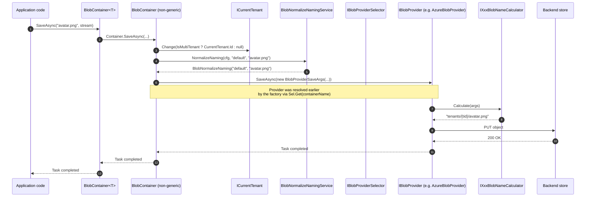

`Volo.Abp.BlobStoring` is the **provider-agnostic** half of ABP's BLOB system. It owns no bytes: there is no in-memory provider, no filesystem code, no S3 client. What it owns is the **routing pipeline** — the abstractions that let your application code call `_container.SaveAsync("avatar.png", stream)` without knowing whether that ends up as a row in SQL, a file on disk, an Azure Blob, or an S3 object.

Concretely, the module ships:

- `IBlobContainer` / `IBlobContainer<TContainer>` — the API your app code consumes.
- `BlobContainerConfiguration` and `BlobContainerConfigurations` — the per-container configuration bag, keyed by container name, with a fallback chain to the `default` container.
- `IBlobContainerFactory` — creates an `IBlobContainer` for a given name.
- `IBlobProviderSelector` / `DefaultBlobProviderSelector` — picks the `IBlobProvider` whose CLR type matches `BlobContainerConfiguration.ProviderType`.
- `IBlobProvider` / `BlobProviderBase` and the `BlobProvider{Save,Get,Delete,Exists}Args` arg objects — the contract every provider implements.
- `IBlobNamingNormalizer` / `BlobNormalizeNamingService` — the chain of per-provider name normalizers.

The provider modules ([FileSystem](/framework/blob/blob-storing-filesystem), [Azure](/framework/blob/blob-storing-azure), [AWS S3](/framework/blob/blob-storing-aws), [MinIO](/framework/blob/blob-storing-minio), [Aliyun OSS](/framework/blob/blob-storing-aliyun), and the application-level [Database](/framework/blob/blob-storing-database) module) plug in by registering an `IBlobProvider` and exposing a `UseXxx(...)` extension method on `BlobContainerConfiguration`.

## File inventory

| File | Purpose |
| --- | --- |
| `Volo/Abp/BlobStoring/AbpBlobStoringModule.cs` | Registers the core services via convention. |
| `Volo/Abp/BlobStoring/AbpBlobStoringOptions.cs` | Holds `BlobContainerConfigurations Containers`. |
| `Volo/Abp/BlobStoring/IBlobContainer.cs` | `SaveAsync`, `GetAsync`, `GetOrNullAsync`, `DeleteAsync`, `ExistsAsync`. Also defines `IBlobContainer<TContainer>`. |
| `Volo/Abp/BlobStoring/BlobContainer.cs` | The default `IBlobContainer` implementation plus the generic `BlobContainer<TContainer>` wrapper. |
| `Volo/Abp/BlobStoring/IBlobContainerFactory.cs` / `BlobContainerFactory.cs` | Looks up the configuration, selects a provider, returns an `IBlobContainer`. |
| `Volo/Abp/BlobStoring/BlobContainerConfiguration.cs` | Per-container configuration: `ProviderType`, `IsMultiTenant`, naming normalizers, free-form `_properties` bag, fallback to the default configuration. |
| `Volo/Abp/BlobStoring/BlobContainerConfigurations.cs` | Dictionary of `name -> BlobContainerConfiguration`, with `Configure<TContainer>` / `ConfigureDefault`. |
| `Volo/Abp/BlobStoring/IBlobContainerConfigurationProvider.cs` / `DefaultBlobContainerConfigurationProvider.cs` | Resolves the configuration for a container name. |
| `Volo/Abp/BlobStoring/IBlobProvider.cs` / `BlobProviderBase.cs` | The contract provider modules implement. |
| `Volo/Abp/BlobStoring/BlobProviderArgs.cs` + `Save/Get/Delete/Exists` subclasses | Argument carriers passed to provider methods. |
| `Volo/Abp/BlobStoring/IBlobProviderSelector.cs` / `DefaultBlobProviderSelector.cs` | Matches `configuration.ProviderType` against registered `IEnumerable<IBlobProvider>`. |
| `Volo/Abp/BlobStoring/DefaultContainer.cs` | Sentinel type with `[BlobContainerName("default")]` and `Name = "default"`. |
| `Volo/Abp/BlobStoring/BlobContainerNameAttribute.cs` | Resolves a container name from a CLR type. |
| `Volo/Abp/BlobStoring/IBlobNamingNormalizer.cs` / `BlobNormalizeNamingService.cs` | Per-provider name sanitization (lowercase, length, illegal chars). |
| `Volo/Abp/BlobStoring/BlobContainerExtensions.cs` | `SaveAsync(byte[])`, `GetAllBytesAsync`, `GetAllBytesOrNullAsync`. |
| `Volo/Abp/BlobStoring/BlobAlreadyExistsException.cs` | Thrown by every provider when `OverrideExisting == false` and the blob exists. |

## The two `IBlobContainer` shapes

```csharp title="IBlobContainer.cs"
public interface IBlobContainer<TContainer> : IBlobContainer
    where TContainer : class
{
}

public interface IBlobContainer
{
    Task SaveAsync(string name, Stream stream, bool overrideExisting = false, CancellationToken cancellationToken = default);
    Task<bool> DeleteAsync(string name, CancellationToken cancellationToken = default);
    Task<bool> ExistsAsync(string name, CancellationToken cancellationToken = default);
    Task<Stream> GetAsync(string name, CancellationToken cancellationToken = default);
    Task<Stream?> GetOrNullAsync(string name, CancellationToken cancellationToken = default);
}
```

There are two ways to inject one:

1. **Default container.** Inject `IBlobContainer` directly — it resolves to the configuration named `"default"` (the constant `DefaultContainer.Name`).
2. **Typed container.** Define an empty marker class, optionally decorated with `[BlobContainerName("profile-pictures")]`, then inject `IBlobContainer<ProfilePictureContainer>`. ABP resolves the name via `BlobContainerNameAttribute.GetContainerName<T>()` (falling back to the type's full name) and asks the factory for that named container.

```csharp title="DefaultContainer.cs"
[BlobContainerName(Name)]
public class DefaultContainer
{
    public const string Name = "default";
}
```

```csharp title="BlobContainerNameAttribute.cs (excerpt)"
public static string GetContainerName(Type type)
{
    var nameAttribute = type.GetCustomAttribute<BlobContainerNameAttribute>();
    if (nameAttribute == null)
    {
        return type.FullName!;
    }
    return nameAttribute.GetName(type);
}
```

So the **container name** is either the literal you put in the attribute, or — if you forget the attribute — the marker class's CLR `FullName`. The latter is fine, but providers like Azure and S3 will normalize it heavily (see naming below).

## The generic wrapper is a thin adapter

`BlobContainer<TContainer>` is not a parallel implementation; it just delegates to a non-generic `IBlobContainer` resolved by the factory:

```csharp title="BlobContainer.cs"
public class BlobContainer<TContainer> : IBlobContainer<TContainer>
    where TContainer : class
{
    protected readonly IBlobContainer Container;

    public BlobContainer(IBlobContainerFactory blobContainerFactory)
    {
        Container = blobContainerFactory.Create<TContainer>();
    }

    public Task SaveAsync(string name, Stream stream, bool overrideExisting = false,
        CancellationToken cancellationToken = default)
        => Container.SaveAsync(name, stream, overrideExisting, cancellationToken);

    // ...identical pass-throughs for Get/GetOrNull/Delete/Exists
}
```

That is the whole point of typed containers: **type-safe dependency injection** of "the container called X" without you having to remember to pass `"profile-pictures"` everywhere.

## The non-generic `BlobContainer` is where the real work happens

```csharp title="BlobContainer.cs"
public class BlobContainer : IBlobContainer
{
    protected string ContainerName { get; }
    protected BlobContainerConfiguration Configuration { get; }
    protected IBlobProvider Provider { get; }
    protected ICurrentTenant CurrentTenant { get; }
    protected ICancellationTokenProvider CancellationTokenProvider { get; }
    protected IBlobNormalizeNamingService BlobNormalizeNamingService { get; }

    public virtual async Task SaveAsync(
        string name,
        Stream stream,
        bool overrideExisting = false,
        CancellationToken cancellationToken = default)
    {
        using (CurrentTenant.Change(GetTenantIdOrNull()))
        {
            var blobNormalizeNaming = BlobNormalizeNamingService.NormalizeNaming(
                Configuration, ContainerName, name);

            await Provider.SaveAsync(
                new BlobProviderSaveArgs(
                    blobNormalizeNaming.ContainerName!,
                    Configuration,
                    blobNormalizeNaming.BlobName!,
                    stream,
                    overrideExisting,
                    CancellationTokenProvider.FallbackToProvider(cancellationToken)
                )
            );
        }
    }

    protected virtual Guid? GetTenantIdOrNull()
    {
        if (!Configuration.IsMultiTenant)
        {
            return null;
        }
        return CurrentTenant.Id;
    }
}
```

Every public method does the same three things before delegating to the provider:

1. **Coerces the current tenant.** If the container is single-tenant (`IsMultiTenant == false`) the call enters a `CurrentTenant.Change(null)` scope, so providers compute the same path/key regardless of the calling tenant context. Otherwise the current tenant is preserved. This is the single source of multi-tenant isolation in the BLOB system.
2. **Normalizes both names.** `BlobNormalizeNamingService` runs every `IBlobNamingNormalizer` registered on the configuration in order, against the **container name** and the **blob name** separately. Provider modules register their own normalizers — see [Azure](/framework/blob/blob-storing-azure), [AWS](/framework/blob/blob-storing-aws), [MinIO](/framework/blob/blob-storing-minio).
3. **Falls back to the ambient cancellation token.** `CancellationTokenProvider.FallbackToProvider(cancellationToken)` uses the caller-supplied token if present, otherwise the ambient one (HTTP request abort, etc.).

`GetAsync` adds one twist: it calls `GetOrNullAsync` and throws a generic `AbpException` if it returns null. (There's a TODO comment in the source about replacing it with a typed not-found exception.)

```csharp title="BlobContainer.cs"
public virtual async Task<Stream> GetAsync(string name, CancellationToken cancellationToken = default)
{
    var stream = await GetOrNullAsync(name, cancellationToken);
    if (stream == null)
    {
        throw new AbpException(
            $"Could not found the requested BLOB '{name}' in the container '{ContainerName}'!");
    }
    return stream;
}
```

## The factory: name → configuration → provider

```csharp title="BlobContainerFactory.cs"
public virtual IBlobContainer Create(string name)
{
    var configuration = ConfigurationProvider.Get(name);

    return new BlobContainer(
        name,
        configuration,
        ProviderSelector.Get(name),
        CurrentTenant,
        CancellationTokenProvider,
        BlobNormalizeNamingService,
        ServiceProvider
    );
}
```

A `Create<TContainer>()` extension (in `BlobContainerFactoryExtensions`) just calls `BlobContainerNameAttribute.GetContainerName<TContainer>()` first.

## Configuration: a bag with a fallback

```csharp title="BlobContainerConfiguration.cs"
public class BlobContainerConfiguration
{
    public Type? ProviderType { get; set; }
    public bool IsMultiTenant { get; set; } = true;
    public ITypeList<IBlobNamingNormalizer> NamingNormalizers { get; }

    private readonly Dictionary<string, object?> _properties;
    private readonly BlobContainerConfiguration? _fallbackConfiguration;

    public T? GetConfigurationOrDefault<T>(string name, T? defaultValue = default)
        => (T?)GetConfigurationOrNull(name, defaultValue);

    public object? GetConfigurationOrNull(string name, object? defaultValue = null)
        => _properties.GetOrDefault(name)
           ?? _fallbackConfiguration?.GetConfigurationOrNull(name, defaultValue)
           ?? defaultValue;

    public BlobContainerConfiguration SetConfiguration(string name, object? value)
    {
        Check.NotNullOrWhiteSpace(name, nameof(name));
        Check.NotNull(value, nameof(value));
        _properties[name] = value;
        return this;
    }
}
```

The free-form `_properties` dictionary is how provider modules add typed configuration without subclassing. Every provider ships a wrapper (`AzureBlobProviderConfiguration`, `AwsBlobProviderConfiguration`, …) whose properties read and write `_properties` through `GetConfiguration<T>(name)` / `SetConfiguration(name, value)` using string keys defined on a `ConfigurationNames` class. Those wrappers are what you mutate inside `UseAzure(cfg => cfg.ConnectionString = "...")`.

The **fallback** mechanism is what lets you do this:

```csharp title="Module.ConfigureServices"
Configure<AbpBlobStoringOptions>(options =>
{
    options.Containers.ConfigureDefault(container =>
    {
        container.UseFileSystem(fs => fs.BasePath = "/var/blobs");
    });

    options.Containers.Configure<ProfilePictureContainer>(container =>
    {
        container.UseAzure(azure => azure.ConnectionString = "...");
    });
});
```

```csharp title="BlobContainerConfigurations.cs"
public BlobContainerConfigurations Configure(string name,
    Action<BlobContainerConfiguration> configureAction)
{
    configureAction(
        _containers.GetOrAdd(
            name,
            () => new BlobContainerConfiguration(Default) // <-- Default is the fallback
        )
    );
    return this;
}
```

Newly registered configurations inherit any properties already set on the `default` container. So if every container should use the same filesystem `BasePath`, set it on `Default` once.

## Provider selection

```csharp title="DefaultBlobProviderSelector.cs"
public virtual IBlobProvider Get(string containerName)
{
    var configuration = ConfigurationProvider.Get(containerName);

    if (!BlobProviders.Any())
        throw new AbpException("No BLOB Storage provider was registered! ...");

    if (configuration.ProviderType == null)
        throw new AbpException("No BLOB Storage provider was used! ...");

    foreach (var provider in BlobProviders)
    {
        if (ProxyHelper.GetUnProxiedType(provider).IsAssignableTo(configuration.ProviderType))
        {
            return provider;
        }
    }

    throw new AbpException(
        $"Could not find the BLOB Storage provider with the type ({configuration.ProviderType.AssemblyQualifiedName}) " +
        $"configured for the container {containerName} and no default provider was set.");
}
```

Three implications:

- **You must call `UseXxx`.** Just installing the `Volo.Abp.BlobStoring.FileSystem` NuGet package registers the provider but does not assign it to any container. Forgetting to call `UseFileSystem(...)` is the most common "*No BLOB Storage provider was used!*" misfire.
- **The match is `IsAssignableTo`, unwrapping DI proxies.** So `configuration.ProviderType = typeof(FileSystemBlobProvider)` matches both a raw and a Castle-proxied registration.
- **There is no default provider.** Despite the error message saying "*no default provider was set*", every container resolves only by `ProviderType`. The "default" in the message refers to a planned future feature.

## Name normalization

```csharp title="BlobNormalizeNamingService.cs"
public BlobNormalizeNaming NormalizeNaming(
    BlobContainerConfiguration configuration,
    string? containerName,
    string? blobName)
{
    if (!configuration.NamingNormalizers.Any())
    {
        return new BlobNormalizeNaming(containerName, blobName);
    }

    using (var scope = ServiceProvider.CreateScope())
    {
        foreach (var normalizerType in configuration.NamingNormalizers)
        {
            var normalizer = scope.ServiceProvider
                .GetRequiredService(normalizerType)
                .As<IBlobNamingNormalizer>();

            containerName = containerName.IsNullOrWhiteSpace()
                ? containerName
                : normalizer.NormalizeContainerName(containerName!);
            blobName = blobName.IsNullOrWhiteSpace()
                ? blobName
                : normalizer.NormalizeBlobName(blobName!);
        }
        return new BlobNormalizeNaming(containerName, blobName);
    }
}
```

Each `UseXxx(...)` extension calls `containerConfiguration.NamingNormalizers.TryAdd<XxxBlobNamingNormalizer>()`. The Azure/AWS/MinIO normalizers force lowercase, strip illegal characters, and clamp length to S3/Azure's 3–63-char rules. The filesystem normalizer just strips Windows-reserved characters on Windows. See each provider page for the exact regex.

`TryAdd` means **registering the same provider twice on the same container does not stack normalizers**, but mixing providers across containers does — each container only carries its own provider's normalizer.

## Multi-tenant tenant scoping

The framework does not embed the tenant id into the blob name itself; it leaves that to each provider's "name calculator". So multi-tenancy is a **layered** concern:

| Layer | Does | Source |
| --- | --- | --- |
| `BlobContainer.GetTenantIdOrNull()` | Forces `CurrentTenant.Change(null)` for `IsMultiTenant == false` containers. | `BlobContainer.cs` |
| Per-provider name calculator (`IAzureBlobNameCalculator`, `IAwsBlobNameCalculator`, `IMinioBlobNameCalculator`, `IAliyunBlobNameCalculator`, `IBlobFilePathCalculator`) | Prefixes the blob name with `host/` or `tenants/{tenantId:D}/`. | each provider module |
| `BlobContainerConfiguration.IsMultiTenant` | Default `true`. Setting this to `false` makes the container shared by all tenants. | `BlobContainerConfiguration.cs` |

So a typical save through `BlobContainer.SaveAsync("avatar.png", stream)` from a tenant with id `9c5a…` lands in Azure as `tenants/9c5a…-…/avatar.png`, but on the filesystem provider it lands in `{BasePath}/tenants/9c5a…-…/{containerName}/avatar.png`. The container name is the same; the tenant prefix is the provider's responsibility.

## End-to-end sequence: `SaveAsync`



## `IBlobProvider` and `BlobProviderBase`

Every provider derives from `BlobProviderBase`, which adds a single helper:

```csharp title="BlobProviderBase.cs"
public abstract class BlobProviderBase : IBlobProvider
{
    public abstract Task SaveAsync(BlobProviderSaveArgs args);
    public abstract Task<bool> DeleteAsync(BlobProviderDeleteArgs args);
    public abstract Task<bool> ExistsAsync(BlobProviderExistsArgs args);
    public abstract Task<Stream?> GetOrNullAsync(BlobProviderGetArgs args);

    protected virtual async Task<Stream?> TryCopyToMemoryStreamAsync(
        Stream? stream, CancellationToken cancellationToken = default)
    {
        if (stream == null) return null;
        var memoryStream = new MemoryStream();
        await stream.CopyToAsync(memoryStream, cancellationToken);
        memoryStream.Seek(0, SeekOrigin.Begin);
        return memoryStream;
    }
}
```

The provider receives `BlobProviderSaveArgs`:

```csharp title="BlobProviderSaveArgs.cs"
public class BlobProviderSaveArgs : BlobProviderArgs
{
    public Stream BlobStream { get; }
    public bool OverrideExisting { get; }

    public BlobProviderSaveArgs(
        string containerName,
        BlobContainerConfiguration configuration,
        string blobName,
        Stream blobStream,
        bool overrideExisting = false,
        CancellationToken cancellationToken = default)
        : base(containerName, configuration, blobName, cancellationToken)
    {
        BlobStream = Check.NotNull(blobStream, nameof(blobStream));
        OverrideExisting = overrideExisting;
    }
}
```

The `Configuration` reference is the same `BlobContainerConfiguration` the factory built. Providers read their typed wrapper out of it via the extension `args.Configuration.GetAzureConfiguration()` (or the analogous helper for their provider), which just wraps the bag.

`TryCopyToMemoryStreamAsync` exists because most providers' native client streams are network-backed and can't outlive the API call that opened them. Copying into a `MemoryStream` makes the result safe to return to the caller.

## Byte-array shortcuts

```csharp title="BlobContainerExtensions.cs"
public static async Task SaveAsync(
    this IBlobContainer container, string name, byte[] bytes,
    bool overrideExisting = false, CancellationToken cancellationToken = default)
{
    using var memoryStream = new MemoryStream(bytes);
    await container.SaveAsync(name, memoryStream, overrideExisting, cancellationToken);
}

public static async Task<byte[]> GetAllBytesAsync(
    this IBlobContainer container, string name,
    CancellationToken cancellationToken = default)
{
    using var stream = await container.GetAsync(name, cancellationToken);
    return await stream.GetAllBytesAsync(cancellationToken);
}

public static async Task<byte[]?> GetAllBytesOrNullAsync(
    this IBlobContainer container, string name,
    CancellationToken cancellationToken = default)
{
    var stream = await container.GetOrNullAsync(name, cancellationToken);
    if (stream == null) return null;
    using (stream) return await stream.GetAllBytesAsync(cancellationToken);
}
```

There is no `GetAsStringAsync` yet (the `IBlobContainer.cs` source has a TODO for it). Build your own from `GetAllBytesAsync` if you need it.

## End-to-end registration

```csharp title="MyModule.cs"
[DependsOn(
    typeof(AbpBlobStoringFileSystemModule),
    typeof(AbpBlobStoringAzureModule)
)]
public class MyModule : AbpModule
{
    public override void ConfigureServices(ServiceConfigurationContext context)
    {
        Configure<AbpBlobStoringOptions>(options =>
        {
            options.Containers.ConfigureDefault(container =>
            {
                container.UseFileSystem(fs =>
                {
                    fs.BasePath = "/var/lib/myapp/blobs";
                });
            });

            options.Containers.Configure<ProfilePictureContainer>(container =>
            {
                container.IsMultiTenant = true;
                container.UseAzure(azure =>
                {
                    azure.ConnectionString = context.Services
                        .GetConfiguration()["Azure:Blob"]!;
                    azure.ContainerName = "profile-pictures";
                    azure.CreateContainerIfNotExists = true;
                });
            });
        });
    }
}

[BlobContainerName("profile-pictures")]
public class ProfilePictureContainer { }

public class UserService
{
    private readonly IBlobContainer<ProfilePictureContainer> _container;
    public UserService(IBlobContainer<ProfilePictureContainer> container)
        => _container = container;

    public Task SaveAvatarAsync(Guid userId, Stream png)
        => _container.SaveAsync(userId.ToString("N"), png, overrideExisting: true);
}
```

## Gotchas

- **`BlobAlreadyExistsException` is the only "exists" path.** Every provider checks `args.OverrideExisting` and throws this exception if the blob exists and the flag is false. There is no `UpsertAsync`; pass `overrideExisting: true` if you want last-write-wins semantics.
- **`GetAsync` throws `AbpException`, not a typed not-found.** Use `GetOrNullAsync` to distinguish "missing" from real I/O errors. The base interface even has a TODO about this.
- **`IBlobContainer` is registered transient.** The `BlobContainer<T>` constructor calls `IBlobContainerFactory.Create<T>()` once. If you store an `IBlobContainer` reference on a singleton, you'll capture the provider resolved at *that* moment — fine for stateless providers, but problematic if you swap providers at runtime.
- **`IsMultiTenant = false` clears `CurrentTenant.Id` for the duration of the call.** That includes inside any provider hooks or naming normalizers, since they run on the same logical thread. If your normalizer depends on `ICurrentTenant`, it will see the host context for shared containers.
- **`Configuration.GetConfiguration<T>("…")` throws if the key is missing**; `GetConfigurationOrDefault<T>("…", default)` returns the default. Provider config classes mix both — required fields like Azure's `ConnectionString` use `GetConfiguration`, optional ones like `ContainerName` use `GetConfigurationOrDefault`. The exception is `AbpException("Could not find the configuration value for '...'")`, surfaced from `BlobContainerConfigurationExtensions`.
- **Naming normalizers are added with `TryAdd`.** You can't register two of the same provider's normalizer, but you also can't easily prepend a custom one before the provider's. To override container-name shaping, replace `IBlobNamingNormalizer` in DI or assign a fixed `ContainerName` on the provider's wrapper.
- **No "list blobs" operation.** `IBlobContainer` has no enumeration API. If you need that, talk to the underlying provider's SDK directly (the Database provider exposes repositories for this case).

## See also

- [Volo.Abp.BlobStoring.FileSystem](/framework/blob/blob-storing-filesystem)
- [Volo.Abp.BlobStoring.Azure](/framework/blob/blob-storing-azure)
- [Volo.Abp.BlobStoring.Aws](/framework/blob/blob-storing-aws)
- [Volo.Abp.BlobStoring.Minio](/framework/blob/blob-storing-minio)
- [Volo.Abp.BlobStoring.Aliyun](/framework/blob/blob-storing-aliyun)
- [Volo.Abp.BlobStoring.Database (module)](/framework/blob/blob-storing-database)
- [Volo.Abp.Imaging](/framework/blob/imaging-abstractions) for the image-processing pipeline that often pairs with BLOB containers.
