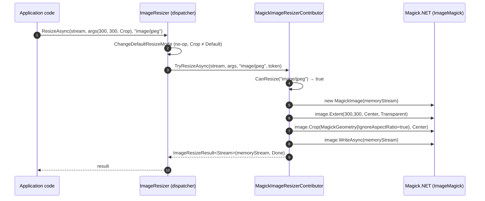

`Volo.Abp.Imaging.MagickNet` is the **ImageMagick-backed** half of ABP's imaging system. It wraps `ImageMagick.Magick.NET` (the .NET binding to ImageMagick) and exposes two contributors: a `MagickImageCompressorContributor` driven by `ImageOptimizer`, and a `MagickImageResizerContributor` that implements every `ImageResizeMode` from scratch using `MagickImage.Resize` / `Crop` / `Extent`.

You pick this engine when you need:

- GIF compression (lossy or lossless).
- Better WebP encoding throughput than the managed [ImageSharp](imaging-imagesharp) contributor.
- Format conversions via ImageMagick's much wider format coverage.

The cost is a **native dependency** — Magick.NET ships per-OS NuGets (`Magick.NET-Q8-x64`, `Magick.NET-Q16-x64-OpenMP`, etc.) and your container image needs the matching native runtime.

## File inventory

| File | Purpose |
| --- | --- |
| `Volo/Abp/Imaging/AbpImagingMagickNetModule.cs` | `[DependsOn(typeof(AbpImagingAbstractionsModule))]`. Empty body. |
| `Volo/Abp/Imaging/MagickImageResizerContributor.cs` | Manual `Resize`/`Crop`/`Extent` per `ImageResizeMode`. |
| `Volo/Abp/Imaging/MagickImageCompressorContributor.cs` | `ImageMagick.ImageOptimizer` wrapper; honours `OptimalCompression` and `Lossless`. |
| `Volo/Abp/Imaging/MagickNetCompressOptions.cs` | Three booleans: `OptimalCompression`, `IgnoreUnsupportedFormats`, `Lossless`. |

The matching NuGet package depends on the abstract `Magick.NET.Core`; you must add one of the runtime-specific packages (e.g. `Magick.NET-Q16-AnyCPU`) in your host project for the binding to load.

## Module wiring

```csharp title="AbpImagingMagickNetModule.cs"
[DependsOn(typeof(AbpImagingAbstractionsModule))]
public class AbpImagingMagickNetModule : AbpModule
{
}
```

Both contributors are `ITransientDependency` and are picked up by convention. Because the [abstractions dispatcher](imaging) iterates contributors with `.Reverse()`, if you depend on **both** this module and `AbpImagingImageSharpModule`, Magick's contributors take priority. Most apps pick one; if you mix, register the unwanted contributor's interface as a no-op or replace it in DI.

## Supported MIME types

The compressor handles three (JPEG, PNG, GIF):

```csharp title="MagickImageCompressorContributor.cs"
protected virtual bool CanCompress(string mimeType)
{
    return mimeType switch
    {
        MimeTypes.Image.Jpeg => true,
        MimeTypes.Image.Png  => true,
        MimeTypes.Image.Gif  => true,
        _ => false
    };
}
```

So compared to ImageSharp's compressor, Magick adds **GIF** but **drops WebP**. WebP optimization in ImageMagick depends on the build flags and is not exposed via `ImageOptimizer`.

The resizer handles six:

```csharp title="MagickImageResizerContributor.cs"
protected virtual bool CanResize(string mimeType)
{
    return mimeType switch
    {
        MimeTypes.Image.Jpeg => true,
        MimeTypes.Image.Png  => true,
        MimeTypes.Image.Gif  => true,
        MimeTypes.Image.Bmp  => true,
        MimeTypes.Image.Tiff => true,
        MimeTypes.Image.Webp => true,
        _ => false
    };
}
```

Identical coverage to ImageSharp's resizer.

## `MagickNetCompressOptions`

```csharp title="MagickNetCompressOptions.cs"
public class MagickNetCompressOptions
{
    public bool OptimalCompression { get; set; }
    public bool IgnoreUnsupportedFormats { get; set; }
    public bool Lossless { get; set; }
}
```

| Property | Default | Forwarded to | Notes |
| --- | --- | --- | --- |
| `OptimalCompression` | `false` | `ImageOptimizer.OptimalCompression` | Try multiple encoders/strategies to find the best one. Slower but smaller. |
| `IgnoreUnsupportedFormats` | `false` | `ImageOptimizer.IgnoreUnsupportedFormats` | If `false`, unsupported formats throw; if `true`, `IsSupported` returns false and the contributor reports `Unsupported` cleanly. |
| `Lossless` | `false` | Picks between `LosslessCompress` and `Compress` | `false` → `Compress` (lossy where applicable). `true` → `LosslessCompress` (metadata-strip and entropy-coding only). |

```csharp title="MagickImageCompressorContributor.cs"
public MagickImageCompressorContributor(IOptions<MagickNetCompressOptions> options)
{
    Options = options.Value;
    Optimizer = new ImageOptimizer
    {
        OptimalCompression = Options.OptimalCompression,
        IgnoreUnsupportedFormats = Options.IgnoreUnsupportedFormats
    };
}
```

`ImageOptimizer` is constructed once in the contributor's constructor — the same way `ImageSharpCompressOptions.JpegEncoder` is constructed once. If you mutate `Options.OptimalCompression` later, the in-memory `Optimizer` keeps the original value. To change behaviour, configure via `Configure<MagickNetCompressOptions>` before the container builds.

## The compressor

```csharp title="MagickImageCompressorContributor.cs"
public virtual async Task<ImageCompressResult<Stream>> TryCompressAsync(
    Stream stream, string mimeType = null, CancellationToken cancellationToken = default)
{
    if (!string.IsNullOrWhiteSpace(mimeType) && !CanCompress(mimeType))
    {
        return new ImageCompressResult<Stream>(stream, ImageProcessState.Unsupported);
    }

    var memoryStream = await stream.CreateMemoryStreamAsync(cancellationToken: cancellationToken);

    try
    {
        if (!Optimizer.IsSupported(memoryStream))
        {
            return new ImageCompressResult<Stream>(stream, ImageProcessState.Unsupported);
        }

        if (Compress(memoryStream))
        {
            return new ImageCompressResult<Stream>(memoryStream, ImageProcessState.Done);
        }

        memoryStream.Dispose();
        return new ImageCompressResult<Stream>(stream, ImageProcessState.Canceled);
    }
    catch
    {
        memoryStream.Dispose();
        throw;
    }
}

protected virtual bool Compress(Stream stream)
{
    return Options.Lossless ? Optimizer.LosslessCompress(stream) : Optimizer.Compress(stream);
}
```

Three differences from the [ImageSharp compressor](imaging-imagesharp):

- **`ImageOptimizer.Compress` mutates the input stream**. The contributor first copies the input into a fresh `MemoryStream` via `stream.CreateMemoryStreamAsync`, then optimizes that copy. Your original `stream` is never touched.
- **No size-comparison logic**. `ImageOptimizer.Compress` returns `true` if it actually produced a smaller file and `false` otherwise, and the contributor maps `false → Canceled`. The size check is delegated to ImageMagick.
- **`IsSupported` runs after decode**. If `CanCompress(mime)` says yes but ImageMagick can't optimize the specific encoded variant (e.g. an exotic PNG colour type), the contributor returns `Unsupported` instead of throwing.

The `byte[]` overload is the same shim pattern: buffer into a `MemoryStream`, call the stream version, return bytes if `Done`.

## The resizer

```csharp title="MagickImageResizerContributor.cs"
private const int Min = 1;

public virtual async Task<ImageResizeResult<Stream>> TryResizeAsync(
    Stream stream, ImageResizeArgs resizeArgs,
    string mimeType = null, CancellationToken cancellationToken = default)
{
    if (!mimeType.IsNullOrWhiteSpace() && !CanResize(mimeType))
    {
        return new ImageResizeResult<Stream>(stream, ImageProcessState.Unsupported);
    }

    var memoryStream = await stream.CreateMemoryStreamAsync(cancellationToken: cancellationToken);

    try
    {
        using var image = new MagickImage(memoryStream);

        if (mimeType.IsNullOrWhiteSpace() && !CanResize(image.FormatInfo?.MimeType))
        {
            return new ImageResizeResult<Stream>(stream, ImageProcessState.Unsupported);
        }

        Resize(image, resizeArgs);

        memoryStream.Position = 0;
        await image.WriteAsync(memoryStream, cancellationToken);
        memoryStream.SetLength(memoryStream.Position);
        memoryStream.Position = 0;

        return new ImageResizeResult<Stream>(memoryStream, ImageProcessState.Done);
    }
    catch
    {
        memoryStream.Dispose();
        throw;
    }
}
```

Two design points worth flagging:

- **The MIME-type sniff is in the opposite branch from ImageSharp's**: Magick only sniffs when the caller did *not* supply a MIME type (`mimeType.IsNullOrWhiteSpace()`). ImageSharp sniffs always (it decodes regardless to learn the format). So if you upload a PNG with `Content-Type: image/jpeg`, the Magick resizer will trust the lie and try to re-encode as the source format Magick detected.
- **The output is written back into the same `MemoryStream`** at offset 0, then `SetLength(Position)` trims any trailing bytes from the source. This is the more memory-efficient path; ImageSharp creates a second `MemoryStream`.

### Mode dispatch — six branches

```csharp title="MagickImageResizerContributor.cs (excerpt)"
protected virtual void ApplyResizeMode(MagickImage image, ImageResizeArgs resizeArgs)
{
    switch (resizeArgs.Mode)
    {
        case ImageResizeMode.None:    ResizeModeNone(image, resizeArgs); break;
        case ImageResizeMode.Stretch: ResizeStretch(image, resizeArgs);  break;
        case ImageResizeMode.Pad:     ResizePad(image, resizeArgs);      break;
        case ImageResizeMode.BoxPad:  ResizeBoxPad(image, resizeArgs);   break;
        case ImageResizeMode.Max:     ResizeMax(image, resizeArgs);      break;
        case ImageResizeMode.Min:     ResizeMin(image, resizeArgs);      break;
        case ImageResizeMode.Crop:    ResizeCrop(image, resizeArgs);     break;
        default:
            throw new NotSupportedException("Resize mode " + resizeArgs.Mode + "is not supported!");
    }
}
```

The dispatcher rewrites `ImageResizeMode.Default` before calling this method, so `Default` will never reach the switch. Other unknown values throw.

`ResizeModeNone` is the simplest — it just calls `image.Resize(targetWidth, targetHeight)` with the dimensions derived from the args:

```csharp title="MagickImageResizerContributor.cs"
protected virtual int GetTargetHeight(ImageResizeArgs resizeArgs, int min, int sourceWidth, int sourceHeight)
{
    if (resizeArgs.Height == 0 && resizeArgs.Width > 0)
    {
        return Math.Max(min, (int)Math.Round(sourceHeight * resizeArgs.Width / (float)sourceWidth));
    }
    return resizeArgs.Height;
}

protected virtual int GetTargetWidth(ImageResizeArgs resizeArgs, int min, int sourceWidth, int sourceHeight)
{
    if (resizeArgs.Width == 0 && resizeArgs.Height > 0)
    {
        return Math.Max(min, (int)Math.Round(sourceWidth * resizeArgs.Height / (float)sourceHeight));
    }
    return resizeArgs.Width;
}
```

When both width and height are zero, `GetTargetWidth`/`Height` return zero, and `image.Resize(0, 0)` in ImageMagick is a no-op. So Magick handles "no dimensions supplied" more gracefully than ImageSharp, where the same input produces a 1-px tile in `None` mode.

`Stretch` ignores aspect ratio:

```csharp title="MagickImageResizerContributor.cs"
image.Resize(
    new MagickGeometry(
        GetTargetWidth(resizeArgs, Min, sourceWidth, sourceHeight),
        GetTargetHeight(resizeArgs, Min, sourceWidth, sourceHeight))
    { IgnoreAspectRatio = true });
```

`Pad`, `BoxPad`, `Max`, `Min`, `Crop` are implemented by computing a `percentWidth`/`percentHeight` and then calling `Resize` + `Extent` + optional `Crop`. See the source for the full math (it follows ImageSharp's semantics exactly so swapping engines doesn't change output framing).

### `Crop` is `Extent` + `Crop`

```csharp title="MagickImageResizerContributor.cs"
protected virtual void ResizeCrop(MagickImage image, ImageResizeArgs resizeArgs)
{
    var sourceWidth  = image.Width;
    var sourceHeight = image.Height;
    var targetWidth  = GetTargetWidth (resizeArgs, Min, sourceWidth, sourceHeight);
    var targetHeight = GetTargetHeight(resizeArgs, Min, sourceWidth, sourceHeight);

    image.Extent(targetWidth, targetHeight, Gravity.Center, MagickColors.Transparent);
    image.Crop(
        new MagickGeometry(targetWidth, targetHeight) { IgnoreAspectRatio = true },
        Gravity.Center);
}
```

`Extent` resizes the canvas (padding with transparent); `Crop` then trims back to the target. The center-gravity choice means uploads of off-center subjects (e.g. portrait crops in landscape sources) won't get the focal point.

## Sequence: resize through Magick



## Configuration examples

```csharp title="ConfigureServices"
Configure<MagickNetCompressOptions>(options =>
{
    options.OptimalCompression = true;
    options.IgnoreUnsupportedFormats = true;
    options.Lossless = false; // re-encode JPEGs with lossy savings, optimize PNG/GIF metadata
});

Configure<ImageResizeOptions>(options =>
{
    options.DefaultResizeMode = ImageResizeMode.Max;
});
```

`OptimalCompression = true` enables ImageMagick's "try multiple encoders" pass — usually 2–5× slower for ~5–15 % extra savings. Reserve it for cold-path background jobs (e.g. nightly thumbnail rebuilds), not for upload-time compression.

## Gotchas

- **Magick.NET requires a runtime NuGet.** Adding `Volo.Abp.Imaging.MagickNet` alone is not enough — your host needs `Magick.NET-Q8-AnyCPU`, `Magick.NET-Q16-AnyCPU`, or a platform-specific variant. Without it you get a `TypeInitializationException` on first decode.
- **Container images need libgomp / libstdc++.** The `Magick.NET-Q16-OpenMP` variants link OpenMP. On Alpine and slim Debian images you'll either crash at startup or need to install `libgomp1`.
- **`Lossless` only matters for re-encodable formats.** JPEG is inherently lossy; `LosslessCompress` on a JPEG just strips metadata and re-Huffman-codes. The visible quality is the same as the source.
- **Compress mutates a copy of the stream**. The original stream you pass in is *not* the one returned; you can keep using it after the call.
- **`MagickImage` is `IDisposable`** and the resizer disposes it via `using`. The `byte[]` overload of resize does **not** `using`-dispose the `memoryStream` for `image.ToByteArray()`, but the GC will collect it shortly afterwards. For very large workloads prefer the `Stream` overload.
- **MIME sniff branch difference**: this resizer only sniffs when the caller omits the MIME type, while ImageSharp always sniffs. If a client lies about content type and you want strict format gating, set `CanResize` checks on both branches by subclassing.
- **No animated GIF resize per-frame.** `MagickImage` reads the first frame only; for animations use `MagickImageCollection` — that's not what this contributor does.
- **Memory pressure under OpenMP**. ImageMagick may spawn threads equal to your CPU count for each decode. Cap with `ResourceLimits.Thread = 1` if you serve thousands of small thumbnails per second.

## See also

- [Volo.Abp.Imaging](imaging) — the abstractions and the contributor dispatcher.
- [Volo.Abp.Imaging.ImageSharp](imaging-imagesharp) — the pure-managed alternative.
- [Volo.Abp.BlobStoring](blob-storing) — the storage side.
