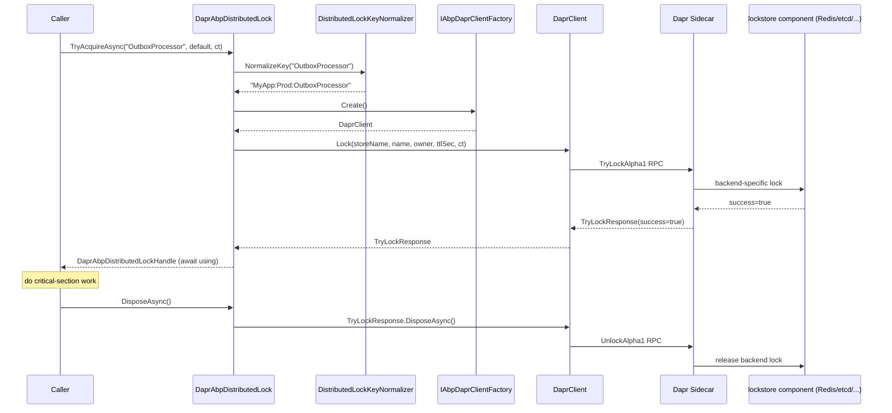

`Volo.Abp.DistributedLocking.Dapr` is an alternative provider for `IAbpDistributedLock` (see [distributed-locking](/framework/caching/distributed-locking) for the contract). Instead of going to Redis/SQL/Azure directly via [Medallion.Threading](https://github.com/madelson/DistributedLock), it calls the **Dapr lock building block** through the official `Dapr.Client` SDK. The actual storage (Redis, etcd, Consul, etc.) is then configured at the platform level via a Dapr `lockstore` component, *not* in your application code.

This is the right choice when:

- You are already running on Dapr and want to keep all of your "stateful infra" decisions in Dapr component manifests (one place, one rotation strategy, one ops team).
- You want application code to be portable across lock backends without recompiling — swap the Dapr `lockstore` component and everything keeps working.
- You don't want to take a direct dependency on `StackExchange.Redis` / `Microsoft.Data.SqlClient` / `Azure.Storage.Blobs` from the host process.

The contract `IAbpDistributedLock.TryAcquireAsync` and the `await using` consumer pattern are **identical** to the other providers. The differences live entirely in the provider — see below.

## File inventory

| File | Purpose |
| --- | --- |
| `Volo/Abp/DistributedLocking/Dapr/AbpDistributedLockingDaprModule.cs` | Module class. `DependsOn(AbpDistributedLockingAbstractionsModule, AbpDaprModule)`. |
| `Volo/Abp/DistributedLocking/Dapr/DaprAbpDistributedLock.cs` | `IAbpDistributedLock` implementation. `[Dependency(ReplaceServices = true)]` so it replaces `LocalAbpDistributedLock`. |
| `Volo/Abp/DistributedLocking/Dapr/DaprAbpDistributedLockHandle.cs` | Wraps Dapr's `TryLockResponse` (its `DisposeAsync` is what triggers the `Unlock` call). |
| `Volo/Abp/DistributedLocking/Dapr/AbpDistributedLockDaprOptions.cs` | Options class: `StoreName`, `Owner`, `DefaultExpirationTimeout`. |

## Module dependency

```csharp title="AbpDistributedLockingDaprModule.cs"
[DependsOn(
    typeof(AbpDistributedLockingAbstractionsModule),
    typeof(AbpDaprModule))]
public class AbpDistributedLockingDaprModule : AbpModule
{
}
```

Two implications:

1. The module depends on **the abstractions package only**, not on `Volo.Abp.DistributedLocking`. That means you do *not* drag Medallion.Threading into your build — `DaprAbpDistributedLock` directly replaces the default `LocalAbpDistributedLock` registered by `AbpDistributedLockingAbstractionsModule`.
2. It depends on `AbpDaprModule`, which registers `IAbpDaprClientFactory` — the factory used to construct `DaprClient` instances. See `Volo.Abp.Dapr` for the surrounding configuration (Dapr HTTP/gRPC endpoint, API token, JSON options).

The module itself has no `ConfigureServices` body — `[Dependency(ReplaceServices = true)]` on `DaprAbpDistributedLock` performs the registration substitution.

## The implementation

```csharp title="DaprAbpDistributedLock.cs"
[Dependency(ReplaceServices = true)]
public class DaprAbpDistributedLock : IAbpDistributedLock, ITransientDependency
{
    protected IAbpDaprClientFactory DaprClientFactory { get; }
    protected AbpDistributedLockDaprOptions DistributedLockDaprOptions { get; }
    protected IDistributedLockKeyNormalizer DistributedLockKeyNormalizer { get; }

    public DaprAbpDistributedLock(
        IAbpDaprClientFactory daprClientFactory,
        IOptions<AbpDistributedLockDaprOptions> distributedLockDaprOptions,
        IDistributedLockKeyNormalizer distributedLockKeyNormalizer)
    {
        DaprClientFactory = daprClientFactory;
        DistributedLockKeyNormalizer = distributedLockKeyNormalizer;
        DistributedLockDaprOptions = distributedLockDaprOptions.Value;
    }

    public async Task<IAbpDistributedLockHandle?> TryAcquireAsync(
        string name,
        TimeSpan timeout = default,
        CancellationToken cancellationToken = default)
    {
        name = DistributedLockKeyNormalizer.NormalizeKey(name);

        var daprClient = DaprClientFactory.Create();
        var lockResponse = await daprClient.Lock(
            DistributedLockDaprOptions.StoreName,
            name,
            DistributedLockDaprOptions.Owner ?? Guid.NewGuid().ToString(),
            (int)DistributedLockDaprOptions.DefaultExpirationTimeout.TotalSeconds,
            cancellationToken);

        if (lockResponse == null || !lockResponse.Success)
        {
            return null;
        }

        return new DaprAbpDistributedLockHandle(lockResponse);
    }
}
```

Step by step:

1. **Key normalization.** The same `IDistributedLockKeyNormalizer` used by every `IAbpDistributedLock` implementation prepends `AbpDistributedLockOptions.KeyPrefix` (configured separately from `AbpDistributedLockDaprOptions`). The normalized name is what Dapr sees as the `ResourceId`.
2. **Build a `DaprClient`.** `IAbpDaprClientFactory.Create()` returns a `Dapr.Client.DaprClient` configured with the host's Dapr sidecar address, optional API token and shared JSON serializer options.
3. **Call `daprClient.Lock(...)`.** The arguments map directly onto the Dapr lock building block contract:
   - `storeName` — the Dapr `lockstore` component name (e.g. `"redisLockStore"`).
   - `resourceId` — the normalized lock name.
   - `lockOwner` — a string identifying the holder. ABP uses `AbpDistributedLockDaprOptions.Owner` if set, otherwise a fresh `Guid` per acquire.
   - `expiryInSeconds` — TTL after which Dapr considers the lock abandoned and reclaims it. ABP rounds `DefaultExpirationTimeout` down to whole seconds.
4. **Interpret the response.** Dapr returns a `TryLockResponse` with `Success = true/false`. ABP treats `false` (or `null`) as "lock not acquired" and returns `null` to the caller — the same shape every other `IAbpDistributedLock` implementation uses.
5. **Wrap the response in a handle.** `TryLockResponse` itself implements `IAsyncDisposable`; disposing it tells `DaprClient` to issue the `Unlock` call back to the sidecar.

### What is *not* implemented

- The user-supplied `timeout` parameter is **not** forwarded to Dapr. The Dapr lock building block does not currently expose a server-side acquisition timeout; ABP issues a single "try once" call and returns `null` if it fails. If you need a "wait up to X" semantic, loop with delay in your caller:

  ```csharp
  IAbpDistributedLockHandle? handle = null;
  var deadline = DateTime.UtcNow + TimeSpan.FromSeconds(10);
  while ((handle = await @lock.TryAcquireAsync(name, default, ct)) == null
         && DateTime.UtcNow < deadline)
  {
      await Task.Delay(200, ct);
  }
  ```

- `CancellationTokenProvider`-fallback is not applied here as it is in `MedallionAbpDistributedLock`; pass the token explicitly if you need cooperative cancellation through the Dapr SDK.

## The handle

```csharp title="DaprAbpDistributedLockHandle.cs"
public class DaprAbpDistributedLockHandle : IAbpDistributedLockHandle
{
    protected TryLockResponse LockResponse { get; }

    public DaprAbpDistributedLockHandle(TryLockResponse lockResponse)
        => LockResponse = lockResponse;

    public async ValueTask DisposeAsync()
    {
        await LockResponse.DisposeAsync();
    }
}
```

The handle stays as thin as possible: it holds the `TryLockResponse` Dapr returned and forwards `DisposeAsync` to it. Under the hood, `Dapr.Client`'s `TryLockResponse.DisposeAsync` issues an `Unlock` RPC to the sidecar, which contacts the configured `lockstore` component. If your process crashes before disposing, the `expiryInSeconds` TTL is your safety net.

## Options

```csharp title="AbpDistributedLockDaprOptions.cs"
public class AbpDistributedLockDaprOptions
{
    public string StoreName { get; set; } = default!;

    public string? Owner { get; set; }

    public TimeSpan DefaultExpirationTimeout { get; set; }

    public AbpDistributedLockDaprOptions()
    {
        DefaultExpirationTimeout = TimeSpan.FromMinutes(2);
    }
}
```

| Option | Default | Meaning |
| --- | --- | --- |
| `StoreName` | *(required)* — `default!` will throw the first time Dapr sees it | The Dapr `lockstore` component name. Must match a component manifest in your Dapr deployment. |
| `Owner` | `null` → ABP picks `Guid.NewGuid().ToString()` per acquire | Identifies the lock holder to Dapr. Per-process / per-instance value is typical. |
| `DefaultExpirationTimeout` | `2 minutes` | Server-side TTL Dapr enforces. Pick a value larger than the longest critical section under load, but small enough that a crashed holder doesn't paralyze the system. |

Configure once in your host module:

```csharp
Configure<AbpDistributedLockDaprOptions>(opts =>
{
    opts.StoreName = "redisLockStore";
    opts.Owner = $"{Environment.MachineName}:{Environment.ProcessId}";
    opts.DefaultExpirationTimeout = TimeSpan.FromMinutes(1);
});

// The shared KeyPrefix from the abstractions package still applies.
Configure<AbpDistributedLockOptions>(opts =>
{
    opts.KeyPrefix = "MyApp:Prod:";
});
```

### Picking an `Owner`

The Dapr lock building block uses the owner string for two things:

1. **Idempotent acquires** — calling `Lock` again with the same `(store, resourceId, owner)` is conceptually a no-op (the same holder still owns the lock).
2. **Authorized unlock** — only the original owner string can `Unlock` the lock before its TTL expires.

If you leave `Owner = null`, ABP generates a fresh GUID per acquire. That's safe (the GUID lives just long enough to be passed back during `Unlock`) but means **reentrancy will not be coalesced** at the Dapr layer: a second `TryAcquireAsync` from the same process with a *different* GUID is a contention attempt, not a re-entry. If you want reentrancy-like behavior, set `Owner` to a stable per-instance value.

### Picking `DefaultExpirationTimeout`

This is the safety-net TTL — if your process dies after acquiring but before disposing, Dapr will release the lock automatically after this interval. Two competing pressures:

- **Too short** and a long critical section will appear to lose the lock from Dapr's perspective; another node could acquire concurrently while you're still working.
- **Too long** and a crashed leader-holding worker keeps the lock for minutes, leaving the cluster idle.

The default 2 minutes is conservative. Tune to your workload.

## Dapr component manifest

A typical `lockstore` component (Redis-backed) looks like:

```yaml
apiVersion: dapr.io/v1alpha1
kind: Component
metadata:
  name: redisLockStore
spec:
  type: lock.redis
  version: v1
  metadata:
    - name: redisHost
      value: redis:6379
    - name: redisPassword
      secretKeyRef:
        name: redis-secrets
        key: password
```

The `metadata.name` (`redisLockStore`) is what you pass as `AbpDistributedLockDaprOptions.StoreName`. You can swap `lock.redis` for any other supported lock component without recompiling the app — that is the whole point of routing through Dapr.

## Sequence — `TryAcquireAsync`



If Dapr's `TryLockAlpha1` returns `success = false` (another owner holds the lock), the adapter returns `null` to `App` — *not* an exception. The consumer pattern is `if (handle == null) return;`.

## Consumer usage — same as everything else

The whole reason `IAbpDistributedLock` is a single-method interface is that consumers do not know — and do not care — which provider is active:

```csharp
public class OutboxProcessor : IBackgroundWorker
{
    private readonly IAbpDistributedLock _lock;

    public OutboxProcessor(IAbpDistributedLock @lock) => _lock = @lock;

    public async Task RunAsync(CancellationToken ct)
    {
        await using var handle = await _lock.TryAcquireAsync(
            "OutboxProcessor", default, ct);
        if (handle == null) return;

        await DrainOutboxAsync(ct);
    }
}
```

That code is identical whether your host references `Volo.Abp.DistributedLocking.Abstractions` only (process-local lock), `Volo.Abp.DistributedLocking` (Medallion), or `Volo.Abp.DistributedLocking.Dapr` (the path documented here). Swapping providers is a module-graph decision.

## Customization hooks

| Hook | How |
| --- | --- |
| Replace the implementation entirely | Implement `IAbpDistributedLock` with `[Dependency(ReplaceServices = true)]`. |
| Subclass for telemetry / logging | Derive from `DaprAbpDistributedLock` (all members are `virtual`) and override `TryAcquireAsync`. |
| Tune TTL per environment | `Configure<AbpDistributedLockDaprOptions>(o => o.DefaultExpirationTimeout = ...)`. |
| Stable owner for reentrancy | `Configure<AbpDistributedLockDaprOptions>(o => o.Owner = "host-A")`. |
| Namespace lock keys | `Configure<AbpDistributedLockOptions>(o => o.KeyPrefix = "MyApp:Prod:")`. |
| Override the Dapr client construction | Implement / replace `IAbpDaprClientFactory` (from `Volo.Abp.Dapr`). |

## When to prefer Dapr over Medallion

| Concern | Dapr (`DaprAbpDistributedLock`) | Medallion (`MedallionAbpDistributedLock`) |
| --- | --- | --- |
| Backend selection | Configured in Dapr component manifests; app code is portable. | Selected by the NuGet package and constructor in your module. |
| Cluster-wide acquisition | ✅ via Dapr's lock building block | ✅ via Medallion provider |
| `timeout` parameter | **Ignored** — Dapr API is "try once" today. Use a polling loop if needed. | Honored end-to-end. |
| Reentrancy behavior | Controlled by `Owner` string. | Provider-dependent. |
| Failure-recovery TTL | Yes — `DefaultExpirationTimeout`. | Provider-dependent (Redis TTL, blob lease, SQL connection lifetime). |
| New dependencies | Dapr sidecar required. | None at the app layer if you already use Redis/SQL/etc. |

If you have neither, [distributed-locking](/framework/caching/distributed-locking)'s Medallion adapter is the more flexible default. If you're already a Dapr shop, this module is the lower-friction option.

## Cross-references

- [distributed-locking](/framework/caching/distributed-locking) — the abstractions package, `IAbpDistributedLock` contract, `LocalAbpDistributedLock` default, Medallion adapter, and `AbpDistributedLockOptions.KeyPrefix` (which still applies here).
- `Volo.Abp.Dapr` — `AbpDaprModule`, `IAbpDaprClientFactory`, `DaprClient` configuration.
- Dapr docs for the lock building block (`lockstores`) and the YAML manifests for `lock.redis`, `lock.consul`, etc.
- [caching](/framework/caching/caching) — pair with `GetOrAddAsync` for cluster-wide cache-fill coalescing.
