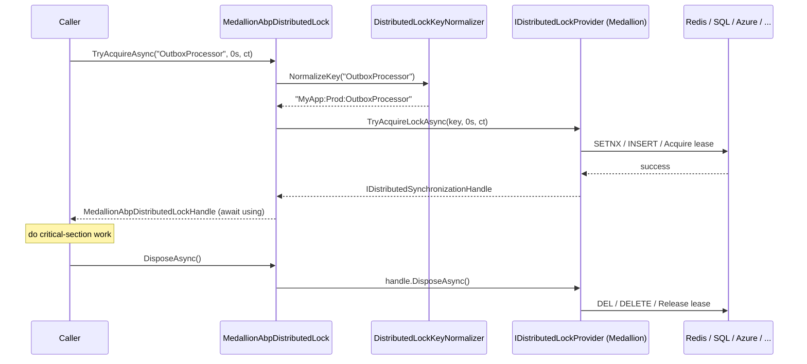

`Volo.Abp.DistributedLocking` is a tiny abstraction with a big footprint. The whole public surface is **one interface** — `IAbpDistributedLock` — with **one method** — `TryAcquireAsync(name, timeout, cancellationToken)`. That deliberate minimalism is the point: every ABP module that needs mutual exclusion across processes (background workers, schedulers, leader-election, cache-fill single-flight, anti-double-submit guards) takes a dependency on this interface and never on a concrete lock provider. You then plug in:

- **In-process only** (the default, `LocalAbpDistributedLock`) — backed by `AsyncKeyedLocker<string>` for keyed semaphores. Safe for single-instance deployments, useless across machines.
- **Cross-process** (`MedallionAbpDistributedLock`, shipped in `Volo.Abp.DistributedLocking`) — delegates to a `Medallion.Threading.IDistributedLockProvider`. By plugging in Medallion's Redis, SQL Server, PostgreSQL, Azure Blob, ZooKeeper, or File providers you get real cluster-wide locks without your code changing a line.
- **Dapr** (`Volo.Abp.DistributedLocking.Dapr`) — talks to a Dapr lock building block. See [distributed-locking-dapr](distributed-locking-dapr).

This page explains the abstraction, the local default, the Medallion adapter and how to wire it, the `KeyPrefix` namespacing, and the `await using` handle pattern.

## File inventory

### `Volo.Abp.DistributedLocking.Abstractions` — the contract + local default

| File | Purpose |
| --- | --- |
| `Volo/Abp/DistributedLocking/IAbpDistributedLock.cs` | The single-method contract: `TryAcquireAsync(name, timeout, cancellationToken)`. |
| `Volo/Abp/DistributedLocking/IAbpDistributedLockHandle.cs` | `IAsyncDisposable` returned by a successful acquire. |
| `Volo/Abp/DistributedLocking/LocalAbpDistributedLock.cs` | Default impl. Backed by `AsyncKeyedLocker<string>`. `ISingletonDependency`. |
| `Volo/Abp/DistributedLocking/LocalAbpDistributedLockHandle.cs` | Wraps the `AsyncKeyedLocker` releaser. |
| `Volo/Abp/DistributedLocking/AbpDistributedLockOptions.cs` | `KeyPrefix` property used to namespace lock keys. |
| `Volo/Abp/DistributedLocking/IDistributedLockKeyNormalizer.cs` | One-method contract: `string NormalizeKey(string name)`. |
| `Volo/Abp/DistributedLocking/DistributedLockKeyNormalizer.cs` | Default normalizer: prepends `Options.KeyPrefix`. |
| `Volo/Abp/DistributedLocking/AbpDistributedLockingAbstractionsModule.cs` | Empty module — exists so this package can be depended on as a module dependency. |

### `Volo.Abp.DistributedLocking` — the Medallion adapter

| File | Purpose |
| --- | --- |
| `Volo/Abp/DistributedLocking/AbpDistributedLockingModule.cs` | Module class. `DependsOn(AbpDistributedLockingAbstractionsModule, AbpThreadingModule)`. |
| `Volo/Abp/DistributedLocking/MedallionAbpDistributedLock.cs` | `IAbpDistributedLock` implementation delegating to `Medallion.Threading.IDistributedLockProvider`. `[Dependency(ReplaceServices = true)]`. |
| `Volo/Abp/DistributedLocking/MedallionAbpDistributedLockHandle.cs` | Wraps `IDistributedSynchronizationHandle`. |
| `Volo/Abp/DistributedLocking/AbpDistributedLockHandleExtensions.cs` | `ToDistributedSynchronizationHandle()` — escape hatch back to the Medallion handle. |

## The contract

```csharp title="IAbpDistributedLock.cs"
public interface IAbpDistributedLock
{
    /// <summary>
    /// Tries to acquire a named lock.
    /// Returns a disposable object to release the lock.
    /// It is suggested to use this method within a using block.
    /// Returns null if the lock could not be handled.
    /// </summary>
    /// <param name="name">The name of the lock</param>
    /// <param name="timeout">How long to wait before giving up on the acquisition attempt. Defaults to 0</param>
    /// <param name="cancellationToken">Cancellation token</param>
    Task<IAbpDistributedLockHandle?> TryAcquireAsync(
        [NotNull] string name,
        TimeSpan timeout = default,
        CancellationToken cancellationToken = default
    );
}
```

And the handle:

```csharp title="IAbpDistributedLockHandle.cs"
public interface IAbpDistributedLockHandle : IAsyncDisposable
{
}
```

The semantics are deliberately simple and provider-agnostic:

| Aspect | Behavior |
| --- | --- |
| Acquire success | Returns a non-null `IAbpDistributedLockHandle` you must `DisposeAsync()` (use `await using`). |
| Acquire failure (timeout, contention, transient) | Returns **`null`** — *not* an exception. Callers branch on the null check. |
| `timeout = default` (i.e. `TimeSpan.Zero`) | Try once, return immediately. The most common shape for "skip work if someone else is doing it". |
| `timeout > 0` | Wait up to that long for the lock; return `null` if the wait expires. |
| Cancellation | A canceled `cancellationToken` propagates an `OperationCanceledException`. |
| Disposal | Releases the lock. With Medallion, that means returning the handle to the provider (e.g. `DEL` on Redis, transaction commit on SQL, blob lease release on Azure). |

The "null on failure, exception on cancel" convention is what makes the consumer pattern terse.

## Consumer pattern — `await using`

```csharp
public class TimedOutboxWorker : IBackgroundWorker
{
    private readonly IAbpDistributedLock _lock;

    public TimedOutboxWorker(IAbpDistributedLock @lock) => _lock = @lock;

    public async Task DoWorkAsync(CancellationToken ct)
    {
        await using var handle = await _lock.TryAcquireAsync(
            "MyApp:OutboxProcessor",
            TimeSpan.Zero,            // skip this tick if someone else owns the lock
            ct);

        if (handle == null) return;   // another worker is processing — back off

        await ProcessOutboxAsync(ct);
        // handle disposed -> lock released, even on exception
    }
}
```

Three idioms worth internalizing:

1. **`await using` releases on every path**, including exceptions. Forgetting it leaks the lock until its provider-side TTL expires.
2. **Always check for `null`** before doing work. With `TimeSpan.Zero`, `null` is the *expected* outcome under contention.
3. **Choose a stable lock name** — usually a constant per logical resource (`"MyApp:OutboxProcessor"`, `"MyApp:Reports:Daily"`). Avoid embedding per-call data unless you genuinely want a finer-grained lock.

## The default — `LocalAbpDistributedLock`

```csharp title="LocalAbpDistributedLock.cs"
public class LocalAbpDistributedLock : IAbpDistributedLock, ISingletonDependency
{
    private readonly AsyncKeyedLocker<string> _localSyncObjects = new(o =>
    {
        o.PoolSize = 20;
        o.PoolInitialFill = 1;
    });

    protected IDistributedLockKeyNormalizer DistributedLockKeyNormalizer { get; }

    public LocalAbpDistributedLock(IDistributedLockKeyNormalizer distributedLockKeyNormalizer)
    {
        DistributedLockKeyNormalizer = distributedLockKeyNormalizer;
    }

    [MethodImpl(MethodImplOptions.AggressiveInlining)]
    public async Task<IAbpDistributedLockHandle?> TryAcquireAsync(
        string name,
        TimeSpan timeout = default,
        CancellationToken cancellationToken = default)
    {
        Check.NotNullOrWhiteSpace(name, nameof(name));
        var key = DistributedLockKeyNormalizer.NormalizeKey(name);

        var timeoutReleaser = await _localSyncObjects.LockAsync(key, timeout, cancellationToken);
        if (!timeoutReleaser.EnteredSemaphore)
        {
            timeoutReleaser.Dispose();
            return null;
        }
        return new LocalAbpDistributedLockHandle(timeoutReleaser);
    }
}
```

What this gives you:

- **Per-key semaphore**, courtesy of `AsyncKeyedLocker<string>` — i.e. two different `name`s do not block each other; the same `name` is serialized.
- **`PoolSize = 20`** so the locker pre-pools 20 internal semaphore slots and recycles them; cheap repeated lock/unlock under load.
- **Timeout-aware** acquisition: `EnteredSemaphore == false` after the timeout means "give up, return `null`".
- The handle simply wraps the returned `IDisposable`:

```csharp title="LocalAbpDistributedLockHandle.cs"
public class LocalAbpDistributedLockHandle : IAbpDistributedLockHandle
{
    private readonly IDisposable _disposable;

    public LocalAbpDistributedLockHandle(IDisposable disposable) => _disposable = disposable;

    public ValueTask DisposeAsync()
    {
        _disposable.Dispose();
        return default;
    }
}
```

**What it does *not* give you**: cross-process mutual exclusion. Two instances of your app running in parallel will each hold their own `LocalAbpDistributedLock` singleton and never see the other's acquisition. For single-node deployments (or features that genuinely only need per-process serialization, e.g. an in-memory cache rebuild) that's exactly what you want; you pay zero infrastructure cost.

## Going cluster-wide — `MedallionAbpDistributedLock`

`Volo.Abp.DistributedLocking` is the package that brings in the [Medallion.Threading](https://github.com/madelson/DistributedLock) family of distributed lock providers via a single interface, `IDistributedLockProvider`. `MedallionAbpDistributedLock` is the adapter:

```csharp title="MedallionAbpDistributedLock.cs"
[Dependency(ReplaceServices = true)]
public class MedallionAbpDistributedLock : IAbpDistributedLock, ITransientDependency
{
    protected IDistributedLockProvider DistributedLockProvider { get; }
    protected ICancellationTokenProvider CancellationTokenProvider { get; }
    protected IDistributedLockKeyNormalizer DistributedLockKeyNormalizer { get; }

    public MedallionAbpDistributedLock(
        IDistributedLockProvider distributedLockProvider,
        ICancellationTokenProvider cancellationTokenProvider,
        IDistributedLockKeyNormalizer distributedLockKeyNormalizer)
    {
        DistributedLockProvider = distributedLockProvider;
        CancellationTokenProvider = cancellationTokenProvider;
        DistributedLockKeyNormalizer = distributedLockKeyNormalizer;
    }

    public async Task<IAbpDistributedLockHandle?> TryAcquireAsync(
        string name,
        TimeSpan timeout = default,
        CancellationToken cancellationToken = default)
    {
        Check.NotNullOrWhiteSpace(name, nameof(name));
        var key = DistributedLockKeyNormalizer.NormalizeKey(name);

        CancellationTokenProvider.FallbackToProvider(cancellationToken);

        var handle = await DistributedLockProvider.TryAcquireLockAsync(
            key,
            timeout,
            CancellationTokenProvider.FallbackToProvider(cancellationToken)
        );

        if (handle == null)
        {
            return null;
        }

        return new MedallionAbpDistributedLockHandle(handle);
    }
}
```

Key details:

1. **`[Dependency(ReplaceServices = true)]`** — the moment you reference `Volo.Abp.DistributedLocking` and add `AbpDistributedLockingModule` to your dependency graph, this class replaces `LocalAbpDistributedLock` in the container, so every existing `IAbpDistributedLock` injection automatically goes cross-process.
2. **It is `ITransientDependency`, not singleton.** That's deliberate: the lock provider may produce per-acquisition state (Redis subscription, SQL connection) that's cheaper to scope per call.
3. **Cancellation falls back.** Like the cache, it uses `ICancellationTokenProvider.FallbackToProvider(token)` so background workers without an ambient token still respect process shutdown.
4. **It delegates 100% of the actual lock semantics to Medallion** — `IDistributedLockProvider.TryAcquireLockAsync` is the one method that matters. The adapter is otherwise data-plane only.

And the handle just forwards `DisposeAsync` to the Medallion handle:

```csharp title="MedallionAbpDistributedLockHandle.cs"
public class MedallionAbpDistributedLockHandle : IAbpDistributedLockHandle
{
    public IDistributedSynchronizationHandle Handle { get; }

    public MedallionAbpDistributedLockHandle(IDistributedSynchronizationHandle handle)
    {
        Handle = handle;
    }

    public ValueTask DisposeAsync() => Handle.DisposeAsync();
}
```

### Registering a Medallion provider

`Volo.Abp.DistributedLocking` deliberately **does not** register an `IDistributedLockProvider` for you — picking the backend is your call. Add the Medallion provider package you want (`DistributedLock.Redis`, `DistributedLock.SqlServer`, `DistributedLock.Postgres`, `DistributedLock.Azure`, `DistributedLock.ZooKeeper`, `DistributedLock.FileSystem`, …) and register it once in your module:

```csharp
// Redis
public override void ConfigureServices(ServiceConfigurationContext context)
{
    var mux = ConnectionMultiplexer.Connect(
        context.Services.GetConfiguration()["Redis:Configuration"]!);

    context.Services.AddSingleton<IDistributedLockProvider>(
        new RedisDistributedSynchronizationProvider(mux.GetDatabase()));
}
```

```csharp
// SQL Server
public override void ConfigureServices(ServiceConfigurationContext context)
{
    context.Services.AddSingleton<IDistributedLockProvider>(
        new SqlDistributedSynchronizationProvider(
            context.Services.GetConfiguration().GetConnectionString("Default")!));
}
```

```csharp
// Azure blobs
public override void ConfigureServices(ServiceConfigurationContext context)
{
    context.Services.AddSingleton<IDistributedLockProvider>(
        new AzureBlobLeaseDistributedSynchronizationProvider(
            new BlobContainerClient(
                context.Services.GetConfiguration()["Azure:Storage"],
                "abp-locks")));
}
```

Any one of these is enough — once an `IDistributedLockProvider` is in the container, `MedallionAbpDistributedLock` picks it up.

> **Tip.** Medallion providers usually offer slightly different semantics around fairness, TTL, reentrancy, and connection requirements. Read the provider docs before picking one. For the typical ABP use case (singleton background workers, cache single-flight) Redis or SQL Server are the most popular choices.

## Key normalization — `AbpDistributedLockOptions.KeyPrefix`

Both implementations normalize the user-supplied `name` through `IDistributedLockKeyNormalizer`. The default normalizer is trivial:

```csharp title="AbpDistributedLockOptions.cs"
public class AbpDistributedLockOptions
{
    /// <summary>
    /// DistributedLock key prefix.
    /// </summary>
    public string KeyPrefix { get; set; }

    public AbpDistributedLockOptions()
    {
        KeyPrefix = "";
    }
}
```

```csharp title="DistributedLockKeyNormalizer.cs"
public class DistributedLockKeyNormalizer : IDistributedLockKeyNormalizer, ITransientDependency
{
    protected AbpDistributedLockOptions Options { get; }

    public DistributedLockKeyNormalizer(IOptions<AbpDistributedLockOptions> options)
        => Options = options.Value;

    public virtual string NormalizeKey(string name)
        => $"{Options.KeyPrefix}{name}";
}
```

So a key of `"OutboxProcessor"` with `KeyPrefix = "MyApp:Prod:"` becomes `"MyApp:Prod:OutboxProcessor"` before it reaches Redis (or SQL, or AsyncKeyedLocker).

Configure once in your host module:

```csharp
Configure<AbpDistributedLockOptions>(opts =>
{
    opts.KeyPrefix = $"MyApp:{env.EnvironmentName}:";
});
```

Why this matters:

- **One Redis, many apps.** Different services / environments sharing the same Redis cluster won't collide if each picks a unique `KeyPrefix`. (Apply the same discipline to `AbpDistributedCacheOptions.KeyPrefix` — they are independent options classes, both prefixed for the same reason; see [caching](caching).)
- **Same provider, many keys.** Different `name` values within an app give you per-resource locks; you can lock `"Order:" + orderId` to serialize processing of one order without blocking any other order.
- **Override the normalizer** if you want a richer scheme (e.g. include a hash, encode tenant id). The interface has a single method, so it's trivial to replace.

## Composition with caching — single-flight across the cluster

`DistributedCache<,>.GetOrAddAsync` already dedupes calls **within a process** via a `SemaphoreSlim`. To dedupe across the cluster, layer a distributed lock around the factory:

```csharp
public async Task<ProductCacheItem?> GetProductAsync(Guid id)
{
    return await _cache.GetOrAddAsync(id,
        async () =>
        {
            await using var handle = await _lock.TryAcquireAsync(
                $"Product:Fill:{id}",
                TimeSpan.FromSeconds(5));

            if (handle == null)
            {
                // Someone else just filled it; re-read.
                return await BuildAsync(id);   // still safe: factory is idempotent
            }

            return await BuildAsync(id);
        });
}
```

That pattern, sometimes called **request coalescing**, prevents the "thundering herd" when an expensive cache key expires and N nodes simultaneously try to rebuild it.

## Composition with background workers — leader election

```csharp
public class DailyReportWorker : AsyncPeriodicBackgroundWorkerBase
{
    public DailyReportWorker(
        AbpAsyncTimer timer,
        IServiceScopeFactory factory)
        : base(timer, factory)
    {
        Timer.Period = (int)TimeSpan.FromMinutes(5).TotalMilliseconds;
    }

    protected override async Task DoWorkAsync(PeriodicBackgroundWorkerContext ctx)
    {
        var @lock = ctx.ServiceProvider.GetRequiredService<IAbpDistributedLock>();
        await using var handle = await @lock.TryAcquireAsync(
            "DailyReportWorker",
            TimeSpan.Zero,
            ctx.CancellationToken);

        if (handle == null) return;

        var svc = ctx.ServiceProvider.GetRequiredService<IReportingService>();
        await svc.RunDailyReportsAsync(ctx.CancellationToken);
    }
}
```

Every node runs the worker on the same timer; the lock ensures at most one actually does the work each tick. If the leader crashes mid-run, the provider's TTL/blob-lease will release the lock and another node picks it up on the next tick.

## The escape hatch — `ToDistributedSynchronizationHandle()`

Sometimes a downstream library wants a `Medallion.Threading.IDistributedSynchronizationHandle` directly (e.g. to participate in a richer synchronization primitive — reader/writer locks, semaphores). The handle extension covers that case:

```csharp title="AbpDistributedLockHandleExtensions.cs"
public static class AbpDistributedLockHandleExtensions
{
    public static IDistributedSynchronizationHandle ToDistributedSynchronizationHandle(
        this IAbpDistributedLockHandle handle)
    {
        return handle.As<MedallionAbpDistributedLockHandle>().Handle;
    }
}
```

Note the cast: this only works when the active provider is `MedallionAbpDistributedLock`. Calling it under `LocalAbpDistributedLock` (or the Dapr provider) will throw at the `.As<>()` step. Treat it as a Medallion-specific affordance.

## Sequence — Medallion path



If `SETNX` (or the SQL insert, or the lease acquire) fails because another process owns the lock, the provider returns `null` and the adapter likewise returns `null` to the caller — no exception, just "skip this turn".

## Choosing a provider

| Provider | When to use |
| --- | --- |
| `LocalAbpDistributedLock` | Single-instance app or per-process serialization only. Zero infra. |
| Medallion + Redis | You already have a Redis cluster (likely if you use [caching-redis](caching-redis)). Fast, ~ms acquisition, TTL-based recovery on crash. |
| Medallion + SQL Server / Postgres | You already have a SQL DB; one fewer dependency. Slightly slower; uses app/advisory locks. |
| Medallion + Azure Blob Lease | Azure-native, robust failure semantics with 15-60s leases. |
| Medallion + ZooKeeper | You're already running ZooKeeper for other reasons. Strong ordering guarantees. |
| [distributed-locking-dapr](distributed-locking-dapr) (`DaprAbpDistributedLock`) | You're running on Dapr and want the lock building block to handle backend selection via component config. |

## Customization hooks

| Hook | How |
| --- | --- |
| Replace the lock provider entirely | Implement `IAbpDistributedLock` and mark it `[Dependency(ReplaceServices = true)]`. ABP's Medallion / Dapr providers do exactly this. |
| Change the key scheme | Implement `IDistributedLockKeyNormalizer` and `Services.Replace(...)` the default. |
| Adjust the global prefix | `Configure<AbpDistributedLockOptions>(o => o.KeyPrefix = "...")`. |
| Per-call timeout | Pass `timeout` to `TryAcquireAsync`. |
| Cancel an in-flight acquire | Pass a `CancellationToken`; or rely on `ICancellationTokenProvider.Token`. |

## Cross-references

- [distributed-locking-dapr](distributed-locking-dapr) — Dapr building-block adapter that drops in as an alternative to the Medallion adapter.
- [caching](caching) — for the in-process single-flight semaphore in `DistributedCache.GetOrAddAsync`; combine with `IAbpDistributedLock` for cluster-wide single-flight.
- `Volo.Abp.Threading` — `ICancellationTokenProvider`, used by `MedallionAbpDistributedLock` for fallback cancellation.
- `Medallion.Threading.IDistributedLockProvider` — the family of providers (`DistributedLock.Redis`, `DistributedLock.SqlServer`, `DistributedLock.Postgres`, `DistributedLock.Azure`, …) you plug into the Medallion adapter.
