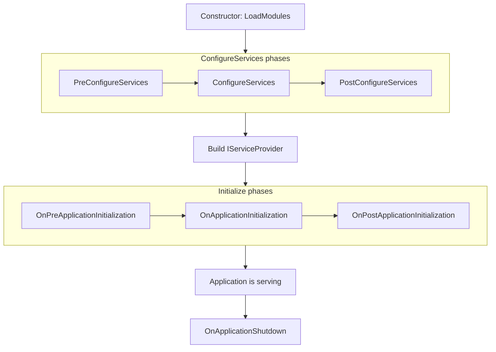

`AbpModule` is the abstract base class every ABP module derives from.
It does two things: it gives each module a place to register and
configure DI services in three ordered phases, and it gives each module
optional async + sync hooks for four lifecycle events. The
[`DependsOn` attribute](#dependsonattribute) is the declarative glue
that lets the kernel walk modules in dependency order.

Even though `IAbpModule` only requires two methods, every real module
inherits from `AbpModule` because the base class implements **all** six
configure interfaces and **all four** lifecycle interfaces as virtual
methods that do nothing by default. That makes derived modules
deliberately opt‑in: you override only what you care about.

<CardGroup cols={2}>
  <Card title="Application Base" icon="play" href="/framework/core/application-base">
    The host that calls into the methods documented here.
  </Card>
  <Card title="Modularity Internals" icon="diagram-project" href="/framework/core/modularity-internals">
    How the loader/manager dispatch into modules.
  </Card>
</CardGroup>

## The minimal contract

`IAbpModule` itself is intentionally tiny:

```csharp framework/src/Volo.Abp.Core/Volo/Abp/Modularity/IAbpModule.cs
namespace Volo.Abp.Modularity;

public interface IAbpModule
{
    Task ConfigureServicesAsync(ServiceConfigurationContext context);
    void ConfigureServices(ServiceConfigurationContext context);
}
```

The async variant exists so the kernel can build modules whose
configuration depends on awaitable work (e.g. loading certificates
from a remote secrets store). The sync variant exists so the same
module can be configured from a non‑async caller without copy‑pasting.

## Why `AbpModule` exists

`AbpModule` implements all of the optional interfaces below at once so
module authors do not have to repeatedly declare them:

```csharp framework/src/Volo.Abp.Core/Volo/Abp/Modularity/AbpModule.cs
public abstract class AbpModule :
    IAbpModule,
    IOnPreApplicationInitialization,
    IOnApplicationInitialization,
    IOnPostApplicationInitialization,
    IOnApplicationShutdown,
    IPreConfigureServices,
    IPostConfigureServices
{
    protected internal bool SkipAutoServiceRegistration { get; protected set; }

    protected internal ServiceConfigurationContext ServiceConfigurationContext
    {
        get
        {
            if (_serviceConfigurationContext == null)
            {
                throw new AbpException(
                    $"{nameof(ServiceConfigurationContext)} is only available in the " +
                    $"{nameof(ConfigureServices)}, {nameof(PreConfigureServices)} and " +
                    $"{nameof(PostConfigureServices)} methods.");
            }
            return _serviceConfigurationContext;
        }
        internal set => _serviceConfigurationContext = value;
    }

    private ServiceConfigurationContext? _serviceConfigurationContext;
```

Every interface implementation below is virtual; the default
`*Async` body forwards to the sync overload and returns
`Task.CompletedTask`. That means writing
`public override Task ConfigureServicesAsync(...)` is enough to swap in
an async body without breaking sync callers.

## The full virtual surface

The base class exposes 12 virtual methods grouped into three phases.

| Phase | Sync method | Async method | Interface |
| ----- | ----------- | ------------ | --------- |
| **Pre Configure** | `PreConfigureServices(ServiceConfigurationContext)` | `PreConfigureServicesAsync(...)` | `IPreConfigureServices` |
| **Configure** | `ConfigureServices(ServiceConfigurationContext)` | `ConfigureServicesAsync(...)` | `IAbpModule` |
| **Post Configure** | `PostConfigureServices(ServiceConfigurationContext)` | `PostConfigureServicesAsync(...)` | `IPostConfigureServices` |
| **Pre Initialize** | `OnPreApplicationInitialization(ApplicationInitializationContext)` | `OnPreApplicationInitializationAsync(...)` | `IOnPreApplicationInitialization` |
| **Initialize** | `OnApplicationInitialization(ApplicationInitializationContext)` | `OnApplicationInitializationAsync(...)` | `IOnApplicationInitialization` |
| **Post Initialize** | `OnPostApplicationInitialization(ApplicationInitializationContext)` | `OnPostApplicationInitializationAsync(...)` | `IOnPostApplicationInitialization` |
| **Shutdown** | `OnApplicationShutdown(ApplicationShutdownContext)` | `OnApplicationShutdownAsync(...)` | `IOnApplicationShutdown` |

The class implements them with empty bodies, so a derived module
overrides only the ones it needs:

```csharp framework/src/Volo.Abp.Core/Volo/Abp/Modularity/AbpModule.cs
public virtual Task PreConfigureServicesAsync(ServiceConfigurationContext context)
{
    PreConfigureServices(context);
    return Task.CompletedTask;
}

public virtual void PreConfigureServices(ServiceConfigurationContext context) { }

public virtual Task ConfigureServicesAsync(ServiceConfigurationContext context)
{
    ConfigureServices(context);
    return Task.CompletedTask;
}

public virtual void ConfigureServices(ServiceConfigurationContext context) { }

// PostConfigureServices / OnPreApplicationInitialization /
// OnApplicationInitialization / OnPostApplicationInitialization /
// OnApplicationShutdown follow the exact same pattern.
```

### When each phase runs



The configure phases run during `AbpApplicationBase.ConfigureServices`
(see [Application Base](/framework/core/application-base)). The
initialize phases run inside `InitializeModulesAsync`, after the
service provider has been built. Shutdown runs in reverse module order
inside `ShutdownModulesAsync`.

## The shared `ServiceConfigurationContext`

```csharp framework/src/Volo.Abp.Core/Volo/Abp/Modularity/ServiceConfigurationContext.cs
public class ServiceConfigurationContext
{
    public IServiceCollection Services { get; }
    public IDictionary<string, object?> Items { get; }

    public object? this[string key] { get; set; }

    public ServiceConfigurationContext(IServiceCollection services) { ... }
}
```

The instance is owned by `AbpApplicationBase`. It is shared across all
modules and all three configure phases, so a module that needs to pass
state to a later module can do so through `context.Items` or the
`context[string]` indexer. The `Services` property forwards to the same
`IServiceCollection` the application is being built into; modules
register their bindings through it.

Outside the three configure phases the base class throws when
`ServiceConfigurationContext` is read, which prevents accidental use
from a lifecycle hook where the collection has already been consumed by
`IServiceProviderFactory.Build`.

## `Configure<TOptions>` shortcuts

`AbpModule` exposes a handful of protected helpers that wrap
`Microsoft.Extensions.Options` so derived modules can configure options
with a one‑liner:

```csharp framework/src/Volo.Abp.Core/Volo/Abp/Modularity/AbpModule.cs
protected void Configure<TOptions>(Action<TOptions> configureOptions) where TOptions : class
    => ServiceConfigurationContext.Services.Configure(configureOptions);

protected void Configure<TOptions>(string name, Action<TOptions> configureOptions) where TOptions : class
    => ServiceConfigurationContext.Services.Configure(name, configureOptions);

protected void Configure<TOptions>(IConfiguration configuration) where TOptions : class
    => ServiceConfigurationContext.Services.Configure<TOptions>(configuration);

protected void Configure<TOptions>(IConfiguration configuration, Action<BinderOptions> configureBinder) where TOptions : class
    => ServiceConfigurationContext.Services.Configure<TOptions>(configuration, configureBinder);

protected void Configure<TOptions>(string name, IConfiguration configuration) where TOptions : class
    => ServiceConfigurationContext.Services.Configure<TOptions>(name, configuration);

protected void PreConfigure<TOptions>(Action<TOptions> configureOptions) where TOptions : class
    => ServiceConfigurationContext.Services.PreConfigure(configureOptions);

protected void PostConfigure<TOptions>(Action<TOptions> configureOptions) where TOptions : class
    => ServiceConfigurationContext.Services.PostConfigure(configureOptions);

protected void PostConfigureAll<TOptions>(Action<TOptions> configureOptions) where TOptions : class
    => ServiceConfigurationContext.Services.PostConfigureAll(configureOptions);
```

These are sugar; nothing prevents you from calling
`context.Services.Configure<TOptions>(...)` directly.

`PreConfigure` is interesting: it queues the action into ABP's
`PreConfigureActionList` for the options type so a later
`Configure<TOptions>` call still observes the pre‑configured values.
This is how, for example, `AbpAuthorizationOptions` is populated by
multiple modules deterministically.

## `SkipAutoServiceRegistration`

```csharp
protected internal bool SkipAutoServiceRegistration { get; protected set; }
```

If a module sets `SkipAutoServiceRegistration = true` in its
constructor, `AbpApplicationBase.ConfigureServices` skips
`Services.AddAssembly(...)` for the module's assemblies. The module
can still register its services manually inside `ConfigureServices`,
but the conventional registrar will not walk every type. The shutdown
of automatic registration is occasionally useful for narrow utility
modules that ship a single, hand‑registered service.

## `IsAbpModule` / `CheckAbpModuleType`

The module loader uses these helpers to decide whether a type can be
treated as a module:

```csharp framework/src/Volo.Abp.Core/Volo/Abp/Modularity/AbpModule.cs
public static bool IsAbpModule(Type type)
{
    var typeInfo = type.GetTypeInfo();

    return
        typeInfo.IsClass &&
        !typeInfo.IsAbstract &&
        !typeInfo.IsGenericType &&
        typeof(IAbpModule).GetTypeInfo().IsAssignableFrom(type);
}

internal static void CheckAbpModuleType(Type moduleType)
{
    if (!IsAbpModule(moduleType))
    {
        throw new ArgumentException(
            "Given type is not an ABP module: " + moduleType.AssemblyQualifiedName);
    }
}
```

Three rules: concrete class, non‑generic, implements `IAbpModule`.

## `[DependsOn]` attribute

```csharp framework/src/Volo.Abp.Core/Volo/Abp/Modularity/DependsOnAttribute.cs
[AttributeUsage(AttributeTargets.Class, AllowMultiple = true)]
public class DependsOnAttribute : Attribute, IDependedTypesProvider
{
    public Type[] DependedTypes { get; }

    public DependsOnAttribute(params Type[]? dependedTypes)
    {
        DependedTypes = dependedTypes ?? Type.EmptyTypes;
    }

    public virtual Type[] GetDependedTypes() => DependedTypes;
}
```

`AllowMultiple = true` so a module can split its dependencies across
multiple lines without merging them into a single attribute. The
attribute implements `IDependedTypesProvider`, which the loader reads
through reflection:

```csharp framework/src/Volo.Abp.Core/Volo/Abp/Modularity/AbpModuleHelper.cs
public static List<Type> FindDependedModuleTypes(Type moduleType)
{
    AbpModule.CheckAbpModuleType(moduleType);

    var dependencies = new List<Type>();

    var dependencyDescriptors = moduleType
        .GetCustomAttributes()
        .OfType<IDependedTypesProvider>();

    foreach (var descriptor in dependencyDescriptors)
    {
        foreach (var dependedModuleType in descriptor.GetDependedTypes())
        {
            dependencies.AddIfNotContains(dependedModuleType);
        }
    }

    return dependencies;
}
```

Any custom attribute that implements `IDependedTypesProvider`
participates in the dependency graph, not only `DependsOn`. The kernel
exploits the same hook with `AdditionalAssemblyAttribute` for assembly
discovery.

## A real module: `AbpDddDomainModule`

The DDD domain module is a tight example of every concept above
working together:

```csharp framework/src/Volo.Abp.Ddd.Domain/Volo/Abp/Domain/AbpDddDomainModule.cs
using Microsoft.Extensions.DependencyInjection;
using Volo.Abp.Auditing;
using Volo.Abp.Caching;
using Volo.Abp.Data;
using Volo.Abp.Domain.Repositories;
using Volo.Abp.EventBus;
using Volo.Abp.ExceptionHandling;
using Volo.Abp.Guids;
using Volo.Abp.Modularity;
using Volo.Abp.ObjectMapping;
using Volo.Abp.Specifications;
using Volo.Abp.Timing;

namespace Volo.Abp.Domain;

[DependsOn(
    typeof(AbpAuditingModule),
    typeof(AbpDataModule),
    typeof(AbpEventBusModule),
    typeof(AbpGuidsModule),
    typeof(AbpTimingModule),
    typeof(AbpObjectMappingModule),
    typeof(AbpExceptionHandlingModule),
    typeof(AbpSpecificationsModule),
    typeof(AbpCachingModule),
    typeof(AbpDddDomainSharedModule)
)]
public class AbpDddDomainModule : AbpModule
{
    public override void PreConfigureServices(ServiceConfigurationContext context)
    {
        context.Services.AddConventionalRegistrar(new AbpRepositoryConventionalRegistrar());
    }
}
```

Three things to notice:

1. **The class is `public class … : AbpModule`** with no other base type.
2. **`[DependsOn(...)]`** lists every sibling module the DDD domain
   contract relies on. The kernel guarantees those modules are
   initialized first.
3. **`PreConfigureServices`** adds a custom
   `IConventionalRegistrar` (`AbpRepositoryConventionalRegistrar`) so
   repositories discovered later in `ConfigureServices` go through the
   right registration code. It is a *Pre* configure because the
   conventional registrar list must be in place before
   `AbpApplicationBase` walks each module's `AllAssemblies` and calls
   `Services.AddAssembly(...)`.

## Lifecycle interfaces in one table

| Interface | When it fires | Notable consumers |
| --------- | ------------- | ----------------- |
| `IPreConfigureServices` | First configure phase, before `AddAssembly` | `AbpDddDomainModule` registers `AbpRepositoryConventionalRegistrar`. |
| `IAbpModule.ConfigureServices` | Main configure phase, after `AddAssembly` for the module | The standard place to call `context.Services.Configure<...>()`. |
| `IPostConfigureServices` | Final configure phase | Common pattern: lock down options that earlier phases populated. |
| `IOnPreApplicationInitialization` | First initialize pass | Background data seeding hosts (e.g. permission data seed). |
| `IOnApplicationInitialization` | Main initialize pass | The pipeline‑building method used by ASP.NET Core modules (`app.UseRouting()` etc.). |
| `IOnPostApplicationInitialization` | Final initialize pass | Sanity checks, "ready" health probes. |
| `IOnApplicationShutdown` | Reverse module order on shutdown | Flushing connections, persisting state. |

All four `IOn*Initialization` interfaces share the same shape:

```csharp framework/src/Volo.Abp.Core/Volo/Abp/IOnApplicationInitialization.cs
public interface IOnApplicationInitialization
{
    Task OnApplicationInitializationAsync([NotNull] ApplicationInitializationContext context);
    void OnApplicationInitialization([NotNull] ApplicationInitializationContext context);
}
```

```csharp framework/src/Volo.Abp.Core/Volo/Abp/Modularity/IOnPreApplicationInitialization.cs
public interface IOnPreApplicationInitialization
{
    Task OnPreApplicationInitializationAsync([NotNull] ApplicationInitializationContext context);
    void OnPreApplicationInitialization([NotNull] ApplicationInitializationContext context);
}
```

The corresponding shutdown contract:

```csharp framework/src/Volo.Abp.Core/Volo/Abp/IOnApplicationShutdown.cs
public interface IOnApplicationShutdown
{
    Task OnApplicationShutdownAsync([NotNull] ApplicationShutdownContext context);
    void OnApplicationShutdown([NotNull] ApplicationShutdownContext context);
}
```

## `IModuleLifecycleContributor`

Each of the four lifecycle interfaces is dispatched by a dedicated
`IModuleLifecycleContributor`. The contract reads:

```csharp framework/src/Volo.Abp.Core/Volo/Abp/Modularity/IModuleLifecycleContributor.cs
public interface IModuleLifecycleContributor : ITransientDependency
{
    Task InitializeAsync([NotNull] ApplicationInitializationContext context, [NotNull] IAbpModule module);
    void Initialize([NotNull] ApplicationInitializationContext context, [NotNull] IAbpModule module);
    Task ShutdownAsync([NotNull] ApplicationShutdownContext context, [NotNull] IAbpModule module);
    void Shutdown([NotNull] ApplicationShutdownContext context, [NotNull] IAbpModule module);
}
```

ABP ships four implementations that simply check for the matching
interface and forward:

```csharp framework/src/Volo.Abp.Core/Volo/Abp/Modularity/DefaultModuleLifecycleContributor.cs
public class OnPreApplicationInitializationModuleLifecycleContributor
    : ModuleLifecycleContributorBase
{
    public async override Task InitializeAsync(ApplicationInitializationContext context, IAbpModule module)
    {
        if (module is IOnPreApplicationInitialization onPreApplicationInitialization)
        {
            await onPreApplicationInitialization.OnPreApplicationInitializationAsync(context);
        }
    }

    public override void Initialize(ApplicationInitializationContext context, IAbpModule module)
    {
        (module as IOnPreApplicationInitialization)?.OnPreApplicationInitialization(context);
    }
}

public class OnApplicationInitializationModuleLifecycleContributor : ModuleLifecycleContributorBase { ... }
public class OnPostApplicationInitializationModuleLifecycleContributor : ModuleLifecycleContributorBase { ... }
public class OnApplicationShutdownModuleLifecycleContributor : ModuleLifecycleContributorBase { ... }
```

`AbpApplicationBase` registers these four contributors via
`AbpModuleLifecycleOptions.Contributors`, in the order shown above.
That order is what defines pre/main/post semantics — there is no other
gate. If you wanted to insert a fifth phase, you would write a custom
`IModuleLifecycleContributor` and add it to that list.

## `AbpModuleDescriptor`

The loader wraps every module instance in an `AbpModuleDescriptor` so
the manager can iterate dependencies cheaply:

```csharp framework/src/Volo.Abp.Core/Volo/Abp/Modularity/AbpModuleDescriptor.cs
public class AbpModuleDescriptor : IAbpModuleDescriptor
{
    public Type Type { get; }
    public Assembly Assembly { get; }
    public Assembly[] AllAssemblies { get; }
    public IAbpModule Instance { get; }
    public bool IsLoadedAsPlugIn { get; }
    public IReadOnlyList<IAbpModuleDescriptor> Dependencies => _dependencies.ToImmutableList();
    private readonly List<IAbpModuleDescriptor> _dependencies;

    public AbpModuleDescriptor([NotNull] Type type, [NotNull] IAbpModule instance, bool isLoadedAsPlugIn)
    {
        Check.NotNull(type, nameof(type));
        Check.NotNull(instance, nameof(instance));
        AbpModule.CheckAbpModuleType(type);

        if (!type.GetTypeInfo().IsAssignableFrom(instance.GetType()))
        {
            throw new ArgumentException(
                $"Given module instance ({instance.GetType().AssemblyQualifiedName}) is not an " +
                $"instance of given module type: {type.AssemblyQualifiedName}");
        }

        Type = type;
        Assembly = type.Assembly;
        AllAssemblies = AbpModuleHelper.GetAllAssemblies(type);
        Instance = instance;
        IsLoadedAsPlugIn = isLoadedAsPlugIn;
        _dependencies = new List<IAbpModuleDescriptor>();
    }

    public void AddDependency(IAbpModuleDescriptor descriptor) => _dependencies.AddIfNotContains(descriptor);

    public override string ToString() => $"[AbpModuleDescriptor {Type.FullName}]";
}
```

`AllAssemblies` comes from `AbpModuleHelper.GetAllAssemblies`, which
walks all `IAdditionalModuleAssemblyProvider` attributes — most
commonly `[AdditionalAssembly(typeof(SomeOtherType))]` — so a single
module can pull in service registrations from multiple assemblies.

## Authoring patterns

The kernel encourages a few habits when writing modules.

| Concern | Pattern |
| ------- | ------- |
| Add an `IConventionalRegistrar` | `PreConfigureServices` so it runs before `AddAssembly`. |
| Register services | `ConfigureServices` (sync or async). |
| Lock down options or register decorators | `PostConfigureServices`. |
| Build a middleware pipeline | `OnApplicationInitialization` in an ASP.NET module. |
| Run async startup work | `OnPreApplicationInitializationAsync` or `OnApplicationInitializationAsync`. |
| Flush queues, cancel hosted services | `OnApplicationShutdownAsync`. |
| Skip conventional registration | Set `SkipAutoServiceRegistration = true` in the constructor. |

A module never opens scopes or resolves services directly during
configure phases — the context's `IServiceCollection` is mutated, not
the provider. The provider only exists after `ConfigureServices` has
completed and `AbpApplicationBase` builds it.

## Take‑aways

- `IAbpModule` has two methods, but `AbpModule` ships virtual hooks
  for every lifecycle phase the kernel knows about.
- The configure phases share a single `ServiceConfigurationContext`;
  the initialize phases share a single `ApplicationInitializationContext`.
- `[DependsOn]` is the only declarative dependency syntax the kernel
  understands, and it works through `IDependedTypesProvider` so custom
  attributes can extend the graph.
- Four `IModuleLifecycleContributor` implementations dispatch the
  pre/main/post initialize and shutdown interfaces in that order; the
  ordering is configurable via `AbpModuleLifecycleOptions.Contributors`.

<Card title="Next: Plug-In modules" icon="arrow-right" href="/framework/core/plug-ins">
  How dynamic assemblies feed extra modules into the same lifecycle.
</Card>
