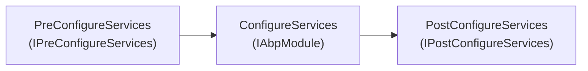
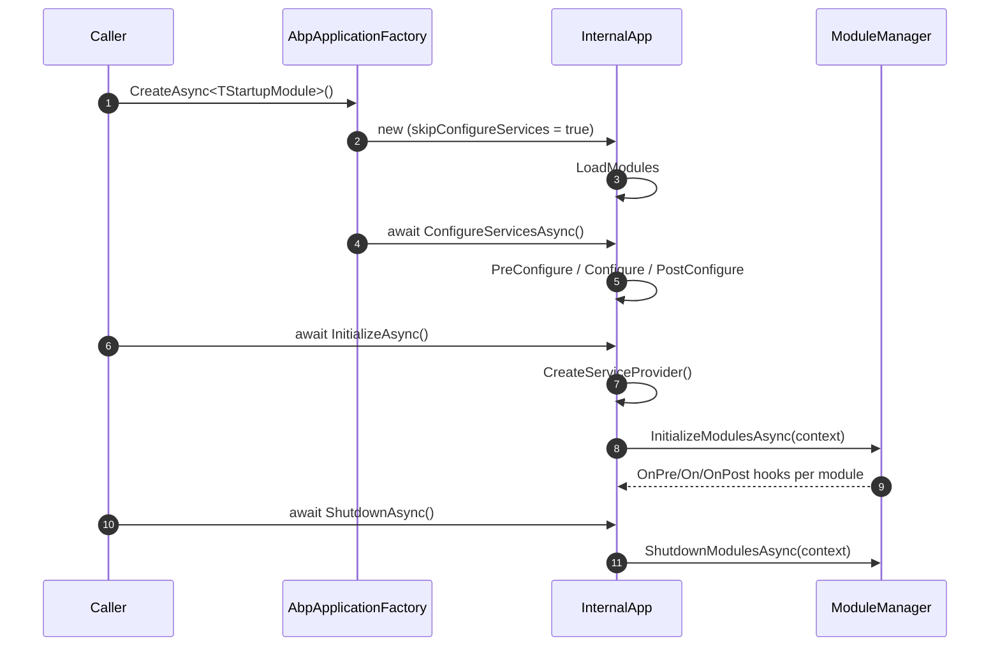
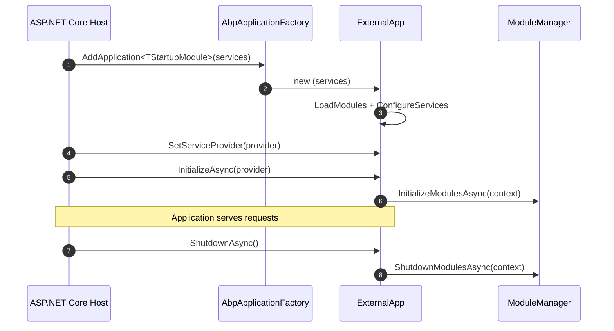

`AbpApplicationBase` is the abstract host that every ABP application
ultimately runs through. Its constructor pulls together the module
loader, the service collection, the host environment, and the plug‑in
sources; its methods drive the three‑phase service configuration and
the lifecycle hooks every `AbpModule` exposes. Two thin subclasses,
`AbpApplicationWithInternalServiceProvider` and
`AbpApplicationWithExternalServiceProvider`, decide whether the host
builds its own `IServiceProvider` from a `ServiceCollection` or accepts
one supplied by an existing host (typically ASP.NET Core's generic
host).

The public entry point users actually call is
`AbpApplicationFactory.Create` / `CreateAsync`. The factory chooses
which subclass to instantiate based on the overload you pick.

<CardGroup cols={2}>
  <Card title="AbpModule" icon="cubes" href="/framework/core/abp-module">
    The virtual methods invoked across the lifecycle below.
  </Card>
  <Card title="Modularity Internals" icon="diagram-project" href="/framework/core/modularity-internals">
    How `ModuleLoader` and `ModuleManager` plug in.
  </Card>
</CardGroup>

## Public contracts

Three interfaces describe the host from the outside.

| Interface | Members of note | Used by |
| --------- | --------------- | ------- |
| `IAbpApplication` | `StartupModuleType`, `Services`, `ServiceProvider`, `ConfigureServicesAsync`, `ShutdownAsync`, `Shutdown` | All callers — the contract is enough to drive a host. |
| `IAbpApplicationWithInternalServiceProvider` | adds `CreateServiceProvider`, `Initialize`, `InitializeAsync` | Console apps and tests that own the entire DI container. |
| `IAbpApplicationWithExternalServiceProvider` | adds `SetServiceProvider`, `Initialize(serviceProvider)`, `InitializeAsync(serviceProvider)` | ASP.NET Core hosts (the host builds the provider and hands it in). |

```csharp framework/src/Volo.Abp.Core/Volo/Abp/IAbpApplication.cs
public interface IAbpApplication :
    IModuleContainer,
    IApplicationInfoAccessor,
    IDisposable
{
    Type StartupModuleType { get; }
    IServiceCollection Services { get; }
    IServiceProvider ServiceProvider { get; }
    Task ConfigureServicesAsync();
    Task ShutdownAsync();
    void Shutdown();
}
```

`IAbpApplication` itself implements `IModuleContainer` (so the host is
the source of truth for `Modules`) and `IApplicationInfoAccessor`
(`ApplicationName`, `InstanceId`).

## Fields on `AbpApplicationBase`

```csharp framework/src/Volo.Abp.Core/Volo/Abp/AbpApplicationBase.cs
public abstract class AbpApplicationBase : IAbpApplication
{
    [NotNull] public Type StartupModuleType { get; }
    public IServiceProvider ServiceProvider { get; private set; } = default!;
    public IServiceCollection Services { get; }
    public IReadOnlyList<IAbpModuleDescriptor> Modules { get; }
    public string? ApplicationName { get; }
    public string InstanceId { get; } = Guid.NewGuid().ToString();
    private bool _configuredServices;
```

| Member | Notes |
| ------ | ----- |
| `StartupModuleType` | The root of the module graph; passed to `ModuleLoader.LoadModules`. |
| `ServiceProvider` | Set later, either by `CreateServiceProvider` (internal variant) or `SetServiceProvider` (external variant). |
| `Services` | The `IServiceCollection` the host registers services into. |
| `Modules` | Topologically sorted module descriptors, with the startup module last. |
| `ApplicationName` | Pulled from options, then `IConfiguration["ApplicationName"]`, then the entry assembly name. |
| `InstanceId` | Fresh GUID per process — useful for distributed tracing and the cluster scenarios in `Volo.Abp.AspNetCore`. |
| `_configuredServices` | Latch that prevents `ConfigureServices` from being invoked twice. |

## The constructor

```csharp framework/src/Volo.Abp.Core/Volo/Abp/AbpApplicationBase.cs
internal AbpApplicationBase(
    [NotNull] Type startupModuleType,
    [NotNull] IServiceCollection services,
    Action<AbpApplicationCreationOptions>? optionsAction)
{
    Check.NotNull(startupModuleType, nameof(startupModuleType));
    Check.NotNull(services, nameof(services));

    StartupModuleType = startupModuleType;
    Services = services;

    services.TryAddObjectAccessor<IServiceProvider>();

    var options = new AbpApplicationCreationOptions(services);
    optionsAction?.Invoke(options);

    ApplicationName = GetApplicationName(options);

    services.AddSingleton<IAbpApplication>(this);
    services.AddSingleton<IApplicationInfoAccessor>(this);
    services.AddSingleton<IModuleContainer>(this);
    services.AddSingleton<IAbpHostEnvironment>(new AbpHostEnvironment()
    {
        EnvironmentName = options.Environment
    });

    services.AddCoreServices();
    services.AddCoreAbpServices(this, options);

    Modules = LoadModules(services, options);

    if (!options.SkipConfigureServices)
    {
        ConfigureServices();
    }
}
```

Step by step:

1. **Guard arguments** with `Check.NotNull`.
2. **Reserve an object accessor for `IServiceProvider`** — set later by
   `SetServiceProvider` so any service that needs the root provider can
   resolve it indirectly through `IObjectAccessor<IServiceProvider>`.
3. **Build the options bag** and let the caller mutate it.
4. **Compute `ApplicationName`** via `GetApplicationName(options)`:
   first the explicit `options.ApplicationName`, then
   `IConfiguration["ApplicationName"]`, then the entry assembly name.
5. **Register itself** as `IAbpApplication`, `IApplicationInfoAccessor`,
   and `IModuleContainer` singletons.
6. **Register the host environment** with whatever the options set —
   `TryToSetEnvironment` later replaces empty values with
   `Environments.Production`.
7. **`AddCoreServices`** turns on options/logging/localization from
   Microsoft.Extensions. **`AddCoreAbpServices`** wires the module
   loader, assembly/type finders, init logger, conventional registrar,
   simple state checker manager, and the four module lifecycle
   contributors.
8. **`LoadModules`** runs the discovery and topological sort.
9. Unless `SkipConfigureServices` is set, the constructor calls
   `ConfigureServices` synchronously.

`SkipConfigureServices` matters because the async factory paths
(`CreateAsync`) need to invoke `ConfigureServicesAsync` after the
constructor returns. Passing `SkipConfigureServices = true` from
inside the factory lets the user's async configure delegate run on the
right phase.

## Module loading

```csharp framework/src/Volo.Abp.Core/Volo/Abp/AbpApplicationBase.cs
protected virtual IReadOnlyList<IAbpModuleDescriptor> LoadModules(
    IServiceCollection services,
    AbpApplicationCreationOptions options)
{
    return services
        .GetSingletonInstance<IModuleLoader>()
        .LoadModules(
            services,
            StartupModuleType,
            options.PlugInSources
        );
}
```

The loader returns descriptors sorted so that dependencies precede
their dependents and the startup module sits last (see
[Modularity Internals](/framework/core/modularity-internals)).

## `ConfigureServices` — the three‑phase pipeline

`ConfigureServices` runs in three passes, each scoped to a different
interface module authors can implement:



Between each pass `AbpApplicationBase` also calls
`Services.AddAssembly(assembly)` for every assembly listed in every
module's `AllAssemblies` (unless the module sets
`SkipAutoServiceRegistration = true`). That single call dispatches to
the conventional registrar list, which is what makes
`ITransientDependency` / `IScopedDependency` / `ISingletonDependency`
work without an explicit registration.

The synchronous variant looks like this (the async overload is
identical except for `await` on each module method):

```csharp framework/src/Volo.Abp.Core/Volo/Abp/AbpApplicationBase.cs
public virtual void ConfigureServices()
{
    CheckMultipleConfigureServices();

    var context = new ServiceConfigurationContext(Services);
    Services.AddSingleton(context);

    foreach (var module in Modules)
    {
        if (module.Instance is AbpModule abpModule)
        {
            abpModule.ServiceConfigurationContext = context;
        }
    }

    foreach (var module in Modules.Where(m => m.Instance is IPreConfigureServices))
    {
        try { ((IPreConfigureServices)module.Instance).PreConfigureServices(context); }
        catch (Exception ex)
        {
            throw new AbpInitializationException($"... PreConfigureServices ... {module.Type.AssemblyQualifiedName}", ex);
        }
    }

    var assemblies = new HashSet<Assembly>();

    foreach (var module in Modules)
    {
        if (module.Instance is AbpModule abpModule && !abpModule.SkipAutoServiceRegistration)
        {
            foreach (var assembly in module.AllAssemblies)
            {
                if (assemblies.Add(assembly))
                {
                    Services.AddAssembly(assembly);
                }
            }
        }
        try { module.Instance.ConfigureServices(context); }
        catch (Exception ex)
        {
            throw new AbpInitializationException($"... ConfigureServices ... {module.Type.AssemblyQualifiedName}", ex);
        }
    }

    foreach (var module in Modules.Where(m => m.Instance is IPostConfigureServices))
    {
        try { ((IPostConfigureServices)module.Instance).PostConfigureServices(context); }
        catch (Exception ex)
        {
            throw new AbpInitializationException($"... PostConfigureServices ... {module.Type.AssemblyQualifiedName}", ex);
        }
    }

    foreach (var module in Modules)
    {
        if (module.Instance is AbpModule abpModule)
        {
            abpModule.ServiceConfigurationContext = null!;
        }
    }

    _configuredServices = true;

    TryToSetEnvironment(Services);
}
```

Three observations:

- The same `ServiceConfigurationContext` is reused across the three
  phases so modules that publish state into the context during
  `PreConfigureServices` can read it back from `ConfigureServices`.
- After the phases complete, `ServiceConfigurationContext` is detached
  from each module so any subsequent attempt to read it from inside a
  lifecycle hook throws the descriptive `AbpException` baked into
  `AbpModule.ServiceConfigurationContext`'s getter.
- Any thrown exception is wrapped in `AbpInitializationException` with
  the offending module's assembly‑qualified name in the message, then
  rethrown — the original exception is the `InnerException`.

`CheckMultipleConfigureServices` enforces the latch:

```csharp framework/src/Volo.Abp.Core/Volo/Abp/AbpApplicationBase.cs
private void CheckMultipleConfigureServices()
{
    if (_configuredServices)
    {
        throw new AbpInitializationException(
            "Services have already been configured! If you call ConfigureServicesAsync method, " +
            "you must have set AbpApplicationCreationOptions.SkipConfigureServices to true before.");
    }
}
```

## `InitializeModulesAsync` — the lifecycle pass

After the service provider exists, the host opens a scope, fetches
`IModuleManager`, and lets it walk the four lifecycle contributors:

```csharp framework/src/Volo.Abp.Core/Volo/Abp/AbpApplicationBase.cs
protected virtual async Task InitializeModulesAsync()
{
    using (var scope = ServiceProvider.CreateScope())
    {
        WriteInitLogs(scope.ServiceProvider);
        await scope.ServiceProvider
            .GetRequiredService<IModuleManager>()
            .InitializeModulesAsync(new ApplicationInitializationContext(scope.ServiceProvider));
    }
}
```

`WriteInitLogs` drains entries the kernel buffered through
`IInitLoggerFactory` before DI was ready, replaying them through the
real `ILogger<AbpApplicationBase>` so users see them in their
application logs.

## `ShutdownAsync`

Shutdown mirrors initialization but walks the modules in reverse:

```csharp framework/src/Volo.Abp.Core/Volo/Abp/AbpApplicationBase.cs
public virtual async Task ShutdownAsync()
{
    using (var scope = ServiceProvider.CreateScope())
    {
        await scope.ServiceProvider
            .GetRequiredService<IModuleManager>()
            .ShutdownModulesAsync(new ApplicationShutdownContext(scope.ServiceProvider));
    }
}
```

`ModuleManager.ShutdownModulesAsync` reverses the list before invoking
the contributors, so the last‑initialized module is the
first‑shut‑down.

`Dispose` on the base type is intentionally minimal — the subclasses
override it to dispose either the internally owned scope or the
external service provider.

```csharp framework/src/Volo.Abp.Core/Volo/Abp/AbpApplicationBase.cs
public virtual void Dispose()
{
    //TODO: Shutdown if not done before?
}
```

## `AbpApplicationCreationOptions`

```csharp framework/src/Volo.Abp.Core/Volo/Abp/AbpApplicationCreationOptions.cs
public class AbpApplicationCreationOptions
{
    [NotNull] public IServiceCollection Services { get; }
    [NotNull] public PlugInSourceList PlugInSources { get; }

    /// <summary>
    /// The options in this property only take effect when IConfiguration not registered.
    /// </summary>
    [NotNull] public AbpConfigurationBuilderOptions Configuration { get; }

    public bool SkipConfigureServices { get; set; }
    public string? ApplicationName { get; set; }
    public string? Environment { get; set; }

    public AbpApplicationCreationOptions([NotNull] IServiceCollection services)
    {
        Services = Check.NotNull(services, nameof(services));
        PlugInSources = new PlugInSourceList();
        Configuration = new AbpConfigurationBuilderOptions();
    }
}
```

| Property | Used by |
| -------- | ------- |
| `Services` | Exposed to callers so an options delegate can perform last‑moment registrations. |
| `PlugInSources` | Consumed by `ModuleLoader.LoadModules` ([Plug‑Ins](/framework/core/plug-ins)). |
| `Configuration` | Forwarded to `ConfigurationHelper.BuildConfiguration` if no `IConfiguration` is yet registered. |
| `SkipConfigureServices` | When `true`, the constructor returns without running `ConfigureServices`; the caller (or `AbpApplicationFactory.CreateAsync`) must drive it. |
| `ApplicationName` | First fallback for `GetApplicationName`. |
| `Environment` | Seeds `AbpHostEnvironment.EnvironmentName`; `TryToSetEnvironment` defaults it to `Production` if empty. |

## The factory

`AbpApplicationFactory` is the only public way to instantiate the
sealed `internal` subclasses, and it provides four shapes of overloads:

```csharp framework/src/Volo.Abp.Core/Volo/Abp/AbpApplicationFactory.cs
public static IAbpApplicationWithInternalServiceProvider Create<TStartupModule>(
    Action<AbpApplicationCreationOptions>? optionsAction = null)
    where TStartupModule : IAbpModule
{
    return Create(typeof(TStartupModule), optionsAction);
}

public static IAbpApplicationWithInternalServiceProvider Create(
    [NotNull] Type startupModuleType,
    Action<AbpApplicationCreationOptions>? optionsAction = null)
{
    return new AbpApplicationWithInternalServiceProvider(startupModuleType, optionsAction);
}

public static IAbpApplicationWithExternalServiceProvider Create<TStartupModule>(
    [NotNull] IServiceCollection services,
    Action<AbpApplicationCreationOptions>? optionsAction = null)
    where TStartupModule : IAbpModule
{
    return Create(typeof(TStartupModule), services, optionsAction);
}

public static IAbpApplicationWithExternalServiceProvider Create(
    [NotNull] Type startupModuleType,
    [NotNull] IServiceCollection services,
    Action<AbpApplicationCreationOptions>? optionsAction = null)
{
    return new AbpApplicationWithExternalServiceProvider(startupModuleType, services, optionsAction);
}
```

The async variants follow the same shape but flip
`options.SkipConfigureServices = true` before invoking the user delegate
and then await `app.ConfigureServicesAsync()`:

```csharp framework/src/Volo.Abp.Core/Volo/Abp/AbpApplicationFactory.cs
public async static Task<IAbpApplicationWithInternalServiceProvider> CreateAsync(
    [NotNull] Type startupModuleType,
    Action<AbpApplicationCreationOptions>? optionsAction = null)
{
    var app = new AbpApplicationWithInternalServiceProvider(startupModuleType, options =>
    {
        options.SkipConfigureServices = true;
        optionsAction?.Invoke(options);
    });
    await app.ConfigureServicesAsync();
    return app;
}
```

| Overload | Returns | When to use |
| -------- | ------- | ----------- |
| `Create<TModule>()` | Internal SP | Console / desktop app that owns the entire DI container. |
| `Create(Type)` | Internal SP | Same as above but startup type is dynamic. |
| `Create<TModule>(IServiceCollection)` | External SP | ASP.NET Core / generic host scenarios where the host builds the provider. |
| `Create(Type, IServiceCollection)` | External SP | Same as above with dynamic startup type. |
| `CreateAsync(...)` | `Task<>` of the above | Identical, but lets module authors implement `*Async` configure methods. |

## Internal service provider variant

```csharp framework/src/Volo.Abp.Core/Volo/Abp/AbpApplicationWithInternalServiceProvider.cs
internal class AbpApplicationWithInternalServiceProvider :
    AbpApplicationBase, IAbpApplicationWithInternalServiceProvider
{
    public IServiceScope? ServiceScope { get; private set; }

    public AbpApplicationWithInternalServiceProvider(
        [NotNull] Type startupModuleType,
        Action<AbpApplicationCreationOptions>? optionsAction)
        : this(startupModuleType, new ServiceCollection(), optionsAction) { }

    private AbpApplicationWithInternalServiceProvider(
        [NotNull] Type startupModuleType,
        [NotNull] IServiceCollection services,
        Action<AbpApplicationCreationOptions>? optionsAction)
        : base(startupModuleType, services, optionsAction)
    {
        Services.AddSingleton<IAbpApplicationWithInternalServiceProvider>(this);
    }

    public IServiceProvider CreateServiceProvider()
    {
        if (ServiceProvider != null) return ServiceProvider;

        ServiceScope = Services.BuildServiceProviderFromFactory().CreateScope();
        SetServiceProvider(ServiceScope.ServiceProvider);

        return ServiceProvider!;
    }

    public async Task InitializeAsync()
    {
        CreateServiceProvider();
        await InitializeModulesAsync();
    }

    public void Initialize()
    {
        CreateServiceProvider();
        InitializeModules();
    }

    public override void Dispose()
    {
        base.Dispose();
        ServiceScope?.Dispose();
    }
}
```

Highlights:

- The public constructor allocates a fresh `ServiceCollection` so the
  caller does not have to.
- `CreateServiceProvider` uses
  `Services.BuildServiceProviderFromFactory()` (an ABP extension that
  honours any custom `IServiceProviderFactory` registered, including
  Castle Windsor / Autofac integrations) and immediately opens a
  root‑level scope. The scoped provider is what `SetServiceProvider`
  publishes to the rest of the framework.
- `Dispose` disposes the owned scope, which in turn disposes the
  provider.

## External service provider variant

```csharp framework/src/Volo.Abp.Core/Volo/Abp/AbpApplicationWithExternalServiceProvider.cs
internal class AbpApplicationWithExternalServiceProvider :
    AbpApplicationBase, IAbpApplicationWithExternalServiceProvider
{
    public AbpApplicationWithExternalServiceProvider(
        [NotNull] Type startupModuleType,
        [NotNull] IServiceCollection services,
        Action<AbpApplicationCreationOptions>? optionsAction)
        : base(startupModuleType, services, optionsAction)
    {
        services.AddSingleton<IAbpApplicationWithExternalServiceProvider>(this);
    }

    void IAbpApplicationWithExternalServiceProvider.SetServiceProvider(
        [NotNull] IServiceProvider serviceProvider)
    {
        Check.NotNull(serviceProvider, nameof(serviceProvider));

        if (ServiceProvider != null)
        {
            if (ServiceProvider != serviceProvider)
                throw new AbpException("Service provider was already set before to another service provider instance.");
            return;
        }

        SetServiceProvider(serviceProvider);
    }

    public async Task InitializeAsync(IServiceProvider serviceProvider)
    {
        Check.NotNull(serviceProvider, nameof(serviceProvider));
        SetServiceProvider(serviceProvider);
        await InitializeModulesAsync();
    }

    public void Initialize([NotNull] IServiceProvider serviceProvider)
    {
        Check.NotNull(serviceProvider, nameof(serviceProvider));
        SetServiceProvider(serviceProvider);
        InitializeModules();
    }

    public override void Dispose()
    {
        base.Dispose();

        if (ServiceProvider is IDisposable disposableServiceProvider)
        {
            disposableServiceProvider.Dispose();
        }
    }
}
```

Highlights:

- The constructor takes an existing `IServiceCollection` because the
  caller already has one (ASP.NET Core's `builder.Services`).
- `SetServiceProvider` is idempotent: passing the same instance twice
  is a no‑op; passing a different one throws.
- `Dispose` disposes the supplied provider if it is `IDisposable`,
  which is normally true for ASP.NET Core hosts when the framework
  itself owns shutdown.

## Two reference flows

The diagrams below show the two end‑to‑end paths through the host.





## How `ApplicationName` and `Environment` are resolved

`GetApplicationName` walks three fallbacks:

```csharp framework/src/Volo.Abp.Core/Volo/Abp/AbpApplicationBase.cs
private static string? GetApplicationName(AbpApplicationCreationOptions options)
{
    if (!string.IsNullOrWhiteSpace(options.ApplicationName))
        return options.ApplicationName!;

    var configuration = options.Services.GetConfigurationOrNull();
    if (configuration != null)
    {
        var appNameConfig = configuration["ApplicationName"];
        if (!string.IsNullOrWhiteSpace(appNameConfig))
            return appNameConfig!;
    }

    var entryAssembly = Assembly.GetEntryAssembly();
    if (entryAssembly != null)
        return entryAssembly.GetName().Name;

    return null;
}
```

Environment defaults are handled after `ConfigureServices` runs, so user
modules that pre‑configure the host environment win:

```csharp framework/src/Volo.Abp.Core/Volo/Abp/AbpApplicationBase.cs
private static void TryToSetEnvironment(IServiceCollection services)
{
    var abpHostEnvironment = services.GetSingletonInstance<IAbpHostEnvironment>();
    if (abpHostEnvironment.EnvironmentName.IsNullOrWhiteSpace())
    {
        abpHostEnvironment.EnvironmentName = Environments.Production;
    }
}
```

`Environments.Production` is the constant from
`Microsoft.Extensions.Hosting.Abstractions`.

## Error wrapping

Any exception raised inside a module's configure or initialize hook is
caught, wrapped in `AbpInitializationException`, and rethrown with a
description that names the offending module. Shutdown errors wrap the
same way through `AbpShutdownException`. The original exception is
preserved as `InnerException`, so debuggers see the full call stack.

| Outer exception | Phase | Caused by |
| --------------- | ----- | --------- |
| `AbpInitializationException` | `PreConfigureServices`, `ConfigureServices`, `PostConfigureServices`, lifecycle init contributor | Module configure/initialize failure. |
| `AbpShutdownException` | Lifecycle shutdown contributor | Module shutdown failure. |
| `AbpException` | `SetServiceProvider` | Attempting to set a second, different `IServiceProvider`. |

## Take‑aways

- `AbpApplicationBase` does two big things: it walks the module graph
  through `IModuleLoader`, and it runs the three‑phase configure
  pipeline that ABP modules participate in.
- The two subclasses exist so the framework can serve both a "host
  builds everything" model and an "external host hands us the provider"
  model without giving up the same initialization semantics.
- `AbpApplicationFactory` is the single entry point users should call;
  the rest of the kernel discovers state by resolving
  `IAbpApplication`, `IModuleContainer`, or `IApplicationInfoAccessor`
  from DI.

<Card title="Next: AbpModule" icon="arrow-right" href="/framework/core/abp-module">
  Walk the virtual methods and lifecycle interfaces that
  `AbpApplicationBase` calls into.
</Card>
