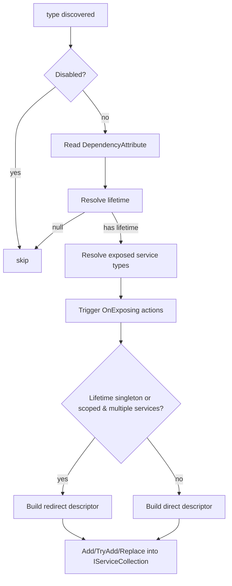

ABP layers a small set of conventions on top of
`Microsoft.Extensions.DependencyInjection`. They are intentionally
shallow — every binding still ends up as a `ServiceDescriptor` inside
the same `IServiceCollection` — but they remove the need to write a
registration line for every class. Three marker interfaces choose the
lifetime, `[ExposeServices]` chooses the public service types,
`[Dependency]` overrides the conventions, and a `DefaultConventionalRegistrar`
walks every assembly to apply them.

This page walks every file under
`framework/src/Volo.Abp.Core/Volo/Abp/DependencyInjection/` together
with the matching extension methods that sit in
`Microsoft.Extensions.DependencyInjection`.

<CardGroup cols={2}>
  <Card title="Application Base" icon="play" href="/framework/core/application-base">
    Where `AddAssembly` is called for every module.
  </Card>
  <Card title="Dynamic Proxy" icon="link" href="/framework/core/dynamic-proxy-aspects">
    Interceptors registered through `OnRegistered` actions.
  </Card>
</CardGroup>

## Lifetime markers

Three empty interfaces are the entire lifetime DSL. Any class that
implements one of them is registered with the matching lifetime when
the conventional registrar scans the assembly.

```csharp framework/src/Volo.Abp.Core/Volo/Abp/DependencyInjection/ITransientDependency.cs
namespace Volo.Abp.DependencyInjection;

public interface ITransientDependency { }
```

```csharp framework/src/Volo.Abp.Core/Volo/Abp/DependencyInjection/IScopedDependency.cs
namespace Volo.Abp.DependencyInjection;

public interface IScopedDependency { }
```

```csharp framework/src/Volo.Abp.Core/Volo/Abp/DependencyInjection/ISingletonDependency.cs
namespace Volo.Abp.DependencyInjection;

public interface ISingletonDependency { }
```

| Marker | Lifetime | When to use |
| ------ | -------- | ----------- |
| `ITransientDependency` | `Transient` | Stateless helpers, request validators, app services. |
| `IScopedDependency` | `Scoped` | Per-request workers (DbContext wrappers, unit-of-work scoped state). |
| `ISingletonDependency` | `Singleton` | Caches, in-memory dictionaries, factories. |

The interfaces are **inherited**, so a base class can fix the lifetime
for a hierarchy and concrete subclasses do not need to repeat the
marker.

## `[Dependency]` overrides

`DependencyAttribute` lets a class override the convention without
moving off the markers entirely.

```csharp framework/src/Volo.Abp.Core/Volo/Abp/DependencyInjection/DependencyAttribute.cs
public class DependencyAttribute : Attribute
{
    public virtual ServiceLifetime? Lifetime { get; set; }
    public virtual bool TryRegister { get; set; }
    public virtual bool ReplaceServices { get; set; }

    public DependencyAttribute() { }

    public DependencyAttribute(ServiceLifetime lifetime)
    {
        Lifetime = lifetime;
    }
}
```

| Property | Effect |
| -------- | ------ |
| `Lifetime` | Explicit lifetime, beats the marker interface. |
| `TryRegister` | Uses `services.TryAdd(...)` so the registration is skipped if one already exists. |
| `ReplaceServices` | Uses `services.Replace(...)` so an existing registration is removed and re-added. |

The conventional registrar reads the attribute in `GetLifeTimeOrNull`:

```csharp framework/src/Volo.Abp.Core/Volo/Abp/DependencyInjection/ConventionalRegistrarBase.cs
protected virtual ServiceLifetime? GetLifeTimeOrNull(Type type, DependencyAttribute? dependencyAttribute)
{
    return dependencyAttribute?.Lifetime
        ?? GetServiceLifetimeFromClassHierarchy(type)
        ?? GetDefaultLifeTimeOrNull(type);
}
```

The order is `[Dependency]` &rarr; marker interface &rarr; null (skip).
`GetDefaultLifeTimeOrNull` returns `null` in the base implementation,
so a class without any of the above signals is left unregistered.

## `[ExposeServices]` and the default policy

`ExposeServicesAttribute` chooses which service types a class is
registered as.

```csharp framework/src/Volo.Abp.Core/Volo/Abp/DependencyInjection/ExposeServicesAttribute.cs
public class ExposeServicesAttribute : Attribute, IExposedServiceTypesProvider
{
    public Type[] ServiceTypes { get; }
    public bool IncludeDefaults { get; set; }
    public bool IncludeSelf { get; set; }

    public ExposeServicesAttribute(params Type[] serviceTypes)
    {
        ServiceTypes = serviceTypes ?? Type.EmptyTypes;
    }

    public Type[] GetExposedServiceTypes(Type targetType) { ... }

    private static List<Type> GetDefaultServices(Type type)
    {
        var serviceTypes = new List<Type>();
        foreach (var interfaceType in type.GetTypeInfo().GetInterfaces())
        {
            var interfaceName = interfaceType.Name;
            if (interfaceType.IsGenericType)
                interfaceName = interfaceType.Name.Left(interfaceType.Name.IndexOf('`'));
            if (interfaceName.StartsWith("I"))
                interfaceName = interfaceName.Right(interfaceName.Length - 1);
            if (type.Name.EndsWith(interfaceName))
                serviceTypes.Add(interfaceType);
        }
        return serviceTypes;
    }
}
```

If the class has no `[ExposeServices]`, `ExposedServiceExplorer`
substitutes a default attribute with `IncludeDefaults = true` and
`IncludeSelf = true`:

```csharp framework/src/Volo.Abp.Core/Volo/Abp/DependencyInjection/ExposedServiceExplorer.cs
public static class ExposedServiceExplorer
{
    private static readonly ExposeServicesAttribute DefaultExposeServicesAttribute =
        new ExposeServicesAttribute
        {
            IncludeDefaults = true,
            IncludeSelf = true
        };

    public static List<Type> GetExposedServices(Type type)
    {
        return type
            .GetCustomAttributes(true)
            .OfType<IExposedServiceTypesProvider>()
            .DefaultIfEmpty(DefaultExposeServicesAttribute)
            .SelectMany(p => p.GetExposedServiceTypes(type))
            .Distinct()
            .ToList();
    }
}
```

The default policy is "register as the class itself plus every
interface whose name suffix matches the class name". So
`MyAppService : IMyAppService, IDisposable` is registered as
`MyAppService` and `IMyAppService` but not `IDisposable`.

## `[DisableConventionalRegistration]`

A class can opt out of conventional registration entirely:

```csharp framework/src/Volo.Abp.Core/Volo/Abp/DependencyInjection/DisableConventionalRegistrationAttribute.cs
public class DisableConventionalRegistrationAttribute : Attribute { }
```

The registrar checks `IsConventionalRegistrationDisabled` first:

```csharp framework/src/Volo.Abp.Core/Volo/Abp/DependencyInjection/ConventionalRegistrarBase.cs
protected virtual bool IsConventionalRegistrationDisabled(Type type)
{
    return type.IsDefined(typeof(DisableConventionalRegistrationAttribute), true);
}
```

Useful for utility classes that are wired up manually by a module's
`ConfigureServices`.

## The conventional registrar

`ConventionalRegistrarBase` is the abstract base. It walks an assembly,
filters non-instantiable types, and delegates per-type registration to
`AddType`. `DefaultConventionalRegistrar` is what the kernel installs:

```csharp framework/src/Volo.Abp.Core/Volo/Abp/DependencyInjection/DefaultConventionalRegistrar.cs
public class DefaultConventionalRegistrar : ConventionalRegistrarBase
{
    public override void AddType(IServiceCollection services, Type type)
    {
        if (IsConventionalRegistrationDisabled(type)) return;

        var dependencyAttribute = GetDependencyAttributeOrNull(type);
        var lifeTime = GetLifeTimeOrNull(type, dependencyAttribute);
        if (lifeTime == null) return;

        var exposedServiceTypes = GetExposedServiceTypes(type);
        TriggerServiceExposing(services, type, exposedServiceTypes);

        foreach (var exposedServiceType in exposedServiceTypes)
        {
            var serviceDescriptor = CreateServiceDescriptor(
                type,
                exposedServiceType,
                exposedServiceTypes,
                lifeTime.Value);

            if (dependencyAttribute?.ReplaceServices == true)
                services.Replace(serviceDescriptor);
            else if (dependencyAttribute?.TryRegister == true)
                services.TryAdd(serviceDescriptor);
            else
                services.Add(serviceDescriptor);
        }
    }
}
```

Two subtleties make this implementation robust against accidental
double-instances:

- **Triggering exposing actions.** Before registering anything, the
  registrar invokes every `OnExposing` action so modules can mutate the
  exposed-types list (for example, to remove a service type they want
  to override).
- **Redirected service descriptors.** When a class is exposed as
  multiple service types **and** the lifetime is `Singleton` or
  `Scoped`, `CreateServiceDescriptor` redirects the secondary
  registrations to the primary one so the container hands out the same
  instance for every type:

```csharp framework/src/Volo.Abp.Core/Volo/Abp/DependencyInjection/ConventionalRegistrarBase.cs
protected virtual ServiceDescriptor CreateServiceDescriptor(
    Type implementationType,
    Type exposingServiceType,
    List<Type> allExposingServiceTypes,
    ServiceLifetime lifeTime)
{
    if (lifeTime.IsIn(ServiceLifetime.Singleton, ServiceLifetime.Scoped))
    {
        var redirectedType = GetRedirectedTypeOrNull(
            implementationType, exposingServiceType, allExposingServiceTypes);
        if (redirectedType != null)
        {
            return ServiceDescriptor.Describe(
                exposingServiceType,
                provider => provider.GetService(redirectedType)!,
                lifeTime);
        }
    }

    return ServiceDescriptor.Describe(exposingServiceType, implementationType, lifeTime);
}
```

Without that redirect, resolving the same singleton via two different
interfaces would yield two different instances — a classic
Microsoft.Extensions.DependencyInjection pitfall.

## `IConventionalRegistrar`

Modules can add their own registrars. The interface is small:

```csharp framework/src/Volo.Abp.Core/Volo/Abp/DependencyInjection/IConventionalRegistrar.cs
public interface IConventionalRegistrar
{
    void AddAssembly(IServiceCollection services, Assembly assembly);
    void AddTypes(IServiceCollection services, params Type[] types);
    void AddType(IServiceCollection services, Type type);
}
```

The list is stored as a `ConventionalRegistrarList` in an object
accessor. `ServiceCollectionConventionalRegistrationExtensions` is the
public way to add one:

```csharp framework/src/Volo.Abp.Core/Microsoft/Extensions/DependencyInjection/ServiceCollectionConventionalRegistrationExtensions.cs
public static IServiceCollection AddConventionalRegistrar(
    this IServiceCollection services, IConventionalRegistrar registrar)
{
    GetOrCreateRegistrarList(services).Add(registrar);
    return services;
}

private static ConventionalRegistrarList GetOrCreateRegistrarList(IServiceCollection services)
{
    var conventionalRegistrars = services
        .GetSingletonInstanceOrNull<IObjectAccessor<ConventionalRegistrarList>>()?.Value;
    if (conventionalRegistrars == null)
    {
        conventionalRegistrars = new ConventionalRegistrarList { new DefaultConventionalRegistrar() };
        services.AddObjectAccessor(conventionalRegistrars);
    }
    return conventionalRegistrars;
}
```

`AddAssembly`, `AddTypes`, and `AddType<T>` simply iterate the list:

```csharp framework/src/Volo.Abp.Core/Microsoft/Extensions/DependencyInjection/ServiceCollectionConventionalRegistrationExtensions.cs
public static IServiceCollection AddAssembly(this IServiceCollection services, Assembly assembly)
{
    foreach (var registrar in services.GetConventionalRegistrars())
    {
        registrar.AddAssembly(services, assembly);
    }
    return services;
}
```

`AbpApplicationBase.ConfigureServices` is the caller — it walks every
module's `AllAssemblies` and calls `Services.AddAssembly(assembly)`
once per unique assembly.

## Registration and exposing action lists

Two hookable action lists let modules observe the registrar's work
without subclassing it.

```csharp framework/src/Volo.Abp.Core/Microsoft/Extensions/DependencyInjection/ServiceCollectionRegistrationActionExtensions.cs
public static void OnRegistered(this IServiceCollection services,
    Action<IOnServiceRegistredContext> registrationAction)
    => GetOrCreateRegistrationActionList(services).Add(registrationAction);

public static void OnExposing(this IServiceCollection services,
    Action<IOnServiceExposingContext> exposeAction)
    => GetOrCreateExposingList(services).Add(exposeAction);

public static void DisableAbpClassInterceptors(this IServiceCollection services)
    => GetOrCreateRegistrationActionList(services).IsClassInterceptorsDisabled = true;

public static bool IsAbpClassInterceptorsDisabled(this IServiceCollection services)
    => GetOrCreateRegistrationActionList(services).IsClassInterceptorsDisabled;
```

| Hook | When | Typical use |
| ---- | ---- | ----------- |
| `OnRegistered` | Fired by Castle integration once per implementation type | Wire interceptors into the `OnServiceRegistredContext.Interceptors` `ITypeList`. |
| `OnExposing` | Fired by `DefaultConventionalRegistrar.TriggerServiceExposing` before adding descriptors | Adjust which interfaces a class is exposed as. |
| `DisableAbpClassInterceptors` | Once at startup | Opt out of class proxies entirely (perf reasons). |

`OnServiceRegistredContext` is the payload:

```csharp framework/src/Volo.Abp.Core/Volo/Abp/DependencyInjection/OnServiceRegistredContext.cs
public class OnServiceRegistredContext : IOnServiceRegistredContext
{
    public virtual ITypeList<IAbpInterceptor> Interceptors { get; }
    public virtual Type ServiceType { get; }
    public virtual Type ImplementationType { get; }

    public OnServiceRegistredContext(Type serviceType, [NotNull] Type implementationType)
    {
        ServiceType = Check.NotNull(serviceType, nameof(serviceType));
        ImplementationType = Check.NotNull(implementationType, nameof(implementationType));
        Interceptors = new TypeList<IAbpInterceptor>();
    }
}
```

The `ITypeList<IAbpInterceptor>` is how cross-cutting modules
(`AbpUnitOfWorkModule`, `AbpAuditingModule`, etc.) add their
interceptor types.

## `IObjectAccessor<T>`

Sometimes a service needs to be registered as a singleton **before**
the concrete instance exists. `ObjectAccessor<T>` solves the
chicken-and-egg problem by registering an empty box and filling it
later.

```csharp framework/src/Volo.Abp.Core/Volo/Abp/DependencyInjection/IObjectAccessor.cs
public interface IObjectAccessor<out T>
{
    T? Value { get; }
}
```

```csharp framework/src/Volo.Abp.Core/Volo/Abp/DependencyInjection/ObjectAccessor.cs
public class ObjectAccessor<T> : IObjectAccessor<T>
{
    public T? Value { get; set; }

    public ObjectAccessor() { }
    public ObjectAccessor(T? obj) { Value = obj; }
}
```

The kernel uses this on day one for `IServiceProvider`. The constructor
of `AbpApplicationBase` registers an empty accessor, then
`SetServiceProvider` fills it once DI is built:

```csharp framework/src/Volo.Abp.Core/Volo/Abp/AbpApplicationBase.cs
services.TryAddObjectAccessor<IServiceProvider>();
// ...
protected virtual void SetServiceProvider(IServiceProvider serviceProvider)
{
    ServiceProvider = serviceProvider;
    ServiceProvider.GetRequiredService<ObjectAccessor<IServiceProvider>>().Value = ServiceProvider;
}
```

The extensions methods sit in the `Microsoft.Extensions.DependencyInjection`
namespace:

```csharp framework/src/Volo.Abp.Core/Microsoft/Extensions/DependencyInjection/ServiceCollectionObjectAccessorExtensions.cs
public static ObjectAccessor<T> TryAddObjectAccessor<T>(this IServiceCollection services)
{
    if (services.Any(s => s.ServiceType == typeof(ObjectAccessor<T>)))
        return services.GetSingletonInstance<ObjectAccessor<T>>();
    return services.AddObjectAccessor<T>();
}

public static ObjectAccessor<T> AddObjectAccessor<T>(this IServiceCollection services, ObjectAccessor<T> accessor)
{
    if (services.Any(s => s.ServiceType == typeof(ObjectAccessor<T>)))
        throw new Exception("An object accessor is registered before for type: "
            + typeof(T).AssemblyQualifiedName);

    services.Insert(0, ServiceDescriptor.Singleton(typeof(ObjectAccessor<T>), accessor));
    services.Insert(0, ServiceDescriptor.Singleton(typeof(IObjectAccessor<T>), accessor));

    return accessor;
}
```

Note the `services.Insert(0, ...)` — the accessor is added to the
front of the collection so it can be discovered quickly during the
configure phase (when the kernel iterates the collection many times
through `GetSingletonInstance`).

## Lazy and cached service providers

ABP ships three flavours of cached service providers, all sharing
`CachedServiceProviderBase`:

```csharp framework/src/Volo.Abp.Core/Volo/Abp/DependencyInjection/CachedServiceProviderBase.cs
public abstract class CachedServiceProviderBase : ICachedServiceProviderBase
{
    protected IServiceProvider ServiceProvider { get; }
    protected ConcurrentDictionary<Type, Lazy<object?>> CachedServices { get; }

    protected CachedServiceProviderBase(IServiceProvider serviceProvider)
    {
        ServiceProvider = serviceProvider;
        CachedServices = new ConcurrentDictionary<Type, Lazy<object?>>();
        CachedServices.TryAdd(typeof(IServiceProvider), new Lazy<object?>(() => ServiceProvider));
    }

    public virtual object? GetService(Type serviceType)
        => CachedServices.GetOrAdd(
            serviceType,
            _ => new Lazy<object?>(() => ServiceProvider.GetService(serviceType))).Value;

    public T GetService<T>(T defaultValue) => (T)GetService(typeof(T), defaultValue!);
    public object GetService(Type serviceType, object defaultValue)
        => GetService(serviceType) ?? defaultValue;

    public T GetService<T>(Func<IServiceProvider, object> factory)
        => (T)GetService(typeof(T), factory);

    public object GetService(Type serviceType, Func<IServiceProvider, object> factory)
        => CachedServices.GetOrAdd(serviceType,
            _ => new Lazy<object?>(() => factory(ServiceProvider))).Value!;
}
```

| Type | Lifetime | Exposed as | Purpose |
| ---- | -------- | ---------- | ------- |
| `CachedServiceProvider` | Scoped | `ICachedServiceProvider` | Caches per-scope; cuts repeated `GetService` calls inside the scope. |
| `TransientCachedServiceProvider` | Transient | `ITransientCachedServiceProvider` | Caches for the lifetime of the consumer that injected it. |
| `AbpLazyServiceProvider` | Transient | `IAbpLazyServiceProvider` | Backward-compatible alias of the transient cached provider with the `LazyGet*` family. |

The cached providers exist because ABP heavily uses property/lazy
injection in base classes — `AbpController`, `AbpService`,
`AbpDomainService` all inherit a `LazyServiceProvider`. Resolving once
and caching avoids amplifying the cost of property injection across
many calls.

```csharp framework/src/Volo.Abp.Core/Volo/Abp/DependencyInjection/CachedServiceProvider.cs
[ExposeServices(typeof(ICachedServiceProvider))]
public class CachedServiceProvider :
    CachedServiceProviderBase,
    ICachedServiceProvider,
    IScopedDependency
{
    public CachedServiceProvider(IServiceProvider serviceProvider) : base(serviceProvider) { }
}
```

```csharp framework/src/Volo.Abp.Core/Volo/Abp/DependencyInjection/AbpLazyServiceProvider.cs
[ExposeServices(typeof(IAbpLazyServiceProvider))]
public class AbpLazyServiceProvider :
    CachedServiceProviderBase,
    IAbpLazyServiceProvider,
    ITransientDependency
{
    public AbpLazyServiceProvider(IServiceProvider serviceProvider) : base(serviceProvider) { }

    public virtual T LazyGetRequiredService<T>() => (T)LazyGetRequiredService(typeof(T));
    public virtual object LazyGetRequiredService(Type serviceType) => this.GetRequiredService(serviceType);
    public virtual T? LazyGetService<T>() => (T?)LazyGetService(typeof(T));
    public virtual object? LazyGetService(Type serviceType) => GetService(serviceType);
    // ... overloads with default values / factories
}
```

The `LazyGet*` methods are kept around for backward compatibility; new
code is encouraged by the XML docs to use
`ITransientCachedServiceProvider` directly.

## `RootServiceProvider`

`AbpApplicationBase` sets the root provider into
`ObjectAccessor<IServiceProvider>`. `RootServiceProvider` wraps that
accessor and exposes it as `IRootServiceProvider` so a scoped or
transient consumer that needs the root scope (for example, a
hosted-service factory) can resolve it without smuggling the accessor:

```csharp framework/src/Volo.Abp.Core/Volo/Abp/DependencyInjection/RootServiceProvider.cs
[ExposeServices(typeof(IRootServiceProvider))]
public class RootServiceProvider : IRootServiceProvider, ISingletonDependency
{
    protected IServiceProvider ServiceProvider { get; }

    public RootServiceProvider(IObjectAccessor<IServiceProvider> objectAccessor)
    {
        ServiceProvider = objectAccessor.Value!;
    }

    public virtual object? GetService(Type serviceType)
        => ServiceProvider.GetService(serviceType);
}
```

`IServiceProviderAccessor` is the matching interface modules can use
to expose other scope flavours:

```csharp framework/src/Volo.Abp.Core/Volo/Abp/DependencyInjection/IServiceProviderAccessor.cs
public interface IServiceProviderAccessor
{
    IServiceProvider ServiceProvider { get; }
}
```

## `[DisablePropertyInjection]`

Property/lazy injection is enabled by default in ABP. The
`DisablePropertyInjectionAttribute` lets a class (or a specific
property) opt out:

```csharp framework/src/Volo.Abp.Core/Volo/Abp/DependencyInjection/DisablePropertyInjectionAttribute.cs
[AttributeUsage(AttributeTargets.Class | AttributeTargets.Property)]
public class DisablePropertyInjectionAttribute : Attribute { }
```

Useful for very hot code paths or for classes that should not pay the
reflection cost of property injection.

## Putting it together

The diagram below shows what happens for a single type during
`AddAssembly`.



For each registered type, any `OnRegistered` hooks then fire — that is
where Castle attaches interceptors based on
`OnServiceRegistredContext.Interceptors`. See
[Dynamic Proxy](/framework/core/dynamic-proxy-aspects) for the runtime
side.

## Take-aways

- Mark a class with `ITransientDependency` / `IScopedDependency` /
  `ISingletonDependency` to opt into automatic registration; override
  with `[Dependency]` when you need explicit control.
- Use `[ExposeServices]` (or nothing) to control which interfaces the
  class is registered as. The default policy registers the class plus
  any interface whose name suffix matches the class name.
- `IObjectAccessor<T>` is the canonical way to register a singleton
  whose instance is set later.
- `AbpLazyServiceProvider`, `CachedServiceProvider`, and
  `TransientCachedServiceProvider` are the cached resolver family used
  by ABP base classes for property injection.
- `OnRegistered` is the bridge to ABP's dynamic-proxy layer; covered in
  the next page.

<Card title="Next: Dynamic Proxy" icon="arrow-right" href="/framework/core/dynamic-proxy-aspects">
  How `IAbpInterceptor`, `MethodInvocationAdapter`, and the Castle
  adapter package implement interception.
</Card>
