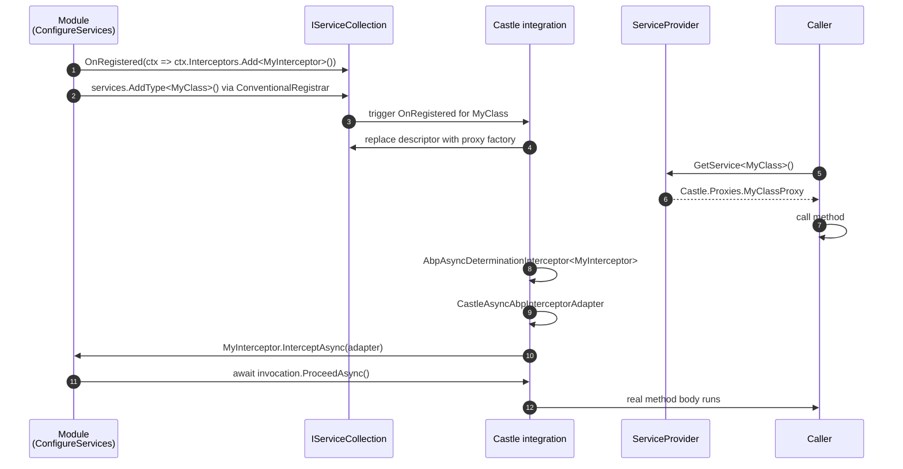

`Volo.Abp.Core` does not depend on Castle.Core. It only defines the
*contract* a dynamic proxy library has to honour so the rest of the
framework can plug interceptors into the registration pipeline. A
sibling package, `Volo.Abp.Castle.Core`, supplies the actual Castle
DynamicProxy adapters. That split lets ABP swap in a different proxy
provider in the future without recompiling consumer modules.

This page walks the three core abstractions
(`IAbpInterceptor`, `IAbpMethodInvocation`, `AbpInterceptor`), the
`ProxyHelper` / `DynamicProxyIgnoreTypes` utilities, the
cross-cutting-concern helpers under `Volo.Abp.Aspects`, and the
`Volo.Abp.Castle.Core` adapters that bind everything to Castle's
`AsyncInterceptorBase`.

<CardGroup cols={2}>
  <Card title="Dependency Injection" icon="syringe" href="/framework/core/dependency-injection">
    `OnRegistered` is what hands interceptors into Castle.
  </Card>
  <Card title="Exception Core" icon="triangle-exclamation" href="/framework/core/exception-handling-core">
    Interceptors often raise notifications through `IExceptionNotifier`.
  </Card>
</CardGroup>

## Folder map

```
framework/src/Volo.Abp.Core/Volo/Abp/
├── DynamicProxy/
│   ├── AbpInterceptor.cs
│   ├── DynamicProxyIgnoreTypes.cs
│   ├── IAbpInterceptor.cs
│   ├── IAbpMethodInvocation.cs
│   └── ProxyHelper.cs
└── Aspects/
    ├── AbpCrossCuttingConcerns.cs
    └── IAvoidDuplicateCrossCuttingConcerns.cs

framework/src/Volo.Abp.Castle.Core/Volo/Abp/Castle/
├── AbpCastleCoreModule.cs
└── DynamicProxy/
    ├── AbpAsyncDeterminationInterceptor.cs
    ├── CastleAbpMethodInvocationAdapter.cs
    ├── CastleAbpMethodInvocationAdapterBase.cs
    ├── CastleAbpMethodInvocationAdapterWithReturnValue.cs
    └── CastleAsyncAbpInterceptorAdapter.cs
```

## The kernel contracts

### `IAbpInterceptor`

```csharp framework/src/Volo.Abp.Core/Volo/Abp/DynamicProxy/IAbpInterceptor.cs
using System.Threading.Tasks;

namespace Volo.Abp.DynamicProxy;

public interface IAbpInterceptor
{
    Task InterceptAsync(IAbpMethodInvocation invocation);
}
```

An interceptor is a one-method object that takes the invocation and
runs work either side of calling `await invocation.ProceedAsync()`. The
contract is `async`-first; sync methods are projected through Castle's
async-determination machinery (see below).

### `AbpInterceptor`

```csharp framework/src/Volo.Abp.Core/Volo/Abp/DynamicProxy/AbpInterceptor.cs
using System.Threading.Tasks;

namespace Volo.Abp.DynamicProxy;

public abstract class AbpInterceptor : IAbpInterceptor
{
    public abstract Task InterceptAsync(IAbpMethodInvocation invocation);
}
```

A thin abstract class exists purely as documentation/convenience so
authors can write `class AuditingInterceptor : AbpInterceptor` instead
of implementing the interface directly. The behavioural contract is
identical.

### `IAbpMethodInvocation`

```csharp framework/src/Volo.Abp.Core/Volo/Abp/DynamicProxy/IAbpMethodInvocation.cs
public interface IAbpMethodInvocation
{
    object[] Arguments { get; }
    IReadOnlyDictionary<string, object> ArgumentsDictionary { get; }
    Type[] GenericArguments { get; }
    object TargetObject { get; }
    MethodInfo Method { get; }
    object ReturnValue { get; set; }
    Task ProceedAsync();
}
```

| Member | Notes |
| ------ | ----- |
| `Arguments` | Positional arguments in declaration order. |
| `ArgumentsDictionary` | Same values keyed by parameter name; built lazily by adapters. |
| `GenericArguments` | Closed generic type arguments at the call site. |
| `TargetObject` | The original (unproxied) instance the call is targeting. |
| `Method` | `MethodInfo` of the *original* method (not the proxy override). |
| `ReturnValue` | Writable so interceptors can short-circuit `ProceedAsync` and supply a value. |
| `ProceedAsync` | Continues to the next interceptor / the real method. Returns `Task` even for sync methods (the adapters handle the marshalling). |

### `ProxyHelper`

`ProxyHelper` unwraps Castle proxy objects so consumers can reason
about the underlying type. Only Castle's `Castle.Proxies` namespace is
recognised.

```csharp framework/src/Volo.Abp.Core/Volo/Abp/DynamicProxy/ProxyHelper.cs
public static class ProxyHelper
{
    private const string ProxyNamespace = "Castle.Proxies";

    public static object UnProxy(object obj)
    {
        if (obj.GetType().Namespace != ProxyNamespace) return obj;

        var targetField = obj.GetType()
            .GetFields(BindingFlags.Instance | BindingFlags.NonPublic)
            .FirstOrDefault(f => f.Name == "__target");

        if (targetField == null) return obj;

        return targetField.GetValue(obj)!;
    }

    public static Type GetUnProxiedType(object obj)
    {
        if (obj.GetType().Namespace == ProxyNamespace)
        {
            var target = UnProxy(obj);
            if (target == obj)
            {
                return obj.GetType().GetTypeInfo().BaseType!;
            }
            return target.GetType();
        }

        return obj.GetType();
    }
}
```

The implementation cares only about the **namespace** of the runtime
type (`Castle.Proxies`) — that is how Castle DynamicProxy names every
generated proxy class. `UnProxy` reaches into the `__target` field
Castle emits on class proxies; if it cannot find one (the typical
shape for interface proxies that wrap a real implementation),
`GetUnProxiedType` falls back to the proxy's base type.

The kernel itself never *creates* proxies — it only unwraps them, so
log messages and reflection-based behaviours can show the real type
even when interception is on.

### `DynamicProxyIgnoreTypes`

```csharp framework/src/Volo.Abp.Core/Volo/Abp/DynamicProxy/DynamicProxyIgnoreTypes.cs
/// <summary>
/// Castle's dynamic proxy class feature will have performance issues
/// for some components, such as the controller of Asp net core MVC.
/// ...
/// By default it is empty. When you use middleware or filters for these
/// components in your application, you can add these types to the list.
/// </summary>
public static class DynamicProxyIgnoreTypes
{
    private static HashSet<Type> IgnoredTypes { get; } = new HashSet<Type>();

    public static void Add<T>()
    {
        lock (IgnoredTypes)
        {
            IgnoredTypes.AddIfNotContains(typeof(T));
        }
    }

    public static bool Contains(Type type, bool includeDerivedTypes = true)
    {
        lock (IgnoredTypes)
        {
            return includeDerivedTypes
                ? IgnoredTypes.Any(t => t.IsAssignableFrom(type))
                : IgnoredTypes.Contains(type);
        }
    }
}
```

A process-wide static list of types that should **not** receive class
proxies, even if they are registered with interceptors. The docstring
on the type spells out the rationale: ASP.NET Core MVC controllers
incur a significant per-call cost when wrapped in class proxies; ABP
moves their cross-cutting behaviour into middleware / filters instead.

| Use case | Why ignore |
| -------- | ---------- |
| `ControllerBase` subclasses | UoW/auditing handled via filters. |
| `PageModel` subclasses | Same reason. |
| MediatR handlers under specific configurations | Avoid double-counting cross-cutting concerns. |

`Contains` takes an `includeDerivedTypes = true` parameter so adding a
base class marks every subclass as ignored.

## Aspects: cross-cutting-concern marking

`Volo.Abp.Aspects` defines a tiny protocol for objects to track which
cross-cutting concerns have already been applied to them in the current
call chain. It exists because the same interceptor can sometimes be
invoked twice — once through the proxy and once because a manual code
path also wrapped the call. Recording the concern on the target lets
interceptors short-circuit.

```csharp framework/src/Volo.Abp.Core/Volo/Abp/Aspects/IAvoidDuplicateCrossCuttingConcerns.cs
public interface IAvoidDuplicateCrossCuttingConcerns
{
    List<string> AppliedCrossCuttingConcerns { get; }
}
```

```csharp framework/src/Volo.Abp.Core/Volo/Abp/Aspects/AbpCrossCuttingConcerns.cs
public static class AbpCrossCuttingConcerns
{
    public const string Auditing = "AbpAuditing";
    public const string UnitOfWork = "AbpUnitOfWork";
    public const string FeatureChecking = "AbpFeatureChecking";
    public const string GlobalFeatureChecking = "AbpGlobalFeatureChecking";

    public static void AddApplied(object obj, params string[] concerns) { ... }
    public static void RemoveApplied(object obj, params string[] concerns) { ... }
    public static bool IsApplied([NotNull] object obj, [NotNull] string concern) { ... }
    public static IDisposable Applying(object obj, params string[] concerns) { ... }
    public static string[] GetApplieds(object obj) { ... }
}
```

The four constants are the canonical names cross-cutting modules use:
`AbpAuditing`, `AbpUnitOfWork`, `AbpFeatureChecking`,
`AbpGlobalFeatureChecking`. `Applying` returns a `DisposeAction` that
removes the concerns again when disposed, so the typical interceptor
pattern is:

```csharp
public override async Task InterceptAsync(IAbpMethodInvocation invocation)
{
    if (AbpCrossCuttingConcerns.IsApplied(invocation.TargetObject, AbpCrossCuttingConcerns.UnitOfWork))
    {
        await invocation.ProceedAsync();
        return;
    }

    using (AbpCrossCuttingConcerns.Applying(invocation.TargetObject, AbpCrossCuttingConcerns.UnitOfWork))
    {
        await invocation.ProceedAsync();
    }
}
```

That guarantees the same target object never receives the same concern
twice in a single call chain, regardless of how the interception was
triggered.

## The Castle adapter package

`Volo.Abp.Castle.Core` is the runtime side. Its module simply registers
the open generic determination interceptor:

```csharp framework/src/Volo.Abp.Castle.Core/Volo/Abp/Castle/AbpCastleCoreModule.cs
public class AbpCastleCoreModule : AbpModule
{
    public override void ConfigureServices(ServiceConfigurationContext context)
    {
        context.Services.AddTransient(typeof(AbpAsyncDeterminationInterceptor<>));
    }
}
```

That single transient registration is enough because every ABP
interceptor flows through it.

### `AbpAsyncDeterminationInterceptor<TInterceptor>`

```csharp framework/src/Volo.Abp.Castle.Core/Volo/Abp/Castle/DynamicProxy/AbpAsyncDeterminationInterceptor.cs
public class AbpAsyncDeterminationInterceptor<TInterceptor> : AsyncDeterminationInterceptor
    where TInterceptor : IAbpInterceptor
{
    public AbpAsyncDeterminationInterceptor(TInterceptor abpInterceptor)
        : base(new CastleAsyncAbpInterceptorAdapter<TInterceptor>(abpInterceptor))
    {
    }
}
```

`AsyncDeterminationInterceptor` is from `Castle.Core.AsyncInterceptor`
(the standard Castle helper for `Task`-returning methods). It inspects
the call site and dispatches into either the sync or async variant of
the wrapped interceptor.

### `CastleAsyncAbpInterceptorAdapter`

```csharp framework/src/Volo.Abp.Castle.Core/Volo/Abp/Castle/DynamicProxy/CastleAsyncAbpInterceptorAdapter.cs
public class CastleAsyncAbpInterceptorAdapter<TInterceptor> : AsyncInterceptorBase
    where TInterceptor : IAbpInterceptor
{
    private readonly TInterceptor _abpInterceptor;

    public CastleAsyncAbpInterceptorAdapter(TInterceptor abpInterceptor)
    {
        _abpInterceptor = abpInterceptor;
    }

    protected override async Task InterceptAsync(IInvocation invocation, IInvocationProceedInfo proceedInfo,
        Func<IInvocation, IInvocationProceedInfo, Task> proceed)
    {
        await _abpInterceptor.InterceptAsync(
            new CastleAbpMethodInvocationAdapter(invocation, proceedInfo, proceed)
        );
    }

    protected override async Task<TResult> InterceptAsync<TResult>(IInvocation invocation, IInvocationProceedInfo proceedInfo,
        Func<IInvocation, IInvocationProceedInfo, Task<TResult>> proceed)
    {
        var adapter = new CastleAbpMethodInvocationAdapterWithReturnValue<TResult>(invocation, proceedInfo, proceed);
        await _abpInterceptor.InterceptAsync(adapter);
        return (TResult)adapter.ReturnValue;
    }
}
```

Two `InterceptAsync` overrides cover the void-returning and
result-returning shapes. Both wrap Castle's `IInvocation` in an ABP
adapter and delegate.

### `CastleAbpMethodInvocationAdapter` family

```csharp framework/src/Volo.Abp.Castle.Core/Volo/Abp/Castle/DynamicProxy/CastleAbpMethodInvocationAdapterBase.cs
public abstract class CastleAbpMethodInvocationAdapterBase : IAbpMethodInvocation
{
    public object[] Arguments => Invocation.Arguments;
    public IReadOnlyDictionary<string, object> ArgumentsDictionary => _lazyArgumentsDictionary.Value;
    public Type[] GenericArguments => Invocation.GenericArguments;
    public object TargetObject => Invocation.InvocationTarget ?? Invocation.MethodInvocationTarget;
    public MethodInfo Method => Invocation.MethodInvocationTarget ?? Invocation.Method;
    public object ReturnValue { get; set; } = default!;

    protected IInvocation Invocation { get; }

    protected CastleAbpMethodInvocationAdapterBase(IInvocation invocation)
    {
        Invocation = invocation;
        _lazyArgumentsDictionary = new Lazy<IReadOnlyDictionary<string, object>>(GetArgumentsDictionary);
    }

    public abstract Task ProceedAsync();

    private IReadOnlyDictionary<string, object> GetArgumentsDictionary()
    {
        var dict = new Dictionary<string, object>();
        var methodParameters = Method.GetParameters();
        for (int i = 0; i < methodParameters.Length; i++)
        {
            dict[methodParameters[i].Name!] = Invocation.Arguments[i];
        }
        return dict;
    }
}
```

The base type implements the read-only members directly off Castle's
`IInvocation`. `ProceedAsync` is abstract — there are two subclasses:

| Adapter | `ProceedAsync` shape |
| ------- | ------------------- |
| `CastleAbpMethodInvocationAdapter` | `await Proceed(Invocation, ProceedInfo)`; for `Task`-returning methods. |
| `CastleAbpMethodInvocationAdapterWithReturnValue<TResult>` | `ReturnValue = await Proceed(...)`; for `Task<TResult>`. |

```csharp framework/src/Volo.Abp.Castle.Core/Volo/Abp/Castle/DynamicProxy/CastleAbpMethodInvocationAdapter.cs
public class CastleAbpMethodInvocationAdapter : CastleAbpMethodInvocationAdapterBase, IAbpMethodInvocation
{
    protected IInvocationProceedInfo ProceedInfo { get; }
    protected Func<IInvocation, IInvocationProceedInfo, Task> Proceed { get; }

    public CastleAbpMethodInvocationAdapter(IInvocation invocation, IInvocationProceedInfo proceedInfo,
        Func<IInvocation, IInvocationProceedInfo, Task> proceed)
        : base(invocation)
    {
        ProceedInfo = proceedInfo;
        Proceed = proceed;
    }

    public override async Task ProceedAsync()
    {
        await Proceed(Invocation, ProceedInfo);
    }
}
```

```csharp framework/src/Volo.Abp.Castle.Core/Volo/Abp/Castle/DynamicProxy/CastleAbpMethodInvocationAdapterWithReturnValue.cs
public class CastleAbpMethodInvocationAdapterWithReturnValue<TResult> :
    CastleAbpMethodInvocationAdapterBase, IAbpMethodInvocation
{
    protected IInvocationProceedInfo ProceedInfo { get; }
    protected Func<IInvocation, IInvocationProceedInfo, Task<TResult>> Proceed { get; }

    public CastleAbpMethodInvocationAdapterWithReturnValue(IInvocation invocation,
        IInvocationProceedInfo proceedInfo,
        Func<IInvocation, IInvocationProceedInfo, Task<TResult>> proceed)
        : base(invocation)
    {
        ProceedInfo = proceedInfo;
        Proceed = proceed;
    }

    public override async Task ProceedAsync()
    {
        ReturnValue = (await Proceed(Invocation, ProceedInfo))!;
    }
}
```

## How interceptors get attached

The kernel never asks Castle directly to create a proxy. Instead,
modules that contribute interceptors register an `OnRegistered` action
on the `IServiceCollection`. The action receives an
`IOnServiceRegistredContext` whose `Interceptors` is an
`ITypeList<IAbpInterceptor>`. The Castle integration package
(`Volo.Abp.Castle.AspNetCore`, etc.) walks that list when the service
provider is built and emits class/interface proxies via Castle's
`ProxyGenerator`.

The wire shape looks like this:



## Why the split matters

If `Volo.Abp.Core` referenced Castle directly:

1. Every ABP application would pull Castle.Core even when interception
   was unused.
2. Replacing Castle with another proxy library (DispatchProxy,
   ImpromptuInterface, etc.) would require a major-version bump.
3. The kernel could not be loaded into AOT-friendly environments that
   refuse to run IL generation.

By keeping only the contracts in `Volo.Abp.Core` and shipping the
Castle implementation as a sibling, ABP can offer interception as an
opt-in via `[DependsOn(typeof(AbpCastleCoreModule))]` (transitively
included by the AspNetCore, Auditing, and UoW modules).

## Take-aways

- `IAbpInterceptor.InterceptAsync(IAbpMethodInvocation)` is the entire
  interception API. Everything else is glue.
- `ProxyHelper` exists so the rest of the kernel can recover the
  original type behind a Castle proxy.
- `DynamicProxyIgnoreTypes` is the explicit escape hatch for hot code
  paths that ABP would otherwise wrap in a class proxy.
- `Volo.Abp.Aspects.AbpCrossCuttingConcerns` is the canonical mechanism
  for idempotent interception across both proxy and manual code paths.
- The Castle adapters in `Volo.Abp.Castle.Core` are the only place that
  knows about `Castle.DynamicProxy` types like `IInvocation` and
  `AsyncInterceptorBase`.

<Card title="Next: Exception Handling Core" icon="arrow-right" href="/framework/core/exception-handling-core">
  `BusinessException`, `IExceptionNotifier`, subscribers, and log-level
  selection.
</Card>
