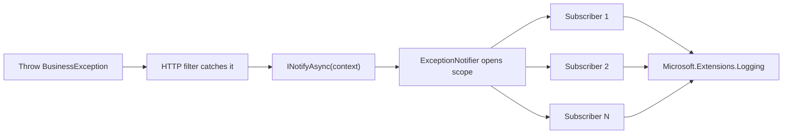

`Volo.Abp.Core` ships the *primitives* of ABP's exception story:
typed exception base classes that carry an error code, details, and a
preferred log level; marker interfaces other parts of the framework
recognise; a notification publisher/subscriber pair; and a null
implementation for tests. The actual HTTP exception filter that
translates these types into 400/500 responses lives in
`Volo.Abp.AspNetCore.ExceptionHandling`. The friendly message
localization layer lives in `Volo.Abp.Localization`. This page sticks
to what is in the kernel.

<CardGroup cols={2}>
  <Card title="Localization Core" icon="language" href="/framework/core/localization-core">
    `ILocalizeErrorMessage` and how messages flow.
  </Card>
  <Card title="Dependency Injection" icon="syringe" href="/framework/core/dependency-injection">
    Subscribers are picked up by `IServiceScope.GetServices`.
  </Card>
</CardGroup>

## File map

```
framework/src/Volo.Abp.Core/Volo/Abp/
├── AbpException.cs
├── BusinessException.cs
├── UserFriendlyException.cs
├── IBusinessException.cs
├── IUserFriendlyException.cs
└── ExceptionHandling/
    ├── ExceptionNotificationContext.cs
    ├── ExceptionNotifier.cs
    ├── ExceptionNotifierExtensions.cs
    ├── ExceptionSubscriber.cs
    ├── IExceptionNotifier.cs
    ├── IExceptionSubscriber.cs
    ├── IHasErrorCode.cs
    ├── IHasErrorDetails.cs
    ├── IHasHttpStatusCode.cs
    ├── ILocalizeErrorMessage.cs
    └── NullExceptionNotifier.cs
```

## Exception classes

### `AbpException`

```csharp framework/src/Volo.Abp.Core/Volo/Abp/AbpException.cs
public class AbpException : Exception
{
    public AbpException() { }
    public AbpException(string? message) : base(message) { }
    public AbpException(string? message, Exception? innerException) : base(message, innerException) { }
    public AbpException(SerializationInfo serializationInfo, StreamingContext context)
        : base(serializationInfo, context) { }
}
```

The base type for **framework** errors — initialization failure,
shutdown failure, "service provider already set", etc. It is *not* a
business exception; nothing about it implies it is safe to display to
end users. `AbpInitializationException` and `AbpShutdownException`
subclass it directly.

### `BusinessException`

```csharp framework/src/Volo.Abp.Core/Volo/Abp/BusinessException.cs
[Serializable]
public class BusinessException : Exception,
    IBusinessException,
    IHasErrorCode,
    IHasErrorDetails,
    IHasLogLevel
{
    public string? Code { get; set; }
    public string? Details { get; set; }
    public LogLevel LogLevel { get; set; }

    public BusinessException(
        string? code = null,
        string? message = null,
        string? details = null,
        Exception? innerException = null,
        LogLevel logLevel = LogLevel.Warning)
        : base(message, innerException)
    {
        Code = code;
        Details = details;
        LogLevel = logLevel;
    }

    public BusinessException(SerializationInfo serializationInfo, StreamingContext context)
        : base(serializationInfo, context) { }

    public BusinessException WithData(string name, object value)
    {
        Data[name] = value;
        return this;
    }
}
```

Key choices:

- Implements **four** marker/data interfaces so downstream code can
  treat the type generically.
- `LogLevel` defaults to `Warning`, not `Error` — business exceptions
  are *expected* failures.
- `WithData(name, value)` is a fluent helper that uses the standard
  `Exception.Data` dictionary; HTTP filters surface those entries in
  the API error payload.

### `UserFriendlyException`

```csharp framework/src/Volo.Abp.Core/Volo/Abp/UserFriendlyException.cs
[Serializable]
public class UserFriendlyException : BusinessException, IUserFriendlyException
{
    public UserFriendlyException(
        string message,
        string? code = null,
        string? details = null,
        Exception? innerException = null,
        LogLevel logLevel = LogLevel.Warning)
        : base(code, message, details, innerException, logLevel)
    {
        Details = details;
    }

    public UserFriendlyException(SerializationInfo serializationInfo, StreamingContext context)
        : base(serializationInfo, context) { }
}
```

The class only adds the `IUserFriendlyException` marker. HTTP filters
inspect that marker to decide *whether the raw `Message` is safe to
return*. Without `IUserFriendlyException`, the filter substitutes a
generic message ("An internal error occurred") and logs the original
text.

### Marker interfaces

```csharp framework/src/Volo.Abp.Core/Volo/Abp/IBusinessException.cs
public interface IBusinessException { }
```

```csharp framework/src/Volo.Abp.Core/Volo/Abp/IUserFriendlyException.cs
public interface IUserFriendlyException : IBusinessException { }
```

The interfaces are empty by design — they exist so non-`BusinessException`
types can opt into the same behaviour (for example, validation
exceptions from a third-party library).

## Data contracts

The four interfaces under `Volo.Abp.ExceptionHandling` let HTTP filters
and clients learn structured details without reflecting on a specific
exception type.

```csharp framework/src/Volo.Abp.Core/Volo/Abp/ExceptionHandling/IHasErrorCode.cs
namespace Volo.Abp.ExceptionHandling;

public interface IHasErrorCode
{
    string? Code { get; }
}
```

```csharp framework/src/Volo.Abp.Core/Volo/Abp/ExceptionHandling/IHasErrorDetails.cs
namespace Volo.Abp.ExceptionHandling;

public interface IHasErrorDetails
{
    string? Details { get; }
}
```

```csharp framework/src/Volo.Abp.Core/Volo/Abp/ExceptionHandling/IHasHttpStatusCode.cs
namespace Volo.Abp.ExceptionHandling;

public interface IHasHttpStatusCode
{
    int HttpStatusCode { get; }
}
```

```csharp framework/src/Volo.Abp.Core/Volo/Abp/ExceptionHandling/ILocalizeErrorMessage.cs
using Volo.Abp.Localization;

namespace Volo.Abp.ExceptionHandling;

public interface ILocalizeErrorMessage
{
    string LocalizeMessage(LocalizationContext context);
}
```

| Interface | Used by HTTP filter to … |
| --------- | ------------------------ |
| `IHasErrorCode` | Populate the `code` field of `RemoteServiceErrorInfo`. |
| `IHasErrorDetails` | Populate the `details` field. |
| `IHasHttpStatusCode` | Pick the status code returned to the client. |
| `ILocalizeErrorMessage` | Look up the localized message for the negotiated culture before emitting the response. |

`BusinessException` implements three of the four. `IHasHttpStatusCode`
is intentionally left to subclasses (`AbpAuthorizationException`,
`EntityNotFoundException`, etc.) because the status code depends on
the *kind* of failure.

## Log-level interfaces

The kernel cooperates with `Microsoft.Extensions.Logging.LogLevel`
through two small interfaces in `Volo.Abp.Logging`:

```csharp framework/src/Volo.Abp.Core/Volo/Abp/Logging/IHasLogLevel.cs
public interface IHasLogLevel
{
    LogLevel LogLevel { get; set; }
}
```

```csharp framework/src/Volo.Abp.Core/Volo/Abp/Logging/HasLogLevelExtensions.cs
public static class HasLogLevelExtensions
{
    public static TException WithLogLevel<TException>([NotNull] this TException exception, LogLevel logLevel)
        where TException : IHasLogLevel
    {
        Check.NotNull(exception, nameof(exception));
        exception.LogLevel = logLevel;
        return exception;
    }
}
```

```csharp framework/src/Volo.Abp.Core/Volo/Abp/Logging/IExceptionWithSelfLogging.cs
public interface IExceptionWithSelfLogging
{
    void Log(ILogger logger);
}
```

| Interface | Effect |
| --------- | ------ |
| `IHasLogLevel` | Hosts a writable `LogLevel`; default is `Warning` on `BusinessException`. |
| `IExceptionWithSelfLogging` | An exception that prefers to log itself (used to emit structured log entries that wouldn't survive `LogException`). |

The kernel does not ship a public `GetLogLevel()` helper — that lives
in `Volo.Abp.ExceptionHandling` (the higher-level package) and walks
the `IHasLogLevel` chain on the exception and its inners. The
`ExceptionNotificationContext` constructor calls it:

```csharp framework/src/Volo.Abp.Core/Volo/Abp/ExceptionHandling/ExceptionNotificationContext.cs
public ExceptionNotificationContext(
    [NotNull] Exception exception,
    LogLevel? logLevel = null,
    bool handled = true)
{
    Exception = Check.NotNull(exception, nameof(exception));
    LogLevel = logLevel ?? exception.GetLogLevel();
    Handled = handled;
}
```

If the caller passes a `logLevel`, it wins. Otherwise the exception's
own `LogLevel` (via `IHasLogLevel`) is used; `BusinessException`'s
default of `Warning` therefore becomes the effective level for the
typical business failure case.

## `ExceptionNotificationContext`

```csharp framework/src/Volo.Abp.Core/Volo/Abp/ExceptionHandling/ExceptionNotificationContext.cs
public class ExceptionNotificationContext
{
    [NotNull] public Exception Exception { get; }
    public LogLevel LogLevel { get; }
    public bool Handled { get; }

    public ExceptionNotificationContext(
        [NotNull] Exception exception,
        LogLevel? logLevel = null,
        bool handled = true)
    {
        Exception = Check.NotNull(exception, nameof(exception));
        LogLevel = logLevel ?? exception.GetLogLevel();
        Handled = handled;
    }
}
```

| Property | Notes |
| -------- | ----- |
| `Exception` | The original exception object; never wrapped. |
| `LogLevel` | Either the caller-supplied value or the exception's own preference. |
| `Handled` | `true` when an HTTP filter / interceptor has already produced a response; `false` lets subscribers decide whether to escalate. |

## `IExceptionNotifier`

```csharp framework/src/Volo.Abp.Core/Volo/Abp/ExceptionHandling/IExceptionNotifier.cs
public interface IExceptionNotifier
{
    Task NotifyAsync([NotNull] ExceptionNotificationContext context);
}
```

The convenience extension lets callers skip context construction:

```csharp framework/src/Volo.Abp.Core/Volo/Abp/ExceptionHandling/ExceptionNotifierExtensions.cs
public static class ExceptionNotifierExtensions
{
    public static Task NotifyAsync(
        [NotNull] this IExceptionNotifier exceptionNotifier,
        [NotNull] Exception exception,
        LogLevel? logLevel = null,
        bool handled = true)
    {
        Check.NotNull(exceptionNotifier, nameof(exceptionNotifier));
        return exceptionNotifier.NotifyAsync(
            new ExceptionNotificationContext(exception, logLevel, handled));
    }
}
```

## `ExceptionNotifier`

The default `IExceptionNotifier` opens its own DI scope so subscribers
can be transient/scoped without leaking into the calling scope:

```csharp framework/src/Volo.Abp.Core/Volo/Abp/ExceptionHandling/ExceptionNotifier.cs
public class ExceptionNotifier : IExceptionNotifier, ITransientDependency
{
    public ILogger<ExceptionNotifier> Logger { get; set; }
    protected IServiceScopeFactory ServiceScopeFactory { get; }

    public ExceptionNotifier(IServiceScopeFactory serviceScopeFactory)
    {
        ServiceScopeFactory = serviceScopeFactory;
        Logger = NullLogger<ExceptionNotifier>.Instance;
    }

    public virtual async Task NotifyAsync([NotNull] ExceptionNotificationContext context)
    {
        Check.NotNull(context, nameof(context));

        using (var scope = ServiceScopeFactory.CreateScope())
        {
            var exceptionSubscribers = scope.ServiceProvider
                .GetServices<IExceptionSubscriber>();

            foreach (var exceptionSubscriber in exceptionSubscribers)
            {
                try
                {
                    await exceptionSubscriber.HandleAsync(context);
                }
                catch (Exception e)
                {
                    Logger.LogWarning(
                        $"Exception subscriber of type {exceptionSubscriber.GetType().AssemblyQualifiedName} has thrown an exception!");
                    Logger.LogException(e, LogLevel.Warning);
                }
            }
        }
    }
}
```

Three behaviours worth noting:

1. **Property injection of `Logger`.** The default value is
   `NullLogger.Instance`; if a real logger is registered, it replaces
   the null via ABP's property injection.
2. **Per-call scope.** Subscribers see a fresh scope so their own
   scoped dependencies (a DbContext, a tenant context, etc.) get a
   clean state per notification.
3. **Errors in subscribers are caught and logged**, not rethrown. One
   misbehaving subscriber cannot stop the others from running.

## `IExceptionSubscriber` and `ExceptionSubscriber`

```csharp framework/src/Volo.Abp.Core/Volo/Abp/ExceptionHandling/IExceptionSubscriber.cs
public interface IExceptionSubscriber
{
    Task HandleAsync([NotNull] ExceptionNotificationContext context);
}
```

```csharp framework/src/Volo.Abp.Core/Volo/Abp/ExceptionHandling/ExceptionSubscriber.cs
[ExposeServices(typeof(IExceptionSubscriber))]
public abstract class ExceptionSubscriber : IExceptionSubscriber, ITransientDependency
{
    public abstract Task HandleAsync(ExceptionNotificationContext context);
}
```

Authors deriving from `ExceptionSubscriber` automatically register as
`IExceptionSubscriber` (because of `[ExposeServices]`) and as transient
(because of `ITransientDependency`). Plain class implementations of
the interface work too, but they need to register themselves the way
they would any other transient service.

A typical subscriber posts to a structured-logging sink, mirrors the
event into a database, or escalates `LogLevel.Error` events into an
alerting channel:

```csharp
public class AlertingExceptionSubscriber : ExceptionSubscriber
{
    private readonly IAlertingClient _client;

    public AlertingExceptionSubscriber(IAlertingClient client) => _client = client;

    public override async Task HandleAsync(ExceptionNotificationContext context)
    {
        if (context.LogLevel < LogLevel.Error) return;
        await _client.NotifyAsync(context.Exception);
    }
}
```

## `NullExceptionNotifier`

For tests and isolated unit scenarios:

```csharp framework/src/Volo.Abp.Core/Volo/Abp/ExceptionHandling/NullExceptionNotifier.cs
public class NullExceptionNotifier : IExceptionNotifier
{
    public static NullExceptionNotifier Instance { get; } = new NullExceptionNotifier();
    private NullExceptionNotifier() { }
    public Task NotifyAsync(ExceptionNotificationContext context) => Task.CompletedTask;
}
```

This is the same null-object pattern used throughout the kernel
(`NullDisposable`, `NullAsyncDisposable`). It is not registered into
the container by default; modules that want it inject the singleton
explicitly.

## End-to-end shape

The diagram below shows the chain from a thrown exception to a logged
notification.



The notifier never returns the exception or alters control flow. It
exists only to fan an event out to a set of subscribers; the HTTP
filter is still responsible for producing the response.

## Take-aways

- The kernel ships a tight hierarchy: `AbpException` for framework
  failures, `BusinessException` for expected domain failures,
  `UserFriendlyException` for messages safe to surface to end users.
- Four marker interfaces (`IHasErrorCode`, `IHasErrorDetails`,
  `IHasHttpStatusCode`, `ILocalizeErrorMessage`) give the HTTP layer
  enough metadata to construct a `RemoteServiceErrorInfo` without
  knowing the concrete exception type.
- `IHasLogLevel` plus `BusinessException.LogLevel = Warning` is why
  business failures show up as warnings, not errors, in default logs.
- `ExceptionNotifier` and `IExceptionSubscriber` form a fan-out hook:
  cross-cutting modules subscribe to notifications without inserting
  themselves into the HTTP pipeline.
- `NullExceptionNotifier.Instance` is the no-op test double.

<Card title="Next: Localization Core" icon="arrow-right" href="/framework/core/localization-core">
  What ships in `Volo/Abp/Localization/` inside the kernel and where
  the boundary with the higher-level localization packages sits.
</Card>
