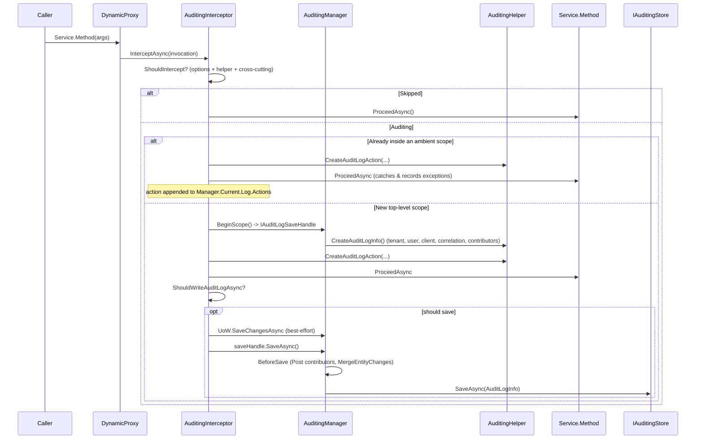

ABP's auditing subsystem records *what was called, by whom, on which tenant, with which arguments, how long it took, and which entities it changed* — without the application service knowing. It is implemented as a dynamic-proxy interceptor (`AuditingInterceptor`) that wraps every public method of a service marked with `[Audited]` or implementing `IAuditingEnabled`, opens (or joins) an ambient `IAuditLogScope`, and on completion hands the resulting `AuditLogInfo` to an `IAuditingStore`. The default store just logs to `ILogger`; the `Volo.Abp.AuditLogging` module ships an Entity Framework / MongoDB implementation that persists structured rows.

This page traces the request → save pipeline file by file. The contracts (`IAuditedObject`, `IFullAuditedObject`, the `[Audited]`/`[DisableAuditing]` attributes, `EntityChangeType`) live in `framework/src/Volo.Abp.Auditing.Contracts/`; the runtime (interceptor, helper, manager, options) lives in `framework/src/Volo.Abp.Auditing/`.

## File inventory

| Path under `framework/src/Volo.Abp.Auditing/` | Role |
| --- | --- |
| `Volo/Abp/Auditing/AbpAuditingModule.cs` | Module — registers the interceptor registrar via `OnRegistered`. |
| `Volo/Abp/Auditing/AbpAuditingOptions.cs` | Options bag — `IsEnabled`, `AlwaysLogOnException`, `IgnoredTypes`, contributors. |
| `Volo/Abp/Auditing/AuditingInterceptor.cs` | The dynamic-proxy interceptor that drives the pipeline. |
| `Volo/Abp/Auditing/AuditingInterceptorRegistrar.cs` | Decides which types get the interceptor at registration time. |
| `Volo/Abp/Auditing/AuditingManager.cs` | Ambient `IAuditLogScope` provider; opens scopes, calls store. |
| `Volo/Abp/Auditing/AuditingHelper.cs` | Builds `AuditLogInfo` / `AuditLogActionInfo`; runs Pre contributors. |
| `Volo/Abp/Auditing/AuditLogInfo.cs` | Root POCO carried through the pipeline. |
| `Volo/Abp/Auditing/AuditLogActionInfo.cs` | Per-method record (service, method, parameters, duration). |
| `Volo/Abp/Auditing/EntityChangeInfo.cs` | Per-entity change record (Created/Updated/Deleted + property diffs). |
| `Volo/Abp/Auditing/EntityPropertyChangeInfo.cs` | Single property's old/new value. |
| `Volo/Abp/Auditing/IAuditingStore.cs` | Extension point — `Task SaveAsync(AuditLogInfo)`. |
| `Volo/Abp/Auditing/SimpleLogAuditingStore.cs` | Default `[Dependency(TryRegister = true)]` store — writes to `ILogger`. |
| `Volo/Abp/Auditing/AuditLogScope.cs` / `IAuditLogScope.cs` | Holds the active `AuditLogInfo` for the ambient scope. |
| `Volo/Abp/Auditing/IAuditLogSaveHandle.cs` | Disposable handle returned by `BeginScope` — calls `SaveAsync`. |
| `Volo/Abp/Auditing/AuditLogContributor.cs` | Hookable `PreContribute` / `PostContribute` callbacks. |
| `Volo/Abp/Auditing/IAuditSerializer.cs` / `JsonAuditSerializer.cs` | Argument serializer (default `System.Text.Json`). |
| `Volo/Abp/Auditing/AuditPropertySetter.cs` | Stamps `CreationTime`, `CreatorId`, `LastModifierId`, `IsDeleted` on entities. |
| `Volo/Abp/Auditing/EntityHistorySelectorList.cs` | Predicate list for opting non-attributed entities into history. |

The contracts package (`Volo.Abp.Auditing.Contracts`) defines the audited-object marker interfaces (`IHasCreationTime`, `ICreationAuditedObject`, `IHasModificationTime`, `IModificationAuditedObject`, `IDeletionAuditedObject`, `IFullAuditedObject`, `ISoftDelete`, `IHasEntityVersion`), the `EntityChangeType` enum, and the `[Audited]` / `[DisableAuditing]` / `IAuditingEnabled` selectors that drive the interceptor.

## Key abstractions

| Member | Signature | Purpose |
| --- | --- | --- |
| `AbpAuditingOptions.IsEnabled` | `bool` (default `true`) | Master kill-switch read by `AuditingInterceptor.ShouldIntercept`. |
| `AbpAuditingOptions.IsEnabledForAnonymousUsers` | `bool` (default `true`) | If false and `CurrentUser.IsAuthenticated == false`, the log is dropped after the call. |
| `AbpAuditingOptions.AlwaysLogOnException` | `bool` (default `true`) | Forces a save when the wrapped call threw, regardless of other filters. |
| `AbpAuditingOptions.IsEnabledForGetRequests` | `bool` (default `false`) | When false, methods whose name starts with `Get` are skipped. |
| `AbpAuditingOptions.IgnoredTypes` | `List<Type>` (defaults: `Stream`, `Expression`, `CancellationToken`) | Argument types excluded from JSON serialization. |
| `AbpAuditingOptions.AlwaysLogSelectors` | `List<Func<AuditLogInfo, Task<bool>>>` | If any returns `true`, the log is always saved. |
| `AbpAuditingOptions.Contributors` | `List<AuditLogContributor>` | Pre/Post hooks that can mutate `AuditLogInfo`. |
| `AbpAuditingOptions.EntityHistorySelectors` | `IEntityHistorySelectorList` | Predicate list opting entity types into history without `[Audited]`. |
| `IAuditingStore` | `Task SaveAsync(AuditLogInfo auditInfo)` | The persistence seam — implement to push to DB, ES, Kafka, etc. |
| `IAuditingManager` | `IAuditLogScope? Current { get; }` + `IAuditLogSaveHandle BeginScope()` | Opens/joins the ambient `AuditLogInfo`. |
| `IAuditingHelper` | `ShouldSaveAudit`, `CreateAuditLogInfo`, `CreateAuditLogAction`, `IsEntityHistoryEnabled` | Pure helpers used by the interceptor and EF Core integration. |
| `[Audited]` | class/method attribute | Force-includes a target. |
| `[DisableAuditing]` | class/method attribute | Force-excludes a target. |
| `IAuditingEnabled` | marker interface | Opt-in without an attribute. `IApplicationService` extends it. |

### `AbpAuditingOptions` defaults (verbatim)

```csharp
public AbpAuditingOptions()
{
    IsEnabled = true;
    IsEnabledForAnonymousUsers = true;
    HideErrors = true;
    AlwaysLogOnException = true;
    AlwaysLogSelectors = new List<Func<AuditLogInfo, Task<bool>>>();
    Contributors = new List<AuditLogContributor>();
    IgnoredTypes = new List<Type>
    {
        typeof(Stream),
        typeof(Expression),
        typeof(CancellationToken)
    };
    EntityHistorySelectors = new EntityHistorySelectorList();
}
```

`IsEnabledForGetRequests` and `DisableLogActionInfo` are not assigned and therefore default to `false`; `IsEnabledForIntegrationServices` is also `false`, meaning services attributed with `[IntegrationService]` are *excluded* by default.

## How a target is selected for auditing

`AuditingInterceptorRegistrar.RegisterIfNeeded` runs once per `IServiceDescriptor` (it is wired through `context.Services.OnRegistered(...)` in `AbpAuditingModule`):

```csharp
private static bool ShouldIntercept(Type type)
{
    if (DynamicProxyIgnoreTypes.Contains(type)) return false;
    if (ShouldAuditTypeByDefaultOrNull(type, ignoreIntegrationServiceAttribute: true) == true) return true;
    if (type.GetMethods().Any(m => m.IsDefined(typeof(AuditedAttribute), true))) return true;
    return false;
}

public static bool? ShouldAuditTypeByDefaultOrNull(Type type, bool ignoreIntegrationServiceAttribute)
{
    if (type.IsDefined(typeof(AuditedAttribute), true)) return true;
    if (type.IsDefined(typeof(DisableAuditingAttribute), true)) return false;
    if (typeof(IAuditingEnabled).IsAssignableFrom(type))
    {
        if (ignoreIntegrationServiceAttribute ||
            !IntegrationServiceAttribute.IsDefinedOrInherited(type))
        {
            return true;
        }
    }
    return null;
}
```

Because `IApplicationService` extends `IAuditingEnabled`, every application service is intercepted by default (unless decorated with `[DisableAuditing]` or `[IntegrationService]` when `IsEnabledForIntegrationServices` is `false`). `AbpCrossCuttingConcerns.IsApplied(target, "Auditing")` is also consulted at *runtime* by `AuditingInterceptor.ShouldIntercept`, so consumers can temporarily disable auditing on a target by entering an `AbpCrossCuttingConcerns.Applying(...)` scope.

## Pipeline: a single method call



### Inside `AuditingInterceptor.InterceptAsync`

The interceptor resolves a fresh service scope per call to avoid leaking captured-state DI singletons:

```csharp
public override async Task InterceptAsync(IAbpMethodInvocation invocation)
{
    using (var serviceScope = _serviceScopeFactory.CreateScope())
    {
        var auditingHelper  = serviceScope.ServiceProvider.GetRequiredService<IAuditingHelper>();
        var auditingOptions = serviceScope.ServiceProvider.GetRequiredService<IOptions<AbpAuditingOptions>>().Value;

        if (!ShouldIntercept(invocation, auditingOptions, auditingHelper))
        {
            await invocation.ProceedAsync();
            return;
        }

        var auditingManager = serviceScope.ServiceProvider.GetRequiredService<IAuditingManager>();
        if (auditingManager.Current != null)
        {
            // Nested call - append an AuditLogActionInfo to the outer scope
            await ProceedByLoggingAsync(invocation, auditingOptions, auditingHelper, auditingManager.Current);
        }
        else
        {
            // Top-level call - open a brand-new scope
            var currentUser       = serviceScope.ServiceProvider.GetRequiredService<ICurrentUser>();
            var unitOfWorkManager = serviceScope.ServiceProvider.GetRequiredService<IUnitOfWorkManager>();
            await ProcessWithNewAuditingScopeAsync(invocation, auditingOptions, currentUser,
                                                   auditingManager, auditingHelper, unitOfWorkManager);
        }
    }
}
```

`ShouldIntercept` consults three signals in order:

1. `options.IsEnabled` — global kill-switch.
2. `AbpCrossCuttingConcerns.IsApplied(target, "Auditing")` — runtime suppression scope.
3. `auditingHelper.ShouldSaveAudit(method, ignoreIntegrationServiceAttribute: options.IsEnabledForIntegrationServices)` — `[Audited]` / `[DisableAuditing]` / class-level rules.

### `ProcessWithNewAuditingScopeAsync` — the save decision

After the wrapped call returns (or throws), `ShouldWriteAuditLogAsync` decides whether to persist the log. The implementation runs the selectors first so user-supplied rules can *override* the "skip GETs / anonymous" defaults:

```csharp
foreach (var selector in options.AlwaysLogSelectors)
    if (await selector(auditLogInfo)) return true;

if (options.AlwaysLogOnException && hasError) return true;

if (!options.IsEnabledForAnonymousUsers && !currentUser.IsAuthenticated) return false;

if (!options.IsEnabledForGetRequests &&
    invocation.Method.Name.StartsWith("Get", StringComparison.OrdinalIgnoreCase)) return false;

return true;
```

Right before `SaveAsync`, the interceptor also flushes the *current* unit of work so any EF Core `EntityChangeInfo` rows that were collected lazily are visible. Failures during `SaveChangesAsync` are folded back into `AuditLog.Exceptions` — they never override the original exception.

### `AuditingManager.BeginScope` + ambient storage

`AuditingManager` keeps the active `IAuditLogScope` in an `IAmbientScopeProvider<IAuditLogScope>` keyed on `"Volo.Abp.Auditing.IAuditLogScope"`. `BeginScope` (a) creates a new `AuditLogInfo` via the helper, (b) pushes a scope, (c) returns a `DisposableSaveHandle` whose `SaveAsync` calls `AuditingManager.SaveAsync`. `SaveAsync` performs three actions inside `BeforeSave`:

```csharp
protected virtual void BeforeSave(DisposableSaveHandle saveHandle)
{
    saveHandle.StopWatch.Stop();
    saveHandle.AuditLog.ExecutionDuration = Convert.ToInt32(saveHandle.StopWatch.Elapsed.TotalMilliseconds);
    ExecutePostContributors(saveHandle.AuditLog);
    MergeEntityChanges(saveHandle.AuditLog);   // collapses repeat updates to the same (Type,Id) into one row
}
```

`MergeEntityChanges` walks `EntityChanges` filtered by `ChangeType == Updated`, groups by `(EntityTypeFullName, EntityId)`, and merges all but the first into it via `EntityChangeInfo.Merge` so the audit row carries one canonical record per updated entity.

### `AuditingHelper.CreateAuditLogInfo` — what gets captured

```csharp
public virtual AuditLogInfo CreateAuditLogInfo()
{
    var auditInfo = new AuditLogInfo
    {
        ApplicationName = Options.ApplicationName,
        TenantId   = CurrentTenant.Id,
        TenantName = CurrentTenant.Name,
        UserId     = CurrentUser.Id,
        UserName   = CurrentUser.UserName,
        ClientId   = CurrentClient.Id,
        CorrelationId = CorrelationIdProvider.Get(),
        ExecutionTime = Clock.Now,
        ImpersonatorUserId   = CurrentUser.FindImpersonatorUserId(),
        ImpersonatorUserName = CurrentUser.FindImpersonatorUserName(),
        ImpersonatorTenantId   = CurrentUser.FindImpersonatorTenantId(),
        ImpersonatorTenantName = CurrentUser.FindImpersonatorTenantName(),
    };

    ExecutePreContributors(auditInfo);
    return auditInfo;
}
```

`ExecutePreContributors` resolves each `AuditLogContributor` in a *fresh* `IServiceScope` and swallows exceptions at `Warning` level so a buggy contributor cannot break the request.

### `AuditLogInfo` shape

```csharp
public Guid? UserId, TenantId, ImpersonatorUserId, ImpersonatorTenantId;
public string? UserName, TenantName, ApplicationName, ClientId, CorrelationId;
public string? ClientIpAddress, ClientName, BrowserInfo;
public string? HttpMethod, Url;
public int? HttpStatusCode;
public DateTime ExecutionTime;
public int ExecutionDuration;
public List<AuditLogActionInfo> Actions;
public List<Exception> Exceptions;
public List<EntityChangeInfo> EntityChanges;
public List<string> Comments;
public ExtraPropertyDictionary ExtraProperties;
```

The MVC and HTTP integrations populate `ClientIpAddress`, `BrowserInfo`, `HttpMethod`, `HttpStatusCode`, `Url` from the current `HttpContext` via separate `AuditLogContributor`s registered by `Volo.Abp.AspNetCore.Mvc`.

### Argument serialization

Inside `CreateAuditLogAction`, parameters are walked and any value whose runtime type matches one of `Options.IgnoredTypes` is replaced with `null` before `IAuditSerializer.Serialize` is called. The default serializer is `JsonAuditSerializer` (System.Text.Json with safe converters). Serialization is wrapped in `try/catch` — failures log a warning and return `"{}"` so a non-serializable argument never breaks the original call.

## EntityChangeInfo and entity history

`EntityChangeInfo` is appended to `AuditLog.EntityChanges` by the EF Core / MongoDB UoW integration (in `Volo.Abp.EntityFrameworkCore` and `Volo.Abp.MongoDB` modules) by reading `ChangeTracker`. The auditing layer itself just exposes the model:

```csharp
public DateTime ChangeTime;
public EntityChangeType ChangeType;   // Created | Updated | Deleted
public Guid? EntityTenantId;
public string? EntityId;
public string? EntityTypeFullName;
public List<EntityPropertyChangeInfo> PropertyChanges;
public ExtraPropertyDictionary ExtraProperties;
```

Whether a given entity participates is decided by `AuditingHelper.IsEntityHistoryEnabled`:

1. Non-public type → `false`.
2. Type in `Options.IgnoredTypes` (or assignable from one) → `false`.
3. Class-level `[Audited]` → `true`.
4. Any public property with `[Audited]` → `true` (used for column-level opt-in).
5. Class-level `[DisableAuditing]` → `false`.
6. Any predicate in `Options.EntityHistorySelectors` matches → `true`.
7. Otherwise `defaultValue` (caller-provided; the EF integration passes `false`).

## The default store and the AuditLogging module

`SimpleLogAuditingStore` is the only store registered by `Volo.Abp.Auditing`. It is marked `[Dependency(TryRegister = true)]` so any module that registers another `IAuditingStore` *first* wins:

```csharp
[Dependency(TryRegister = true)]
public class SimpleLogAuditingStore : IAuditingStore, ISingletonDependency
{
    public Task SaveAsync(AuditLogInfo auditInfo)
    {
        Logger.LogInformation(auditInfo.ToString());
        return Task.FromResult(0);
    }
}
```

`AuditLogInfo.ToString()` produces a multi-line log message that includes the URL, user, IP, duration, every `AuditLogActionInfo`, every captured `Exception`, and every `EntityChangeInfo` row (with property diffs). This is intentionally human-readable so plain `ILogger` consumers can still see a structured trace.

The `Volo.Abp.AuditLogging` and `Volo.Abp.AuditLogging.EntityFrameworkCore` modules ship `AuditLogInfoToAuditLogConverter` and an `AuditLogManager` that persists the `AuditLogInfo` to `AbpAuditLogs`, `AbpAuditLogActions`, and `AbpEntityChanges` tables. The auditing layer itself stays storage-agnostic — only `IAuditingStore.SaveAsync` ever leaves the framework boundary.

## Contributors

`AuditLogContributor` is the extension hook for cross-cutting metadata. Two callbacks are exposed:

```csharp
public abstract class AuditLogContributor
{
    public virtual void PreContribute(AuditLogContributionContext context) { }
    public virtual void PostContribute(AuditLogContributionContext context) { }
}
```

`PreContribute` runs inside `CreateAuditLogInfo` — i.e. *before* the wrapped call — so contributors can stamp request-scoped values (`HttpContext.User.Identity.Name`, headers, trace IDs). `PostContribute` runs in `BeforeSave` — *after* the call — so contributors can read the populated `Actions`/`Exceptions`/`EntityChanges` collections, redact sensitive arguments, or annotate the log. Each callback gets a fresh `IServiceScope` so resolving scoped services is safe.

Register contributors during `ConfigureServices`:

```csharp
Configure<AbpAuditingOptions>(options =>
{
    options.Contributors.Add(new MyHeaderAuditLogContributor());
    options.AlwaysLogSelectors.Add(info => Task.FromResult(info.Actions.Any(a => a.MethodName.StartsWith("Delete"))));
});
```

## Cross-cutting suppression

Two complementary mechanisms turn auditing off for one call:

- **Static** — annotate a method (or its class) with `[DisableAuditing]`. The registrar may still attach the interceptor, but `AuditingHelper.ShouldSaveAudit` returns `false`.
- **Dynamic** — `using (DataFilter.Enable<DisabledAuditing>())` is not a thing; the equivalent is `using (AbpCrossCuttingConcerns.Applying(target, AbpCrossCuttingConcerns.Auditing)) { ... }`. While the scope is open, `AuditingInterceptor.ShouldIntercept` returns `false` even though the proxy still wraps the call.

## Gotchas

- **`HideErrors = true` is the default.** If you implement a custom `IAuditingStore` that throws, the framework logs a warning *and swallows the exception*. Set `Options.HideErrors = false` while developing your store, otherwise silent serialization or DB failures are easy to miss.
- **Public methods only.** `AuditingHelper.ShouldSaveAudit` short-circuits on non-public `MethodInfo`, so `internal` controller actions or `protected virtual` overrides are never audited.
- **GETs are dropped by default.** `IsEnabledForGetRequests = false` skips the save step for any method whose name starts with `Get*`. Add an `AlwaysLogSelectors` entry for those you do want logged.
- **Integration services are excluded by default.** With `IsEnabledForIntegrationServices = false`, services attributed `[IntegrationService]` are intercepted only if they also carry `[Audited]` explicitly — `IAuditingEnabled` alone is not enough.
- **Argument serialization can lose data.** `IgnoredTypes` is matched by `IsInstanceOfType`, so any `Stream`-derived argument (including `IFormFile.OpenReadStream()`) is replaced with `null` in the persisted payload. To opt back in, remove the type from `Options.IgnoredTypes`.
- **Nested calls don't open new scopes.** When an application service A calls an application service B from inside the same request, B's invocation appends to A's `AuditLogInfo.Actions` list — there is one row per top-level call, not one per nested call. The `AmbientContextKey` is the discriminator.
- **`MergeEntityChanges` only merges updates.** Repeated *creates* or *deletes* on the same entity inside one UoW are kept as separate rows. Only `EntityChangeType.Updated` is folded.
- **Best-effort UoW flush.** The pipeline calls `unitOfWorkManager.Current.SaveChangesAsync()` *before* `saveHandle.SaveAsync()` so EF change-tracking can produce `EntityChangeInfo` rows. If that flush throws, the exception is appended to `AuditLog.Exceptions` and the original exception (if any) is rethrown — but the save **still runs**, so audit rows can outlive failed transactions when the audit store is on a different connection.
- **`AuditingManager` is `ITransientDependency` but the ambient scope is `AsyncLocal`-backed.** Resolving `IAuditingManager` from anywhere in the same logical call chain sees the same `Current`. Don't cache the interceptor's `auditingManager.Current` across `await` boundaries that flow execution onto an unrelated `AsyncLocal` context.
