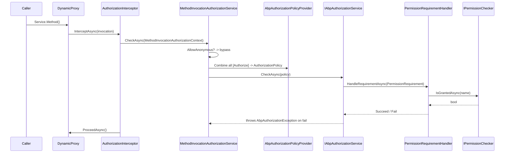

ABP's authorization layer is a thin shell over ASP.NET Core authorization. It does three things the framework does not: it lets you decorate application services (not just controllers) with `[Authorize]` and have it enforced via a Castle interceptor, it treats *every defined permission as an authorization policy* — so `[Authorize("MyApp.Books.Edit")]` works without registering a policy by hand — and it ships a pluggable `IPermissionChecker` that combines multiple `IPermissionValueProvider`s (Role → User → Client, plus tenant-scoped grants) to produce a final `Granted` / `Prohibited` / `Undefined` decision.

The runtime (interceptor, policy provider, checker, value providers) lives in `framework/src/Volo.Abp.Authorization/`. The abstractions, `[AllowAnonymous]`-compatible attribute model, requirement, handler, `MultiplePermissionGrantResult`, and the `AlwaysAllow*` fallbacks live in `framework/src/Volo.Abp.Authorization.Abstractions/`.

## File inventory

| Path under `framework/src/Volo.Abp.Authorization/` | Role |
| --- | --- |
| `Volo/Abp/Authorization/AbpAuthorizationModule.cs` | Wires `AuthorizationInterceptorRegistrar` into `OnRegistered`. |
| `Volo/Abp/Authorization/AuthorizationInterceptor.cs` | Castle interceptor: calls `IMethodInvocationAuthorizationService.CheckAsync` then `ProceedAsync`. |
| `Volo/Abp/Authorization/AuthorizationInterceptorRegistrar.cs` | Attaches the interceptor to types that have an `[Authorize]` anywhere. |
| `Volo/Abp/Authorization/MethodInvocationAuthorizationService.cs` | Combines all `[Authorize]` attributes on a method into one policy and checks it. |
| `Volo/Abp/Authorization/AbpAuthorizationPolicyProvider.cs` | Falls back to the permission manager when MVC has no registered policy. |
| `Volo/Abp/Authorization/AbpAuthorizationService.cs` | `[Dependency(TryRegister)]` replacement of MVC's authorization service. |
| `Volo/Abp/Authorization/AbpAuthorizationErrorCodes.cs` | `Volo.Authorization:010001` / `010002`. |
| `Volo/Abp/Authorization/Permissions/PermissionChecker.cs` | Composes value providers; respects MultiTenancy and `SimpleStateChecker`s. |
| `Volo/Abp/Authorization/Permissions/PermissionDefinitionManager.cs` | Merges static + dynamic permission stores. |
| `Volo/Abp/Authorization/Permissions/PermissionValueProviderManager.cs` | Materializes the configured `Options.ValueProviders`. |
| `Volo/Abp/Authorization/Permissions/UserPermissionValueProvider.cs` | `"U"` — looks up grant by `UserId` claim. |
| `Volo/Abp/Authorization/Permissions/RolePermissionValueProvider.cs` | `"R"` — looks up grant by `Role` claims. |
| `Volo/Abp/Authorization/Permissions/ClientPermissionValueProvider.cs` | `"C"` — looks up grant by `client_id` claim. |
| `Volo/Abp/Authorization/Permissions/StaticPermissionDefinitionStore.cs` | Runs every `IPermissionDefinitionProvider` once. |
| `Volo/Abp/Authorization/Permissions/RequirePermissionsSimpleStateChecker.cs` | Lets a permission depend on another (parent must be granted). |

| Path under `framework/src/Volo.Abp.Authorization.Abstractions/` | Role |
| --- | --- |
| `Volo/Abp/Authorization/IAbpAuthorizationPolicyProvider.cs` | Adds `GetPoliciesNamesAsync()` to MVC's interface. |
| `Volo/Abp/Authorization/IAbpAuthorizationService.cs` | Just a re-export of MVC's `IAuthorizationService` so it can be replaced. |
| `Volo/Abp/Authorization/IMethodInvocationAuthorizationService.cs` | Single-method seam the interceptor depends on. |
| `Volo/Abp/Authorization/PermissionRequirement.cs` | `IAuthorizationRequirement` carrying a permission name. |
| `Volo/Abp/Authorization/PermissionRequirementHandler.cs` | Bridges MVC's handler model into `IPermissionChecker`. |
| `Volo/Abp/Authorization/AlwaysAllowAuthorizationService.cs` | Test/seed double — returns `AuthorizationResult.Success()` for everything. |
| `Volo/Abp/Authorization/AlwaysAllowMethodInvocationAuthorizationService.cs` | Method-level twin of the above. |
| `Volo/Abp/Authorization/Permissions/IPermissionChecker.cs` | `IsGrantedAsync(name)`, `IsGrantedAsync(principal, name)`, batch overloads. |
| `Volo/Abp/Authorization/Permissions/IPermissionDefinitionManager.cs` | Read view across static + dynamic stores. |
| `Volo/Abp/Authorization/Permissions/IPermissionDefinitionContext.cs` | `AddGroup(...)` API for providers. |
| `Volo/Abp/Authorization/Permissions/IPermissionDefinitionProvider.cs` | Module-level hook: `Define(IPermissionDefinitionContext)`. |
| `Volo/Abp/Authorization/Permissions/IPermissionStore.cs` | Storage seam — `IsGrantedAsync(name, providerName, providerKey)`. |
| `Volo/Abp/Authorization/Permissions/IPermissionValueProvider.cs` | Lookup seam — given a `(principal, permission)`, return `Granted`/`Prohibited`/`Undefined`. |
| `Volo/Abp/Authorization/Permissions/PermissionDefinition.cs` | Permission DTO — name, parent, multi-tenancy side, providers, simple-state checkers. |
| `Volo/Abp/Authorization/Permissions/PermissionGrantResult.cs` | `Undefined`, `Granted`, `Prohibited`. |
| `Volo/Abp/Authorization/Permissions/MultiplePermissionGrantResult.cs` | Batch result dictionary + `AllGranted`/`AllProhibited`. |
| `Volo/Abp/Authorization/Permissions/NullPermissionStore.cs` | Default placeholder when nothing more concrete is registered. |

## Key abstractions

| Member | Signature | Purpose |
| --- | --- | --- |
| `IPermissionChecker.IsGrantedAsync(string name)` | `Task<bool>` | Single-permission check against the current principal. |
| `IPermissionChecker.IsGrantedAsync(ClaimsPrincipal?, string)` | `Task<bool>` | Same against an explicit principal. |
| `IPermissionChecker.IsGrantedAsync(string[] names)` | `Task<MultiplePermissionGrantResult>` | Batched check — one DB round-trip per provider. |
| `PermissionGrantResult` enum | `Undefined` / `Granted` / `Prohibited` | A `Prohibited` from *any* provider beats any `Granted`. |
| `IPermissionDefinitionManager.GetAsync(name)` | `Task<PermissionDefinition>` | Throws `AbpException("Undefined permission: ...")` if missing. |
| `IPermissionDefinitionManager.GetOrNullAsync(name)` | `Task<PermissionDefinition?>` | Returns `null` on miss; used by the policy provider. |
| `IPermissionDefinitionContext.AddGroup(name, displayName)` | `PermissionGroupDefinition` | Entry point inside a `IPermissionDefinitionProvider`. |
| `[Authorize("Permission.Name")]` | MVC attribute | Treated as a policy name; resolved through `AbpAuthorizationPolicyProvider`. |
| `[AllowAnonymous]` | MVC attribute | Bypasses the method-level interceptor. |
| `IMethodInvocationAuthorizationService.CheckAsync(ctx)` | `Task` | Combines all `[Authorize]` attributes into one policy and calls `IAbpAuthorizationService.CheckAsync`. |
| `PermissionRequirement(string name)` | `IAuthorizationRequirement` | Carried inside the auto-generated `AuthorizationPolicy`. |
| `IPermissionValueProvider.Name` | `string` (`"U"`, `"R"`, `"C"`, …) | Discriminator written into `IPermissionStore`. |
| `PermissionDefinition.MultiTenancySide` | `MultiTenancySides` flags | `PermissionChecker` short-circuits if the side doesn't match. |
| `PermissionDefinition.Providers` | `List<string>` | If non-empty, restricts which value providers can grant/store this permission. |
| `PermissionDefinition.StateCheckers` | `List<ISimpleStateChecker<PermissionDefinition>>` | Composable conditions that disable a permission (e.g. global-feature off). |

## How a target gets the interceptor

`AuthorizationInterceptorRegistrar` runs once per service registration:

```csharp
public static void RegisterIfNeeded(IOnServiceRegistredContext context)
{
    if (ShouldIntercept(context.ImplementationType))
        context.Interceptors.TryAdd<AuthorizationInterceptor>();
}

private static bool ShouldIntercept(Type type)
{
    return !DynamicProxyIgnoreTypes.Contains(type) &&
           (type.IsDefined(typeof(AuthorizeAttribute), true) || AnyMethodHasAuthorizeAttribute(type));
}
```

So the interceptor is attached if **any** method on the type — or the type itself — declares `[Authorize]`. Anything else (free functions, infrastructure, etc.) goes through the proxy untouched.

## The method-invocation pipeline



### Step 1 — `AuthorizationInterceptor`

```csharp
public override async Task InterceptAsync(IAbpMethodInvocation invocation)
{
    await AuthorizeAsync(invocation);
    await invocation.ProceedAsync();
}

protected virtual async Task AuthorizeAsync(IAbpMethodInvocation invocation)
{
    await _methodInvocationAuthorizationService.CheckAsync(
        new MethodInvocationAuthorizationContext(invocation.Method));
}
```

There is no per-target `ShouldIntercept` check at runtime — the registrar already filtered. The cross-cutting concern key `AbpCrossCuttingConcerns.Authorization` is **not** consulted here (compare with the auditing interceptor), so authorization cannot be temporarily disabled by `AbpCrossCuttingConcerns.Applying`. To skip a single call, decorate it with `[AllowAnonymous]`.

### Step 2 — `MethodInvocationAuthorizationService` combines attributes

```csharp
public async Task CheckAsync(MethodInvocationAuthorizationContext context)
{
    if (AllowAnonymous(context)) return;

    var authorizationPolicy = await AuthorizationPolicy.CombineAsync(
        _abpAuthorizationPolicyProvider,
        GetAuthorizationDataAttributes(context.Method)
    );

    if (authorizationPolicy == null) return;
    await _abpAuthorizationService.CheckAsync(authorizationPolicy);
}
```

`GetAuthorizationDataAttributes` walks the *method* attributes first, then unions the *declaring type* attributes if the method is public. `AuthorizationPolicy.CombineAsync` (the MVC built-in) resolves each policy *by name* through `IAbpAuthorizationPolicyProvider`. Multiple `[Authorize("A"), Authorize("B")]` decorations therefore demand both A and B (logical AND), matching the MVC semantics.

### Step 3 — `AbpAuthorizationPolicyProvider` synthesizes a policy

```csharp
public override async Task<AuthorizationPolicy?> GetPolicyAsync(string policyName)
{
    var policy = await base.GetPolicyAsync(policyName);
    if (policy != null) return policy;

    var permission = await _permissionDefinitionManager.GetOrNullAsync(policyName);
    if (permission != null)
    {
        //TODO: Optimize & Cache!
        var policyBuilder = new AuthorizationPolicyBuilder(Array.Empty<string>());
        policyBuilder.Requirements.Add(new PermissionRequirement(policyName));
        return policyBuilder.Build();
    }

    return null;
}
```

If the policy name was registered via `services.AddAuthorization(o => o.AddPolicy(...))`, the base provider wins. Otherwise the policy name is looked up as a **permission** and wrapped in a `PermissionRequirement`. The empty-string scheme array means the policy is *not* tied to a particular `AuthenticationScheme` — the current principal (cookie, JWT, whatever) is used as-is.

`GetPoliciesNamesAsync()` returns the union of `AuthorizationOptions.GetPoliciesNames()` and every known permission name — this is what the MVC discovery endpoints expose.

### Step 4 — `PermissionRequirementHandler`

The handler is plain MVC: it resolves `IPermissionChecker` from DI, calls `IsGrantedAsync(requirement.Name)`, and either calls `context.Succeed(requirement)` or leaves the requirement unsatisfied. When the policy fails, `AbpAuthorizationService` throws `AbpAuthorizationException` (`code: AbpAuthorizationErrorCodes.GivenPolicyHasNotGranted`), which the exception-handling layer maps to HTTP 403.

### Step 5 — `PermissionChecker`

`PermissionChecker.IsGrantedAsync(principal, name)` is the actual decision engine:

```csharp
var permission = await PermissionDefinitionManager.GetOrNullAsync(name);
if (permission == null)           return false;
if (!permission.IsEnabled)        return false;
if (!await StateCheckerManager.IsEnabledAsync(permission)) return false;

var multiTenancySide = claimsPrincipal?.GetMultiTenancySide()
                        ?? CurrentTenant.GetMultiTenancySide();

if (!permission.MultiTenancySide.HasFlag(multiTenancySide)) return false;

var isGranted = false;
var context   = new PermissionValueCheckContext(permission, claimsPrincipal);
foreach (var provider in PermissionValueProviderManager.ValueProviders)
{
    if (context.Permission.Providers.Any() &&
        !context.Permission.Providers.Contains(provider.Name)) continue;

    var result = await provider.CheckAsync(context);
    if      (result == PermissionGrantResult.Granted)    isGranted = true;
    else if (result == PermissionGrantResult.Prohibited) return false;
}
return isGranted;
```

The five gates, in order, are:

1. **Definition exists** (`null` → false).
2. **Definition enabled** (`PermissionDefinition.IsEnabled`).
3. **Simple state checkers enabled** — `RequireGlobalFeaturesSimpleStateChecker`, `RequireFeaturesSimpleStateChecker`, `RequireAuthenticatedSimpleStateChecker`, etc.
4. **Multi-tenancy side matches** — see [Multi-tenancy](/framework/cross/multi-tenancy).
5. **Value providers** are consulted in order. A `Prohibited` short-circuits to `false`. Any `Granted` sets the answer to `true` but the loop continues so a later `Prohibited` can still veto.

The batched overload (`Task<MultiplePermissionGrantResult> IsGrantedAsync(string[] names)`) does the same work in fewer DB hits: every provider receives one `PermissionValuesCheckContext` carrying *all* still-undefined permissions. Once `result.AllGranted || result.AllProhibited`, the loop breaks early.

### How `UserPermissionValueProvider` reads claims

```csharp
public override async Task<PermissionGrantResult> CheckAsync(PermissionValueCheckContext context)
{
    var userId = context.Principal?.FindFirst(AbpClaimTypes.UserId)?.Value;
    if (userId == null) return PermissionGrantResult.Undefined;

    return await PermissionStore.IsGrantedAsync(context.Permission.Name, Name, userId)
        ? PermissionGrantResult.Granted
        : PermissionGrantResult.Undefined;
}
```

Three things stand out: the provider returns `Undefined` (not `Prohibited`) when no user claim exists, so the chain falls back to role/client providers; the discriminator passed to the store is the provider's `Name` (`"U"`); and the *value* of the user-id claim is whatever string is stored under `AbpClaimTypes.UserId`. See [Security](/framework/cross/security) for how those claim constants are defined.

`RolePermissionValueProvider.Name == "R"` does the same with `AbpClaimTypes.Role` claims (one DB lookup per role), and `ClientPermissionValueProvider.Name == "C"` does it with `AbpClaimTypes.ClientId`. The `Identity Pro` modules add `OrganizationUnitPermissionValueProvider` (`"O"`) on top.

## Defining a permission

`IPermissionDefinitionProvider` is the *only* idiomatic place to declare a permission. The static store discovers all providers via convention (any class implementing the interface) and runs `Define(IPermissionDefinitionContext)` once at boot:

```csharp
public class BookStorePermissionDefinitionProvider : PermissionDefinitionProvider
{
    public override void Define(IPermissionDefinitionContext context)
    {
        var bookStoreGroup = context.AddGroup("BookStore", L("Permission:BookStore"));

        var books = bookStoreGroup.AddPermission(
            "BookStore.Books",
            L("Permission:Books"),
            multiTenancySide: MultiTenancySides.Both);

        books.AddChild("BookStore.Books.Create", L("Permission:Books.Create"));
        books.AddChild("BookStore.Books.Edit",   L("Permission:Books.Edit"));
        books.AddChild("BookStore.Books.Delete", L("Permission:Books.Delete"));

        // Limit to user-level grants only:
        books.WithProviders(UserPermissionValueProvider.ProviderName);
    }
}
```

Children inherit the runtime "parent must be granted" rule via `RequirePermissionsSimpleStateChecker`. `MultiTenancySide` defaults to `Both`; `IsEnabled` defaults to `true`.

`PermissionDefinitionManager` merges with a *dynamic* store (`IDynamicPermissionDefinitionStore`) — the default `NullDynamicPermissionDefinitionStore` is a no-op, while `Volo.Abp.PermissionManagement.Dynamic` pulls definitions from a DB. Static definitions always win on name collision:

```csharp
return staticPermissions.Concat(
    dynamicPermissions.Where(d => !staticPermissionNames.Contains(d.Name))
).ToImmutableList();
```

## Conventions worth knowing

- `AbpAuthorizationService` is registered with `[Dependency(TryRegister = true)]` so MVC's default `IAuthorizationService` is overridden. The replacement also implements `IAbpAuthorizationService` and exposes `CurrentPrincipal` via `ICurrentPrincipalAccessor`.
- `AlwaysAllowAuthorizationService` and `AlwaysAllowMethodInvocationAuthorizationService` are *not* registered by default — use them in integration tests by replacing the registrations to suppress all authorization checks.
- `PermissionGrantResult.Prohibited` is rare in built-in providers (they usually return `Undefined`). It exists for explicit deny rules in custom providers — e.g. an "is in deny list" check.
- A permission with empty `Providers` is queryable by every registered value provider. Setting `Providers = ["U"]` makes the permission user-only and the role-grant UI will skip it.
- `RequirePermissionsSimpleBatchStateChecker` enables an optimization: when checking many permissions at once, all *parent* permission requirements are batched into one store call.

## Configuration

`AbpPermissionOptions.ValueProviders` controls both the order and the membership of the chain. The default boot order (set in `AbpAuthorizationModule.PreConfigureServices` / `ConfigureServices` of consumer modules like `Identity`) is `Role → User → Client`. Insert your own provider with:

```csharp
Configure<AbpPermissionOptions>(options =>
{
    options.ValueProviders.Add<MyOrgUnitPermissionValueProvider>();
});
```

`AuthorizationOptionsExtensions.GetPoliciesNames()` is the helper that `IAbpAuthorizationPolicyProvider.GetPoliciesNamesAsync` calls — it reflects over the MVC `AuthorizationOptions` to list every explicitly registered policy.

## Gotchas

- **`[Authorize]` on a non-virtual method is ignored.** Castle interception requires virtual members or interface-based registration. Application services usually inherit from `ApplicationService` whose members are virtual; plain POCO services are not.
- **`PermissionGrantResult.Prohibited` never decays.** Once any provider returns `Prohibited`, no later `Granted` from another provider can override it. Use this for emergency revocations, not for normal flow.
- **Define before you check.** `PermissionChecker.IsGrantedAsync` silently returns `false` when the definition is missing — there is no error. If users complain they "can't see anything", the most common cause is a typo in the permission name *or* a forgotten `IPermissionDefinitionProvider`.
- **Multi-tenancy side enforcement is mandatory.** A permission with `MultiTenancySide = Tenant` returns `false` for host users — *even if granted in the store*. There is no `Force` flag.
- **AspNetCore policy provider does not cache** — there is a `//TODO: Optimize & Cache!` next to `AuthorizationPolicyBuilder` allocation in `AbpAuthorizationPolicyProvider`. For high-RPS APIs, wrap your own caching `IAuthorizationPolicyProvider` decorator.
- **`AbpAuthorizationService` does not throw `UnauthorizedAccessException`.** It throws `AbpAuthorizationException` with an error code, which the exception-handling layer maps to 403 (authenticated) or 401 (anonymous). Wrap calls in `try { ... } catch (AbpAuthorizationException)` only when you want to swallow them.
- **Application service interceptor ≠ controller filter.** ASP.NET Core's `AuthorizeFilter` runs before the action method. `AuthorizationInterceptor` runs at the application-service boundary — so a controller may pass `[Authorize]` while an internal application-service call still fails authorization with the same attribute applied. This is intentional: it means non-HTTP entry points (background workers, message handlers) get the same checks.
- **`AllowAnonymous` is detected by `OfType<IAllowAnonymous>()`.** Both `[AllowAnonymous]` and custom attributes implementing `IAllowAnonymous` are honored. Use this to whitelist a single method on an otherwise `[Authorize]`-decorated class.
