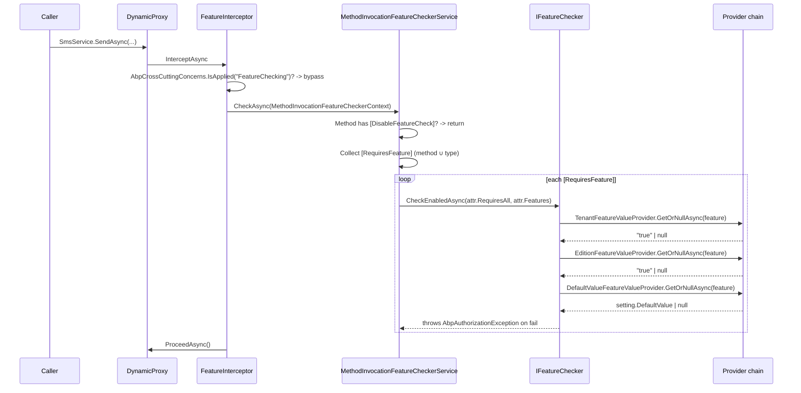

A *feature* in ABP is a string-valued switch attached to an edition or a tenant — "MaxUserCount = 10", "EnableMultiTenancy = true", "MailModule = false". The framework treats every feature value as a `string?` and lets each definition expose a `IStringValueType` (toggle, free text, selection, numeric…) for editors. At runtime, `IFeatureChecker` walks a provider chain (`TenantFeatureValueProvider → EditionFeatureValueProvider → DefaultValueFeatureValueProvider`) and returns the first non-null hit. The `[RequiresFeature("...")]` attribute turns "feature must be enabled" into a method-level precondition enforced by `FeatureInterceptor`.

Source lives in `framework/src/Volo.Abp.Features/`. The interceptor depends on `Volo.Abp.Authorization.Abstractions` because feature-failure errors are reported via `AbpAuthorizationException` — the same exception type as permission denials.

## File inventory

| Path under `framework/src/Volo.Abp.Features/Volo/Abp/Features/` | Role |
| --- | --- |
| `AbpFeaturesModule.cs` | Registers interceptor + auto-discovers `IFeatureDefinitionProvider`s. |
| `AbpFeatureOptions.cs` | `DefinitionProviders`, `ValueProviders`, `DeletedFeatures`/`DeletedFeatureGroups`. |
| `AbpFeatureErrorCodes.cs` | `Volo.Feature:010001` ("not enabled"), `010002` ("all must be enabled"), `010003` ("any must be enabled"). |
| `IFeatureChecker.cs` | `GetOrNullAsync(name)`, `IsEnabledAsync(name)`. |
| `FeatureChecker.cs` / `FeatureCheckerBase.cs` | Default `IFeatureChecker` — walks the value-provider chain in **reverse** order. |
| `FeatureCheckerExtensions.cs` | `GetAsync<T>`, `IsEnabledAsync(requiresAll, params)`, `CheckEnabledAsync(...)`. |
| `IFeatureValueProvider.cs` / `FeatureValueProvider.cs` | Provider abstraction — discriminator `Name` + `GetOrNullAsync(FeatureDefinition)`. |
| `DefaultValueFeatureValueProvider.cs` | `"D"` — returns `setting.DefaultValue`. |
| `EditionFeatureValueProvider.cs` | `"E"` — reads `editionid` claim from principal. |
| `TenantFeatureValueProvider.cs` | `"T"` — reads `CurrentTenant.Id`. |
| `FeatureInterceptor.cs` | Castle interceptor — calls `IMethodInvocationFeatureCheckerService`. |
| `FeatureInterceptorRegistrar.cs` | Attaches the interceptor to types that declare `[RequiresFeature]` anywhere. |
| `MethodInvocationFeatureCheckerService.cs` | Combines all `[RequiresFeature]` attrs and calls `IFeatureChecker.CheckEnabledAsync`. |
| `MethodInvocationFeatureCheckerContext.cs` | `MethodInfo` + (target type) state object. |
| `DisableFeatureCheckAttribute.cs` | Method/class opt-out — bypasses the interceptor. |
| `RequiresFeatureAttribute.cs` | `string[] Features` + `bool RequiresAll = false`. |
| `FeatureDefinition.cs` | DTO — Name, DefaultValue, Parent/Children, ValueType, AllowedProviders, IsVisibleToClients. |
| `FeatureGroupDefinition.cs` | Container for related features (e.g. "EmailModule"). |
| `IFeatureDefinitionContext.cs` / `FeatureDefinitionContext.cs` | `AddGroup(...)` API for providers. |
| `FeatureDefinitionProvider.cs` / `IFeatureDefinitionProvider.cs` | Hook called once at boot per provider class. |
| `IFeatureDefinitionManager.cs` / `FeatureDefinitionManager.cs` | Merges static + dynamic stores. |
| `IStaticFeatureDefinitionStore.cs` / `StaticFeatureDefinitionStore.cs` | Runs every provider and caches `FeatureDefinition` map. |
| `IDynamicFeatureDefinitionStore.cs` / `NullDynamicFeatureDefinitionStore.cs` | Pluggable DB-backed store (no-op by default). |
| `IFeatureStore.cs` / `NullFeatureStore.cs` | `GetOrNullAsync(name, providerName, providerKey)` — value-storage seam. |
| `RequireFeaturesSimpleStateChecker.cs` | Bridges feature requirements into the `SimpleStateChecker` framework (used by Permissions). |

## Key abstractions

| Member | Signature | Purpose |
| --- | --- | --- |
| `IFeatureChecker.GetOrNullAsync(name)` | `Task<string?>` | Raw value lookup across the chain. |
| `IFeatureChecker.IsEnabledAsync(name)` | `Task<bool>` | Convenience — `bool.Parse(GetOrNullAsync)` with empty/null → `false`. |
| `IFeatureChecker.GetAsync<T>(name, default = default)` | `Task<T>` (extension) | Strongly-typed value (`int`, `decimal`, enums via `To<T>()`). |
| `IFeatureChecker.IsEnabledAsync(bool requiresAll, params string[] names)` | `Task<bool>` | Logical AND/OR check across many features. |
| `IFeatureChecker.CheckEnabledAsync(name)` | `Task` | Throws `AbpAuthorizationException(code: FeatureIsNotEnabled, data: {FeatureName})` on fail. |
| `[RequiresFeature("F1", "F2")]` | attribute | Method/class precondition — default is OR semantics. |
| `[RequiresFeature("F1", "F2") { RequiresAll = true }]` | attribute | AND semantics. |
| `[DisableFeatureCheck]` | attribute | Suppress the interceptor for one method. |
| `IFeatureValueProvider.Name` | `string` (`"D"`, `"E"`, `"T"`, …) | Discriminator that the store keys on. |
| `FeatureDefinition.DefaultValue` | `string?` | Read by `DefaultValueFeatureValueProvider` — final fallback. |
| `FeatureDefinition.AllowedProviders` | `List<string>` | When non-empty, restricts which providers may read/write this feature. |
| `FeatureDefinition.IsAvailableToHost` | `bool` (default `true`) | UI hint — does not block reads. |
| `FeatureDefinition.ValueType` | `IStringValueType` | Editor metadata: `ToggleStringValueType`, `FreeTextStringValueType`, `SelectionStringValueType`, `NumericValueValidator`. |
| `FeatureDefinitionManager.GetAsync(name)` | `Task<FeatureDefinition>` | Throws on miss (used by `IFeatureChecker`). |
| `IFeatureStore.GetOrNullAsync(name, providerName, providerKey)` | `Task<string?>` | Raw provider-keyed value (e.g. provider="T", key=tenantId). |

## How a method gets gated



### The interceptor

`FeatureInterceptor` is `ITransientDependency` and creates a fresh `IServiceScope` per call (same pattern as `AuditingInterceptor`):

```csharp
public override async Task InterceptAsync(IAbpMethodInvocation invocation)
{
    if (AbpCrossCuttingConcerns.IsApplied(invocation.TargetObject, AbpCrossCuttingConcerns.FeatureChecking))
    {
        await invocation.ProceedAsync();
        return;
    }

    await CheckFeaturesAsync(invocation);
    await invocation.ProceedAsync();
}
```

Unlike `[Authorize]`, feature checking *can* be suppressed at runtime by wrapping the call in `using (AbpCrossCuttingConcerns.Applying(target, AbpCrossCuttingConcerns.FeatureChecking))`.

`FeatureInterceptorRegistrar.ShouldIntercept` requires either a class-level or method-level `[RequiresFeature]`:

```csharp
return !DynamicProxyIgnoreTypes.Contains(type) &&
       (type.IsDefined(typeof(RequiresFeatureAttribute), true) ||
        AnyMethodHasRequiresFeatureAttribute(type));
```

### Combining attributes

`MethodInvocationFeatureCheckerService.CheckAsync` walks method attributes first, then unions the *declaring type* attributes (only if the method is public — non-public methods stop short to avoid leaking class-level gates onto internal helpers):

```csharp
public async Task CheckAsync(MethodInvocationFeatureCheckerContext context)
{
    if (IsFeatureCheckDisabled(context)) return;

    foreach (var requiresFeatureAttribute in GetRequiredFeatureAttributes(context.Method))
    {
        await _featureChecker.CheckEnabledAsync(
            requiresFeatureAttribute.RequiresAll,
            requiresFeatureAttribute.Features);
    }
}
```

Multiple `[RequiresFeature]` attributes on the same method are processed independently — i.e. they are AND-combined. Inside a single attribute the `RequiresAll` flag toggles AND vs OR semantics:

```csharp
public static async Task CheckEnabledAsync(this IFeatureChecker featureChecker, bool requiresAll, params string[] featureNames)
{
    if (featureNames.IsNullOrEmpty()) return;

    if (requiresAll)
    {
        foreach (var featureName in featureNames)
            if (!(await featureChecker.IsEnabledAsync(featureName)))
                throw new AbpAuthorizationException(code: AbpFeatureErrorCodes.AllOfTheseFeaturesMustBeEnabled)
                    .WithData("FeatureNames", string.Join(", ", featureNames));
    }
    else
    {
        // throws AnyOfTheseFeaturesMustBeEnabled if none are enabled
    }
}
```

### The value-provider chain

`FeatureChecker.GetOrNullAsync` walks `Options.ValueProviders` **in reverse**:

```csharp
public override async Task<string?> GetOrNullAsync(string name)
{
    var featureDefinition = await FeatureDefinitionManager.GetAsync(name);
    var providers = Enumerable.Reverse(Providers);

    if (featureDefinition.AllowedProviders.Any())
        providers = providers.Where(p => featureDefinition.AllowedProviders.Contains(p.Name));

    return await GetOrNullValueFromProvidersAsync(providers, featureDefinition);
}
```

`AbpFeaturesModule.ConfigureServices` registers them in declaration order:

```csharp
options.ValueProviders.Add<DefaultValueFeatureValueProvider>();   // "D"
options.ValueProviders.Add<EditionFeatureValueProvider>();        // "E"
options.ValueProviders.Add<TenantFeatureValueProvider>();         // "T"
```

Reversed, the effective lookup order is **Tenant → Edition → Default**. The first provider that returns a non-null string wins. So:

- A tenant-set value always overrides the edition's value.
- An edition's value overrides `FeatureDefinition.DefaultValue`.
- If nothing is set anywhere, `GetOrNullAsync` returns `null`, and `IsEnabledAsync` therefore returns `false`.

The `TenantFeatureValueProvider` reads `CurrentTenant.Id?.ToString()`:

```csharp
public override async Task<string?> GetOrNullAsync(FeatureDefinition feature)
{
    return await FeatureStore.GetOrNullAsync(feature.Name, Name, CurrentTenant.Id?.ToString());
}
```

`EditionFeatureValueProvider` reads `editionid` from the principal claims:

```csharp
public override async Task<string?> GetOrNullAsync(FeatureDefinition feature)
{
    var editionId = PrincipalAccessor.Principal?.FindEditionId();
    if (editionId == null) return null;
    return await FeatureStore.GetOrNullAsync(feature.Name, Name, editionId.Value.ToString());
}
```

Both bottom out in `IFeatureStore.GetOrNullAsync`; the default `NullFeatureStore` returns `null` everywhere — so without the `Volo.Abp.FeatureManagement` module (which ships an EF/Mongo-backed `FeatureManagementStore`), only `DefaultValue` is ever returned.

### `IsEnabledAsync` parsing

`FeatureCheckerBase.IsEnabledAsync` parses the resolved string strictly:

```csharp
public virtual async Task<bool> IsEnabledAsync(string name)
{
    var value = await GetOrNullAsync(name);
    if (value.IsNullOrEmpty()) return false;

    try { return bool.Parse(value!); }
    catch (Exception ex)
    {
        throw new AbpException(
            $"The value '{value}' for the feature '{name}' should be a boolean, but was not!", ex);
    }
}
```

So a feature meant for `IsEnabledAsync` must store `"true"` or `"false"` literally. Numeric features (`MaxUserCount = "10"`) must be read via `GetAsync<int>` instead.

## Defining features

```csharp
public class MyFeatureDefinitionProvider : FeatureDefinitionProvider
{
    public override void Define(IFeatureDefinitionContext context)
    {
        var group = context.AddGroup("Crm");

        var sms = group.AddFeature(
            name: "Crm.SmsNotifications",
            defaultValue: "false",
            displayName: L("Sms"),
            valueType: new ToggleStringValueType());      // checkbox in UI

        sms.AddChild(
            name: "Crm.SmsNotifications.DailyLimit",
            defaultValue: "100",
            valueType: new FreeTextStringValueType(new NumericValueValidator(0, 100000)));

        // Limit who can store the value:
        sms.WithProviders(TenantFeatureValueProvider.ProviderName); // tenant-only feature
    }
}
```

`AbpFeaturesModule` auto-discovers providers via `services.OnRegistered(...)` so no manual registration is needed:

```csharp
services.OnRegistered(context =>
{
    if (typeof(IFeatureDefinitionProvider).IsAssignableFrom(context.ImplementationType))
        definitionProviders.Add(context.ImplementationType);
});
```

A *child* feature inherits the rule "parent must be enabled" through `RequireFeaturesSimpleStateChecker` (used by the `Permissions` module when a permission is gated by a feature) — but `FeatureChecker` itself does **not** automatically enforce parent inheritance. If you want a transitive precondition, attribute both: `[RequiresFeature("Crm.SmsNotifications", "Crm.SmsNotifications.DailyLimit") { RequiresAll = true }]`.

## ApplicationService.CheckFeatureAsync

`ApplicationService` (in `Volo.Abp.Ddd.Application`) exposes a `FeatureChecker` property and a helper:

```csharp
protected virtual Task CheckFeatureAsync(string featureName)
    => FeatureChecker.CheckEnabledAsync(featureName);
```

Use this from inside a method body when the feature gate is *conditional* (e.g. only on certain inputs) and an attribute wouldn't suffice. The exception thrown is identical to what `[RequiresFeature]` would have thrown — `AbpAuthorizationException` with code `Volo.Feature:010001` — so the same UI handler renders it.

## Localized error mapping

`AbpFeaturesModule` registers an `AbpExceptionLocalizationOptions` namespace mapping:

```csharp
Configure<AbpExceptionLocalizationOptions>(options =>
{
    options.MapCodeNamespace("Volo.Feature", typeof(AbpFeatureResource));
});
```

Combined with `WithData("FeatureName", ...)` on the thrown exception, the exception-handling layer renders a localized message via the embedded JSON resources in `Volo.Abp.Features/Localization/`. The UI sees "Feature is not enabled: SmsNotifications" rather than a stack trace.

## Configuration

```csharp
Configure<AbpFeatureOptions>(options =>
{
    // Add a value provider (e.g. for org-units):
    options.ValueProviders.Add<OrganizationUnitFeatureValueProvider>();

    // Remove a feature added by a dependent module:
    options.DeletedFeatures.Add("SomeLegacyFeature");

    // Or remove an entire group:
    options.DeletedFeatureGroups.Add("LegacyModule");
});
```

`DeletedFeatures` / `DeletedFeatureGroups` are consulted by `StaticFeatureDefinitionStore` after every provider has populated the context — definitions whose names match are dropped before the static cache freezes.

## Gotchas

- **Lookup order is reversed.** `Options.ValueProviders` is added Default → Edition → Tenant, but `FeatureChecker` queries in reverse. Add a new provider with `Insert(0, …)` if you want it to be the *final* fallback, or `Add(…)` (the default) to make it override every earlier provider.
- **`IsEnabledAsync` returns `false` on parse failure of empty/null.** A `"yes"` or `"1"` value will throw `AbpException` — store literal `"true"` / `"false"`.
- **`AllowedProviders` filters reads too.** A feature declared with `WithProviders("T")` can never be read from the edition store, even if a value is present there — the `EditionFeatureValueProvider` is filtered out of the chain.
- **`NullFeatureStore` is the default.** Without the `Volo.Abp.FeatureManagement` module, only `DefaultValue` ever applies. Tenants/editions silently report `null` for every feature.
- **Method must be public-or-virtual.** Castle interception is required. `[RequiresFeature]` on a non-virtual private method has no effect.
- **`MethodInvocationFeatureCheckerService.GetRequiredFeatureAttributes` only walks `DeclaringType`.** Inherited attributes from an *interface* are not picked up; put `[RequiresFeature]` on the class or override.
- **`AbpAuthorizationException` is the failure type.** Code that catches `FeatureNotEnabledException` will fail — feature failures are authorization failures, not their own type. The error *code* (`Volo.Feature:010001`) is the discriminator.
- **`FeatureChecker` resolves providers lazily.** They are materialized on first use via `Lazy<List<IFeatureValueProvider>>`. Mutating `Options.ValueProviders` after the first call has no effect.
- **`DisableFeatureCheckAttribute` only suppresses attributes on the method itself.** It does not bypass the registrar — the interceptor still runs — but `IsFeatureCheckDisabled` short-circuits before any attribute is evaluated.
- **Children do not auto-inherit parent's gating.** Checking `Crm.SmsNotifications.DailyLimit` does *not* implicitly check `Crm.SmsNotifications`. This is by design — the parent/child relation is for UI grouping and for `SimpleStateChecker` composition only.
