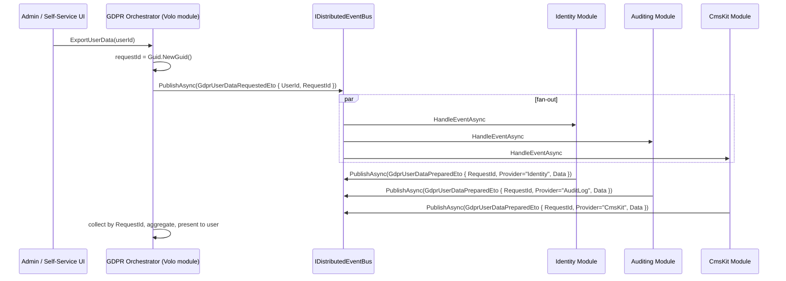
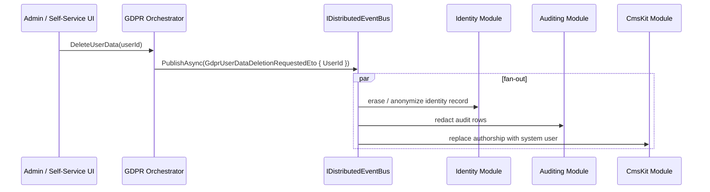

`Volo.Abp.Gdpr.Abstractions` is a *contract-only* package — six files, no services, no behavior. It defines the shape of the messages that flow through the distributed event bus when an administrator (or the user themselves) triggers a personal-data **export** or **deletion** request, and it defines `GdprDataInfo`, the simple `Dictionary<string, string>` carrier modules use to hand back the data they own. Modules opt in by *subscribing* to the request ETOs and *publishing* a `GdprUserDataPreparedEto` per provider, or by *subscribing* to the deletion ETO and performing the erasure inside their own bounded context. The actual orchestrator (a UI, a background-job runner, a CRUD service) is shipped by Volo's commercial GDPR module — the framework provides only the wire shapes.

This page documents every type in `framework/src/Volo.Abp.Gdpr.Abstractions/` and the canonical event-bus flow modules implement on top of them.

## File inventory

| Path under `framework/src/Volo.Abp.Gdpr.Abstractions/Volo/Abp/Gdpr/` | Role |
| --- | --- |
| `AbpGdprAbstractionsModule.cs` | Module marker — no services. |
| `GdprDataInfo.cs` | `[Serializable] public class GdprDataInfo : Dictionary<string, string>` — the data carrier. |
| `GdprUserDataProviderContext.cs` | `class GdprUserDataProviderContext { Guid UserId; }` — non-serialized context handed to in-process providers. |
| `GdprUserDataRequestedEto.cs` | `[Serializable] class GdprUserDataRequestedEto { Guid UserId; Guid RequestId; }` — *fan-out* to providers. |
| `GdprUserDataPreparedEto.cs` | `[Serializable] class GdprUserDataPreparedEto { Guid RequestId; string Provider; GdprDataInfo Data; }` — *fan-in* of partial results. |
| `GdprUserDataDeletionRequestedEto.cs` | `[Serializable] class GdprUserDataDeletionRequestedEto { Guid UserId; }` — request to *erase* personal data. |

The package depends only on `Volo.Abp.EventBus.Abstractions` (transitively, through the abstractions module). No Identity, no Authorization, no Application Services.

## Key abstractions

| Type | Members | Purpose |
| --- | --- | --- |
| `GdprDataInfo` | `Dictionary<string, string>` | Stable wire format for one provider's contribution to one user's data dump. Keys are human-readable labels (e.g. `"Email"`, `"OrganizationUnit"`), values are stringified payloads. |
| `GdprUserDataRequestedEto` | `Guid UserId`, `Guid RequestId` | "Please prepare your snapshot for this user." Sent once per request, **fanned out** to every subscriber. |
| `GdprUserDataPreparedEto` | `Guid RequestId`, `string Provider`, `GdprDataInfo Data` | "Here's what my module knows about that user." Sent once per subscriber, **collected** by the orchestrator until all expected providers have reported. |
| `GdprUserDataDeletionRequestedEto` | `Guid UserId` | "Erase or anonymize personal data for this user." No paired "deleted" ETO — modules decide on their own retention/anonymization strategy. |
| `GdprUserDataProviderContext` | `Guid UserId` | Used by in-process provider patterns (a service that implements a "give me a GdprDataInfo for this user" method synchronously). The struct exists so callers don't have to construct a full ETO when they just need the user id. |

`[Serializable]` is present on every ETO and on `GdprDataInfo` — they flow across processes via whichever distributed event bus the host has registered (RabbitMQ, Kafka, Azure Service Bus, Redis Streams, in-memory).

## The two workflows

### Personal-data export — request → prepare → collect



A module that *owns* personal data subscribes to `GdprUserDataRequestedEto`:

```csharp
public class IdentityGdprDataExporter :
    IDistributedEventHandler<GdprUserDataRequestedEto>, ITransientDependency
{
    public const string ProviderName = "Identity";

    private readonly IdentityUserManager _userManager;
    private readonly IDistributedEventBus _eventBus;

    public IdentityGdprDataExporter(IdentityUserManager userManager, IDistributedEventBus eventBus)
    {
        _userManager = userManager;
        _eventBus = eventBus;
    }

    public async Task HandleEventAsync(GdprUserDataRequestedEto eventData)
    {
        var user = await _userManager.FindByIdAsync(eventData.UserId.ToString());
        if (user == null) return;

        var data = new GdprDataInfo
        {
            ["UserName"]    = user.UserName,
            ["Email"]       = user.Email,
            ["PhoneNumber"] = user.PhoneNumber ?? "",
            ["CreationTime"] = user.CreationTime.ToString("O")
        };

        await _eventBus.PublishAsync(new GdprUserDataPreparedEto
        {
            RequestId = eventData.RequestId,
            Provider  = ProviderName,
            Data      = data
        });
    }
}
```

Three properties of this pattern matter:

- **Fan-out is the framework's job.** The orchestrator publishes once; every subscribed handler receives the request. Modules don't need to know about each other.
- **Each module owns the shape of its `Data`.** Keys are free-form strings — there's no schema. The aggregator's responsibility is to label them with the `Provider` string when rendering.
- **There's no "I'm done"-all signal.** The orchestrator decides how to wait (a known list of expected providers, a timeout, or a streaming "as-they-come-in" presentation). The framework only ships the wire types.

`GdprUserDataProviderContext` is the in-process counterpart used by orchestrators that want to call a provider *directly* without going through the event bus — e.g. a synchronous export endpoint. Implementations look like:

```csharp
public interface IInProcessGdprDataProvider
{
    string Name { get; }
    Task<GdprDataInfo> GetAsync(GdprUserDataProviderContext context);
}

public class IdentityInProcessProvider : IInProcessGdprDataProvider
{
    public string Name => "Identity";
    public async Task<GdprDataInfo> GetAsync(GdprUserDataProviderContext context) { ... }
}
```

The framework does *not* register this interface; pick a name that fits your module.

### Personal-data deletion — fire-and-erase



```csharp
public class CmsKitGdprEraser :
    IDistributedEventHandler<GdprUserDataDeletionRequestedEto>, ITransientDependency
{
    private readonly ICommentRepository _comments;
    private readonly Guid _systemUserId = SystemUsers.AnonymizedUserId;

    public CmsKitGdprEraser(ICommentRepository comments) { _comments = comments; }

    public async Task HandleEventAsync(GdprUserDataDeletionRequestedEto eventData)
    {
        var comments = await _comments.GetListByCreatorAsync(eventData.UserId);
        foreach (var comment in comments)
        {
            comment.AnonymizeAuthor(_systemUserId);    // replaces creator id + name
        }
        await _comments.UpdateManyAsync(comments);
    }
}
```

Notice there's **no completion ETO**. Each module decides whether deletion means:

- **Hard delete** — remove the row.
- **Anonymize** — replace personal columns with `null` or a "deleted user" sentinel, preserve referential integrity for audit reasons.
- **Pseudonymize** — replace with a stable hash so analytics still work.

This is intentional — GDPR's "right to erasure" allows for "necessary for legal obligations" exceptions, and only the module knows whether its data falls under one. The framework refuses to take that decision on your behalf.

## Why event-based?

A monolithic interface like `IPersonalDataProvider.GetData(userId)` would force every module that owns personal data to be discoverable through a single registration point and to be synchronously callable from the orchestrator. The event-bus design has three operational advantages:

- **Cross-process** — when modules run as microservices, the event bus already handles transport. A monolithic interface would need its own RPC.
- **Loose coupling** — modules can be added or removed without changing the orchestrator. Adding a new "BlogModule" needs only one `IDistributedEventHandler<GdprUserDataRequestedEto>`.
- **Outbox-friendly** — `PublishAsync` from inside an `IUnitOfWork` participates in the standard ABP outbox pattern, so the "prepared" ETOs are delivered at-most-once after the providing module's transaction commits.

The trade-off is that there is no compile-time guarantee that *all* providers have responded before the orchestrator presents results. That's a deployment-policy choice (timeout window, list of expected providers).

## A complete module's opt-in checklist

To make a module participate in GDPR:

1. **Reference `Volo.Abp.Gdpr.Abstractions`** in your `.csproj` and `[DependsOn(typeof(AbpGdprAbstractionsModule))]` on your module class.
2. **Pick a stable provider name** — a unique string used in `GdprUserDataPreparedEto.Provider`. Treat it as a wire contract; never rename.
3. **Implement `IDistributedEventHandler<GdprUserDataRequestedEto>`** — load your module's personal data for the user, populate a `GdprDataInfo`, publish a paired `GdprUserDataPreparedEto`.
4. **Implement `IDistributedEventHandler<GdprUserDataDeletionRequestedEto>`** — perform delete/anonymize/pseudonymize.
5. **Document your retention exceptions** in the module's README — auditors will ask.

## `GdprDataInfo` modeling tips

`GdprDataInfo` is a `Dictionary<string, string>`. To put structured data inside without giving up the simple shape:

- **Scalar values** — direct: `["Email"] = user.Email`.
- **Multi-line text** — escape newlines: `["Bio"] = user.Bio.Replace("\r\n", "\\n")`.
- **Collections** — JSON-serialize the value: `["Roles"] = JsonConvert.SerializeObject(user.Roles)`.
- **Binary data** — Base64: `["ProfileImage"] = Convert.ToBase64String(blob)`. Set `["ProfileImage.ContentType"] = "image/png"` next to it.
- **Nested objects** — keep them flat: `["BillingAddress.Street"] = ...`, `["BillingAddress.City"] = ...`. A flat dictionary survives any downstream renderer.

The reason for the string-only constraint: persisted GDPR exports are often archived as compliance artifacts. A flat `string→string` survives schema evolution; a polymorphic graph does not.

## Gotchas

- **The package ships no `IPersonalDataExporter` / `IPersonalDataEraser` services.** Don't try to inject them — they don't exist in v7.4.0. Some older ABP docs and third-party tutorials describe such interfaces; in this codebase the contract surface is exclusively the four ETO/context types listed above.
- **There is no orchestrator in `Volo.Abp.Gdpr.Abstractions`.** The package is contract-only. The reference implementation that issues requests and aggregates results lives in the Volo commercial `Volo.Abp.Gdpr` module; an open-source consumer must build its own collector.
- **`GdprUserDataRequestedEto` has no `Provider` field.** Filtering is *opt-in* — your handler receives every export request, even for users your module knows nothing about. Always do an existence check and return without publishing if you have no data.
- **`GdprUserDataPreparedEto.Provider` is *not* validated.** Any subscriber can publish under any provider name. Treat the value as advisory; the orchestrator should know its own expected list.
- **No completion ETO for deletions.** The orchestrator can't know when erasure is complete without a contract you define. For audit purposes, log every successful handler completion at `Information` level so admins can correlate.
- **`GdprDataInfo` keys are not localized.** They flow into archived exports verbatim. Pick English ASCII keys; render the user-facing label client-side.
- **`UserId` is a `Guid`, not a string.** Modules whose user-id is a `string` (e.g. integrating with an external identity provider) must maintain a mapping table.
- **`Volo.Abp.EventBus.Abstractions` is the only dependency.** Distributed delivery requires a *registered* `IDistributedEventBus` (RabbitMQ, Kafka, …). The default in-memory bus delivers in-process — fine for monoliths, useless for microservices.
- **No retry semantics in the contract.** The event bus's at-least-once guarantee applies, so a handler must be idempotent: receiving the same `RequestId` twice must publish the same `GdprUserDataPreparedEto` (or be safely no-op'd).
- **`AbpGdprAbstractionsModule` registers nothing.** Don't expect side effects from adding it — it's a placeholder so other modules can `[DependsOn(typeof(AbpGdprAbstractionsModule))]` and have a load-order anchor.
- **Anonymization and deletion are not the same.** ABP doesn't decide between them for you. Each module's handler picks. Document the choice in the module — auditors verify behavior, not intent.
- **`GdprUserDataPreparedEto.Data` is not signed.** A malicious subscriber could publish a `Prepared` ETO under another module's `Provider` name. If your security model treats GDPR exports as auditable evidence, sign or origin-check the payload at the orchestrator.
- **No tenant in the ETOs.** `UserId` is global. In a multi-tenant deployment, modules must look up the user's tenant themselves (or rely on the standard `EventBus.UserId` → claim-resolution machinery). Consider extending your own variants if you need tenant context.
- **Field renames are wire breaks.** The DTOs are `[Serializable]` — they're serialized by name. Renaming `RequestId` to `CorrelationId` in a future version would break every running subscriber. Treat the abstractions as a frozen contract.
