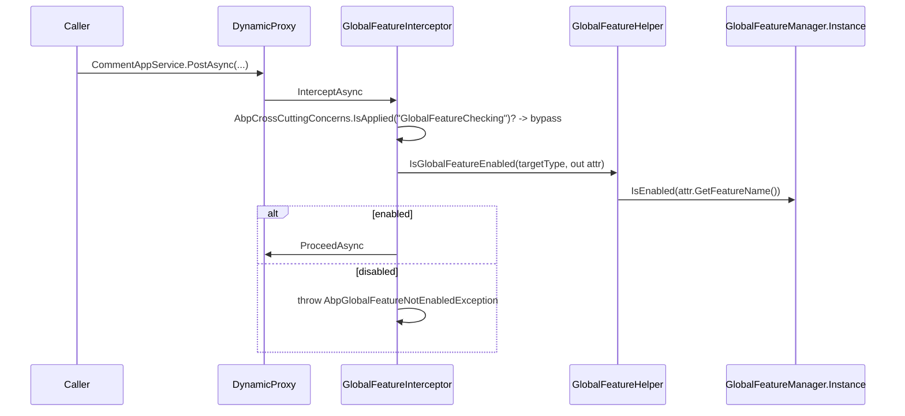

Where [Features](/framework/cross/features) gates behavior **per tenant at runtime**, *Global Features* gates behavior **per deployment at startup**. A reusable module (CMS Kit, Identity Pro, eShopOnAbp catalog…) ships every capability as a class derived from `GlobalFeature`; the application picks which subset to enable during `PreApplicationInitialization`. Services attributed with `[RequiresGlobalFeature(typeof(MyFeature))]` and the marker interface `IGlobalFeatureCheckingEnabled` will then *throw* `AbpGlobalFeatureNotEnabledException` on call when the feature was not opted in. The mechanism is intentionally a process-wide static — `GlobalFeatureManager.Instance` — so it works *before* DI is built and is consistent across every service scope.

The source lives in `framework/src/Volo.Abp.GlobalFeatures/`. The module depends on `Volo.Abp.Localization`, `Volo.Abp.VirtualFileSystem`, and `Volo.Abp.Authorization.Abstractions` (the last is consumed only to map the localized exception code, not to use the authorization runtime).

## File inventory

| Path under `framework/src/Volo.Abp.GlobalFeatures/Volo/Abp/GlobalFeatures/` | Role |
| --- | --- |
| `AbpGlobalFeaturesModule.cs` | Wires the interceptor registrar + localization + exception code mapping. |
| `AbpGlobalFeatureErrorCodes.cs` | `Volo.GlobalFeature:010001` — "GlobalFeatureIsNotEnabled". |
| `AbpGlobalFeatureNotEnabledException.cs` | Custom `AbpException` with `Code`, `Data["ServiceName"]`, `Data["GlobalFeatureName"]`. |
| `GlobalFeatureManager.cs` | The process-wide singleton (`Instance`) holding `EnabledFeatures` (a `HashSet<string>`). |
| `GlobalFeatureDictionary.cs` | `Dictionary<string, GlobalFeature>` for module-feature lookups. |
| `GlobalModuleFeatures.cs` | Base for a module's feature catalog — `Enable<T>()`, `Disable<T>()`, `EnableAll()`. |
| `GlobalModuleFeaturesDictionary.cs` | Dictionary of module-feature catalogs registered on the manager. |
| `GlobalFeature.cs` | Base for an individual feature — wraps `FeatureManager.{Enable,Disable,IsEnabled}`. |
| `GlobalFeatureHelper.cs` | `IsGlobalFeatureEnabled(Type, out attribute)` — reads `[RequiresGlobalFeature]`. |
| `GlobalFeatureInterceptor.cs` | Castle interceptor — throws if the type's required global feature is off. |
| `GlobalFeatureInterceptorRegistrar.cs` | Attaches the interceptor to any type implementing `IGlobalFeatureCheckingEnabled`. |
| `GlobalFeatureNameAttribute.cs` | Class attribute that names a `GlobalFeature` (required). |
| `IGlobalFeatureCheckingEnabled.cs` | Marker interface — only types that implement it get intercepted. |
| `RequiresGlobalFeatureAttribute.cs` | The "this class needs a feature" decoration applied to services. |
| `RequireGlobalFeaturesSimpleStateChecker.cs` | Bridges into the SimpleStateChecking framework (gates permissions/features). |
| `GlobalFeatureSimpleStateCheckerExtensions.cs` | `RequireGlobalFeatures(...)` fluent helper on `IHasSimpleStateCheckers<T>`. |
| `GlobalFeaturesSimpleStateCheckerSerializerContributor.cs` | Serializes the simple-state checker for distributed scenarios. |

## Key abstractions

| Member | Signature | Purpose |
| --- | --- | --- |
| `GlobalFeatureManager.Instance` | `static GlobalFeatureManager` | The one-and-only manager. Mutated during `PreConfigureServices` / `OneTimeConfigureAsync`. |
| `GlobalFeatureManager.IsEnabled(string)` | `bool` | Membership test on the `EnabledFeatures` set. |
| `GlobalFeatureManager.IsEnabled<TFeature>()` | `bool` | Resolves via `[GlobalFeatureName]` → name → set test. |
| `GlobalFeatureManager.Enable(string)` / `Enable<T>()` | `void` | Adds the name to the set. |
| `GlobalFeatureManager.Disable(string)` / `Disable<T>()` | `void` | Removes the name. |
| `GlobalFeatureManager.GetEnabledFeatureNames()` | `IEnumerable<string>` | Snapshot of enabled names. |
| `GlobalFeatureManager.Modules` | `GlobalModuleFeaturesDictionary` | Where modules register their catalogs. |
| `GlobalFeatureManager.Configuration` | `Dictionary<object, object>` | Shared bag for module-supplied configuration. |
| `[GlobalFeatureName("MyApp.Comments")]` | class attribute on `GlobalFeature` | Mandatory; the name written to `EnabledFeatures`. |
| `[RequiresGlobalFeature(typeof(Feature))]` / `(string name)` | class attribute on services | Read at runtime by the interceptor. |
| `IGlobalFeatureCheckingEnabled` | marker interface | Membership filter for `GlobalFeatureInterceptorRegistrar`. |
| `GlobalModuleFeatures.GetFeature<T>()` | `TFeature` | Lookup by type (uses `[GlobalFeatureName]`). |
| `GlobalModuleFeatures.EnableAll()` / `DisableAll()` | bulk operations | Toggles every feature in the module. |
| `AbpGlobalFeatureNotEnabledException` | `AbpException`, `IHasErrorCode` | Thrown by the interceptor; `Code == "Volo.GlobalFeature:010001"`. |

## Defining a module's feature catalog

Every reusable module that wants compile-time gating defines two pieces: one `GlobalFeature` subclass per capability and one `GlobalModuleFeatures` subclass enumerating them.

```csharp
[GlobalFeatureName("CmsKit.Comments")]
public class CommentsFeature : GlobalFeature
{
    public CommentsFeature(GlobalModuleFeatures module) : base(module) { }

    public override void Enable()
    {
        base.Enable();
        // Optional: cascade-enable dependencies
        // Module.Enable<TagsFeature>();
    }
}

public class CmsKitGlobalFeatures : GlobalModuleFeatures
{
    public CommentsFeature Comments => GetFeature<CommentsFeature>();
    public TagsFeature     Tags     => GetFeature<TagsFeature>();

    public CmsKitGlobalFeatures(GlobalFeatureManager featureManager)
        : base(featureManager)
    {
        AddFeature(new CommentsFeature(this));
        AddFeature(new TagsFeature(this));
    }
}
```

A consumer module then exposes a typed extension to register and reach the catalog:

```csharp
public static class CmsKitGlobalFeatureExtensions
{
    public static CmsKitGlobalFeatures CmsKit(this GlobalModuleFeaturesDictionary modules)
    {
        return modules.GetOrAdd(nameof(CmsKitGlobalFeatures),
            _ => new CmsKitGlobalFeatures(modules.FeatureManager));
    }
}
```

## Enabling a feature

The convention is to do it inside the consuming module's `PreConfigureServices` (so the registrar sees the toggle when it walks services):

```csharp
public override void PreConfigureServices(ServiceConfigurationContext context)
{
    GlobalFeatureManager.Instance.Modules.CmsKit().Comments.Enable();
    // or, equivalently:
    GlobalFeatureManager.Instance.Enable<CommentsFeature>();
    // or by string:
    GlobalFeatureManager.Instance.Enable("CmsKit.Comments");
}
```

The manager's mutation surface is identical for all three call shapes — they all funnel into `EnableInternal(string)`:

```csharp
public virtual void Enable<TFeature>()           => Enable(typeof(TFeature));
public virtual void Enable(Type featureType)     => Enable(GlobalFeatureNameAttribute.GetName(featureType));
public virtual void Enable(string featureName)   => EnabledFeatures.AddIfNotContains(featureName);
```

`GlobalFeatureNameAttribute.GetName` throws `AbpException` if a `GlobalFeature` type forgets the `[GlobalFeatureName]` attribute — so the contract is enforced at startup, not silently.

## How a service is gated



### The interceptor

```csharp
public override async Task InterceptAsync(IAbpMethodInvocation invocation)
{
    if (AbpCrossCuttingConcerns.IsApplied(invocation.TargetObject, AbpCrossCuttingConcerns.GlobalFeatureChecking))
    {
        await invocation.ProceedAsync();
        return;
    }

    if (!GlobalFeatureHelper.IsGlobalFeatureEnabled(invocation.TargetObject.GetType(), out var attribute))
    {
        throw new AbpGlobalFeatureNotEnabledException(code: AbpGlobalFeatureErrorCodes.GlobalFeatureIsNotEnabled)
            .WithData("ServiceName",       invocation.TargetObject.GetType().FullName!)
            .WithData("GlobalFeatureName", attribute!.Name!);
    }

    await invocation.ProceedAsync();
}
```

The interceptor only fires on types implementing `IGlobalFeatureCheckingEnabled`:

```csharp
private static bool ShouldIntercept(Type type)
{
    return !DynamicProxyIgnoreTypes.Contains(type) &&
           typeof(IGlobalFeatureCheckingEnabled).IsAssignableFrom(type);
}
```

So the check is opt-in twice: the consumer class must implement the marker interface *and* carry `[RequiresGlobalFeature]`. The marker interface keeps the registrar's cost negligible — without it, every gated module would pay the attribute-scan tax for every service in the host.

### `GlobalFeatureHelper.IsGlobalFeatureEnabled`

```csharp
public static bool IsGlobalFeatureEnabled(Type type, out RequiresGlobalFeatureAttribute? attribute)
{
    attribute = ReflectionHelper.GetSingleAttributeOrDefault<RequiresGlobalFeatureAttribute>(type);
    return attribute == null || GlobalFeatureManager.Instance.IsEnabled(attribute.GetFeatureName());
}
```

Two important nuances:

- **No attribute → enabled.** A class that implements `IGlobalFeatureCheckingEnabled` but doesn't carry `[RequiresGlobalFeature]` is *not* gated.
- **The attribute can be type-based or string-based.** `[RequiresGlobalFeature(typeof(CommentsFeature))]` is preferred — it leans on the compiler — but a string overload exists for cases where the feature type lives in a separate assembly you can't reference.

`RequiresGlobalFeatureAttribute.GetFeatureName()` is:

```csharp
public virtual string GetFeatureName()
{
    return Name ?? GlobalFeatureNameAttribute.GetName(Type!);
}
```

If the attribute was constructed with `Type`, name resolution still goes through `GlobalFeatureNameAttribute` — so a forgotten `[GlobalFeatureName]` *on the feature type* throws at the first call site, not at startup.

## Interplay with permissions and features

`RequireGlobalFeaturesSimpleStateChecker` plugs into the same `ISimpleStateChecker<TState>` framework used by permissions and tenant-features. That gives a permission a *deployment-level* precondition:

```csharp
var comment = group.AddPermission("MyApp.Comments");
comment.RequireGlobalFeatures(GlobalFeatureNameAttribute.GetName<CommentsFeature>());
```

Now `PermissionChecker.IsGrantedAsync("MyApp.Comments")` short-circuits to `false` whenever `CommentsFeature` is disabled — the permission's `StateCheckers.IsEnabledAsync` returns `false` before any value provider is consulted. Same for `RequireFeatures` (tenant feature) and `RequireAuthenticated`.

`GlobalFeaturesSimpleStateCheckerSerializerContributor` makes these checkers serializable so the *PermissionManagement* APIs can ship the gating rules to a UI without hard-coding them.

## Localized errors

`AbpGlobalFeaturesModule.ConfigureServices` registers an exception-localization mapping:

```csharp
Configure<AbpExceptionLocalizationOptions>(options =>
{
    options.MapCodeNamespace("Volo.GlobalFeature", typeof(AbpGlobalFeatureResource));
});
```

Combined with the `Data` keys (`ServiceName`, `GlobalFeatureName`) the exception-handling layer can substitute placeholders into the message resource. The default English message is "The '{GlobalFeatureName}' global feature is not enabled!".

## Lifecycle

`GlobalFeatureManager.Instance` is a plain `protected internal` static and therefore exists *before* `IServiceCollection` is constructed. The canonical mutation sites, in order:

1. **`PreConfigureServices`** of a module — enable or disable features the module wants to ship.
2. **`ConfigureServices`** of the module — register services that reference those features (the registrar attaches the interceptor).
3. **`OnApplicationInitialization`** is too late: by that point the registrar has *already* decided whether each type gets the interceptor (registration happens in `ConfigureServices`). The runtime check inside the interceptor still works, but you cannot promote a non-intercepted class to intercepted without a restart.

The `Instance` is `protected set;` — code that needs to swap it in (test harnesses, multi-host scenarios) inherits and exposes a setter. There is no built-in API to replace it; the design assumption is one process = one feature set.

## Configuration

There is no `IOptions<AbpGlobalFeatureOptions>` — configuration is direct manipulation of `GlobalFeatureManager.Instance`. The `Configuration` dictionary on the manager is a generic shared bag that a module can use for sub-feature parameters (e.g. `manager.Configuration["CmsKit.MaxCommentLength"] = 500;`). Reading it back is the consumer's responsibility.

## Gotchas

- **`IGlobalFeatureCheckingEnabled` is mandatory.** A `[RequiresGlobalFeature]` on a class that doesn't implement the marker interface has **no effect** — the registrar skips it.
- **Forgetting `[GlobalFeatureName]` throws at call time, not startup.** The helper resolves the name lazily. To validate eagerly, call `GlobalFeatureNameAttribute.GetName<T>()` during module initialization.
- **The manager is a process singleton.** Tests that mutate `Enable<T>()` leak state across cases. Either reset (`foreach var f in GetEnabledFeatureNames() Disable(f)`) in fixture teardown, or run each test in its own AppDomain/host.
- **Bulk operations don't cascade.** `EnableAll()` iterates the module's `AllFeatures` and calls `Enable` on each — but `GlobalFeature.Enable()` is **not** virtualized to honor dependency cascades unless you override it. Express dependencies inside your subclass:

  ```csharp
  public override void Enable() { Module.Enable<TagsFeature>(); base.Enable(); }
  ```
- **`AbpGlobalFeatureNotEnabledException` is not `IAuthorizationException`.** Generic catch blocks looking for `AbpAuthorizationException` (the type used by `[RequiresFeature]` and `[Authorize]`) will miss this. Catch `AbpException` if you want both.
- **Class-only attribute targets.** `[RequiresGlobalFeature]` carries `AttributeUsage(AttributeTargets.Class)` only — you cannot gate a single method. If you need method-level gating with the same model, expose two service classes, each with the marker interface and its own attribute.
- **Cross-cutting suppression is supported.** Wrapping a call in `using (AbpCrossCuttingConcerns.Applying(target, AbpCrossCuttingConcerns.GlobalFeatureChecking))` bypasses the gate for one logical scope — useful for integration tests but never for production hot paths.
- **The interceptor has no fallback grace.** Once a service is intercepted, *every* method call (public or otherwise hit by interception) goes through the check. There is no per-method opt-out — only the runtime cross-cutting bypass.
- **`Modules.GetOrAdd` is dictionary semantics.** Each module's `GlobalModuleFeatures` is registered by string key; using a different key per assembly accidentally registers two parallel catalogs.
