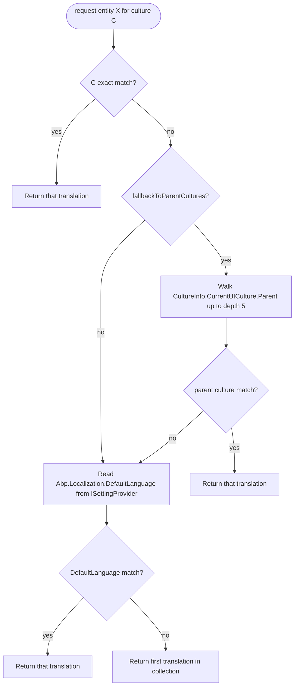
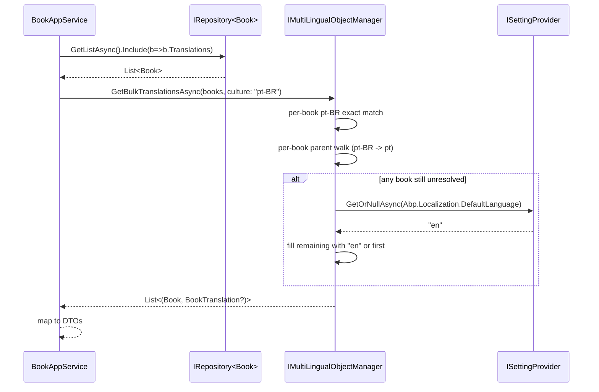

`Volo.Abp.MultiLingualObjects` is a tiny package — five files — that gives you a *runtime* helper for picking the right translation row from an entity's `Translations` collection. The pattern is: keep the *master* entity in one table (Book, Product, Category…) and a separate child table (`BookTranslation`, `ProductTranslation`) keyed by master id + language code. At read time, `IMultiLingualObjectManager` looks at `CultureInfo.CurrentUICulture`, finds the matching translation, falls back through parent cultures (`pt-BR → pt → en-US → en`), then to the `Abp.Localization.DefaultLanguage` setting, and finally to the first available row.

This page covers everything in `framework/src/Volo.Abp.MultiLingualObjects/`. The package depends only on `Volo.Abp.Localization` (for `LocalizationSettingNames.DefaultLanguage`) and on `Volo.Abp.Settings` (indirectly, via `ISettingProvider`).

## File inventory

| Path under `framework/src/Volo.Abp.MultiLingualObjects/Volo/Abp/MultiLingualObjects/` | Role |
| --- | --- |
| `AbpMultiLingualObjectsModule.cs` | `[DependsOn(typeof(AbpLocalizationModule))]`. No services beyond conventional. |
| `IMultiLingualObject.cs` | `interface IMultiLingualObject<TTranslation> { ICollection<TTranslation> Translations { get; set; } }`. |
| `IObjectTranslation.cs` | `interface IObjectTranslation { string Language { get; set; } }`. |
| `IMultiLingualObjectManager.cs` | The lookup API — four overloads: single entity, raw translation list, bulk translation lists, bulk entities. |
| `MultiLingualObjectManager.cs` | The fallback algorithm. |

There is no EF Core companion in this package — wire EF mappings up yourself with `Translations` as a one-to-many navigation. See the `gotchas` section for the standard mapping pattern.

## Key abstractions

| Member | Signature | Purpose |
| --- | --- | --- |
| `IMultiLingualObject<TTranslation>` | `ICollection<TTranslation> Translations` | Marker so generic code can resolve a translation list from any entity. |
| `IObjectTranslation` | `string Language { get; set; }` | The only required property. Implementations add `Name`, `Description`, etc. |
| `IMultiLingualObjectManager.GetTranslationAsync<TMultiLingual, TTranslation>(entity, culture?, fallback?)` | `Task<TTranslation?>` | Resolve for a single entity. |
| `IMultiLingualObjectManager.GetTranslationAsync<TTranslation>(IEnumerable<TTranslation>, culture?, fallback?)` | `Task<TTranslation?>` | When you have the translations but not the entity. |
| `IMultiLingualObjectManager.GetBulkTranslationsAsync<TTranslation>(IEnumerable<IEnumerable<TTranslation>>, …)` | `Task<List<TTranslation?>>` | Batched — one default-language read for the whole list. |
| `IMultiLingualObjectManager.GetBulkTranslationsAsync<TMultiLingual, TTranslation>(IEnumerable<TMultiLingual>, …)` | `Task<List<(TMultiLingual, TTranslation?)>>` | Batched — preserves the master-entity pairing. |
| `MultiLingualObjectManager.MaxCultureFallbackDepth` | `const int = 5` | Caps the parent-culture walk so a malformed culture chain can't loop. |

## How a translation is picked

`GetTranslationAsync` takes an enumerable of translations and a target culture. The algorithm:

```csharp
public virtual async Task<TTranslation?> GetTranslationAsync<TTranslation>(
    IEnumerable<TTranslation>? translations,
    string? culture,
    bool fallbackToParentCultures)
    where TTranslation : class, IObjectTranslation
{
    culture ??= CultureInfo.CurrentUICulture.Name;

    if (translations == null || !translations.Any()) return null;

    var translation = translations.FirstOrDefault(pt => pt.Language == culture);
    if (translation != null) return translation;

    if (fallbackToParentCultures)
    {
        translation = GetTranslationBasedOnCulturalRecursive(
            CultureInfo.CurrentUICulture.Parent, translations, 0);
        if (translation != null) return translation;
    }

    var defaultLanguage = await SettingProvider.GetOrNullAsync(LocalizationSettingNames.DefaultLanguage);
    translation = translations.FirstOrDefault(pt => pt.Language == defaultLanguage);
    if (translation != null) return translation;

    return translations.FirstOrDefault();
}
```

So the precedence is:

1. **Exact culture match** — `pt-BR` translation for a `pt-BR` request.
2. **Parent-culture walk** — `pt-BR` → `pt` → invariant. Recursion is capped at `MaxCultureFallbackDepth = 5`.
3. **`Abp.Localization.DefaultLanguage` setting** — reads from `ISettingProvider`, which respects the [Settings](/framework/cross/settings) chain (tenant override → host default → `"en"`).
4. **First available row** — whatever is in the collection.



`GetTranslationBasedOnCulturalRecursive` is the parent walk:

```csharp
protected virtual TTranslation? GetTranslationBasedOnCulturalRecursive<TTranslation>(
    CultureInfo? culture, IEnumerable<TTranslation>? translations, int currentDepth)
    where TTranslation : class, IObjectTranslation
{
    if (culture == null ||
        culture.Name.IsNullOrWhiteSpace() ||
        translations == null || !translations.Any() ||
        currentDepth > MaxCultureFallbackDepth)
    {
        return null;
    }

    var translation = translations.FirstOrDefault(
        pt => pt.Language.Equals(culture.Name, StringComparison.OrdinalIgnoreCase));
    return translation ?? GetTranslationBasedOnCulturalRecursive(culture.Parent, translations, currentDepth + 1);
}
```

The match is case-insensitive (`OrdinalIgnoreCase`), but the *exact* match in step 1 above is **case-sensitive** (`==`). Be consistent — store `Language = "en-US"` (the canonical form) everywhere.

## Bulk variants

Both batched overloads exist to avoid an N-times-per-list call to `ISettingProvider.GetOrNullAsync(DefaultLanguage)`. The shape:

```csharp
public virtual async Task<List<TTranslation?>> GetBulkTranslationsAsync<TTranslation>(
    IEnumerable<IEnumerable<TTranslation>>? translationsCombined,
    string? culture,
    bool fallbackToParentCultures) where TTranslation : class, IObjectTranslation
{
    culture ??= CultureInfo.CurrentUICulture.Name;
    if (translationsCombined == null || !translationsCombined.Any()) return new();

    var someHaveNoTranslations = false;
    var res = new List<TTranslation?>();
    foreach (var translations in translationsCombined)
    {
        // exact match -> parent fallback -> null placeholder + someHaveNoTranslations = true
    }

    if (someHaveNoTranslations)
    {
        var defaultLanguage = await SettingProvider.GetOrNullAsync(LocalizationSettingNames.DefaultLanguage);
        var index = 0;
        foreach (var translations in translationsCombined)
        {
            // fill nulls with DefaultLanguage match or first available
            index++;
        }
    }
    return res;
}
```

The optimization: the default-language read happens *once*, after the first pass, and *only* if at least one entity needed it. For a 100-book listing in `pt-BR` where 90 books have `pt-BR` translations, no setting-provider call happens at all.

The paired overload — `GetBulkTranslationsAsync<TMultiLingual, TTranslation>` — uses the entity overload to preserve master pointers:

```csharp
var resInitial = await GetBulkTranslationsAsync(
    multiLinguals.Select(x => x.Translations), culture, fallbackToParentCultures);
var res = new List<(TMultiLingual entity, TTranslation? translation)>();
foreach (var item in multiLinguals)
{
    var t = resInitial[index++];
    res.Add((item, t));
}
return res;
```

Use this when projecting a list view: each tuple is `(BookEntity, BookTranslation?)` ready for AutoMapper.

## Defining the model

```csharp
public class Book : AggregateRoot<Guid>, IMultiLingualObject<BookTranslation>
{
    public string Isbn { get; set; } = default!;
    public decimal Price { get; set; }
    public ICollection<BookTranslation> Translations { get; set; } = new List<BookTranslation>();
}

public class BookTranslation : Entity, IObjectTranslation
{
    public Guid BookId { get; set; }
    public string Language { get; set; } = default!;
    public string Name { get; set; } = default!;
    public string Description { get; set; } = "";

    public override object[] GetKeys() => new object[] { BookId, Language };
}
```

`BookTranslation` is a composite-key child whose key is `(BookId, Language)`. The translation table is intentionally narrow — only the translatable columns plus the language code.

## EF Core mapping

The package itself doesn't include EF mappings, but the canonical pattern is:

```csharp
modelBuilder.Entity<Book>(b =>
{
    b.ToTable("AppBooks");
    b.ConfigureByConvention();
    b.HasMany(x => x.Translations).WithOne().HasForeignKey(x => x.BookId).IsRequired();
});

modelBuilder.Entity<BookTranslation>(b =>
{
    b.ToTable("AppBookTranslations");
    b.ConfigureByConvention();
    b.HasKey(x => new { x.BookId, x.Language });
    b.Property(x => x.Language).IsRequired().HasMaxLength(10);
    b.Property(x => x.Name).IsRequired().HasMaxLength(BookConsts.MaxNameLength);
});
```

For consumer queries, **always include the navigation** — `MultiLingualObjectManager` reads `entity.Translations` synchronously and does not lazy-load:

```csharp
var book = await _bookRepo.GetQueryableAsync();
var loaded = await book.Include(b => b.Translations).FirstOrDefaultAsync(b => b.Id == id);
var translation = await _mlManager.GetTranslationAsync<Book, BookTranslation>(loaded);
```

For bulk reads, the optimization compounds — a single `.Include(b => b.Translations).ToListAsync()` plus one `GetBulkTranslationsAsync` call is enough for an entire results page.

## DefaultLanguage interaction with settings

`LocalizationSettingNames.DefaultLanguage` is a regular ABP setting, so it inherits the [Settings](/framework/cross/settings) chain:

| Layer | Value |
| --- | --- |
| User | (rarely set) |
| Tenant | tenant's preferred language |
| Global | host's preferred language |
| Configuration | `appsettings.json:"Settings:Abp.Localization.DefaultLanguage"` |
| Default | `"en"` (set by the localization module) |

The DefaultLanguage *string* may include a UI-culture suffix: `"en;en-US"` is interpreted by `MultiTenancyMiddleware` as `(Culture="en", UICulture="en-US")` but **MultiLingualObjectManager does not split it**:

```csharp
var defaultLanguage = await SettingProvider.GetOrNullAsync(LocalizationSettingNames.DefaultLanguage);
translation = translations.FirstOrDefault(pt => pt.Language == defaultLanguage);
```

So if you store the multi-part value, no translation will ever match unless you also store it that way in `BookTranslation.Language`. Use the single-token form for the multi-lingual default.

## Sequence — list endpoint



## Gotchas

- **No automatic side-loading.** `MultiLingualObjectManager` reads `entity.Translations` *as-is*. Forget the `Include` and you'll silently see `null` translations (the collection is empty, not the entity).
- **`Language` exact match is case-sensitive.** Step 1 uses `pt.Language == culture`. Only the parent-walk step uses `OrdinalIgnoreCase`. Mixed casing across rows produces inconsistent results.
- **`MaxCultureFallbackDepth = 5`.** Cultures like `zh-Hans-HK` only have ~3 ancestors so this is never a real cap. The constant exists to guard against malformed `CultureInfo` cycles.
- **`fallbackToParentCultures = true` is the default.** Pass `false` when implementing a strict-locale CMS where you'd rather show "No translation available" than a `pt` match for a `pt-BR` request.
- **`GetTranslationAsync(IEnumerable<T>, ...)` doesn't materialize.** If you pass an `IQueryable<BookTranslation>`, the `.FirstOrDefault(...)` calls will hit the database — possibly multiple times. Always materialize to `List<>` first.
- **`Translations.GetOrDefault` doesn't exist.** Use plain `.FirstOrDefault`. The manager doesn't index translations — it does an O(n) lookup per call. For an entity with 100 translations this is still fine; for a denormalized "translations are key-value props in a JSON column" approach, use a different abstraction.
- **First-fallback is non-deterministic.** When everything fails and `translations.FirstOrDefault()` is returned, the picked row depends on EF Core's load order — which for a list-init collection is insertion order, but for a HashSet is undefined. Sort by `Language` if you need deterministic fallback.
- **No write helper.** This package only reads. To add a translation, manipulate `entity.Translations` directly:

  ```csharp
  book.Translations.Add(new BookTranslation { BookId = book.Id, Language = "fr", Name = "Mon livre" });
  ```
- **Composite key requires `Entity.GetKeys()` override.** EF Core can manage the composite without it, but ABP's `Entity` base assumes a single-property key. Override `GetKeys()` to return both.
- **`AbpMultiLingualObjectsModule` does *not* depend on `AbpSettingsModule`.** It depends on Localization, which transitively pulls Settings. If you reference Settings directly, declare it explicitly.
- **The package is **not** about UI strings.** UI text uses `IStringLocalizer<TResource>` from `Volo.Abp.Localization`. `MultiLingualObjects` is strictly for *data* — entity columns that need per-language storage.
- **No "auto-translate" hook.** Translations are user-provided. If your app needs machine translation, hand-roll a writer that calls Google/Azure/DeepL and persists the result. The manager only reads.
- **Bulk overload preserves ordering.** The output list has the same order as the input enumerable — but if the input is a `HashSet<T>` or any non-ordered collection, the order is undefined. Materialize as `List<T>` before calling.
- **Translations are not cached.** Every call re-queries `Translations` and re-iterates. For frequently-read tables consider a Redis cache keyed on `(EntityType, Id, Culture)`.
