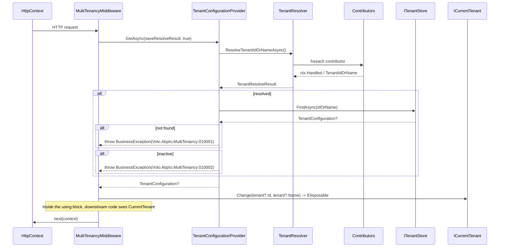

ABP's multi-tenancy is a thin coordinator built on three abstractions: `ICurrentTenant` — the *ambient* tenant for the current logical scope, async-flow-safe; `ITenantResolver` — the *chain* that, given a request context, decides what `TenantIdOrName` should be; and `ITenantStore` — the lookup that turns a `TenantIdOrName` into a `TenantConfiguration` (with connection strings). The ASP.NET Core integration adds five HTTP-aware resolve-contributors (QueryString, Route, Header, Cookie, Domain) and a `MultiTenancyMiddleware` that wires them together. Per-tenant connection strings flow through `MultiTenantConnectionStringResolver`, which transparently replaces `DefaultConnectionStringResolver` whenever the multi-tenancy module is loaded.

Three packages cooperate. Abstractions: `framework/src/Volo.Abp.MultiTenancy.Abstractions/`. Core runtime: `framework/src/Volo.Abp.MultiTenancy/`. HTTP integration: `framework/src/Volo.Abp.AspNetCore.MultiTenancy/`.

## File inventory

| Path under `framework/src/Volo.Abp.MultiTenancy.Abstractions/Volo/Abp/MultiTenancy/` | Role |
| --- | --- |
| `ICurrentTenant.cs` | `IsAvailable`, `Id`, `Name`, `Change(Guid?, string?)`. |
| `ICurrentTenantAccessor.cs` | Storage seam — backs `ICurrentTenant`. |
| `IMultiTenant.cs` | `Guid? TenantId` — implement on entities for the data filter. |
| `MultiTenancySides.cs` | `[Flags]` enum: `Tenant=1`, `Host=2`, `Both=3`. |
| `MultiTenancyDatabaseStyle.cs` | `SingleDatabase` / `DatabasePerTenant` / `Hybrid`. |
| `TenantConfiguration.cs` | DTO — `Id`, `Name`, `ConnectionStrings`, `IsActive`. |
| `BasicTenantInfo.cs` | Lightweight `(TenantId, Name)` carried in the accessor. |
| `ITenantStore.cs` | `FindAsync(Guid)`, `FindAsync(string nameOrId)`. |
| `ITenantResolver.cs` / `TenantResolveResult.cs` | `Task<TenantResolveResult> ResolveTenantIdOrNameAsync()`. |
| `ITenantResolveContext.cs` | `TenantIdOrName`, `Handled`, `HasResolvedTenantOrHost()`. |
| `ITenantResolveContributor.cs` | `Name`, `ResolveAsync(ITenantResolveContext)`. |
| `AbpTenantResolveOptions.cs` | `List<ITenantResolveContributor> TenantResolvers`. |
| `AbpMultiTenancyOptions.cs` | `bool IsEnabled` (global enable). |
| `ITenantConfigurationProvider.cs` | `GetAsync(saveResolveResult: bool)`. |
| `IgnoreMultiTenancyAttribute.cs` | Disable the data filter on an entity type. |
| `ConfigurationStore/AbpDefaultTenantStoreOptions.cs` | In-config tenant array for dev/test. |
| `AbpMultiTenancyClaimsIdentityExtensions.cs` (System.Security.Principal) | `FindTenantId`, `GetMultiTenancySide`. |
| `TenantResolverConsts.cs` | `DefaultTenantKey = "__tenant"`. |

| Path under `framework/src/Volo.Abp.MultiTenancy/Volo/Abp/MultiTenancy/` | Role |
| --- | --- |
| `AbpMultiTenancyModule.cs` | Registers `AsyncLocalCurrentTenantAccessor`, slots `TenantSettingValueProvider`, prepends `CurrentUserTenantResolveContributor`. |
| `AsyncLocalCurrentTenantAccessor.cs` | `AsyncLocal<BasicTenantInfo?>` storage; `Instance` is the singleton. |
| `CurrentTenant.cs` | `ITransientDependency` implementation that nests via the accessor. |
| `TenantResolver.cs` | Iterates `Options.TenantResolvers` until one says `Handled` or sets `TenantIdOrName`. |
| `TenantResolveContributorBase.cs` | Convenience base class with `Name`. |
| `CurrentUserTenantResolveContributor.cs` | Reads `CurrentUser.TenantId` — *always* applied first. |
| `ActionTenantResolveContributor.cs` | Lets call-sites add ad-hoc lambda contributors. |
| `MultiTenantConnectionStringResolver.cs` | `[Dependency(ReplaceServices = true)]` — wraps `DefaultConnectionStringResolver`. |
| `TenantConfigurationProvider.cs` | Drives `ITenantResolver` → `ITenantStore` lookup; throws `BusinessException` on unknown/inactive tenant. |
| `NullTenantResolveResultAccessor.cs` | Default container — overridden in AspNetCore. |
| `TenantSettingValueProvider.cs` | `"T"` provider for [Settings](/framework/cross/settings). |
| `ConfigurationStore/DefaultTenantStore.cs` | Reads `AbpDefaultTenantStoreOptions.Tenants` from `IConfiguration` (dev). |

| Path under `framework/src/Volo.Abp.AspNetCore.MultiTenancy/Volo/Abp/AspNetCore/MultiTenancy/` | Role |
| --- | --- |
| `AbpAspNetCoreMultiTenancyModule.cs` | Appends `QueryString`, `Route`, `Header`, `Cookie` contributors. |
| `AbpAspNetCoreMultiTenancyOptions.cs` | `TenantKey`, `MultiTenancyMiddlewareErrorPageBuilder`. |
| `MultiTenancyMiddleware.cs` | Resolves and pushes `ICurrentTenant`; sets language from tenant settings. |
| `HttpTenantResolveContributorBase.cs` | Reads `HttpContext` via context's service provider. |
| `QueryStringTenantResolveContributor.cs` | `?__tenant=acme`. |
| `RouteTenantResolveContributor.cs` | `/{__tenant}/...`. |
| `HeaderTenantResolveContributor.cs` | `__tenant: acme` header. |
| `CookieTenantResolveContributor.cs` | `__tenant=acme` cookie. |
| `DomainTenantResolveContributor.cs` | Programmatic — `{0}.myapp.com` format string. |
| `HttpContextTenantResolveResultAccessor.cs` | Reads `HttpContext.Items` for the resolve result. |
| `AbpMultiTenancyCookieHelper.cs` | Writes the cookie after a QueryString-driven resolve. |

## Key abstractions

| Member | Signature | Purpose |
| --- | --- | --- |
| `ICurrentTenant.IsAvailable` | `bool` | `Id.HasValue` — host vs tenant. |
| `ICurrentTenant.Id` | `Guid?` | Backing for every multi-tenant query / setting / permission. |
| `ICurrentTenant.Change(Guid? id, string? name = null)` | `IDisposable` | Nest-safe ambient switch (think `CultureInfo.CurrentCulture`). |
| `IMultiTenant.TenantId` | `Guid?` | Entity marker — used by `IDataFilter<IMultiTenant>`. |
| `[IgnoreMultiTenancy]` | attribute | Skip the data filter on a type. |
| `MultiTenancySides` flags | `Tenant=1`, `Host=2`, `Both=3` | Permission/feature scoping. |
| `CurrentTenantExtensions.GetMultiTenancySide()` | `Tenant` if `Id.HasValue`, else `Host` | Used by `PermissionChecker.IsGrantedAsync`. |
| `ITenantResolver.ResolveTenantIdOrNameAsync()` | `Task<TenantResolveResult>` | The chain runner. |
| `TenantResolveResult.AppliedResolvers` | `List<string>` | Diagnostics — names of every contributor that ran. |
| `ITenantResolveContext.Handled` | `bool` | "Stop the chain even if I didn't set a value". |
| `ITenantResolveContributor.Name` | `string` (`"CurrentUser"`, `"QueryString"`, `"Route"`, `"Header"`, `"Cookie"`, `"Domain"`) | Per-source identity. |
| `ITenantStore.FindAsync(Guid)` / `FindAsync(string)` | `Task<TenantConfiguration?>` | Persistence seam. |
| `ITenantConfigurationProvider.GetAsync(saveResolveResult)` | `Task<TenantConfiguration?>` | Runs resolver + store, throws on unknown/inactive. |
| `MultiTenantConnectionStringResolver.ResolveAsync(string?)` | `Task<string>` | Picks tenant-specific connection string, falls back to base. |

## Resolution chain

The default chain registered in `AbpMultiTenancyModule.ConfigureServices`:

```csharp
Configure<AbpTenantResolveOptions>(options =>
{
    options.TenantResolvers.Insert(0, new CurrentUserTenantResolveContributor());
});
```

After `AbpAspNetCoreMultiTenancyModule.ConfigureServices` runs:

```csharp
options.TenantResolvers.Add(new QueryStringTenantResolveContributor());
options.TenantResolvers.Add(new RouteTenantResolveContributor());
options.TenantResolvers.Add(new HeaderTenantResolveContributor());
options.TenantResolvers.Add(new CookieTenantResolveContributor());
```

The effective order, then, is:

1. **CurrentUser** — `ICurrentUser.TenantId` from claims. If the user is authenticated, this *forces* a result (`Handled = true`) so the host cannot impersonate a tenant via querystring.
2. **QueryString** — `?__tenant=...`.
3. **Route** — `/{__tenant}/...` if the MVC route includes the parameter.
4. **Header** — `__tenant: ...`.
5. **Cookie** — `__tenant=...` from `Cookies`.
6. **Domain** — *if* registered (not by default; you must `Add(new DomainTenantResolveContributor("{0}.myapp.com"))` yourself).

`TenantResolver.ResolveTenantIdOrNameAsync` walks the list in order and stops at the **first** contributor that calls `HasResolvedTenantOrHost()`:

```csharp
foreach (var tenantResolver in _options.TenantResolvers)
{
    await tenantResolver.ResolveAsync(context);
    result.AppliedResolvers.Add(tenantResolver.Name);
    if (context.HasResolvedTenantOrHost()) { result.TenantIdOrName = context.TenantIdOrName; break; }
}
```

`HasResolvedTenantOrHost()` returns `Handled || TenantIdOrName != null` — so a contributor can short-circuit by *only* setting `Handled = true`, which means "no tenant — host scope is authoritative". That is exactly what `CurrentUserTenantResolveContributor` does for an authenticated host user:

```csharp
if (currentUser.IsAuthenticated)
{
    context.Handled = true;                       // stop the chain
    context.TenantIdOrName = currentUser.TenantId?.ToString();   // possibly null = host
}
```

So:

- Host user authenticated → `Handled = true`, value `null` → no further contributor consulted, result is host scope.
- Tenant user authenticated → `Handled = true`, value `= TenantId.ToString()` → tenant scope.
- Anonymous user → contributor returns without touching the context → the chain falls through to QueryString, Route, Header, Cookie.

## End-to-end request flow



### `MultiTenancyMiddleware` outline

```csharp
public async Task InvokeAsync(HttpContext context, RequestDelegate next)
{
    TenantConfiguration? tenant = null;
    try
    {
        tenant = await _tenantConfigurationProvider.GetAsync(saveResolveResult: true);
    }
    catch (Exception e)
    {
        Logger.LogException(e);
        if (await _options.MultiTenancyMiddlewareErrorPageBuilder(context, e)) return;
    }

    if (tenant?.Id != _currentTenant.Id)
    {
        using (_currentTenant.Change(tenant?.Id, tenant?.Name))
        {
            // If the QueryString contributor resolved the tenant, write a cookie so the next call doesn't need ?__tenant=
            if (_tenantResolveResultAccessor.Result?.AppliedResolvers
                    .Contains(QueryStringTenantResolveContributor.ContributorName) == true)
            {
                AbpMultiTenancyCookieHelper.SetTenantCookie(context, _currentTenant.Id, _options.TenantKey);
            }

            // Tenant-scoped default language
            var requestCulture = await TryGetRequestCultureAsync(context);
            if (requestCulture != null)
            {
                CultureInfo.CurrentCulture   = requestCulture.Culture;
                CultureInfo.CurrentUICulture = requestCulture.UICulture;
                AbpRequestCultureCookieHelper.SetCultureCookie(context, requestCulture);
                context.Items[AbpRequestLocalizationMiddleware.HttpContextItemName] = true;
            }

            await next(context);
        }
    }
    else
    {
        await next(context);
    }
}
```

Three subtle behaviors:

- The `using (Change(...))` is *the* tenant-scoping. The accessor flows through `await next(context)` via `AsyncLocal` so every downstream service sees the same `CurrentTenant.Id`.
- The middleware *promotes* a querystring resolution to a cookie. The next request without `?__tenant=` still resolves to the same tenant because the Cookie contributor takes over.
- On resolver failure, the middleware uses `MultiTenancyMiddlewareErrorPageBuilder` (an `Func<HttpContext, Exception, Task<bool>>` option) to render an error page; if the builder returns `false`, the request continues with no tenant (host scope) — useful when the failure means "you said you were tenant X but X doesn't exist".

### `TenantConfigurationProvider`

```csharp
public virtual async Task<TenantConfiguration?> GetAsync(bool saveResolveResult = false)
{
    var resolveResult = await TenantResolver.ResolveTenantIdOrNameAsync();
    if (saveResolveResult) TenantResolveResultAccessor.Result = resolveResult;

    TenantConfiguration? tenant = null;
    if (resolveResult.TenantIdOrName != null)
    {
        tenant = await FindTenantAsync(resolveResult.TenantIdOrName);
        if (tenant == null)
            throw new BusinessException(
                code: "Volo.AbpIo.MultiTenancy:010001",
                message: StringLocalizer["TenantNotFoundMessage"],
                details: StringLocalizer["TenantNotFoundDetails", resolveResult.TenantIdOrName]);

        if (!tenant.IsActive)
            throw new BusinessException(
                code: "Volo.AbpIo.MultiTenancy:010002",
                message: StringLocalizer["TenantNotActiveMessage"],
                details: StringLocalizer["TenantNotActiveDetails", resolveResult.TenantIdOrName]);
    }
    return tenant;
}
```

`FindTenantAsync` accepts both a `Guid` (parsed) and a name — the chain emits a *string* and the provider tries `Guid.TryParse` first.

## `MultiTenantConnectionStringResolver`

`[Dependency(ReplaceServices = true)]` makes this class take over the role that `DefaultConnectionStringResolver` plays in the data module. The resolution rules are:

```csharp
if (_currentTenant.Id == null)
    return await base.ResolveAsync(connectionStringName);     // host: default behavior

var tenant = await FindTenantConfigurationAsync(_currentTenant.Id.Value);
if (tenant == null || tenant.ConnectionStrings.IsNullOrEmpty())
    return await base.ResolveAsync(connectionStringName);     // tenant has no per-tenant strings

var tenantDefault = tenant.ConnectionStrings?.Default;

if (connectionStringName == null || connectionStringName == ConnectionStrings.DefaultConnectionStringName)
{
    return !tenantDefault.IsNullOrWhiteSpace()
        ? tenantDefault!
        : Options.ConnectionStrings.Default!;                 // tenant default OR host default
}

var connString = tenant.ConnectionStrings?.GetOrDefault(connectionStringName);
if (!connString.IsNullOrWhiteSpace()) return connString!;     // exact match for the named string

// Fallback: if the database name was mapped (Identity → "AbpIdentity") and the tenant has that db, use it
var database = Options.Databases.GetMappedDatabaseOrNull(connectionStringName);
if (database != null && database.IsUsedByTenants)
{
    connString = tenant.ConnectionStrings?.GetOrDefault(database.DatabaseName);
    if (!connString.IsNullOrWhiteSpace()) return connString!;
}

// Last resort: tenant default, then base
if (!tenantDefault.IsNullOrWhiteSpace()) return tenantDefault!;
return await base.ResolveAsync(connectionStringName);
```

The flow is:

1. **Per-tenant exact match** wins for named strings (`"Identity"`, `"Audit"`).
2. **Database-name fallback** — if module X maps `"X"` to physical database `"AbpX"`, and the tenant has `"AbpX"` defined, that wins.
3. **Tenant default** beats the host default for any unnamed string.
4. **Host default** is the floor.

`FindTenantConfigurationAsync` opens a fresh service scope to call `ITenantStore` — so the resolution does not capture the calling scope's `IDbContext`, which matters when the calling scope *is* a UoW for a different database.

## `ICurrentTenant` storage

```csharp
public class CurrentTenant : ICurrentTenant, ITransientDependency
{
    public virtual bool IsAvailable => Id.HasValue;
    public virtual Guid? Id   => _currentTenantAccessor.Current?.TenantId;
    public          string? Name => _currentTenantAccessor.Current?.Name;

    public IDisposable Change(Guid? id, string? name = null)
    {
        var parentScope = _currentTenantAccessor.Current;
        _currentTenantAccessor.Current = new BasicTenantInfo(id, name);
        return new DisposeAction<...>(static state =>
        {
            var (accessor, parent) = state;
            accessor.Current = parent;
        }, (_currentTenantAccessor, parentScope));
    }
}
```

`AsyncLocalCurrentTenantAccessor.Instance` is registered as a singleton in `AbpMultiTenancyModule.ConfigureServices`. Because the backing storage is `AsyncLocal<BasicTenantInfo?>`, a `using (CurrentTenant.Change(...))` block scopes the tenant to the current logical call chain — perfect for background workers:

```csharp
using (_currentTenant.Change(tenant.Id, tenant.Name))
{
    await _orderService.ProcessAsync(...);   // sees tenant scope
}
```

## Data filter

The `IDataFilter<IMultiTenant>` mechanism (`Volo.Abp.Data`) automatically appends `entity.TenantId == CurrentTenant.Id` to queries for any entity implementing `IMultiTenant`. The filter is opt-out per query via `using (DataFilter.Disable<IMultiTenant>()) { ... }`, and opt-out per *type* via `[IgnoreMultiTenancy]` on the entity class. Host users can see *all* tenant data only by entering a `using (DataFilter.Disable<IMultiTenant>())` scope — the framework never grants this implicitly.

## Configuration

```csharp
Configure<AbpAspNetCoreMultiTenancyOptions>(options =>
{
    options.TenantKey = "__tenant";   // querystring/header/cookie key, default TenantResolverConsts.DefaultTenantKey
    options.MultiTenancyMiddlewareErrorPageBuilder = async (httpContext, ex) =>
    {
        httpContext.Response.StatusCode = 404;
        await httpContext.Response.WriteAsync("Tenant not found");
        return true;
    };
});

Configure<AbpTenantResolveOptions>(options =>
{
    options.TenantResolvers.Add(new DomainTenantResolveContributor("{0}.myapp.com"));
});

Configure<AbpMultiTenancyOptions>(options =>
{
    options.IsEnabled = true;   // master switch
});
```

`AbpDefaultTenantStoreOptions` (in the abstractions) reads from `IConfiguration` so dev/test scenarios don't need a DB:

```json
{
  "Tenants": [
    { "Id": "446a5211-3d72-4339-9cc0-fc3cd2f00fea",
      "Name": "tenant1",
      "ConnectionStrings": { "Default": "Server=...;Database=Tenant1;..." } }
  ]
}
```

## Gotchas

- **`MultiTenancyMiddleware` must run before authentication when authentication needs the tenant.** But after authentication when the *user's* tenant should override. The default template orders it after `UseAuthentication`. If you flip it, host users can spoof tenants via querystring.
- **`Handled = true` is "stop", not "found".** A contributor can set `Handled = true` with `TenantIdOrName = null` to mean "host". Don't equate `result.TenantIdOrName != null` with "the chain ran to completion".
- **`CurrentUserTenantResolveContributor` is *first*.** Authenticated users cannot pretend to be in another tenant. If you need that (impersonation), use `ICurrentTenant.Change(...)` *after* authentication — or remove the contributor (rare).
- **Cookie promotion is querystring-only.** Route/Header/Domain resolutions are not promoted to cookies — only `QueryString`. If you want sticky resolution from headers, write your own middleware.
- **`MultiTenantConnectionStringResolver` swallows `TenantStore` failures.** A null tenant config falls through to `base.ResolveAsync` — there's no log line. Verify in tests with a fake `ITenantStore`.
- **`IDataFilter<IMultiTenant>` is on by default.** Host queries against tenant tables return nothing unless you wrap in `using (DataFilter.Disable<IMultiTenant>())`. Common pitfall when you want host-side analytics.
- **`AbpMultiTenancyOptions.IsEnabled = false` is *not* a no-op.** Several modules check this flag at startup to decide whether to register host/tenant features. Flipping it at runtime is unsupported.
- **`HttpTenantResolveContributorBase` swallows exceptions.** If a contributor throws (e.g. malformed querystring), the exception is logged at Warning and the chain continues. Don't rely on contributor failures to surface as 5xx.
- **`Route` contributor needs the MVC route to declare `__tenant`.** A controller route like `[Route("api/{__tenant}/books")]` is required; without it, the contributor cannot extract the value even though MVC matched the route.
- **`TenantSettingValueProvider` is what makes per-tenant settings work.** Without `Volo.Abp.MultiTenancy` in the module graph, the `"T"` provider isn't registered and tenant overrides for settings have no effect.
- **`MultiTenancySides.Both = Tenant | Host`** — `PermissionDefinition.MultiTenancySide = Both` allows the permission for everyone. `Tenant` excludes host users; `Host` excludes tenant users.
- **`DomainTenantResolveContributor` constructor takes a format string.** `"{0}.myapp.com"` extracts `acme` from `acme.myapp.com`. It uses `FormattedStringValueExtracter` from `Volo.Abp.Text.Formatting` — no regex; the pattern must be a literal-with-`{0}`.
- **`TenantNotFoundMessage` and `TenantNotActiveMessage` are `BusinessException`s.** They surface as 400 by default — wrap calls in try/catch (or use `MultiTenancyMiddlewareErrorPageBuilder`) to render a friendly 404.
- **`AsyncLocalCurrentTenantAccessor.Instance` is a static singleton.** Tests that change it without a `using` block leak tenant state across tests. Always dispose the `Change(...)` handle.
