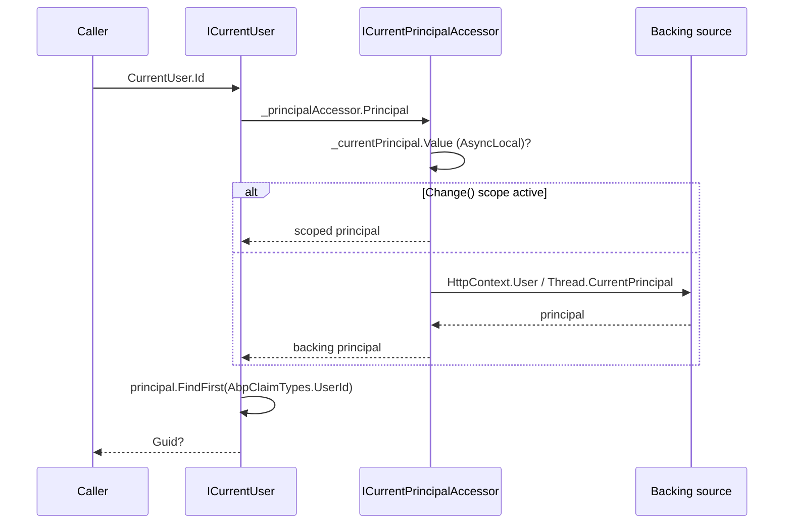

`Volo.Abp.Security` is the small, framework-wide layer that the rest of ABP queries to answer *"who is the caller?"*. It exposes three things: `ICurrentUser` — a typed projection of the current `ClaimsPrincipal` into `Id`, `UserName`, `TenantId`, `Roles`, `EmailVerified`, etc.; `ICurrentPrincipalAccessor` — an `AsyncLocal`-backed accessor that lets background workers and impersonation code change the active principal for a logical scope; and `AbpClaimTypes` — a mutable static record of claim-type *names* (e.g. `UserId = ClaimTypes.NameIdentifier`) that the entire framework reads. Encryption helpers (`IStringEncryptionService`) and the security log (`ISecurityLogManager`) live in the same package.

Source: `framework/src/Volo.Abp.Security/`.

## File inventory

| Path under `framework/src/Volo.Abp.Security/` | Role |
| --- | --- |
| `Volo/Abp/Security/AbpSecurityModule.cs` | Reads `StringEncryption:*` from `IConfiguration`. Auto-adds `IAbpClaimsPrincipalContributor` types. |
| `Volo/Abp/Security/Claims/AbpClaimTypes.cs` | Mutable static — claim-type *names* used by every consumer (`UserName`, `UserId`, `Role`, `TenantId`, `EditionId`, `ClientId`, `EmailVerified`, …). |
| `Volo/Abp/Security/Claims/ICurrentPrincipalAccessor.cs` | `ClaimsPrincipal Principal { get; }` + `IDisposable Change(ClaimsPrincipal)`. |
| `Volo/Abp/Security/Claims/CurrentPrincipalAccessorBase.cs` | `AsyncLocal<ClaimsPrincipal>` backing for `Change`. |
| `Volo/Abp/Security/Claims/ThreadCurrentPrincipalAccessor.cs` | Default — falls back to `Thread.CurrentPrincipal`. ASP.NET Core overrides with an HTTP-context-based variant. |
| `Volo/Abp/Security/Claims/CurrentPrincipalAccessorExtensions.cs` | Convenience overloads — `Change(Claim)`, `Change(IEnumerable<Claim>)`, `Change(ClaimsIdentity)`. |
| `Volo/Abp/Security/Claims/AbpClaimsPrincipalFactory.cs` | Runs every `IAbpClaimsPrincipalContributor` to *enrich* a principal at sign-in time. |
| `Volo/Abp/Security/Claims/IAbpClaimsPrincipalContributor.cs` | Hook for modules to add extra claims (impersonation, OU, edition, …). |
| `Volo/Abp/Security/Claims/AbpClaimsPrincipalFactoryOptions.cs` | `ITypeList<IAbpClaimsPrincipalContributor> Contributors`. |
| `Volo/Abp/Security/Claims/AbpClaimsPrincipalContributorContext.cs` | `ClaimsPrincipal` + `IServiceProvider` passed to contributors. |
| `System/Security/Principal/AbpClaimsIdentityExtensions.cs` | `FindUserId`, `FindTenantId`, `FindEditionId`, `FindClientId`, impersonation-claim helpers. |
| `Volo/Abp/Users/ICurrentUser.cs` | Typed projection — properties + `FindClaim`, `FindClaims`, `GetAllClaims`, `IsInRole`. |
| `Volo/Abp/Users/CurrentUser.cs` | Default implementation — pulls every property from `_principalAccessor.Principal`. |
| `Volo/Abp/Users/CurrentUserExtensions.cs` | `FindClaimValue`, `GetId`, impersonator helpers. |
| `Volo/Abp/Clients/ICurrentClient.cs` / `CurrentClient.cs` | Twin abstraction for the *client* (M2M / OAuth client_credentials). |
| `Volo/Abp/Security/Encryption/AbpStringEncryptionOptions.cs` | `Keysize=256`, `DefaultPassPhrase`, `InitVectorBytes`, `DefaultSalt`. |
| `Volo/Abp/Security/Encryption/IStringEncryptionService.cs` / `StringEncryptionService.cs` | AES-CBC + `Rfc2898DeriveBytes` encrypt/decrypt. |
| `Volo/Abp/Authorization/AbpAuthorizationException.cs` | Generic authorization failure with `Code`, `HttpStatusCode`, `LogLevel`. |
| `Volo/Abp/SecurityLog/SecurityLogInfo.cs` | DTO — Identity (TenantId, UserId, Action, ClientId, IP, Browser, …). |
| `Volo/Abp/SecurityLog/ISecurityLogManager.cs` / `DefaultSecurityLogManager.cs` | Stamps + dispatches to `ISecurityLogStore`. |
| `Volo/Abp/SecurityLog/SimpleSecurityLogStore.cs` | Default `[Dependency(TryRegister)]` — logs to `ILogger`. |

## `AbpClaimTypes` — the canonical names

```csharp
public static string UserName  { get; set; } = ClaimTypes.Name;
public static string Name      { get; set; } = ClaimTypes.GivenName;
public static string SurName   { get; set; } = ClaimTypes.Surname;
public static string UserId    { get; set; } = ClaimTypes.NameIdentifier;
public static string Role      { get; set; } = ClaimTypes.Role;
public static string Email     { get; set; } = ClaimTypes.Email;
public static string EmailVerified       { get; set; } = "email_verified";
public static string PhoneNumber         { get; set; } = "phone_number";
public static string PhoneNumberVerified { get; set; } = "phone_number_verified";
public static string TenantId  { get; set; } = "tenantid";
public static string EditionId { get; set; } = "editionid";
public static string ClientId  { get; set; } = "client_id";
public static string ImpersonatorTenantId   { get; set; } = "impersonator_tenantid";
public static string ImpersonatorUserId     { get; set; } = "impersonator_userid";
public static string ImpersonatorTenantName { get; set; } = "impersonator_tenantname";
public static string ImpersonatorUserName   { get; set; } = "impersonator_username";
```

Every property is `{ get; set; }` — applications that integrate with non-default identity providers (e.g. an OAuth server emitting `"sub"` for user id) override these names *once* in `PreConfigureServices`:

```csharp
public override void PreConfigureServices(ServiceConfigurationContext context)
{
    AbpClaimTypes.UserId = "sub";          // OpenID Connect convention
    AbpClaimTypes.TenantId = "tid";        // multi-tenant SaaS convention
}
```

After that, every component that reads `principal.FindFirst(AbpClaimTypes.UserId)` automatically picks up the new name. Because the values are static, *one* override at startup is enough; no per-request configuration is needed.

`AbpClaimsIdentityExtensions` is the typed read side:

```csharp
public static Guid? FindUserId(this ClaimsPrincipal principal)
{
    Check.NotNull(principal, nameof(principal));
    var userIdOrNull = principal.Claims?.FirstOrDefault(c => c.Type == AbpClaimTypes.UserId);
    if (userIdOrNull == null || userIdOrNull.Value.IsNullOrWhiteSpace()) return null;
    return Guid.TryParse(userIdOrNull.Value, out Guid guid) ? guid : (Guid?)null;
}
```

Failing to parse → `null` (not `default(Guid)`), which is how `CurrentUser.Id` distinguishes anonymous from "logged in but unparseable".

## `ICurrentUser` — typed projection

```csharp
public virtual bool IsAuthenticated => Id.HasValue;
public virtual Guid?   Id       => _principalAccessor.Principal?.FindUserId();
public virtual string? UserName => this.FindClaimValue(AbpClaimTypes.UserName);
public virtual string? Email    => this.FindClaimValue(AbpClaimTypes.Email);
public virtual bool    EmailVerified
    => string.Equals(this.FindClaimValue(AbpClaimTypes.EmailVerified), "true", StringComparison.InvariantCultureIgnoreCase);
public virtual Guid?   TenantId => _principalAccessor.Principal?.FindTenantId();
public virtual string[] Roles   => FindClaims(AbpClaimTypes.Role).Select(c => c.Value).Distinct().ToArray();
```

Every property reads `_principalAccessor.Principal` lazily — so changing the ambient principal via `ICurrentPrincipalAccessor.Change(...)` immediately affects `CurrentUser.Id` in the same call chain. The class is `ITransientDependency` (a fresh instance per resolve), so capturing `ICurrentUser` in a singleton is fine — it does not snapshot.

`IsAuthenticated` is keyed on `Id.HasValue`, not on `principal.Identity.IsAuthenticated`. So a request that has a `ClaimsPrincipal` with a valid identity but *no* `UserId` claim — e.g. a partial sign-in step — counts as anonymous. This is the right behavior for permission checks: there is no user to authorize.

### Impersonation reads

```csharp
public static Guid? FindImpersonatorUserId(this ICurrentUser currentUser)
{
    var impersonatorUserId = currentUser.FindClaimValue(AbpClaimTypes.ImpersonatorUserId);
    if (impersonatorUserId.IsNullOrWhiteSpace()) return null;
    return Guid.TryParse(impersonatorUserId, out var guid) ? guid : (Guid?)null;
}
```

The auditing layer ([Auditing](/framework/cross/auditing)) calls these helpers to stamp `AuditLogInfo.ImpersonatorUserId` so administrators can see "user X acted on behalf of user Y".

## `ICurrentPrincipalAccessor` — async-flow safe scopes

```csharp
public abstract class CurrentPrincipalAccessorBase : ICurrentPrincipalAccessor
{
    public ClaimsPrincipal Principal => _currentPrincipal.Value ?? GetClaimsPrincipal();

    private readonly AsyncLocal<ClaimsPrincipal> _currentPrincipal = new();

    protected abstract ClaimsPrincipal GetClaimsPrincipal();

    public virtual IDisposable Change(ClaimsPrincipal principal)
    {
        return SetCurrent(principal);
    }

    private IDisposable SetCurrent(ClaimsPrincipal principal)
    {
        var parent = Principal;
        _currentPrincipal.Value = principal;
        return new DisposeAction<ValueTuple<AsyncLocal<ClaimsPrincipal>, ClaimsPrincipal>>(static state =>
        {
            var (currentPrincipal, parent) = state;
            currentPrincipal.Value = parent;
        }, (_currentPrincipal, parent));
    }
}
```

Three observations:

- `_currentPrincipal` is `AsyncLocal<ClaimsPrincipal>` — values flow across `await` boundaries and into `Task.Run` continuations, but **don't** leak to sibling logical contexts (e.g. another HTTP request).
- `Principal` falls back to `GetClaimsPrincipal()` (the subclass hook) when no `Change(...)` is active. In ASP.NET Core, the override returns `HttpContext.User`; in plain console / background-worker hosts, `ThreadCurrentPrincipalAccessor` reads `Thread.CurrentPrincipal`.
- The returned `IDisposable` restores the *captured* parent value when disposed — even if intermediate code called `Change(...)` again and forgot to dispose, the stack-frame parent wins.

### Typical usage

```csharp
public class BackgroundOrderProcessor
{
    private readonly ICurrentPrincipalAccessor _principalAccessor;

    public async Task ProcessForUserAsync(Guid userId, string userName)
    {
        var identity = new ClaimsIdentity(AbpClaimsPrincipalFactory.AuthenticationType,
                                          AbpClaimTypes.UserName, AbpClaimTypes.Role);
        identity.AddClaim(new Claim(AbpClaimTypes.UserId, userId.ToString()));
        identity.AddClaim(new Claim(AbpClaimTypes.UserName, userName));

        using (_principalAccessor.Change(new ClaimsPrincipal(identity)))
        {
            // Inside the using block:
            //   CurrentUser.Id == userId
            //   PermissionChecker, AuditingHelper, etc. all see this principal
            await DoWorkAsync();
        }
    }
}
```

The convenience overloads in `CurrentPrincipalAccessorExtensions` reduce the boilerplate:

```csharp
using (_principalAccessor.Change(new[] {
    new Claim(AbpClaimTypes.UserId, userId.ToString()),
    new Claim(AbpClaimTypes.UserName, userName) })) { ... }
```

## Sign-in enrichment: `AbpClaimsPrincipalFactory`

When an authentication module creates a `ClaimsPrincipal` (cookie sign-in, JWT issuance, etc.), it should run it through `IAbpClaimsPrincipalFactory.CreateAsync` so every registered `IAbpClaimsPrincipalContributor` gets a chance to add claims:

```csharp
public virtual async Task<ClaimsPrincipal> CreateAsync(ClaimsPrincipal? existsClaimsPrincipal = null)
{
    using (var scope = ServiceScopeFactory.CreateScope())
    {
        var claimsPrincipal = existsClaimsPrincipal ?? new ClaimsPrincipal(new ClaimsIdentity(
            AuthenticationType,
            AbpClaimTypes.UserName,
            AbpClaimTypes.Role));

        var context = new AbpClaimsPrincipalContributorContext(claimsPrincipal, scope.ServiceProvider);

        foreach (var contributorType in Options.Contributors)
        {
            var contributor = (IAbpClaimsPrincipalContributor)scope.ServiceProvider.GetRequiredService(contributorType);
            await contributor.ContributeAsync(context);
        }

        return claimsPrincipal;
    }
}
```

`AuthenticationType` is the string literal `"Abp.Application"` — every principal minted by ABP carries this name. Identity providers (`Volo.Abp.Identity`) supply contributors that add `EditionId`, organization-unit claims, custom-data claims, etc. Discovery is automatic via `AbpSecurityModule`:

```csharp
services.OnRegistered(context =>
{
    if (typeof(IAbpClaimsPrincipalContributor).IsAssignableFrom(context.ImplementationType))
        contributorTypes.Add(context.ImplementationType);
});
```

## `StringEncryptionService` — AES-CBC

```csharp
using (var password = new Rfc2898DeriveBytes(passPhrase, salt))
{
    var keyBytes = password.GetBytes(Options.Keysize / 8);
    using (var symmetricKey = Aes.Create())
    {
        symmetricKey.Mode = CipherMode.CBC;
        using (var encryptor = symmetricKey.CreateEncryptor(keyBytes, Options.InitVectorBytes))
        {
            // ...write plaintext through CryptoStream, return Convert.ToBase64String(...)
        }
    }
}
```

Defaults (declared in `AbpStringEncryptionOptions`):

| Option | Default |
| --- | --- |
| `Keysize` | `256` |
| `DefaultPassPhrase` | `"gsKnGZ041HLL4IM8"` |
| `InitVectorBytes` | `Encoding.ASCII.GetBytes("jkE49230Tf093b42")` (16 chars → 16 bytes IV) |
| `DefaultSalt` | `Encoding.ASCII.GetBytes("hgt!16kl")` |

**The defaults are publicly known and trivially brute-forceable.** `AbpSecurityModule.ConfigureServices` will replace them from `IConfiguration["StringEncryption:DefaultPassPhrase"]`, etc., if set:

```json
{
  "StringEncryption": {
    "DefaultPassPhrase": "<64+ random characters>",
    "InitVectorBytes":   "<exactly 16 ASCII chars>",
    "DefaultSalt":       "<8+ ASCII chars>"
  }
}
```

The service is `ITransientDependency`. Per-call overrides for passphrase/salt let you key-rotate without re-encrypting everything at once:

```csharp
var v2 = _enc.Encrypt(plaintext, passPhrase: "v2-key", salt: v2Salt);
```

The setting-encryption layer ([Settings](/framework/cross/settings)) uses this service via `SettingEncryptionService`.

## Security log

`ISecurityLogManager.SaveAsync(SecurityLogInfo)` is the seam — modules push records like "user logged in", "password changed", "permission grant changed". The default `SimpleSecurityLogStore` writes to `ILogger`; the `Volo.Abp.SecurityLog.EntityFrameworkCore` module ships an EF table. `DefaultSecurityLogManager` stamps `ExecutionTime`, `ApplicationName`, `TenantId`, `UserId`, `ClientIpAddress`, `BrowserInfo` automatically — callers only supply `Action` and `Identity`.

## Layered access pattern



## Gotchas

- **`AbpClaimTypes` is mutable static.** Override in `PreConfigureServices` *before* any module reads it. Mutating after the host starts produces inconsistent reads — some components cache the value.
- **`CurrentUser.Id == null` means *no parsable id*, not *no user*.** A principal carrying `UserId = ""` or `"not-a-guid"` returns `null` from `FindUserId`. Check `IsAuthenticated`, not `Identity.IsAuthenticated`.
- **`ICurrentPrincipalAccessor.Change` is nest-safe.** Disposing the inner handle restores the *parent that was captured*, not whatever happens to be current at dispose time. Forgetting to dispose leaks the scope until the next `Change`.
- **The default encryption passphrase is the same in every ABP install.** Never use it in production. Either set `StringEncryption:DefaultPassPhrase` in configuration or pass a per-call passphrase.
- **AES key size is bytes-divisible.** The code does `Keysize / 8`; setting `Keysize = 130` will silently produce a 16-byte key and a runtime decrypt mismatch.
- **`InitVectorBytes` must be exactly 16 bytes.** AES block size is 128 bits; a shorter or longer value crashes inside `Aes.CreateEncryptor`. The default `"jkE49230Tf093b42"` is 16 ASCII chars.
- **`Roles` is distinct but not normalized.** `["Admin", "admin"]` returns both entries — case is preserved. Permission grants in `IPermissionStore` are typically case-sensitive too.
- **`ThreadCurrentPrincipalAccessor` is non-flow.** It reads `Thread.CurrentPrincipal`, which is per-OS-thread, not per-async-context. In a worker host that hops threads, you may see surprising principals between `await`s. Use `Change()` to pin a principal to the logical scope.
- **`AbpClaimsPrincipalFactory.AuthenticationType == "Abp.Application"`.** Code checking `principal.Identity.AuthenticationType == "Bearer"` will fail after ABP enrichment; always use `IsAuthenticated` + `IsAuthenticated && Id.HasValue`.
- **`CurrentUser.EmailVerified` is a string compare against `"true"`.** Implementations storing `"True"` or `"1"` produce `false`. Be consistent with the issuer.
- **`Configure<AbpClaimsPrincipalFactoryOptions>` runs *post*.** Auto-discovery happens in `PostConfigureServices` — manual `Add<T>()` calls *during* `ConfigureServices` may be re-deduplicated by `AddIfNotContains`. Add in `PostConfigureServices` if order matters.
- **`SecurityLogInfo.ExtraProperties` is your migration escape.** New fields go there, not on the DTO — the DTO must remain backward-compatible with persisted rows.
