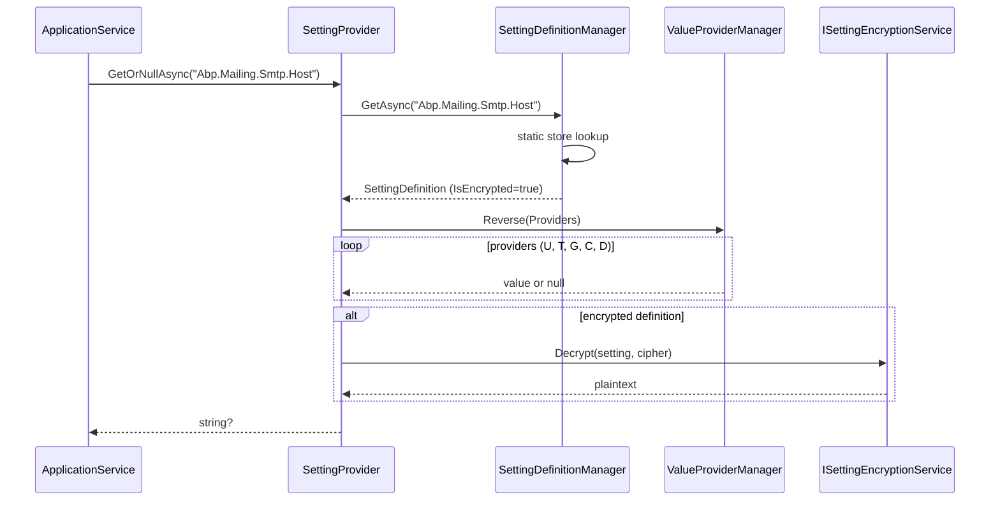

ABP settings are *named string values* with a layered resolution chain. Every value flows through `ISettingProvider`, which consults a list of `ISettingValueProvider`s in **reverse** declaration order. The default chain — Default → Configuration → Global → Tenant → User — therefore resolves bottom-up as **User → Tenant → Global → Configuration → Default**, with the first non-null hit winning. Definitions are declared by `ISettingDefinitionProvider` (auto-discovered by convention), encrypted-at-rest values are transparently decrypted, and the same `ISettingProvider` API is callable from any layer (application service, controller, background worker).

The runtime lives in `framework/src/Volo.Abp.Settings/`. The `TenantSettingValueProvider` is added by `framework/src/Volo.Abp.MultiTenancy/` so multi-tenancy is optional.

## File inventory

| Path under `framework/src/Volo.Abp.Settings/Volo/Abp/Settings/` | Role |
| --- | --- |
| `AbpSettingsModule.cs` | Registers the four built-in value providers in order. Auto-discovers definition providers. |
| `AbpSettingOptions.cs` | `DefinitionProviders`, `ValueProviders`, `DeletedSettings`. |
| `ISettingProvider.cs` / `SettingProvider.cs` | The high-level read API. |
| `SettingProviderExtensions.cs` | `IsTrueAsync`, `GetAsync<T>(name, default)`. |
| `ISettingValueProvider.cs` / `SettingValueProvider.cs` | Per-scope lookup contract (`Name`, `GetOrNullAsync`, `GetAllAsync`). |
| `ISettingValueProviderManager.cs` / `SettingValueProviderManager.cs` | Lazily materializes the configured `ValueProviders`. |
| `DefaultValueSettingValueProvider.cs` | `"D"` — `setting.DefaultValue`. |
| `ConfigurationSettingValueProvider.cs` | `"C"` — `IConfiguration["Settings:" + name]`. |
| `GlobalSettingValueProvider.cs` | `"G"` — `ISettingStore.GetOrNullAsync(name, "G", null)`. |
| `UserSettingValueProvider.cs` | `"U"` — keyed on `CurrentUser.Id`. |
| `ISettingDefinitionContext.cs` / `SettingDefinitionContext.cs` | Provider's `Add(...)` API. |
| `ISettingDefinitionProvider.cs` / `SettingDefinitionProvider.cs` | Hook called once at boot per provider class. |
| `ISettingDefinitionManager.cs` / `SettingDefinitionManager.cs` | Merges static + dynamic stores. |
| `IStaticSettingDefinitionStore.cs` / `StaticSettingDefinitionStore.cs` | Runs every provider, caches name → definition map. |
| `IDynamicSettingDefinitionStore.cs` / `NullDynamicSettingDefinitionStore.cs` | DB-backed store seam (no-op default). |
| `ISettingStore.cs` / `NullSettingStore.cs` | Value-storage seam — `(name, providerName, providerKey)` → string. |
| `ISettingEncryptionService.cs` / `SettingEncryptionService.cs` | Transparent encrypt/decrypt for `IsEncrypted` definitions. |
| `SettingDefinition.cs` | DTO — `Name`, `DefaultValue`, `IsVisibleToClients`, `IsEncrypted`, `IsInherited`, `Providers`. |
| `SettingValue.cs` | Lightweight `(Name, Value)` for bulk reads. |

| Path under `framework/src/Volo.Abp.MultiTenancy/Volo/Abp/MultiTenancy/` | Role |
| --- | --- |
| `TenantSettingValueProvider.cs` | `"T"` — keyed on `CurrentTenant.Id`. Inserted **after** `GlobalSettingValueProvider`. |

## Key abstractions

| Member | Signature | Purpose |
| --- | --- | --- |
| `ISettingProvider.GetOrNullAsync(name)` | `Task<string?>` | Reads with full chain + decryption. |
| `ISettingProvider.GetAllAsync()` | `Task<List<SettingValue>>` | Resolves every definition through `GetOrNullAsync` (N+1 by design). |
| `ISettingProvider.GetAllAsync(string[] names)` | `Task<List<SettingValue>>` | Batched — one round-trip per provider. |
| `ISettingProvider.IsTrueAsync(name)` | `Task<bool>` (ext) | Case-insensitive string compare against `"true"`. |
| `ISettingProvider.GetAsync<T>(name, default)` | `Task<T>` (ext, `T : struct`) | Uses `value.To<T>()`. |
| `ISettingValueProvider.Name` | `string` (`"D"`, `"C"`, `"G"`, `"T"`, `"U"`) | Discriminator stored in the value store. |
| `SettingDefinition.IsInherited` | `bool` (default `true`) | UI hint — does this setting inherit from parent scopes. |
| `SettingDefinition.IsEncrypted` | `bool` (default `false`) | If `true`, values are encrypted by `ISettingEncryptionService` on save and decrypted in `SettingProvider.GetOrNullAsync`. |
| `SettingDefinition.IsVisibleToClients` | `bool` (default `false`) | Filters which settings the `/api/abp/application-configuration` endpoint exposes. |
| `SettingDefinition.Providers` | `List<string>` | When non-empty, restricts the chain (e.g. `["G"]` for host-only). |
| `SettingDefinition.DefaultValue` | `string?` | Returned by `DefaultValueSettingValueProvider`. |
| `ISettingDefinitionContext.Add(params SettingDefinition[])` | `void` | Provider-side mutation API. |
| `AbpSettingOptions.DeletedSettings` | `HashSet<string>` | Names dropped after every provider has contributed. |

## The provider chain

`AbpSettingsModule.ConfigureServices` registers, in this declaration order:

```csharp
options.ValueProviders.Add<DefaultValueSettingValueProvider>();   // "D"
options.ValueProviders.Add<ConfigurationSettingValueProvider>();  // "C"
options.ValueProviders.Add<GlobalSettingValueProvider>();         // "G"
options.ValueProviders.Add<UserSettingValueProvider>();           // "U"
```

`AbpMultiTenancyModule.ConfigureServices` injects `TenantSettingValueProvider` (`"T"`) *after* the global provider:

```csharp
Configure<AbpSettingOptions>(options =>
{
    options.ValueProviders.InsertAfter(t => t == typeof(GlobalSettingValueProvider),
                                       typeof(TenantSettingValueProvider));
});
```

So the registered list is `[D, C, G, T, U]`. `SettingProvider.GetOrNullAsync` enumerates it in **reverse**:

```csharp
var setting = await SettingDefinitionManager.GetAsync(name);
var providers = Enumerable.Reverse(SettingValueProviderManager.Providers);

if (setting.Providers.Any())
    providers = providers.Where(p => setting.Providers.Contains(p.Name));

var value = await GetOrNullValueFromProvidersAsync(providers, setting);
if (value != null && setting.IsEncrypted)
    value = SettingEncryptionService.Decrypt(setting, value);

return value;
```

Effective lookup order:

| # | Provider | Key | Source |
| --- | --- | --- | --- |
| 1 | `UserSettingValueProvider` (`U`) | `CurrentUser.Id` | `ISettingStore` |
| 2 | `TenantSettingValueProvider` (`T`) | `CurrentTenant.Id` | `ISettingStore` |
| 3 | `GlobalSettingValueProvider` (`G`) | `null` (singleton) | `ISettingStore` |
| 4 | `ConfigurationSettingValueProvider` (`C`) | — | `IConfiguration["Settings:" + name]` |
| 5 | `DefaultValueSettingValueProvider` (`D`) | — | `setting.DefaultValue` |

The first non-null value wins. So:

- A user override (`"U"`) beats everything.
- A tenant override beats global, configuration, and default.
- `appsettings.json` (`"Settings:Foo"`) beats only `DefaultValue`.
- `DefaultValue` is the floor.

`UserSettingValueProvider` and `TenantSettingValueProvider` are short-circuited when the principal/tenant is absent:

```csharp
public override async Task<string?> GetOrNullAsync(SettingDefinition setting)
{
    if (CurrentUser.Id == null) return null;
    return await SettingStore.GetOrNullAsync(setting.Name, Name, CurrentUser.Id.ToString());
}
```

So an anonymous request skips `"U"` and falls through to `"T"` (which, on a host call, also returns `null`) and lands on `"G"` → `"C"` → `"D"`.

## End-to-end read sequence



## Bulk read paths

`GetAllAsync(string[] names)` is *not* implemented as N calls to `GetOrNullAsync` — it asks each provider for the entire batch in one shot, then folds non-null results into the result dictionary:

```csharp
foreach (var provider in Enumerable.Reverse(SettingValueProviderManager.Providers))
{
    var settingValues = await provider.GetAllAsync(settingDefinitions
        .Where(x => !x.Providers.Any() || x.Providers.Contains(provider.Name))
        .ToArray());

    var notNullValues = settingValues.Where(x => x.Value != null).ToList();
    foreach (var settingValue in notNullValues)
    {
        var settingDefinition = settingDefinitions.First(x => x.Name == settingValue.Name);
        if (settingDefinition.IsEncrypted)
            settingValue.Value = SettingEncryptionService.Decrypt(settingDefinition, settingValue.Value);

        if (result.ContainsKey(settingValue.Name) && result[settingValue.Name].Value == null)
            result[settingValue.Name].Value = settingValue.Value;
    }

    settingDefinitions.RemoveAll(x => notNullValues.Any(v => v.Name == x.Name));
    if (!settingDefinitions.Any()) break;
}
```

Two important consequences:

- The chain is short-circuited as soon as every requested setting has been resolved.
- Definitions whose `Providers` list excludes a given provider are filtered *per provider* — so `["G"]` settings never hit `"U"` or `"T"` at all.

The parameterless overload `GetAllAsync()` is the dumb version — it calls `GetOrNullAsync(name)` per setting. Avoid it in hot paths.

## Defining settings

```csharp
public class MailingSettingDefinitionProvider : SettingDefinitionProvider
{
    public override void Define(ISettingDefinitionContext context)
    {
        context.Add(
            new SettingDefinition(
                name: "Abp.Mailing.Smtp.Host",
                defaultValue: "127.0.0.1",
                displayName: L("DisplayName:Abp.Mailing.Smtp.Host"),
                isVisibleToClients: false),

            new SettingDefinition(
                name: "Abp.Mailing.Smtp.Password",
                isEncrypted: true,
                isVisibleToClients: false),

            new SettingDefinition(
                name: "Abp.Localization.DefaultLanguage",
                defaultValue: "en",
                isVisibleToClients: true)
        );
    }
}
```

`AbpSettingsModule.PreConfigureServices` registers an `OnRegistered` callback that collects every type implementing `ISettingDefinitionProvider` and pushes them into `Options.DefinitionProviders`. The static store runs each one at first read and caches the merged dictionary.

## Encryption

`SettingEncryptionService` is `[Dependency(TryRegister)]` and delegates to `IStringEncryptionService` (the same `Aes`/`Rfc2898DeriveBytes` pipeline used elsewhere in `Volo.Abp.Security`). The decision is per-definition:

```csharp
if (value != null && setting.IsEncrypted)
    value = SettingEncryptionService.Decrypt(setting, value);
```

`DefaultValue` is **not** encrypted — the assumption is that defaults are public and only stored-elsewhere values carry secrets. The configuration provider also does not auto-decrypt — `appsettings.json` strings are read verbatim, so if you set `Settings:Abp.Mailing.Smtp.Password = "secret"` in config, it overrides the encrypted store value with cleartext.

## Configuration-based overrides

`ConfigurationSettingValueProvider` uses the prefix `"Settings:"`:

```csharp
public const string ConfigurationNamePrefix = "Settings:";

public virtual Task<string?> GetOrNullAsync(SettingDefinition setting)
{
    return Task.FromResult(Configuration[ConfigurationNamePrefix + setting.Name]);
}
```

Useful for environment-driven overrides:

```json
{
  "Settings": {
    "Abp.Mailing.Smtp.Host": "smtp.mailgun.org",
    "Abp.Mailing.Smtp.Port": "587"
  }
}
```

Environment variables work too (with the standard `Settings__Abp.Mailing.Smtp.Host` mapping the colon to a double underscore). Because `"C"` is below `"G"`/`"T"`/`"U"` in the chain, a tenant can still override an `appsettings.json` value through the DB.

## Definition merging

`SettingDefinitionManager` is `ISingletonDependency` and merges the static and dynamic stores with static-precedence:

```csharp
return staticSettings.Concat(
    dynamicSettings.Where(d => !staticSettingNames.Contains(d.Name))
).ToImmutableList();
```

`NullDynamicSettingDefinitionStore` is the default — the `Volo.Abp.SettingManagement.Domain` module ships a DB-backed dynamic store so admins can add settings through the UI without redeploying. `GetAsync(name)` throws `AbpException("Undefined setting: " + name)` for unknown names; `GetOrNullAsync` returns `null`.

## Adding a custom provider

```csharp
public class OrganizationUnitSettingValueProvider : SettingValueProvider
{
    public const string ProviderName = "OU";
    public override string Name => ProviderName;

    public OrganizationUnitSettingValueProvider(ISettingStore store) : base(store) { }

    public override Task<string?> GetOrNullAsync(SettingDefinition setting)
        => SettingStore.GetOrNullAsync(setting.Name, Name, GetCurrentOuId());

    public override Task<List<SettingValue>> GetAllAsync(SettingDefinition[] settings)
        => SettingStore.GetAllAsync(settings.Select(x => x.Name).ToArray(), Name, GetCurrentOuId());

    string? GetCurrentOuId() => /* read from claims or context */;
}

Configure<AbpSettingOptions>(options =>
{
    // Slot between Tenant and User so OU overrides tenant but yields to user:
    options.ValueProviders.InsertAfter(t => t == typeof(TenantSettingValueProvider),
                                       typeof(OrganizationUnitSettingValueProvider));
});
```

## The setting store

`ISettingStore.GetOrNullAsync(string name, string? providerName, string? providerKey)` is the single seam every store provider funnels through. The default `NullSettingStore` returns `null` for everything. The `Volo.Abp.SettingManagement.Domain` module ships an EF Core implementation that maps `(name, providerName, providerKey)` to a `Setting` row in the `AbpSettings` table. Anything else (Redis, key-vault, Consul) is a matter of implementing this one interface.

## Gotchas

- **Chain order is the *reverse* of `Options.ValueProviders`.** `Add<X>()` puts `X` at the bottom of the **resolution** chain; use `InsertAfter` / `InsertBefore` for explicit slot control.
- **The order chosen by `AbpSettingsModule` does not include `T`.** `TenantSettingValueProvider` is added by `Volo.Abp.MultiTenancy`. Hosts that don't reference multi-tenancy resolve User → Global → Configuration → Default — there is no tenant slot.
- **`UserSettingValueProvider` requires `CurrentUser.Id`.** Anonymous calls skip the `"U"` step entirely. Tests that fake authentication only via headers (no claims principal) silently fall through to the global value.
- **`SettingProvider` is `ITransientDependency` but the value-provider list is cached.** `SettingValueProviderManager` is `ISingletonDependency` and caches the materialized list in a `Lazy<>`. Changing `Options.ValueProviders` after the first read has no effect.
- **`IsEncrypted` doesn't auto-encrypt writes.** The store implementation is responsible for calling `SettingEncryptionService.Encrypt` on save. `SettingProvider` only handles the decrypt half.
- **`Settings.IsVisibleToClients` is a marker only.** The `SettingProvider` ignores it; client-facing endpoints (e.g. `/api/abp/application-configuration` in the AspNetCore.Mvc module) filter on it to decide what to ship to browsers.
- **`Setting.Providers` filters chain *both directions*.** When non-empty, the value provider chain is narrowed to only those names — so a `Providers = ["G"]` setting is *unreadable* from a user-only request that lacks a `"G"` lookup. Use `["G", "T"]` if you want host + tenant but no per-user override.
- **`GetAllAsync()` is N round-trips.** Use the array overload (`GetAllAsync(string[])`) for batches or you will hit one DB call per setting per provider.
- **Empty string vs null.** Providers return `null` for "not set" — `IsEnabledAsync` analogues are usually `IsTrueAsync` which compares against literal `"true"`. An empty string in config (`"Settings:Foo": ""`) wins over default. Be explicit about your sentinel.
- **`SettingDefinitionContext.Add` upserts.** Two providers can both add `"X"` — the last writer wins. The static store does not warn on collisions; design with name prefixes (`MyModule.Foo`).
- **Singleton-lifetime providers must be stateless.** `SettingValueProviderManager` resolves each provider type via `IServiceProvider.GetRequiredService` once and caches the instance — DI scope is effectively root.
