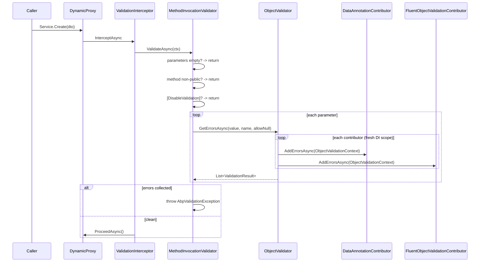

ABP intercepts every public method on a class marked with `IValidationEnabled` (which `IApplicationService` extends), walks its argument list, and runs every registered `IObjectValidationContributor` against each non-primitive argument. If any contributor produces a `ValidationResult`, the call is short-circuited with an `AbpValidationException` carrying the accumulated errors — the exception handler converts that to HTTP 400 + a `RemoteServiceValidationErrorInfo[]` payload. Out of the box the only contributor is `DataAnnotationObjectValidationContributor`, which honors `[Required]`, `[StringLength]`, etc. and walks the object graph recursively; FluentValidation slots in as an additional contributor via `Volo.Abp.FluentValidation`.

The runtime lives in `framework/src/Volo.Abp.Validation/`. The exception itself, the `IHasValidationErrors` marker, and the abstractions module live in `framework/src/Volo.Abp.Validation.Abstractions/`.

## File inventory

| Path under `framework/src/Volo.Abp.Validation/Volo/Abp/Validation/` | Role |
| --- | --- |
| `AbpValidationModule.cs` | Registers the interceptor registrar + auto-discovers contributors. |
| `AbpValidationOptions.cs` | `IgnoredTypes`, `ObjectValidationContributors` type-list. |
| `IValidationEnabled.cs` | Marker interface enabling interception. `IApplicationService` extends it. |
| `ValidationInterceptor.cs` | Castle interceptor — delegates to `IMethodInvocationValidator`. |
| `ValidationInterceptorRegistrar.cs` | Attaches the interceptor to every `IValidationEnabled` type. |
| `IMethodInvocationValidator.cs` / `MethodInvocationValidator.cs` | Walks parameters; calls `IObjectValidator` per arg. |
| `MethodInvocationValidationContext.cs` | Per-call state: `TargetObject`, `Method`, `Parameters`, `ParameterValues`, `Errors`. |
| `IObjectValidator.cs` / `ObjectValidator.cs` | Top-level object check — runs every contributor inside a scope. |
| `ObjectValidationContext.cs` | Mutable bag — `ValidatingObject`, `List<ValidationResult> Errors`. |
| `IObjectValidationContributor.cs` | The extension seam — `AddErrorsAsync(ObjectValidationContext)`. |
| `DataAnnotationObjectValidationContributor.cs` | Default — walks `TypeDescriptor` properties, runs `ValidationAttribute`s, calls `IValidatableObject.Validate`. |
| `IAttributeValidationResultProvider.cs` / `DefaultAttributeValidationResultProvider.cs` | Wraps single-attribute validation calls so they can be overridden. |
| `DisableValidationAttribute.cs` | Suppresses validation on a method, parameter, or property. |
| `EnableValidationAttribute.cs` | Re-enables validation on a method that would otherwise be excluded. |
| `ValidationInterceptorRegistrar.cs` | `IValidationEnabled` is the *only* selector. |
| `ValidationHelper.cs` | Static helpers for caller code that wants to validate without the interceptor. |
| `StringValues/*` | Selection / numeric / toggle / string-value-type model used by Features and Settings UIs. |

| Path under `framework/src/Volo.Abp.Validation.Abstractions/Volo/Abp/Validation/` | Role |
| --- | --- |
| `AbpValidationException.cs` | Carries `IList<ValidationResult>`, `LogLevel = Warning`, implements `IExceptionWithSelfLogging`. |
| `IHasValidationErrors.cs` | Discriminator the exception-handling layer keys on. |
| `AbpValidationAbstractionsModule.cs` | Module marker — no services. |

## Key abstractions

| Member | Signature | Purpose |
| --- | --- | --- |
| `IValidationEnabled` | marker | Membership filter for the interceptor registrar. |
| `[DisableValidation]` | attribute (Method/Class/Parameter/Property) | Suppress validation locally. |
| `[EnableValidation]` | attribute (Method) | Override a class-level `[DisableValidation]`. |
| `IObjectValidator.ValidateAsync(obj, name?, allowNull?)` | `Task` | Throws on error. |
| `IObjectValidator.GetErrorsAsync(obj, name?, allowNull?)` | `Task<List<ValidationResult>>` | Returns the error list, doesn't throw. |
| `IObjectValidationContributor.AddErrorsAsync(ctx)` | `Task` | Mutate `ctx.Errors`. |
| `AbpValidationOptions.IgnoredTypes` | `List<Type>` | Types that recursive validation should skip (e.g. `Stream`). |
| `AbpValidationOptions.ObjectValidationContributors` | `ITypeList<IObjectValidationContributor>` | Resolved per-call inside a fresh scope. |
| `AbpValidationException.ValidationErrors` | `IList<ValidationResult>` | The accumulated errors. |
| `AbpValidationException.LogLevel` | `LogLevel` (default `Warning`) | Suppresses noisy stack traces in logs. |
| `IExceptionWithSelfLogging.Log(ILogger)` | `void` | The exception logs *itself* — one line per error. |

## Pipeline



### Interceptor

`ValidationInterceptor` is the simplest of all the cross-cutting interceptors:

```csharp
public override async Task InterceptAsync(IAbpMethodInvocation invocation)
{
    await ValidateAsync(invocation);
    await invocation.ProceedAsync();
}

protected virtual async Task ValidateAsync(IAbpMethodInvocation invocation)
{
    await _methodInvocationValidator.ValidateAsync(
        new MethodInvocationValidationContext(
            invocation.TargetObject,
            invocation.Method,
            invocation.Arguments));
}
```

No cross-cutting bypass — only the static `[DisableValidation]` attribute disables checks. The registrar attaches the interceptor to any class implementing `IValidationEnabled`:

```csharp
private static bool ShouldIntercept(Type type)
{
    return !DynamicProxyIgnoreTypes.Contains(type) && typeof(IValidationEnabled).IsAssignableFrom(type);
}
```

So application services are validated by default (because `IApplicationService : IValidationEnabled`); plain controllers and infrastructure are not.

### `MethodInvocationValidator`

The validator short-circuits on five conditions, in order:

```csharp
if (context.Parameters.IsNullOrEmpty())            return;
if (!context.Method.IsPublic)                       return;
if (IsValidationDisabled(context))                  return;
if (context.Parameters.Length != context.ParameterValues.Length)
    throw new Exception("Method parameter count does not match with argument count!");

if (context.Errors.Any() && HasSingleNullArgument(context))
    ThrowValidationError(context);

await AddMethodParameterValidationErrorsAsync(context);

if (context.Errors.Any()) ThrowValidationError(context);
```

`IsValidationDisabled` favors the explicit positive: `[EnableValidation]` on a method beats a class-level `[DisableValidation]`:

```csharp
if (context.Method.IsDefined(typeof(EnableValidationAttribute), true)) return false;
return ReflectionHelper.GetSingleAttributeOfMemberOrDeclaringTypeOrDefault<DisableValidationAttribute>(context.Method) != null;
```

For each parameter, `AddMethodParameterValidationErrorsAsync` delegates to `_objectValidator.GetErrorsAsync` with an `allowNulls` flag set for optional parameters, `out` parameters, or primitive-extended types (anything that `TypeHelper.IsPrimitiveExtended(..., includeEnums: true)` accepts):

```csharp
var allowNulls = parameterInfo.IsOptional ||
                 parameterInfo.IsOut ||
                 TypeHelper.IsPrimitiveExtended(parameterInfo.ParameterType, includeEnums: true);

context.Errors.AddRange(
    await _objectValidator.GetErrorsAsync(parameterValue, parameterInfo.Name, allowNulls));
```

A non-nullable DTO parameter that is `null` therefore generates a single `ValidationResult("xxx is null!", new[] { "xxx" })`.

### `ObjectValidator` runs every contributor

```csharp
public virtual async Task<List<ValidationResult>> GetErrorsAsync(object validatingObject, string? name = null, bool allowNull = false)
{
    if (validatingObject == null)
    {
        if (allowNull) return new List<ValidationResult>();
        return new List<ValidationResult> { name == null
            ? new ValidationResult("Given object is null!")
            : new ValidationResult(name + " is null!", new[] { name }) };
    }

    var context = new ObjectValidationContext(validatingObject);

    using (var scope = ServiceScopeFactory.CreateScope())
    {
        foreach (var contributorType in Options.ObjectValidationContributors)
        {
            var contributor = (IObjectValidationContributor)scope.ServiceProvider.GetRequiredService(contributorType);
            await contributor.AddErrorsAsync(context);
        }
    }

    return context.Errors;
}
```

Each contributor sees the same mutable `ObjectValidationContext` and appends to its `Errors` list — the order in `Options.ObjectValidationContributors` decides who runs first, but final ordering of the *reported* errors is just append order. Resolving inside a fresh scope means contributors can take scoped dependencies (e.g. a `DbContext`, an `IStringLocalizer`).

### `DataAnnotationObjectValidationContributor` recurses

The default contributor walks the object graph depth-first, capped at `MaxRecursiveParameterValidationDepth = 8`:

```csharp
protected virtual void ValidateObjectRecursively(List<ValidationResult> errors, object? validatingObject, int currentDepth)
{
    if (currentDepth > MaxRecursiveParameterValidationDepth) return;
    if (validatingObject == null) return;

    AddErrors(errors, validatingObject);   // properties' [ValidationAttribute] + IValidatableObject.Validate(...)

    if (validatingObject is IEnumerable enumerable && !(enumerable is IQueryable))
    {
        foreach (var item in enumerable)
        {
            if (item == null || TypeHelper.IsPrimitiveExtended(item.GetType())) break;
            ValidateObjectRecursively(errors, item, currentDepth + 1);
        }
        return;
    }

    if (TypeHelper.IsPrimitiveExtended(validatingObject.GetType())) return;
    if (Options.IgnoredTypes.Any(t => t.IsInstanceOfType(validatingObject))) return;

    foreach (var property in TypeDescriptor.GetProperties(validatingObject).Cast<PropertyDescriptor>())
    {
        if (property.Attributes.OfType<DisableValidationAttribute>().Any()) continue;
        ValidateObjectRecursively(errors, property.GetValue(validatingObject), currentDepth + 1);
    }
}
```

Property-level attributes go through `IAttributeValidationResultProvider`, so an app can intercept per-attribute logic (e.g. swap `[Required]` to allow whitespace-only strings during a migration):

```csharp
var attributeValidationResultProvider = ServiceProvider.GetRequiredService<IAttributeValidationResultProvider>();
foreach (var attribute in validationAttributes)
{
    var result = attributeValidationResultProvider.GetOrDefault(attribute, property.GetValue(validatingObject), validationContext);
    if (result != null) errors.Add(result);
}
```

The recursion deliberately *doesn't* walk into `IQueryable` (which would force enumeration of a DB query) and breaks on the first primitive item in an enumerable.

## Throwing `AbpValidationException`

```csharp
protected virtual void ThrowValidationError(MethodInvocationValidationContext context)
{
    throw new AbpValidationException(
        "Method arguments are not valid! See ValidationErrors for details.",
        context.Errors);
}
```

The exception is special-cased by the framework:

- `IExceptionWithSelfLogging.Log` prints one line per `ValidationResult`, including member names. The default exception subscriber respects this and *doesn't* dump a stack trace.
- `IHasValidationErrors` is the marker the `DefaultExceptionToErrorInfoConverter` uses to populate `RemoteServiceErrorInfo.ValidationErrors`.
- `LogLevel = LogLevel.Warning` is the default — validation failures are not "errors" in the operational sense.

## Auto-discovery of contributors

`AbpValidationModule.PreConfigureServices` walks the DI graph and registers every type implementing `IObjectValidationContributor`:

```csharp
services.OnRegistered(context =>
{
    if (typeof(IObjectValidationContributor).IsAssignableFrom(context.ImplementationType))
        contributorTypes.Add(context.ImplementationType);
});

services.Configure<AbpValidationOptions>(options =>
{
    options.ObjectValidationContributors.AddIfNotContains(contributorTypes);
});
```

So `DataAnnotationObjectValidationContributor` (`ITransientDependency`) is auto-added; if you reference `Volo.Abp.FluentValidation`, `FluentObjectValidationContributor` is also auto-added. Manual `Configure<AbpValidationOptions>(o => o.ObjectValidationContributors.Add<MyContributor>())` is rarely needed.

## Suppression patterns

```csharp
public class BookAppService : ApplicationService
{
    [DisableValidation]                       // skip parameter validation for this one method
    public Task<Book> RawAsync(string sql) { ... }

    [EnableValidation]                        // override class-level [DisableValidation]
    public Task<Book> CreateAsync(BookCreateDto input) { ... }
}

public class LegacyDto
{
    [DisableValidation]                       // skip recursion into ConfigBag
    public Dictionary<string, object> ConfigBag { get; set; }
}
```

A common pattern: mark the *parameter* with `[DisableValidation]` for streaming endpoints (an `IFormFile` does not need validation walking).

## Configuration

```csharp
Configure<AbpValidationOptions>(options =>
{
    options.IgnoredTypes.Add(typeof(IFormFile));            // don't try to validate file uploads
    options.ObjectValidationContributors.Add<MyAuditingValidationContributor>();
});
```

`IgnoredTypes` is matched on `IsInstanceOfType`, so adding a base class skips every subclass.

## Gotchas

- **Only public methods.** `MethodInvocationValidator` returns early on non-public methods. `protected` or `internal` overrides are not validated even when interception happens.
- **Recursion depth is 8.** Deeply nested DTO graphs silently stop being validated past depth 8. Either keep DTOs shallow or contribute a custom validator that explicitly walks the cycle.
- **`IQueryable` is skipped.** A property of type `IQueryable<T>` is treated specially and *not* recursed — otherwise enumeration would execute the query. Materialize before validating.
- **`null` for non-primitive parameter throws.** A `null` non-optional reference parameter generates `"name is null!"` even before any contributor runs. For optional parameters use C# `?` or `[DisableValidation]`.
- **`AbpValidationException` is not `Exception` to be feared.** It logs at Warning, no stack trace. Don't try to silence it globally — clients depend on the 400 status and `RemoteServiceValidationErrorInfo[]` payload.
- **No bypass beyond attributes.** Unlike auditing/features there is no `AbpCrossCuttingConcerns.Applying("Validation", ...)` scope. To run a service without validation in tests, register a no-op `IObjectValidator` for that test class.
- **`IValidatableObject.Validate` runs once per object via the data-annotations contributor.** If you also register FluentValidation, both run — duplicates are *not* deduplicated. Pick one strategy per DTO.
- **Contributor list ordering matters when contributors short-circuit.** The default contributors append independently, but a custom contributor that aborts on first error must run last to see everything.
- **`[EnableValidation]` beats `[DisableValidation]` only when applied to the *method*.** A class-level `[EnableValidation]` is not honored — the lookup checks `IsDefined(EnableValidation)` on the *method* only.
- **`AbpValidationException` serializes its messages.** The error messages persist through HTTP boundary and into `AbpRemoteCallException`. If they contain user-facing localizable text, be sure your resource keys exist on the *client* side too.
- **Contributors resolve in a fresh scope.** Don't capture `IObjectValidator` from a long-lived scope and expect it to flow ambient state like the current UoW.
