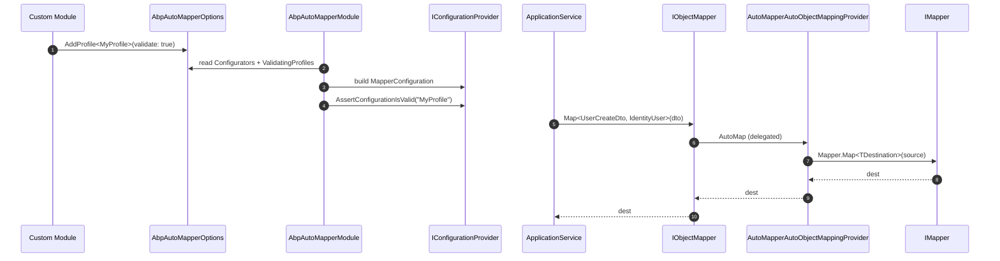

`Volo.Abp.AutoMapper` is the *reference* implementation of `IAutoObjectMappingProvider`. It plugs AutoMapper into the `Volo.Abp.ObjectMapping` abstractions, registers `IMapperAccessor` so the rest of the framework can reach the singleton `IMapper`, hosts the **configurator list** (`AbpAutoMapperOptions.Configurators`) where modules append `AddProfile<T>()` calls, runs AutoMapper's **configuration validation** for opted-in profiles at startup, and ships two extension namespaces (`AutoMapperExpressionExtensions`, `AbpAutoMapperExtensibleDtoExtensions`) of fluent helpers — `IgnoreFullAuditedObjectProperties()`, `MapExtraProperties()`, and friends — that let mapping profiles stay terse.

Most ABP modules add **one line** to their `ConfigureServices`:

```csharp
context.Services.AddAutoMapperObjectMapper<MyModule>();
Configure<AbpAutoMapperOptions>(o => o.AddMaps<MyModule>(validate: true));
```

The rest of this page explains exactly what those calls do.

## File inventory

| File | Purpose |
| --- | --- |
| `Volo/Abp/AutoMapper/AbpAutoMapperModule.cs` | Module class; depends on `AbpObjectMappingModule`, `AbpObjectExtendingModule`, `AbpAuditingModule`. |
| `Volo/Abp/AutoMapper/AbpAutoMapperOptions.cs` | Configurator list + `ValidatingProfiles` type list. |
| `Volo/Abp/AutoMapper/AbpAutoMapperConfigurationContext.cs` | Argument passed to each configurator (wraps `IMapperConfigurationExpression` and `IServiceProvider`). |
| `Volo/Abp/AutoMapper/IAbpAutoMapperConfigurationContext.cs` | Public contract for configurators. |
| `Volo/Abp/AutoMapper/AutoMapperAutoObjectMappingProvider.cs` | Implements `IAutoObjectMappingProvider` over `IMapper`. |
| `Volo/Abp/AutoMapper/IMapperAccessor.cs`, `MapperAccessor.cs` | Holds the singleton `IMapper`. |
| `Volo/Abp/AutoMapper/AbpAutoMapperConventionalRegistrar.cs` | Auto-registers `IValueResolver<,,>`, `ITypeConverter<,>`, etc. as transient. |
| `Volo/Abp/AutoMapper/AutoMapperExpressionExtensions.cs` | `IgnoreAuditedObjectProperties`, `IgnoreFullAuditedObjectProperties`, etc. |
| `AutoMapper/AbpAutoMapperExtensibleDtoExtensions.cs` | `MapExtraProperties` / `IgnoreExtraProperties` for `IHasExtraProperties`. |
| `Microsoft/Extensions/DependencyInjection/AbpAutoMapperServiceCollectionExtensions.cs` | `AddAutoMapperObjectMapper` and its context-typed overload. |
| `Volo/Abp/ObjectMapping/AbpAutoMapperObjectMapperExtensions.cs` | `objectMapper.GetMapper()` — escape hatch to the underlying AutoMapper. |

## Key abstractions

| Type | Signature | Notes |
| --- | --- | --- |
| `AbpAutoMapperOptions` | `Configurators` list, `ValidatingProfiles` type list, `AddMaps<TModule>`, `AddProfile<TProfile>` | Single config object configured via the standard `Configure<>` pattern. |
| `IAbpAutoMapperConfigurationContext` | `IMapperConfigurationExpression MapperConfiguration { get; }`, `IServiceProvider ServiceProvider { get; }` | Passed to each configurator. |
| `AutoMapperAutoObjectMappingProvider` | `Map<S,D>(object)`, `Map<S,D>(S, D)` | Delegates to `MapperAccessor.Mapper`. |
| `IMapperAccessor` | `IMapper Mapper { get; }` | Accessor so consumers don't depend on `MapperConfiguration` directly. |
| `AbpAutoMapperConventionalRegistrar` | `IsConventionalRegistrationDisabled`, `GetDefaultLifeTimeOrNull` | Registers AutoMapper's open-typed extensibility points (`IValueResolver` …) as transient. |

## Module bootstrapping

```csharp
[DependsOn(
    typeof(AbpObjectMappingModule),
    typeof(AbpObjectExtendingModule),
    typeof(AbpAuditingModule)
)]
public class AbpAutoMapperModule : AbpModule
{
    public override void PreConfigureServices(ServiceConfigurationContext context)
    {
        context.Services.AddConventionalRegistrar(new AbpAutoMapperConventionalRegistrar());
    }

    public override void ConfigureServices(ServiceConfigurationContext context)
    {
        context.Services.AddAutoMapperObjectMapper();

        context.Services.AddSingleton<IConfigurationProvider>(sp =>
        {
            using (var scope = sp.CreateScope())
            {
                var options = scope.ServiceProvider.GetRequiredService<IOptions<AbpAutoMapperOptions>>().Value;

                var mapperConfigurationExpression = sp.GetRequiredService<IOptions<MapperConfigurationExpression>>().Value;
                var autoMapperConfigurationContext = new AbpAutoMapperConfigurationContext(mapperConfigurationExpression, scope.ServiceProvider);

                foreach (var configurator in options.Configurators)
                {
                    configurator(autoMapperConfigurationContext);
                }
                var mapperConfiguration = new MapperConfiguration(mapperConfigurationExpression);

                foreach (var profileType in options.ValidatingProfiles)
                {
                    mapperConfiguration.Internal().AssertConfigurationIsValid(((Profile)Activator.CreateInstance(profileType)).ProfileName);
                }

                return mapperConfiguration;
            }
        });

        context.Services.AddTransient<IMapper>(sp => sp.GetRequiredService<IConfigurationProvider>().CreateMapper(sp.GetService));

        context.Services.AddTransient<MapperAccessor>(sp => new MapperAccessor()
        {
            Mapper = sp.GetRequiredService<IMapper>()
        });
        context.Services.AddTransient<IMapperAccessor>(provider => provider.GetRequiredService<MapperAccessor>());
    }
}
```

What this does, step by step:

1. **`AddConventionalRegistrar`** plugs `AbpAutoMapperConventionalRegistrar` into the conventional DI flow. The registrar limits itself to AutoMapper's extensibility types so it doesn't pollute the container.
2. **`AddAutoMapperObjectMapper()`** *replaces* the `IAutoObjectMappingProvider` registration (which defaults to `NotImplementedAutoObjectMappingProvider` from `AbpObjectMappingModule`) with `AutoMapperAutoObjectMappingProvider`.
3. The **singleton `IConfigurationProvider`** is built lazily inside a temporary scope. Each module's `Configurators` callback receives an `IAbpAutoMapperConfigurationContext` exposing both AutoMapper's `IMapperConfigurationExpression` *and* the running `IServiceProvider`, so configurators can resolve `IClock`, `IGuidGenerator`, etc., during profile creation.
4. After the `MapperConfiguration` is built, each profile in `ValidatingProfiles` is validated via `AssertConfigurationIsValid(profileName)`. Validation catches misnamed properties at startup, not at first map call.
5. `IMapper` is transient because `CreateMapper(sp.GetService)` captures the *current* `IServiceProvider` for constructor injection into `IValueResolver`s and `ITypeConverter`s. The underlying `IConfigurationProvider` is still a singleton — the per-request `IMapper` is cheap.

### Service replacement helper

```csharp
public static IServiceCollection AddAutoMapperObjectMapper(this IServiceCollection services)
{
    return services.Replace(
        ServiceDescriptor.Transient<IAutoObjectMappingProvider, AutoMapperAutoObjectMappingProvider>()
    );
}

public static IServiceCollection AddAutoMapperObjectMapper<TContext>(this IServiceCollection services)
{
    return services.Replace(
        ServiceDescriptor.Transient<IAutoObjectMappingProvider<TContext>, AutoMapperAutoObjectMappingProvider<TContext>>()
    );
}
```

The `TContext` overload is what makes module-scoped mapping work: passing `<MyModule>` produces a *separate* `AutoMapperAutoObjectMappingProvider<MyModule>` so that `IObjectMapper<MyModule>` and the host's `IObjectMapper` don't share their `MapperConfiguration`.

## `AbpAutoMapperOptions`

```csharp
public class AbpAutoMapperOptions
{
    public List<Action<IAbpAutoMapperConfigurationContext>> Configurators { get; }
    public ITypeList<Profile> ValidatingProfiles { get; set; }

    public AbpAutoMapperOptions()
    {
        Configurators = new List<Action<IAbpAutoMapperConfigurationContext>>();
        ValidatingProfiles = new TypeList<Profile>();
    }

    public void AddMaps<TModule>(bool validate = false)
    {
        var assembly = typeof(TModule).Assembly;

        Configurators.Add(context =>
        {
            context.MapperConfiguration.AddMaps(assembly);
        });

        if (validate)
        {
            var profileTypes = assembly
                .DefinedTypes
                .Where(type => typeof(Profile).IsAssignableFrom(type) && !type.IsAbstract && !type.IsGenericType);

            foreach (var profileType in profileTypes)
            {
                ValidatingProfiles.Add(profileType);
            }
        }
    }

    public void AddProfile<TProfile>(bool validate = false)
        where TProfile : Profile, new()
    {
        Configurators.Add(context =>
        {
            context.MapperConfiguration.AddProfile<TProfile>();
        });

        if (validate)
        {
            ValidateProfile(typeof(TProfile));
        }
    }

    public void ValidateProfile<TProfile>(bool validate = true)
        where TProfile : Profile
    {
        ValidateProfile(typeof(TProfile), validate);
    }

    public void ValidateProfile(Type profileType, bool validate = true)
    {
        if (validate)  ValidatingProfiles.AddIfNotContains(profileType);
        else           ValidatingProfiles.Remove(profileType);
    }
}
```

Two concepts to remember:

- **`Configurators` is order-preserving.** Profiles registered first are applied first. If two profiles map the same `(TSource, TDestination)` pair, the *first* registration wins — important when host modules want to override library mappings.
- **`ValidatingProfiles` is a type list**, not an instance list. Validation creates a fresh `Activator.CreateInstance(profileType)` to read the `ProfileName` and then asks AutoMapper to validate *only that profile*. A misconfiguration in `IdentityApplicationModule` won't blow up host startup if you don't opt that profile into validation.

## The configuration context

```csharp
public class AbpAutoMapperConfigurationContext : IAbpAutoMapperConfigurationContext
{
    public IMapperConfigurationExpression MapperConfiguration { get; }
    public IServiceProvider ServiceProvider { get; }

    public AbpAutoMapperConfigurationContext(
        IMapperConfigurationExpression mapperConfigurationExpression,
        IServiceProvider serviceProvider)
    {
        MapperConfiguration = mapperConfigurationExpression;
        ServiceProvider = serviceProvider;
    }
}
```

The `ServiceProvider` exposure is what enables tricky scenarios:

```csharp
Configure<AbpAutoMapperOptions>(o => o.Configurators.Add(ctx =>
{
    var clock = ctx.ServiceProvider.GetRequiredService<IClock>();
    ctx.MapperConfiguration.CreateMap<MyEntity, MyDto>()
        .ForMember(d => d.NormalizedDate, opt => opt.MapFrom(s => clock.Normalize(s.Date)));
}));
```

Profiles that need configuration-time DI can read it through the context rather than going through `IMappingAction<TSource, TDestination>` after the fact.

## `AutoMapperAutoObjectMappingProvider`

```csharp
public class AutoMapperAutoObjectMappingProvider : IAutoObjectMappingProvider
{
    public IMapperAccessor MapperAccessor { get; }

    public AutoMapperAutoObjectMappingProvider(IMapperAccessor mapperAccessor)
    {
        MapperAccessor = mapperAccessor;
    }

    public virtual TDestination Map<TSource, TDestination>(object source)
        => MapperAccessor.Mapper.Map<TDestination>(source);

    public virtual TDestination Map<TSource, TDestination>(TSource source, TDestination destination)
        => MapperAccessor.Mapper.Map(source, destination);
}

public class AutoMapperAutoObjectMappingProvider<TContext>
    : AutoMapperAutoObjectMappingProvider, IAutoObjectMappingProvider<TContext>
{
    public AutoMapperAutoObjectMappingProvider(IMapperAccessor mapperAccessor)
        : base(mapperAccessor) { }
}
```

The provider is a *one-line* wrapper. All the heavy lifting lives in the configuration phase; the runtime cost is a virtual call into AutoMapper's `IMapper.Map`.

## Conventional registrar

```csharp
public class AbpAutoMapperConventionalRegistrar : DefaultConventionalRegistrar
{
    protected readonly Type[] OpenTypes = {
        typeof(IValueResolver<,,>),
        typeof(IMemberValueResolver<,,,>),
        typeof(ITypeConverter<,>),
        typeof(IValueConverter<,>),
        typeof(IMappingAction<,>)
    };

    protected override bool IsConventionalRegistrationDisabled(Type type)
    {
        return !type.GetInterfaces().Any(x => x.IsGenericType && OpenTypes.Contains(x.GetGenericTypeDefinition())) ||
               base.IsConventionalRegistrationDisabled(type);
    }

    protected override ServiceLifetime? GetDefaultLifeTimeOrNull(Type type)
    {
        return ServiceLifetime.Transient;
    }
}
```

The whitelist is small on purpose: a custom `IValueResolver<UserDto, IdentityUser, Guid>` you drop into your module is registered as transient automatically, but unrelated types are not.

## Extra-property mapping

`AbpAutoMapperExtensibleDtoExtensions.MapExtraProperties` integrates the [Object Extending](/framework/data/object-extending) catalogue with AutoMapper:

```csharp
public static IMappingExpression<TSource, TDestination> MapExtraProperties<TSource, TDestination>(
    this IMappingExpression<TSource, TDestination> mappingExpression,
    MappingPropertyDefinitionChecks? definitionChecks = null,
    string[]? ignoredProperties = null,
    bool mapToRegularProperties = false)
    where TDestination : IHasExtraProperties
    where TSource : IHasExtraProperties
{
    return mappingExpression
        .ForMember(
            x => x.ExtraProperties,
            y => y.MapFrom(
                (source, destination, extraProps) =>
                {
                    var result = extraProps.IsNullOrEmpty()
                        ? new Dictionary<string, object?>()
                        : new Dictionary<string, object?>(extraProps);

                    if (source.ExtraProperties == null || destination.ExtraProperties == null)
                    {
                        return result;
                    }

                    ExtensibleObjectMapper
                        .MapExtraPropertiesTo<TSource, TDestination>(
                            source.ExtraProperties,
                            result,
                            definitionChecks,
                            ignoredProperties
                        );

                    return result;
                })
        )
        .ForSourceMember(x => x.ExtraProperties, x => x.DoNotValidate())
        .AfterMap((source, destination, context) =>
        {
            if (mapToRegularProperties)
            {
                destination.SetExtraPropertiesToRegularProperties();
            }
        });
}

public static IMappingExpression<TSource, TDestination> IgnoreExtraProperties<TSource, TDestination>(
    this IMappingExpression<TSource, TDestination> mappingExpression)
    where TDestination : IHasExtraProperties
    where TSource : IHasExtraProperties
{
    return mappingExpression.Ignore(x => x.ExtraProperties);
}
```

Three things to note:

- **`ForMember` rather than `AfterMap`** — `MapExtraProperties` populates the destination's `ExtraProperties` *during* the AutoMapper expression so subsequent `AfterMap` hooks see the full dictionary.
- **`ForSourceMember(...DoNotValidate())`** — without this, AutoMapper's `AssertConfigurationIsValid` would complain that `ExtraProperties` on the source has no explicit mapping. Telling AutoMapper to skip validation for the source-side dictionary is the canonical fix.
- **`mapToRegularProperties: true`** triggers `SetExtraPropertiesToRegularProperties()` on the destination — handy when the same DTO exposes both an `ExtraProperties` bag *and* CLR properties with matching names (e.g. a UI form binding to specific fields).

## Audit-aware ignore helpers

`AutoMapperExpressionExtensions` provides a curated list of *ignore* helpers so DTO → entity mappings don't accidentally overwrite framework-managed columns:

```csharp
public static IMappingExpression<TSource, TDestination> IgnoreFullAuditedObjectProperties<TSource, TDestination>(
    this IMappingExpression<TSource, TDestination> mappingExpression)
    where TDestination : IFullAuditedObject
{
    return mappingExpression
        .IgnoreAuditedObjectProperties()
        .IgnoreDeletionAuditedObjectProperties();
}
```

Each helper composes the smaller ones (`IgnoreHasCreationTimeProperties`, `IgnoreMayHaveCreatorProperties`, `IgnoreHasModificationTimeProperties`, `IgnoreSoftDeleteProperties`, `IgnoreHasDeletionTimeProperties`) so you can pick exactly the level of audit metadata to skip:

| Helper | Ignores |
| --- | --- |
| `IgnoreHasCreationTimeProperties` | `CreationTime` |
| `IgnoreMayHaveCreatorProperties` | `CreatorId` (or `Creator` with the `<TUser>` overload) |
| `IgnoreCreationAuditedObjectProperties` | both of the above |
| `IgnoreHasModificationTimeProperties` | `LastModificationTime` |
| `IgnoreModificationAuditedObjectProperties` | `LastModificationTime`, `LastModifierId` |
| `IgnoreSoftDeleteProperties` | `IsDeleted` |
| `IgnoreHasDeletionTimeProperties` | `IsDeleted`, `DeletionTime` |
| `IgnoreDeletionAuditedObjectProperties` | `IsDeleted`, `DeletionTime`, `DeleterId` |
| `IgnoreAuditedObjectProperties` | creation + modification |
| `IgnoreFullAuditedObjectProperties` | creation + modification + deletion |

## A complete profile

```csharp
public class MyModuleAutoMapperProfile : Profile
{
    public MyModuleAutoMapperProfile()
    {
        CreateMap<IdentityUser, IdentityUserDto>()
            .MapExtraProperties();

        CreateMap<UserCreateDto, IdentityUser>()
            .IgnoreAuditedObjectProperties()
            .IgnoreExtraProperties();          // create-DTO is *not* extensible
    }
}

public class MyModule : AbpModule
{
    public override void ConfigureServices(ServiceConfigurationContext context)
    {
        context.Services.AddAutoMapperObjectMapper<MyModule>();
        Configure<AbpAutoMapperOptions>(o => o.AddProfile<MyModuleAutoMapperProfile>(validate: true));
    }
}
```

The `<MyModule>` generic argument ties this profile to `IObjectMapper<MyModule>`. The host's `IObjectMapper` will not know about this profile — clean isolation.

## Sequence: startup → first map call



## Escape hatch

```csharp
public static IMapper GetMapper(this IObjectMapper objectMapper)
    => objectMapper.AutoObjectMappingProvider.GetMapper();

public static IMapper GetMapper(this IAutoObjectMappingProvider autoObjectMappingProvider)
{
    if (autoObjectMappingProvider is AutoMapperAutoObjectMappingProvider autoMapperAutoObjectMappingProvider)
        return autoMapperAutoObjectMappingProvider.MapperAccessor.Mapper;

    throw new AbpException(
        $"Given object is not an instance of {typeof(AutoMapperAutoObjectMappingProvider).AssemblyQualifiedName}. " +
        $"The type of the given object it {autoObjectMappingProvider.GetType().AssemblyQualifiedName}");
}
```

When you need AutoMapper-specific features (`ProjectTo`, custom `MapperOptions`) you call `_objectMapper.GetMapper()`. The call throws if a non-AutoMapper provider is in use — keeping the leak explicit.

## Pitfalls

- **`AddMaps<TModule>(validate: true)`** validates *every* profile in the module's assembly. If you have a "WIP" profile, exclude it manually with `ValidateProfile<That>(validate: false)`.
- **`IMapper` is transient.** Don't capture it in a singleton field; resolve from DI per scope.
- **Profile order matters.** Custom configurators added *after* a module's `AddMaps` can override that module's mappings; the opposite order silently leaves the library mapping in place.
- **`MapExtraProperties` requires both sides to implement `IHasExtraProperties`** — generic constraints enforce this at compile time.

## Related pages

- [Object Mapping](/framework/data/object-mapping) — the abstraction this module plugs into.
- [Object Extending](/framework/data/object-extending) — defines the catalogue that `MapExtraProperties` consults.
