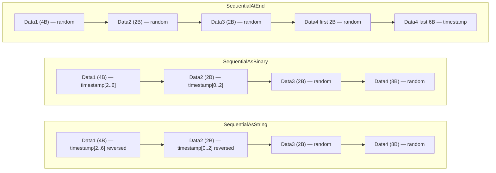
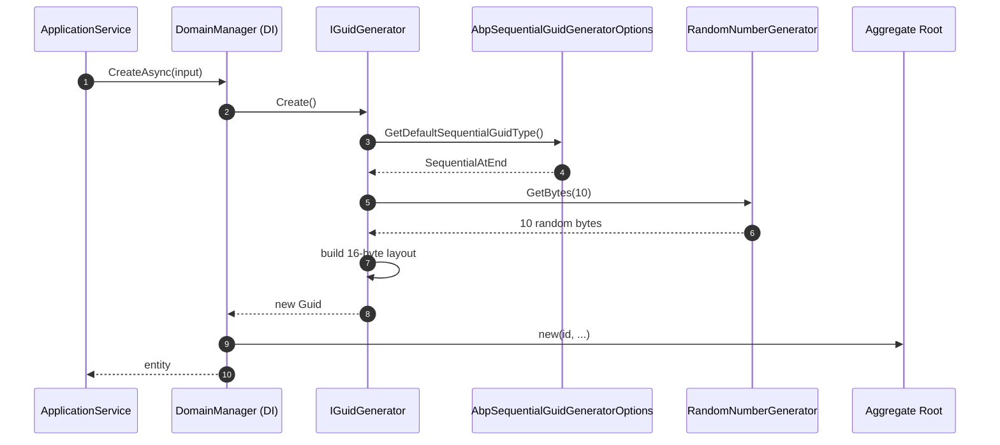

`Volo.Abp.Guids` provides the abstraction every aggregate root, repository and domain service uses to obtain new identifiers: **`IGuidGenerator`**. The default implementation, `SequentialGuidGenerator`, produces GUIDs whose binary layout starts (or ends, depending on the configured `SequentialGuidType`) with a millisecond-precision timestamp. This is what makes ABP entities cluster nicely in B-Tree indexes on SQL Server, PostgreSQL, MySQL or Oracle — without sacrificing the global uniqueness of a regular `Guid.NewGuid()` and without the network round-trip of `NEWSEQUENTIALID()`.

A non-DI fallback, `SimpleGuidGenerator.Instance`, is available for code paths that cannot resolve from the container (static helpers, attribute factories, test fixtures).

## File inventory

| File | Purpose |
| --- | --- |
| `Volo/Abp/Guids/AbpGuidsModule.cs` | Module class — empty; presence registers the conventional generator. |
| `Volo/Abp/Guids/IGuidGenerator.cs` | The 1-method contract. |
| `Volo/Abp/Guids/SequentialGuidGenerator.cs` | Default `[ITransientDependency]` implementation. |
| `Volo/Abp/Guids/SequentialGuidType.cs` | `SequentialAsString / SequentialAsBinary / SequentialAtEnd` enum. |
| `Volo/Abp/Guids/AbpSequentialGuidGeneratorOptions.cs` | Options class with `DefaultSequentialGuidType` and `GetDefaultSequentialGuidType()`. |
| `Volo/Abp/Guids/SimpleGuidGenerator.cs` | Singleton fallback using `Guid.NewGuid()`. |

## Key abstractions

| Type | Signature | Notes |
| --- | --- | --- |
| `IGuidGenerator` | `Guid Create()` | The only method. |
| `SequentialGuidGenerator` | `: IGuidGenerator, ITransientDependency` | Default; `Create()` defers to `Create(SequentialGuidType)`. |
| `SimpleGuidGenerator` | `static Instance`, `Create()` | Calls `Guid.NewGuid()`. |
| `AbpSequentialGuidGeneratorOptions` | `SequentialGuidType? DefaultSequentialGuidType { get; set; }` + `GetDefaultSequentialGuidType()` (falls back to `SequentialAtEnd`) | Configure once in the host module. |
| `SequentialGuidType` | `SequentialAsString = 0`, `SequentialAsBinary = 1`, `SequentialAtEnd = 2` | Choose based on the database. |

## The contract

```csharp
/// <summary>
/// Used to generate Ids.
/// </summary>
public interface IGuidGenerator
{
    /// <summary>
    /// Creates a new <see cref="Guid"/>.
    /// </summary>
    Guid Create();
}
```

A single method. Every aggregate root in ABP that uses GUID keys takes an `IGuidGenerator` through its constructor — either directly (when constructed via a domain service) or indirectly (when scaffolded by `EntityHelper`). Application services never call `Guid.NewGuid()`.

## `SimpleGuidGenerator`

```csharp
public class SimpleGuidGenerator : IGuidGenerator
{
    public static SimpleGuidGenerator Instance { get; } = new SimpleGuidGenerator();

    public virtual Guid Create() => Guid.NewGuid();
}
```

Two facts:

- Not registered with DI. It is a *singleton through a static field*; you reach it as `SimpleGuidGenerator.Instance`.
- Used as a fallback by framework code that runs before DI has fully booted (e.g. early bootstrap scenarios or static helpers in `Volo.Abp.Core`). Application code should depend on `IGuidGenerator` instead.

## `SequentialGuidGenerator`

```csharp
/// <summary>
/// Implements <see cref="IGuidGenerator"/> by creating sequential Guids.
/// Use <see cref="AbpSequentialGuidGeneratorOptions"/> to configure.
/// </summary>
public class SequentialGuidGenerator : IGuidGenerator, ITransientDependency
{
    public AbpSequentialGuidGeneratorOptions Options { get; }

    private static readonly RandomNumberGenerator RandomNumberGenerator = RandomNumberGenerator.Create();

    public SequentialGuidGenerator(IOptions<AbpSequentialGuidGeneratorOptions> options)
    {
        Options = options.Value;
    }

    public Guid Create()
    {
        return Create(Options.GetDefaultSequentialGuidType());
    }

    public Guid Create(SequentialGuidType guidType)
    {
        // We start with 16 bytes of cryptographically strong random data.
        var randomBytes = new byte[10];
        RandomNumberGenerator.GetBytes(randomBytes);

        // ... timestamp construction ...
        long timestamp = DateTime.UtcNow.Ticks / 10000L;

        // Then get the bytes
        byte[] timestampBytes = BitConverter.GetBytes(timestamp);

        // Since we're converting from an Int64, we have to reverse on
        // little-endian systems.
        if (BitConverter.IsLittleEndian)
        {
            Array.Reverse(timestampBytes);
        }

        byte[] guidBytes = new byte[16];

        switch (guidType)
        {
            case SequentialGuidType.SequentialAsString:
            case SequentialGuidType.SequentialAsBinary:

                // For string and byte-array version, we copy the timestamp first, followed
                // by the random data.
                Buffer.BlockCopy(timestampBytes, 2, guidBytes, 0, 6);
                Buffer.BlockCopy(randomBytes, 0, guidBytes, 6, 10);

                // If formatting as a string, we have to compensate for the fact
                // that .NET regards the Data1 and Data2 block as an Int32 and an Int16,
                // respectively.  That means that it switches the order on little-endian
                // systems.  So again, we have to reverse.
                if (guidType == SequentialGuidType.SequentialAsString && BitConverter.IsLittleEndian)
                {
                    Array.Reverse(guidBytes, 0, 4);
                    Array.Reverse(guidBytes, 4, 2);
                }

                break;

            case SequentialGuidType.SequentialAtEnd:

                // For sequential-at-the-end versions, we copy the random data first,
                // followed by the timestamp.
                Buffer.BlockCopy(randomBytes, 0, guidBytes, 0, 10);
                Buffer.BlockCopy(timestampBytes, 2, guidBytes, 10, 6);
                break;
        }

        return new Guid(guidBytes);
    }
}
```

The algorithm — adapted from the well-known [jhtodd/SequentialGuid](https://github.com/jhtodd/SequentialGuid) implementation — is worth understanding because the database your application runs on changes the *right* answer for `SequentialGuidType`.

### The three layouts



| Layout | Use with | Sorts well as |
| --- | --- | --- |
| `SequentialAsString` | MySQL, PostgreSQL | `ToString()` |
| `SequentialAsBinary` | Oracle | `ToByteArray()` (raw bytes) |
| `SequentialAtEnd` | SQL Server (default) | `ToByteArray()` in SQL Server's *internal* byte order |

The reasoning is that .NET represents a `Guid` as `(Data1: int32, Data2: int16, Data3: int16, Data4: byte[8])`. SQL Server's `uniqueidentifier` indexes by `Data4`, MySQL's `CHAR(36)` indexes by the string representation, Oracle's `RAW(16)` indexes by raw bytes. The algorithm therefore writes the timestamp into the slot the target database compares first.

### Timestamp resolution

```csharp
long timestamp = DateTime.UtcNow.Ticks / 10000L;
```

The divisor truncates 100-ns `Ticks` to milliseconds. 48-bit milliseconds since `DateTime.MinValue` give about **5900 years** of headroom before the high-order bits overflow — comfortably past anyone's retention policy. The granularity also means two `Create()` calls within the same millisecond have identical timestamp prefixes; their `Guid` ordering then depends on the 10 random bytes, which is fine for B-Tree clustering (the page write is local to the recent hot block).

### Cryptographic strength

```csharp
private static readonly RandomNumberGenerator RandomNumberGenerator = RandomNumberGenerator.Create();
```

The random bytes use `System.Security.Cryptography.RandomNumberGenerator`, not `System.Random`. The CRNG is *thread-safe* in .NET, so a single static instance is enough — there is no need for per-thread generators.

## `AbpSequentialGuidGeneratorOptions`

```csharp
public class AbpSequentialGuidGeneratorOptions
{
    /// <summary>
    /// Default value: null (unspecified).
    /// Use <see cref="GetDefaultSequentialGuidType"/> method
    /// to get the value on use, since it fall backs to a default value.
    /// </summary>
    public SequentialGuidType? DefaultSequentialGuidType { get; set; }

    /// <summary>
    /// Get the <see cref="DefaultSequentialGuidType"/> value
    /// or returns <see cref="SequentialGuidType.SequentialAtEnd"/>
    /// if <see cref="DefaultSequentialGuidType"/> was null.
    /// </summary>
    public SequentialGuidType GetDefaultSequentialGuidType()
    {
        return DefaultSequentialGuidType ?? SequentialGuidType.SequentialAtEnd;
    }
}
```

The nullable + fallback shape is deliberate: ABP's EF Core providers (`Volo.Abp.EntityFrameworkCore.SqlServer`, `Volo.Abp.EntityFrameworkCore.MySQL`, …) override the default at module-load time based on the database. The host typically does not need to set this option unless it is bypassing the provider-specific defaults.

| Provider | Sets default to |
| --- | --- |
| EF Core SqlServer | `SequentialAtEnd` (the global default anyway) |
| EF Core MySQL | `SequentialAsString` |
| EF Core PostgreSQL | `SequentialAsString` |
| EF Core Oracle | `SequentialAsBinary` |

## Module wiring

```csharp
public class AbpGuidsModule : AbpModule
{
}
```

Yes — empty. The module exists only so other modules can `[DependsOn(typeof(AbpGuidsModule))]`. Convention-based registration picks up `SequentialGuidGenerator` (it implements `ITransientDependency`) and registers it as `IGuidGenerator`.

## Configuring for a non-SqlServer database

```csharp
public override void ConfigureServices(ServiceConfigurationContext context)
{
    Configure<AbpSequentialGuidGeneratorOptions>(options =>
    {
        options.DefaultSequentialGuidType = SequentialGuidType.SequentialAsString;
    });
}
```

For MySQL hosts, this single override is what guarantees that newly inserted rows sort cleanly in clustered indexes built on the GUID column's string representation.

## Sequence: aggregate root constructor



## Why not rely on database `NEWSEQUENTIALID()`?

`SequentialGuidGenerator` runs *in process*. That gives three concrete benefits:

1. **Aggregate roots construct with their final ID.** Domain events, business-rule validators, and outbox writes can reference the GUID *before* the row is inserted.
2. **No round-trip.** Generating 1M IDs costs around 10 ms total on a modern CPU; the database does not see the GUID until `SaveChanges`.
3. **Stable across providers.** Switching from SQL Server to PostgreSQL only requires changing `AbpSequentialGuidGeneratorOptions` — domain code is unchanged.

The cost is that the GUIDs are *not* contiguous across processes, only quasi-monotonic within a process. For typical SaaS deployments this is more than enough; if you need strictly monotonic 64-bit IDs, use a snowflake-style identity generator instead.

## Replacing the implementation

```csharp
// Force the simple non-sequential generator (e.g. for unit tests that snapshot DB state)
public override void ConfigureServices(ServiceConfigurationContext context)
{
    context.Services.Replace(
        ServiceDescriptor.Transient<IGuidGenerator, NonSequentialTestGenerator>());
}

internal sealed class NonSequentialTestGenerator : IGuidGenerator
{
    public Guid Create() => Guid.NewGuid();
}
```

Most production systems should not replace the generator; the sequential algorithm is a strict superset of what you'd write yourself.

## Pitfalls

- **Time travel.** If the system clock jumps backwards (NTP correction, container migration), recently generated GUIDs may sort *after* freshly generated ones for a few seconds. This rarely matters for clustering but can show up in monitoring dashboards that order by GUID.
- **Choosing the wrong `SequentialGuidType`** silently degrades index performance — the GUIDs are still globally unique, just no longer monotonic in the database's preferred sort order. Watch for fragmentation alerts after a provider switch.
- **`Guid.Empty` is *not* generated** by `SequentialGuidGenerator`. If you've defaulted entity IDs to `Guid.Empty` and forgotten to call the generator, EF Core will complain about a duplicate primary key on the second insert.

## Related pages

- [Timing](/framework/data/timing) — `IClock.UtcNow` and how time normalization interacts with GUID generation.
- [Volo.Abp.Data](/framework/data/volo-abp-data) — the data module that depends on aggregate-root IDs being available.
