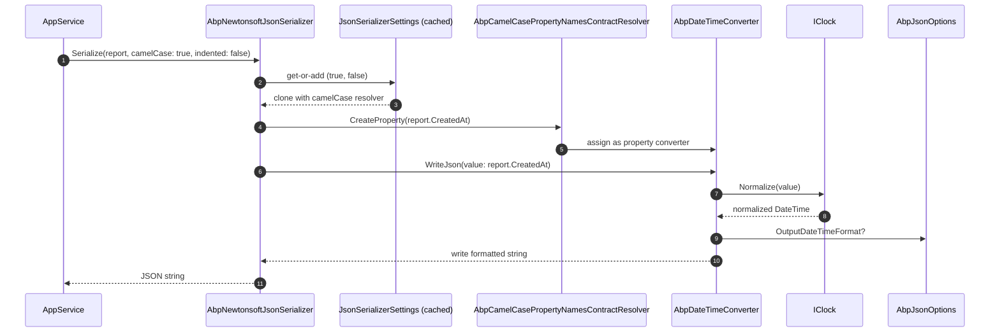

`Volo.Abp.Json.Newtonsoft` plugs *Newtonsoft.Json* (`Newtonsoft.Json.JsonConvert`) into ABP's `IJsonSerializer` abstraction. You opt into it by depending on the module instead of `AbpJsonSystemTextJsonModule`; the registration uses `[Dependency(ReplaceServices = true)]` so the System.Text.Json default is silently displaced. Three building blocks make the adapter:

1. **`AbpNewtonsoftJsonSerializer`** — implements `IJsonSerializer`, caches `JsonSerializerSettings` per `(camelCase, indented)` tuple, and forwards to `JsonConvert`.
2. **`AbpNewtonsoftJsonSerializerOptions`** — exposes the `JsonSerializerSettings` that the module's `ConfigureServices` populates. The default `ContractResolver` is `AbpCamelCasePropertyNamesContractResolver`, which routes `DateTime` properties through `AbpDateTimeConverter`.
3. **`AbpDateTimeConverter`** — a `DateTimeConverterBase` that calls `IClock.Normalize` on read and write, honours `AbpJsonOptions.InputDateTimeFormats` / `OutputDateTimeFormat`, and skips properties marked `[DisableDateTimeNormalization]`.

This page walks each one with the source code in place.

## File inventory

| File | Purpose |
| --- | --- |
| `Volo/Abp/Json/Newtonsoft/AbpJsonNewtonsoftModule.cs` | Module class. Configures `AbpNewtonsoftJsonSerializerOptions` to use the camelCase resolver. |
| `Volo/Abp/Json/Newtonsoft/AbpNewtonsoftJsonSerializer.cs` | `IJsonSerializer` adapter. Replaces the default service. |
| `Volo/Abp/Json/Newtonsoft/AbpNewtonsoftJsonSerializerOptions.cs` | Holds the `JsonSerializerSettings`. |
| `Volo/Abp/Json/Newtonsoft/AbpDateTimeConverter.cs` | `DateTimeConverterBase` that hooks `IClock`. |
| `Volo/Abp/Json/Newtonsoft/AbpCamelCasePropertyNamesContractResolver.cs` | Default resolver; rewrites property names + assigns `AbpDateTimeConverter` to DateTime members. |
| `Volo/Abp/Json/Newtonsoft/AbpDefaultContractResolver.cs` | Pascal-case sibling used when `camelCase: false`. |

## Key abstractions

| Type | Signature (excerpt) | Notes |
| --- | --- | --- |
| `AbpNewtonsoftJsonSerializer` | `[Dependency(ReplaceServices = true)]`, `: IJsonSerializer, ITransientDependency` | Caches a settings clone per `(camelCase, indented)`. |
| `AbpNewtonsoftJsonSerializerOptions` | `JsonSerializerSettings JsonSerializerSettings { get; }` | Populated in `AbpJsonNewtonsoftModule.ConfigureServices`. |
| `AbpDateTimeConverter` | `DateTimeConverterBase, ITransientDependency` | Hooks `IClock.Normalize`. Static `ShouldNormalize(MemberInfo, JsonProperty)`. |
| `AbpCamelCasePropertyNamesContractResolver` | `CamelCasePropertyNamesContractResolver` | Overrides `CreateProperty` to assign the converter. |
| `AbpDefaultContractResolver` | `DefaultContractResolver` | Pascal-case variant; same DateTime hook. |

## Module wiring

```csharp
[DependsOn(typeof(AbpJsonAbstractionsModule), typeof(AbpTimingModule))]
public class AbpJsonNewtonsoftModule : AbpModule
{
    public override void ConfigureServices(ServiceConfigurationContext context)
    {
        context.Services.AddOptions<AbpNewtonsoftJsonSerializerOptions>()
            .Configure<IServiceProvider>((options, rootServiceProvider) =>
            {
                options.JsonSerializerSettings.ContractResolver =
                    new AbpCamelCasePropertyNamesContractResolver(
                        rootServiceProvider.GetRequiredService<AbpDateTimeConverter>());
            });
    }
}
```

Two design choices:

- **Late-bound `IServiceProvider`.** Resolving `AbpDateTimeConverter` from the root service provider keeps the contract resolver alive for the lifetime of the options object — without forcing a circular dependency between the options and the converter.
- **CamelCase by default.** The resolver in `JsonSerializerSettings.ContractResolver` is `AbpCamelCasePropertyNamesContractResolver`. The `camelCase: false` overload at serialization time *replaces* the resolver with `AbpDefaultContractResolver` (Pascal case) on a per-call settings clone.

`[DependsOn(AbpJsonAbstractionsModule)]` brings in `IJsonSerializer` and `AbpJsonOptions`; `[DependsOn(AbpTimingModule)]` brings in `IClock` so the converter can normalize.

## The serializer

```csharp
[Dependency(ReplaceServices = true)]
public class AbpNewtonsoftJsonSerializer : IJsonSerializer, ITransientDependency
{
    protected IRootServiceProvider RootServiceProvider { get; }
    protected IOptions<AbpNewtonsoftJsonSerializerOptions> Options { get; }

    public AbpNewtonsoftJsonSerializer(
        IRootServiceProvider rootServiceProvider,
        IOptions<AbpNewtonsoftJsonSerializerOptions> options)
    {
        RootServiceProvider = rootServiceProvider;
        Options = options;
    }

    public string Serialize(object obj, bool camelCase = true, bool indented = false)
    {
        return JsonConvert.SerializeObject(obj, CreateJsonSerializerOptions(camelCase, indented));
    }

    public T Deserialize<T>(string jsonString, bool camelCase = true)
    {
        return JsonConvert.DeserializeObject<T>(jsonString, CreateJsonSerializerOptions(camelCase))!;
    }

    public object Deserialize(Type type, string jsonString, bool camelCase = true)
    {
        return JsonConvert.DeserializeObject(jsonString, type, CreateJsonSerializerOptions(camelCase))!;
    }
```

`[Dependency(ReplaceServices = true)]` is what makes the swap automatic — once you add `AbpJsonNewtonsoftModule` to the dependency graph, this class wins the registration race for `IJsonSerializer`.

### Per-call settings cache

```csharp
    private readonly static ConcurrentDictionary<object, JsonSerializerSettings> JsonSerializerOptionsCache =
        new ConcurrentDictionary<object, JsonSerializerSettings>();

    protected virtual JsonSerializerSettings CreateJsonSerializerOptions(bool camelCase = true, bool indented = false)
    {
        return JsonSerializerOptionsCache.GetOrAdd(new
        {
            camelCase,
            indented
        }, _ =>
        {
            var settings = new JsonSerializerSettings
            {
                Binder = Options.Value.JsonSerializerSettings.Binder,
                CheckAdditionalContent = Options.Value.JsonSerializerSettings.CheckAdditionalContent,
                // ... every property copied one-by-one ...
                TypeNameAssemblyFormatHandling = Options.Value.JsonSerializerSettings.TypeNameAssemblyFormatHandling
            };

            if (!camelCase)
            {
                //Default contract resolver is AbpCamelCasePropertyNamesContractResolver
                settings.ContractResolver = new AbpDefaultContractResolver(
                    RootServiceProvider.GetRequiredService<AbpDateTimeConverter>());
            }

            if (indented)
            {
                settings.Formatting = Formatting.Indented;
            }

            return settings;
        });
    }
}
```

Three points worth knowing:

- **The cache key is an anonymous `(camelCase, indented)` tuple.** This means only **four** distinct settings instances ever exist: `(false,false)`, `(false,true)`, `(true,false)`, `(true,true)`. Calls after the first reuse the cached clone — `JsonSerializerSettings` is mutable, so cloning is safer than sharing.
- **All properties from the configured `JsonSerializerSettings` are copied explicitly.** Newtonsoft has no built-in `Clone()`. Adding a new setting to `JsonSerializerSettings` in a future Newtonsoft release will not propagate automatically; either re-derive the serializer or call `JsonSerializerSettings.MemberwiseClone` via reflection.
- **`camelCase: false` swaps the resolver** to `AbpDefaultContractResolver`. The DateTime hook is preserved because both resolvers attach the converter in their `CreateProperty` override.

## `AbpDateTimeConverter`

```csharp
public class AbpDateTimeConverter : DateTimeConverterBase, ITransientDependency
{
    private const string DefaultDateTimeFormat = "yyyy'-'MM'-'dd'T'HH':'mm':'ss.FFFFFFFK";
    private readonly DateTimeStyles _dateTimeStyles = DateTimeStyles.RoundtripKind;
    private readonly CultureInfo _culture = CultureInfo.InvariantCulture;
    private readonly IClock _clock;
    private readonly AbpJsonOptions _options;

    public AbpDateTimeConverter(IClock clock, IOptions<AbpJsonOptions> options)
    {
        _clock = clock;
        _options = options.Value;
    }

    public override bool CanConvert(Type objectType)
    {
        return objectType == typeof(DateTime) || objectType == typeof(DateTime?);
    }

    public override object? ReadJson(JsonReader reader, Type objectType, object? existingValue, JsonSerializer serializer)
    {
        var nullable = Nullable.GetUnderlyingType(objectType) != null;
        if (reader.TokenType == JsonToken.Null)
        {
            if (!nullable)
                throw new JsonSerializationException($"Cannot convert null value to {objectType.FullName}.");
            return null;
        }

        if (reader.TokenType == JsonToken.Date)
            return _clock.Normalize(reader.Value!.To<DateTime>());

        if (reader.TokenType != JsonToken.String)
            throw new JsonSerializationException($"Unexpected token parsing date. Expected String, got {reader.TokenType}.");

        var dateText = reader.Value?.ToString();

        if (dateText.IsNullOrEmpty() && nullable)
            return null;

        if (_options.InputDateTimeFormats.Any())
        {
            foreach (var format in _options.InputDateTimeFormats)
            {
                if (DateTime.TryParseExact(dateText, format, _culture, _dateTimeStyles, out var d1))
                    return _clock.Normalize(d1);
            }
        }

        var date = DateTime.Parse(dateText!, _culture, _dateTimeStyles);
        return _clock.Normalize(date);
    }

    public override void WriteJson(JsonWriter writer, object? value, JsonSerializer serializer)
    {
        if (value != null)
            value = _clock.Normalize(value.To<DateTime>());

        if (value is DateTime dateTime)
        {
            if ((_dateTimeStyles & DateTimeStyles.AdjustToUniversal) == DateTimeStyles.AdjustToUniversal ||
                (_dateTimeStyles & DateTimeStyles.AssumeUniversal) == DateTimeStyles.AssumeUniversal)
            {
                dateTime = dateTime.ToUniversalTime();
            }

            writer.WriteValue(_options.OutputDateTimeFormat.IsNullOrWhiteSpace()
                ? dateTime.ToString(DefaultDateTimeFormat, _culture)
                : dateTime.ToString(_options.OutputDateTimeFormat, _culture));
        }
        else
        {
            throw new JsonSerializationException(
                $"Unexpected value when converting date. Expected DateTime or DateTimeOffset, got {value?.GetType()}.");
        }
    }

    static internal bool ShouldNormalize(MemberInfo member, JsonProperty property)
    {
        if (property.PropertyType != typeof(DateTime) &&
            property.PropertyType != typeof(DateTime?))
        {
            return false;
        }

        return ReflectionHelper.GetSingleAttributeOfMemberOrDeclaringTypeOrDefault<DisableDateTimeNormalizationAttribute>(member) == null;
    }
}
```

The converter has three responsibilities:

1. **Parse incoming JSON dates** in any of `AbpJsonOptions.InputDateTimeFormats`, falling back to `DateTime.Parse(_culture, RoundtripKind)`.
2. **Normalize** the parsed value through `IClock` so the in-memory `DateTime` matches `AbpClockOptions.Kind` (UTC, Local, or Unspecified).
3. **Emit** using `AbpJsonOptions.OutputDateTimeFormat` when set, else the local default `yyyy-MM-ddTHH:mm:ss.FFFFFFFK`.

`ShouldNormalize` is the opt-out check used by both contract resolvers: a class- or property-level `[DisableDateTimeNormalization]` attribute prevents the converter from being attached.

## Contract resolvers

### CamelCase (default)

```csharp
public class AbpCamelCasePropertyNamesContractResolver : CamelCasePropertyNamesContractResolver
{
    private readonly AbpDateTimeConverter _dateTimeConverter;

    public AbpCamelCasePropertyNamesContractResolver(AbpDateTimeConverter dateTimeConverter)
    {
        _dateTimeConverter = dateTimeConverter;

        NamingStrategy = new CamelCaseNamingStrategy
        {
            ProcessDictionaryKeys = false
        };
    }

    protected override JsonProperty CreateProperty(MemberInfo member, MemberSerialization memberSerialization)
    {
        var property = base.CreateProperty(member, memberSerialization);

        if (AbpDateTimeConverter.ShouldNormalize(member, property))
        {
            property.Converter = _dateTimeConverter;
        }

        return property;
    }
}
```

Two subtleties:

- **`ProcessDictionaryKeys = false`** — dictionary keys are *not* camelCased. This matches the System.Text.Json adapter's behaviour and is important when keys carry semantic meaning (Pascal-cased enum names, JSON-API IDs).
- **Per-property converter attachment.** The converter is assigned in `CreateProperty` rather than as a global setting. This is what lets `[DisableDateTimeNormalization]` work at member granularity.

### Pascal case (when `camelCase: false`)

```csharp
public class AbpDefaultContractResolver : DefaultContractResolver
{
    private readonly AbpDateTimeConverter _dateTimeConverter;

    public AbpDefaultContractResolver(AbpDateTimeConverter dateTimeConverter)
    {
        _dateTimeConverter = dateTimeConverter;
    }

    protected override JsonProperty CreateProperty(MemberInfo member, MemberSerialization memberSerialization)
    {
        var property = base.CreateProperty(member, memberSerialization);

        if (AbpDateTimeConverter.ShouldNormalize(member, property))
        {
            property.Converter = _dateTimeConverter;
        }

        return property;
    }
}
```

Same DateTime hook, no naming strategy. Used at request time when the caller passes `camelCase: false`.

## Opting in to Newtonsoft

```csharp
[DependsOn(
    typeof(AbpJsonNewtonsoftModule)  // replaces the default System.Text.Json serializer
)]
public class MyAppModule : AbpModule
{
    public override void ConfigureServices(ServiceConfigurationContext context)
    {
        Configure<AbpNewtonsoftJsonSerializerOptions>(options =>
        {
            options.JsonSerializerSettings.NullValueHandling = NullValueHandling.Ignore;
            options.JsonSerializerSettings.Converters.Add(new StringEnumConverter());
        });

        Configure<AbpJsonOptions>(options =>
        {
            options.OutputDateTimeFormat = "yyyy-MM-dd HH:mm:ss";
        });
    }
}
```

`Configure<AbpNewtonsoftJsonSerializerOptions>` mutates the *base* settings; the runtime cache invalidates implicitly because new settings clones will copy the updated values when first requested. **However**, because the cache is keyed only on `(camelCase, indented)`, mutating `AbpNewtonsoftJsonSerializerOptions` *after* the first serialization call will not update already-cached clones. If you must reconfigure after startup, restart the host or clear the static cache via reflection.

## Sequence: serializing a `DateTime` property



## Interaction with ASP.NET Core MVC

The companion package `Volo.Abp.AspNetCore.Mvc.NewtonsoftJson` adds Newtonsoft as the MVC formatter while preserving ABP's normalization. You usually depend on both: the MVC module for HTTP, this module for `IJsonSerializer`. The two cooperate transparently because both end up reading the same `AbpNewtonsoftJsonSerializerOptions.JsonSerializerSettings`.

## Pitfalls

- **Per-call cache never invalidates.** `Configure<AbpNewtonsoftJsonSerializerOptions>` after first serialization has no effect on the cached clones.
- **DateTimeOffset is not covered.** `AbpDateTimeConverter` only handles `DateTime` and `DateTime?`. Add a separate `IsoDateTimeConverter` if you need offsets normalized.
- **TypeNameHandling is off.** The default `JsonSerializerSettings` does not set `TypeNameHandling`. If you previously relied on `TypeNameHandling.All` for polymorphic deserialization, re-enable it inside the options configuration — and audit your inputs first, since `TypeNameHandling != None` is a known deserialization-attack surface.
- **`Binder` is obsolete in Newtonsoft 12+.** The serializer still copies it for backward compatibility; prefer `SerializationBinder`.

## Related pages

- [System.Text.Json adapter](/framework/data/json-systemtextjson) — the default; same contract, different machinery.
- [Volo.Abp.Json](/framework/data/json) — the contract this module implements.
- [Timing](/framework/data/timing) — `IClock.Normalize` and `[DisableDateTimeNormalization]`.
