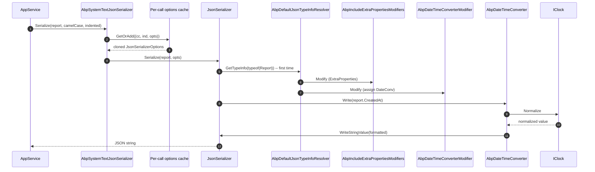

`Volo.Abp.Json.SystemTextJson` is the default implementation of `IJsonSerializer` shipped via the `Volo.Abp.Json` aggregate module. It chooses `System.Text.Json` over Newtonsoft because of throughput, AOT-friendliness, and tighter integration with .NET 7+'s `JsonTypeInfo` modifier API. The module's `ConfigureServices` configures `AbpSystemTextJsonSerializerOptions` with a Web-ready `JsonSerializerOptions`, registers a curated set of *string-to-X* converters that the wider ABP framework expects (string-as-Guid, string-as-bool, string-as-enum, polymorphic `object` deserialization), and wires `AbpDateTimeConverterModifier` through the `JsonTypeInfo` modifier pipeline so every `DateTime` property is normalized through `IClock` *without* requiring explicit `[JsonConverter]` attributes on user types.

Three files do most of the work:

- **`AbpSystemTextJsonSerializer`** — the `IJsonSerializer` adapter, with a per-`(camelCase, indented, options)` cache.
- **`AbpSystemTextJsonSerializerOptions`** — holds the `JsonSerializerOptions` (using `JsonSerializerDefaults.Web` plus `ReadCommentHandling.Skip` and `AllowTrailingCommas = true`).
- **`AbpDefaultJsonTypeInfoResolver`** — the `DefaultJsonTypeInfoResolver` subclass that applies every modifier in `AbpSystemTextJsonSerializerModifiersOptions.Modifiers`.

## File inventory

| File | Purpose |
| --- | --- |
| `Volo/Abp/Json/SystemTextJson/AbpJsonSystemTextJsonModule.cs` | Module class. Depends on `AbpJsonAbstractionsModule`, `AbpTimingModule`, `AbpDataModule`. |
| `Volo/Abp/Json/SystemTextJson/AbpSystemTextJsonSerializer.cs` | `IJsonSerializer` adapter. Caches `JsonSerializerOptions` per call signature. |
| `Volo/Abp/Json/SystemTextJson/AbpSystemTextJsonSerializerOptions.cs` | Holds the base `JsonSerializerOptions`. |
| `Volo/Abp/Json/SystemTextJson/AbpDefaultJsonTypeInfoResolver.cs` | Resolver subclass; applies every modifier. |
| `Volo/Abp/Json/SystemTextJson/AbpSystemTextJsonSerializerModifiersOptions.cs` | Holds the list of `Action<JsonTypeInfo>` modifiers. |
| `JsonConverters/AbpDateTimeConverter.cs` | `JsonConverter<DateTime>`. |
| `JsonConverters/AbpNullableDateTimeConverter.cs` | `JsonConverter<DateTime?>`. |
| `JsonConverters/AbpStringToGuidConverter.cs` | Accepts Guid in any of `N D B P X` formats. |
| `JsonConverters/AbpNullableStringToGuidConverter.cs` | Nullable variant. |
| `JsonConverters/AbpStringToBooleanConverter.cs` | Accepts "true" / "false" strings *and* booleans. |
| `JsonConverters/AbpStringToEnumFactory.cs` | `JsonConverterFactory` producing typed enum converters. |
| `JsonConverters/AbpStringToEnumConverter.cs` | Generic enum converter. |
| `JsonConverters/ObjectToInferredTypesConverter.cs` | Deserializes `object`-typed properties to their nearest CLR primitive. |
| `Modifiers/AbpDateTimeConverterModifier.cs` | Assigns `AbpDateTimeConverter` to every `DateTime` property unless `[DisableDateTimeNormalization]`. |
| `Modifiers/AbpIgnorePropertiesModifiers.cs` | Hooks `[JsonIgnore]`-style behaviour for derived contexts. |
| `Modifiers/AbpIncludeExtraPropertiesModifiers.cs` | Makes `IHasExtraProperties.ExtraProperties` writable even when its setter is protected. |
| `Modifiers/AbpIncludeNonPublicPropertiesModifiers.cs` | Allows non-public properties to round-trip. |

## Key abstractions

| Type | Signature | Notes |
| --- | --- | --- |
| `AbpSystemTextJsonSerializer` | `: IJsonSerializer, ITransientDependency` | Caches per `(camelCase, indented, options)` triple. |
| `AbpSystemTextJsonSerializerOptions` | `JsonSerializerOptions JsonSerializerOptions { get; }` | Initialized with `JsonSerializerDefaults.Web`. |
| `AbpSystemTextJsonSerializerModifiersOptions` | `List<Action<JsonTypeInfo>> Modifiers { get; }` | Includes `AbpIncludeExtraPropertiesModifiers.Modify` by default. |
| `AbpDefaultJsonTypeInfoResolver` | `: DefaultJsonTypeInfoResolver` | Adds every configured modifier to its `Modifiers` list. |
| `AbpDateTimeConverter` | `JsonConverter<DateTime>, ITransientDependency` | Uses `IClock` + `AbpJsonOptions`. |

## Module wiring

```csharp
[DependsOn(typeof(AbpJsonAbstractionsModule), typeof(AbpTimingModule), typeof(AbpDataModule))]
public class AbpJsonSystemTextJsonModule : AbpModule
{
    public override void ConfigureServices(ServiceConfigurationContext context)
    {
        context.Services.AddOptions<AbpSystemTextJsonSerializerOptions>()
            .Configure<IServiceProvider>((options, rootServiceProvider) =>
            {
                // If the user hasn't explicitly configured the encoder, use the less strict encoder that does not encode all non-ASCII characters.
                options.JsonSerializerOptions.Encoder ??= JavaScriptEncoder.UnsafeRelaxedJsonEscaping;

                options.JsonSerializerOptions.Converters.Add(new AbpStringToEnumFactory());
                options.JsonSerializerOptions.Converters.Add(new AbpStringToBooleanConverter());
                options.JsonSerializerOptions.Converters.Add(new AbpStringToGuidConverter());
                options.JsonSerializerOptions.Converters.Add(new AbpNullableStringToGuidConverter());
                options.JsonSerializerOptions.Converters.Add(new ObjectToInferredTypesConverter());

                options.JsonSerializerOptions.TypeInfoResolver = new AbpDefaultJsonTypeInfoResolver(rootServiceProvider
                    .GetRequiredService<IOptions<AbpSystemTextJsonSerializerModifiersOptions>>());
            });

        context.Services.AddOptions<AbpSystemTextJsonSerializerModifiersOptions>()
            .Configure<IServiceProvider>((options, rootServiceProvider) =>
            {
                options.Modifiers.Add(new AbpDateTimeConverterModifier().CreateModifyAction(rootServiceProvider));
            });
    }
}
```

The configuration is one of the most consequential parts of ABP because it shapes the wire format of every JSON response across the entire framework. Three things to internalize:

1. **`JavaScriptEncoder.UnsafeRelaxedJsonEscaping`** is the default. Non-ASCII characters (CJK, emoji, math symbols) are emitted verbatim instead of being `\uXXXX`-escaped. This is what users expect from modern Web APIs and keeps payload sizes reasonable. You can override by setting `options.JsonSerializerOptions.Encoder` to a stricter encoder before this configurator runs.
2. **Five custom converters are unconditionally added.** The first four are *lenient string-to-X* converters: they make ABP's HTTP APIs tolerate `"true"` / `"42"` / GUID strings in any of the five Guid formats / enum names as strings. The fifth, `ObjectToInferredTypesConverter`, fixes the long-standing System.Text.Json quirk where `object`-typed properties deserialize to `JsonElement` instead of an actual primitive.
3. **`TypeInfoResolver` is replaced** by `AbpDefaultJsonTypeInfoResolver`. This is the .NET 7+ replacement for `JsonConverter` factories with cross-cutting behaviour. It hosts the `AbpDateTimeConverterModifier` (and any other modifier you register) and runs them as part of building the `JsonTypeInfo` for each type.

## The serializer

```csharp
public class AbpSystemTextJsonSerializer : IJsonSerializer, ITransientDependency
{
    protected AbpSystemTextJsonSerializerOptions Options { get; }

    public AbpSystemTextJsonSerializer(IOptions<AbpSystemTextJsonSerializerOptions> options)
    {
        Options = options.Value;
    }

    public string Serialize(object obj, bool camelCase = true, bool indented = false)
    {
        return JsonSerializer.Serialize(obj, CreateJsonSerializerOptions(camelCase, indented));
    }

    public T Deserialize<T>(string jsonString, bool camelCase = true)
    {
        return JsonSerializer.Deserialize<T>(jsonString, CreateJsonSerializerOptions(camelCase))!;
    }

    public object Deserialize(Type type, string jsonString, bool camelCase = true)
    {
        return JsonSerializer.Deserialize(jsonString, type, CreateJsonSerializerOptions(camelCase))!;
    }

    private static readonly ConcurrentDictionary<object, JsonSerializerOptions> JsonSerializerOptionsCache =
        new ConcurrentDictionary<object, JsonSerializerOptions>();

    protected virtual JsonSerializerOptions CreateJsonSerializerOptions(bool camelCase = true, bool indented = false)
    {
        return JsonSerializerOptionsCache.GetOrAdd(new
        {
            camelCase,
            indented,
            Options.JsonSerializerOptions
        }, _ =>
        {
            var settings = new JsonSerializerOptions(Options.JsonSerializerOptions);

            if (camelCase)
            {
                settings.PropertyNamingPolicy = JsonNamingPolicy.CamelCase;
            }

            if (indented)
            {
                settings.WriteIndented = true;
            }

            return settings;
        });
    }
}
```

The cache key intentionally includes `Options.JsonSerializerOptions` (the reference, not a clone). This means that if the host module replaces the entire options reference at startup, the cache automatically invalidates. Mutating individual properties on the existing reference *will not* invalidate it — same caveat as the Newtonsoft adapter.

`JsonSerializerOptions` is constructed with a *copy constructor*, which is the System.Text.Json-blessed way of cloning. The cloned options inherit converters and the configured `TypeInfoResolver`, so DateTime normalization keeps working on the cached clone.

## `AbpSystemTextJsonSerializerOptions`

```csharp
public class AbpSystemTextJsonSerializerOptions
{
    public JsonSerializerOptions JsonSerializerOptions { get; }

    public AbpSystemTextJsonSerializerOptions()
    {
        JsonSerializerOptions = new JsonSerializerOptions(JsonSerializerDefaults.Web)
        {
            ReadCommentHandling = JsonCommentHandling.Skip,
            AllowTrailingCommas = true
        };
    }
}
```

`JsonSerializerDefaults.Web` gives you `PropertyNameCaseInsensitive = true`, `PropertyNamingPolicy = CamelCase`, and `NumberHandling = AllowReadingFromString`. ABP adds two more tolerances: skip `//` and `/* */` comments, and accept trailing commas. Combined, the result is a serializer that *forgives* hand-edited or JSONC inputs typical of configuration files.

## The string-tolerant converters

### `AbpStringToBooleanConverter`

```csharp
public class AbpStringToBooleanConverter : JsonConverter<bool>
{
    public override bool Read(ref Utf8JsonReader reader, Type typeToConvert, JsonSerializerOptions options)
    {
        if (reader.TokenType == JsonTokenType.String)
        {
            var span = reader.HasValueSequence ? reader.ValueSequence.ToArray() : reader.ValueSpan;
            if (Utf8Parser.TryParse(span, out bool b1, out var bytesConsumed) && span.Length == bytesConsumed)
                return b1;

            if (bool.TryParse(reader.GetString(), out var b2))
                return b2;
        }

        return reader.GetBoolean();
    }

    public override void Write(Utf8JsonWriter writer, bool value, JsonSerializerOptions options)
    {
        writer.WriteBooleanValue(value);
    }
}
```

`Utf8Parser.TryParse` is a fast path that avoids materializing the string. Falls through to `bool.TryParse` for non-ASCII corner cases.

### `AbpStringToGuidConverter`

```csharp
public class AbpStringToGuidConverter : JsonConverter<Guid>
{
    public override Guid Read(ref Utf8JsonReader reader, Type typeToConvert, JsonSerializerOptions options)
    {
        if (reader.TokenType == JsonTokenType.String)
        {
            var guidString = reader.GetString();
            string[] formats = { "N", "D", "B", "P", "X" };
            foreach (var format in formats)
            {
                if (Guid.TryParseExact(guidString, format, out var guid))
                    return guid;
            }
        }

        return reader.GetGuid();
    }

    public override void Write(Utf8JsonWriter writer, Guid value, JsonSerializerOptions options)
    {
        writer.WriteStringValue(value);
    }
}
```

`AbpNullableStringToGuidConverter` is identical except for the nullable return type and an explicit `WriteNullValue`. Together they accept all five `Guid` string formats; the underlying `JsonSerializer.Deserialize<Guid>` is the fallback.

### Enum factory

```csharp
public class AbpStringToEnumFactory : JsonConverterFactory
{
    public override bool CanConvert(Type typeToConvert) => typeToConvert.IsEnum;

    public override JsonConverter CreateConverter(Type typeToConvert, JsonSerializerOptions options)
    {
        return (JsonConverter)Activator.CreateInstance(
            typeof(AbpStringToEnumConverter<>).MakeGenericType(typeToConvert),
            BindingFlags.Instance | BindingFlags.Public,
            binder: null,
            new object?[] { _namingPolicy, _allowIntegerValues },
            culture: null)!;
    }
}
```

…and the generic converter delegates to the built-in `JsonStringEnumConverter` after stripping the factory from the chain (so reading a polymorphic enum field doesn't recurse forever):

```csharp
public class AbpStringToEnumConverter<T> : JsonConverter<T> where T : struct, Enum
{
    public override T Read(ref Utf8JsonReader reader, Type typeToConvert, JsonSerializerOptions options)
    {
        _readJsonSerializerOptions ??= JsonSerializerOptionsHelper.Create(options, x =>
                x == this ||
                x.GetType() == typeof(AbpStringToEnumFactory),
            _innerJsonStringEnumConverter.CreateConverter(typeToConvert, options));

        return JsonSerializer.Deserialize<T>(ref reader, _readJsonSerializerOptions);
    }

    public override T ReadAsPropertyName(ref Utf8JsonReader reader, Type typeToConvert, JsonSerializerOptions options)
    {
        return (T)Enum.Parse(typeToConvert, reader.GetString()!);
    }

    public override void WriteAsPropertyName(Utf8JsonWriter writer, T value, JsonSerializerOptions options)
    {
        writer.WritePropertyName(Enum.GetName(typeof(T), value)!);
    }
}
```

`ReadAsPropertyName` / `WriteAsPropertyName` matter when an enum is used as a `Dictionary` key — System.Text.Json calls these methods rather than the value reader/writer.

### `ObjectToInferredTypesConverter`

```csharp
public class ObjectToInferredTypesConverter : JsonConverter<object>
{
    public override object Read(
        ref Utf8JsonReader reader,
        Type typeToConvert,
        JsonSerializerOptions options) => (reader.TokenType switch
    {
        JsonTokenType.True => true,
        JsonTokenType.False => false,
        JsonTokenType.Number when reader.TryGetInt64(out long l) => l,
        JsonTokenType.Number => reader.GetDouble(),
        JsonTokenType.String when reader.TryGetDateTime(out DateTime datetime) => datetime,
        JsonTokenType.String => reader.GetString(),
        _ => JsonDocument.ParseValue(ref reader).RootElement.Clone()
    })!;

    public override void Write(Utf8JsonWriter writer, object objectToWrite, JsonSerializerOptions options)
        => JsonSerializer.Serialize(writer, objectToWrite, objectToWrite.GetType(), options);
}
```

The link in the class's XML doc points to the Microsoft documentation that originated the pattern. Without this converter, `object`-typed fields (a `Dictionary<string, object?>` like `ExtraProperties`) deserialize to `JsonElement`, which is rarely what business code wants.

## DateTime via TypeInfo modifier

```csharp
public class AbpDateTimeConverterModifier
{
    private IServiceProvider _serviceProvider = default!;

    public Action<JsonTypeInfo> CreateModifyAction(IServiceProvider serviceProvider)
    {
        _serviceProvider = serviceProvider;
        return Modify;
    }

    private void Modify(JsonTypeInfo jsonTypeInfo)
    {
        if (ReflectionHelper.GetAttributesOfMemberOrDeclaringType<DisableDateTimeNormalizationAttribute>(jsonTypeInfo.Type).Any())
            return;

        foreach (var property in jsonTypeInfo.Properties.Where(x => x.PropertyType == typeof(DateTime) || x.PropertyType == typeof(DateTime?)))
        {
            if (property.AttributeProvider == null ||
                !property.AttributeProvider.GetCustomAttributes(typeof(DisableDateTimeNormalizationAttribute), false).Any())
            {
                property.CustomConverter = property.PropertyType == typeof(DateTime)
                    ? _serviceProvider.GetRequiredService<AbpDateTimeConverter>()
                    : _serviceProvider.GetRequiredService<AbpNullableDateTimeConverter>();
            }
        }
    }
}
```

The modifier hands the *correct* converter (`AbpDateTimeConverter` or `AbpNullableDateTimeConverter`) to every `DateTime`/`DateTime?` property — but skips properties or whole types annotated with `[DisableDateTimeNormalization]`. This is how `IClock.Normalize` is applied **without** annotating user types: STJ calls the modifier when it first builds `JsonTypeInfo` for the type, and the resulting `CustomConverter` is reused for every subsequent serialization.

### `AbpDateTimeConverter` and its nullable sibling

```csharp
public class AbpDateTimeConverter : JsonConverter<DateTime>, ITransientDependency
{
    private readonly IClock _clock;
    private readonly AbpJsonOptions _options;

    public override DateTime Read(ref Utf8JsonReader reader, Type typeToConvert, JsonSerializerOptions options)
    {
        if (_options.InputDateTimeFormats.Any())
        {
            if (reader.TokenType == JsonTokenType.String)
            {
                foreach (var format in _options.InputDateTimeFormats)
                {
                    var s = reader.GetString();
                    if (DateTime.TryParseExact(s, format, CultureInfo.CurrentUICulture, DateTimeStyles.None, out var d1))
                        return _clock.Normalize(d1);
                }
            }
            else
            {
                throw new JsonException("Reader's TokenType is not String!");
            }
        }

        if (reader.TryGetDateTime(out var d3))
            return _clock.Normalize(d3);

        throw new JsonException("Can't get datetime from the reader!");
    }

    public override void Write(Utf8JsonWriter writer, DateTime value, JsonSerializerOptions options)
    {
        if (_options.OutputDateTimeFormat.IsNullOrWhiteSpace())
            writer.WriteStringValue(_clock.Normalize(value));
        else
            writer.WriteStringValue(_clock.Normalize(value).ToString(_options.OutputDateTimeFormat, CultureInfo.CurrentUICulture));
    }
}
```

Same `AbpJsonOptions` contract as the Newtonsoft adapter:

- `InputDateTimeFormats` is tried first (`TryParseExact` per format). Throws when a non-string token arrives but a custom input format is registered — STJ users get a fast failure rather than a silent fallback.
- `OutputDateTimeFormat` controls write; empty falls back to STJ's built-in ISO-8601 writer.

`AbpNullableDateTimeConverter` follows the same logic and gracefully emits `WriteNullValue` for nulls.

## ExtraProperties modifier

```csharp
public static class AbpIncludeExtraPropertiesModifiers
{
    public static void Modify(JsonTypeInfo jsonTypeInfo)
    {
        if (typeof(IHasExtraProperties).IsAssignableFrom(jsonTypeInfo.Type))
        {
            var propertyJsonInfo = jsonTypeInfo.Properties
                .Where(x => x.AttributeProvider is MemberInfo)
                .FirstOrDefault(x =>
                    x.PropertyType == typeof(ExtraPropertyDictionary) &&
                    x.AttributeProvider!.As<MemberInfo>().Name == nameof(ExtensibleObject.ExtraProperties) &&
                    x.Set == null);

            if (propertyJsonInfo != null)
            {
                propertyJsonInfo.Set = (obj, value) =>
                {
                    ObjectHelper.TrySetProperty(obj.As<IHasExtraProperties>(), x => x.ExtraProperties, () => value);
                };
            }
        }
    }
}
```

The problem this solves is subtle: `ExtensibleObject.ExtraProperties` has a *protected* setter so business code can't replace the dictionary wholesale. System.Text.Json's `JsonTypeInfo` only sees public setters, which means `ExtraProperties` round-trips as **read-only** by default — incoming JSON values are ignored. The modifier installs a `Set` delegate that reaches the protected setter via reflection (`ObjectHelper.TrySetProperty`), restoring round-trip semantics without weakening the surface API.

This modifier is included unconditionally in the default `Modifiers` list:

```csharp
public class AbpSystemTextJsonSerializerModifiersOptions
{
    public List<Action<JsonTypeInfo>> Modifiers { get; }

    public AbpSystemTextJsonSerializerModifiersOptions()
    {
        Modifiers = new List<Action<JsonTypeInfo>>
        {
            AbpIncludeExtraPropertiesModifiers.Modify,
        };
    }
}
```

…and the DateTime modifier is *appended* by the module's `Configure<AbpSystemTextJsonSerializerModifiersOptions>` call (because it needs `IServiceProvider`).

## The default resolver

```csharp
public class AbpDefaultJsonTypeInfoResolver : DefaultJsonTypeInfoResolver
{
    public AbpDefaultJsonTypeInfoResolver(IOptions<AbpSystemTextJsonSerializerModifiersOptions> options)
    {
        foreach (var modifier in options.Value.Modifiers)
        {
            Modifiers.Add(modifier);
        }
    }
}
```

Trivial subclass: every configured modifier becomes part of the `JsonTypeInfo` pipeline that STJ runs when it first encounters a type. Modifier order matters — `AbpIncludeExtraPropertiesModifiers.Modify` runs first, then `AbpDateTimeConverterModifier.Modify`, then whatever you append.

## End-to-end sequence



## Customizing

```csharp
public override void ConfigureServices(ServiceConfigurationContext context)
{
    Configure<AbpSystemTextJsonSerializerOptions>(options =>
    {
        options.JsonSerializerOptions.DefaultIgnoreCondition =
            JsonIgnoreCondition.WhenWritingNull;
        options.JsonSerializerOptions.NumberHandling =
            JsonNumberHandling.AllowReadingFromString;
    });

    Configure<AbpSystemTextJsonSerializerModifiersOptions>(options =>
    {
        options.Modifiers.Add(myCustomModifier);
    });
}
```

Modifiers are evaluated in *registration order*, so a modifier added after `AbpDateTimeConverterModifier` can replace the converter on a specific property.

## Pitfalls

- **Per-call cache never invalidates on property mutations.** Replace the entire `JsonSerializerOptions` reference if you must reconfigure post-startup.
- **AOT compatibility.** `AbpStringToEnumFactory` uses `Activator.CreateInstance(MakeGenericType)` — keep that in mind for the trimming/AOT story; the closed generics need to be preserved.
- **Reading `DateTimeOffset`** is not normalized by `AbpDateTimeConverterModifier`. Add a separate `JsonConverter<DateTimeOffset>` if you need offset normalization.
- **Modifier ordering.** `AbpIncludeExtraPropertiesModifiers.Modify` *must* run before any modifier that examines property setters; the default order is already correct.

## Related pages

- [Volo.Abp.Json (contract)](/framework/data/json) — the shared `IJsonSerializer` API.
- [Newtonsoft adapter](/framework/data/json-newtonsoft) — the alternative implementation.
- [Object Extending](/framework/data/object-extending) — defines `IHasExtraProperties` and the dictionary the modifier fixes up.
- [Timing](/framework/data/timing) — `IClock`, `AbpClockOptions.Kind`, `[DisableDateTimeNormalization]`.
