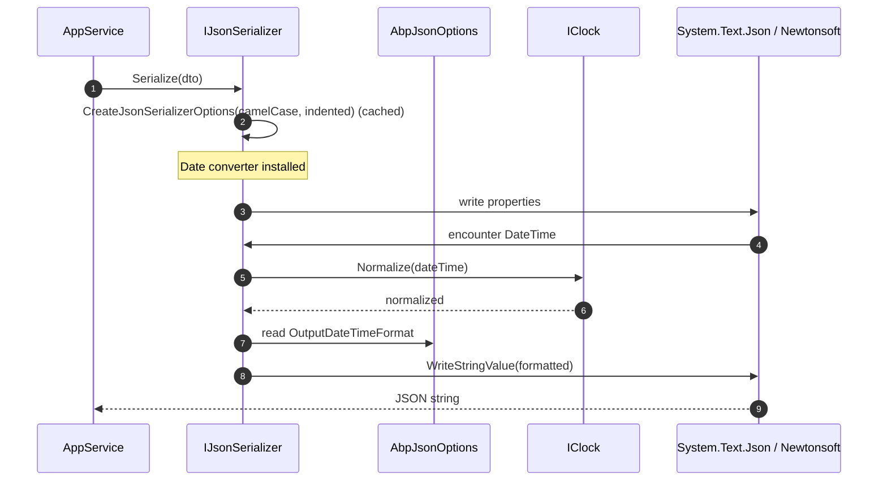

`Volo.Abp.Json` is the public, library-agnostic contract for JSON serialization across the ABP framework. Application code injects `IJsonSerializer` and never depends on `System.Text.Json` or `Newtonsoft.Json` directly. The package itself is split into three modules:

- **`Volo.Abp.Json.Abstractions`** — defines `IJsonSerializer`, `AbpJsonOptions`, and an empty module class. No implementation. This is what you reference from a pure shared library.
- **`Volo.Abp.Json`** — the *aggregate* module. It depends on `Volo.Abp.Json.SystemTextJson`, which is the default `IJsonSerializer` provider. Reference this in apps that want JSON support out of the box.
- **`Volo.Abp.Json.SystemTextJson`** and **`Volo.Abp.Json.Newtonsoft`** — concrete implementations. See [System.Text.Json](./json-systemtextjson) and [Newtonsoft.Json](./json-newtonsoft).

`IJsonSerializer` exposes three operations: `Serialize`, `Deserialize<T>`, and a `Deserialize(Type, string)` overload for reflective callers. Both adapters honour two pieces of ambient configuration:

- `AbpJsonOptions.InputDateTimeFormats` — accepted formats when reading dates.
- `AbpJsonOptions.OutputDateTimeFormat` — fixed format when writing them.

…and both delegate `DateTime` normalization to `IClock` from `Volo.Abp.Timing`, so a serializer is *aware* of whether the host runs in UTC, Local or Unspecified mode.

## File inventory

| File | Module | Purpose |
| --- | --- | --- |
| `Volo.Abp.Json.Abstractions/Volo/Abp/Json/IJsonSerializer.cs` | Abstractions | The 3-method contract. |
| `Volo.Abp.Json.Abstractions/Volo/Abp/Json/AbpJsonOptions.cs` | Abstractions | `InputDateTimeFormats`, `OutputDateTimeFormat`. |
| `Volo.Abp.Json.Abstractions/Volo/Abp/Json/AbpJsonAbstractionsModule.cs` | Abstractions | Empty module class. |
| `Volo.Abp.Json/Volo/Abp/Json/AbpJsonModule.cs` | Default | `[DependsOn(typeof(AbpJsonSystemTextJsonModule))]` aggregate. |
| `Volo.Abp.Json.SystemTextJson/...` | STJ adapter | Default implementation (see linked page). |
| `Volo.Abp.Json.Newtonsoft/...` | NSJ adapter | Replacement implementation (see linked page). |

## Key abstractions

| Type | Signature | Notes |
| --- | --- | --- |
| `IJsonSerializer` | `string Serialize(object obj, bool camelCase = true, bool indented = false)`<br/>`T Deserialize<T>(string jsonString, bool camelCase = true)`<br/>`object Deserialize(Type type, string jsonString, bool camelCase = true)` | Camel-case default = true, matches the AspNetCore Web defaults. |
| `AbpJsonOptions` | `List<string> InputDateTimeFormats`, `string? OutputDateTimeFormat` | Ambient options consulted by both adapters. |

## The contract

```csharp
namespace Volo.Abp.Json;

public interface IJsonSerializer
{
    string Serialize(object obj, bool camelCase = true, bool indented = false);

    T Deserialize<T>(string jsonString, bool camelCase = true);

    object Deserialize(Type type, string jsonString, bool camelCase = true);
}
```

A few design choices to internalize:

- **`camelCase` is a per-call switch.** The default `true` matches AspNetCore Web defaults and the `Volo.Abp.AspNetCore.Mvc` JSON output. Passing `false` returns Pascal-case JSON — useful when interoperating with legacy systems or producing snapshots whose keys must match CLR property names.
- **`indented` toggles pretty-printing.** This is on the *call site* rather than `AbpJsonOptions` because the same application typically needs both compact (HTTP) and pretty (debug logs) output.
- **`Deserialize(Type, string)` is *not* a generic helper around `Deserialize<T>`.** The reflective overload exists because both underlying libraries (`System.Text.Json` and `Newtonsoft.Json`) implement deserialization more efficiently when given a `Type` directly. ABP forwards the argument without an extra `MakeGenericMethod`/`Invoke` round-trip.

## `AbpJsonOptions`

```csharp
public class AbpJsonOptions
{
    /// <summary>
    /// Formats of input JSON date, Empty string means default format.
    /// </summary>
    public List<string> InputDateTimeFormats { get; set; }

    /// <summary>
    /// Format of output json date, Null or empty string means default format.
    /// </summary>
    public string? OutputDateTimeFormat { get; set; }

    public AbpJsonOptions()
    {
        InputDateTimeFormats = new List<string>();
    }
}
```

Two notes:

- **Input formats are a list, not a single string.** Both adapters iterate the list and accept the first format that successfully parses; this is important for round-tripping data produced by clients with different `DateTime` conventions.
- **`OutputDateTimeFormat` is a single nullable string.** When `null` or whitespace, each adapter falls back to its own *default* — Newtonsoft uses `"yyyy'-'MM'-'dd'T'HH':'mm':'ss.FFFFFFFK"`, System.Text.Json uses the built-in ISO-8601 writer.

Both adapters route every parsed value through `IClock.Normalize`, so the kind of the emitted `DateTime` always matches `AbpClockOptions.Kind`. See [Timing](./timing) for the contract.

## The default aggregate module

```csharp
using Volo.Abp.Json.SystemTextJson;
using Volo.Abp.Modularity;

namespace Volo.Abp.Json;

[DependsOn(typeof(AbpJsonSystemTextJsonModule))]
public class AbpJsonModule : AbpModule
{

}
```

The aggregate is intentionally empty. Its only job is to drag in `AbpJsonSystemTextJsonModule`, which:

- Registers `AbpSystemTextJsonSerializer` (the `IJsonSerializer` implementation).
- Configures `AbpSystemTextJsonSerializerOptions` with sensible Web defaults plus ABP's custom converters (`AbpStringToBooleanConverter`, `AbpStringToGuidConverter`, `AbpStringToEnumFactory`, `ObjectToInferredTypesConverter`).
- Installs `AbpDefaultJsonTypeInfoResolver` so DateTime modifiers (`AbpDateTimeConverterModifier`) apply to all serialized types.

If you need Newtonsoft instead — typically for HTTP compatibility with classic ABP.NET Zero clients — you replace the dependency with `AbpJsonNewtonsoftModule`. See [the Newtonsoft adapter page](./json-newtonsoft).

## The two adapters at a glance

| Concern | System.Text.Json (default) | Newtonsoft.Json |
| --- | --- | --- |
| `IJsonSerializer` impl | `AbpSystemTextJsonSerializer` | `AbpNewtonsoftJsonSerializer` |
| Options object | `AbpSystemTextJsonSerializerOptions` | `AbpNewtonsoftJsonSerializerOptions` |
| Per-call caching | `ConcurrentDictionary<object, JsonSerializerOptions>` keyed on `(camelCase, indented, options)` | `ConcurrentDictionary<object, JsonSerializerSettings>` keyed on `(camelCase, indented)` |
| DateTime hook | `AbpDateTimeConverter` (JsonConverter), driven by `AbpDateTimeConverterModifier` | `AbpDateTimeConverter : DateTimeConverterBase` |
| Extensibility | `AbpDefaultJsonTypeInfoResolver` + modifiers list | `IContractResolver` (camelCase + default variants) |
| Throws on missing converter | No — relies on TypeInfo modifiers | No — converter is added as a default to `JsonSerializerSettings` |
| Encoder | `JavaScriptEncoder.UnsafeRelaxedJsonEscaping` (configurable) | Defaults from Newtonsoft |
| Module dependencies | `AbpJsonAbstractionsModule`, `AbpTimingModule`, `AbpDataModule` | `AbpJsonAbstractionsModule`, `AbpTimingModule` |

Both adapters honour `AbpJsonOptions.InputDateTimeFormats` and `OutputDateTimeFormat`, both route through `IClock.Normalize`, and both honour `[DisableDateTimeNormalization]` to opt-out specific properties.

## Picking between camelCase / Pascal at runtime

```csharp
public class ReportExporter
{
    private readonly IJsonSerializer _json;

    public ReportExporter(IJsonSerializer json) { _json = json; }

    // Used by the public REST API
    public string ToApi(object report) => _json.Serialize(report);                    // camelCase, compact

    // Used by the audit log
    public string ToLog(object report) => _json.Serialize(report, indented: true);    // camelCase, pretty

    // Used to round-trip with a legacy on-prem importer
    public string ToLegacy(object report) => _json.Serialize(report, camelCase: false); // Pascal, compact
}
```

Each adapter caches the resulting `JsonSerializerOptions` / `JsonSerializerSettings` per `(camelCase, indented)` tuple, so repeated calls are essentially free.

## Configuring date formats

```csharp
public override void ConfigureServices(ServiceConfigurationContext context)
{
    Configure<AbpJsonOptions>(options =>
    {
        // Accept any of these on input
        options.InputDateTimeFormats.Add("yyyy-MM-ddTHH:mm:ssK");
        options.InputDateTimeFormats.Add("dd/MM/yyyy HH:mm");

        // Always emit this format
        options.OutputDateTimeFormat = "yyyy-MM-dd HH:mm:ss";
    });
}
```

Both adapters consult `_options.InputDateTimeFormats.Any()` *first*; if any format succeeds, the parsed value is returned. Otherwise they fall back to the library's own date parser (`reader.TryGetDateTime` on STJ, `DateTime.Parse` on Newtonsoft). Output mirror: if `OutputDateTimeFormat` is non-empty, that format wins; otherwise the library default is used.

## Sequence: a typical serialize call



## When to use what

- **Inside services, never reach for `JsonSerializer.Serialize` or `JsonConvert.SerializeObject` directly.** Inject `IJsonSerializer`. This keeps your module library-agnostic and ensures DateTime normalization and ABP's custom converters apply.
- **For binary persistence** (cache values, blobs, event-bus payloads), use [`IObjectSerializer`](./serialization). The two abstractions have different contracts on purpose.
- **For HTTP response serialization** in ASP.NET Core MVC, the `Volo.Abp.AspNetCore.Mvc` and `Volo.Abp.AspNetCore.Mvc.NewtonsoftJson` packages install matching JSON formatters; you usually don't call `IJsonSerializer` from a controller.

## What this module does *not* contain

- It does **not** ship an `AbpHybridJsonSerializer`. The README of older ABP releases mentions hybrid serialization that falls back between System.Text.Json and Newtonsoft; current versions take the explicit-replacement approach instead — register the adapter you want and stick with it.
- It does **not** define an `IObjectSerializer` adapter for free. If you need *bytes* from JSON, wrap your `IJsonSerializer` in a custom `IObjectSerializer<T>` implementation. See [Serialization](./serialization).

## Related pages

- [System.Text.Json adapter](./json-systemtextjson) — the default implementation and its converters.
- [Newtonsoft.Json adapter](./json-newtonsoft) — drop-in replacement using `JsonConvert`.
- [Serialization](./serialization) — the byte-oriented sibling abstraction.
- [Timing](./timing) — `IClock`, the normalization source.
