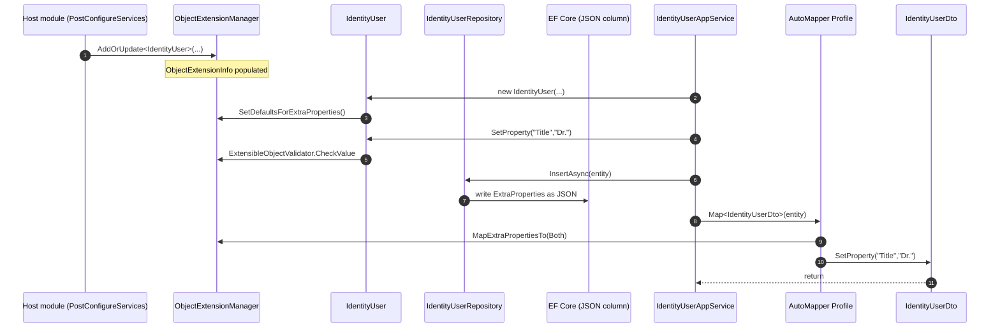

ABP's *Object Extending* system is the framework's answer to **schemaless extension** — adding a new property to an entity (e.g. a `SocialSecurityNumber` on `IdentityUser`) without modifying the source code of the owning module. Modules that participate publish an `IHasExtraProperties` surface; the host or another module *configures* extra properties at startup via `ObjectExtensionManager`; and three mapping helpers (`ExtensibleObjectMapper`, `MapExtraProperties` AutoMapper extension, EF Core conversion hooks) shuttle the values between entity, DTO, JSON column and HTTP API request.

The contract is intentionally lightweight: a `Dictionary<string, object?>` plus a typed lookup table. The persistence layer is responsible for writing the dictionary to a JSON column or shadow columns; the API layer (`Volo.Abp.AspNetCore.Mvc.ObjectExtending`) is responsible for surfacing the same fields in OpenAPI; the validation layer raises `AbpValidationException` if a write violates a registered validator.

## File inventory

| File | Purpose |
| --- | --- |
| `Volo/Abp/Data/IHasExtraProperties.cs` | The marker — any class exposing `ExtraProperties`. |
| `Volo/Abp/Data/ExtraPropertyDictionary.cs` | `Dictionary<string,object?>` subtype tagged `[Serializable]`. |
| `Volo/Abp/Data/ExtraPropertyDictionaryExtensions.cs` | Typed `GetOrDefault<T>` helpers. |
| `Volo/Abp/Data/HasExtraPropertiesExtensions.cs` | `GetProperty<T>`, `SetProperty`, `RemoveProperty`, `SetDefaultsForExtraProperties`. |
| `Volo/Abp/ObjectExtending/ObjectExtensionManager.cs` | Static registry of `ObjectExtensionInfo` per type. |
| `Volo/Abp/ObjectExtending/ObjectExtensionInfo.cs` | Per-type property catalogue. |
| `Volo/Abp/ObjectExtending/ObjectExtensionPropertyInfo.cs` | Property metadata: name, type, attributes, defaults, validators, UI/lookup. |
| `Volo/Abp/ObjectExtending/ExtensibleObject.cs` | Convenience base class implementing `IHasExtraProperties` + `IValidatableObject`. |
| `Volo/Abp/ObjectExtending/ExtensibleObjectMapper.cs` | Copies `ExtraProperties` between source and destination with definition checks. |
| `Volo/Abp/ObjectExtending/ExtensibleObjectValidator.cs` | Runs DataAnnotations + custom validators. |
| `Volo/Abp/ObjectExtending/ExtensionPropertyHelper.cs` | Reflection helpers: default value, attribute discovery. |
| `Volo/Abp/ObjectExtending/MappingPropertyDefinitionChecks.cs` | `None / Source / Destination / Both` flags. |
| `Volo/Abp/ObjectExtending/ObjectExtensionManagerExtensions.cs` | Fluent registration helpers. |
| `Volo/Abp/ObjectExtending/HasExtraPropertiesObjectExtendingExtensions.cs` | Conversion to/from regular CLR properties. |
| `Volo/Abp/ObjectExtending/Modularity/*` | Module-level configuration: `ModuleExtensionConfiguration`, `EntityExtensionConfiguration`, `ExtensionPropertyApi*`, `ExtensionPropertyUi*`. |
| `Volo/Abp/ObjectExtending/AbpObjectExtendingModule.cs` | Module class; depends on Localization + Validation abstractions. |

## Key abstractions

| Type | Signature | Notes |
| --- | --- | --- |
| `IHasExtraProperties` | `ExtraPropertyDictionary ExtraProperties { get; }` | The contract. Implemented by entities, DTOs, options. |
| `ExtraPropertyDictionary` | `: Dictionary<string, object?>` | `[Serializable]` so it round-trips through binary serializers. |
| `ObjectExtensionManager` | `Instance`, `AddOrUpdate<TObject>`, `GetOrNull(Type)`, `GetExtendedObjects()` | Static singleton; modules use the **same** instance. |
| `ObjectExtensionInfo` | `Type`, `Properties`, `Validators`, `AddOrUpdateProperty<TProperty>` | Per-type catalogue. |
| `ObjectExtensionPropertyInfo` | `Name`, `Type`, `Attributes`, `Validators`, `DefaultValue`, `DefaultValueFactory`, `UI`, `Lookup`, `CheckPairDefinitionOnMapping?` | Single property's full metadata. |
| `ExtensibleObjectMapper` | `MapExtraPropertiesTo<TSource,TDestination>` | Manual mapping helper. |
| `ExtensibleObjectValidator` | `CheckValue`, `GetValidationErrors`, `IsValid` | Used by `SetProperty(validate: true)`. |
| `MappingPropertyDefinitionChecks` | `[Flags] None / Source / Destination / Both` | Controls which side's catalogue must define a key for it to be copied. |

## `IHasExtraProperties`

The interface is two lines:

```csharp
public interface IHasExtraProperties
{
    ExtraPropertyDictionary ExtraProperties { get; }
}
```

…and the dictionary is exactly what its name says:

```csharp
[Serializable]
public class ExtraPropertyDictionary : Dictionary<string, object?>
{
    public ExtraPropertyDictionary() { }
    public ExtraPropertyDictionary(IDictionary<string, object?> dictionary) : base(dictionary) { }
}
```

This minimalism is deliberate: most ABP entities (`User`, `IdentityRole`, `Tenant`) get extra-property support simply by inheriting from `AggregateRoot` or `Entity` — both implement `IHasExtraProperties`. DTOs get it by inheriting `ExtensibleObject` (next section). There is no codegen, no source generator: the property is *just a dictionary*.

## `ExtensibleObject` base class

```csharp
[Serializable]
public class ExtensibleObject : IHasExtraProperties, IValidatableObject
{
    public ExtraPropertyDictionary ExtraProperties { get; protected set; }

    public ExtensibleObject() : this(true) { }

    public ExtensibleObject(bool setDefaultsForExtraProperties)
    {
        ExtraProperties = new ExtraPropertyDictionary();

        if (setDefaultsForExtraProperties)
        {
            this.SetDefaultsForExtraProperties(ProxyHelper.UnProxy(this).GetType());
        }
    }

    public virtual IEnumerable<ValidationResult> Validate(ValidationContext validationContext)
    {
        return ExtensibleObjectValidator.GetValidationErrors(this, validationContext);
    }
}
```

Two things are notable:

1. The constructor calls `SetDefaultsForExtraProperties`, which walks `ObjectExtensionManager` and seeds the dictionary with each registered property's default value. New instances therefore start with keys present (`null` for reference types, `0` for `int`, etc.) — convenient for client code that wants to use indexer access without `ContainsKey` checks.
2. `Validate` plugs into the standard `IValidatableObject` pipeline so DataAnnotations work transparently. Whenever ASP.NET Core model-binding revalidates a DTO that derives from `ExtensibleObject`, the extra-property validators run alongside `[Required]`, `[Range]` and friends.

## Typed access helpers

```csharp
public static class HasExtraPropertiesExtensions
{
    public static bool HasProperty(this IHasExtraProperties source, string name)
        => source.ExtraProperties.ContainsKey(name);

    public static object? GetProperty(this IHasExtraProperties source, string name, object? defaultValue = null)
        => source.ExtraProperties.GetOrDefault(name) ?? defaultValue;

    public static TProperty? GetProperty<TProperty>(this IHasExtraProperties source, string name, TProperty? defaultValue = default)
    {
        var value = source.GetProperty(name);
        if (value == null) return defaultValue;

        if (TypeHelper.IsPrimitiveExtended(typeof(TProperty), includeEnums: true))
        {
            var conversionType = typeof(TProperty);
            if (TypeHelper.IsNullable(conversionType))
                conversionType = conversionType.GetFirstGenericArgumentIfNullable();

            if (conversionType == typeof(Guid))
                return (TProperty)TypeDescriptor.GetConverter(conversionType).ConvertFromInvariantString(value.ToString()!)!;

            if (conversionType.IsEnum)
                return (TProperty)value;

            return (TProperty)Convert.ChangeType(value, conversionType, CultureInfo.InvariantCulture);
        }

        throw new AbpException(
            "GetProperty<TProperty> does not support non-primitive types. " +
            "Use non-generic GetProperty method and handle type casting manually.");
    }

    public static TSource SetProperty<TSource>(
        this TSource source, string name, object? value, bool validate = true)
        where TSource : IHasExtraProperties
    {
        if (validate)
            ExtensibleObjectValidator.CheckValue(source, name, value);

        source.ExtraProperties[name] = value;
        return source;
    }

    public static TSource RemoveProperty<TSource>(this TSource source, string name)
        where TSource : IHasExtraProperties
    {
        source.ExtraProperties.Remove(name);
        return source;
    }
}
```

The strict primitive-only contract of `GetProperty<T>` is important: extra properties are usually persisted as JSON, which means there is no compile-time guarantee the stored type matches `T`. The framework restricts the generic helper to types it knows it can `Convert.ChangeType` safely.

For complex types (lists, nested DTOs) you call the untyped overload and cast yourself — or, more idiomatically, you map the extra property to a regular CLR property in your DTO and let AutoMapper or `SetExtraPropertiesToRegularProperties` handle conversion.

`SetDefaultsForExtraProperties` resets the dictionary to the default values registered with `ObjectExtensionManager`:

```csharp
public static TSource SetDefaultsForExtraProperties<TSource>(this TSource source, Type? objectType = null)
    where TSource : IHasExtraProperties
{
    objectType ??= typeof(TSource);

    var properties = ObjectExtensionManager.Instance.GetProperties(objectType);

    foreach (var property in properties)
    {
        if (source.HasProperty(property.Name)) continue;
        source.ExtraProperties[property.Name] = property.GetDefaultValue();
    }

    return source;
}
```

…and `SetExtraPropertiesToRegularProperties` is the inverse direction, used during AutoMapper conversion when a destination type happens to have a matching CLR property name:

```csharp
public static void SetExtraPropertiesToRegularProperties(this IHasExtraProperties source)
{
    var properties = source.GetType().GetProperties()
        .Where(x => source.ExtraProperties.ContainsKey(x.Name) && x.GetSetMethod(true) != null)
        .ToList();

    foreach (var property in properties)
    {
        property.SetValue(source, source.ExtraProperties[property.Name]);
        source.RemoveProperty(property.Name);
    }
}
```

## `ObjectExtensionManager`

```csharp
public class ObjectExtensionManager
{
    public static ObjectExtensionManager Instance { get; protected set; } = new ObjectExtensionManager();

    public ConcurrentDictionary<object, object> Configuration { get; }
    protected ConcurrentDictionary<Type, ObjectExtensionInfo> ObjectsExtensions { get; }

    public virtual ObjectExtensionManager AddOrUpdate<TObject>(Action<ObjectExtensionInfo>? configureAction = null)
        => AddOrUpdate(typeof(TObject), configureAction);

    public virtual ObjectExtensionManager AddOrUpdate(Type type, Action<ObjectExtensionInfo>? configureAction = null)
    {
        var extensionInfo = ObjectsExtensions.GetOrAdd(type, _ => new ObjectExtensionInfo(type));
        configureAction?.Invoke(extensionInfo);
        return this;
    }

    public virtual ObjectExtensionInfo? GetOrNull<TObject>() => GetOrNull(typeof(TObject));
    public virtual ObjectExtensionInfo? GetOrNull(Type type) => ObjectsExtensions.GetOrDefault(type);

    public virtual ImmutableList<ObjectExtensionInfo> GetExtendedObjects()
        => ObjectsExtensions.Values.ToImmutableList();
}
```

The single static `Instance` is intentional. Extensions are *meta-data* (which property of which type, with which default and which validators) — they must be shared between the entity, the DTO, the EF Core configuration, the OpenAPI generator and the validators. Having every consumer go through `ObjectExtensionManager.Instance` removes the temptation to leak per-tenant or per-scope state into the catalogue.

The `Configuration` bag at the top level is a free-form `ConcurrentDictionary<object, object>` used by integration packages (e.g. EF Core, `Volo.Abp.AspNetCore.Mvc.ObjectExtending`) to attach extra metadata such as JSON column name or API visibility — bridging the manager with the modularity tables in the `Modularity/` subfolder.

## `ObjectExtensionInfo`

```csharp
public class ObjectExtensionInfo
{
    public Type Type { get; }
    protected ConcurrentDictionary<string, ObjectExtensionPropertyInfo> Properties { get; }
    public ConcurrentDictionary<object, object> Configuration { get; }
    public List<Action<ObjectExtensionValidationContext>> Validators { get; }

    public ObjectExtensionInfo(Type type)
    {
        Type = Check.NotNull(type, nameof(type));
        Properties = new ConcurrentDictionary<string, ObjectExtensionPropertyInfo>();
        Configuration = new ConcurrentDictionary<object, object>();
        Validators = new List<Action<ObjectExtensionValidationContext>>();
    }

    public virtual ObjectExtensionInfo AddOrUpdateProperty(
        Type propertyType, string propertyName,
        Action<ObjectExtensionPropertyInfo>? configureAction = null)
    {
        var propertyInfo = Properties.GetOrAdd(
            propertyName,
            _ => new ObjectExtensionPropertyInfo(this, propertyType, propertyName));

        configureAction?.Invoke(propertyInfo);
        return this;
    }

    public virtual ImmutableList<ObjectExtensionPropertyInfo> GetProperties()
        => Properties.OrderBy(t => t.Value.UI.Order).Select(t => t.Value).ToImmutableList();

    public virtual ObjectExtensionPropertyInfo? GetPropertyOrNull(string propertyName)
        => Properties.GetOrDefault(propertyName);
}
```

`GetProperties()` returns the catalogue ordered by `UI.Order` — convenient for table/edit-modal rendering. Object-level validators (the `Validators` list on `ObjectExtensionInfo`) run *after* per-property validators and have access to the full set of values via `ObjectExtensionValidationContext`.

## `ObjectExtensionPropertyInfo`

```csharp
public class ObjectExtensionPropertyInfo : IHasNameWithLocalizableDisplayName, IBasicObjectExtensionPropertyInfo
{
    public ObjectExtensionInfo ObjectExtension { get; }
    public string Name { get; }
    public Type Type { get; }
    public List<Attribute> Attributes { get; }
    public List<Action<ObjectExtensionPropertyValidationContext>> Validators { get; }

    public ILocalizableString? DisplayName { get; set; }

    /// Indicates whether to check the other side of the object mapping if it explicitly defines the property.
    public bool? CheckPairDefinitionOnMapping { get; set; }

    public Dictionary<object, object> Configuration { get; }

    public object? DefaultValue { get; set; }
    public Func<object>? DefaultValueFactory { get; set; }

    public ExtensionPropertyLookupConfiguration Lookup { get; set; }
    public ExtensionPropertyUI UI { get; set; }

    public ObjectExtensionPropertyInfo(ObjectExtensionInfo objectExtension, Type type, string name)
    {
        ObjectExtension = Check.NotNull(objectExtension, nameof(objectExtension));
        Type = Check.NotNull(type, nameof(type));
        Name = Check.NotNull(name, nameof(name));

        Configuration = new Dictionary<object, object>();
        Attributes = new List<Attribute>();
        Validators = new List<Action<ObjectExtensionPropertyValidationContext>>();

        Attributes.AddRange(ExtensionPropertyHelper.GetDefaultAttributes(Type));
        DefaultValue = TypeHelper.GetDefaultValue(Type);
        Lookup = new ExtensionPropertyLookupConfiguration();
        UI = new ExtensionPropertyUI();
    }

    public object? GetDefaultValue()
        => ExtensionPropertyHelper.GetDefaultValue(Type, DefaultValueFactory, DefaultValue);
}
```

Notable fields:

- **`Attributes`** seeds itself with type-appropriate defaults (a non-nullable string gets a sane `[Required]` for example). Consumers can append their own (`[StringLength(64)]`, `[EmailAddress]`).
- **`CheckPairDefinitionOnMapping`** is the *enforcement knob* for `ExtensibleObjectMapper.MapExtraPropertiesTo`. When set, the framework refuses to copy a key unless both source and destination types declared it — useful for keeping PII out of public DTOs.
- **`DefaultValueFactory`** wins over `DefaultValue` when both are set — necessary for value types like `DateTime.UtcNow` whose default is computed at first read.
- **`Lookup`** and **`UI`** drive admin pages (CRUD UI scaffolded by `Volo.Abp.ObjectExtending` UI packages): how to fetch select-list values, whether the field is read-only in the edit modal, order in table.

## Mapping extra properties

### Definition-check flags

```csharp
[Flags]
public enum MappingPropertyDefinitionChecks : byte
{
    None = 0,
    Source = 1,
    Destination = 2,
    Both = Source | Destination
}
```

Three policies in plain English:

- **`None`** — copy every key found on the source dictionary. Useful for internal-only mapping where you trust the source.
- **`Source` / `Destination`** — only copy keys explicitly registered with `ObjectExtensionManager` on that side. Prevents arbitrary key injection.
- **`Both`** — strictest mode. The key must exist on both catalogues. Used when entities and public DTOs purposely diverge.

### `ExtensibleObjectMapper`

```csharp
public static void MapExtraPropertiesTo<TSource, TDestination>(
    TSource source, TDestination destination,
    MappingPropertyDefinitionChecks? definitionChecks = null,
    string[]? ignoredProperties = null)
    where TSource : IHasExtraProperties
    where TDestination : IHasExtraProperties
{
    Check.NotNull(source, nameof(source));
    Check.NotNull(destination, nameof(destination));

    var sourceObjectExtension = ObjectExtensionManager.Instance.GetOrNull(typeof(TSource));
    var destinationObjectExtension = ObjectExtensionManager.Instance.GetOrNull(typeof(TDestination));

    foreach (var keyValue in source.ExtraProperties)
    {
        if (CanMapProperty(
                keyValue.Key,
                sourceObjectExtension,
                destinationObjectExtension,
                definitionChecks,
                ignoredProperties))
        {
            destination.SetProperty(keyValue.Key, keyValue.Value);
        }
    }
}
```

`CanMapProperty` consults `definitionChecks` *and* the per-property `CheckPairDefinitionOnMapping` to decide whether a key passes — this is the single source of truth used by both the manual mapper and the AutoMapper extension `MapExtraProperties()`.

## Validators

Per-property validators have signature `Action<ObjectExtensionPropertyValidationContext>` and run from `ExtensibleObjectValidator`:

```csharp
public static void CheckValue(IHasExtraProperties extensibleObject, string propertyName, object? value)
{
    var validationErrors = GetValidationErrors(extensibleObject, propertyName, value);
    if (validationErrors.Any())
        throw new AbpValidationException(validationErrors);
}
```

`SetProperty(..., validate: true)` calls `CheckValue`, which raises `AbpValidationException` on failure — the same exception type ASP.NET Core model-binding throws, so client error handling stays uniform.

## End-to-end registration

```csharp
// In your host module's PostConfigureServices or ConfigureServices
ObjectExtensionManager.Instance
    .AddOrUpdate<IdentityUser>(user =>
    {
        user.AddOrUpdateProperty<string>("Title", property =>
        {
            property.Attributes.Add(new StringLengthAttribute(64));
            property.DefaultValue = "Mr.";
            property.UI.Order = 100;
            property.Validators.Add(ctx =>
            {
                if (ctx.Value is string s && s.Length > 64)
                    ctx.ValidationErrors.Add(new ValidationResult(
                        "Title too long", new[] { ctx.PropertyName }));
            });
        });
        user.AddOrUpdateProperty<DateTime?>("HireDate");
    })
    .AddOrUpdate<IdentityUserDto>(dto =>
    {
        dto.AddOrUpdateProperty<string>("Title");
        dto.AddOrUpdateProperty<DateTime?>("HireDate");
    });
```

When the application service maps `IdentityUser` → `IdentityUserDto`, the AutoMapper profile (via `mapping.MapExtraProperties()`) calls `ExtensibleObjectMapper.MapExtraPropertiesTo` with `MappingPropertyDefinitionChecks.Both` and only those two keys are copied — even if `IdentityUser.ExtraProperties` carries a third internal key, it is not exposed to the client.

## Flow at runtime



## Module-level configuration

The `Modularity/` namespace lets module authors *publish* their default extension catalogue:

```csharp
// In Volo.Abp.Identity, for example
public class IdentityModuleExtensionConfigurator
{
    public static void Configure()
    {
        OneTimeRunner.Run(() =>
        {
            GlobalFeatureManager.Instance.Modules.Identity(identity =>
            {
                identity.User.Profile = new ExtensionPropertyApiConfiguration { ... };
            });
        });
    }
}
```

These configuration objects (`ModuleExtensionConfiguration`, `EntityExtensionConfiguration`, `ExtensionPropertyApiCreateConfiguration`, `ExtensionPropertyUiTableConfiguration` …) shape *how* the extra properties surface in HTTP, OpenAPI and admin UIs. They do not store values — only the per-key metadata the host module wants applied.

## EF Core integration (very briefly)

`Volo.Abp.EntityFrameworkCore.ObjectExtending` adds two things on top of this module:

- A `ValueConverter` that serializes `ExtraPropertyDictionary` to a `nvarchar(MAX)` JSON column called `ExtraProperties`.
- `EntityTypeBuilder.ConfigureObjectExtensions()` that walks `ObjectExtensionManager` and emits shadow columns for properties whose registration includes `EntityExtensionConfiguration` (mapping a logical extra property to a real column).

The split keeps the contracts in `Volo.Abp.ObjectExtending` provider-agnostic — MongoDB's package does the same trick with a BSON-aware converter without changing the catalogue API.

## Related pages

- [Object Mapping](/framework/data/object-mapping) — `IObjectMapper`, the generic interface the AutoMapper profile uses.
- [AutoMapper integration](/framework/data/automapper) — `mapping.MapExtraProperties()` and AutoMapper-specific helpers.
- [Volo.Abp.Data](/framework/data/volo-abp-data) — `IDataFilter` and the data module on which this one depends.
