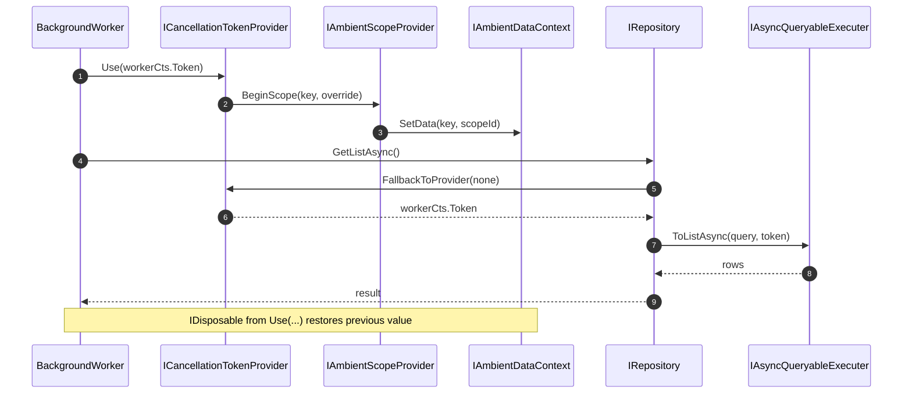

`Volo.Abp.Threading` is the *toolbox* — a small collection of utilities that make ABP's async-first design ergonomic in places where async is awkward: synchronous facades over async APIs (`AsyncHelper`), nested cancellation scopes (`ICancellationTokenProvider`), background timers that never overlap (`AbpAsyncTimer`, `AbpTimer`), provider-agnostic LINQ async (`IAsyncQueryableExecuter`), and the `AsyncLocal`-based ambient context primitives used by everything else (`IAmbientDataContext`, `IAmbientScopeProvider`). None of these are large, but together they are what allows ABP's UoW, current-tenant, current-user, current-culture and current-CancellationToken to flow through every `await` without explicit plumbing.

Most application code touches `IAsyncQueryableExecuter` (through the generic repository) and occasionally `AsyncHelper.RunSync` when integrating with sync-only APIs. The lower-level building blocks (`IAmbientScopeProvider`, `AsyncLocalAmbientDataContext`) underpin every ambient ABP service — knowing their shape helps when you write your own.

## File inventory

| File | Purpose |
| --- | --- |
| `Volo/Abp/Threading/AbpThreadingModule.cs` | Module class. Registers `NullCancellationTokenProvider.Instance` and `AmbientDataContextAmbientScopeProvider<>`. |
| `Volo/Abp/Threading/ICancellationTokenProvider.cs` | The contract for the ambient cancellation token. |
| `Volo/Abp/Threading/CancellationTokenProviderBase.cs` | Abstract base using an `IAmbientScopeProvider` for overrides. |
| `Volo/Abp/Threading/NullCancellationTokenProvider.cs` | Default singleton; returns `CancellationToken.None` unless overridden. |
| `Volo/Abp/Threading/CancellationTokenOverride.cs` | Wrapper carrying the override token. |
| `Volo/Abp/Threading/CancellationTokenProviderExtensions.cs` | `FallbackToProvider` extension. |
| `Volo/Abp/Threading/IAmbientDataContext.cs` | `SetData / GetData` on a string key. |
| `Volo/Abp/Threading/AsyncLocalAmbientDataContext.cs` | Default `IAmbientDataContext` using `AsyncLocal<object?>`. |
| `Volo/Abp/Threading/IAmbientScopeProvider.cs` | `GetValue / BeginScope` contract. |
| `Volo/Abp/Threading/AmbientDataContextAmbientScopeProvider.cs` | Default implementation; stacks scope items. |
| `Volo/Abp/Threading/AsyncLocalSimpleScopeExtensions.cs` | Tiny `AsyncLocal<T>.SetScoped(value)` helper. |
| `Volo/Abp/Threading/AbpTimer.cs` | Sync-event periodic timer. |
| `Volo/Abp/Threading/AbpAsyncTimer.cs` | Async-Func periodic timer. |
| `Volo/Abp/Threading/IRunnable.cs` | `StartAsync` / `StopAsync` contract for background services. |
| `Volo/Abp/Linq/IAsyncQueryableExecuter.cs` | Generic async LINQ contract. |
| `Volo/Abp/Linq/AsyncQueryableExecuter.cs` | Default implementation. |
| `Volo/Abp/Linq/IAsyncQueryableProvider.cs` | Per-provider hook (EF Core, MongoDB, in-memory). |
| `Volo.Abp.Core/Volo/Abp/Threading/AsyncHelper.cs` *(separate package)* | `AsyncHelper.RunSync`, `IsAsync`, `UnwrapTask`. |

## Key abstractions

| Type | Signature | Notes |
| --- | --- | --- |
| `AsyncHelper` (static) | `RunSync(Func<Task>)` / `RunSync<TResult>(Func<Task<TResult>>)` / `IsAsync(this MethodInfo)` / `UnwrapTask(Type)` | Lives in `Volo.Abp.Core`. Uses `Nito.AsyncEx.AsyncContext`. |
| `ICancellationTokenProvider` | `CancellationToken Token { get; }` + `IDisposable Use(CancellationToken)` | Inject into long-running services. |
| `IAmbientDataContext` | `SetData(string, object?)` / `GetData(string)` | The lowest-level primitive. |
| `IAmbientScopeProvider<T>` | `T? GetValue(string contextKey)` / `IDisposable BeginScope(string, T value)` | Stacks values per key. |
| `AbpAsyncTimer` | `Func<AbpAsyncTimer, Task> Elapsed`, `int Period`, `bool RunOnStart`, `Start` / `Stop` | No-overlap async timer. |
| `IAsyncQueryableExecuter` | `Task<bool> AnyAsync<T>(IQueryable<T>, …)` + 20 sibling methods | Generic repository's async LINQ. |

## `AsyncHelper`

```csharp
public static class AsyncHelper
{
    public static bool IsAsync([NotNull] this MethodInfo method)
    {
        Check.NotNull(method, nameof(method));
        return method.ReturnType.IsTaskOrTaskOfT();
    }

    public static bool IsTaskOrTaskOfT([NotNull] this Type type)
        => type == typeof(Task)
        || (type.GetTypeInfo().IsGenericType && type.GetGenericTypeDefinition() == typeof(Task<>));

    public static bool IsTaskOfT([NotNull] this Type type)
        => type.GetTypeInfo().IsGenericType && type.GetGenericTypeDefinition() == typeof(Task<>);

    public static Type UnwrapTask([NotNull] Type type)
    {
        if (type == typeof(Task)) return typeof(void);
        if (type.IsTaskOfT()) return type.GenericTypeArguments[0];
        return type;
    }

    public static TResult RunSync<TResult>(Func<Task<TResult>> func)
        => AsyncContext.Run(func);

    public static void RunSync(Func<Task> action)
        => AsyncContext.Run(action);
}
```

Two practical takeaways:

- **`RunSync` uses `Nito.AsyncEx.AsyncContext.Run`.** This pumps the async work on a *dedicated single-threaded synchronization context* and avoids the classic "deadlock on `.Result`" trap when running async code inside ASP.NET's request thread. Use it sparingly — it's the right answer for application start-up paths and interop with legacy sync APIs, but not for hot request handling.
- **`UnwrapTask` / `IsAsync`** are used throughout the framework's dynamic-proxy interceptors (`UnitOfWorkInterceptor`, `AuditInterceptor`, …) to decide whether to `await` a method invocation or wrap a synchronous return in `Task.FromResult`.

## `ICancellationTokenProvider`

```csharp
public interface ICancellationTokenProvider
{
    CancellationToken Token { get; }
    IDisposable Use(CancellationToken cancellationToken);
}
```

The contract has two purposes:

1. **Read the ambient token** (`Token`). Used by, e.g., `IDistributedCache` wrappers and repository helpers so they don't require callers to thread a `CancellationToken` through every signature.
2. **Override it inside a scope** (`Use`). Background workers that own their own lifecycle override the token for the duration of one iteration; the `IDisposable` restores the previous value.

### `CancellationTokenProviderBase`

```csharp
public abstract class CancellationTokenProviderBase : ICancellationTokenProvider
{
    public const string CancellationTokenOverrideContextKey = "Volo.Abp.Threading.CancellationToken.Override";

    public abstract CancellationToken Token { get; }

    protected IAmbientScopeProvider<CancellationTokenOverride> CancellationTokenOverrideScopeProvider { get; }

    protected CancellationTokenOverride? OverrideValue =>
        CancellationTokenOverrideScopeProvider.GetValue(CancellationTokenOverrideContextKey);

    protected CancellationTokenProviderBase(IAmbientScopeProvider<CancellationTokenOverride> scopeProvider)
    {
        CancellationTokenOverrideScopeProvider = scopeProvider;
    }

    public IDisposable Use(CancellationToken cancellationToken)
    {
        return CancellationTokenOverrideScopeProvider.BeginScope(
            CancellationTokenOverrideContextKey,
            new CancellationTokenOverride(cancellationToken));
    }
}
```

`Use` delegates to `IAmbientScopeProvider`, which stacks override values per context key. Pop happens through the returned `IDisposable`.

### `NullCancellationTokenProvider`

```csharp
public class NullCancellationTokenProvider : CancellationTokenProviderBase
{
    public static NullCancellationTokenProvider Instance { get; } = new();

    public override CancellationToken Token => OverrideValue?.CancellationToken ?? CancellationToken.None;

    private NullCancellationTokenProvider()
        : base(new AmbientDataContextAmbientScopeProvider<CancellationTokenOverride>(new AsyncLocalAmbientDataContext()))
    {
    }
}
```

The default registered by `AbpThreadingModule`. Returns `CancellationToken.None` unless `Use(token)` was called somewhere above on the call stack. ASP.NET Core hosting packages replace this with a provider that pulls `HttpContext.RequestAborted` so HTTP requests carry their own token automatically.

### `CancellationTokenOverride`

```csharp
public class CancellationTokenOverride
{
    public CancellationToken CancellationToken { get; }

    public CancellationTokenOverride(CancellationToken cancellationToken)
    {
        CancellationToken = cancellationToken;
    }
}
```

The wrapper exists because `IAmbientScopeProvider<T>` needs a reference type for `T` to safely propagate through `AsyncLocal`.

### `FallbackToProvider`

```csharp
public static class CancellationTokenProviderExtensions
{
    public static CancellationToken FallbackToProvider(this ICancellationTokenProvider provider, CancellationToken prefferedValue = default)
    {
        return prefferedValue == default || prefferedValue == CancellationToken.None
            ? provider.Token
            : prefferedValue;
    }
}
```

The standard pattern in ABP repositories:

```csharp
public Task<List<TEntity>> GetListAsync(CancellationToken cancellationToken = default)
{
    cancellationToken = _cancellationTokenProvider.FallbackToProvider(cancellationToken);
    // …
}
```

— passing a token wins; not passing one falls back to ambient.

## Ambient data context

### `IAmbientDataContext`

```csharp
public interface IAmbientDataContext
{
    void SetData(string key, object? value);
    object? GetData(string key);
}
```

### `AsyncLocalAmbientDataContext`

```csharp
public class AsyncLocalAmbientDataContext : IAmbientDataContext, ISingletonDependency
{
    private static readonly ConcurrentDictionary<string, AsyncLocal<object?>> AsyncLocalDictionary
        = new ConcurrentDictionary<string, AsyncLocal<object?>>();

    public void SetData(string key, object? value)
    {
        var asyncLocal = AsyncLocalDictionary.GetOrAdd(key, _ => new AsyncLocal<object?>());
        asyncLocal.Value = value;
    }

    public object? GetData(string key)
    {
        var asyncLocal = AsyncLocalDictionary.GetOrAdd(key, _ => new AsyncLocal<object?>());
        return asyncLocal.Value;
    }
}
```

A single `AsyncLocal<object?>` per logical key, shared across all callers using that key. `AsyncLocal` carries values across `await`s and parallel tasks via `ExecutionContext`, which is exactly what ambient services need.

### `IAmbientScopeProvider` and the default

```csharp
public interface IAmbientScopeProvider<T>
{
    T? GetValue(string contextKey);
    IDisposable BeginScope(string contextKey, T value);
}
```

```csharp
public class AmbientDataContextAmbientScopeProvider<T> : IAmbientScopeProvider<T>
{
    private static readonly ConcurrentDictionary<string, ScopeItem> ScopeDictionary
        = new ConcurrentDictionary<string, ScopeItem>();

    private readonly IAmbientDataContext _dataContext;

    public T? GetValue(string contextKey)
    {
        var item = GetCurrentItem(contextKey);
        return item == null ? default : item.Value;
    }

    public IDisposable BeginScope(string contextKey, T value)
    {
        var item = new ScopeItem(value, GetCurrentItem(contextKey));

        if (!ScopeDictionary.TryAdd(item.Id, item))
            throw new AbpException("Can not add item! ScopeDictionary.TryAdd returns false!");

        _dataContext.SetData(contextKey, item.Id);

        return new DisposeAction<ValueTuple<ConcurrentDictionary<string, ScopeItem>, ScopeItem, IAmbientDataContext, string>>(static (state) =>
        {
            var (scopeDictionary, item, dataContext, contextKey) = state;
            scopeDictionary.TryRemove(item.Id, out item);
            if (item == null) return;

            if (item.Outer == null)
            {
                dataContext.SetData(contextKey, null);
                return;
            }

            dataContext.SetData(contextKey, item.Outer.Id);
        }, (ScopeDictionary, item, _dataContext, contextKey));
    }

    private ScopeItem? GetCurrentItem(string contextKey)
        => _dataContext.GetData(contextKey) is string objKey ? ScopeDictionary.GetOrDefault(objKey) : null;

    private class ScopeItem
    {
        public string Id { get; }
        public ScopeItem? Outer { get; }
        public T Value { get; }

        public ScopeItem(T value, ScopeItem? outer = null)
        {
            Id = Guid.NewGuid().ToString();
            Value = value;
            Outer = outer;
        }
    }
}
```

This is the building block under almost every ABP ambient service:

- `ICurrentTenant.Change(tenantId)` calls `BeginScope`.
- `ICurrentPrincipalAccessor.Change(principal)` calls `BeginScope`.
- `ICurrentCulture.Use(culture)` calls `BeginScope`.

The `ScopeDictionary` stores items by GUID string keys; the `AsyncLocal` only carries the key, not the full object — this avoids capturing arbitrary references in `ExecutionContext` (which would defeat GC for the duration of the request).

### Tiny convenience helper

```csharp
public static class AsyncLocalSimpleScopeExtensions
{
    public static IDisposable SetScoped<T>(this AsyncLocal<T?> asyncLocal, T value)
    {
        var previousValue = asyncLocal.Value;
        asyncLocal.Value = value;
        return new DisposeAction<ValueTuple<AsyncLocal<T?>, T?>>(static (state) =>
        {
            var (asyncLocal, previousValue) = state;
            asyncLocal.Value = previousValue;
        }, (asyncLocal, previousValue));
    }
}
```

When you have a private `AsyncLocal<T>` and don't need the keyed scope of `IAmbientScopeProvider`, `asyncLocal.SetScoped(value)` is the one-liner.

## Module wiring

```csharp
public class AbpThreadingModule : AbpModule
{
    public override void ConfigureServices(ServiceConfigurationContext context)
    {
        context.Services.AddSingleton<ICancellationTokenProvider>(NullCancellationTokenProvider.Instance);
        context.Services.AddSingleton(typeof(IAmbientScopeProvider<>), typeof(AmbientDataContextAmbientScopeProvider<>));
    }
}
```

Two registrations: the null cancellation provider (replaced by the ASP.NET Core integration with one that pulls `HttpContext.RequestAborted`) and the open-generic ambient scope provider that every consumer relies on.

## `AbpAsyncTimer` — periodic async work that never overlaps

```csharp
public class AbpAsyncTimer : ITransientDependency
{
    public Func<AbpAsyncTimer, Task> Elapsed = _ => Task.CompletedTask;

    public int Period { get; set; }
    public bool RunOnStart { get; set; }

    public ILogger<AbpAsyncTimer> Logger { get; set; }
    public IExceptionNotifier ExceptionNotifier { get; set; }

    private readonly Timer _taskTimer;
    private volatile bool _performingTasks;
    private volatile bool _isRunning;

    public AbpAsyncTimer()
    {
        ExceptionNotifier = NullExceptionNotifier.Instance;
        Logger = NullLogger<AbpAsyncTimer>.Instance;
        _taskTimer = new Timer(TimerCallBack!, null, Timeout.Infinite, Timeout.Infinite);
    }

    public void Start(CancellationToken cancellationToken = default)
    {
        if (Period <= 0) throw new AbpException("Period should be set before starting the timer!");
        lock (_taskTimer)
        {
            _taskTimer.Change(RunOnStart ? 0 : Period, Timeout.Infinite);
            _isRunning = true;
        }
    }

    public void Stop(CancellationToken cancellationToken = default)
    {
        lock (_taskTimer)
        {
            _taskTimer.Change(Timeout.Infinite, Timeout.Infinite);
            while (_performingTasks) Monitor.Wait(_taskTimer);
            _isRunning = false;
        }
    }

    private void TimerCallBack(object state)
    {
        lock (_taskTimer)
        {
            if (!_isRunning || _performingTasks) return;
            _taskTimer.Change(Timeout.Infinite, Timeout.Infinite);
            _performingTasks = true;
        }
        _ = Timer_Elapsed();
    }

    private async Task Timer_Elapsed()
    {
        try
        {
            await Elapsed(this);
        }
        catch (Exception ex)
        {
            Logger.LogException(ex);
            await ExceptionNotifier.NotifyAsync(ex);
        }
        finally
        {
            lock (_taskTimer)
            {
                _performingTasks = false;
                if (_isRunning) _taskTimer.Change(Period, Timeout.Infinite);
                Monitor.Pulse(_taskTimer);
            }
        }
    }
}
```

The contract: **`Elapsed` runs no more often than every `Period` milliseconds, and *never* concurrently with itself**. This is what background-job processors and outbox dispatchers want — overlap would re-process the same row twice. The `_performingTasks` flag, the disabling change inside `TimerCallBack`, and the re-schedule in `finally` together implement the no-overlap guarantee.

`AbpTimer` is the sync sibling — same shape but with `event EventHandler Elapsed`. Use it when your tick handler is fully synchronous.

## `IAsyncQueryableExecuter`

```csharp
public class AsyncQueryableExecuter : IAsyncQueryableExecuter, ISingletonDependency
{
    protected IEnumerable<IAsyncQueryableProvider> Providers { get; }

    public AsyncQueryableExecuter(IEnumerable<IAsyncQueryableProvider> providers)
    {
        Providers = providers;
    }

    protected virtual IAsyncQueryableProvider? FindProvider<T>(IQueryable<T> queryable)
    {
        return Providers.FirstOrDefault(p => p.CanExecute(queryable));
    }

    public Task<bool> AnyAsync<T>(IQueryable<T> queryable, CancellationToken cancellationToken = default)
    {
        var provider = FindProvider(queryable);
        return provider != null
            ? provider.AnyAsync(queryable, cancellationToken)
            : Task.FromResult(queryable.Any());
    }

    public Task<int> CountAsync<T>(IQueryable<T> queryable, CancellationToken cancellationToken = default)
    {
        var provider = FindProvider(queryable);
        return provider != null
            ? provider.CountAsync(queryable, cancellationToken)
            : Task.FromResult(queryable.Count());
    }

    // … FirstAsync, LongCountAsync, ToListAsync, MinAsync, MaxAsync, SumAsync, AverageAsync …
}
```

Each `IQueryable<T>` flows through every registered `IAsyncQueryableProvider`; the first one that `CanExecute` it owns the call. EF Core's `AbpEntityFrameworkCoreAsyncQueryableProvider` recognises `IQueryable<T>` instances that came out of a `DbSet`; the MongoDB provider recognises `IMongoQueryable<T>`; the generic LINQ-to-Objects fallback executes synchronously and wraps the result in `Task.FromResult`.

The benefit for application code is that you can write:

```csharp
public Task<int> CountActiveAsync()
{
    var queryable = _repo.GetQueryableAsync().Result;  // illustrative
    return _asyncExecuter.CountAsync(queryable.Where(x => x.IsActive));
}
```

…and never hard-code a dependency on `EntityFrameworkQueryableExtensions.CountAsync`. The same code recompiles unchanged against MongoDB or an in-memory test backend.

## `IRunnable`

```csharp
public interface IRunnable
{
    Task StartAsync(CancellationToken cancellationToken = default);
    Task StopAsync(CancellationToken cancellationToken = default);
}
```

The contract that every ABP background worker conforms to. Used by `AbpBackgroundWorkerManager` (in `Volo.Abp.BackgroundWorkers`) to drive a list of workers as part of host start/stop. Typical implementations wrap an `AbpAsyncTimer`.

## End-to-end sequence: scoped cancellation



## Pitfalls

- **`AsyncHelper.RunSync` inside ASP.NET request handling** still risks thread-pool exhaustion. Use async all the way through and reserve `RunSync` for module start-up.
- **`AsyncLocal` and pooled background threads**. If you queue work via `Task.Run`, `AsyncLocal` propagates correctly; if you use `ThreadPool.QueueUserWorkItem` with `flowExecutionContext: false`, it does not. The `AbpAsyncTimer` uses `Timer` callbacks, which *do* flow the context — so ambient services like the cancellation provider remain valid inside `Elapsed`.
- **Modifying the `Period` while the timer is running** has no effect until the next reschedule. Stop / change / start if you need to reconfigure.
- **`AbpAsyncTimer.Elapsed` exceptions** are swallowed (logged + notified) so the timer doesn't crash; if your handler must propagate, set a flag and check it externally.
- **`IAsyncQueryableExecuter` falls back to synchronous execution** when no provider matches. In test code that runs against in-memory `List<T>.AsQueryable()`, this is the correct behaviour — but watch out: if you accidentally call `ToListAsync` on a non-EF query in production, you've lost async I/O.

## Related pages

- [Unit of Work](./uow) — uses `IAmbientScopeProvider` indirectly to expose the current UoW.
- [Timing](./timing) — `IClock` and the `AbpTimer` helpers.
- [Volo.Abp.Data](./volo-abp-data) — `IDataFilter` and the data-filter scope are built on the same ambient-context primitives.
